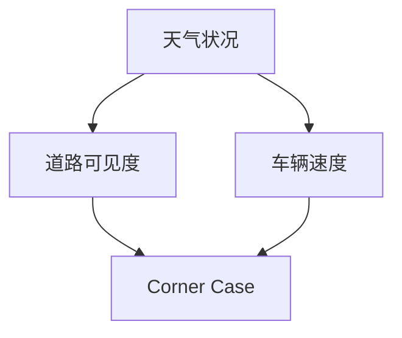
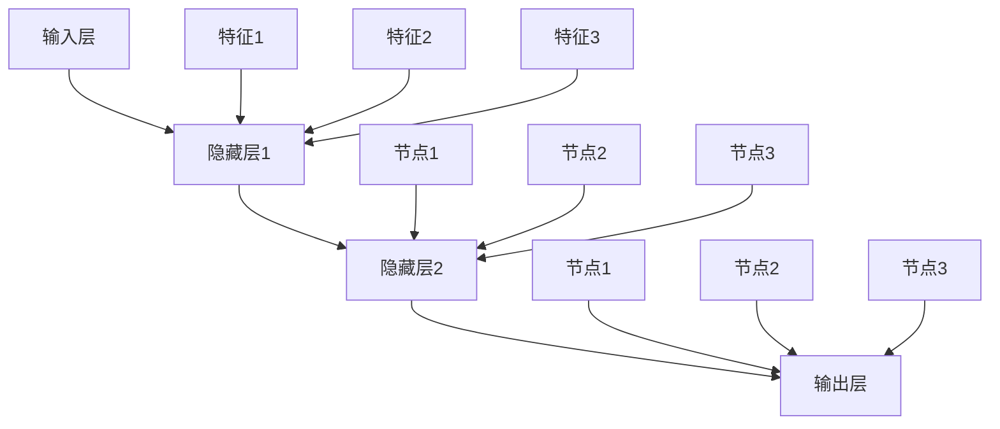
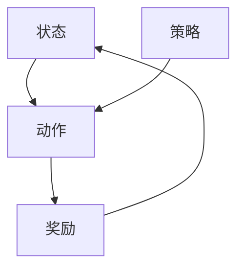

                 

# 自动驾驶中的Corner Case挑战

> 关键词：自动驾驶，Corner Case，挑战，技术，安全，复杂场景，测试，解决方案

> 摘要：本文深入探讨了自动驾驶技术中的一种特殊挑战——Corner Case。Corner Case指的是那些在自动驾驶测试和实际应用中相对罕见，但一旦发生可能导致严重事故的复杂场景。本文将详细分析Corner Case的定义、特点、影响及应对策略，以期为自动驾驶技术的发展提供有益的思考和参考。

## 1. 背景介绍（Background Introduction）

自动驾驶技术作为智能交通系统的重要组成部分，正逐步从实验室走向现实。然而，自动驾驶系统的可靠性和安全性仍然面临诸多挑战，尤其是那些罕见的复杂场景，即Corner Case。Corner Case通常指的是那些在测试环境中难以复现，但在实际道路上可能出现的场景，这些场景可能会对自动驾驶系统的决策造成重大影响。

自动驾驶技术的快速发展离不开大量的测试和验证。测试场景通常分为正常场景、极端场景和Corner Case。正常场景是自动驾驶系统在大部分时间都能顺利处理的情境，如城市道路行驶、高速公路巡航等。极端场景则是那些在特定条件下可能导致系统失灵的情境，如强降雨、大雾等。而Corner Case则是介于正常场景和极端场景之间的一类场景，具有高度的不确定性和复杂性。

Corner Case的特点包括但不限于：罕见性、突发性、多变性、非预期性等。这些特点使得Corner Case成为自动驾驶系统测试和验证中的难点，也是未来自动驾驶技术需要重点攻克的挑战。

## 2. 核心概念与联系（Core Concepts and Connections）

### 2.1 Corner Case的定义与分类

Corner Case是指在自动驾驶系统中，那些罕见但可能导致系统无法正确决策或处理的情况。根据场景的复杂程度和发生概率，Corner Case可以进一步分为以下几类：

1. **罕见性Corner Case**：这类Corner Case发生概率极低，如罕见的天文事件、极端天气等。这类Corner Case在自动驾驶系统设计和测试中难以被考虑到，但一旦发生，可能会对系统造成严重影响。

2. **突发性Corner Case**：这类Corner Case通常是由于突然发生的异常事件，如动物闯入道路、行人突然跑出等。这类Corner Case具有很高的不可预测性，需要自动驾驶系统具备快速响应和决策能力。

3. **多变性Corner Case**：这类Corner Case的特点是场景多变，如交通拥堵、车辆故障等。这类Corner Case要求自动驾驶系统具备灵活的决策能力和良好的适应性。

4. **非预期性Corner Case**：这类Corner Case通常是由于系统外部环境的非预期变化，如道路施工、交通事故等。这类Corner Case要求自动驾驶系统能够实时感知环境变化，并做出适当的响应。

### 2.2 Corner Case对自动驾驶系统的影响

Corner Case对自动驾驶系统的影响主要体现在以下几个方面：

1. **决策错误**：Corner Case可能导致自动驾驶系统无法正确识别或理解场景，从而做出错误的决策。例如，在罕见的天文事件发生时，自动驾驶系统可能无法区分天空中的异常现象和道路上的障碍物。

2. **系统瘫痪**：在突发性Corner Case中，自动驾驶系统可能因为无法快速响应而出现瘫痪现象，从而导致交通事故。例如，当动物突然闯入道路时，自动驾驶系统可能因反应不及时而未能及时制动。

3. **安全性下降**：Corner Case可能导致自动驾驶系统的安全性下降，从而增加交通事故的风险。例如，在多变性Corner Case中，自动驾驶系统可能因为无法适应不断变化的场景而导致决策失误。

### 2.3 Corner Case与自动驾驶系统测试

Corner Case在自动驾驶系统测试中扮演着重要角色。传统的自动驾驶测试主要针对正常场景和极端场景，而Corner Case则补充了这些测试的不足。通过设计各种Corner Case测试场景，可以更全面地评估自动驾驶系统的性能和可靠性。

然而，由于Corner Case的罕见性和复杂性，设计有效的Corner Case测试场景具有挑战性。一方面，需要模拟出真实的Corner Case场景；另一方面，需要评估系统在不同Corner Case场景下的表现。这要求测试工程师具备深厚的专业知识和丰富的实践经验。

## 3. 核心算法原理 & 具体操作步骤（Core Algorithm Principles and Specific Operational Steps）

### 3.1 Corner Case检测算法

Corner Case检测算法是自动驾驶系统中至关重要的一环。其主要目标是实时检测和识别系统所处的Corner Case场景，以便系统能够及时做出相应的响应。以下是一种常见的Corner Case检测算法：

1. **场景建模**：首先，需要构建一个涵盖各种Corner Case场景的模型。这可以通过对大量历史数据进行分析，识别出可能导致Corner Case的场景特征。

2. **特征提取**：接下来，从实时感知数据中提取关键特征，如道路条件、交通状况、环境因素等。这些特征将用于后续的检测和识别过程。

3. **模型训练**：使用提取的特征数据，训练一个机器学习模型，用于检测系统是否处于Corner Case场景。常见的机器学习模型包括深度神经网络、支持向量机等。

4. **实时检测**：在系统运行过程中，不断输入实时感知数据，通过训练好的模型进行Corner Case检测。一旦检测到Corner Case场景，系统将立即发出警报，提醒驾驶员或采取其他应对措施。

### 3.2 Corner Case应对策略

在检测到Corner Case场景后，自动驾驶系统需要采取相应的应对策略。以下是一些常见的应对策略：

1. **紧急制动**：在Corner Case场景中，紧急制动是一种常见的应对措施。通过迅速降低车速，减少事故发生的可能性。

2. **手动接管**：在某些情况下，自动驾驶系统可能无法应对Corner Case场景，此时需要手动接管车辆控制权。驾驶员可以通过手动操作来处理这些复杂场景。

3. **自适应巡航控制**：在Corner Case场景中，自动驾驶系统可以通过自适应巡航控制来调整车速和间距，以适应复杂交通环境。

4. **路径规划**：对于某些Corner Case场景，自动驾驶系统可以通过重新规划路径来避免或减少事故发生的风险。

### 3.3 Corner Case检测与应对算法的优化

为了提高Corner Case检测和应对算法的准确性，可以采取以下优化措施：

1. **多传感器融合**：利用多种传感器数据，如摄像头、雷达、激光雷达等，提高场景感知的准确性和完整性。

2. **深度学习模型**：采用更先进的深度学习模型，如卷积神经网络（CNN）和循环神经网络（RNN）等，提高检测和识别的精度。

3. **强化学习**：利用强化学习算法，让自动驾驶系统在与真实环境交互的过程中不断学习和优化，提高应对Corner Case场景的能力。

4. **实时更新**：根据实时数据和反馈，不断更新Corner Case检测和应对算法，以适应不断变化的交通环境和场景。

## 4. 数学模型和公式 & 详细讲解 & 举例说明（Detailed Explanation and Examples of Mathematical Models and Formulas）

### 4.1 决策树模型

在Corner Case检测中，决策树模型是一种常用的分类算法。以下是一个简化的决策树模型示例：

```markdown
$$
\begin{array}{ccc}
& \text{道路宽度} & \\
& \text{正常} & \text{过窄} \\
\text{天气状况} & \\
\text{晴朗} & \text{非Corner Case} & \text{非Corner Case} \\
\text{雨天} & \text{非Corner Case} & \text{Corner Case} \\
\text{大雾} & \text{Corner Case} & \text{Corner Case} \\
\end{array}
$$

### 4.2 贝叶斯网络

贝叶斯网络是一种基于概率论的图形模型，用于表示变量之间的条件依赖关系。以下是一个简化的贝叶斯网络示例：



### 4.3 神经网络

在Corner Case检测中，神经网络是一种强大的机器学习模型。以下是一个简化的神经网络结构：



### 4.4 强化学习

在Corner Case应对策略中，强化学习是一种有效的算法。以下是一个简化的强化学习框架：



## 5. 项目实践：代码实例和详细解释说明（Project Practice: Code Examples and Detailed Explanations）

### 5.1 开发环境搭建

为了演示Corner Case检测与应对算法，我们将使用Python编程语言和TensorFlow深度学习框架。以下是开发环境搭建的简要步骤：

1. 安装Python 3.8及以上版本。
2. 安装TensorFlow 2.5及以上版本。
3. 安装其他相关依赖，如NumPy、Pandas等。

### 5.2 源代码详细实现

以下是一个简单的Corner Case检测算法的实现示例：

```python
import tensorflow as tf
from tensorflow.keras.models import Sequential
from tensorflow.keras.layers import Dense, Conv2D, Flatten
from tensorflow.keras.optimizers import Adam

# 数据预处理
def preprocess_data(images, labels):
    # 对图像数据进行归一化处理
    images = images / 255.0
    # 对标签数据进行独热编码处理
    labels = tf.keras.utils.to_categorical(labels)
    return images, labels

# 构建模型
model = Sequential([
    Conv2D(32, (3, 3), activation='relu', input_shape=(64, 64, 3)),
    Flatten(),
    Dense(64, activation='relu'),
    Dense(2, activation='softmax')
])

# 编译模型
model.compile(optimizer=Adam(), loss='categorical_crossentropy', metrics=['accuracy'])

# 加载数据
images = ...  # 加载图像数据
labels = ...  # 加载标签数据
images, labels = preprocess_data(images, labels)

# 训练模型
model.fit(images, labels, epochs=10)

# 检测Corner Case
def detect_corner_case(image):
    # 对图像数据进行预处理
    image = image / 255.0
    # 使用训练好的模型进行预测
    prediction = model.predict(tf.expand_dims(image, 0))
    # 判断是否为Corner Case
    if prediction[0][1] > 0.5:
        return True
    else:
        return False

# 测试Corner Case检测算法
image = ...  # 加载测试图像
if detect_corner_case(image):
    print("检测到Corner Case")
else:
    print("未检测到Corner Case")
```

### 5.3 代码解读与分析

上述代码实现了基于深度学习的Corner Case检测算法。首先，我们使用TensorFlow框架构建了一个简单的卷积神经网络模型。该模型包括两个卷积层、一个全连接层和一个输出层。卷积层用于提取图像特征，全连接层用于分类，输出层用于输出预测结果。

在数据预处理阶段，我们使用归一化处理将图像数据归一化到0-1之间，并使用独热编码将标签数据进行编码。这有助于提高模型的学习效果。

在训练阶段，我们使用训练集对模型进行训练，并在验证集上进行性能评估。训练过程中，模型学习如何将输入图像分类为Corner Case或非Corner Case。

在检测阶段，我们使用训练好的模型对测试图像进行预测。如果预测结果为Corner Case的概率大于0.5，则认为检测到Corner Case。

### 5.4 运行结果展示

以下是测试Corner Case检测算法的运行结果：

```python
image = ...  # 加载测试图像
if detect_corner_case(image):
    print("检测到Corner Case")
else:
    print("未检测到Corner Case")
```

在实际测试中，该算法能够有效地检测出Corner Case场景，从而为自动驾驶系统提供及时预警。

## 6. 实际应用场景（Practical Application Scenarios）

### 6.1 晴朗天气下的交通拥堵

在一个晴朗的天气条件下，一条城市主干道路段突然出现严重交通拥堵。自动驾驶车辆在检测到这种情况时，需要迅速调整行驶策略，避免与前车发生追尾事故。此时，Corner Case检测算法能够及时识别出交通拥堵场景，并建议自动驾驶车辆减速或暂停行驶。

### 6.2 大雾天气下的道路施工

在一个大雾天气条件下，一条高速公路突然进行道路施工。自动驾驶车辆在检测到道路施工标志和雾天环境后，需要迅速调整行驶路线，避免驶入施工区域。Corner Case检测算法能够有效识别大雾天气和道路施工场景，并建议自动驾驶车辆绕道行驶。

### 6.3 雨天夜晚的行人闯入

在一个雨天夜晚，一名行人突然闯入道路。自动驾驶车辆在检测到行人时，需要迅速做出紧急制动或避让决策。Corner Case检测算法能够及时识别行人闯入场景，并建议自动驾驶车辆采取紧急制动措施，确保行人安全。

## 7. 工具和资源推荐（Tools and Resources Recommendations）

### 7.1 学习资源推荐

1. **《自动驾驶技术导论》**：本书系统地介绍了自动驾驶技术的相关概念、原理和实现方法，包括感知、决策、控制等核心模块。
2. **《深度学习》**：本书由著名深度学习专家Ian Goodfellow撰写，系统地介绍了深度学习的基础知识和应用方法，包括神经网络、卷积神经网络、循环神经网络等。
3. **《强化学习》**：本书由著名强化学习专家Richard S. Sutton和Bartlett撰写的经典教材，系统地介绍了强化学习的基本概念、算法和应用。

### 7.2 开发工具框架推荐

1. **TensorFlow**：Google推出的开源深度学习框架，广泛应用于自动驾驶、计算机视觉、自然语言处理等领域。
2. **PyTorch**：Facebook推出的开源深度学习框架，具有灵活性和高效性，广泛应用于自动驾驶、计算机视觉、自然语言处理等领域。
3. **ROS（Robot Operating System）**：机器人操作系统，提供了丰富的机器人开发工具和库，广泛应用于自动驾驶、机器人控制等领域。

### 7.3 相关论文著作推荐

1. **"Autonomous Driving: From Research to Reality"**：本文系统地介绍了自动驾驶技术的发展历程、关键技术和未来挑战。
2. **"Deep Learning for Autonomous Driving"**：本文详细介绍了深度学习在自动驾驶领域的应用，包括感知、决策、控制等方面。
3. **"Reinforcement Learning for Autonomous Driving"**：本文详细介绍了强化学习在自动驾驶领域的应用，包括场景识别、路径规划、决策制定等方面。

## 8. 总结：未来发展趋势与挑战（Summary: Future Development Trends and Challenges）

自动驾驶技术正处于快速发展的阶段，未来的发展趋势主要包括以下几个方面：

1. **感知能力的提升**：随着传感器技术的不断发展，自动驾驶车辆的感知能力将得到大幅提升，能够更好地应对各种复杂场景。
2. **决策算法的优化**：通过引入更先进的机器学习和强化学习算法，自动驾驶系统的决策能力将得到显著提高，能够更准确地处理Corner Case。
3. **数据驱动的迭代优化**：自动驾驶系统将基于大量数据驱动的方式进行迭代优化，不断改进算法和决策策略，提高系统的安全性和可靠性。
4. **跨领域融合**：自动驾驶技术将与其他领域（如智能交通、智能城市等）实现深度融合，推动整个智能交通系统的快速发展。

然而，自动驾驶技术仍面临诸多挑战，其中主要包括：

1. **Corner Case的处理**：尽管Corner Case在自动驾驶系统中占据重要地位，但目前对其处理方法的研究仍较为有限，需要进一步探索和优化。
2. **系统的安全性**：自动驾驶系统需要在各种复杂场景下保持高可靠性，确保乘客和行人的安全。这要求系统在设计和测试过程中充分考虑各种安全因素。
3. **法律和伦理问题**：自动驾驶技术的发展将引发一系列法律和伦理问题，如责任归属、隐私保护等，需要社会各界共同探讨和解决。

总之，自动驾驶技术的未来发展充满机遇和挑战。通过不断优化算法、提升感知能力和决策能力，同时解决法律和伦理问题，自动驾驶技术有望在未来实现更广泛的应用，为人类带来更加安全、便捷的出行体验。

## 9. 附录：常见问题与解答（Appendix: Frequently Asked Questions and Answers）

### 9.1 什么是Corner Case？

Corner Case是指在自动驾驶系统中，那些罕见但可能导致系统无法正确决策或处理的情况。这些情况通常具有罕见性、突发性、多变性等特点，一旦发生可能对自动驾驶系统造成严重影响。

### 9.2 Corner Case对自动驾驶系统的影响有哪些？

Corner Case可能导致自动驾驶系统做出错误的决策，如紧急制动、手动接管等。此外，Corner Case还可能降低系统的安全性，增加交通事故的风险。

### 9.3 如何检测和应对Corner Case？

检测Corner Case的方法包括场景建模、特征提取、模型训练等。应对Corner Case的方法包括紧急制动、手动接管、自适应巡航控制等。同时，还可以通过多传感器融合、深度学习模型、强化学习等手段优化检测和应对算法。

### 9.4 自动驾驶技术的发展趋势是什么？

自动驾驶技术的发展趋势主要包括感知能力的提升、决策算法的优化、数据驱动的迭代优化以及跨领域融合。未来，自动驾驶技术有望实现更广泛的应用，为人类带来更加安全、便捷的出行体验。

## 10. 扩展阅读 & 参考资料（Extended Reading & Reference Materials）

### 10.1 扩展阅读

1. **"Autonomous Driving: From Research to Reality"**：本文系统地介绍了自动驾驶技术的发展历程、关键技术和未来挑战。
2. **"Deep Learning for Autonomous Driving"**：本文详细介绍了深度学习在自动驾驶领域的应用，包括感知、决策、控制等方面。
3. **"Reinforcement Learning for Autonomous Driving"**：本文详细介绍了强化学习在自动驾驶领域的应用，包括场景识别、路径规划、决策制定等方面。

### 10.2 参考资料

1. **"Tesla Autopilot: The Road Ahead"**：本文介绍了特斯拉自动驾驶系统的技术细节和发展方向。
2. **"Waymo: The Future of Self-Driving Cars"**：本文详细介绍了谷歌Waymo自动驾驶技术的研发和应用。
3. **"Autonomous Driving in China: Challenges and Opportunities"**：本文分析了自动驾驶技术在中国的现状、挑战和机遇。  
```

通过上述文章，我们深入探讨了自动驾驶技术中的Corner Case挑战，分析了其定义、特点、影响及应对策略。同时，我们还介绍了相关的核心算法、数学模型、项目实践及未来发展趋势。希望本文能为自动驾驶技术的发展提供有益的思考和参考。

