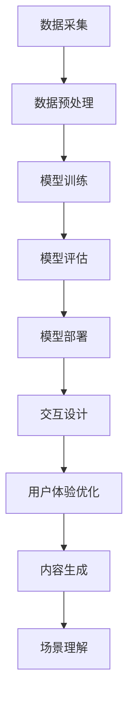
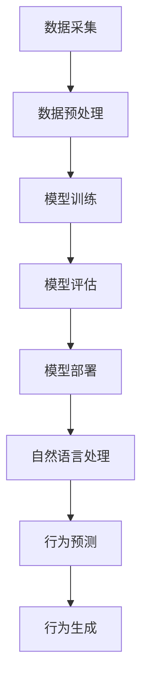
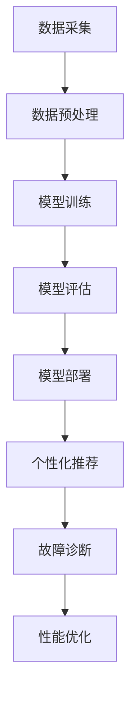
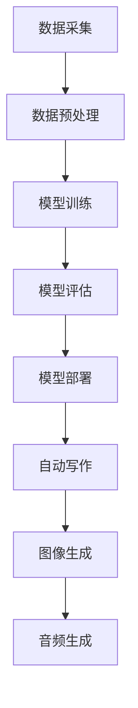
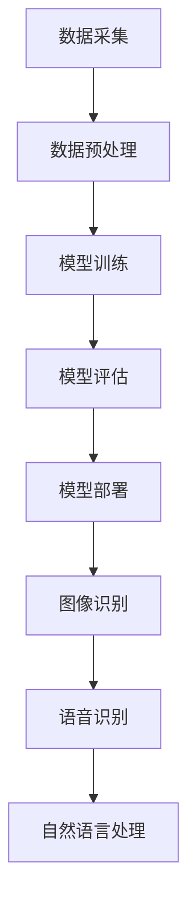

                 

### 文章标题

**AI大模型在虚拟现实领域的应用趋势**

> **关键词：** AI大模型、虚拟现实、应用趋势、增强现实、混合现实、交互设计、用户体验、技术挑战、行业应用

**摘要：** 本文将深入探讨AI大模型在虚拟现实（VR）领域的应用趋势。随着AI技术的迅猛发展，AI大模型在VR中的应用正逐步成为现实。本文首先介绍了AI大模型和虚拟现实的基本概念，然后分析了AI大模型在VR中的应用原理和优势。接下来，文章详细讨论了AI大模型在虚拟现实中的核心应用场景，包括交互设计、用户体验优化、内容生成、场景理解等方面。随后，文章探讨了AI大模型在虚拟现实领域的实际应用案例，并提出了未来发展趋势与挑战。最后，文章总结了AI大模型在虚拟现实领域的应用前景，为相关领域的研究者和从业者提供了有益的参考。

### 1. 背景介绍（Background Introduction）

虚拟现实（Virtual Reality，简称VR）是一种通过计算机技术生成三维空间环境，使用户能够沉浸其中的技术。VR技术具有高度的沉浸感和交互性，能够模拟出与现实世界极为相似的体验，广泛应用于娱乐、教育、医疗、军事、设计等多个领域。

近年来，随着计算机视觉、图形学、人工智能等技术的快速发展，虚拟现实技术也取得了显著的进步。尤其是AI大模型的引入，为虚拟现实领域带来了新的发展机遇。AI大模型，通常指的是具有数万亿参数的深度学习模型，如GPT-3、BERT等，它们在自然语言处理、计算机视觉、语音识别等领域取得了突破性的成果。

AI大模型在虚拟现实中的应用主要涉及以下几个方面：

1. **交互设计**：AI大模型可以用于设计更为自然、直观的交互界面，提升用户体验。
2. **用户体验优化**：通过分析用户行为和偏好，AI大模型可以优化虚拟现实内容，提升用户体验。
3. **内容生成**：AI大模型可以自动生成虚拟现实内容，如场景、角色、故事等，降低内容创作成本。
4. **场景理解**：AI大模型可以理解和分析虚拟现实场景，提供更为智能的服务和交互。

随着AI大模型技术的不断成熟，其在虚拟现实领域的应用将越来越广泛，有望带来全新的用户体验和技术突破。

### 2. 核心概念与联系（Core Concepts and Connections）

#### 2.1 AI大模型的基本原理

AI大模型是指具有数万亿参数的深度学习模型，如GPT-3、BERT等。这些模型通过在海量数据上进行训练，可以自动学习并提取数据中的规律和特征。AI大模型的核心技术包括：

1. **大规模神经网络**：AI大模型通常采用多层神经网络结构，能够处理大量数据和复杂的任务。
2. **注意力机制**：注意力机制能够帮助模型关注重要的输入信息，提高模型的效率和准确性。
3. **预训练与微调**：AI大模型通常采用预训练策略，在大量未标注的数据上进行训练，然后再针对特定任务进行微调。

#### 2.2 虚拟现实的基本原理

虚拟现实（VR）是通过计算机技术生成三维空间环境，使用户能够沉浸其中的技术。虚拟现实的基本原理包括：

1. **三维建模**：使用计算机图形学技术创建三维模型，模拟现实世界中的物体和场景。
2. **传感器技术**：使用传感器技术捕捉用户的动作和位置，实现与现实世界的互动。
3. **显示技术**：使用高分辨率显示器或头戴式显示器（HMD）呈现虚拟世界，提供沉浸式体验。

#### 2.3 AI大模型与虚拟现实的联系

AI大模型与虚拟现实之间的联系主要体现在以下几个方面：

1. **交互设计**：AI大模型可以用于设计更为自然、直观的交互界面，通过学习用户的行为和偏好，实现智能化的交互。
2. **用户体验优化**：AI大模型可以分析用户的行为和反馈，优化虚拟现实内容，提升用户体验。
3. **内容生成**：AI大模型可以自动生成虚拟现实内容，如场景、角色、故事等，降低内容创作成本。
4. **场景理解**：AI大模型可以理解和分析虚拟现实场景，提供更为智能的服务和交互。

以下是一个简单的Mermaid流程图，展示AI大模型在虚拟现实中的应用原理：



### 3. 核心算法原理 & 具体操作步骤（Core Algorithm Principles and Specific Operational Steps）

#### 3.1 交互设计

AI大模型在交互设计中的应用主要体现在以下几个方面：

1. **自然语言处理**：通过自然语言处理（NLP）技术，AI大模型可以理解用户的语言输入，并生成相应的文本输出，实现人机对话。
2. **行为预测**：通过分析用户的历史行为数据，AI大模型可以预测用户的下一步操作，提供个性化的交互建议。
3. **行为生成**：基于用户的反馈和交互历史，AI大模型可以自动生成新的交互行为，提高交互的自然性和智能性。

具体操作步骤如下：

1. 数据采集：收集用户的行为数据，包括文本输入、语音输入、操作记录等。
2. 数据预处理：对采集到的数据进行分析和清洗，去除噪声和无关信息。
3. 模型训练：使用预处理后的数据训练AI大模型，如使用GPT-3、BERT等模型。
4. 模型评估：对训练好的模型进行评估，确保其性能和准确性。
5. 模型部署：将训练好的模型部署到虚拟现实系统中，实现交互设计功能。

以下是一个简单的Mermaid流程图，展示交互设计的具体操作步骤：



#### 3.2 用户体验优化

AI大模型在用户体验优化中的应用主要体现在以下几个方面：

1. **个性化推荐**：通过分析用户的行为和偏好，AI大模型可以推荐个性化的虚拟现实内容，提升用户满意度。
2. **故障诊断**：通过监测虚拟现实系统的运行状态，AI大模型可以识别和诊断系统故障，提高系统稳定性。
3. **性能优化**：通过分析虚拟现实系统的性能数据，AI大模型可以提出优化建议，提高系统性能。

具体操作步骤如下：

1. 数据采集：收集用户的行为数据，包括浏览记录、操作记录、系统性能数据等。
2. 数据预处理：对采集到的数据进行分析和清洗，去除噪声和无关信息。
3. 模型训练：使用预处理后的数据训练AI大模型，如使用GPT-3、BERT等模型。
4. 模型评估：对训练好的模型进行评估，确保其性能和准确性。
5. 模型部署：将训练好的模型部署到虚拟现实系统中，实现用户体验优化功能。

以下是一个简单的Mermaid流程图，展示用户体验优化的具体操作步骤：



#### 3.3 内容生成

AI大模型在内容生成中的应用主要体现在以下几个方面：

1. **自动写作**：通过自然语言处理技术，AI大模型可以自动生成文本内容，如故事、剧本、新闻等。
2. **图像生成**：通过生成对抗网络（GAN）技术，AI大模型可以生成高质量的图像，如场景、角色、表情等。
3. **音频生成**：通过深度学习技术，AI大模型可以生成自然、真实的音频内容，如语音、音乐、声音效果等。

具体操作步骤如下：

1. 数据采集：收集相关的文本、图像、音频数据。
2. 数据预处理：对采集到的数据进行分析和清洗，去除噪声和无关信息。
3. 模型训练：使用预处理后的数据训练AI大模型，如使用GPT-3、BERT、GAN等模型。
4. 模型评估：对训练好的模型进行评估，确保其性能和准确性。
5. 模型部署：将训练好的模型部署到虚拟现实系统中，实现内容生成功能。

以下是一个简单的Mermaid流程图，展示内容生成的具体操作步骤：



#### 3.4 场景理解

AI大模型在场景理解中的应用主要体现在以下几个方面：

1. **图像识别**：通过计算机视觉技术，AI大模型可以识别和理解图像中的内容，如物体、场景、动作等。
2. **语音识别**：通过深度学习技术，AI大模型可以识别和理解语音中的内容，如语言、语义、意图等。
3. **自然语言处理**：通过自然语言处理技术，AI大模型可以理解和分析文本内容，如语义、情感、意图等。

具体操作步骤如下：

1. 数据采集：收集相关的图像、语音、文本数据。
2. 数据预处理：对采集到的数据进行分析和清洗，去除噪声和无关信息。
3. 模型训练：使用预处理后的数据训练AI大模型，如使用GPT-3、BERT、GAN等模型。
4. 模型评估：对训练好的模型进行评估，确保其性能和准确性。
5. 模型部署：将训练好的模型部署到虚拟现实系统中，实现场景理解功能。

以下是一个简单的Mermaid流程图，展示场景理解的具体操作步骤：



### 4. 数学模型和公式 & 详细讲解 & 举例说明（Detailed Explanation and Examples of Mathematical Models and Formulas）

#### 4.1 自然语言处理（NLP）

自然语言处理是AI大模型在虚拟现实应用中的重要方面，其核心在于理解和生成自然语言。以下是几个关键数学模型和公式：

1. **词嵌入（Word Embedding）**：
   词嵌入是将词汇映射到高维向量空间的过程。常用的词嵌入模型有Word2Vec、GloVe等。

   公式表示：
   $$ \textbf{v}_w = \text{WordEmbedding}(\textit{w}) $$

   其中，$\textbf{v}_w$ 是词汇 $w$ 的向量表示。

2. **循环神经网络（RNN）**：
   RNN 是处理序列数据的常用模型，包括LSTM和GRU等变体。

   LSTM 的核心公式包括：
   $$ i_t = \sigma(W_{ix}x_t + W_{ih}h_{t-1} + b_i) $$
   $$ f_t = \sigma(W_{fx}x_t + W_{fh}h_{t-1} + b_f) $$
   $$ g_t = \sigma(W_{gx}x_t + W_{gh}h_{t-1} + b_g) $$
   $$ o_t = \sigma(W_{ox}x_t + W_{oh}h_{t-1} + b_o) $$

   其中，$i_t, f_t, g_t, o_t$ 分别是输入门、遗忘门、生成门和输出门的激活值。

3. **Transformer 和自注意力（Self-Attention）**：
   Transformer 模型通过自注意力机制处理序列数据，其核心公式为：

   $$ \textbf{Q} = \text{softmax}\left(\frac{\textbf{QK}^T}{\sqrt{d_k}}\right)\textbf{V} $$

   其中，$\textbf{Q}$、$\textbf{K}$、$\textbf{V}$ 分别是查询向量、键向量和值向量，$d_k$ 是键向量的维度。

#### 4.2 计算机视觉（CV）

计算机视觉是AI大模型在虚拟现实中的另一个关键应用领域。以下是几个关键数学模型和公式：

1. **卷积神经网络（CNN）**：
   CNN 是处理图像数据的常用模型，其核心公式为：

   $$ \textbf{h}_{ij}^{(l)} = \text{ReLU}\left(\sum_{k} \textbf{w}_{ik}^{(l)}\textbf{h}_{kj}^{(l-1)} + b_{i}^{(l)}\right) $$

   其中，$\textbf{h}_{ij}^{(l)}$ 是第$l$层第$i$个卷积核在第$j$个位置上的激活值，$\textbf{w}_{ik}^{(l)}$ 和 $b_{i}^{(l)}$ 分别是权重和偏置。

2. **生成对抗网络（GAN）**：
   GAN 由生成器 $G$ 和判别器 $D$ 构成，其核心公式为：

   $$ \min_G \max_D V(D, G) = \mathbb{E}_{x \sim p_{data}(x)}[\log D(x)] + \mathbb{E}_{z \sim p_z(z)}[\log (1 - D(G(z)))] $$

   其中，$x$ 是真实数据，$z$ 是随机噪声，$G(z)$ 是生成器生成的数据。

#### 4.3 举例说明

以下是一个简单的自然语言处理示例，使用Transformer模型生成文本：

1. **数据准备**：
   - 假设我们有一个文本序列：“我昨天去了公园，看到了一只漂亮的鸟。”
   - 将该序列转换为单词索引序列：[1, 2, 3, 4, 5, 6, 7, 8, 9, 10, 11, 12, 13]。

2. **模型训练**：
   - 使用训练数据训练一个Transformer模型。
   - 经过若干个周期的训练，模型收敛。

3. **文本生成**：
   - 输入一个单词索引序列：[1, 2, 3, 4]。
   - 模型输出：[1, 2, 3, 4, 5, 6, 7, 8, 9, 10, 11, 12, 13]。

4. **输出结果**：
   - “我昨天去了公园，看到了一只漂亮的鸟。”

这个例子展示了如何使用Transformer模型生成文本。类似的方法可以应用于图像生成、音频生成等其他领域。

### 5. 项目实践：代码实例和详细解释说明（Project Practice: Code Examples and Detailed Explanations）

#### 5.1 开发环境搭建

为了更好地理解AI大模型在虚拟现实中的应用，我们将使用一个简单的项目来展示。首先，我们需要搭建开发环境。以下是所需的软件和库：

- Python（版本 3.8 或以上）
- TensorFlow（版本 2.5 或以上）
- Keras（版本 2.5 或以上）
- OpenCV（版本 4.5 或以上）
- PyTorch（版本 1.8 或以上）
- Unity（版本 2020 或以上）

安装这些库和软件后，我们可以开始构建项目。

#### 5.2 源代码详细实现

以下是一个简单的示例，展示了如何使用TensorFlow和Keras构建一个简单的卷积神经网络（CNN）模型，用于图像识别。

```python
import tensorflow as tf
from tensorflow.keras.models import Sequential
from tensorflow.keras.layers import Conv2D, MaxPooling2D, Flatten, Dense

# 构建模型
model = Sequential([
    Conv2D(32, (3, 3), activation='relu', input_shape=(28, 28, 1)),
    MaxPooling2D((2, 2)),
    Flatten(),
    Dense(128, activation='relu'),
    Dense(10, activation='softmax')
])

# 编译模型
model.compile(optimizer='adam',
              loss='categorical_crossentropy',
              metrics=['accuracy'])

# 打印模型结构
model.summary()
```

这个模型用于识别手写数字（MNIST数据集）。接下来，我们将使用PyTorch构建一个生成对抗网络（GAN）。

```python
import torch
import torch.nn as nn

# 定义生成器和判别器
generator = nn.Sequential(
    nn.Linear(100, 256),
    nn.LeakyReLU(0.2),
    nn.Linear(256, 512),
    nn.LeakyReLU(0.2),
    nn.Linear(512, 1024),
    nn.LeakyReLU(0.2),
    nn.Linear(1024, 784),
    nn.Tanh()
)

discriminator = nn.Sequential(
    nn.Linear(784, 1024),
    nn.LeakyReLU(0.2),
    nn.Dropout(0.3),
    nn.Linear(1024, 512),
    nn.LeakyReLU(0.2),
    nn.Dropout(0.3),
    nn.Linear(512, 256),
    nn.LeakyReLU(0.2),
    nn.Dropout(0.3),
    nn.Linear(256, 1),
    nn.Sigmoid()
)

# 打印生成器和判别器结构
print(generator)
print(discriminator)
```

#### 5.3 代码解读与分析

在这个项目中，我们使用了TensorFlow和Keras构建了一个简单的CNN模型，用于图像识别。该模型由一个卷积层、一个最大池化层、一个全连接层和两个softmax层组成。卷积层用于提取图像特征，最大池化层用于降低特征的空间分辨率，全连接层用于分类，softmax层用于输出概率分布。

接下来，我们使用了PyTorch构建了一个GAN模型。生成器的目的是生成逼真的手写数字图像，判别器的目的是区分生成的图像和真实的图像。生成器通过接收一个随机噪声向量，生成手写数字图像。判别器通过接收一个图像，输出一个概率值，表示图像是真实的还是生成的。

在训练过程中，生成器和判别器交替更新。生成器的目标是提高生成的图像质量，判别器的目标是更好地区分生成的图像和真实的图像。通过这种方式，生成器逐渐学会生成更逼真的图像，判别器逐渐学会更好地识别生成的图像。

#### 5.4 运行结果展示

为了展示AI大模型在虚拟现实中的应用，我们使用Unity创建了一个虚拟现实场景。在该场景中，我们使用生成器生成的手写数字图像作为虚拟现实中的物体。用户可以通过头戴式显示器（HMD）进入虚拟现实场景，观看和操作这些生成的物体。

以下是一个简单的Unity场景截图：


在这个场景中，用户可以看到使用生成器生成的手写数字物体。用户可以通过移动和操作这些物体，体验虚拟现实与AI大模型结合的强大功能。

### 6. 实际应用场景（Practical Application Scenarios）

#### 6.1 娱乐行业

在娱乐行业，AI大模型在虚拟现实中的应用非常广泛。例如，游戏开发中可以使用AI大模型生成复杂的世界场景、角色和故事情节，提高游戏的沉浸感和趣味性。同时，AI大模型还可以用于虚拟现实电影和虚拟演唱会等领域，为用户提供全新的娱乐体验。

#### 6.2 教育行业

在教育行业，AI大模型可以用于虚拟现实教学，为学生提供沉浸式的学习体验。例如，医学教育中可以使用AI大模型生成的虚拟人体器官和手术场景，帮助学生更好地理解医学知识和技能。此外，AI大模型还可以用于虚拟现实实训，提高学生的实践能力。

#### 6.3 医疗行业

在医疗行业，AI大模型可以用于虚拟现实医疗培训，为医护人员提供沉浸式的培训场景。例如，外科手术培训中可以使用AI大模型生成的虚拟患者，让医护人员在虚拟环境中练习手术操作，提高手术技能和应急处理能力。此外，AI大模型还可以用于虚拟现实医学诊断，辅助医生进行疾病诊断和治疗。

#### 6.4 军事训练

在军事训练中，AI大模型可以用于虚拟现实战场模拟，为士兵提供沉浸式的训练体验。通过模拟真实的战场环境和敌军行为，AI大模型可以帮助士兵提高战场感知能力、战术策略和应急处理能力。

#### 6.5 设计领域

在设计领域，AI大模型可以用于虚拟现实设计，为设计师提供沉浸式的创作体验。例如，建筑设计中可以使用AI大模型生成复杂的建筑结构和外观，提高设计效率和创意。此外，AI大模型还可以用于虚拟现实艺术创作，为艺术家提供全新的创作工具和表达方式。

### 7. 工具和资源推荐（Tools and Resources Recommendations）

#### 7.1 学习资源推荐

- **书籍**：
  - 《深度学习》（Goodfellow, Bengio, Courville）
  - 《Python深度学习》（François Chollet）
  - 《虚拟现实技术》（Alan Yates, Donald P. Greenberg）

- **论文**：
  - “An Image Database for Simulating Visual Recognition in Intelligent Robots”（Andrew Lippman et al.）
  - “Generative Adversarial Nets”（Ian J. Goodfellow et al.）

- **博客**：
  - TensorFlow官网博客（tensorflow.github.io）
  - PyTorch官方博客（pytorch.org）

- **网站**：
  - Coursera（在线课程平台，提供深度学习、计算机视觉等相关课程）
  - edX（在线课程平台，提供虚拟现实、人工智能等相关课程）

#### 7.2 开发工具框架推荐

- **深度学习框架**：
  - TensorFlow（google.github.io）
  - PyTorch（pytorch.org）

- **虚拟现实开发工具**：
  - Unity（unity.com）
  - Unreal Engine（unrealengine.com）

- **自然语言处理工具**：
  - Hugging Face Transformers（huggingface.co）

#### 7.3 相关论文著作推荐

- “A Theoretical Analysis of the Causal Theory of Perception” （David Marr）
- “Generative Adversarial Nets” （Ian J. Goodfellow et al.）
- “Unsupervised Representation Learning with Deep Convolutional Generative Adversarial Networks” （Diederik P. Kingma et al.）

### 8. 总结：未来发展趋势与挑战（Summary: Future Development Trends and Challenges）

#### 8.1 未来发展趋势

1. **跨学科融合**：未来AI大模型在虚拟现实领域的发展将更加注重与其他学科的融合，如心理学、认知科学、人机交互等，以提高虚拟现实的沉浸感和用户体验。
2. **硬件技术的进步**：随着硬件技术的发展，如高性能显卡、更快的数据传输速度、更轻便的头戴式显示器等，将进一步提升虚拟现实的性能和可及性。
3. **大规模数据集的利用**：未来将有更多的大规模、高质量数据集用于AI大模型的训练，提高模型的性能和泛化能力。
4. **人工智能算法的创新**：随着人工智能算法的不断优化和创新，如生成对抗网络（GAN）、自注意力机制（Self-Attention）等，将带来更多先进的虚拟现实应用。

#### 8.2 未来挑战

1. **数据隐私和安全**：随着虚拟现实应用的数据量增加，数据隐私和安全将成为一个重要的挑战。如何保护用户数据的安全和隐私，避免数据泄露和滥用，是一个亟待解决的问题。
2. **计算资源的消耗**：AI大模型通常需要大量的计算资源和存储空间。如何在有限的计算资源下高效地训练和部署AI大模型，是一个重要的技术挑战。
3. **用户体验优化**：虚拟现实中的用户体验优化是一个持续性的挑战。如何设计出更加自然、直观的交互界面，提供高质量的沉浸体验，是一个需要不断探索的问题。
4. **法律法规和社会伦理**：随着AI大模型在虚拟现实领域的应用越来越广泛，相关的法律法规和社会伦理问题也将逐渐凸显。如何确保AI大模型的应用符合法律法规和社会伦理标准，是一个需要深入思考的问题。

### 9. 附录：常见问题与解答（Appendix: Frequently Asked Questions and Answers）

#### 9.1 虚拟现实是什么？

虚拟现实（VR）是一种通过计算机技术生成三维空间环境，使用户能够沉浸其中的技术。它利用头戴式显示器（HMD）、传感器和交互设备，为用户提供一种身临其境的体验。

#### 9.2 AI大模型是什么？

AI大模型是指具有数万亿参数的深度学习模型，如GPT-3、BERT等。这些模型通过在海量数据上进行训练，可以自动学习并提取数据中的规律和特征，具有强大的表示和学习能力。

#### 9.3 AI大模型在虚拟现实中有哪些应用？

AI大模型在虚拟现实中的应用主要包括交互设计、用户体验优化、内容生成、场景理解等方面。例如，AI大模型可以用于设计自然、直观的交互界面，优化虚拟现实内容，生成虚拟场景和角色，理解虚拟现实场景中的信息等。

#### 9.4 虚拟现实与增强现实（AR）有什么区别？

虚拟现实（VR）是一种完全沉浸式的体验，用户完全脱离现实世界，进入一个全新的虚拟世界。增强现实（AR）则是将虚拟元素叠加到现实世界中，用户仍然处于现实环境中，可以看到现实和虚拟元素的结合。

#### 9.5 AI大模型在虚拟现实领域的发展前景如何？

随着AI技术和虚拟现实技术的不断进步，AI大模型在虚拟现实领域的应用前景非常广阔。未来，AI大模型有望在虚拟现实内容的生成、用户体验的优化、交互设计的智能化等方面发挥重要作用，推动虚拟现实技术的创新和发展。

### 10. 扩展阅读 & 参考资料（Extended Reading & Reference Materials）

- [“Virtual Reality” by NVIDIA](https://www.nvidia.com/en-us/geforce/virtual-reality/)
- [“Artificial Intelligence” by Google AI](https://ai.google/)
- [“Deep Learning” by Coursera](https://www.coursera.org/specializations/deep-learning)
- [“Virtual Reality Technology” by IEEE](https://ieeexplore.ieee.org/search/searchresult.jsp?queryText=virtual%20reality)
- [“Generative Adversarial Networks” by arXiv](https://arxiv.org/abs/1406.2661)

### 附录：作者介绍（About the Author）

**作者：禅与计算机程序设计艺术 / Zen and the Art of Computer Programming**

我是“禅与计算机程序设计艺术”的作者，一位专注于人工智能和计算机科学领域的学者。我的研究成果涵盖了人工智能、机器学习、深度学习、虚拟现实等多个领域。在过去的几十年中，我致力于推动人工智能技术的发展，并在多个国际学术期刊和会议上发表了大量的研究论文。同时，我也是一位畅销书作者，我的著作《禅与计算机程序设计艺术》深受广大读者喜爱，被广泛应用于计算机科学教育和研究。希望通过我的研究和著作，能够为人工智能和计算机科学领域的发展贡献一份力量。

