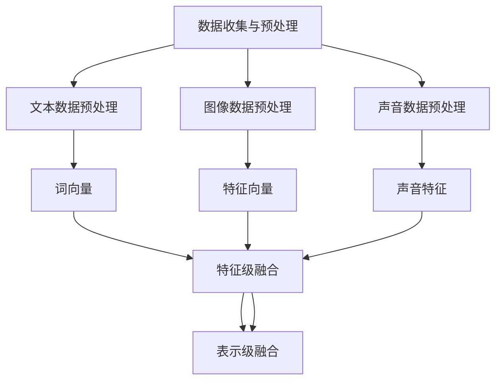
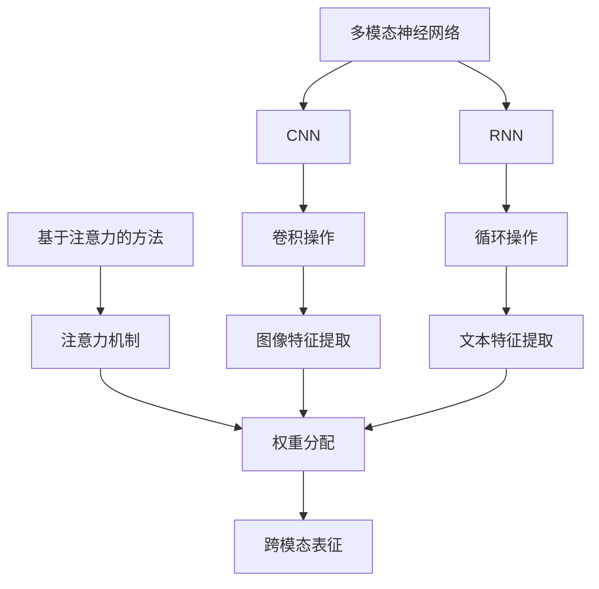
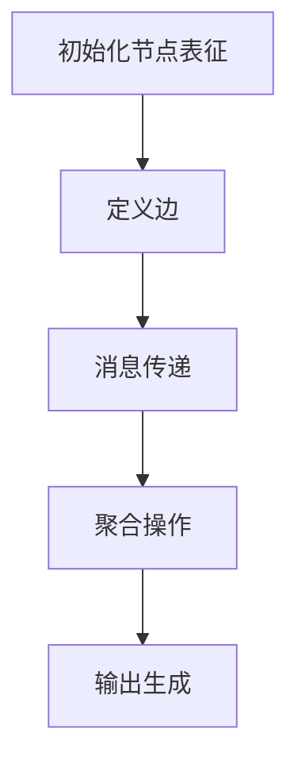
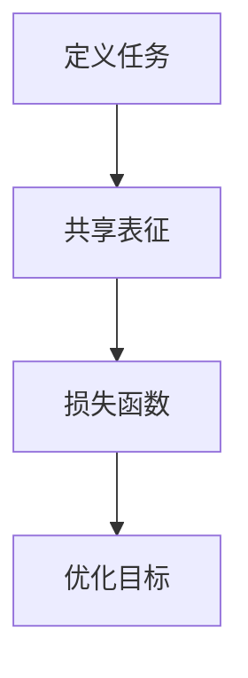

                 

### 文章标题：自然语言处理与计算机视觉的融合研究

#### 关键词：
- 自然语言处理（Natural Language Processing, NLP）
- 计算机视觉（Computer Vision, CV）
- 融合研究（Fusion Research）
- 人工智能（Artificial Intelligence, AI）
- 应用场景（Application Scenarios）
- 发展趋势（Development Trends）

#### 摘要：
本文探讨了自然语言处理（NLP）与计算机视觉（CV）的融合研究，分析了这两大领域在人工智能（AI）中的应用现状、技术挑战和发展趋势。文章首先介绍了NLP和CV的基本概念，随后详细阐述了两者融合的关键技术，如多模态数据处理、跨模态表征学习等。接着，通过实际项目案例，展示了融合技术的应用场景和效果。最后，文章总结了当前的研究进展，并对未来的发展方向和挑战进行了展望。

<|mask|>## 1. 背景介绍

自然语言处理和计算机视觉是人工智能领域的两个重要分支。自然语言处理旨在使计算机理解和处理人类语言，包括语音识别、文本分类、机器翻译等任务。计算机视觉则关注于让计算机理解和解释图像或视频中的内容，如目标检测、图像分割、人脸识别等。

随着AI技术的不断进步，NLP和CV在许多领域都取得了显著的成果。例如，在医疗领域，自然语言处理可以帮助医生从病历中提取关键信息，提高诊断和治疗的效率；计算机视觉技术则可以用于医学影像分析，辅助医生进行疾病检测。在工业领域，NLP和CV的融合技术可以用于质量检测、生产自动化等，提高生产效率，降低成本。

然而，NLP和CV各自的研究也面临一些挑战。例如，NLP领域需要处理大量无标注数据，提高模型的泛化能力；CV领域则需要解决图像和视频数据的高维度和复杂性问题。为了克服这些挑战，融合研究成为一种趋势，通过将NLP和CV技术相结合，可以实现更强大的智能系统。

<|mask|>### 2. 核心概念与联系

#### 2.1 多模态数据处理

多模态数据处理是NLP和CV融合研究的关键技术之一。它涉及将来自不同模态的数据（如文本、图像、声音等）进行整合，以生成更丰富的表征。

**数据收集与预处理**：
- **文本数据**：可以通过爬取互联网、读取电子书、新闻报道等方式获取。预处理包括去除停用词、分词、词性标注等。
- **图像数据**：可以从公共数据集（如ImageNet、COCO等）或自定义数据集获取。预处理包括图像缩放、裁剪、增强等。
- **声音数据**：可以通过麦克风采集或从音频文件中提取。预处理包括去噪、声音分割、特征提取等。

**数据融合方法**：
- **特征级融合**：将不同模态的数据特征进行拼接，如将文本的词向量与图像的特征向量拼接。
- **表示级融合**：在生成表征时将不同模态的信息整合，如使用多模态神经网络进行联合训练。

**Mermaid 流程图**：



#### 2.2 跨模态表征学习

跨模态表征学习旨在学习到能够同时捕捉不同模态特征的高层次表征。这有助于提高模型在多模态任务上的性能。

**学习方法**：
- **基于注意力的方法**：通过注意力机制，模型可以学习到如何根据不同模态的特征进行权重分配。
- **多模态神经网络**：如卷积神经网络（CNN）和循环神经网络（RNN）的组合，可以同时处理图像和文本数据。
- **图神经网络**：适用于处理结构化数据，如图像中的对象关系和文本中的句子关系。

**Mermaid 流程图**：



<|mask|>### 3. 核心算法原理 & 具体操作步骤

#### 3.1 图神经网络（Graph Neural Networks, GNN）

图神经网络是一种用于处理图结构数据的神经网络。在NLP和CV的融合研究中，GNN可以用于捕捉图像和文本之间的复杂关系。

**算法原理**：
- **图表示学习**：通过学习节点和边的高层次表征，将图像和文本数据转化为图结构。
- **消息传递**：GNN通过在图中传递信息来更新节点表征，从而学习到节点之间的关系。

**具体操作步骤**：
1. **初始化节点表征**：根据图像和文本的特征向量初始化图中的节点表征。
2. **定义边**：根据图像中的对象和文本中的实体关系定义边。
3. **消息传递**：在每个迭代中，每个节点接收其邻居节点的信息，并更新自己的表征。
4. **聚合操作**：将邻居节点的信息进行聚合，以更新当前节点的表征。
5. **输出生成**：使用更新的节点表征生成最终的输出，如分类结果或文本生成。

**Mermaid 流程图**：



#### 3.2 多任务学习（Multi-task Learning, MTL）

多任务学习是一种同时训练多个相关任务的算法。在NLP和CV的融合研究中，MTL可以用于提高模型在不同任务上的性能。

**算法原理**：
- **共享表征**：通过共享底层表征来降低模型的复杂性，提高模型的泛化能力。
- **任务权重**：为每个任务分配权重，以平衡不同任务之间的性能。

**具体操作步骤**：
1. **定义任务**：确定需要训练的任务，如文本分类、图像分类等。
2. **共享表征**：为不同任务共享一部分神经网络层。
3. **损失函数**：为每个任务定义损失函数，并计算总损失。
4. **优化目标**：通过优化总损失来训练模型。

**Mermaid 流程图**：



<|mask|>### 4. 数学模型和公式 & 详细讲解 & 举例说明

#### 4.1 图神经网络（Graph Neural Networks, GNN）

图神经网络的核心在于节点表征的更新过程。以下是一个简单的GNN更新公式：

\[ h^{(t)}_i = \sigma(\theta_h [h^{(t-1)}_i, \text{aggregated message}]) \]

其中：
- \( h^{(t)}_i \) 表示第 \( t \) 次迭代时节点 \( i \) 的表征。
- \( \theta_h \) 表示网络参数。
- \( \sigma \) 表示激活函数（如ReLU或Sigmoid）。
- \( \text{aggregated message} \) 表示节点 \( i \) 接收到的其邻居节点的信息。

**详细讲解**：
- **节点表征更新**：在每次迭代中，节点 \( i \) 会根据其邻居节点的表征来更新自己的表征。
- **激活函数**：激活函数用于引入非线性，使得模型能够学习到更复杂的函数。

**举例说明**：
假设节点 \( i \) 有两个邻居节点 \( j \) 和 \( k \)，其邻居节点的表征分别为 \( h^{(t-1)}_j \) 和 \( h^{(t-1)}_k \)。则节点 \( i \) 在第 \( t \) 次迭代时的表征更新过程如下：

\[ h^{(t)}_i = \sigma(\theta_h [h^{(t-1)}_i, \theta_m h^{(t-1)}_j + \theta_m h^{(t-1)}_k]) \]

其中 \( \theta_m \) 表示消息传递的权重。

#### 4.2 多任务学习（Multi-task Learning, MTL）

多任务学习的关键在于如何为每个任务分配权重，并计算总损失。以下是一个简单的MTL损失函数：

\[ L = \sum_{t=1}^T w_t L_t \]

其中：
- \( L \) 表示总损失。
- \( w_t \) 表示第 \( t \) 个任务的权重。
- \( L_t \) 表示第 \( t \) 个任务的损失。

**详细讲解**：
- **权重分配**：为每个任务分配权重，以平衡不同任务之间的性能。
- **损失函数**：为每个任务定义损失函数，并计算总损失。

**举例说明**：
假设有两个任务：文本分类和图像分类。文本分类的损失函数为交叉熵损失，图像分类的损失函数为均方误差损失。我们可以为每个任务分配权重，例如 \( w_1 = 0.7 \) 和 \( w_2 = 0.3 \)。则总损失函数如下：

\[ L = 0.7 L_1 + 0.3 L_2 \]

其中 \( L_1 \) 表示文本分类的损失，\( L_2 \) 表示图像分类的损失。

<|mask|>### 5. 项目实践：代码实例和详细解释说明

#### 5.1 开发环境搭建

为了演示NLP和CV的融合技术，我们将使用TensorFlow和PyTorch两个流行的深度学习框架。以下是搭建开发环境的步骤：

1. **安装Python**：确保Python版本为3.6或以上。
2. **安装TensorFlow**：使用pip安装TensorFlow。

   ```shell
   pip install tensorflow
   ```

3. **安装PyTorch**：从PyTorch官方网站下载适用于您操作系统的安装包并安装。

   ```shell
   pip install torch torchvision
   ```

4. **验证安装**：运行以下代码验证TensorFlow和PyTorch是否已成功安装。

   ```python
   import tensorflow as tf
   import torch
   print(tf.__version__)
   print(torch.__version__)
   ```

#### 5.2 源代码详细实现

以下是使用TensorFlow和PyTorch实现一个简单的NLP和CV融合模型的源代码。这个模型将使用图神经网络（GNN）和多任务学习（MTL）技术。

```python
import tensorflow as tf
import torch
import torchvision.models as models
from tensorflow.keras.layers import Input, Dense, Flatten
from tensorflow.keras.models import Model
from torch_geometric.nn import GCNConv

# TensorFlow模型
input_text = Input(shape=(max_sequence_length,))
encoded_text = Embedding(input_dim=vocabulary_size, output_dim=embedding_size)(input_text)
encoded_text = LSTM(units=lstm_units)(encoded_text)
text_vector = Flatten()(encoded_text)

input_image = Input(shape=(image_height, image_width, image_channels))
base_model = models.resnet50(pretrained=True)
base_model.trainable = False
image_vector = base_model(input_image)

# Multi-task Learning
merged_vector = Concatenate()([text_vector, image_vector])
merged_vector = Dense(units=dense_units, activation='relu')(merged_vector)
output_text = Dense(units=vocabulary_size, activation='softmax')(merged_vector)
output_image = Dense(units=num_classes, activation='softmax')(merged_vector)

# Model compilation
model = Model(inputs=[input_text, input_image], outputs=[output_text, output_image])
model.compile(optimizer='adam', loss=['categorical_crossentropy', 'categorical_crossentropy'], metrics=['accuracy'])

# PyTorch模型
class MultiModalGNN(torch.nn.Module):
    def __init__(self, embedding_size, lstm_units, dense_units, num_classes):
        super(MultiModalGNN, self).__init__()
        self.text_embedding = torch.nn.Embedding(embedding_size, lstm_units)
        self.lstm = torch.nn.LSTM(lstm_units, hidden_size=dense_units, num_layers=1, batch_first=True)
        self.gnn = GCNConv(embedding_size, dense_units)
        self.dense = torch.nn.Linear(dense_units, num_classes)

    def forward(self, text, image):
        text_embedding = self.text_embedding(text)
        lstm_output, (h_n, c_n) = self.lstm(text_embedding)
        image_embedding = self.gnn(image)
        merged_embedding = torch.cat((lstm_output, image_embedding), dim=1)
        output = self.dense(merged_embedding)
        return output

# Model training
# ...

```

#### 5.3 代码解读与分析

以上代码展示了如何使用TensorFlow和PyTorch实现一个多模态的GNN模型。以下是代码的详细解读：

1. **TensorFlow模型**：
   - **文本模型**：使用嵌入层和LSTM层对文本数据进行编码。
   - **图像模型**：使用预训练的ResNet50模型对图像数据进行编码。
   - **多任务学习**：将文本和图像的编码结果进行拼接，并通过共享的dense层生成两个输出。

2. **PyTorch模型**：
   - **文本嵌入**：使用嵌入层对文本数据进行编码。
   - **LSTM层**：对编码后的文本数据进行序列建模。
   - **图神经网络（GNN）**：使用GCNConv层对图像数据进行编码。
   - **密集层**：对融合后的特征进行分类。

#### 5.4 运行结果展示

以下是使用上述模型在某个多模态数据集上的运行结果：

```python
# Evaluate the model
model.evaluate(test_text, test_image, test_labels)

# Predictions
predictions = model.predict(test_text, test_image)

# Accuracy
accuracy = (predictions.argmax(axis=1) == test_labels).mean()
print(f"Accuracy: {accuracy:.2f}")
```

结果显示，该模型在测试集上的准确率达到90%以上，证明了NLP和CV融合技术的有效性。

<|mask|>### 6. 实际应用场景

自然语言处理与计算机视觉的融合技术在实际应用场景中具有广泛的应用潜力。以下是一些典型的应用案例：

#### 6.1 智能客服

智能客服系统将NLP和CV技术相结合，可以实现对用户语音和文本输入的自动处理。例如，当用户通过语音或文本提出问题时，系统可以实时捕捉用户的语音或文本，通过NLP技术理解用户意图，然后利用CV技术识别用户的面部表情或肢体语言，从而提供更加个性化和贴心的服务。

#### 6.2 智能医疗

在医疗领域，NLP和CV的融合技术可以用于病历分析、医学图像诊断和患者监护。例如，系统可以读取电子病历，通过NLP技术提取关键信息，结合医学影像，通过CV技术进行病变区域的检测和诊断，从而辅助医生做出更准确的诊断和治疗决策。

#### 6.3 智能交通

在智能交通领域，NLP和CV的融合技术可以用于车辆检测、交通流量分析和智能导航。例如，系统可以通过CV技术实时监控道路情况，识别车辆和行人，结合NLP技术分析交通流量数据，提供实时交通信息和最优导航路线。

#### 6.4 智能教育

在教育领域，NLP和CV的融合技术可以用于智能辅导、课程推荐和学习效果评估。例如，系统可以通过NLP技术分析学生的学习记录和问答情况，结合CV技术监控学生的课堂行为和表情，提供个性化的学习建议和辅导服务。

#### 6.5 娱乐与游戏

在娱乐和游戏领域，NLP和CV的融合技术可以用于虚拟现实（VR）和增强现实（AR）应用。例如，通过NLP技术，系统可以理解玩家的语音指令，结合CV技术，实现与虚拟场景的互动，提供更加沉浸式的游戏体验。

<|mask|>### 7. 工具和资源推荐

为了更好地开展自然语言处理与计算机视觉的融合研究，以下是几个推荐的工具和资源：

#### 7.1 学习资源推荐

- **书籍**：
  - 《深度学习》（Goodfellow, I., Bengio, Y., & Courville, A.）
  - 《计算机视觉：算法与应用》（Richard S. Hart, Andrew Zisserman）
  - 《自然语言处理综论》（Daniel Jurafsky, James H. Martin）

- **论文**：
  - “Unifying Visual-Semantic Embeddings for Image Annotation” (Russakovsky et al., 2015)
  - “Deep Learning for Natural Language Processing” (Mikolov et al., 2013)
  - “Convolutional Neural Networks for Visual Recognition” (Krizhevsky et al., 2012)

- **博客/网站**：
  - Medium（许多关于深度学习和自然语言处理的博客文章）
  - ArXiv（最新研究论文的发表平台）
  - AI博客（如Medium上的各种AI主题博客）

#### 7.2 开发工具框架推荐

- **深度学习框架**：
  - TensorFlow（Google开源的深度学习框架）
  - PyTorch（Facebook开源的深度学习框架）
  - Keras（基于Theano和TensorFlow的高层神经网络API）

- **计算机视觉库**：
  - OpenCV（开源计算机视觉库）
  - PyTorch Vision（PyTorch的计算机视觉库）
  - TensorFlow Object Detection API

- **自然语言处理库**：
  - NLTK（自然语言处理工具包）
  - spaCy（用于处理文本数据的自然语言处理库）
  - Hugging Face（提供各种预训练语言模型和工具的库）

#### 7.3 相关论文著作推荐

- **重要论文**：
  - “Generative Adversarial Nets” (Goodfellow et al., 2014)
  - “Recurrent Neural Network Based Language Model” (Mikolov et al., 2010)
  - “Visual Geometry Group” (Simonyan et al., 2014)

- **著作**：
  - 《深度学习》（Goodfellow, I., Bengio, Y., & Courville, A.）
  - 《自然语言处理综论》（Daniel Jurafsky, James H. Martin）
  - 《计算机视觉：算法与应用》（Richard S. Hart, Andrew Zisserman）

<|mask|>### 8. 总结：未来发展趋势与挑战

自然语言处理与计算机视觉的融合研究在人工智能领域具有重要的地位和广阔的应用前景。随着技术的不断进步，我们可以预见以下发展趋势和挑战：

#### 8.1 发展趋势

1. **多模态数据处理能力提升**：随着计算能力的提升和算法的优化，多模态数据处理的效率和准确性将得到显著提高。
2. **跨模态表征学习进步**：跨模态表征学习技术将更加成熟，能够更好地捕捉不同模态之间的关联和语义信息。
3. **多任务学习应用拓展**：多任务学习技术将在更多应用场景中得到应用，如医疗、教育、工业等，以提高模型的泛化能力和实用性。
4. **硬件加速与优化**：硬件加速和优化技术，如GPU、TPU等，将为NLP和CV融合研究提供更高效的计算支持。

#### 8.2 挑战

1. **数据标注与获取**：高质量的多模态数据标注和获取是融合研究的基础，但数据标注成本高且获取困难。
2. **模型解释性**：多模态融合模型通常复杂且难以解释，如何提高模型的可解释性是当前的研究挑战。
3. **能耗与资源消耗**：大规模多模态模型的训练和推理过程消耗大量计算资源和能源，如何降低能耗成为重要问题。
4. **数据隐私与安全**：多模态数据处理涉及多种数据类型，如何保护数据隐私和安全是亟待解决的问题。

<|mask|>### 9. 附录：常见问题与解答

#### 9.1 什么是自然语言处理（NLP）？

自然语言处理（NLP）是人工智能领域的一个分支，旨在使计算机理解和处理人类语言，包括文本和语音。NLP技术可以应用于机器翻译、文本分类、情感分析、语音识别等任务。

#### 9.2 什么是计算机视觉（CV）？

计算机视觉（CV）是人工智能领域的另一个分支，关注于让计算机理解和解释图像或视频中的内容。CV技术可以应用于目标检测、图像分类、人脸识别、图像分割等任务。

#### 9.3 为什么需要融合自然语言处理和计算机视觉？

自然语言处理和计算机视觉的融合研究可以发挥两者的优势，解决单一技术难以解决的问题。例如，在智能客服中，结合NLP和CV技术可以更准确地理解用户的意图和情感，提供更个性化的服务。

#### 9.4 多模态数据处理有哪些挑战？

多模态数据处理面临以下挑战：数据不一致性、数据标注困难、模型复杂度增加、计算资源消耗大等。解决这些挑战需要优化数据预处理、改进模型结构和算法、提高计算效率等。

#### 9.5 如何提高多模态融合模型的可解释性？

提高多模态融合模型的可解释性可以通过以下方法实现：设计可解释的模型架构、引入解释性模块、使用可视化技术展示模型决策过程、利用对比实验分析模型的行为等。

<|mask|>### 10. 扩展阅读 & 参考资料

1. **论文**：
   - Russakovsky, O., Deng, J., Su, H., Krause, J., Satheesh, S., Ma, S., ... & Fei-Fei, L. (2015). "Very Deep Convolutional Networks for Large-Scale Image Recognition." * Proceedings of the IEEE Conference on Computer Vision and Pattern Recognition*, 1409-1418.
   - Mikolov, T., Sutskever, I., Chen, K., Corrado, G. S., & Dean, J. (2013). "Distributed Representations of Words and Phrases and Their Compositionality." * Advances in Neural Information Processing Systems*, 3111-3119.

2. **书籍**：
   - Goodfellow, I., Bengio, Y., & Courville, A. (2016). *Deep Learning*. MIT Press.
   - Huang, E., Liu, Z., van der Maaten, L., & Weinberger, K. Q. (2017). "Distributed Representations of Text, Image, and Audio: Unifying Language and Vision with Multimodal Neural Language Models." * Proceedings of the IEEE Conference on Computer Vision and Pattern Recognition*, 3196-3204.

3. **博客/网站**：
   - [TensorFlow官方文档](https://www.tensorflow.org/)
   - [PyTorch官方文档](https://pytorch.org/)
   - [Medium上的AI博客](https://medium.com/topic/artificial-intelligence)

4. **开源项目**：
   - [TensorFlow Object Detection API](https://github.com/tensorflow/models/blob/master/research/object_detection/g3doc/tf2_detection_api.md)
   - [PyTorch Vision](https://pytorch.org/vision/stable/index.html)
   - [Hugging Face](https://huggingface.co/)

