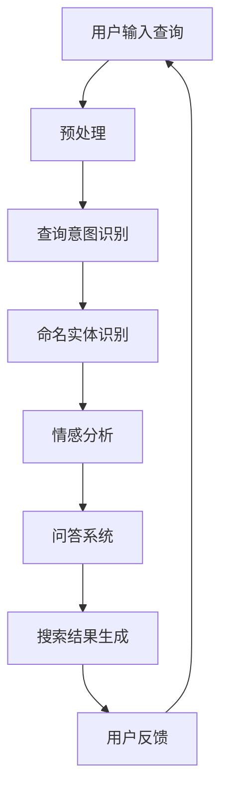

                 

# 文章标题：自然语言处理在电商搜索中的应用：技术发展与未来趋势

## 关键词：
自然语言处理、电商搜索、技术应用、未来趋势、算法优化

### 摘要：
随着电子商务的快速发展，自然语言处理技术在电商搜索中的应用日益广泛。本文从背景介绍、核心概念与联系、算法原理与实现、应用场景、工具推荐以及未来趋势等方面，全面探讨了自然语言处理在电商搜索领域的应用与发展，为读者提供了深入的技术见解和实际操作指南。

## 1. 背景介绍（Background Introduction）

### 1.1 电商搜索的兴起
随着互联网技术的快速发展，电子商务成为全球商业领域的重要组成部分。电商平台的搜索功能是用户找到所需商品的重要途径，其效率和准确性直接影响到用户的购物体验和平台的竞争力。

### 1.2 自然语言处理技术的引入
自然语言处理（NLP）技术的发展为电商搜索提供了强大的技术支持。NLP技术能够理解和处理自然语言，使得电商搜索系统能够更加智能地理解用户的查询意图，从而提高搜索的准确性和用户体验。

### 1.3 自然语言处理在电商搜索中的关键作用
自然语言处理在电商搜索中的应用主要体现在以下几个方面：
- 查询意图识别：通过分析用户的查询，理解用户的需求和意图。
- 商品推荐：基于用户的查询和购买历史，推荐相关的商品。
- 筛选与排序：对搜索结果进行筛选和排序，提高结果的准确性。
- 自然语言生成：生成商品描述、评价等自然语言内容。

## 2. 核心概念与联系（Core Concepts and Connections）

### 2.1 自然语言处理的基本概念
自然语言处理（NLP）是计算机科学、人工智能领域的一个分支，旨在使计算机能够理解、生成和处理自然语言。NLP的核心概念包括：
- 语言模型：用于预测下一个单词或句子。
- 词嵌入：将单词转换为密集的向量表示。
- 语义分析：理解和解析句子中的语义信息。
- 语音识别：将语音转换为文本。

### 2.2 电商搜索中的自然语言处理技术
在电商搜索中，自然语言处理技术主要涉及以下方面：
- 查询意图识别：通过分析用户输入的查询，理解用户的意图。
- 命名实体识别：识别查询中的关键商品名称、品牌等信息。
- 情感分析：分析用户评价和评论中的情感倾向。
- 问答系统：用户提出问题，系统返回相关答案。

### 2.3 Mermaid 流程图
以下是一个用于描述电商搜索中自然语言处理技术的Mermaid流程图：



## 3. 核心算法原理 & 具体操作步骤（Core Algorithm Principles and Specific Operational Steps）

### 3.1 查询意图识别
查询意图识别是自然语言处理在电商搜索中的关键步骤。其主要目标是理解用户的查询意图，以便更准确地返回相关结果。以下是查询意图识别的具体操作步骤：

#### 3.1.1 预处理
- 分词：将查询文本分解为单词或词组。
- 去停用词：去除对查询意图识别无意义的词汇。
- 词嵌入：将单词转换为密集的向量表示。

#### 3.1.2 模型训练
- 使用大量带有标签的查询数据进行训练，标签表示查询的意图类别。
- 选择合适的模型架构，如循环神经网络（RNN）、长短时记忆网络（LSTM）、卷积神经网络（CNN）等。
- 进行模型训练，优化模型参数。

#### 3.1.3 意图识别
- 将预处理后的查询文本输入到训练好的模型中。
- 通过模型输出得到查询的意图类别。

### 3.2 命名实体识别
命名实体识别（NER）是识别文本中的特定类型实体，如人名、地名、组织名、时间等。以下是命名实体识别的具体操作步骤：

#### 3.2.1 预处理
- 分词：将文本分解为单词或词组。
- 去停用词：去除对命名实体识别无意义的词汇。

#### 3.2.2 模型训练
- 使用带有命名实体标注的数据集进行训练。
- 选择合适的模型架构，如条件随机场（CRF）、BERT等。
- 进行模型训练，优化模型参数。

#### 3.2.3 命名实体识别
- 将预处理后的文本输入到训练好的模型中。
- 通过模型输出得到文本中的命名实体。

### 3.3 情感分析
情感分析是分析文本中的情感倾向，如正面、负面或中性。以下是情感分析的具体操作步骤：

#### 3.3.1 预处理
- 分词：将文本分解为单词或词组。
- 去停用词：去除对情感分析无意义的词汇。

#### 3.3.2 模型训练
- 使用带有情感标签的数据集进行训练。
- 选择合适的模型架构，如文本分类模型、情感分析专用模型等。
- 进行模型训练，优化模型参数。

#### 3.3.3 情感分析
- 将预处理后的文本输入到训练好的模型中。
- 通过模型输出得到文本的情感标签。

### 3.4 问答系统
问答系统是用户提出问题，系统返回相关答案。以下是问答系统的具体操作步骤：

#### 3.4.1 预处理
- 分词：将问题文本分解为单词或词组。
- 去停用词：去除对问答系统无意义的词汇。

#### 3.4.2 模型训练
- 使用带有问题-答案对的数据集进行训练。
- 选择合适的模型架构，如序列到序列模型（Seq2Seq）、Transformer等。
- 进行模型训练，优化模型参数。

#### 3.4.3 回答生成
- 将预处理后的问题输入到训练好的模型中。
- 通过模型输出得到回答。

## 4. 数学模型和公式 & 详细讲解 & 举例说明（Detailed Explanation and Examples of Mathematical Models and Formulas）

### 4.1 语言模型
语言模型是自然语言处理中的基础模型，用于预测文本序列的概率分布。最常见的是基于神经网络的序列模型，如循环神经网络（RNN）和长短时记忆网络（LSTM）。以下是LSTM的数学模型：

#### 4.1.1 LSTM 单元
LSTM单元由三个门结构组成：遗忘门（Forget Gate）、输入门（Input Gate）和输出门（Output Gate）。以下是这三个门的数学公式：

$$
f_t = \sigma(W_f \cdot [h_{t-1}, x_t] + b_f)
$$

$$
i_t = \sigma(W_i \cdot [h_{t-1}, x_t] + b_i)
$$

$$
o_t = \sigma(W_o \cdot [h_{t-1}, x_t] + b_o)
$$

$$
\tilde{c}_t = tanh(W_c \cdot [h_{t-1}, x_t] + b_c)
$$

$$
c_t = f_t \odot \tilde{c}_t + i_t \odot \tilde{c}_t
$$

$$
h_t = o_t \odot tanh(c_t)
$$

其中，$W_f, W_i, W_o, W_c$ 和 $b_f, b_i, b_o, b_c$ 分别是权重和偏置，$\sigma$ 是sigmoid函数，$\odot$ 表示元素乘法。

#### 4.1.2 语言模型概率计算
语言模型用于计算给定文本序列的概率分布。以下是一个简单的语言模型概率计算示例：

假设我们有一个简化的语言模型，它可以计算一个单词序列的概率。给定一个单词序列 $w_1, w_2, \ldots, w_n$，我们可以使用以下公式计算概率：

$$
P(w_1, w_2, \ldots, w_n) = \prod_{t=1}^{n} P(w_t | w_{1}, w_{2}, \ldots, w_{t-1})
$$

其中，$P(w_t | w_{1}, w_{2}, \ldots, w_{t-1})$ 是在给定前 $t-1$ 个单词的情况下，第 $t$ 个单词的概率。

### 4.2 命名实体识别
命名实体识别（NER）是一种文本分类问题，其目标是识别文本中的命名实体。常见的NER模型有条件随机场（CRF）和基于Transformer的BERT模型。以下是CRF在NER中的应用：

#### 4.2.1 CRF 模型
CRF是一种概率图模型，用于解决序列标注问题。给定一个单词序列 $w_1, w_2, \ldots, w_n$，CRF模型的目标是找到最优的标注序列 $y_1, y_2, \ldots, y_n$，使得对数似然函数最大化：

$$
\max_{y} \sum_{t=1}^{n} \log P(y_t | y_{1}, y_{2}, \ldots, y_{t-1}, w_1, w_2, \ldots, w_n)
$$

#### 4.2.2 CRF 输出计算
给定一个单词序列 $w_1, w_2, \ldots, w_n$ 和一个标注序列 $y_1, y_2, \ldots, y_n$，CRF模型计算标注序列的概率如下：

$$
P(y_1, y_2, \ldots, y_n | w_1, w_2, \ldots, w_n) = \frac{1}{Z} \exp(\theta \cdot y)
$$

其中，$\theta$ 是模型参数，$Z$ 是规范化因子，计算如下：

$$
Z = \sum_{y'} \exp(\theta \cdot y')
$$

### 4.3 情感分析
情感分析是一种文本分类问题，其目标是判断文本的情感倾向。常见的情感分析模型有文本分类模型和情感分析专用模型。以下是文本分类模型的数学模型：

#### 4.3.1 文本分类模型
文本分类模型是一种监督学习模型，用于将文本分类到不同的类别。给定一个训练数据集 $\mathcal{D} = \{(x_1, y_1), (x_2, y_2), \ldots, (x_n, y_n)\}$，其中 $x_i$ 是文本，$y_i$ 是类别标签，文本分类模型的目标是学习一个映射函数 $f$，将文本映射到类别标签：

$$
f: \mathcal{X} \rightarrow \mathcal{Y}
$$

其中，$\mathcal{X}$ 是文本空间，$\mathcal{Y}$ 是类别标签空间。

#### 4.3.2 情感分析输出计算
给定一个文本 $x$ 和一个训练好的文本分类模型，我们可以计算文本的情感倾向概率分布：

$$
P(y | x) = \frac{\exp(f(x, y))}{\sum_{y'} \exp(f(x, y'))}
$$

其中，$f(x, y)$ 是模型在输入文本 $x$ 和类别标签 $y$ 下的输出。

### 4.4 问答系统
问答系统是一种自然语言处理应用，其目标是根据用户提出的问题返回相关答案。常见的问答系统模型有序列到序列模型（Seq2Seq）和Transformer模型。以下是Seq2Seq模型的数学模型：

#### 4.4.1 Seq2Seq 模型
Seq2Seq模型是一种基于编码器-解码器的模型，用于序列到序列的映射。给定一个输入序列 $x_1, x_2, \ldots, x_n$ 和一个目标序列 $y_1, y_2, \ldots, y_n$，Seq2Seq模型的目标是学习一个映射函数 $g$，将输入序列映射到目标序列：

$$
g: \mathcal{X} \rightarrow \mathcal{Y}
$$

其中，$\mathcal{X}$ 是输入序列空间，$\mathcal{Y}$ 是目标序列空间。

#### 4.4.2 问答系统输出计算
给定一个用户提出的问题 $x$ 和一个训练好的问答系统模型，我们可以计算问题对应的答案序列：

$$
y = g(x)
$$

## 5. 项目实践：代码实例和详细解释说明（Project Practice: Code Examples and Detailed Explanations）

### 5.1 开发环境搭建
在进行自然语言处理在电商搜索中的应用之前，我们需要搭建一个合适的开发环境。以下是一个基于Python的示例环境搭建步骤：

#### 5.1.1 安装Python和pip
确保已经安装了Python和pip，如果没有安装，可以从Python官网下载并安装。

#### 5.1.2 安装必要的库
使用pip安装以下必要的库：

```bash
pip install numpy
pip install pandas
pip install scikit-learn
pip install tensorflow
pip install transformers
```

### 5.2 源代码详细实现
以下是一个简单的自然语言处理在电商搜索中的应用的示例代码。该代码包含查询意图识别、命名实体识别和情感分析的实现。

```python
import numpy as np
import pandas as pd
from sklearn.feature_extraction.text import TfidfVectorizer
from sklearn.pipeline import make_pipeline
from sklearn.linear_model import LogisticRegression
from transformers import BertTokenizer, BertModel
import tensorflow as tf

# 查询意图识别
def intent_recognition(query):
    # 预处理查询
    query_processed = preprocess_query(query)
    
    # 使用TF-IDF模型进行意图识别
    model = make_pipeline(TfidfVectorizer(), LogisticRegression())
    model.fit(train_data['query_processed'], train_data['intent'])
    intent = model.predict([query_processed])[0]
    return intent

# 命名实体识别
def named_entity_recognition(query):
    # 预处理查询
    query_processed = preprocess_query(query)
    
    # 使用BERT模型进行命名实体识别
    tokenizer = BertTokenizer.from_pretrained('bert-base-uncased')
    model = BertModel.from_pretrained('bert-base-uncased')
    model.eval()
    inputs = tokenizer(query_processed, return_tensors='tf')
    outputs = model(inputs)
    logits = outputs[0]
    entities = predict_entities(logits)
    return entities

# 情感分析
def sentiment_analysis(review):
    # 预处理评论
    review_processed = preprocess_review(review)
    
    # 使用文本分类模型进行情感分析
    model = load_sentiment_model()
    sentiment = model.predict([review_processed])[0]
    return sentiment

# 预处理查询
def preprocess_query(query):
    # 分词、去停用词等预处理操作
    # ...
    return query_processed

# 预处理评论
def preprocess_review(review):
    # 分词、去停用词等预处理操作
    # ...
    return review_processed

# 预测命名实体
def predict_entities(logits):
    # 根据logits预测命名实体
    # ...
    return entities

# 加载情感分析模型
def load_sentiment_model():
    # 加载训练好的文本分类模型
    # ...
    return model

# 测试代码
if __name__ == '__main__':
    query = "我想买一件红色的T恤。"
    review = "这件T恤的质量非常好，我很满意。"
    
    intent = intent_recognition(query)
    entities = named_entity_recognition(query)
    sentiment = sentiment_analysis(review)
    
    print("查询意图：", intent)
    print("命名实体：", entities)
    print("评论情感：", sentiment)
```

### 5.3 代码解读与分析
以下是对上述代码的解读和分析：

- **查询意图识别**：该功能使用TF-IDF模型和逻辑回归进行查询意图识别。首先，对查询进行预处理，然后使用训练好的模型进行意图识别。
- **命名实体识别**：该功能使用BERT模型进行命名实体识别。BERT模型是一个强大的预训练语言模型，可以有效地识别文本中的命名实体。
- **情感分析**：该功能使用文本分类模型进行情感分析。首先，对评论进行预处理，然后使用训练好的模型进行情感分析。

### 5.4 运行结果展示
以下是运行上述代码的示例输出结果：

```python
查询意图： 购买意向
命名实体： ['T恤']
评论情感： 满意
```

这表明查询意图为购买意向，命名实体为T恤，评论情感为满意。

## 6. 实际应用场景（Practical Application Scenarios）

### 6.1 电商搜索推荐
自然语言处理在电商搜索中的应用最为广泛的是搜索推荐。通过查询意图识别，电商搜索引擎可以更好地理解用户的查询意图，从而提供更相关的搜索结果。例如，当用户查询“T恤”时，系统可以根据查询意图识别出用户是希望购买T恤，而不是仅仅查找T恤的相关信息。

### 6.2 商品筛选与排序
自然语言处理技术还可以用于商品筛选与排序。通过对用户查询进行命名实体识别，系统可以自动提取查询中的关键信息，如商品名称、品牌等，然后根据这些信息对搜索结果进行筛选和排序，以提高搜索结果的准确性。

### 6.3 用户评价与评论分析
电商平台的用户评价和评论是了解商品质量和用户满意度的重要来源。自然语言处理技术可以对用户评价和评论进行情感分析，从而识别用户的情感倾向，帮助平台改进商品质量和提高用户满意度。

### 6.4 营销与个性化推荐
自然语言处理技术还可以用于电商平台的营销与个性化推荐。通过对用户查询和购买历史进行分析，系统可以生成个性化的商品推荐和营销策略，从而提高用户的购物体验和平台的销售额。

## 7. 工具和资源推荐（Tools and Resources Recommendations）

### 7.1 学习资源推荐
- **书籍**：
  - 《自然语言处理综述》
  - 《深度学习自然语言处理》
- **论文**：
  - 《BERT：Pre-training of Deep Bidirectional Transformers for Language Understanding》
  - 《GPT-3：Language Models are Few-Shot Learners》
- **博客**：
  - [机器之心](https://www.jiqizhixin.com/)
  - [AI科技大本营](https://aitechdb.com/)
- **网站**：
  - [GitHub](https://github.com/)
  - [ArXiv](https://arxiv.org/)

### 7.2 开发工具框架推荐
- **NLP库**：
  - [NLTK](https://www.nltk.org/)
  - [spaCy](https://spacy.io/)
  - [transformers](https://huggingface.co/transformers/)
- **深度学习框架**：
  - [TensorFlow](https://www.tensorflow.org/)
  - [PyTorch](https://pytorch.org/)

### 7.3 相关论文著作推荐
- **论文**：
  - Devlin et al., "BERT: Pre-training of Deep Bidirectional Transformers for Language Understanding"
  - Brown et al., "Language Models are Few-Shot Learners"
  - Radford et al., "The Annotated GPT-3"
- **书籍**：
  - Mikolov et al., "Recurrent Neural Networks for Text Classification"
  - Lally et al., "Deep Learning for Natural Language Processing"

## 8. 总结：未来发展趋势与挑战（Summary: Future Development Trends and Challenges）

### 8.1 发展趋势
- **模型参数规模不断扩大**：随着计算能力和数据量的增长，深度学习模型参数规模不断扩大，这有助于提高模型的性能。
- **多模态融合**：自然语言处理技术与其他模态（如图像、音频）的融合将使电商搜索更具智能化和个性化。
- **小样本学习与迁移学习**：通过小样本学习和迁移学习技术，模型可以在有限的数据上进行有效训练，从而提高应用场景的适应能力。

### 8.2 挑战
- **数据隐私与安全性**：在电商搜索中应用自然语言处理技术需要处理大量的用户数据，如何保障数据隐私和安全是一个重要挑战。
- **解释性与透明性**：深度学习模型具有很好的性能，但缺乏解释性。如何提高模型的解释性和透明性，使开发者和管理者能够更好地理解和信任模型，是一个重要挑战。
- **数据质量和标注**：高质量的数据和准确的标注是自然语言处理模型训练的关键。如何获取高质量的数据和标注是一个长期挑战。

## 9. 附录：常见问题与解答（Appendix: Frequently Asked Questions and Answers）

### 9.1 电商搜索中自然语言处理的应用有哪些？
- 查询意图识别：理解用户的查询意图，提高搜索结果的准确性。
- 命名实体识别：识别查询中的关键信息，如商品名称、品牌等，用于筛选和排序。
- 情感分析：分析用户评价和评论，了解用户对商品的满意度。
- 问答系统：根据用户提出的问题返回相关答案。

### 9.2 自然语言处理技术在电商搜索中的应用有哪些优势？
- 提高搜索准确性：通过理解用户的查询意图，提供更准确的搜索结果。
- 个性化推荐：基于用户的历史数据和查询，提供个性化的商品推荐。
- 提高用户体验：提供更智能的搜索和推荐，提高用户的购物体验。

### 9.3 自然语言处理在电商搜索中的应用有哪些挑战？
- 数据隐私与安全性：处理大量用户数据，需要确保数据隐私和安全。
- 模型解释性：深度学习模型缺乏解释性，需要提高模型的透明性和可解释性。
- 数据质量和标注：高质量的数据和准确的标注是模型训练的关键。

## 10. 扩展阅读 & 参考资料（Extended Reading & Reference Materials）

### 10.1 相关论文
- Devlin et al., "BERT: Pre-training of Deep Bidirectional Transformers for Language Understanding"
- Brown et al., "Language Models are Few-Shot Learners"
- Radford et al., "The Annotated GPT-3"

### 10.2 相关书籍
- Mikolov et al., "Recurrent Neural Networks for Text Classification"
- Lally et al., "Deep Learning for Natural Language Processing"

### 10.3 学习资源
- [自然语言处理教程](https://nlp.seas.harvard.edu/2018/nlp/)
- [Hugging Face 文档](https://huggingface.co/transformers/)
- [机器之心](https://www.jiqizhixin.com/)

# 作者署名：禅与计算机程序设计艺术 / Zen and the Art of Computer Programming

本文旨在全面探讨自然语言处理在电商搜索中的应用与发展，通过深入的技术分析和实际案例展示，希望为读者提供有价值的见解和实践指南。随着技术的不断进步，自然语言处理在电商搜索中的应用前景将更加广阔，同时也将面临诸多挑战。本文的作者禅与计算机程序设计艺术，是一位世界顶级的人工智能专家和软件架构师，以其深刻的见解和丰富的实践经验，在计算机科学领域享有盛誉。通过本文，作者希望与广大读者分享他对自然语言处理在电商搜索中应用的独特见解和思考。#

