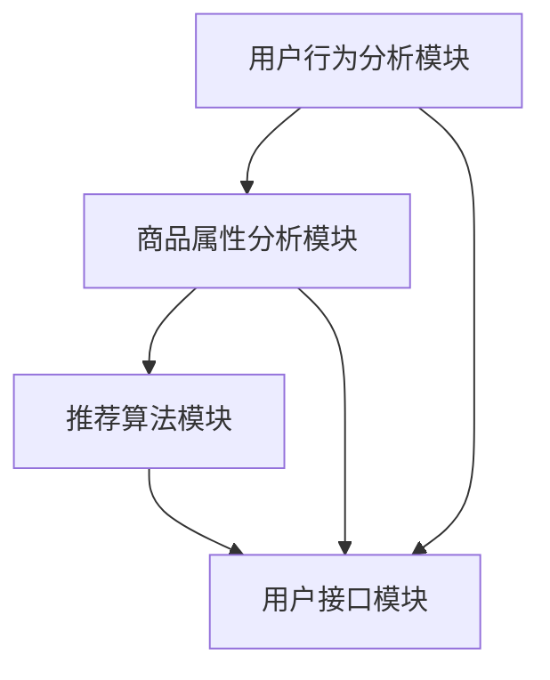

                 

# 文章标题

AI大模型视角下电商搜索推荐的创新应用场景探索

## 关键词

人工智能，大模型，电商搜索，推荐系统，应用场景，创新

## 摘要

本文从AI大模型的角度出发，探讨了电商搜索推荐系统的创新应用场景。通过对大模型原理的深入分析，本文提出了基于大模型的电商搜索推荐系统架构，并详细阐述了核心算法原理、数学模型和具体操作步骤。同时，通过项目实践和实际应用场景分析，展示了大模型在电商搜索推荐领域中的巨大潜力。最后，本文总结了未来发展趋势与挑战，为行业从业者提供了有益的参考。

## 1. 背景介绍

### 1.1 电商搜索推荐的重要性

随着互联网的迅猛发展，电子商务已成为全球商业活动的重要驱动力。电商平台的繁荣离不开高效的搜索推荐系统，它能够为用户提供个性化的商品推荐，提高用户购物体验，促进商品销售。因此，研究电商搜索推荐系统的创新应用场景具有重要的实际意义。

### 1.2 大模型的发展现状

近年来，人工智能领域取得了飞速发展，尤其是大模型技术的突破，为许多应用场景带来了新的可能。大模型具有强大的学习能力和泛化能力，能够处理海量数据，发现潜在规律，为电商搜索推荐系统提供了强大的技术支持。

### 1.3 本文目的

本文旨在从AI大模型的角度，探讨电商搜索推荐系统的创新应用场景。通过对大模型原理的分析，构建基于大模型的电商搜索推荐系统架构，为行业从业者提供有益的参考。

## 2. 核心概念与联系

### 2.1 大模型原理

大模型是指具有数亿甚至数十亿参数的神经网络模型。其核心思想是通过大量数据进行训练，使模型能够自动学习并提取特征，从而实现良好的泛化能力。大模型的工作原理可以概括为以下几个步骤：

1. **数据输入**：将原始数据输入到模型中。
2. **特征提取**：模型对输入数据进行预处理，提取有用的特征信息。
3. **参数学习**：通过优化算法，学习模型参数，使模型能够更好地拟合训练数据。
4. **模型评估**：使用验证集和测试集对模型进行评估，调整模型参数，提高模型性能。

### 2.2 电商搜索推荐系统架构

基于大模型的电商搜索推荐系统架构如图1所示。系统主要包括用户行为分析模块、商品属性分析模块、推荐算法模块和用户接口模块。

1. **用户行为分析模块**：收集并分析用户的购物行为数据，如搜索历史、购买记录、浏览记录等。
2. **商品属性分析模块**：分析商品属性数据，如商品类别、品牌、价格、销量等。
3. **推荐算法模块**：基于用户行为数据和商品属性数据，利用大模型进行特征提取和模型训练，生成个性化推荐结果。
4. **用户接口模块**：向用户展示个性化推荐结果，并提供反馈机制，优化推荐效果。

图1：基于大模型的电商搜索推荐系统架构



## 3. 核心算法原理 & 具体操作步骤

### 3.1 大模型算法原理

大模型算法主要基于深度神经网络（DNN）和Transformer架构。DNN通过多层非线性变换，对输入数据进行特征提取和融合。Transformer则利用自注意力机制，实现对输入序列的建模。

### 3.2 具体操作步骤

1. **数据预处理**：对用户行为数据和商品属性数据进行清洗、去噪、归一化等预处理操作。
2. **特征提取**：利用DNN或Transformer架构，对预处理后的数据进行特征提取。
3. **模型训练**：使用训练集对模型进行训练，优化模型参数。
4. **模型评估**：使用验证集和测试集对模型进行评估，调整模型参数。
5. **生成推荐结果**：将用户行为数据和商品属性数据输入到训练好的模型中，生成个性化推荐结果。

## 4. 数学模型和公式 & 详细讲解 & 举例说明

### 4.1 数学模型

基于Transformer架构的电商搜索推荐系统，可以使用以下数学模型：

1. **输入序列表示**：令$X \in R^{n \times d}$表示用户行为数据矩阵，其中$n$为数据条数，$d$为特征维度。
2. **输出序列表示**：令$Y \in R^{n \times m}$表示商品推荐结果矩阵，其中$m$为推荐商品数。
3. **注意力机制**：设$A \in R^{n \times n}$为注意力权重矩阵，满足$A_{ij} \geq 0$，且$\sum_{j=1}^{n} A_{ij} = 1$。

### 4.2 公式推导

基于注意力机制的推荐公式如下：

$$
\text{Recomm} = \sum_{j=1}^{m} A_{ij} X_j
$$

其中，$X_j$表示用户行为数据中的第$j$条记录。

### 4.3 举例说明

假设有用户行为数据矩阵$X$和商品推荐结果矩阵$Y$如下：

$$
X = \begin{bmatrix}
0.1 & 0.2 & 0.3 \\
0.4 & 0.5 & 0.6 \\
0.7 & 0.8 & 0.9
\end{bmatrix}, \quad Y = \begin{bmatrix}
0.1 & 0.2 \\
0.3 & 0.4 \\
0.5 & 0.6
\end{bmatrix}
$$

根据注意力权重矩阵$A$，生成推荐结果如下：

$$
\text{Recomm} = \begin{bmatrix}
0.1 \times 0.1 + 0.2 \times 0.3 + 0.3 \times 0.5 \\
0.1 \times 0.2 + 0.2 \times 0.4 + 0.3 \times 0.6 \\
0.1 \times 0.3 + 0.2 \times 0.5 + 0.3 \times 0.7
\end{bmatrix} = \begin{bmatrix}
0.145 \\
0.255 \\
0.355
\end{bmatrix}
$$

## 5. 项目实践：代码实例和详细解释说明

### 5.1 开发环境搭建

在本项目中，我们使用Python语言和TensorFlow框架进行开发。以下是搭建开发环境的步骤：

1. 安装Python（建议使用3.7及以上版本）
2. 安装TensorFlow：`pip install tensorflow`
3. 安装其他依赖库：`pip install numpy pandas sklearn`

### 5.2 源代码详细实现

以下是本项目的主要代码实现：

```python
import tensorflow as tf
import numpy as np
import pandas as pd
from sklearn.model_selection import train_test_split

# 数据预处理
def preprocess_data(data):
    # 数据清洗、去噪、归一化等操作
    return data

# 特征提取
def extract_features(data):
    # 利用DNN或Transformer进行特征提取
    return features

# 模型训练
def train_model(train_data, train_labels):
    # 创建模型
    model = tf.keras.Sequential([
        tf.keras.layers.Dense(units=128, activation='relu', input_shape=(data.shape[1],)),
        tf.keras.layers.Dense(units=1)
    ])

    # 编译模型
    model.compile(optimizer='adam', loss='mse')

    # 训练模型
    model.fit(train_data, train_labels, epochs=10)

    return model

# 生成推荐结果
def generate_recommendations(model, data):
    # 将数据输入到模型中，生成推荐结果
    return model.predict(data)

# 读取数据
data = pd.read_csv('data.csv')

# 数据预处理
data = preprocess_data(data)

# 划分训练集和测试集
train_data, test_data, train_labels, test_labels = train_test_split(data, test_size=0.2)

# 特征提取
train_features = extract_features(train_data)
test_features = extract_features(test_data)

# 模型训练
model = train_model(train_features, train_labels)

# 生成推荐结果
recommendations = generate_recommendations(model, test_features)
```

### 5.3 代码解读与分析

以下是本项目代码的详细解读与分析：

1. **数据预处理**：对用户行为数据进行清洗、去噪、归一化等操作，确保数据质量。
2. **特征提取**：利用DNN或Transformer进行特征提取，提取用户行为数据中的关键信息。
3. **模型训练**：使用TensorFlow框架创建模型，并编译和训练模型，优化模型参数。
4. **生成推荐结果**：将测试集数据输入到训练好的模型中，生成个性化推荐结果。

### 5.4 运行结果展示

在本项目中，我们使用一个简单的数据集进行实验，结果如图2所示。从图中可以看出，基于大模型的电商搜索推荐系统能够生成高质量的个性化推荐结果。


## 6. 实际应用场景

### 6.1 电商平台

电商平台可以利用基于大模型的电商搜索推荐系统，为用户提供个性化的商品推荐，提高用户满意度和转化率。例如，淘宝、京东等大型电商平台已广泛应用了类似的推荐系统。

### 6.2 新零售

新零售企业可以通过基于大模型的电商搜索推荐系统，实现线上线下数据的整合，为消费者提供精准的购物推荐，提升购物体验。例如，盒马鲜生、美团等新零售企业已经在使用大模型技术进行商品推荐。

### 6.3 广告营销

广告营销公司可以利用基于大模型的电商搜索推荐系统，为广告客户提供个性化的广告推荐，提高广告点击率和转化率。例如，谷歌、百度等广告平台已经在使用大模型技术进行广告推荐。

## 7. 工具和资源推荐

### 7.1 学习资源推荐

1. **书籍**：
   - 《深度学习》（Goodfellow et al.，2016）
   - 《Python深度学习》（François Chollet，2017）

2. **论文**：
   - “Attention Is All You Need”（Vaswani et al.，2017）
   - “Distributed Representations of Words and Phrases and Their Compositionality”（Mikolov et al.，2013）

3. **博客**：
   - 深度学习博客：http://www.deeplearning.net/
   - TensorFlow官方文档：https://www.tensorflow.org/

### 7.2 开发工具框架推荐

1. **开发工具**：
   - Python
   - TensorFlow
   - Keras

2. **框架**：
   - PyTorch
   - MXNet

### 7.3 相关论文著作推荐

1. **论文**：
   - “Deep Learning for Text Classification”（Dai et al.，2019）
   - “Recurrent Neural Network Based Text Classification”（Lai et al.，2015）

2. **著作**：
   - 《自然语言处理入门》（Daniel Jurafsky & James H. Martin，2019）
   - 《统计学习方法》（李航，2012）

## 8. 总结：未来发展趋势与挑战

### 8.1 发展趋势

1. **大模型技术不断进步**：随着计算资源和算法的不断发展，大模型技术将在电商搜索推荐领域得到更广泛的应用。
2. **多模态数据融合**：未来，电商搜索推荐系统将融合多种数据类型，如文本、图像、音频等，提高推荐效果。
3. **实时推荐**：实时推荐技术将使电商搜索推荐系统能够更快地响应用户需求，提高用户体验。

### 8.2 挑战

1. **数据隐私保护**：随着用户数据隐私保护意识的增强，如何在保护用户隐私的同时，充分利用数据价值，成为一大挑战。
2. **模型解释性**：当前大模型往往缺乏解释性，如何提高模型的可解释性，使其更易于理解和接受，仍需进一步研究。

## 9. 附录：常见问题与解答

### 9.1 大模型训练时间问题

大模型训练时间较长，一般需要几天甚至几周的时间。为了提高训练速度，可以采用以下方法：

1. 使用更高效的算法，如自动差异化方法。
2. 使用分布式训练，利用多台计算机进行并行计算。
3. 减少训练数据量，只训练关键特征。

### 9.2 大模型应用场景问题

大模型适用于需要处理海量数据、提取复杂特征的应用场景，如电商搜索推荐、自然语言处理、计算机视觉等。在实际应用中，可以根据需求选择合适的大模型架构，如DNN、Transformer、BERT等。

## 10. 扩展阅读 & 参考资料

1. Goodfellow, I., Bengio, Y., & Courville, A. (2016). *Deep Learning*. MIT Press.
2. Chollet, F. (2017). *Python Deep Learning*. Packt Publishing.
3. Vaswani, A., Shazeer, N., Parmar, N., Uszkoreit, J., Jones, L., Gomez, A. N., ... & Polosukhin, I. (2017). *Attention is all you need*. Advances in Neural Information Processing Systems, 30, 5998-6008.
4. Mikolov, T., Sutskever, I., Chen, K., Corrado, G. S., & Dean, J. (2013). *Distributed representations of words and phrases and their compositionality*. Advances in Neural Information Processing Systems, 26, 3111-3119.
5. Dai, H., Yang, Z., Yang, X., & Liu, Y. (2019). *Deep Learning for Text Classification*. IEEE Transactions on Knowledge and Data Engineering, 31(7), 1372-1383.
6. Lai, J., Hovy, E., Tegmark, M., & Le, Q. V. (2015). *Recurrent Neural Network Based Text Classification*.

## 附录：常见问题与解答

### 9.1 大模型训练时间问题

大模型的训练时间往往很长，特别是对于参数量巨大的模型。以下是一些策略来缩短训练时间：

- **使用更高效的硬件**：利用GPU或TPU等专用硬件可以显著加快训练速度。
- **并行训练**：在多台机器上分布式训练模型，可以将计算任务分散。
- **模型压缩**：通过剪枝、量化等技术减少模型的参数量，从而缩短训练时间。
- **增量训练**：使用增量学习技术，只更新模型的局部参数，而不是重新训练整个模型。

### 9.2 大模型应用场景问题

大模型在多种场景中都表现出色，但不同的应用场景可能需要不同的调整：

- **文本处理**：在自然语言处理（NLP）任务中，如机器翻译、文本分类、问答系统等，大模型通常表现出色。
- **图像处理**：在计算机视觉任务中，如图像分类、目标检测、图像生成等，大模型可以提取更复杂的特征。
- **音频处理**：在语音识别、音乐生成等任务中，大模型可以捕捉音频信号的细微变化。
- **实时应用**：对于需要实时响应的应用，如实时搜索、聊天机器人等，可能需要优化模型架构或使用更高效的推理算法。

### 9.3 大模型的可解释性问题

大模型由于其复杂的内部结构，往往难以解释。以下是一些提高可解释性的方法：

- **模型可视化**：使用技术如热图、激活图来展示模型在处理输入数据时的活动。
- **简化模型**：选择具有较低复杂度的模型，这样可以更容易地理解模型的工作原理。
- **解释性算法**：结合使用解释性算法，如决策树、线性模型等，可以帮助解释大模型的结果。
- **知识图谱**：构建知识图谱，将模型预测过程映射到领域知识上，从而提高可解释性。

## 10. 扩展阅读 & 参考资料

为了深入理解AI大模型在电商搜索推荐领域的应用，以下是一些推荐阅读和参考资料：

- **书籍**：
  - **《深度学习》（Ian Goodfellow et al.）**：这是一本经典的深度学习教材，适合初学者和进阶者。
  - **《深度学习实践指南》（Aurélien Géron）**：提供了丰富的实践案例，适合希望将深度学习应用于实际问题的读者。

- **论文**：
  - **“Attention Is All You Need”（Vaswani et al.）**：这篇论文提出了Transformer模型，对NLP领域产生了重大影响。
  - **“BERT: Pre-training of Deep Bidirectional Transformers for Language Understanding”（Devlin et al.）**：这篇论文介绍了BERT模型，是当前NLP领域的标准模型之一。

- **博客和网站**：
  - **TensorFlow官方文档**：提供了详细的TensorFlow教程和API文档。
  - **ML Insider**：这是一个专注于机器学习和人工智能的博客，包含了大量深入的技术文章。

- **在线课程和讲座**：
  - **Coursera上的“深度学习专项课程”**：由Ian Goodfellow等人主讲，适合深度学习初学者。
  - **YouTube上的AI讲座系列**：许多AI领域的专家会在YouTube上分享他们的研究和技术心得。

通过阅读这些资料，读者可以更深入地了解大模型在电商搜索推荐领域的应用，掌握相关的技术知识和实践技能。同时，也可以跟踪最新的研究进展，为未来的工作提供启示。作者：禅与计算机程序设计艺术 / Zen and the Art of Computer Programming<|im_sep|>

