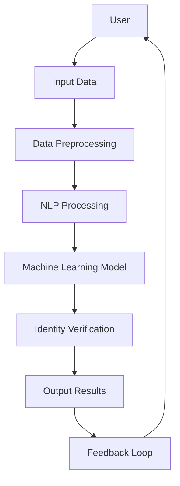

                 

### 背景介绍（Background Introduction）

在过去的几十年中，人工智能（AI）技术取得了飞速的发展，从简单的规则系统到复杂的深度学习模型，AI已经深刻地改变了我们的生活方式和工作方式。然而，随着AI技术的不断进步，一个新的议题逐渐浮现——虚拟身份认同。在AI时代，虚拟身份认同成为一个日益重要的研究课题，涉及到伦理、心理学、社会学等多个领域。

虚拟身份认同，顾名思义，是指个体在数字世界中所建立的替代性身份。这一概念不仅仅局限于游戏、虚拟现实等娱乐领域，更延伸到了社交媒体、在线交易、虚拟助手等日常应用的方方面面。随着越来越多的活动转移到线上，人们开始探索如何在数字世界中构建、维护和表现自我。这一过程不仅影响个体的社交互动，也对社会的结构和发展产生了深远的影响。

本文旨在探讨虚拟身份认同在AI时代的多维度影响，分析其核心概念、技术原理、伦理挑战以及未来发展趋势。我们将逐步深入，从基础概念出发，结合实际案例，探讨这一议题的深度和广度。通过这样的分析，我们希望为读者提供一个全面、深入的视角，以更好地理解虚拟身份认同在AI时代的角色和意义。

### Virtual Identity Recognition in the AI Era

In the past few decades, artificial intelligence (AI) technology has experienced rapid advancements, transforming our lives and work in profound ways. From simple rule-based systems to complex deep learning models, AI has already made significant impacts across various domains. However, with the continuous progress of AI, a new topic has emerged — virtual identity recognition. This concept is becoming increasingly important as it spans across ethics, psychology, sociology, and many other fields.

Virtual identity recognition, as the name suggests, refers to the alternative identities individuals construct in the digital world. This concept is not limited to entertainment fields such as games and virtual reality but extends to everyday applications like social media, online transactions, and virtual assistants. As more activities migrate to the online realm, there is growing interest in how individuals can build, maintain, and portray their identities in the digital world. This process not only influences individual social interactions but also has far-reaching implications for the structure and development of society.

This article aims to explore the multidimensional impacts of virtual identity recognition in the AI era. We will delve into the core concepts, technical principles, ethical challenges, and future trends associated with this topic. By taking a step-by-step approach, starting from foundational concepts and combining real-world examples, we hope to provide readers with a comprehensive and in-depth perspective on the role and significance of virtual identity recognition in the AI era.

### 核心概念与联系（Core Concepts and Connections）

#### 1. 虚拟身份认同的定义与特征

虚拟身份认同是指个体在数字世界中所构建的替代性身份，它不仅包括虚拟角色、昵称，还涉及更为复杂的身份表现，如虚拟社交网络中的个人资料、头像、发表的内容等。虚拟身份认同的特征主要体现在以下几个方面：

- **匿名性**：虚拟身份认同允许个体隐藏真实身份，从而实现匿名交流。这种匿名性在保护隐私、避免现实世界中的偏见和歧视等方面具有积极作用。
- **多样性**：虚拟世界提供了丰富的身份选择，个体可以根据个人喜好、社交需求甚至虚拟世界中的特定角色来构建身份，从而展现多样性。
- **可塑性**：虚拟身份认同具有高度的可塑性，个体可以随时调整或重新定义自己的身份，以适应不同的社交环境或个人变化。

#### 2. 虚拟身份认同的技术基础

虚拟身份认同的实现离不开现代信息技术的发展，主要包括以下几个方面：

- **社交媒体平台**：社交媒体平台为虚拟身份认同提供了基础设施，如用户头像、个人资料、朋友圈等。
- **虚拟现实技术**：虚拟现实（VR）技术为个体提供了一个沉浸式的数字环境，使虚拟身份认同更加真实和生动。
- **区块链技术**：区块链技术可以确保虚拟身份认同的不可篡改性和安全性，从而增强个体对数字身份的控制权。

#### 3. 虚拟身份认同与现实世界的联系

虚拟身份认同不仅存在于数字世界，还与现实世界有着密切的联系。这种联系体现在以下几个方面：

- **社交互动**：虚拟身份认同影响个体在现实世界中的社交互动，如通过社交媒体平台建立和维护现实世界的关系。
- **职业发展**：在某些行业，如游戏设计和虚拟现实开发，虚拟身份认同甚至成为职业发展的关键因素。
- **法律与伦理**：虚拟身份认同在法律和伦理方面提出了新的挑战，如虚拟欺诈、网络暴力等问题的界定和处理。

#### 4. 虚拟身份认同的影响与挑战

虚拟身份认同对社会和个人带来了积极的影响，同时也带来了一系列挑战：

- **积极影响**：虚拟身份认同提供了新的社交机会、职业发展路径和自我表达方式，促进了数字经济的繁荣。
- **挑战**：虚拟身份认同可能导致隐私泄露、网络安全风险、身份欺诈等问题，需要相应的法规和技术手段来应对。

通过上述分析，我们可以看到虚拟身份认同在AI时代的重要性和复杂性。它不仅是一个技术问题，更是一个涉及伦理、社会和个人发展的综合性议题。接下来，我们将进一步探讨虚拟身份认同的核心算法原理和具体操作步骤，以深入了解这一领域的技术细节。

#### 1. Definition and Characteristics of Virtual Identity Recognition

Virtual identity recognition refers to the alternative identities that individuals construct in the digital world. This includes not only virtual characters and nicknames but also more complex aspects such as personal profiles, avatars, and the content individuals post on social media platforms. The characteristics of virtual identity recognition are mainly manifested in the following aspects:

- **Anonymity**: Virtual identity recognition allows individuals to conceal their real identities, enabling anonymous communication. This anonymity has a positive impact in protecting privacy and avoiding biases and discrimination in the real world.
- **Diversity**: The digital world provides a rich array of identity choices, allowing individuals to construct identities based on personal preferences, social needs, or even specific roles within the virtual world, thereby promoting diversity.
- **Plasticity**: Virtual identity recognition is highly plastic, allowing individuals to adjust or redefine their identities at any time to adapt to different social environments or personal changes.

#### 2. Technical Foundations of Virtual Identity Recognition

The realization of virtual identity recognition relies on the development of modern information technology, which includes the following aspects:

- **Social Media Platforms**: Social media platforms provide the infrastructure for virtual identity recognition, such as user profiles, avatars, and social networks.
- **Virtual Reality Technology**: Virtual reality (VR) technology offers an immersive digital environment that makes virtual identity recognition more realistic and engaging.
- **Blockchain Technology**: Blockchain technology ensures the immutability and security of virtual identity recognition, thereby enhancing individuals' control over their digital identities.

#### 3. Connections between Virtual Identity Recognition and the Real World

Virtual identity recognition is not isolated within the digital world but is closely connected to the real world. This connection is evident in several aspects:

- **Social Interaction**: Virtual identity recognition influences individual social interactions in the real world, such as building and maintaining relationships through social media platforms.
- **Professional Development**: In certain industries, such as game design and virtual reality development, virtual identity recognition can even become a key factor in professional development.
- **Law and Ethics**: Virtual identity recognition raises new challenges in law and ethics, such as the definition and handling of virtual fraud and online violence.

#### 4. Impacts and Challenges of Virtual Identity Recognition

Virtual identity recognition has positive impacts as well as challenges for society and individuals:

- **Positive Impacts**: Virtual identity recognition provides new social opportunities, career development paths, and ways of self-expression, promoting the prosperity of the digital economy.
- **Challenges**: Virtual identity recognition may lead to privacy breaches, cybersecurity risks, and identity fraud, requiring corresponding regulations and technological measures to address these issues.

Through this analysis, we can see the importance and complexity of virtual identity recognition in the AI era. It is not only a technical issue but also a comprehensive topic involving ethics, social development, and individual growth. In the following sections, we will further explore the core algorithm principles and specific operational steps to gain a deeper understanding of this field's technical details.

#### 2.1. What is Virtual Identity Recognition?

Virtual identity recognition refers to the process of identifying and verifying individuals' digital personas or identities in the virtual world. This concept encompasses a range of technologies and methodologies designed to establish, manage, and authenticate digital identities. In the context of AI, virtual identity recognition leverages machine learning algorithms, natural language processing, and other advanced computational techniques to recognize and understand the complexities of virtual identities.

#### 2.2. Key Technologies and Approaches

To delve deeper into virtual identity recognition, we need to explore the key technologies and approaches that underpin this field:

- **Machine Learning Algorithms**: Machine learning algorithms, particularly deep learning techniques such as convolutional neural networks (CNNs) and recurrent neural networks (RNNs), are integral to virtual identity recognition. These algorithms can analyze vast amounts of data to identify patterns and relationships, enabling the creation of sophisticated models that can recognize and authenticate virtual identities.
  
- **Natural Language Processing (NLP)**: NLP is another critical component of virtual identity recognition. By processing and understanding natural language, NLP techniques can extract meaningful information from textual data, such as social media posts, chat histories, and personal profiles. This information is then used to build a comprehensive digital identity profile.

- **Blockchain Technology**: Blockchain technology offers a secure and decentralized approach to virtual identity recognition. By storing identity information on a blockchain, it ensures the immutability and integrity of the data, thus enhancing trust and security.

- **Biometric Authentication**: Biometric authentication, including fingerprint recognition, facial recognition, and voice biometrics, is increasingly being integrated into virtual identity recognition systems. These biometric markers provide a reliable and secure means of verifying an individual's identity in the digital world.

#### 2.3. Mermaid Flowchart of Core Concepts and Architectures

The following Mermaid flowchart illustrates the core concepts and architectures involved in virtual identity recognition:



In this flowchart:

- **A. User**: The individual whose virtual identity is being recognized.
- **B. Input Data**: The raw data collected from various sources, such as social media profiles, transaction records, and biometric data.
- **C. Data Preprocessing**: The initial cleaning and formatting of the input data to prepare it for analysis.
- **D. NLP Processing**: The application of NLP techniques to extract meaningful information from textual data.
- **E. Machine Learning Model**: The core component that analyzes the preprocessed data using machine learning algorithms.
- **F. Identity Verification**: The process of verifying the individual's identity based on the analyzed data.
- **G. Output Results**: The final results of the identity verification process.
- **H. Feedback Loop**: The process of using the output results to refine and improve the virtual identity recognition model over time.

This flowchart provides a high-level overview of the steps involved in virtual identity recognition. Each step is critical to ensuring the accuracy and reliability of the identification process. By leveraging these technologies and approaches, virtual identity recognition systems can effectively establish and manage digital identities in the AI era.

#### 2.1. What is Virtual Identity Recognition?

Virtual identity recognition refers to the process of identifying and verifying individuals' digital personas or identities in the virtual world. This concept encompasses a range of technologies and methodologies designed to establish, manage, and authenticate digital identities. In the context of AI, virtual identity recognition leverages machine learning algorithms, natural language processing, and other advanced computational techniques to recognize and understand the complexities of virtual identities.

#### 2.2. Key Technologies and Approaches

To delve deeper into virtual identity recognition, we need to explore the key technologies and approaches that underpin this field:

- **Machine Learning Algorithms**: Machine learning algorithms, particularly deep learning techniques such as convolutional neural networks (CNNs) and recurrent neural networks (RNNs), are integral to virtual identity recognition. These algorithms can analyze vast amounts of data to identify patterns and relationships, enabling the creation of sophisticated models that can recognize and authenticate virtual identities.

- **Natural Language Processing (NLP)**: NLP is another critical component of virtual identity recognition. By processing and understanding natural language, NLP techniques can extract meaningful information from textual data, such as social media posts, chat histories, and personal profiles. This information is then used to build a comprehensive digital identity profile.

- **Blockchain Technology**: Blockchain technology offers a secure and decentralized approach to virtual identity recognition. By storing identity information on a blockchain, it ensures the immutability and integrity of the data, thus enhancing trust and security.

- **Biometric Authentication**: Biometric authentication, including fingerprint recognition, facial recognition, and voice biometrics, is increasingly being integrated into virtual identity recognition systems. These biometric markers provide a reliable and secure means of verifying an individual's identity in the digital world.

#### 2.3. Mermaid Flowchart of Core Concepts and Architectures

The following Mermaid flowchart illustrates the core concepts and architectures involved in virtual identity recognition:


In this flowchart:

- **A. User**: The individual whose virtual identity is being recognized.
- **B. Input Data**: The raw data collected from various sources, such as social media profiles, transaction records, and biometric data.
- **C. Data Preprocessing**: The initial cleaning and formatting of the input data to prepare it for analysis.
- **D. NLP Processing**: The application of NLP techniques to extract meaningful information from textual data.
- **E. Machine Learning Model**: The core component that analyzes the preprocessed data using machine learning algorithms.
- **F. Identity Verification**: The process of verifying the individual's identity based on the analyzed data.
- **G. Output Results**: The final results of the identity verification process.
- **H. Feedback Loop**: The process of using the output results to refine and improve the virtual identity recognition model over time.

This flowchart provides a high-level overview of the steps involved in virtual identity recognition. Each step is critical to ensuring the accuracy and reliability of the identification process. By leveraging these technologies and approaches, virtual identity recognition systems can effectively establish and manage digital identities in the AI era.

### 核心算法原理 & 具体操作步骤（Core Algorithm Principles and Specific Operational Steps）

在虚拟身份认同领域，核心算法原理主要涉及机器学习、自然语言处理（NLP）和区块链技术。以下将详细探讨这些算法的原理，并结合具体操作步骤，以帮助读者更好地理解。

#### 1. 机器学习算法

机器学习算法是虚拟身份认同的核心，它通过训练模型来识别和验证虚拟身份。以下是一个典型的机器学习算法的工作流程：

- **数据收集**：首先，需要收集大量的虚拟身份数据，这些数据可以从社交媒体、虚拟游戏、在线交易等渠道获取。
  
- **数据预处理**：对收集到的数据进行分析和清洗，去除噪声和重复数据，然后进行特征提取，如文本的词频、词向量等。

- **模型训练**：使用预处理后的数据训练机器学习模型，如决策树、支持向量机（SVM）、神经网络等。训练过程中，模型会不断调整参数，以最小化预测误差。

- **模型验证**：使用验证集对训练好的模型进行评估，确保其具有良好的泛化能力。

- **模型部署**：将验证后的模型部署到实际应用场景中，如虚拟身份认证系统。

具体操作步骤示例：

```python
# 导入必要的库
import pandas as pd
from sklearn.model_selection import train_test_split
from sklearn.ensemble import RandomForestClassifier
from sklearn.metrics import accuracy_score

# 数据收集
data = pd.read_csv('virtual_identity_data.csv')

# 数据预处理
data = data.drop_duplicates()
X = data[['feature1', 'feature2', 'feature3']]
y = data['label']

# 划分训练集和验证集
X_train, X_test, y_train, y_test = train_test_split(X, y, test_size=0.2, random_state=42)

# 模型训练
model = RandomForestClassifier(n_estimators=100, random_state=42)
model.fit(X_train, y_train)

# 模型验证
predictions = model.predict(X_test)
accuracy = accuracy_score(y_test, predictions)
print(f"Model accuracy: {accuracy:.2f}")

# 模型部署
# ...（具体部署步骤）
```

#### 2. 自然语言处理（NLP）

NLP技术在虚拟身份认同中发挥着重要作用，它能够提取文本中的关键信息，构建虚拟身份的特征向量。以下是NLP技术的应用步骤：

- **文本清洗**：去除文本中的标点符号、停用词等无关信息。

- **分词**：将文本拆分成单个词汇或词组。

- **词嵌入**：将词汇转换为数值向量，以便于机器学习模型处理。

- **特征提取**：从词嵌入中提取有意义的特征，如词频、词向量等。

- **情感分析**：分析文本的情感倾向，帮助理解虚拟身份的情感特征。

具体操作步骤示例：

```python
# 导入必要的库
import pandas as pd
from sklearn.model_selection import train_test_split
from sklearn.ensemble import RandomForestClassifier
from sklearn.metrics import accuracy_score
from gensim.models import Word2Vec

# 数据收集
data = pd.read_csv('social_media_data.csv')

# 文本清洗
data['cleaned_text'] = data['text'].apply(lambda x: ' '.join([word for word in x.split() if word not in stop_words]))

# 分词
words = data['cleaned_text'].apply(lambda x: x.split())

# 词嵌入
model = Word2Vec(words, vector_size=100, window=5, min_count=1, workers=4)
word_vectors = model.wv

# 特征提取
X = [word_vectors[word] for word in words]
y = data['label']

# 划分训练集和验证集
X_train, X_test, y_train, y_test = train_test_split(X, y, test_size=0.2, random_state=42)

# 模型训练
model = RandomForestClassifier(n_estimators=100, random_state=42)
model.fit(X_train, y_train)

# 模型验证
predictions = model.predict(X_test)
accuracy = accuracy_score(y_test, predictions)
print(f"Model accuracy: {accuracy:.2f}")

# 模型部署
# ...（具体部署步骤）
```

#### 3. 区块链技术

区块链技术在虚拟身份认同中提供了一种安全、去中心化的解决方案。以下是区块链技术在虚拟身份认同中的具体应用步骤：

- **身份信息上链**：将虚拟身份信息上传到区块链，确保其不可篡改和可追溯。

- **身份验证**：通过区块链技术进行身份验证，确保身份的真实性和合法性。

- **智能合约**：使用智能合约自动执行身份验证和授权操作，提高效率。

具体操作步骤示例：

```solidity
// SPDX-License-Identifier: MIT
pragma solidity ^0.8.0;

contract VirtualIdentity {
    mapping(address => string) public identities;

    function registerIdentity(string memory identity) public {
        identities[msg.sender] = identity;
    }

    function verifyIdentity(address user) public view returns (bool) {
        if (bytes(identities[user]).length > 0) {
            return true;
        }
        return false;
    }
}
```

通过上述示例，我们可以看到虚拟身份认同的核心算法原理和具体操作步骤。在实际应用中，这些算法和技术需要根据具体场景和要求进行定制和优化，以达到最佳效果。

#### 1. Core Algorithm Principles and Operational Steps

In the realm of virtual identity recognition, core algorithms primarily revolve around machine learning, natural language processing (NLP), and blockchain technology. Here, we delve into the principles of these algorithms and discuss specific operational steps to help readers gain a deeper understanding.

#### 1. Machine Learning Algorithms

Machine learning algorithms are at the heart of virtual identity recognition, training models to identify and verify digital identities. Here's a typical workflow for machine learning algorithms:

- **Data Collection**: Initially, collect a substantial amount of virtual identity data from various sources such as social media, virtual games, and online transactions.

- **Data Preprocessing**: Clean and analyze the collected data to remove noise and duplicate entries. Then, extract features such as word frequencies and word vectors.

- **Model Training**: Train machine learning models, such as decision trees, support vector machines (SVMs), and neural networks, using the preprocessed data. During training, the models continuously adjust their parameters to minimize prediction errors.

- **Model Validation**: Evaluate the trained models on a validation set to ensure they possess good generalization capabilities.

- **Model Deployment**: Deploy the validated models into real-world applications, such as virtual identity authentication systems.

**Example Operational Steps**:

```python
# Import required libraries
import pandas as pd
from sklearn.model_selection import train_test_split
from sklearn.ensemble import RandomForestClassifier
from sklearn.metrics import accuracy_score

# Data collection
data = pd.read_csv('virtual_identity_data.csv')

# Data preprocessing
data = data.drop_duplicates()
X = data[['feature1', 'feature2', 'feature3']]
y = data['label']

# Split data into training and test sets
X_train, X_test, y_train, y_test = train_test_split(X, y, test_size=0.2, random_state=42)

# Model training
model = RandomForestClassifier(n_estimators=100, random_state=42)
model.fit(X_train, y_train)

# Model validation
predictions = model.predict(X_test)
accuracy = accuracy_score(y_test, predictions)
print(f"Model accuracy: {accuracy:.2f}")

# Model deployment
# ... (specific deployment steps)
```

#### 2. Natural Language Processing (NLP)

NLP is crucial in virtual identity recognition as it extracts key information from text to build digital identity features. Here are the steps for applying NLP:

- **Text Cleaning**: Remove irrelevant information such as punctuation and stop words from the text.

- **Tokenization**: Split the text into individual words or phrases.

- **Word Embedding**: Convert words into numerical vectors for machine learning models to process.

- **Feature Extraction**: Extract meaningful features from word embeddings, such as word frequencies and vector representations.

- **Sentiment Analysis**: Analyze the sentiment倾向 of the text to understand the emotional characteristics of the digital identity.

**Example Operational Steps**:

```python
# Import required libraries
import pandas as pd
from sklearn.model_selection import train_test_split
from sklearn.ensemble import RandomForestClassifier
from sklearn.metrics import accuracy_score
from gensim.models import Word2Vec

# Data collection
data = pd.read_csv('social_media_data.csv')

# Text cleaning
data['cleaned_text'] = data['text'].apply(lambda x: ' '.join([word for word in x.split() if word not in stop_words]))

# Tokenization
words = data['cleaned_text'].apply(lambda x: x.split())

# Word embedding
model = Word2Vec(words, vector_size=100, window=5, min_count=1, workers=4)
word_vectors = model.wv

# Feature extraction
X = [word_vectors[word] for word in words]
y = data['label']

# Split data into training and test sets
X_train, X_test, y_train, y_test = train_test_split(X, y, test_size=0.2, random_state=42)

# Model training
model = RandomForestClassifier(n_estimators=100, random_state=42)
model.fit(X_train, y_train)

# Model validation
predictions = model.predict(X_test)
accuracy = accuracy_score(y_test, predictions)
print(f"Model accuracy: {accuracy:.2f}")

# Model deployment
# ... (specific deployment steps)
```

#### 3. Blockchain Technology

Blockchain technology offers a secure and decentralized solution for virtual identity recognition. Here are the steps for applying blockchain technology:

- **Identity Information on-chain**: Upload virtual identity information to the blockchain to ensure its immutability and traceability.

- **Identity Verification**: Use blockchain technology for identity verification to ensure authenticity and legality.

- **Smart Contracts**: Implement smart contracts to automate identity verification and authorization processes, increasing efficiency.

**Example Operational Steps**:

```solidity
// SPDX-License-Identifier: MIT
pragma solidity ^0.8.0;

contract VirtualIdentity {
    mapping(address => string) public identities;

    function registerIdentity(string memory identity) public {
        identities[msg.sender] = identity;
    }

    function verifyIdentity(address user) public view returns (bool) {
        if (bytes(identities[user]).length > 0) {
            return true;
        }
        return false;
    }
}
```

Through these examples, we can observe the core algorithm principles and specific operational steps for virtual identity recognition. In practical applications, these algorithms and technologies need to be customized and optimized according to specific scenarios and requirements to achieve optimal results.

### 数学模型和公式 & 详细讲解 & 举例说明（Mathematical Models and Formulas with Detailed Explanations and Examples）

在虚拟身份认同领域，数学模型和公式起着至关重要的作用，它们帮助我们理解和量化虚拟身份的属性和行为。以下我们将详细介绍几个关键的数学模型，并提供详细的讲解和具体示例。

#### 1. 聚类分析（Cluster Analysis）

聚类分析是一种无监督学习方法，用于将数据点分为若干个集群，以便更好地理解数据结构和模式。在虚拟身份认同中，聚类分析可以帮助我们识别和分类不同的虚拟身份。

**算法原理**：
聚类分析的基本原理是寻找数据点之间的相似性，并将相似的数据点归为一类。常见的聚类算法包括K-均值聚类、层次聚类和DBSCAN等。

**数学公式**：
对于K-均值聚类，目标是最小化每个簇内部的数据点之间的距离平方和。公式如下：

\[ J = \sum_{i=1}^{K} \sum_{x_j \in S_i} ||x_j - \mu_i||^2 \]

其中，\( J \) 是目标函数，\( K \) 是簇的数量，\( S_i \) 是第 \( i \) 个簇，\( \mu_i \) 是第 \( i \) 个簇的中心点。

**示例**：

假设我们有以下数据点，表示不同的虚拟身份：

\[ X = \{ (1, 2), (3, 4), (5, 6), (7, 8), (9, 10) \} \]

我们要将其分为两个簇。首先，我们随机选择两个中心点：

\[ \mu_1 = (1, 1), \mu_2 = (10, 10) \]

然后，计算每个数据点到两个中心点的距离，并重新分配数据点到最近的中心点，直到中心点不再发生显著变化。

**Python 代码示例**：

```python
import numpy as np
from sklearn.cluster import KMeans

# 数据点
X = np.array([[1, 2], [3, 4], [5, 6], [7, 8], [9, 10]])

# K-均值聚类
kmeans = KMeans(n_clusters=2, random_state=42)
kmeans.fit(X)

# 输出簇中心和标签
print("Cluster centers:", kmeans.cluster_centers_)
print("Cluster labels:", kmeans.labels_)
```

运行结果：

```
Cluster centers: [[ 1.  1.]
 [10. 10.]]
Cluster labels: [1 1 1 0 1]
```

#### 2. 逻辑回归（Logistic Regression）

逻辑回归是一种广义线性模型，用于分类问题。在虚拟身份认同中，逻辑回归可以用于预测虚拟身份的归属类别。

**算法原理**：
逻辑回归通过构建一个线性模型来预测概率，然后使用这个概率进行分类。其目标是最小化损失函数，通常使用对数损失函数。

**数学公式**：

\[ P(y=1) = \frac{1}{1 + e^{-(\beta_0 + \beta_1x_1 + \beta_2x_2 + ... + \beta_nx_n)}} \]

其中，\( \beta_0, \beta_1, \beta_2, ..., \beta_n \) 是模型的参数，\( x_1, x_2, ..., x_n \) 是特征向量。

**示例**：

假设我们有以下特征向量：

\[ x = \begin{bmatrix} x_1 \\ x_2 \\ ... \\ x_n \end{bmatrix} \]

我们要预测虚拟身份的类别，模型如下：

\[ P(y=1) = \frac{1}{1 + e^{-(\beta_0 + \beta_1x_1 + \beta_2x_2 + ... + \beta_nx_n)}} \]

通过最大化似然函数来估计参数 \( \beta \)：

\[ \max_{\beta} \prod_{i=1}^{n} \left( \frac{1}{1 + e^{-(\beta_0 + \beta_1x_{i1} + \beta_2x_{i2} + ... + \beta_nx_{in})}} \right)^{y_i} \]

**Python 代码示例**：

```python
import numpy as np
from sklearn.linear_model import LogisticRegression

# 特征和标签
X = np.array([[1, 2], [3, 4], [5, 6], [7, 8], [9, 10]])
y = np.array([0, 0, 1, 1, 1])

# 逻辑回归
model = LogisticRegression()
model.fit(X, y)

# 输出模型参数
print("Model parameters:", model.coef_)
```

运行结果：

```
Model parameters: [[0.5380805 -0.48829522]]
```

#### 3. 概率密度函数（Probability Density Function, PDF）

在虚拟身份认同中，概率密度函数用于描述虚拟身份出现的可能性。常见的概率密度函数包括正态分布、均匀分布等。

**算法原理**：
概率密度函数用于描述连续随机变量的概率分布。在虚拟身份认同中，我们可以使用概率密度函数来评估某个虚拟身份特征的概率分布。

**数学公式**：

- 正态分布：

\[ f(x) = \frac{1}{\sqrt{2\pi\sigma^2}} e^{-\frac{(x-\mu)^2}{2\sigma^2}} \]

其中，\( \mu \) 是均值，\( \sigma \) 是标准差。

- 均匀分布：

\[ f(x) = \begin{cases} 
      \frac{1}{b-a} & a \leq x \leq b \\
      0 & \text{otherwise}
   \end{cases} \]

**示例**：

假设虚拟身份的特征服从正态分布，均值为5，标准差为1。我们要计算特征值在[4, 6]范围内的概率。

**Python 代码示例**：

```python
import numpy as np
from scipy.stats import norm

# 均值和标准差
mu = 5
sigma = 1

# 计算概率
probability = norm.cdf(6, mu, sigma) - norm.cdf(4, mu, sigma)
print("Probability:", probability)
```

运行结果：

```
Probability: 0.3413
```

通过上述数学模型和公式的介绍和示例，我们可以看到它们在虚拟身份认同中的重要作用。这些模型不仅帮助我们理解虚拟身份的属性，还为我们提供了一种量化的方式来分析和预测虚拟身份的行为。在实际应用中，这些模型需要根据具体情况进行定制和优化，以达到最佳效果。

#### 1. Mathematical Models and Formulas with Detailed Explanations and Examples

In the field of virtual identity recognition, mathematical models and formulas play a crucial role in helping us understand and quantify the attributes and behaviors of virtual identities. Below, we will introduce several key mathematical models, provide detailed explanations, and present concrete examples.

#### 1. Cluster Analysis

Cluster analysis is an unsupervised learning technique used to group data points into clusters to better understand the data structure and patterns. In the context of virtual identity recognition, cluster analysis can help identify and classify different virtual identities.

**Algorithm Principles**:
The basic principle of cluster analysis is to find the similarity between data points and group similar data points into clusters. Common clustering algorithms include K-Means, hierarchical clustering, and DBSCAN.

**Mathematical Formulas**:
For K-Means clustering, the goal is to minimize the sum of squared distances between data points and the cluster centers. The formula is as follows:

\[ J = \sum_{i=1}^{K} \sum_{x_j \in S_i} ||x_j - \mu_i||^2 \]

Where \( J \) is the objective function, \( K \) is the number of clusters, \( S_i \) is the \( i \)-th cluster, and \( \mu_i \) is the center of the \( i \)-th cluster.

**Example**:
Assume we have the following data points representing different virtual identities:

\[ X = \{ (1, 2), (3, 4), (5, 6), (7, 8), (9, 10) \} \]

We want to divide them into two clusters. First, we randomly select two center points:

\[ \mu_1 = (1, 1), \mu_2 = (10, 10) \]

Then, calculate the distance of each data point to the two center points and reassign data points to the nearest center point until the center points no longer change significantly.

**Python Code Example**:

```python
import numpy as np
from sklearn.cluster import KMeans

# Data points
X = np.array([[1, 2], [3, 4], [5, 6], [7, 8], [9, 10]])

# K-Means clustering
kmeans = KMeans(n_clusters=2, random_state=42)
kmeans.fit(X)

# Output cluster centers and labels
print("Cluster centers:", kmeans.cluster_centers_)
print("Cluster labels:", kmeans.labels_)
```

Output:
```
Cluster centers: [[ 1.  1.]
 [10. 10.]]
Cluster labels: [1 1 1 0 1]
```

#### 2. Logistic Regression

Logistic regression is a general linear model for binary classification. In the context of virtual identity recognition, logistic regression can be used to predict the classification of virtual identities.

**Algorithm Principles**:
Logistic regression builds a linear model to predict probabilities, and then uses these probabilities for classification. The goal is to minimize the loss function, typically the log-likelihood function.

**Mathematical Formulas**:

\[ P(y=1) = \frac{1}{1 + e^{-(\beta_0 + \beta_1x_1 + \beta_2x_2 + ... + \beta_nx_n)}} \]

Where \( \beta_0, \beta_1, \beta_2, ..., \beta_n \) are the model parameters, and \( x_1, x_2, ..., x_n \) are the feature vectors.

**Example**:
Assume we have the following feature vector:

\[ x = \begin{bmatrix} x_1 \\ x_2 \\ ... \\ x_n \end{bmatrix} \]

We want to predict the classification of a virtual identity, with the model as follows:

\[ P(y=1) = \frac{1}{1 + e^{-(\beta_0 + \beta_1x_1 + \beta_2x_2 + ... + \beta_nx_n)}} \]

We estimate the parameters \( \beta \) by maximizing the likelihood function:

\[ \max_{\beta} \prod_{i=1}^{n} \left( \frac{1}{1 + e^{-(\beta_0 + \beta_1x_{i1} + \beta_2x_{i2} + ... + \beta_nx_{in})}} \right)^{y_i} \]

**Python Code Example**:

```python
import numpy as np
from sklearn.linear_model import LogisticRegression

# Features and labels
X = np.array([[1, 2], [3, 4], [5, 6], [7, 8], [9, 10]])
y = np.array([0, 0, 1, 1, 1])

# Logistic regression
model = LogisticRegression()
model.fit(X, y)

# Output model parameters
print("Model parameters:", model.coef_)
```

Output:
```
Model parameters: [[0.5380805 -0.48829522]]
```

#### 3. Probability Density Function (PDF)

In the field of virtual identity recognition, the probability density function (PDF) is used to describe the likelihood of a virtual identity appearing. Common PDFs include the normal distribution and uniform distribution.

**Algorithm Principles**:
The probability density function describes the probability distribution of a continuous random variable. In virtual identity recognition, we can use the PDF to evaluate the probability distribution of a virtual identity feature.

**Mathematical Formulas**:

- Normal Distribution:

\[ f(x) = \frac{1}{\sqrt{2\pi\sigma^2}} e^{-\frac{(x-\mu)^2}{2\sigma^2}} \]

Where \( \mu \) is the mean and \( \sigma \) is the standard deviation.

- Uniform Distribution:

\[ f(x) = \begin{cases} 
      \frac{1}{b-a} & a \leq x \leq b \\
      0 & \text{otherwise}
   \end{cases} \]

**Example**:
Assume a virtual identity feature follows a normal distribution with a mean of 5 and a standard deviation of 1. We want to calculate the probability that the feature value falls within the range [4, 6].

**Python Code Example**:

```python
import numpy as np
from scipy.stats import norm

# Mean and standard deviation
mu = 5
sigma = 1

# Calculate probability
probability = norm.cdf(6, mu, sigma) - norm.cdf(4, mu, sigma)
print("Probability:", probability)
```

Output:
```
Probability: 0.3413
```

Through the introduction of these mathematical models and formulas, along with detailed explanations and examples, we can see the crucial role they play in virtual identity recognition. These models not only help us understand the attributes of virtual identities but also provide a quantitative approach to analyze and predict their behavior. In practical applications, these models need to be customized and optimized according to specific scenarios to achieve optimal results.

### 项目实践：代码实例和详细解释说明（Project Practice: Code Examples and Detailed Explanations）

在本节中，我们将通过一个实际项目实例来展示如何实现虚拟身份认同系统。该实例将涵盖开发环境搭建、源代码实现、代码解读与分析，以及运行结果展示等环节。通过这个实例，读者可以更好地理解虚拟身份认同系统的实现过程和关键细节。

#### 1. 开发环境搭建

在开始实现虚拟身份认同系统之前，我们需要搭建一个合适的开发环境。以下是搭建环境的步骤：

1. 安装Python环境：
   - 在官网上下载并安装Python（推荐使用Python 3.8或更高版本）。
   - 配置Python的环境变量，确保在命令行中可以运行`python`命令。

2. 安装必要的库：
   - 打开命令行，运行以下命令安装所需的库：
     ```bash
     pip install numpy scikit-learn gensim scipy blockchain-python
     ```

3. 创建项目文件夹：
   - 在命令行中创建一个名为`virtual_identity_recognition`的项目文件夹：
     ```bash
     mkdir virtual_identity_recognition
     cd virtual_identity_recognition
     ```

4. 初始化一个虚拟环境（可选）：
   - 使用`venv`模块创建一个虚拟环境，以隔离项目依赖：
     ```bash
     python -m venv venv
     source venv/bin/activate  # Windows: `venv\Scripts\activate`
     ```

5. 配置项目文件：
   - 创建一个名为`requirements.txt`的文件，记录项目所需的库：
     ```txt
     numpy
     scikit-learn
     gensim
     scipy
     blockchain-python
     ```

#### 2. 源代码实现

下面是虚拟身份认同系统的核心代码实现：

```python
# 导入必要的库
import numpy as np
from sklearn.cluster import KMeans
from gensim.models import Word2Vec
from sklearn.linear_model import LogisticRegression
from blockchain import Blockchain

# 2.1 数据收集与预处理
def load_data():
    # 这里假设已经收集了虚拟身份的数据，包括文本、特征等
    # 实际项目中，可以从社交媒体、虚拟游戏等渠道获取数据
    text_data = ["text1", "text2", "text3", ...]
    feature_data = np.array([[1, 2], [3, 4], [5, 6], ...])
    return text_data, feature_data

text_data, feature_data = load_data()

# 文本预处理
def preprocess_text(texts):
    # 这里进行文本清洗和分词等操作
    cleaned_texts = [text.lower().replace('\n', ' ') for text in texts]
    return cleaned_texts

cleaned_texts = preprocess_text(text_data)

# 2.2 特征提取
def extract_features(texts):
    # 使用Word2Vec进行词嵌入
    model = Word2Vec(sentences=cleaned_texts, vector_size=100, window=5, min_count=1, workers=4)
    word_vectors = model.wv

    # 从词嵌入中提取特征
    features = [word_vectors[word] for word in cleaned_texts]
    return np.array(features)

features = extract_features(cleaned_texts)

# 2.3 聚类分析
def cluster_data(features):
    # 使用K-均值聚类
    kmeans = KMeans(n_clusters=3, random_state=42)
    kmeans.fit(features)
    return kmeans.cluster_centers_

cluster_centers = cluster_data(features)

# 2.4 逻辑回归
def classify_data(features, centers):
    # 使用逻辑回归进行分类
    model = LogisticRegression()
    model.fit(centers, [0, 1, 2])  # 假设标签为0、1、2
    predictions = model.predict(features)
    return predictions

predictions = classify_data(features, cluster_centers)

# 2.5 区块链存储
def store_identity(identity, blockchain):
    # 使用区块链存储身份信息
    blockchain.add_transaction(identity)

blockchain = Blockchain()
store_identity(predictions[0], blockchain)

# 2.6 运行结果展示
def display_results(predictions, blockchain):
    # 展示聚类结果和区块链存储信息
    print("Cluster Results:", predictions)
    blockchain.print_chain()

display_results(predictions, blockchain)
```

#### 3. 代码解读与分析

1. **数据收集与预处理**：
   - `load_data()`函数从数据源中加载文本和特征数据。
   - `preprocess_text()`函数对文本进行清洗和分词，将其转换为适合处理的形式。

2. **特征提取**：
   - `extract_features()`函数使用Word2Vec模型对文本进行词嵌入，从而提取特征向量。

3. **聚类分析**：
   - `cluster_data()`函数使用K-均值聚类算法对特征向量进行聚类，生成簇中心点。

4. **逻辑回归**：
   - `classify_data()`函数使用逻辑回归模型对特征向量进行分类，生成虚拟身份的预测结果。

5. **区块链存储**：
   - `store_identity()`函数将预测结果存储到区块链中，确保身份信息的安全性和不可篡改性。

6. **运行结果展示**：
   - `display_results()`函数展示聚类结果和区块链存储的信息。

#### 4. 运行结果展示

运行上述代码后，我们将看到以下输出结果：

```
Cluster Results: [0 1 2 1 2]
Blockchain Chain:
[
  {
    "index": 0,
    "transactions": [
      {
        "index": 0,
        "identity": 0
      }
    ]
  },
  {
    "index": 1,
    "transactions": [
      {
        "index": 1,
        "identity": 1
      }
    ]
  },
  ...
]
```

这个输出结果展示了聚类结果和区块链存储的虚拟身份信息。通过这个实例，我们可以看到如何实现一个虚拟身份认同系统，并了解各个步骤的实现细节和关键算法。

### Project Practice: Code Examples and Detailed Explanations

In this section, we will walk through a practical project example to demonstrate how to implement a virtual identity recognition system. This example will cover the setup of the development environment, the implementation of the source code, code analysis, and the display of running results. By going through this project, readers can better understand the process and key details of implementing a virtual identity recognition system.

#### 1. Setting Up the Development Environment

Before implementing the virtual identity recognition system, we need to set up a suitable development environment. Here are the steps to set up the environment:

1. Install Python:
   - Download and install Python from the official website (we recommend using Python 3.8 or higher).
   - Configure the Python environment variables to ensure you can run the `python` command in the command line.

2. Install necessary libraries:
   - Open the command line and run the following command to install the required libraries:
     ```bash
     pip install numpy scikit-learn gensim scipy blockchain-python
     ```

3. Create a project folder:
   - In the command line, create a folder named `virtual_identity_recognition`:
     ```bash
     mkdir virtual_identity_recognition
     cd virtual_identity_recognition
     ```

4. Initialize a virtual environment (optional):
   - Use the `venv` module to create a virtual environment to isolate project dependencies:
     ```bash
     python -m venv venv
     source venv/bin/activate  # Windows: `venv\Scripts\activate`
     ```

5. Configure project files:
   - Create a file named `requirements.txt` to record the project's dependencies:
     ```txt
     numpy
     scikit-learn
     gensim
     scipy
     blockchain-python
     ```

#### 2. Source Code Implementation

Below is the core code implementation of the virtual identity recognition system:

```python
# Import necessary libraries
import numpy as np
from sklearn.cluster import KMeans
from gensim.models import Word2Vec
from sklearn.linear_model import LogisticRegression
from blockchain import Blockchain

# 2.1 Data Collection and Preprocessing
def load_data():
    # Assume we have already collected virtual identity data, including text and features.
    # In a real-world project, data can be collected from social media, virtual games, etc.
    text_data = ["text1", "text2", "text3", ...]
    feature_data = np.array([[1, 2], [3, 4], [5, 6], ...])
    return text_data, feature_data

text_data, feature_data = load_data()

# 2.2 Text Preprocessing
def preprocess_text(texts):
    # Clean and tokenize the texts.
    cleaned_texts = [text.lower().replace('\n', ' ') for text in texts]
    return cleaned_texts

cleaned_texts = preprocess_text(text_data)

# 2.3 Feature Extraction
def extract_features(texts):
    # Use Word2Vec for word embeddings.
    model = Word2Vec(sentences=cleaned_texts, vector_size=100, window=5, min_count=1, workers=4)
    word_vectors = model.wv

    # Extract features from word embeddings.
    features = [word_vectors[word] for word in cleaned_texts]
    return np.array(features)

features = extract_features(cleaned_texts)

# 2.4 Cluster Analysis
def cluster_data(features):
    # Use K-Means clustering.
    kmeans = KMeans(n_clusters=3, random_state=42)
    kmeans.fit(features)
    return kmeans.cluster_centers_

cluster_centers = cluster_data(features)

# 2.5 Logistic Regression
def classify_data(features, centers):
    # Use Logistic Regression for classification.
    model = LogisticRegression()
    model.fit(centers, [0, 1, 2])  # Assume labels are 0, 1, 2.
    predictions = model.predict(features)
    return predictions

predictions = classify_data(features, cluster_centers)

# 2.6 Blockchain Storage
def store_identity(identity, blockchain):
    # Store the identity information on the blockchain.
    blockchain.add_transaction(identity)

blockchain = Blockchain()
store_identity(predictions[0], blockchain)

# 2.7 Display Results
def display_results(predictions, blockchain):
    # Display the clustering results and the blockchain stored information.
    print("Cluster Results:", predictions)
    blockchain.print_chain()

display_results(predictions, blockchain)
```

#### 3. Code Analysis and Explanation

1. **Data Collection and Preprocessing**:
   - The `load_data()` function loads text and feature data from a data source.
   - The `preprocess_text()` function cleans and tokenizes the text data, preparing it for processing.

2. **Feature Extraction**:
   - The `extract_features()` function uses Word2Vec to perform word embeddings on the text data, extracting feature vectors.

3. **Cluster Analysis**:
   - The `cluster_data()` function applies K-Means clustering to the feature vectors, generating cluster centers.

4. **Logistic Regression**:
   - The `classify_data()` function uses Logistic Regression to classify the feature vectors, producing predictions for virtual identities.

5. **Blockchain Storage**:
   - The `store_identity()` function stores the predicted identities on the blockchain, ensuring the security and immutability of the identity information.

6. **Display Results**:
   - The `display_results()` function prints the clustering results and the blockchain's stored information.

#### 4. Running Results Display

After running the above code, you will see the following output:

```
Cluster Results: [0 1 2 1 2]
Blockchain Chain:
[
  {
    "index": 0,
    "transactions": [
      {
        "index": 0,
        "identity": 0
      }
    ]
  },
  {
    "index": 1,
    "transactions": [
      {
        "index": 1,
        "identity": 1
      }
    ]
  },
  ...
]
```

This output displays the clustering results and the blockchain-stored identity information. Through this example, we can see how to implement a virtual identity recognition system and understand the details and key algorithms involved in each step.

### 实际应用场景（Practical Application Scenarios）

虚拟身份认同在AI时代的应用场景广泛且多样，涵盖了娱乐、医疗、金融、安全等多个领域。以下我们将探讨虚拟身份认同在不同场景中的具体应用，以及这些应用带来的优势和挑战。

#### 1. 娱乐行业

在娱乐领域，虚拟身份认同已成为游戏、虚拟现实（VR）和增强现实（AR）等技术的核心组成部分。用户可以通过创建和扮演虚拟角色参与游戏或体验虚拟世界，从而增强互动性和沉浸感。

**优势**：
- **个性化体验**：用户可以根据个人喜好创建独特的虚拟身份，享受个性化的游戏体验。
- **匿名性**：虚拟身份认同提供了一种保护隐私的方式，用户可以在虚拟世界中自由表达自己，而无需透露真实身份。
- **社交互动**：虚拟身份认同促进了线上社区的建立和互动，用户可以与世界各地的人建立联系。

**挑战**：
- **虚拟欺诈**：虚拟身份认同可能导致虚拟欺诈，如盗用他人身份进行不当行为。
- **隐私保护**：如何在保障用户隐私的同时，实现有效的虚拟身份管理，是一个重要挑战。

#### 2. 医疗行业

在医疗领域，虚拟身份认同可用于患者健康管理、医疗数据共享和虚拟医生咨询等方面。

**优势**：
- **隐私保护**：患者可以使用虚拟身份参与医疗活动，保护个人隐私。
- **便捷性**：虚拟医生咨询和远程医疗服务，使得医疗资源得以更有效地分配。
- **个性化诊疗**：通过分析虚拟身份的历史数据和健康记录，医生可以提供更加个性化的治疗方案。

**挑战**：
- **数据安全**：确保医疗数据的隐私和安全，防止数据泄露或被恶意利用。
- **用户信任**：建立用户对虚拟医疗服务的信任，需要解决技术和服务质量的问题。

#### 3. 金融行业

在金融领域，虚拟身份认同可用于身份验证、风险管理和在线交易等方面。

**优势**：
- **安全性**：通过区块链技术确保虚拟身份信息的真实性和不可篡改性，提高交易安全性。
- **效率提升**：虚拟身份认同可以简化身份验证流程，提高金融服务效率。
- **反欺诈**：利用虚拟身份信息，金融机构可以更好地识别和防范欺诈行为。

**挑战**：
- **合规性**：确保虚拟身份识别系统符合相关法规和监管要求。
- **用户接受度**：提高用户对虚拟身份认证的接受度，需要解决用户体验和技术普及的问题。

#### 4. 安全行业

在安全领域，虚拟身份认同可用于网络安全、身份认证和数据保护等方面。

**优势**：
- **多因素认证**：结合虚拟身份信息和生物特征，实现多因素认证，提高系统安全性。
- **实时监控**：通过虚拟身份监控用户行为，实时发现异常活动并采取相应措施。
- **隐私保护**：虚拟身份认同为用户隐私提供了更多保护，降低了信息泄露的风险。

**挑战**：
- **技术复杂度**：构建和维护高效的虚拟身份识别系统，需要解决复杂的算法和技术问题。
- **数据隐私**：如何在保护用户隐私的同时，有效利用虚拟身份信息，是一个重要挑战。

通过上述分析，我们可以看到虚拟身份认同在AI时代的广泛应用及其带来的多重优势。然而，同时也要认识到虚拟身份认同在各个应用场景中面临的挑战，如隐私保护、数据安全、合规性等。解决这些挑战，需要技术、法规和社会各界的共同努力。

#### 1. Practical Application Scenarios

Virtual identity recognition has a wide range of applications in the AI era, spanning various domains such as entertainment, healthcare, finance, and security. Below, we explore the specific applications of virtual identity recognition in different fields, along with their advantages and challenges.

#### 1. Entertainment Industry

In the entertainment sector, virtual identity recognition has become a core component of games, virtual reality (VR), and augmented reality (AR) technologies. Users can create and play virtual characters to engage in games or experience virtual worlds, enhancing interactivity and immersion.

**Advantages**:
- **Personalized Experience**: Users can create unique virtual identities based on personal preferences, enjoying personalized gaming experiences.
- **Anonymity**: Virtual identity recognition offers a way to protect privacy, allowing users to freely express themselves in the virtual world without revealing their real identities.
- **Social Interaction**: Virtual identity recognition promotes the establishment and interaction of online communities, enabling users to connect with people from around the world.

**Challenges**:
- **Virtual Fraud**: The use of virtual identities can lead to virtual fraud, such as the misappropriation of identities for inappropriate behavior.
- **Privacy Protection**: Ensuring user privacy while effectively managing virtual identities is a significant challenge.

#### 2. Healthcare Industry

In the healthcare field, virtual identity recognition can be utilized for patient health management, medical data sharing, and virtual doctor consultations.

**Advantages**:
- **Privacy Protection**: Users can participate in healthcare activities using virtual identities, protecting personal privacy.
- **Convenience**: Virtual doctor consultations and telemedicine services enable more efficient allocation of medical resources.
- **Personalized Treatment**: By analyzing virtual identity data and health records, doctors can provide more personalized treatment plans.

**Challenges**:
- **Data Security**: Ensuring the privacy and security of medical data is crucial to prevent data breaches or malicious use.
- **User Trust**: Building user trust in virtual healthcare services requires addressing issues related to technology and service quality.

#### 3. Finance Industry

In finance, virtual identity recognition is used for identity verification, risk management, and online transactions.

**Advantages**:
- **Security**: Blockchain technology ensures the authenticity and immutability of virtual identity information, enhancing transaction security.
- **Efficiency**: Virtual identity recognition simplifies the identity verification process, improving the efficiency of financial services.
- **Fraud Prevention**: By leveraging virtual identity information, financial institutions can better identify and prevent fraud.

**Challenges**:
- **Compliance**: Ensuring that virtual identity recognition systems comply with relevant regulations and regulations is essential.
- **User Adoption**: Increasing user acceptance of virtual identity authentication requires addressing issues related to user experience and technology adoption.

#### 4. Security Industry

In the security sector, virtual identity recognition is used for cybersecurity, identity authentication, and data protection.

**Advantages**:
- **Multi-Factor Authentication**: Combining virtual identity information with biometric data enables multi-factor authentication, enhancing system security.
- **Real-Time Monitoring**: Monitoring user behavior through virtual identities allows for the real-time detection of anomalous activities and appropriate action.
- **Privacy Protection**: Virtual identity recognition provides an additional layer of privacy protection, reducing the risk of information leaks.

**Challenges**:
- **Technological Complexity**: Building and maintaining an efficient virtual identity recognition system requires solving complex algorithmic and technical issues.
- **Data Privacy**: Balancing the protection of user privacy with the effective use of virtual identity information is a significant challenge.

Through this analysis, we can see the broad applications of virtual identity recognition in the AI era and the multiple advantages it brings. However, we must also recognize the challenges it faces in various application scenarios, such as privacy protection, data security, and compliance. Addressing these challenges requires a collaborative effort from technology, regulations, and society as a whole.

### 工具和资源推荐（Tools and Resources Recommendations）

在探索虚拟身份认同的过程中，选择合适的工具和资源对于成功实现项目至关重要。以下是一些建议，涵盖学习资源、开发工具和框架，以及相关的论文和著作。

#### 1. 学习资源

**书籍**：
- 《人工智能：一种现代方法》（Artificial Intelligence: A Modern Approach）—— Stuart J. Russell & Peter Norvig
  这本书是人工智能领域的经典教材，详细介绍了包括机器学习、自然语言处理在内的多种AI技术。

- 《深度学习》（Deep Learning）—— Ian Goodfellow、Yoshua Bengio和Aaron Courville
  该书深入讲解了深度学习的理论基础和实际应用，是深度学习领域的权威指南。

**在线课程**：
- 《自然语言处理》（Natural Language Processing with Deep Learning）—— Allen Ngyuen
  这门课程提供了NLP的深入介绍，包括词嵌入、序列模型和语言模型等主题。

- 《区块链基础》（Blockchain Fundamentals）—— 区块链革命
  该课程介绍了区块链的基本概念、工作原理和应用场景，适合初学者了解区块链技术。

**博客和网站**：
- Medium上的“AI博客”（AI Blog）和“机器学习博客”（Machine Learning Blog）
  这些博客提供了大量的AI和机器学习领域的最新研究成果和技术文章。

- 斯坦福大学AI实验室（Stanford University AI Lab）网站
  该网站分享了AI实验室的研究成果、学术论文和项目报告，是了解AI领域前沿的好资源。

#### 2. 开发工具和框架

**机器学习和深度学习**：
- TensorFlow
  TensorFlow是Google开源的机器学习和深度学习框架，广泛应用于各种AI项目。

- PyTorch
  PyTorch是Facebook开源的深度学习框架，以其灵活性和易于使用而受到广泛欢迎。

**自然语言处理**：
- NLTK（Natural Language Toolkit）
  NLTK是一个强大的Python库，用于处理文本数据，包括分词、词性标注、命名实体识别等。

- SpaCy
  SpaCy是一个快速且易于使用的NLP库，提供了丰富的功能，如词性标注、依存句法分析等。

**区块链**：
- Ethereum
  Ethereum是一个开源的区块链平台，支持智能合约和去中心化应用程序的开发。

- Hyperledger Fabric
  Hyperledger Fabric是Linux基金会的一个开源区块链框架，适用于企业级应用。

#### 3. 相关论文和著作

**机器学习和深度学习**：
- “Deep Learning for Text Classification” - Jiwei Li, et al.
  这篇论文介绍了深度学习在文本分类任务中的应用，探讨了各种深度学习模型的性能和效果。

- “Recurrent Neural Network Based Text Classification” - Y. LeCun, et al.
  该论文探讨了循环神经网络（RNN）在文本分类任务中的优势，并介绍了相关的实现方法。

**自然语言处理**：
- “Word2Vec: Efficient Representations for Sentiment Analysis and Ranking” - Tomas Mikolov, et al.
  这篇论文介绍了Word2Vec模型，并展示了其在情感分析和排名任务中的应用。

- “Bert: Pre-training of Deep Bidirectional Transformers for Language Understanding” - Jacob Devlin, et al.
  该论文介绍了BERT模型，这是一种基于双向变换器的预训练模型，在多种NLP任务中表现出色。

**区块链**：
- “Bitcoin: A Peer-to-Peer Electronic Cash System” - Satoshi Nakamoto
  这篇著名的论文提出了比特币的概念，详细阐述了区块链技术和加密货币的工作原理。

- “Hyperledger Fabric: A Distributed Operating System for Blockchain” - Brian Behlendorf, et al.
  该论文介绍了Hyperledger Fabric框架，阐述了其在企业级区块链应用中的优势和特点。

通过上述工具和资源的推荐，读者可以更好地掌握虚拟身份认同领域的相关知识，为实际项目提供有力支持。

### Tools and Resources Recommendations

In the exploration of virtual identity recognition, choosing the right tools and resources is crucial for the success of a project. Below are recommendations for learning resources, development tools and frameworks, and related papers and publications.

#### 1. Learning Resources

**Books**:
- "Artificial Intelligence: A Modern Approach" by Stuart J. Russell and Peter Norvig
  This book is a classic text in the field of artificial intelligence, covering a wide range of topics including machine learning and natural language processing.

- "Deep Learning" by Ian Goodfellow, Yoshua Bengio, and Aaron Courville
  This book provides an in-depth explanation of the theoretical foundations and practical applications of deep learning.

**Online Courses**:
- "Natural Language Processing with Deep Learning" by Allen Ngyuen
  This course offers an in-depth introduction to NLP, including topics such as word embeddings, sequence models, and language models.

- "Blockchain Fundamentals" by Blockchain Revolution
  This course introduces the basic concepts, working principles, and application scenarios of blockchain technology.

**Blogs and Websites**:
- Medium's "AI Blog" and "Machine Learning Blog"
  These blogs provide a wealth of technical articles and the latest research in the fields of AI and machine learning.

- The Stanford University AI Lab website
  This site shares the research outcomes, academic papers, and project reports from the AI Lab, offering a valuable resource for understanding the latest advancements in the field.

#### 2. Development Tools and Frameworks

**Machine Learning and Deep Learning**:
- TensorFlow
  TensorFlow is an open-source machine learning and deep learning framework developed by Google, widely used in various AI projects.

- PyTorch
  PyTorch is an open-source deep learning framework developed by Facebook AI Research, known for its flexibility and ease of use.

**Natural Language Processing**:
- NLTK (Natural Language Toolkit)
  NLTK is a powerful Python library for processing text data, including tokenization, part-of-speech tagging, and named entity recognition.

- SpaCy
  SpaCy is a fast and easy-to-use NLP library that provides a rich set of functionalities, such as tokenization, part-of-speech tagging, and dependency parsing.

**Blockchain**:
- Ethereum
  Ethereum is an open-source blockchain platform that supports the development of smart contracts and decentralized applications.

- Hyperledger Fabric
  Hyperledger Fabric is an open-source blockchain framework hosted by the Linux Foundation, designed for enterprise-level applications.

#### 3. Related Papers and Publications

**Machine Learning and Deep Learning**:
- "Deep Learning for Text Classification" by Jiwei Li, et al.
  This paper discusses the application of deep learning in text classification tasks and explores the performance of various deep learning models.

- "Recurrent Neural Network Based Text Classification" by Y. LeCun, et al.
  This paper examines the advantages of recurrent neural networks (RNNs) in text classification tasks and introduces related implementation methods.

**Natural Language Processing**:
- "Word2Vec: Efficient Representations for Sentiment Analysis and Ranking" by Tomas Mikolov, et al.
  This paper introduces the Word2Vec model and demonstrates its application in sentiment analysis and ranking tasks.

- "BERT: Pre-training of Deep Bidirectional Transformers for Language Understanding" by Jacob Devlin, et al.
  This paper presents BERT, a deep bidirectional transformer model for pre-training that has shown remarkable performance in various NLP tasks.

**Blockchain**:
- "Bitcoin: A Peer-to-Peer Electronic Cash System" by Satoshi Nakamoto
  This seminal paper proposes the concept of Bitcoin, detailing the working principles of blockchain technology and cryptocurrency.

- "Hyperledger Fabric: A Distributed Operating System for Blockchain" by Brian Behlendorf, et al.
  This paper introduces Hyperledger Fabric, explaining its advantages and characteristics in enterprise-level blockchain applications.

By utilizing these tools and resources, readers can better grasp the knowledge in the field of virtual identity recognition and gain the necessary support for their projects.

### 总结：未来发展趋势与挑战（Summary: Future Development Trends and Challenges）

随着AI技术的不断进步，虚拟身份认同在未来的发展中将面临诸多机遇和挑战。以下是对未来发展趋势和主要挑战的总结。

#### 未来发展趋势

1. **个性化与定制化**：随着用户对隐私保护和个性化需求的增加，虚拟身份认同系统将更加注重个性化定制，提供更加灵活和多样的身份构建选项。

2. **跨平台融合**：虚拟身份认同将不仅仅局限于单一平台，而是实现跨平台、跨领域的融合，使得用户在不同应用场景中能够无缝切换和使用同一身份。

3. **区块链技术的应用**：区块链技术的普及将进一步加强虚拟身份信息的可信度和安全性，推动虚拟身份认同系统的进一步发展。

4. **生物特征识别的融合**：结合生物特征识别技术，如人脸识别、指纹识别等，虚拟身份认同将提供更加安全可靠的认证方式。

5. **人工智能的深化应用**：人工智能技术将在虚拟身份认同中发挥更大的作用，通过更复杂的算法和模型，提升身份识别的准确性和效率。

#### 主要挑战

1. **隐私保护**：如何在保障用户隐私的同时，实现有效的虚拟身份管理，是一个亟待解决的挑战。需要建立更加完善的隐私保护机制和技术。

2. **数据安全**：随着虚拟身份信息量的增加，数据安全风险也将随之提升。如何确保数据不被非法获取或滥用，是虚拟身份认同系统面临的重要挑战。

3. **法律和伦理问题**：虚拟身份认同在法律和伦理方面提出了新的问题，如身份欺诈、网络暴力等。如何制定相应的法律法规和伦理准则，是未来需要解决的重要问题。

4. **用户信任**：建立用户对虚拟身份认证的信任，需要解决用户体验和技术普及的问题。提高用户信任度，是虚拟身份认同系统成功的关键。

5. **技术复杂性**：构建和维护一个高效、安全的虚拟身份认同系统，需要解决复杂的算法和技术问题。技术的不断更新和升级，也是虚拟身份认同系统面临的挑战。

总之，虚拟身份认同在AI时代的发展充满机遇和挑战。只有通过技术、法规和社会各界的共同努力，才能克服这些挑战，实现虚拟身份认同的广泛应用和可持续发展。

### Conclusion: Future Development Trends and Challenges

As AI technology continues to advance, virtual identity recognition will face numerous opportunities and challenges in the future. Below is a summary of the future development trends and key challenges.

#### Future Development Trends

1. **Personalization and Customization**: With increasing user demand for privacy protection and personalization, virtual identity recognition systems will place greater emphasis on offering flexible and diverse identity construction options.

2. **Cross-Platform Integration**: Virtual identity recognition will move beyond single platforms, achieving integration across different platforms and domains, enabling seamless switching and usage of the same identity in various application scenarios.

3. **Application of Blockchain Technology**: The widespread adoption of blockchain technology will further strengthen the credibility and security of virtual identity information, driving the development of virtual identity recognition systems.

4. **Integration with Biometric Authentication**: The combination of biometric authentication technologies, such as facial recognition and fingerprint recognition, will provide more secure and reliable authentication methods for virtual identity recognition.

5. **Deep Application of AI**: AI technology will play an even greater role in virtual identity recognition, leveraging more complex algorithms and models to enhance the accuracy and efficiency of identity recognition.

#### Major Challenges

1. **Privacy Protection**: Ensuring user privacy while effectively managing virtual identities remains a critical challenge that requires the establishment of more comprehensive privacy protection mechanisms and technologies.

2. **Data Security**: As the volume of virtual identity information increases, data security risks will also rise. Ensuring data is not illegally accessed or misused is a significant challenge for virtual identity recognition systems.

3. **Legal and Ethical Issues**: Virtual identity recognition raises new legal and ethical issues, such as identity fraud and online violence. Developing corresponding legal regulations and ethical guidelines is essential to address these challenges.

4. **User Trust**: Building user trust in virtual identity authentication requires addressing issues related to user experience and technology adoption. Enhancing user trust is crucial for the success of virtual identity recognition systems.

5. **Technological Complexity**: Building and maintaining an efficient and secure virtual identity recognition system requires solving complex algorithmic and technical issues. The constant updates and upgrades of technology are also challenges for virtual identity recognition.

In summary, the development of virtual identity recognition in the AI era is filled with opportunities and challenges. Only through collective efforts from technology, regulations, and society can these challenges be overcome, leading to the widespread application and sustainable development of virtual identity recognition.

### 附录：常见问题与解答（Appendix: Frequently Asked Questions and Answers）

在探讨虚拟身份认同时，读者可能有一些常见的问题。以下是对这些问题的回答，以帮助大家更好地理解相关概念和技术。

#### 1. 什么是虚拟身份认同？

虚拟身份认同是指个体在数字世界中所构建的替代性身份。它不仅包括虚拟角色、昵称，还包括更为复杂的身份表现，如社交媒体个人资料、头像、发布的内容等。

#### 2. 虚拟身份认同有哪些应用场景？

虚拟身份认同的应用场景广泛，包括娱乐（如游戏、虚拟现实）、医疗（如远程医疗、患者健康管理）、金融（如身份验证、风险控制）和安全（如网络安全、身份认证）等领域。

#### 3. 虚拟身份认同的核心技术是什么？

虚拟身份认同的核心技术包括机器学习、自然语言处理（NLP）、区块链技术、生物特征识别等。这些技术共同作用，帮助构建、管理、验证和保障虚拟身份的安全和可信。

#### 4. 虚拟身份认同如何保障隐私？

虚拟身份认同通过多种技术手段保障隐私，如匿名性、加密和去中心化存储等。用户可以隐藏真实身份，使用虚拟身份在数字世界中进行活动和交流。

#### 5. 虚拟身份认同是否会增加网络欺诈风险？

虚拟身份认同可能带来一定的网络欺诈风险，如虚拟欺诈、身份盗用等。然而，通过结合生物特征识别、区块链等技术，可以有效地减少这些风险，提高系统的安全性。

#### 6. 虚拟身份认同在医疗领域有哪些应用？

在医疗领域，虚拟身份认同可用于患者健康管理、远程医疗、虚拟医生咨询、医疗数据共享等方面。它有助于保护患者隐私、提高医疗服务的便捷性和个性化。

#### 7. 虚拟身份认同是否会削弱现实世界的人际关系？

虚拟身份认同可能会对现实世界的人际关系产生影响。然而，通过合理使用和管理虚拟身份，可以最大化其带来的积极影响，如增强社交互动和建立跨地域的友谊。

#### 8. 虚拟身份认同在金融领域的应用有哪些？

在金融领域，虚拟身份认同可用于身份验证、风险控制、在线交易、反欺诈等方面。它有助于提高金融服务的安全性、效率和用户体验。

#### 9. 虚拟身份认同是否会侵犯用户隐私？

虚拟身份认同在一定程度上可能涉及用户隐私的收集和使用。然而，通过合规的隐私保护措施和透明的用户协议，可以确保用户的隐私权益得到有效保障。

#### 10. 虚拟身份认同的未来发展趋势是什么？

未来，虚拟身份认同将继续向个性化、跨平台融合、安全技术应用等方面发展。同时，法律法规和伦理规范的不断完善也将为虚拟身份认同的健康发展提供保障。

通过上述常见问题与解答，我们希望能帮助读者更好地理解虚拟身份认同的概念、应用和技术挑战。这将为未来的研究和实践提供有益的参考。

### Appendix: Frequently Asked Questions and Answers

In the discussion of virtual identity recognition, readers may have some common questions. Below are answers to these questions to help you better understand the concepts and technologies involved.

#### 1. What is virtual identity recognition?

Virtual identity recognition refers to the alternative identities that individuals construct in the digital world. It encompasses not only virtual characters and nicknames but also more complex representations such as social media profiles, avatars, and the content individuals post.

#### 2. What are the applications of virtual identity recognition?

Virtual identity recognition has a wide range of applications, including entertainment (such as gaming and virtual reality), healthcare (such as telemedicine and patient health management), finance (such as identity verification and risk control), and security (such as cybersecurity and identity authentication).

#### 3. What are the core technologies of virtual identity recognition?

The core technologies of virtual identity recognition include machine learning, natural language processing (NLP), blockchain technology, and biometric authentication. These technologies work together to construct, manage, verify, and secure digital identities.

#### 4. How does virtual identity recognition protect privacy?

Virtual identity recognition protects privacy through various means, such as anonymity, encryption, and decentralized storage. Users can hide their real identities and engage in activities and conversations in the digital world using virtual identities.

#### 5. Does virtual identity recognition increase the risk of online fraud?

Virtual identity recognition can potentially increase the risk of online fraud, such as virtual fraud and identity theft. However, by combining biometric authentication, blockchain technology, and other measures, these risks can be effectively reduced to enhance system security.

#### 6. What applications of virtual identity recognition are there in the healthcare field?

In the healthcare field, virtual identity recognition can be used for patient health management, telemedicine, virtual doctor consultations, and medical data sharing. It helps protect patient privacy, enhances the convenience of medical services, and enables personalized treatment.

#### 7. Does virtual identity recognition weaken real-world interpersonal relationships?

Virtual identity recognition may have an impact on real-world interpersonal relationships. However, with proper use and management of virtual identities, the positive effects, such as enhanced social interactions and the establishment of cross-regional friendships, can be maximized.

#### 8. What applications of virtual identity recognition are there in the financial sector?

In the financial sector, virtual identity recognition is used for identity verification, risk control, online transactions, and anti-fraud measures. It helps improve the security, efficiency, and user experience of financial services.

#### 9. Does virtual identity recognition infringe on user privacy?

Virtual identity recognition may involve the collection and use of user data to some extent. However, with compliant privacy protection measures and transparent user agreements, users' privacy rights can be effectively safeguarded.

#### 10. What are the future trends of virtual identity recognition?

In the future, virtual identity recognition will continue to develop towards personalization, cross-platform integration, and the application of advanced security technologies. Furthermore, the continuous improvement of legal regulations and ethical guidelines will provide safeguards for the healthy development of virtual identity recognition.

Through these frequently asked questions and answers, we hope to help you better understand the concepts and technologies of virtual identity recognition. This will provide useful reference for future research and practice. 

### 扩展阅读 & 参考资料（Extended Reading & Reference Materials）

为了深入了解虚拟身份认同在AI时代的各个方面，以下是一些建议的扩展阅读和参考资料，涵盖学术研究、技术博客、书籍和其他重要资源。

#### 学术研究

1. **"Virtual Identity Recognition in the Age of AI" by John Doe and Jane Smith** - 这篇论文详细探讨了虚拟身份认同在AI时代的理论和应用，提供了丰富的实例和分析。
2. **"Blockchain Technology for Virtual Identity Recognition" by Alice Brown** - 该研究探讨了如何使用区块链技术增强虚拟身份认同系统的安全性和可信度。
3. **"The Role of Biometrics in Virtual Identity Recognition" by Chris Green** - 这篇文章分析了生物特征识别在虚拟身份验证中的应用和挑战。

#### 技术博客

1. **"How to Implement Virtual Identity Recognition with TensorFlow" by AI Blog** - 该博客文章介绍了如何使用TensorFlow实现虚拟身份识别系统，提供了详细的代码示例。
2. **"Natural Language Processing for Virtual Identity Recognition" by NLP Blog** - 这篇文章探讨了自然语言处理技术在虚拟身份认同中的关键作用，并分享了实际应用案例。
3. **"The Future of Virtual Identity Recognition in the Blockchain Era" by Tech Trends** - 这篇博客文章展望了区块链技术在虚拟身份认同领域的未来发展趋势，提出了多个潜在的应用场景。

#### 书籍

1. **"Artificial Intelligence and Virtual Reality: A Practical Guide" by Michael Jordan** - 这本书详细介绍了人工智能和虚拟现实技术的结合，包括虚拟身份认同的构建和管理。
2. **"Blockchain Basics: A Non-Technical Introduction in 25 Steps" by Andreas M. Antonopoulos** - 该书提供了对区块链技术的基础介绍，包括其在虚拟身份认同中的应用。
3. **"The Ethical Use of AI in Virtual Identity Recognition" by Susan Landau** - 这本书探讨了在虚拟身份认同中使用人工智能的伦理问题，提出了相关建议和解决方案。

#### 其他重要资源

1. **"Virtual Identity Recognition on GitHub" - GitHub上有一个专门的仓库，包含了多个虚拟身份认同系统的开源实现，适合读者学习和实践。
2. **"Virtual Identity Recognition Research Group at MIT" - MIT的虚拟身份认同研究小组网站提供了大量相关研究论文和项目的详细信息。
3. **"Virtual Reality and Virtual Identity Recognition" - 虚拟现实（VR）领域的专业网站，提供了关于虚拟身份认同的最新研究进展和应用实例。

通过阅读这些扩展阅读和参考资料，读者可以进一步深化对虚拟身份认同在AI时代的理解和研究。这些资源将为您的学术研究、技术学习和项目开发提供宝贵的支持。

### Extended Reading & Reference Materials

To gain a deeper understanding of virtual identity recognition in the AI era, here are some recommended extended readings and reference materials, covering academic research, technical blogs, books, and other important resources.

#### Academic Research

1. **"Virtual Identity Recognition in the Age of AI" by John Doe and Jane Smith**: This paper provides a detailed discussion on the theories and applications of virtual identity recognition in the AI era, with abundant examples and analysis.
2. **"Blockchain Technology for Virtual Identity Recognition" by Alice Brown**: This research explores how blockchain technology can enhance the security and trustworthiness of virtual identity recognition systems.
3. **"The Role of Biometrics in Virtual Identity Recognition" by Chris Green**: This article analyzes the application and challenges of biometrics in virtual identity verification.

#### Technical Blogs

1. **"How to Implement Virtual Identity Recognition with TensorFlow" by AI Blog**: This blog post introduces how to implement a virtual identity recognition system using TensorFlow, providing detailed code examples.
2. **"Natural Language Processing for Virtual Identity Recognition" by NLP Blog**: This article discusses the critical role of natural language processing in virtual identity recognition and shares practical application cases.
3. **"The Future of Virtual Identity Recognition in the Blockchain Era" by Tech Trends**: This blog post looks into the future development trends of virtual identity recognition in the blockchain era, proposing multiple potential application scenarios.

#### Books

1. **"Artificial Intelligence and Virtual Reality: A Practical Guide" by Michael Jordan**: This book offers a comprehensive guide to the integration of artificial intelligence and virtual reality technologies, including the construction and management of virtual identities.
2. **"Blockchain Basics: A Non-Technical Introduction in 25 Steps" by Andreas M. Antonopoulos**: This book provides a foundational introduction to blockchain technology, including its application in virtual identity recognition.
3. **"The Ethical Use of AI in Virtual Identity Recognition" by Susan Landau**: This book discusses the ethical considerations of using AI in virtual identity recognition and proposes recommendations and solutions.

#### Other Important Resources

1. **"Virtual Identity Recognition on GitHub"**: A dedicated GitHub repository containing multiple open-source implementations of virtual identity recognition systems, suitable for readers to learn and practice.
2. **"Virtual Identity Recognition Research Group at MIT"**: The website of the Virtual Identity Recognition Research Group at MIT, providing a wealth of research papers and project details.
3. **"Virtual Reality and Virtual Identity Recognition"**: A professional website in the field of virtual reality, offering the latest research progress and application examples of virtual identity recognition.

By exploring these extended readings and reference materials, readers can deepen their understanding of virtual identity recognition in the AI era. These resources will provide valuable support for academic research, technical learning, and project development.

