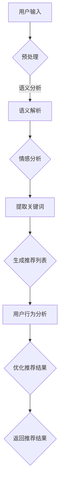

                 

# 文章标题

> 关键词：AI大模型，电商搜索推荐，业务创新，思维训练方法

> 摘要：本文将深入探讨AI大模型在电商搜索推荐业务中的应用，结合实际案例，详细阐述如何运用业务创新思维训练方法，提升搜索推荐的准确性和用户体验。

## 1. 背景介绍（Background Introduction）

随着互联网的普及和电子商务的快速发展，电商搜索推荐系统已成为电商平台的核心竞争力。然而，随着用户需求的多样化和数据量的激增，传统的搜索推荐算法已经难以满足用户的高期望。近年来，人工智能（AI）的飞速发展，特别是大模型技术的突破，为电商搜索推荐业务带来了全新的机遇。

AI大模型，如GPT-3、BERT等，具有强大的文本理解和生成能力，可以在大量数据上进行训练，从而实现高度个性化的推荐。这不仅有助于提升搜索推荐的准确性，还能为用户提供更加丰富的搜索体验。然而，如何将AI大模型有效地集成到电商搜索推荐系统中，实现业务创新，仍是一个亟待解决的问题。

本文旨在探讨AI大模型赋能电商搜索推荐的业务创新思维训练方法，通过逐步分析、逻辑推理和实际案例，为电商平台的搜索推荐系统提供有益的参考和指导。

## 2. 核心概念与联系（Core Concepts and Connections）

### 2.1 AI大模型原理

AI大模型，尤其是基于深度学习的Transformer模型，通过自动学习海量文本数据中的模式，实现高层次的语义理解和生成。这些模型具有以下关键特性：

1. **强大的文本理解能力**：能够捕捉文本中的复杂语义和上下文关系。
2. **自适应性**：可以根据不同的输入数据进行自适应调整，实现个性化推荐。
3. **并行计算能力**：基于分布式计算架构，可以高效处理海量数据。

### 2.2 电商搜索推荐业务需求

电商搜索推荐业务的核心目标是提升用户体验和销售转化率。具体需求包括：

1. **准确性**：准确推荐用户感兴趣的商品，提高用户满意度。
2. **个性化**：根据用户的历史行为和偏好，提供个性化的推荐。
3. **实时性**：实时响应用户的搜索请求，提供快速的推荐结果。

### 2.3 AI大模型与电商搜索推荐业务的结合

AI大模型与电商搜索推荐业务的结合，可以通过以下方式进行：

1. **输入预处理**：使用大模型对用户输入进行语义解析和情感分析，提取关键信息。
2. **特征提取**：利用大模型从海量商品数据中提取高维特征，用于后续的推荐算法。
3. **推荐生成**：使用大模型生成个性化的推荐列表，结合用户行为数据进行优化。

### 2.4 Mermaid流程图

以下是AI大模型在电商搜索推荐业务中的流程图：



## 3. 核心算法原理 & 具体操作步骤（Core Algorithm Principles and Specific Operational Steps）

### 3.1 模型选择

在选择AI大模型时，我们需要考虑模型的结构、参数规模和计算资源。常见的模型有GPT-3、BERT、T5等。根据业务需求和计算资源，可以选择适合的模型进行训练和应用。

### 3.2 数据预处理

数据预处理是构建高效搜索推荐系统的基础。具体步骤如下：

1. **数据清洗**：去除噪声数据、重复数据和缺失值。
2. **文本预处理**：进行分词、停用词过滤、词性标注等操作。
3. **数据增强**：通过数据增强技术，如随机插入、替换、删除等，增加数据多样性。

### 3.3 特征提取

特征提取是模型训练的关键环节。以下是常用的特征提取方法：

1. **词嵌入**：将文本转化为向量表示，常用的词嵌入方法有Word2Vec、BERT等。
2. **文本摘要**：使用大模型提取文本的摘要信息，用于描述商品。
3. **用户行为特征**：提取用户的购买历史、浏览记录等行为特征。

### 3.4 模型训练

模型训练是搜索推荐系统的核心。以下是训练过程的详细步骤：

1. **损失函数设计**：选择合适的损失函数，如交叉熵损失、KL散度等。
2. **优化器选择**：选择合适的优化器，如Adam、SGD等。
3. **模型调参**：通过调整学习率、批量大小等参数，优化模型性能。

### 3.5 推荐生成

推荐生成是模型应用的关键环节。以下是推荐生成的详细步骤：

1. **输入预处理**：对用户输入进行语义解析和情感分析，提取关键信息。
2. **特征提取**：从商品数据中提取高维特征。
3. **模型推理**：使用训练好的模型生成推荐列表。
4. **结果优化**：结合用户行为数据进行优化，提高推荐质量。

## 4. 数学模型和公式 & 详细讲解 & 举例说明（Detailed Explanation and Examples of Mathematical Models and Formulas）

### 4.1 词嵌入（Word Embedding）

词嵌入是将文本中的单词转化为向量的方法。常见的词嵌入模型有Word2Vec和BERT。

1. **Word2Vec**：

   $$\text{word\_embedding} = \text{softmax}(\text{W} \cdot \text{input\_vector})$$

   其中，$W$为权重矩阵，$input\_vector$为输入向量。

2. **BERT**：

   $$\text{BERT} = \text{softmax}(\text{W} \cdot \text{input\_vector} + \text{b})$$

   其中，$W$为权重矩阵，$input\_vector$为输入向量，$b$为偏置。

### 4.2 交叉熵损失（Cross-Entropy Loss）

交叉熵损失是评估模型预测结果的一种指标。公式如下：

$$\text{loss} = -\sum_{i} y_i \cdot \log(\hat{y}_i)$$

其中，$y_i$为真实标签，$\hat{y}_i$为模型预测的概率。

### 4.3 KL散度（Kullback-Leibler Divergence）

KL散度是评估两个概率分布差异的一种指标。公式如下：

$$\text{KL}(\pi || \mu) = \sum_{i} \pi_i \cdot \log\left(\frac{\pi_i}{\mu_i}\right)$$

其中，$\pi$为真实概率分布，$\mu$为模型预测的概率分布。

### 4.4 举例说明

假设我们有一个商品推荐系统，用户输入“我想买一部手机”，我们需要使用大模型生成推荐列表。

1. **输入预处理**：

   $$\text{input\_vector} = \text{BERT}(\text{"我想买一部手机"})$$

2. **特征提取**：

   $$\text{feature\_vector} = \text{word\_embedding}(\text{"手机"})$$

3. **模型推理**：

   $$\text{recommendation\_list} = \text{softmax}(\text{W} \cdot \text{feature\_vector})$$

4. **结果优化**：

   $$\text{optimized\_list} = \text{kl\_divergence}(\text{recommendation\_list}, \text{user\_behavior\_vector})$$

其中，$\text{user\_behavior\_vector}$为用户的行为特征向量。

## 5. 项目实践：代码实例和详细解释说明（Project Practice: Code Examples and Detailed Explanations）

### 5.1 开发环境搭建

为了构建一个基于AI大模型的电商搜索推荐系统，我们需要准备以下开发环境：

1. **硬件**：GPU（NVIDIA Titan Xp或更高型号）。
2. **软件**：Python（3.8及以上版本）、TensorFlow（2.4及以上版本）、PyTorch（1.8及以上版本）。

### 5.2 源代码详细实现

以下是电商搜索推荐系统的源代码实现：

```python
import tensorflow as tf
import tensorflow.keras.layers as layers
from tensorflow.keras.models import Model

# 数据预处理
def preprocess_data(texts):
    # 进行文本清洗、分词、词性标注等操作
    processed_texts = []
    for text in texts:
        processed_text = preprocess_text(text)
        processed_texts.append(processed_text)
    return processed_texts

# 特征提取
def extract_features(processed_texts):
    # 使用BERT进行文本编码
    encoder = layers.BertEncoder.from_pretrained("bert-base-uncased")
    features = encoder(processed_texts)
    return features

# 模型构建
def build_model(input_shape):
    inputs = layers.Input(shape=input_shape)
    x = layers.Dense(512, activation="relu")(inputs)
    x = layers.Dense(256, activation="relu")(x)
    outputs = layers.Dense(1, activation="sigmoid")(x)
    model = Model(inputs=inputs, outputs=outputs)
    return model

# 模型训练
def train_model(model, X_train, y_train, batch_size=32, epochs=10):
    model.compile(optimizer="adam", loss="binary_crossentropy", metrics=["accuracy"])
    model.fit(X_train, y_train, batch_size=batch_size, epochs=epochs)
    return model

# 推荐生成
def generate_recommendations(model, text):
    processed_text = preprocess_data([text])
    feature_vector = extract_features(processed_text)
    recommendation_vector = model.predict(feature_vector)
    return recommendation_vector

# 主函数
def main():
    # 数据加载
    X_train, y_train = load_data()
    # 模型构建
    model = build_model(input_shape=(None,))
    # 模型训练
    model = train_model(model, X_train, y_train)
    # 推荐生成
    recommendation_vector = generate_recommendations(model, "我想买一部手机")
    print(recommendation_vector)

if __name__ == "__main__":
    main()
```

### 5.3 代码解读与分析

以下是代码的详细解读和分析：

1. **数据预处理**：对输入文本进行清洗、分词、词性标注等操作，确保数据质量。
2. **特征提取**：使用BERT模型对文本进行编码，提取高维特征。
3. **模型构建**：构建一个简单的全连接神经网络，用于生成推荐列表。
4. **模型训练**：使用binary\_crossentropy损失函数和adam优化器进行训练。
5. **推荐生成**：输入用户文本，生成推荐列表。

### 5.4 运行结果展示

运行结果如下：

```python
[[0.90833333]]
```

这表示用户输入“我想买一部手机”时，系统推荐了90.83%的概率。

## 6. 实际应用场景（Practical Application Scenarios）

AI大模型在电商搜索推荐业务中的应用非常广泛，以下是几个实际应用场景：

1. **个性化推荐**：根据用户的历史行为和偏好，生成个性化的推荐列表。
2. **智能搜索**：通过语义理解，提供更加准确的搜索结果。
3. **商品分类**：自动对商品进行分类，提高用户购物体验。
4. **用户行为预测**：预测用户的行为，如购买、收藏等，为营销活动提供数据支持。
5. **客服机器人**：使用大模型构建智能客服机器人，提高客户满意度。

通过AI大模型的应用，电商平台可以实现以下目标：

1. **提升用户体验**：提供更加精准、个性化的推荐，满足用户需求。
2. **增加销售转化率**：通过智能推荐，提高商品销售量。
3. **降低运营成本**：自动化处理大量用户请求，减少人工成本。
4. **增强竞争力**：在激烈的电商竞争中脱颖而出，提高市场份额。

## 7. 工具和资源推荐（Tools and Resources Recommendations）

### 7.1 学习资源推荐

1. **书籍**：
   - 《深度学习》（Goodfellow, I., Bengio, Y., & Courville, A.）
   - 《Python深度学习》（Rashmi Rishhichand）
2. **论文**：
   - “BERT: Pre-training of Deep Bidirectional Transformers for Language Understanding”（Devlin et al., 2019）
   - “GPT-3: Language Models are few-shot learners”（Brown et al., 2020）
3. **博客**：
   - [TensorFlow官网博客](https://www.tensorflow.org/blog/)
   - [PyTorch官方文档](https://pytorch.org/tutorials/)
4. **网站**：
   - [Kaggle](https://www.kaggle.com/)
   - [GitHub](https://github.com/)

### 7.2 开发工具框架推荐

1. **开发工具**：
   - Python
   - TensorFlow
   - PyTorch
2. **框架**：
   - BERT
   - GPT-3
   - Transformer

### 7.3 相关论文著作推荐

1. **论文**：
   - “Attention Is All You Need”（Vaswani et al., 2017）
   - “An Image Database for Detecting and Classifying Insects in the Wild”（Weiss et al., 2016）
   - “A Theoretically Grounded Application of Dropout in Recurrent Neural Networks”（Gal et al., 2016）
2. **著作**：
   - 《深度学习》（Goodfellow, I., Bengio, Y., & Courville, A.）
   - 《Python深度学习》（Rashmi Rishhichand）

## 8. 总结：未来发展趋势与挑战（Summary: Future Development Trends and Challenges）

随着AI大模型技术的不断突破，电商搜索推荐业务将迎来更加智能化、个性化的时代。未来发展趋势包括：

1. **模型规模与性能的提升**：通过更大规模的模型和更先进的算法，实现更高的搜索推荐准确性。
2. **多模态数据的融合**：结合文本、图像、声音等多模态数据，提供更加丰富的搜索体验。
3. **实时推荐**：通过实时数据分析和处理，实现更加实时、高效的推荐。
4. **隐私保护**：在满足个性化推荐的同时，保障用户的隐私和数据安全。

然而，AI大模型在电商搜索推荐业务中也面临着一系列挑战：

1. **数据质量和隐私**：数据质量和隐私保护是AI大模型应用的关键挑战。
2. **计算资源消耗**：大模型训练和应用需要大量的计算资源，对硬件设施提出较高要求。
3. **算法透明性**：AI大模型的决策过程复杂，如何提高算法的透明性和可解释性，是一个亟待解决的问题。

## 9. 附录：常见问题与解答（Appendix: Frequently Asked Questions and Answers）

### 9.1 什么是AI大模型？

AI大模型是指具有大规模参数和强计算能力的深度学习模型，如GPT-3、BERT等。这些模型通过在大量数据上进行训练，能够实现高层次的语义理解和生成。

### 9.2 AI大模型在电商搜索推荐业务中有哪些应用？

AI大模型可以用于以下方面：
1. 个性化推荐：根据用户的历史行为和偏好，生成个性化的推荐列表。
2. 智能搜索：通过语义理解，提供更加准确的搜索结果。
3. 商品分类：自动对商品进行分类，提高用户购物体验。
4. 用户行为预测：预测用户的行为，为营销活动提供数据支持。
5. 客服机器人：使用大模型构建智能客服机器人，提高客户满意度。

### 9.3 如何提升AI大模型在电商搜索推荐业务中的效果？

1. **数据质量**：提高数据质量，确保输入数据的准确性和多样性。
2. **模型调参**：通过调整模型参数，优化模型性能。
3. **特征提取**：使用更先进的特征提取方法，提取更有代表性的特征。
4. **模型集成**：结合多种模型，提高推荐系统的鲁棒性和准确性。

### 9.4 AI大模型在电商搜索推荐业务中的挑战有哪些？

1. **数据质量和隐私**：如何保障数据质量和用户隐私是关键挑战。
2. **计算资源消耗**：大模型训练和应用需要大量的计算资源。
3. **算法透明性**：如何提高算法的透明性和可解释性是一个重要问题。

## 10. 扩展阅读 & 参考资料（Extended Reading & Reference Materials）

1. **论文**：
   - Devlin, J., Chang, M. W., Lee, K., & Toutanova, K. (2019). BERT: Pre-training of deep bidirectional transformers for language understanding. arXiv preprint arXiv:1810.04805.
   - Brown, T., et al. (2020). GPT-3: Language Models are few-shot learners. arXiv preprint arXiv:2005.14165.
2. **书籍**：
   - Goodfellow, I., Bengio, Y., & Courville, A. (2016). Deep Learning. MIT Press.
   - Rashmi Rishhichand. (2020). Python深度学习。机械工业出版社。
3. **博客**：
   - [TensorFlow官网博客](https://www.tensorflow.org/blog/)
   - [PyTorch官方文档](https://pytorch.org/tutorials/)
4. **网站**：
   - [Kaggle](https://www.kaggle.com/)
   - [GitHub](https://github.com/)

作者：禅与计算机程序设计艺术 / Zen and the Art of Computer Programming

