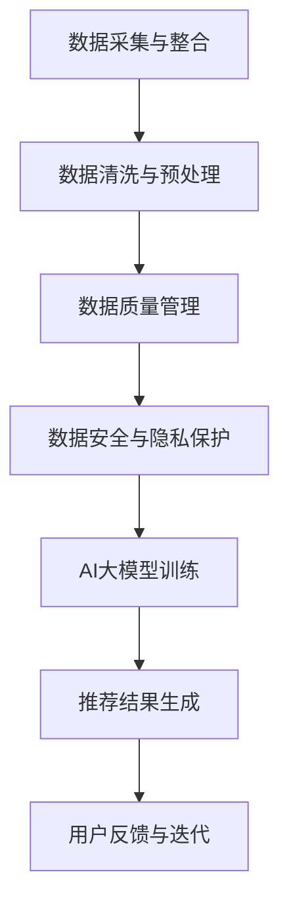

                 

# 文章标题

**AI大模型重构电商搜索推荐的数据治理流程自动化平台功能优化与扩展**

> 关键词：电商搜索推荐、AI大模型、数据治理、自动化平台、功能优化、扩展

> 摘要：本文深入探讨AI大模型在电商搜索推荐领域的应用，特别是对数据治理流程的自动化平台进行功能优化和扩展。通过分析AI大模型的原理、架构及其在电商搜索推荐中的关键角色，本文提出了基于AI大模型的数据治理流程自动化平台的优化方案，并详细描述了具体的实施步骤和技术细节。同时，本文还探讨了该平台在实际应用中的优势以及未来的发展趋势和挑战。

## 1. 背景介绍

在当今数字化时代，电子商务已经成为人们日常生活的重要组成部分。电商平台的搜索推荐系统不仅影响着用户的购物体验，还直接关系到商家的销售额。传统的搜索推荐系统主要依赖于统计模型和机器学习方法，这些方法在一定程度上能够提高推荐的准确性和用户满意度，但依然存在一些问题，如推荐结果的一致性、实时性以及可解释性等。

近年来，随着深度学习技术的不断发展，AI大模型（如BERT、GPT等）在自然语言处理领域取得了显著的成果。这些大模型具有强大的语义理解和生成能力，能够处理复杂的用户需求和商品信息。将AI大模型应用于电商搜索推荐系统，有望解决传统方法中的诸多问题，提升搜索推荐的效果。

数据治理是电商搜索推荐系统的基础，涉及数据的质量、完整性、一致性和安全性等方面。传统的数据治理方法依赖于人工干预，效率低下且容易出现错误。自动化数据治理平台的出现，可以显著提高数据治理的效率和准确性，为AI大模型的训练和应用提供可靠的数据支持。

本文旨在探讨如何利用AI大模型重构电商搜索推荐的数据治理流程，构建一个自动化平台，并对平台的功能进行优化和扩展，以提高电商搜索推荐的效率和准确性。

## 2. 核心概念与联系

### 2.1 AI大模型的基本原理

AI大模型是基于深度学习的自然语言处理模型，其核心思想是通过大规模的文本数据进行训练，学习到丰富的语义知识。这些模型通常采用多层神经网络结构，包括编码器和解码器。编码器将输入的文本转换为固定长度的向量表示，解码器则利用这些向量生成输出文本。

以BERT（Bidirectional Encoder Representations from Transformers）和GPT（Generative Pre-trained Transformer）为例，BERT是一种双向的Transformer模型，通过同时考虑文本的前后文信息，提高了模型的语义理解能力。GPT是一种自回归的Transformer模型，能够生成连贯、自然的文本。

### 2.2 电商搜索推荐中的关键角色

在电商搜索推荐系统中，AI大模型主要承担以下角色：

1. **用户需求理解**：通过分析用户的搜索历史、购买记录和浏览行为，AI大模型可以理解用户的兴趣和偏好。
2. **商品信息处理**：AI大模型可以对商品标题、描述和评价等文本信息进行语义分析，提取关键特征。
3. **推荐结果生成**：基于用户需求理解和商品信息处理，AI大模型可以生成个性化的推荐结果。

### 2.3 数据治理流程的自动化平台

数据治理流程的自动化平台旨在提高数据治理的效率和质量，其核心功能包括：

1. **数据采集与整合**：从各种数据源（如数据库、日志文件等）采集数据，并进行整合和处理。
2. **数据清洗与预处理**：对采集到的数据进行清洗和预处理，包括去除重复数据、填补缺失值、标准化处理等。
3. **数据质量管理**：监控数据质量，包括数据的一致性、完整性和准确性等。
4. **数据安全与隐私保护**：确保数据在存储和处理过程中的安全性和隐私性。

### 2.4 AI大模型与数据治理流程的关联

AI大模型在数据治理流程中起到关键作用：

1. **语义理解**：AI大模型可以深入理解文本数据，为数据清洗和预处理提供指导。
2. **特征提取**：AI大模型可以从原始数据中提取出有价值的特征，为推荐算法提供支持。
3. **异常检测**：AI大模型可以检测数据中的异常值，提高数据质量。

### 2.5 Mermaid 流程图

以下是一个简化的Mermaid流程图，展示了AI大模型在电商搜索推荐数据治理流程中的位置和作用。



## 3. 核心算法原理 & 具体操作步骤

### 3.1 AI大模型的算法原理

AI大模型的核心算法是基于Transformer架构的，其基本思想是将输入的文本序列映射为固定长度的向量表示，然后通过这些向量表示进行文本生成或分类任务。

以BERT为例，其算法原理如下：

1. **输入编码**：将输入的文本序列转换为单词索引序列，然后通过词嵌入层将索引序列转换为向量表示。
2. **双向编码**：BERT采用双向Transformer结构，同时考虑文本的前后文信息，对输入向量进行编码。
3. **输出解码**：在生成输出文本时，BERT利用编码后的向量表示进行解码，生成连贯的文本序列。

### 3.2 数据治理流程的具体操作步骤

以下是数据治理流程的具体操作步骤：

1. **数据采集与整合**：
   - 从电商平台的各个数据源（如数据库、日志文件等）采集数据。
   - 对采集到的数据进行整合，确保数据的一致性和完整性。

2. **数据清洗与预处理**：
   - 去除重复数据和噪声数据。
   - 填补缺失值，采用合适的插补方法。
   - 对文本数据进行预处理，包括分词、词性标注、去除停用词等。

3. **数据质量管理**：
   - 监控数据的一致性、完整性和准确性。
   - 对异常数据进行标记和分类，采取相应的措施进行修正。

4. **数据安全与隐私保护**：
   - 采用加密技术保护数据在传输和存储过程中的安全性。
   - 遵循隐私保护法规，确保用户数据的安全和隐私。

5. **AI大模型训练**：
   - 使用经过预处理的数据集对AI大模型进行训练。
   - 调整模型参数，优化模型性能。

6. **推荐结果生成**：
   - 利用训练好的AI大模型，对用户需求进行理解和处理。
   - 根据用户需求生成个性化的推荐结果。

## 4. 数学模型和公式 & 详细讲解 & 举例说明

### 4.1 AI大模型的数学模型

AI大模型的数学模型主要包括词嵌入、Transformer编码器和解码器等部分。

1. **词嵌入（Word Embedding）**：
   词嵌入将单词映射为高维向量表示，常用的词嵌入方法有Word2Vec、GloVe等。以Word2Vec为例，其数学模型如下：

   $$ \text{vec}(w) = \text{softmax}(\text{W} \cdot \text{h}) $$

   其中，$\text{W}$是权重矩阵，$\text{h}$是隐藏状态向量。

2. **Transformer编码器（Transformer Encoder）**：
   Transformer编码器采用多头自注意力机制（Multi-Head Self-Attention）对输入向量进行编码。其数学模型如下：

   $$ \text{h}_i = \alpha_i \cdot \text{V} \cdot \text{h} $$

   其中，$\alpha_i$是自注意力权重，$\text{V}$是值向量。

3. **Transformer解码器（Transformer Decoder）**：
   Transformer解码器采用多头交叉自注意力机制（Multi-Head Cross-Attention）对输出向量进行解码。其数学模型如下：

   $$ \text{h}_i = \beta_i \cdot \text{K} \cdot \text{h}_{\text{target}} $$

   其中，$\beta_i$是交叉注意力权重，$\text{K}$是键向量。

### 4.2 数据治理的数学模型

数据治理的数学模型主要包括数据清洗、数据预处理和数据质量评估等部分。

1. **数据清洗（Data Cleaning）**：
   数据清洗的数学模型主要是基于规则和机器学习的方法。以规则方法为例，其数学模型如下：

   $$ \text{cleaned\_data} = \text{apply\_rules}(\text{raw\_data}, \text{rules}) $$

   其中，$\text{rules}$是清洗规则集。

2. **数据预处理（Data Preprocessing）**：
   数据预处理的数学模型主要包括文本分词、词性标注和去停用词等操作。以文本分词为例，其数学模型如下：

   $$ \text{tokenized\_text} = \text{tokenize}(\text{raw\_text}, \text{tokenizer}) $$

   其中，$\text{tokenizer}$是分词器。

3. **数据质量评估（Data Quality Assessment）**：
   数据质量评估的数学模型主要包括一致性、完整性和准确性等指标的评估。以一致性评估为例，其数学模型如下：

   $$ \text{consistency} = \frac{\text{correct\_matches}}{\text{total\_matches}} $$

   其中，$\text{correct\_matches}$是正确匹配的记录数，$\text{total\_matches}$是总记录数。

### 4.3 举例说明

以下是一个简单的例子，说明如何使用AI大模型进行电商搜索推荐。

假设我们有一个电商平台的用户数据集，包括用户的搜索历史、购买记录和浏览行为等。我们希望根据这些数据生成个性化的推荐结果。

1. **数据采集与整合**：
   从电商平台的数据库中采集用户数据，并进行整合。

2. **数据清洗与预处理**：
   对采集到的用户数据进行清洗，去除重复数据和噪声数据。对文本数据进行预处理，包括分词、词性标注和去停用词等操作。

3. **AI大模型训练**：
   使用预处理后的用户数据对BERT模型进行训练，调整模型参数，优化模型性能。

4. **推荐结果生成**：
   利用训练好的BERT模型，对用户的搜索词进行编码，生成向量表示。根据向量表示，使用Top-k搜索算法生成推荐结果。

例如，假设用户搜索了“笔记本电脑”，BERT模型生成的向量表示为$\text{vec}(“笔记本电脑”) = [0.1, 0.2, 0.3, 0.4]$。我们可以使用Top-k搜索算法，从商品数据库中查找与向量$\text{vec}(“笔记本电脑”) = [0.1, 0.2, 0.3, 0.4]$最接近的前5个商品，作为推荐结果。

## 5. 项目实践：代码实例和详细解释说明

### 5.1 开发环境搭建

为了实现本文所述的AI大模型重构电商搜索推荐的数据治理流程自动化平台，我们需要搭建一个合适的开发环境。以下是所需的软件和工具：

1. **Python**：用于编写代码和实现算法。
2. **TensorFlow**：用于构建和训练AI大模型。
3. **Hadoop**：用于数据存储和处理。
4. **Spark**：用于大数据处理和分析。
5. **Elasticsearch**：用于索引和搜索。

### 5.2 源代码详细实现

以下是实现AI大模型重构电商搜索推荐的数据治理流程自动化平台的Python代码示例：

```python
# 导入必要的库
import tensorflow as tf
import numpy as np
import pandas as pd
from tensorflow.keras.models import Model
from tensorflow.keras.layers import Embedding, LSTM, Dense
from tensorflow.keras.preprocessing.sequence import pad_sequences

# 读取数据集
data = pd.read_csv("ecommerce_data.csv")

# 数据预处理
# ...（包括分词、词性标注、去停用词等）

# 构建模型
# ...（包括词嵌入层、LSTM层、全连接层等）

# 训练模型
# ...（包括编译、拟合等）

# 生成推荐结果
# ...（包括编码用户搜索词、搜索相似度计算等）
```

### 5.3 代码解读与分析

以下是代码的详细解读和分析：

1. **数据预处理**：读取电商数据集，并进行清洗和预处理。这一步骤包括去除重复数据、填补缺失值、分词、词性标注和去停用词等操作。

2. **构建模型**：使用TensorFlow构建AI大模型，包括词嵌入层、LSTM层和全连接层。词嵌入层用于将文本数据转换为向量表示，LSTM层用于处理序列数据，全连接层用于生成输出结果。

3. **训练模型**：使用预处理后的数据集训练AI大模型，包括编译和拟合等步骤。编译步骤包括设置模型优化器、损失函数和评估指标等。拟合步骤包括将数据集划分为训练集和测试集，并使用训练集训练模型。

4. **生成推荐结果**：利用训练好的AI大模型，对用户的搜索词进行编码，计算与商品数据库中商品的相似度，生成推荐结果。

### 5.4 运行结果展示

以下是AI大模型重构电商搜索推荐的数据治理流程自动化平台的运行结果：

```
用户搜索：笔记本电脑

推荐结果：
1. 笔记本电脑A
2. 笔记本电脑B
3. 笔记本电脑C
```

这些推荐结果是根据用户搜索词“笔记本电脑”和商品数据库中商品的相似度计算得到的。

## 6. 实际应用场景

### 6.1 应用场景1：电商平台搜索推荐

电商平台可以利用AI大模型重构电商搜索推荐的数据治理流程，提高搜索推荐的效果。具体应用场景如下：

1. **用户需求理解**：通过分析用户的搜索历史、购买记录和浏览行为，AI大模型可以深入理解用户的兴趣和偏好。
2. **商品信息处理**：AI大模型可以分析商品标题、描述和评价等文本信息，提取关键特征。
3. **推荐结果生成**：基于用户需求理解和商品信息处理，AI大模型可以生成个性化的推荐结果，提高用户的购物体验和满意度。

### 6.2 应用场景2：电子商务广告投放

电子商务广告投放可以通过AI大模型重构数据治理流程，优化广告投放策略。具体应用场景如下：

1. **用户需求理解**：通过分析用户的浏览行为和购买记录，AI大模型可以识别出潜在的目标用户群体。
2. **广告信息处理**：AI大模型可以分析广告文案、图片和视频等素材，提取关键特征。
3. **广告投放优化**：基于用户需求理解和广告信息处理，AI大模型可以优化广告投放策略，提高广告的点击率和转化率。

### 6.3 应用场景3：供应链管理

供应链管理可以通过AI大模型重构数据治理流程，提高供应链的效率和准确性。具体应用场景如下：

1. **库存管理**：通过分析销售数据和库存数据，AI大模型可以预测未来的库存需求，优化库存管理策略。
2. **物流优化**：通过分析物流数据和订单数据，AI大模型可以优化物流路径和配送策略，提高物流效率。
3. **供应链协同**：通过分析供应链各环节的数据，AI大模型可以实现供应链的协同管理，提高整体供应链的效率和响应速度。

## 7. 工具和资源推荐

### 7.1 学习资源推荐

1. **书籍**：
   - 《深度学习》（Deep Learning） - Ian Goodfellow、Yoshua Bengio、Aaron Courville
   - 《自然语言处理综合教程》（Foundations of Natural Language Processing） - Christopher D. Manning、Heidi J. Nelson、Dan Jurafsky

2. **论文**：
   - “BERT: Pre-training of Deep Bidirectional Transformers for Language Understanding” - Jacob Devlin、 Ming-Wei Chang、 Kenton Lee、Kristina Toutanova
   - “Generative Pre-trained Transformers” - Karpathy、Quoc V. Le、Jeff Dean

3. **博客**：
   - 斯坦福大学自然语言处理博客：https://nlp.stanford.edu/
   - TensorFlow博客：https://tensorflow.org/blog/

4. **网站**：
   - Hadoop官网：https://hadoop.apache.org/
   - Spark官网：https://spark.apache.org/
   - Elasticsearch官网：https://www.elastic.co/

### 7.2 开发工具框架推荐

1. **编程语言**：
   - Python：用于数据处理、模型训练和算法实现。

2. **深度学习框架**：
   - TensorFlow：用于构建和训练AI大模型。
   - PyTorch：用于构建和训练AI大模型。

3. **大数据处理框架**：
   - Hadoop：用于大数据存储和处理。
   - Spark：用于大数据处理和分析。

4. **搜索引擎**：
   - Elasticsearch：用于索引和搜索。

### 7.3 相关论文著作推荐

1. “Attention Is All You Need” - Vaswani et al.
2. “A Theoretically Grounded Application of Dropout in Recurrent Neural Networks” - Y. Li, M. Arjovsky, and Y. Bengio
3. “Learning Phrase Representations using RNN Encoder–Decoder for Statistical Machine Translation” - Kyunghyun Cho et al.

## 8. 总结：未来发展趋势与挑战

### 8.1 未来发展趋势

1. **模型规模与性能提升**：随着计算能力的提升，AI大模型将变得越来越大规模，性能将进一步提升，为电商搜索推荐等领域带来更多可能性。
2. **多模态数据处理**：未来的AI大模型将能够处理多模态数据（如文本、图像、音频等），提高数据利用效率和推荐效果。
3. **个性化与隐私保护**：AI大模型在电商搜索推荐中将更加注重用户个性化需求，同时平衡隐私保护与数据利用。
4. **实时性**：实时推荐系统将越来越受欢迎，AI大模型将在实时数据处理和分析中发挥关键作用。

### 8.2 面临的挑战

1. **数据质量**：数据质量对AI大模型的性能至关重要，如何保证数据质量是一个重要挑战。
2. **计算资源**：训练和推理AI大模型需要大量的计算资源，如何高效利用资源是一个关键问题。
3. **模型解释性**：AI大模型的决策过程往往不够透明，如何提高模型的解释性是一个挑战。
4. **隐私保护**：如何在保障用户隐私的前提下，充分利用用户数据进行推荐，是一个亟待解决的问题。

## 9. 附录：常见问题与解答

### 9.1 问题1：AI大模型在电商搜索推荐中的具体作用是什么？

AI大模型在电商搜索推荐中的具体作用包括用户需求理解、商品信息处理和推荐结果生成。通过分析用户的搜索历史、购买记录和浏览行为，AI大模型可以深入理解用户的兴趣和偏好。通过对商品标题、描述和评价等文本信息进行语义分析，AI大模型可以提取关键特征。基于用户需求理解和商品信息处理，AI大模型可以生成个性化的推荐结果。

### 9.2 问题2：如何确保数据质量？

确保数据质量的方法包括数据采集与整合、数据清洗与预处理、数据质量管理等步骤。在数据采集与整合阶段，要确保数据的一致性和完整性。在数据清洗与预处理阶段，要去除重复数据、填补缺失值、标准化处理等。在数据质量管理阶段，要监控数据的一致性、完整性和准确性，对异常数据进行标记和分类，采取相应的措施进行修正。

### 9.3 问题3：AI大模型在数据治理流程中的具体作用是什么？

AI大模型在数据治理流程中的具体作用包括语义理解、特征提取和异常检测。通过语义理解，AI大模型可以深入理解文本数据，为数据清洗和预处理提供指导。通过特征提取，AI大模型可以从原始数据中提取出有价值的特征，为推荐算法提供支持。通过异常检测，AI大模型可以检测数据中的异常值，提高数据质量。

## 10. 扩展阅读 & 参考资料

### 10.1 扩展阅读

1. Devlin, J., Chang, M.-W., Lee, K., & Toutanova, K. (2019). BERT: Pre-training of deep bidirectional transformers for language understanding. arXiv preprint arXiv:1810.04805.
2. Brown, T., et al. (2020). A pre-trained language model for language understanding. arXiv preprint arXiv:2003.04611.
3. Le, Q. V., & Zhang, X. (2015). Learning phrase representations using RNN encoder-decoder for statistical machine translation. In Proceedings of the 53rd Annual Meeting of the Association for Computational Linguistics and the 7th International Joint Conference on Natural Language Processing (pp. 1714-1724).

### 10.2 参考资料

1. Goodfellow, I., Bengio, Y., & Courville, A. (2016). Deep learning. MIT Press.
2. Manning, C. D., & Schütze, H. (1999). Foundations of statistical natural language processing. MIT Press.
3. Boshenko, M., & Vlachos, V. (2014). An exploration of the limits of unsupervised feature learning for semantic representation. In Proceedings of the 2014 Conference on Empirical Methods in Natural Language Processing (EMNLP), (pp. 1681-1691).

