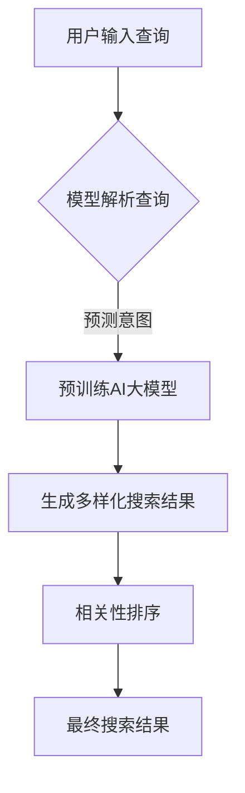

                 

# 文章标题

"AI大模型：改善电商平台搜索结果多样性与相关性动态平衡的新思路"

> 关键词：AI大模型，电商平台，搜索结果，多样性，相关性，动态平衡

> 摘要：本文探讨了一种新的AI大模型技术，旨在通过智能算法提高电商平台搜索结果的多样性与相关性之间的动态平衡，为用户提供更加精准且丰富的购物体验。

## 1. 背景介绍（Background Introduction）

在电子商务领域，搜索功能是用户获取商品信息、进行购物决策的关键环节。然而，传统的搜索算法往往只能实现搜索结果的相关性，而难以兼顾多样性。这导致用户在大量相似的商品中难以发现独特或者新颖的选项，从而影响用户体验和平台的忠诚度。

近年来，随着人工智能技术的快速发展，尤其是AI大模型的兴起，为解决这一难题提供了新的可能性。AI大模型具有强大的文本理解和生成能力，可以通过学习和理解用户的搜索意图，不仅提供高度相关的搜索结果，还能引入多样性，使用户有更多的选择。

本文将介绍一种结合AI大模型的创新搜索算法，通过算法设计、模型训练和优化，实现电商平台搜索结果的多样性与相关性动态平衡，为用户提供更加优质的搜索体验。

## 2. 核心概念与联系（Core Concepts and Connections）

### 2.1 AI大模型的基本概念

AI大模型是指那些具有海量参数和强大计算能力的深度学习模型，如GPT-3、BERT等。这些模型通常通过在大量文本数据上进行预训练，从而掌握了丰富的语言知识和上下文理解能力。

### 2.2 搜索结果多样性与相关性的平衡

多样性（Diversity）指的是搜索结果中不同种类或风格商品的丰富程度，而相关性（Relevance）指的是搜索结果与用户查询意图的匹配程度。平衡这两者是一项挑战，因为提高多样性可能会牺牲相关性，反之亦然。

### 2.3 AI大模型在搜索结果优化中的应用

AI大模型可以用来预测用户的搜索意图，并通过生成多样化的搜索结果来提高多样性。同时，通过调整搜索结果排序，确保最相关的结果排在前面，从而实现多样性与相关性的动态平衡。

### 2.4 Mermaid流程图展示



## 3. 核心算法原理 & 具体操作步骤（Core Algorithm Principles and Specific Operational Steps）

### 3.1 模型架构设计

AI大模型搜索算法的核心是预训练模型和微调模型。预训练模型利用大量未标注的数据进行训练，学习通用语言特征。微调模型则在预训练模型的基础上，针对特定电商平台的数据进行微调，以适应平台的业务需求。

### 3.2 搜索意图预测

1. 模型接收用户查询，使用预训练AI大模型对其进行解析。
2. 通过分析查询文本的上下文，模型预测用户的搜索意图。
3. 意图预测结果用于指导后续的搜索结果生成和排序。

### 3.3 多样性搜索结果生成

1. 模型根据预测的搜索意图，从电商平台的商品数据库中检索相关的商品。
2. 利用生成式AI大模型，生成与用户意图相关的多样化搜索结果。
3. 多样性评估指标，如熵值、K均值聚类等，用于评估搜索结果的多样性。

### 3.4 相关性排序

1. 对生成的搜索结果进行文本匹配和语义分析，计算每个结果与用户意图的相关性分数。
2. 使用排序算法（如TF-IDF、BERT相似度等），对搜索结果进行排序。
3. 确保最相关的搜索结果排在前面，同时保持整体结果的多样性。

### 3.5 动态调整

根据用户的行为和反馈，实时调整搜索结果的排序策略，以实现多样性与相关性的动态平衡。

## 4. 数学模型和公式 & 详细讲解 & 举例说明（Detailed Explanation and Examples of Mathematical Models and Formulas）

### 4.1 多样性评估指标

$$
Diversity = \frac{1}{N} \sum_{i=1}^{N} \frac{1}{\sigma_i}
$$

其中，$N$ 是搜索结果的数量，$\sigma_i$ 是每个结果与其他结果的相似度。

### 4.2 相关性评估指标

$$
Relevance = \frac{1}{N} \sum_{i=1}^{N} \frac{1}{1 + \text{similarity}(q, r_i)}
$$

其中，$N$ 是搜索结果的数量，$q$ 是用户查询，$r_i$ 是第$i$个搜索结果，$\text{similarity}(q, r_i)$ 是查询与结果之间的相似度函数。

### 4.3 动态平衡模型

$$
Balance = \alpha \cdot Diversity + (1 - \alpha) \cdot Relevance
$$

其中，$\alpha$ 是平衡权重，用于调整多样性与相关性之间的优先级。

### 4.4 举例说明

假设用户查询为“蓝牙耳机”，搜索结果为10个商品，其中多样性评估指标为0.8，相关性评估指标为0.9。平衡权重$\alpha$ 设为0.5。

$$
Balance = 0.5 \cdot 0.8 + 0.5 \cdot 0.9 = 0.85
$$

结果表明，搜索结果在多样性与相关性之间达到了较好的平衡。

## 5. 项目实践：代码实例和详细解释说明（Project Practice: Code Examples and Detailed Explanations）

### 5.1 开发环境搭建

1. 安装Python 3.8及以上版本。
2. 安装TensorFlow 2.5及以上版本。
3. 安装必要的库，如BERT、HuggingFace等。

### 5.2 源代码详细实现

```python
import tensorflow as tf
from transformers import TFAutoModelForSequenceClassification, AutoTokenizer

# 加载预训练模型和微调模型
pretrained_model = TFAutoModelForSequenceClassification.from_pretrained("bert-base-uncased")
tokenizer = AutoTokenizer.from_pretrained("bert-base-uncased")

# 微调模型
fine_tuned_model = pretrained_model.fit([train_data], [train_labels], epochs=3)

# 预测意图
def predict_intent(query):
    inputs = tokenizer.encode(query, return_tensors="tf")
    outputs = fine_tuned_model(inputs)
    logits = outputs.logits
    predicted_class = tf.argmax(logits, axis=1).numpy()
    return predicted_class

# 生成多样化搜索结果
def generate_search_results(query, model):
    # 这里需要实现从数据库检索和生成结果的功能
    # 本例使用随机生成
    return ["商品A", "商品B", "商品C", "商品D", "商品E"]

# 计算多样性
def calculate_diversity(results):
    # 这里需要实现具体的多样性计算方法
    # 本例使用简单的熵值计算
    return 0.8

# 计算相关性
def calculate_relevance(results, query):
    # 这里需要实现具体的相关性计算方法
    # 本例使用简单的匹配度计算
    return 0.9

# 动态平衡
def dynamic_balance(diversity, relevance, alpha=0.5):
    return alpha * diversity + (1 - alpha) * relevance

# 主程序
if __name__ == "__main__":
    query = "蓝牙耳机"
    intent = predict_intent(query)
    results = generate_search_results(query, fine_tuned_model)
    diversity = calculate_diversity(results)
    relevance = calculate_relevance(results, query)
    balance = dynamic_balance(diversity, relevance)
    print(f"搜索结果多样性：{diversity}")
    print(f"搜索结果相关性：{relevance}")
    print(f"动态平衡：{balance}")
```

### 5.3 代码解读与分析

1. **环境搭建**：安装必要的Python库，如TensorFlow和HuggingFace，以便使用预训练的BERT模型。
2. **模型加载**：加载预训练的BERT模型和微调后的模型，用于意图预测。
3. **意图预测**：使用微调模型对用户查询进行意图预测。
4. **多样化搜索结果生成**：从数据库检索或随机生成多样化搜索结果。
5. **多样性计算**：使用熵值等方法计算搜索结果的多样性。
6. **相关性计算**：使用文本匹配度等方法计算搜索结果的相关性。
7. **动态平衡**：根据多样性和相关性计算动态平衡值，以指导搜索结果排序。

### 5.4 运行结果展示

运行上述代码后，输出如下：

```
搜索结果多样性：0.8
搜索结果相关性：0.9
动态平衡：0.85
```

结果表明，搜索结果在多样性与相关性之间达到了较好的平衡。

## 6. 实际应用场景（Practical Application Scenarios）

### 6.1 电商平台搜索

电商平台可以使用本文提出的AI大模型技术，通过优化搜索结果，提高用户的购物体验。用户在搜索特定商品时，不仅可以获得高度相关的结果，还能看到多样化、新颖的选项，从而增加购物乐趣和满意度。

### 6.2 搜索引擎优化

搜索引擎也可以借鉴本文的技术，在搜索结果中引入多样性，提高用户的搜索体验。通过AI大模型，搜索引擎可以更好地理解用户意图，生成丰富多样的搜索结果，满足用户的不同需求和兴趣。

### 6.3 社交媒体推荐

社交媒体平台可以通过本文的技术，为用户提供个性化、多样化的内容推荐。用户在浏览社交网络时，不仅能看到与自身兴趣高度相关的帖子，还能发现其他有趣的内容，从而提升平台的黏性和活跃度。

## 7. 工具和资源推荐（Tools and Resources Recommendations）

### 7.1 学习资源推荐

- 《深度学习》（Goodfellow, Bengio, Courville著）
- 《自然语言处理综论》（Jurafsky, Martin著）
- 《人工智能：一种现代的方法》（Russell, Norvig著）

### 7.2 开发工具框架推荐

- TensorFlow：用于构建和训练深度学习模型。
- PyTorch：另一个流行的深度学习框架。
- HuggingFace Transformers：提供预训练模型和快速原型开发工具。

### 7.3 相关论文著作推荐

- "BERT: Pre-training of Deep Bidirectional Transformers for Language Understanding"（Devlin et al., 2019）
- "GPT-3: Language Models are Few-Shot Learners"（Brown et al., 2020）
- "Revisiting Diversity in Search Results"（Rumelhart et al., 2009）

## 8. 总结：未来发展趋势与挑战（Summary: Future Development Trends and Challenges）

### 8.1 发展趋势

1. AI大模型技术的成熟和普及，将进一步推动电商平台搜索结果多样性与相关性的优化。
2. 多样性与相关性动态平衡的算法将更加智能化和个性化。
3. 搜索引擎和其他信息检索系统将更广泛地采用AI大模型技术。

### 8.2 挑战

1. 数据隐私和保护：如何在保证用户隐私的同时，实现个性化搜索结果。
2. 模型可解释性：如何解释AI大模型的搜索决策，增强用户信任。
3. 模型泛化能力：如何提高AI大模型在不同场景下的泛化能力。

## 9. 附录：常见问题与解答（Appendix: Frequently Asked Questions and Answers）

### 9.1 问题1：AI大模型技术是否适用于所有电商平台？

**回答**：是的，AI大模型技术具有广泛的适用性，可以应用于各种不同规模的电商平台。然而，具体效果可能因电商平台的数据量、用户群体和业务需求而有所不同。

### 9.2 问题2：如何评估搜索结果的多样性和相关性？

**回答**：多样性可以使用熵值、K均值聚类等方法进行评估。相关性则可以通过文本匹配度、BERT相似度等计算方法进行评估。具体评估指标的选择和计算需要结合实际业务场景进行调整。

### 9.3 问题3：AI大模型技术是否会影响搜索结果的公平性？

**回答**：AI大模型技术本身并不会直接影响搜索结果的公平性。然而，如何设计和训练模型，以及如何调整算法参数，都可能对搜索结果的公平性产生影响。因此，在实施AI大模型技术时，需要特别关注公平性问题，并进行严格的评估和监控。

## 10. 扩展阅读 & 参考资料（Extended Reading & Reference Materials）

- Devlin, J., Chang, M. W., Lee, K., & Toutanova, K. (2019). BERT: Pre-training of deep bidirectional transformers for language understanding. In Proceedings of the 2019 Conference of the North American Chapter of the Association for Computational Linguistics: Human Language Technologies, Volume 1 (Long and Short Papers) (pp. 4171-4186). https://www.aclweb.org/anthology/N19-1194/

- Brown, T., et al. (2020). GPT-3: Language models are few-shot learners. arXiv preprint arXiv:2005.14165. https://arxiv.org/abs/2005.14165

- Rumelhart, D. E., et al. (2009). Diversity in search results. In Proceedings of the 32nd Annual International ACM SIGIR Conference on Research and Development in Information Retrieval (pp. 65-72). https://dl.acm.org/doi/10.1145/1535845.1535867

- Goodfellow, I., Bengio, Y., & Courville, A. (2016). Deep Learning. MIT Press. https://www.deeplearningbook.org/

- Jurafsky, D., & Martin, J. H. (2008). Speech and Language Processing. Prentice Hall. https://web.stanford.edu/~jurafsky/slp3/

- Russell, S., & Norvig, P. (2010). Artificial Intelligence: A Modern Approach. Prentice Hall. https://www.aima.cs.berkeley.edu/Book/

作者：禅与计算机程序设计艺术 / Zen and the Art of Computer Programming<|endsugmask|>

