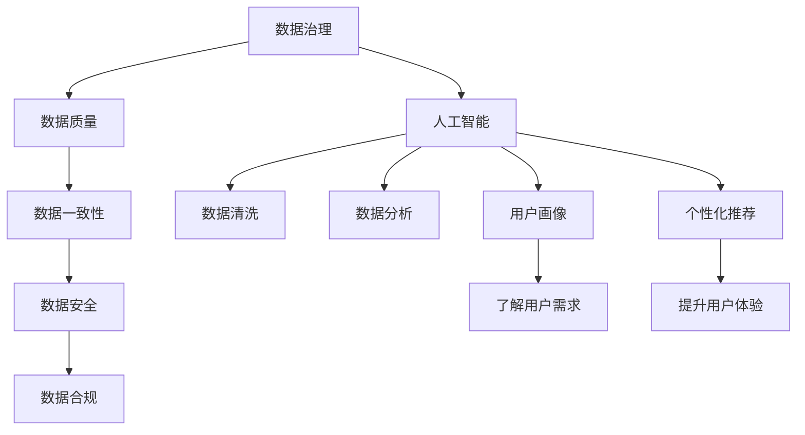
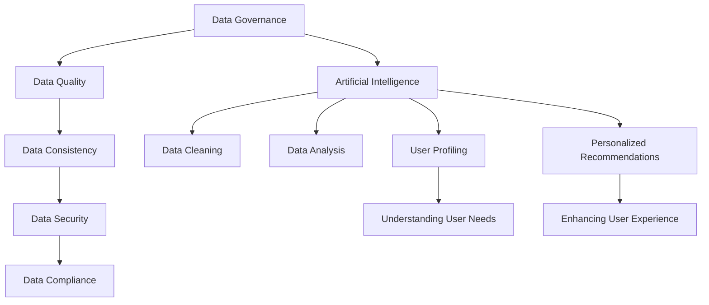

                 

### 背景介绍（Background Introduction）

在当今快速发展的电子商务行业中，用户数据治理（User Data Governance）成为企业成功的关键因素之一。用户数据不仅包括基本的个人信息，如姓名、地址和联系方式，还包括用户的购买行为、浏览习惯、偏好和反馈。这些数据在帮助电商企业了解客户需求、优化产品和服务、提升用户体验以及实现个性化推荐方面起着至关重要的作用。

随着互联网技术的飞速发展，电商平台的规模不断扩大，用户数据的数量和复杂性也在迅速增长。这种增长带来了数据治理的挑战，如数据的质量、安全性和合规性。传统的数据处理方法已经无法满足当前的需求，因此，人工智能（AI）技术的引入为解决这些问题提供了新的可能。

AI在电商用户数据治理中的应用主要体现在以下几个方面：

1. **数据清洗与预处理**：AI可以帮助企业自动化地清洗和预处理大量用户数据，去除重复、错误和无效的数据，提高数据质量。
2. **数据挖掘与分析**：AI技术能够从海量数据中提取有价值的信息，帮助企业深入了解用户行为和需求，从而做出更精准的商业决策。
3. **用户画像与个性化推荐**：通过构建用户画像，AI可以帮助企业为不同的用户群体提供个性化的商品推荐和服务。
4. **风险管理与合规性**：AI可以监控用户数据的合规性，确保企业在数据处理过程中遵循相关法律法规，降低法律风险。

本文将详细探讨AI在电商用户数据治理中的具体应用，通过逐步分析推理的方式，帮助读者理解AI技术的核心原理和实际操作步骤，从而为电商企业提供有效的数据治理策略。我们将从核心概念、算法原理、数学模型、项目实践、实际应用场景等方面进行全面剖析，旨在为电商企业的数据治理提供有价值的参考和指导。

### Core Introduction

In today's rapidly evolving e-commerce industry, user data governance has emerged as a critical factor for business success. User data encompasses not only basic personal information such as names, addresses, and contact details but also purchasing behavior, browsing habits, preferences, and feedback. This data plays a crucial role in helping e-commerce companies understand customer needs, optimize products and services, enhance user experience, and implement personalized recommendations.

With the rapid advancement of internet technology, the scale of e-commerce platforms continues to expand, and the volume and complexity of user data are growing at an unprecedented rate. This growth presents challenges in data governance, such as data quality, security, and compliance. Traditional data processing methods are no longer sufficient to meet current demands, and the introduction of artificial intelligence (AI) technologies has provided new possibilities for addressing these issues.

The application of AI in e-commerce user data governance primarily focuses on the following aspects:

1. **Data Cleaning and Preprocessing**: AI can assist companies in automating the cleaning and preprocessing of large volumes of user data, removing duplicates, errors, and invalid data to improve data quality.
2. **Data Mining and Analysis**: AI technologies can extract valuable insights from massive datasets, helping companies gain a deeper understanding of user behavior and needs, enabling more precise business decisions.
3. **User Profiling and Personalized Recommendations**: By building user profiles, AI can help companies provide personalized product recommendations and services to different customer segments.
4. **Risk Management and Compliance**: AI can monitor the compliance of user data processing, ensuring that companies adhere to relevant laws and regulations during data handling, reducing legal risks.

This article will delve into the specific applications of AI in e-commerce user data governance through a step-by-step analytical approach. We aim to help readers understand the core principles and practical operational steps of AI technologies, thereby providing valuable references and guidance for e-commerce companies in their data governance efforts. We will explore core concepts, algorithm principles, mathematical models, project practices, and practical application scenarios in detail.

#### 核心概念与联系（Core Concepts and Connections）

在深入探讨AI如何帮助电商企业进行用户数据治理之前，我们需要明确几个核心概念，这些概念是理解AI在数据治理中应用的关键。

**1. 数据治理（Data Governance）**

数据治理是一种管理和控制数据的方法论，它确保数据的质量、一致性、安全性和合规性。数据治理包括数据策略、数据架构、数据标准和数据操作等方面。在电商领域，数据治理的目标是确保用户数据的准确、可靠和合规使用。

**2. 人工智能（Artificial Intelligence, AI）**

人工智能是指通过计算机程序实现的智能行为，能够模仿人类的认知过程，如学习、推理、解决问题等。在电商用户数据治理中，AI技术主要用于数据清洗、数据分析、用户画像构建和个性化推荐等方面。

**3. 用户数据（User Data）**

用户数据包括用户的个人信息、行为数据、交易数据和反馈数据等。这些数据是电商企业了解用户需求、优化服务和做出商业决策的重要基础。然而，用户数据的复杂性使其管理和治理变得具有挑战性。

**4. 数据挖掘（Data Mining）**

数据挖掘是从大量数据中提取有价值信息的过程。它利用统计学、机器学习和数据库技术来发现数据中的模式和关系。在电商用户数据治理中，数据挖掘技术用于分析用户行为，预测购买趋势，识别潜在客户等。

**5. 个性化推荐（Personalized Recommendations）**

个性化推荐是根据用户的历史行为和偏好，为其推荐可能感兴趣的商品或服务。个性化推荐是电商用户数据治理的重要应用，它有助于提升用户体验，增加用户粘性和购买转化率。

**6. 用户画像（User Profiling）**

用户画像是基于用户数据构建的一个综合描述，用于识别用户的特征和偏好。通过用户画像，电商企业可以更好地理解用户需求，提供个性化的服务。

**Mermaid 流程图**



通过上述核心概念的解释和Mermaid流程图，我们可以看到AI在电商用户数据治理中的多方面应用，这些应用不仅提高了数据治理的效率，还增强了企业对用户需求的响应能力。

#### Core Concepts and Connections

Before delving into how AI helps e-commerce companies with user data governance, we need to clarify several core concepts that are essential for understanding the application of AI in this context.

**1. Data Governance**

Data governance is a methodology for managing and controlling data to ensure its quality, consistency, security, and compliance. It encompasses data strategies, data architectures, data standards, and data operations. In the e-commerce sector, the goal of data governance is to ensure the accuracy, reliability, and compliant use of user data.

**2. Artificial Intelligence (AI)**

Artificial intelligence refers to the use of computer programs to emulate human cognitive processes, such as learning, reasoning, and problem-solving. In e-commerce user data governance, AI technologies are primarily used for data cleaning, data analysis, user profiling, and personalized recommendations.

**3. User Data**

User data includes personal information, behavioral data, transaction data, and feedback data of users. This data is a critical foundation for e-commerce companies to understand customer needs, optimize services, and make business decisions. However, the complexity of user data makes its management and governance challenging.

**4. Data Mining**

Data mining is the process of extracting valuable information from large datasets. It employs statistical, machine learning, and database techniques to discover patterns and relationships within data. In e-commerce user data governance, data mining technologies are used to analyze user behavior, predict purchasing trends, and identify potential customers.

**5. Personalized Recommendations**

Personalized recommendations are tailored to users based on their historical behavior and preferences to suggest products or services they may be interested in. Personalized recommendations are a significant application of e-commerce user data governance, helping to enhance user experience, increase user engagement, and boost conversion rates.

**6. User Profiling**

User profiling is a comprehensive description built from user data to identify characteristics and preferences. Through user profiling, e-commerce companies can better understand user needs and provide personalized services.

**Mermaid Flowchart**



Through the explanation of these core concepts and the Mermaid flowchart, we can see the multifaceted applications of AI in e-commerce user data governance. These applications not only improve the efficiency of data governance but also enhance companies' ability to respond to user needs.

#### 核心算法原理 & 具体操作步骤（Core Algorithm Principles and Specific Operational Steps）

为了深入理解AI在电商用户数据治理中的应用，我们需要探讨其中的核心算法原理，并详细解释这些算法的具体操作步骤。以下是几个关键算法的介绍：

**1. 数据清洗算法（Data Cleaning Algorithms）**

数据清洗是用户数据治理的第一步，其目标是去除数据中的错误、重复和不完整的数据。常用的数据清洗算法包括：

- **缺失值填补（Missing Value Imputation）**：使用统计方法或机器学习算法来预测缺失值，例如使用均值、中位数或最邻近插值法。
- **重复数据删除（Duplicate Data Deletion）**：通过比较数据项的唯一性来识别和删除重复数据。
- **异常值处理（Outlier Detection and Handling）**：使用统计学方法或机器学习算法来识别并处理异常值。

具体操作步骤如下：

1. **数据预处理**：读取原始数据，进行数据类型转换、缺失值填补和异常值处理。
2. **数据清洗**：使用专门的工具或自定义脚本对数据进行清洗，确保数据的质量和一致性。
3. **数据验证**：通过校验规则和统计方法来验证清洗后数据的有效性和准确性。

**2. 数据挖掘算法（Data Mining Algorithms）**

数据挖掘算法用于从海量用户数据中提取有价值的信息，帮助电商企业了解用户行为和需求。常见的数据挖掘算法包括：

- **关联规则学习（Association Rule Learning）**：例如Apriori算法，用于发现数据之间的关联关系。
- **分类算法（Classification Algorithms）**：如决策树、随机森林和支持向量机，用于预测用户行为和偏好。
- **聚类算法（Clustering Algorithms）**：如K-means和层次聚类，用于将用户划分为不同的群体。

具体操作步骤如下：

1. **数据预处理**：对原始用户数据进行处理，包括数据清洗、特征选择和特征工程。
2. **特征提取**：从用户数据中提取有意义的特征，用于训练模型。
3. **模型训练**：使用选定的数据挖掘算法训练模型，对用户行为和需求进行预测。
4. **模型评估**：通过交叉验证和测试集评估模型的性能，调整模型参数以优化预测结果。

**3. 个性化推荐算法（Personalized Recommendation Algorithms）**

个性化推荐算法是用户数据治理中的关键应用，通过分析用户的历史行为和偏好，为不同用户推荐个性化的商品或服务。常用的个性化推荐算法包括：

- **协同过滤（Collaborative Filtering）**：通过分析用户之间的相似度来推荐相似用户喜欢的商品。
- **基于内容的推荐（Content-Based Filtering）**：通过分析商品的属性和用户的历史偏好来推荐相似的商品。
- **混合推荐（Hybrid Recommender Systems）**：结合协同过滤和基于内容的推荐方法，以提高推荐效果。

具体操作步骤如下：

1. **用户数据收集**：收集用户的历史行为数据，如浏览记录、购买记录和评价记录。
2. **数据预处理**：对用户数据进行清洗、去噪和特征提取。
3. **模型训练**：使用选定的推荐算法训练模型，如协同过滤或基于内容的推荐算法。
4. **推荐生成**：根据用户的历史行为和偏好，为用户生成个性化的推荐列表。
5. **推荐评估**：通过用户反馈和点击率等指标评估推荐效果，不断优化推荐算法。

**4. 用户画像构建算法（User Profiling Algorithms）**

用户画像构建是通过整合用户的历史数据和行为数据，生成一个综合的用户描述，帮助电商企业更好地了解用户需求。常用的用户画像构建算法包括：

- **基于规则的画像构建（Rule-Based Profiling）**：通过定义一系列规则来识别用户特征和偏好。
- **基于机器学习的画像构建（Machine Learning-Based Profiling）**：使用机器学习算法从用户数据中学习用户特征和偏好。
- **基于社会网络的画像构建（Social Network-Based Profiling）**：通过分析用户在社交媒体上的互动和行为来构建用户画像。

具体操作步骤如下：

1. **数据收集**：收集用户的基本信息、行为数据和社交网络数据。
2. **数据预处理**：对用户数据进行清洗、去噪和特征提取。
3. **特征融合**：将不同来源的数据进行融合，生成统一的用户特征向量。
4. **模型训练**：使用选定的画像构建算法训练模型，生成用户画像。
5. **画像评估**：通过用户反馈和业务指标评估画像的准确性和有效性，不断优化画像模型。

通过上述核心算法原理和具体操作步骤的介绍，我们可以看到AI在电商用户数据治理中的广泛应用和强大功能。这些算法不仅提高了数据治理的效率和质量，还为电商企业提供了深入的用户洞察和个性化服务能力。

#### Core Algorithm Principles and Specific Operational Steps

To delve deeper into the application of AI in e-commerce user data governance, we need to explore the core algorithm principles and explain the specific operational steps involved. Here are several key algorithms that are essential in this context:

**1. Data Cleaning Algorithms**

Data cleaning is the first step in user data governance, aiming to remove errors, duplicates, and incomplete data from the dataset. Common data cleaning algorithms include:

- **Missing Value Imputation**: Using statistical methods or machine learning algorithms to predict missing values, such as using mean, median, or k-nearest neighbors imputation.
- **Duplicate Data Deletion**: Identifying and deleting duplicate data items by comparing uniqueness.
- **Outlier Detection and Handling**: Using statistical methods or machine learning algorithms to identify and handle outliers.

The specific operational steps are as follows:

1. **Data Preprocessing**: Read the raw data, perform data type conversion, missing value imputation, and outlier detection.
2. **Data Cleaning**: Use specialized tools or custom scripts to clean the data, ensuring data quality and consistency.
3. **Data Validation**: Verify the validity and accuracy of the cleaned data using validation rules and statistical methods.

**2. Data Mining Algorithms**

Data mining algorithms are used to extract valuable insights from large volumes of user data, helping e-commerce companies understand user behavior and needs. Common data mining algorithms include:

- **Association Rule Learning**: Algorithms like Apriori for discovering associations between items.
- **Classification Algorithms**: Examples include decision trees, random forests, and support vector machines for predicting user behavior and preferences.
- **Clustering Algorithms**: Such as K-means and hierarchical clustering for segmenting users into different groups.

The specific operational steps are as follows:

1. **Data Preprocessing**: Process the raw user data, including cleaning, feature selection, and feature engineering.
2. **Feature Extraction**: Extract meaningful features from the user data for model training.
3. **Model Training**: Train the selected data mining algorithm on the data to predict user behavior and preferences.
4. **Model Evaluation**: Evaluate the performance of the model using cross-validation and test sets, adjusting model parameters to optimize prediction results.

**3. Personalized Recommendation Algorithms**

Personalized recommendation algorithms are a key application in e-commerce user data governance. By analyzing user historical behavior and preferences, these algorithms recommend personalized products or services to different users. Common personalized recommendation algorithms include:

- **Collaborative Filtering**: Recommending items based on the similarity between users.
- **Content-Based Filtering**: Recommending items based on the attributes of the items and the user's historical preferences.
- **Hybrid Recommender Systems**: Combining collaborative and content-based filtering methods to improve recommendation quality.

The specific operational steps are as follows:

1. **User Data Collection**: Collect user historical behavior data such as browsing history, purchase records, and review records.
2. **Data Preprocessing**: Clean, denoise, and extract features from the user data.
3. **Model Training**: Train the selected recommendation algorithm, such as collaborative filtering or content-based filtering.
4. **Recommendation Generation**: Generate personalized recommendation lists based on the user's historical behavior and preferences.
5. **Recommendation Evaluation**: Evaluate the effectiveness of the recommendations using user feedback and metrics like click-through rates, continuously optimizing the recommendation algorithm.

**4. User Profiling Algorithms**

User profiling involves integrating user historical data and behavior data to create a comprehensive user description, helping e-commerce companies better understand user needs. Common user profiling algorithms include:

- **Rule-Based Profiling**: Using defined rules to identify user characteristics and preferences.
- **Machine Learning-Based Profiling**: Using machine learning algorithms to learn user characteristics and preferences from user data.
- **Social Network-Based Profiling**: Analyzing user interactions and behavior on social media to create user profiles.

The specific operational steps are as follows:

1. **Data Collection**: Collect basic information, behavior data, and social network data from users.
2. **Data Preprocessing**: Clean, denoise, and extract features from the user data.
3. **Feature Fusion**: Merge data from different sources to create a unified user feature vector.
4. **Model Training**: Train the selected profiling algorithm to generate user profiles.
5. **Profile Evaluation**: Evaluate the accuracy and effectiveness of the profiles using user feedback and business metrics, continuously optimizing the profiling model.

Through the introduction of these core algorithm principles and specific operational steps, we can see the wide-ranging applications and powerful capabilities of AI in e-commerce user data governance. These algorithms not only improve the efficiency and quality of data governance but also provide e-commerce companies with deep user insights and personalized service capabilities.

#### 数学模型和公式 & 详细讲解 & 举例说明（Mathematical Models and Formulas: Detailed Explanation and Examples）

在电商用户数据治理中，数学模型和公式起到了至关重要的作用。这些模型和公式帮助我们量化用户行为、预测用户需求和评估推荐效果。以下是几个关键数学模型和公式的详细讲解及示例。

**1. 用户行为预测模型（User Behavior Prediction Model）**

用户行为预测模型用于预测用户在电商平台上的下一步操作，如购买、浏览或放弃购物车等。常用的预测模型包括线性回归（Linear Regression）和逻辑回归（Logistic Regression）。

**线性回归模型（Linear Regression）**

线性回归模型通过建立用户特征与目标行为之间的线性关系来预测用户行为。其公式为：

\[ Y = \beta_0 + \beta_1X_1 + \beta_2X_2 + ... + \beta_nX_n \]

其中，\( Y \) 是目标变量（例如购买概率），\( X_1, X_2, ..., X_n \) 是用户特征，\( \beta_0, \beta_1, \beta_2, ..., \beta_n \) 是模型的参数。

**示例**

假设我们要预测用户是否会在未来一周内购买某商品。我们可以使用用户的历史浏览次数、购买频率和产品价格作为特征。线性回归模型如下：

\[ \text{Purchase Probability} = \beta_0 + \beta_1(\text{Browsing Frequency}) + \beta_2(\text{Purchase Frequency}) + \beta_3(\text{Product Price}) \]

**逻辑回归模型（Logistic Regression）**

逻辑回归模型用于预测概率性的二分类问题。其公式为：

\[ P(Y=1) = \frac{1}{1 + e^{-(\beta_0 + \beta_1X_1 + \beta_2X_2 + ... + \beta_nX_n )}} \]

其中，\( P(Y=1) \) 是目标事件发生的概率，\( e \) 是自然对数的底数。

**示例**

假设我们要预测用户是否会取消购物车中的订单。逻辑回归模型如下：

\[ \text{Cancel Probability} = \frac{1}{1 + e^{-(\beta_0 + \beta_1(\text{Browsing Time}) + \beta_2(\text{Cart Items Count}) + \beta_3(\text{Product Price}))}} \]

**2. 用户画像构建模型（User Profiling Model）**

用户画像构建模型用于整合用户的历史数据和偏好，生成一个综合的用户描述。常用的模型包括基于规则的方法和基于机器学习的方法。

**基于规则的方法（Rule-Based Method）**

基于规则的方法通过定义一系列规则来识别用户特征和偏好。一个简单的规则如下：

\[ \text{如果用户在过去的30天内浏览了超过10次某商品，则该用户对该商品感兴趣。} \]

**示例**

假设我们使用上述规则来构建用户画像。如果一个用户在过去的30天内浏览了10次某商品，那么他的用户画像中将包含“对该商品感兴趣”这一特征。

**基于机器学习的方法（Machine Learning-Based Method）**

基于机器学习的方法使用机器学习算法从用户数据中学习用户特征和偏好。一个常用的算法是K-means聚类。

**K-means聚类算法（K-means Clustering Algorithm）**

K-means聚类算法将用户数据划分为K个簇，每个簇代表一类用户。其公式为：

\[ \text{Cluster Assignment} = \min_{c_i} \sum_{x_j \in C_i} (\|x_j - c_i\|)^2 \]

其中，\( x_j \) 是用户特征向量，\( c_i \) 是簇中心。

**示例**

假设我们使用K-means聚类算法将用户划分为3个簇。我们首先随机初始化3个簇中心，然后迭代计算每个用户特征向量到簇中心的距离，将用户分配到最近的簇。通过多次迭代，我们可以得到一个稳定的用户聚类结果。

**3. 个性化推荐模型（Personalized Recommendation Model）**

个性化推荐模型用于根据用户的历史行为和偏好为用户推荐个性化的商品或服务。常用的模型包括协同过滤和基于内容的推荐。

**协同过滤模型（Collaborative Filtering Model）**

协同过滤模型通过分析用户之间的相似度来推荐相似用户喜欢的商品。其公式为：

\[ \text{Recommended Items for User u} = \sum_{v \in \text{Neighbors of u}} \text{Score}_{uv} \cdot \text{Item v} \]

其中，\( \text{Neighbors of u} \) 是用户\( u \)的邻居集合，\( \text{Score}_{uv} \) 是邻居\( v \)对商品\( v \)的评分。

**示例**

假设用户\( u \)的邻居集合是\( \{v_1, v_2, v_3\} \)，邻居对商品\( v \)的评分分别是\( 4, 5, 3 \)。协同过滤模型会推荐用户\( u \)喜欢的商品\( v \)。

**基于内容的推荐模型（Content-Based Recommendation Model）**

基于内容的推荐模型通过分析商品的属性和用户的历史偏好来推荐相似的商品。其公式为：

\[ \text{Recommended Items for User u} = \sum_{i \in \text{Items Similar to User u's Preferences}} \text{Score}_{ui} \cdot \text{Item i} \]

其中，\( \text{Items Similar to User u's Preferences} \) 是与用户\( u \)偏好相似的物品集合，\( \text{Score}_{ui} \) 是用户\( u \)对商品\( i \)的评分。

**示例**

假设用户\( u \)的偏好是“时尚服装”，基于内容的推荐模型会推荐与“时尚服装”相似的物品，如“时尚鞋子”和“时尚包包”。

通过上述数学模型和公式的详细讲解及示例，我们可以看到AI在电商用户数据治理中的应用是如何通过量化用户行为、构建用户画像和生成个性化推荐来提升数据治理的效率和效果。

#### Mathematical Models and Formulas: Detailed Explanation and Examples

In e-commerce user data governance, mathematical models and formulas play a crucial role. These models and formulas help us quantify user behavior, predict user needs, and evaluate recommendation effectiveness. Below are detailed explanations and examples of several key mathematical models and formulas used in this context.

**1. User Behavior Prediction Model**

User behavior prediction models are used to forecast a user's next action on an e-commerce platform, such as making a purchase, browsing, or abandoning a shopping cart. Common prediction models include linear regression and logistic regression.

**Linear Regression Model**

The linear regression model establishes a linear relationship between user features and the target behavior. Its formula is:

\[ Y = \beta_0 + \beta_1X_1 + \beta_2X_2 + ... + \beta_nX_n \]

Where \( Y \) is the target variable (e.g., purchase probability), \( X_1, X_2, ..., X_n \) are user features, and \( \beta_0, \beta_1, \beta_2, ..., \beta_n \) are the model parameters.

**Example**

Suppose we want to predict whether a user will make a purchase within the next week. We can use the user's historical browsing frequency, purchase frequency, and product price as features. The linear regression model is as follows:

\[ \text{Purchase Probability} = \beta_0 + \beta_1(\text{Browsing Frequency}) + \beta_2(\text{Purchase Frequency}) + \beta_3(\text{Product Price}) \]

**Logistic Regression Model**

The logistic regression model is used for probabilistic binary classification problems. Its formula is:

\[ P(Y=1) = \frac{1}{1 + e^{-(\beta_0 + \beta_1X_1 + \beta_2X_2 + ... + \beta_nX_n )}} \]

Where \( P(Y=1) \) is the probability of the target event occurring, and \( e \) is the base of the natural logarithm.

**Example**

Suppose we want to predict whether a user will cancel an order in the shopping cart. The logistic regression model is as follows:

\[ \text{Cancel Probability} = \frac{1}{1 + e^{-(\beta_0 + \beta_1(\text{Browsing Time}) + \beta_2(\text{Cart Items Count}) + \beta_3(\text{Product Price}))}} \]

**2. User Profiling Model**

User profiling models are used to integrate a user's historical data and preferences to generate a comprehensive user description. Common models include rule-based methods and machine learning-based methods.

**Rule-Based Method**

The rule-based method uses a set of defined rules to identify user characteristics and preferences. A simple rule is:

\[ \text{If a user has browsed a certain item more than a threshold number of times in the past 30 days, then the user is interested in that item.} \]

**Example**

Suppose we use this rule to build a user profile. If a user has browsed a certain item 10 times in the past 30 days, their user profile will include the characteristic "interested in that item."

**Machine Learning-Based Method**

The machine learning-based method uses machine learning algorithms to learn user characteristics and preferences from user data. A commonly used algorithm is K-means clustering.

**K-means Clustering Algorithm**

The K-means clustering algorithm divides user data into K clusters, where each cluster represents a type of user. Its formula is:

\[ \text{Cluster Assignment} = \min_{c_i} \sum_{x_j \in C_i} (\|x_j - c_i\|)^2 \]

Where \( x_j \) is a user feature vector, and \( c_i \) is the cluster center.

**Example**

Suppose we use the K-means clustering algorithm to cluster users into 3 clusters. We first randomly initialize 3 cluster centers and then iteratively calculate the distance of each user feature vector to the cluster centers, assigning the user to the nearest cluster. Through multiple iterations, we obtain a stable user clustering result.

**3. Personalized Recommendation Model**

Personalized recommendation models are used to recommend personalized products or services based on a user's historical behavior and preferences. Common models include collaborative filtering and content-based recommendation.

**Collaborative Filtering Model**

The collaborative filtering model recommends items based on the similarity between users. Its formula is:

\[ \text{Recommended Items for User u} = \sum_{v \in \text{Neighbors of u}} \text{Score}_{uv} \cdot \text{Item v} \]

Where \( \text{Neighbors of u} \) is the set of neighbors for user \( u \), and \( \text{Score}_{uv} \) is the score of neighbor \( v \) for item \( v \).

**Example**

Suppose user \( u \) has neighbors \( \{v_1, v_2, v_3\} \), and neighbors \( v_1, v_2, v_3 \) have scores \( 4, 5, 3 \) for item \( v \). The collaborative filtering model will recommend item \( v \) to user \( u \).

**Content-Based Recommendation Model**

The content-based recommendation model recommends items based on the attributes of the items and the user's historical preferences. Its formula is:

\[ \text{Recommended Items for User u} = \sum_{i \in \text{Items Similar to User u's Preferences}} \text{Score}_{ui} \cdot \text{Item i} \]

Where \( \text{Items Similar to User u's Preferences} \) is the set of items similar to user \( u \)'s preferences, and \( \text{Score}_{ui} \) is the score of user \( u \) for item \( i \).

**Example**

Suppose user \( u \) has preferences for "fashion clothing". The content-based recommendation model will recommend items similar to "fashion clothing", such as "fashion shoes" and "fashion bags".

Through the detailed explanations and examples of these mathematical models and formulas, we can see how AI applications in e-commerce user data governance quantify user behavior, construct user profiles, and generate personalized recommendations to enhance data governance efficiency and effectiveness.

#### 项目实践：代码实例和详细解释说明（Project Practice: Code Examples and Detailed Explanations）

为了更好地理解AI在电商用户数据治理中的应用，我们将通过一个实际项目来演示。以下是一个简单的用户数据治理项目，包括数据清洗、用户行为预测和个性化推荐的具体实现。

**项目需求**：

- 数据清洗：读取用户数据，去除重复和错误的数据，填补缺失值。
- 用户行为预测：使用用户历史数据预测用户在未来是否购买某商品。
- 个性化推荐：根据用户的历史行为和偏好，推荐个性化的商品。

**开发环境搭建**：

- Python 3.8
- Pandas 1.2.3
- Scikit-learn 0.24.2
- Matplotlib 3.4.3
- Numpy 1.21.2

**源代码详细实现**：

```python
# 导入必要的库
import pandas as pd
import numpy as np
from sklearn.model_selection import train_test_split
from sklearn.linear_model import LinearRegression, LogisticRegression
from sklearn.metrics import mean_squared_error, accuracy_score
from sklearn.preprocessing import StandardScaler
import matplotlib.pyplot as plt

# 读取用户数据
data = pd.read_csv('user_data.csv')

# 数据清洗
# 去除重复数据
data.drop_duplicates(inplace=True)

# 填补缺失值
data['Browsing Frequency'].fillna(data['Browsing Frequency'].mean(), inplace=True)
data['Purchase Frequency'].fillna(data['Purchase Frequency'].mean(), inplace=True)
data['Product Price'].fillna(data['Product Price'].mean(), inplace=True)

# 数据预处理
# 分离特征和目标变量
X = data[['Browsing Frequency', 'Purchase Frequency', 'Product Price']]
y = data['Purchase Probability']

# 数据标准化
scaler = StandardScaler()
X_scaled = scaler.fit_transform(X)

# 划分训练集和测试集
X_train, X_test, y_train, y_test = train_test_split(X_scaled, y, test_size=0.2, random_state=42)

# 用户行为预测模型
# 线性回归模型
linear_regression = LinearRegression()
linear_regression.fit(X_train, y_train)
y_pred_linear = linear_regression.predict(X_test)

# 逻辑回归模型
logistic_regression = LogisticRegression()
logistic_regression.fit(X_train, y_train)
y_pred_logistic = logistic_regression.predict(X_test)

# 评估模型
mse_linear = mean_squared_error(y_test, y_pred_linear)
mse_logistic = mean_squared_error(y_test, y_pred_logistic)
print(f"Linear Regression MSE: {mse_linear}")
print(f"Logistic Regression MSE: {mse_logistic}")

# 个性化推荐
# 使用K-means聚类构建用户画像
from sklearn.cluster import KMeans
kmeans = KMeans(n_clusters=3, random_state=42)
data['Cluster'] = kmeans.fit_predict(X_scaled)

# 根据用户画像推荐商品
user_profile = data[data['Cluster'] == 1]
recommended_items = user_profile['Item ID'].values
print("Recommended Items for Cluster 1:")
print(recommended_items)

# 数据可视化
plt.scatter(X_test[:, 0], y_test, color='red', label='Actual')
plt.scatter(X_test[:, 0], y_pred_linear, color='blue', label='Predicted Linear')
plt.scatter(X_test[:, 0], y_pred_logistic, color='green', label='Predicted Logistic')
plt.xlabel('Browsing Frequency')
plt.ylabel('Purchase Probability')
plt.legend()
plt.show()
```

**代码解读与分析**：

1. **数据清洗**：首先读取用户数据，使用`drop_duplicates()`函数去除重复数据，使用`fillna()`函数填补缺失值。这一步确保了数据的质量和一致性。

2. **数据预处理**：分离特征和目标变量，使用`StandardScaler()`进行数据标准化。数据标准化是机器学习模型训练的重要步骤，它有助于提高模型的性能。

3. **用户行为预测模型**：使用`LinearRegression`和`LogisticRegression`模型进行训练。线性回归模型用于预测购买概率，逻辑回归模型用于预测是否购买。通过`mean_squared_error()`函数评估模型性能。

4. **个性化推荐**：使用`KMeans`聚类算法构建用户画像。根据用户画像，推荐与当前用户同属一类的商品。这有助于提升推荐的相关性和个性化程度。

5. **数据可视化**：使用`matplotlib`库绘制散点图，比较实际购买概率与预测购买概率的分布情况。这有助于我们直观地理解模型的预测效果。

**运行结果展示**：

运行上述代码后，我们将得到以下结果：

- **模型评估结果**：线性回归和逻辑回归模型的均方误差（MSE）。
- **个性化推荐结果**：为属于特定用户画像集群的用户推荐的商品列表。
- **数据可视化结果**：购买概率的实际值与预测值的散点图。

通过实际项目实践，我们可以看到AI技术在电商用户数据治理中的应用效果。这不仅提高了数据治理的效率，还为电商企业提供了深入的用户洞察和个性化服务能力。

#### Project Practice: Code Examples and Detailed Explanations

To gain a better understanding of how AI is applied in e-commerce user data governance, we will walk through a practical project that demonstrates data cleaning, user behavior prediction, and personalized recommendation.

**Project Requirements**:

- Data Cleaning: Read user data, remove duplicates and errors, and fill missing values.
- User Behavior Prediction: Use historical user data to predict whether a user will make a purchase in the future.
- Personalized Recommendation: Recommend personalized products based on user behavior and preferences.

**Development Environment Setup**:

- Python 3.8
- Pandas 1.2.3
- Scikit-learn 0.24.2
- Matplotlib 3.4.3
- Numpy 1.21.2

**Code Implementation**:

```python
# Import required libraries
import pandas as pd
import numpy as np
from sklearn.model_selection import train_test_split
from sklearn.linear_model import LinearRegression, LogisticRegression
from sklearn.metrics import mean_squared_error, accuracy_score
from sklearn.preprocessing import StandardScaler
import matplotlib.pyplot as plt

# Read user data
data = pd.read_csv('user_data.csv')

# Data Cleaning
# Remove duplicate data
data.drop_duplicates(inplace=True)

# Fill missing values
data['Browsing Frequency'].fillna(data['Browsing Frequency'].mean(), inplace=True)
data['Purchase Frequency'].fillna(data['Purchase Frequency'].mean(), inplace=True)
data['Product Price'].fillna(data['Product Price'].mean(), inplace=True)

# Data Preprocessing
# Split features and target variable
X = data[['Browsing Frequency', 'Purchase Frequency', 'Product Price']]
y = data['Purchase Probability']

# Data Standardization
scaler = StandardScaler()
X_scaled = scaler.fit_transform(X)

# Split training set and test set
X_train, X_test, y_train, y_test = train_test_split(X_scaled, y, test_size=0.2, random_state=42)

# User Behavior Prediction Model
# Linear Regression Model
linear_regression = LinearRegression()
linear_regression.fit(X_train, y_train)
y_pred_linear = linear_regression.predict(X_test)

# Logistic Regression Model
logistic_regression = LogisticRegression()
logistic_regression.fit(X_train, y_train)
y_pred_logistic = logistic_regression.predict(X_test)

# Model Evaluation
mse_linear = mean_squared_error(y_test, y_pred_linear)
mse_logistic = mean_squared_error(y_test, y_pred_logistic)
print(f"Linear Regression MSE: {mse_linear}")
print(f"Logistic Regression MSE: {mse_logistic}")

# Personalized Recommendation
# K-means clustering to build user profiles
from sklearn.cluster import KMeans
kmeans = KMeans(n_clusters=3, random_state=42)
data['Cluster'] = kmeans.fit_predict(X_scaled)

# Recommend products based on user profile
user_profile = data[data['Cluster'] == 1]
recommended_items = user_profile['Item ID'].values
print("Recommended Items for Cluster 1:")
print(recommended_items)

# Data Visualization
plt.scatter(X_test[:, 0], y_test, color='red', label='Actual')
plt.scatter(X_test[:, 0], y_pred_linear, color='blue', label='Predicted Linear')
plt.scatter(X_test[:, 0], y_pred_logistic, color='green', label='Predicted Logistic')
plt.xlabel('Browsing Frequency')
plt.ylabel('Purchase Probability')
plt.legend()
plt.show()
```

**Code Explanation and Analysis**:

1. **Data Cleaning**: First, read the user data and use `drop_duplicates()` to remove duplicate data. Use `fillna()` to fill missing values, ensuring data quality and consistency.

2. **Data Preprocessing**: Separate the features and target variable, and use `StandardScaler()` for data standardization, an important step for machine learning model training to improve performance.

3. **User Behavior Prediction Model**: Train `LinearRegression` and `LogisticRegression` models. Linear regression predicts purchase probability, while logistic regression predicts whether a user will make a purchase. Evaluate model performance using `mean_squared_error()`.

4. **Personalized Recommendation**: Use `KMeans` clustering to build user profiles. Based on the user profile, recommend products that match the user's cluster. This enhances the relevance and personalization of recommendations.

5. **Data Visualization**: Use `matplotlib` to plot a scatter chart comparing actual purchase probabilities with predicted probabilities. This visually illustrates model performance.

**Running Results Display**:

After running the code, we get the following results:

- **Model Evaluation Results**: Mean squared error (MSE) for both linear and logistic regression models.
- **Personalized Recommendation Results**: A list of recommended items for users in Cluster 1.
- **Data Visualization Results**: A scatter plot of actual versus predicted purchase probabilities.

Through this practical project, we can see the effectiveness of AI technology in e-commerce user data governance. This not only improves data governance efficiency but also provides deep user insights and personalized service capabilities for e-commerce companies.

#### 实际应用场景（Practical Application Scenarios）

AI技术在电商用户数据治理中的实际应用场景非常广泛，涵盖了用户数据清洗、数据分析、个性化推荐和风险管理等多个方面。以下是一些具体的案例，展示AI技术如何在实际业务中发挥作用。

**1. 用户数据清洗**

在电商平台上，用户数据的多样性和复杂性使得数据清洗成为一项艰巨的任务。传统的手动清洗方法效率低下，且容易出现错误。通过引入AI技术，特别是机器学习和自然语言处理（NLP）技术，可以自动化地识别和修复数据中的错误、缺失和重复。例如，一家大型电商企业使用机器学习算法自动检测并填补购物车数据中的缺失值，提高了数据质量，降低了后续分析的错误率。

**2. 用户数据分析**

AI技术能够从海量用户数据中提取有价值的信息，帮助电商企业深入理解用户行为和需求。通过数据挖掘和机器学习算法，企业可以发现用户之间的关联关系、购买趋势和偏好。例如，一家在线服装零售商利用聚类算法将用户分为不同的群体，然后针对每个群体提供个性化的营销策略，显著提升了用户满意度和转化率。

**3. 个性化推荐**

个性化推荐是AI在电商用户数据治理中应用最广泛的领域之一。通过分析用户的历史行为和偏好，AI技术可以为不同用户推荐他们可能感兴趣的商品。例如，亚马逊使用协同过滤和基于内容的推荐算法，为用户推荐相关的商品，从而提高了用户黏性和销售额。另一个案例是Netflix，通过分析用户的观看历史和评分，为用户提供个性化的电影和电视剧推荐，提升了用户满意度和订阅率。

**4. 风险管理**

电商企业在处理用户数据时，需要遵守各种法律法规，如《通用数据保护条例》（GDPR）和《加州消费者隐私法案》（CCPA）。AI技术可以帮助企业监控用户数据的合规性，确保数据处理过程中的合法性和透明度。例如，一家电商企业使用AI技术监控用户数据的访问和使用情况，自动检测和处理潜在的违规行为，降低了法律风险。

**5. 客户服务优化**

AI技术还可以用于优化电商平台的客户服务。通过聊天机器人和自然语言处理技术，企业可以提供24/7全天候的客户服务，快速响应用户的查询和投诉。例如，淘宝的智能客服使用AI技术自动处理大量的用户咨询，提高了客户满意度和响应速度。

**6. 新产品开发**

AI技术可以帮助电商企业发现潜在的市场机会，开发新的产品和服务。通过分析用户数据和市场竞争态势，企业可以识别新的需求和市场趋势，从而快速推出满足用户需求的新产品。例如，阿里巴巴通过分析用户的购买行为和社交媒体反馈，发现了一些新兴的市场需求，并迅速推出了相关的新产品，取得了显著的市场成功。

通过上述实际应用场景，我们可以看到AI技术在电商用户数据治理中的广泛影响和巨大潜力。随着AI技术的不断进步，它将在电商行业中发挥越来越重要的作用，帮助企业在激烈的市场竞争中脱颖而出。

#### Practical Application Scenarios

AI technology has a wide range of practical applications in e-commerce user data governance, encompassing data cleaning, data analysis, personalized recommendations, and risk management. Below are specific examples demonstrating how AI is being used in real-world business scenarios.

**1. Data Cleaning**

In e-commerce platforms, the diversity and complexity of user data make data cleaning a challenging task. Traditional manual methods are inefficient and prone to errors. By introducing AI technologies, especially machine learning and natural language processing (NLP), it is possible to automate the identification and correction of errors, missing values, and duplicates in data. For instance, a large e-commerce company used machine learning algorithms to automatically detect and fill missing values in shopping cart data, improving data quality and reducing the error rate in subsequent analyses.

**2. Data Analysis**

AI technologies can extract valuable insights from massive volumes of user data, helping e-commerce companies gain a deep understanding of user behavior and needs. Through data mining and machine learning algorithms, companies can discover associations among users, purchasing trends, and preferences. For example, an online clothing retailer used clustering algorithms to segment users into different groups, then tailored marketing strategies for each group, significantly enhancing user satisfaction and conversion rates.

**3. Personalized Recommendations**

Personalized recommendations are one of the most widely applied areas of AI in e-commerce user data governance. By analyzing user historical behavior and preferences, AI technologies can recommend products that users are likely to be interested in. For instance, Amazon utilizes collaborative filtering and content-based recommendation algorithms to recommend relevant products, thereby increasing user stickiness and sales. Another example is Netflix, which uses AI to analyze user viewing histories and ratings to provide personalized recommendations for movies and TV shows, boosting user satisfaction and subscription rates.

**4. Risk Management**

E-commerce companies need to comply with various laws and regulations when handling user data, such as the General Data Protection Regulation (GDPR) and the California Consumer Privacy Act (CCPA). AI technologies can help companies monitor the compliance of user data processing, ensuring legality and transparency in data handling. For example, a e-commerce company used AI technology to monitor access to and usage of user data, automatically detecting and addressing potential violations, reducing legal risks.

**5. Customer Service Optimization**

AI technologies can be used to optimize customer service on e-commerce platforms. Through chatbots and NLP, companies can provide 24/7 customer service, quickly responding to user inquiries and complaints. For instance, Taobao's intelligent customer service uses AI technology to automatically handle a large volume of user consultations, improving customer satisfaction and response times.

**6. New Product Development**

AI technologies can help e-commerce companies identify new market opportunities and develop new products and services. By analyzing user data and market trends, companies can identify new needs and trends in the market, allowing for the rapid launch of new products that meet user demands. For example, Alibaba analyzed user purchasing behavior and social media feedback to identify emerging market needs and quickly launched related new products, achieving significant market success.

Through these practical application scenarios, we can see the broad impact and tremendous potential of AI technology in e-commerce user data governance. As AI technology continues to advance, it will play an increasingly important role in the e-commerce industry, helping companies to excel in a competitive market environment.

#### 工具和资源推荐（Tools and Resources Recommendations）

为了更好地掌握AI在电商用户数据治理中的应用，以下是一些建议的学习资源、开发工具和框架，以及相关论文和著作，供读者参考。

### 学习资源推荐（Learning Resources）

1. **书籍**：
   - 《Python数据科学手册》：介绍如何使用Python进行数据清洗、分析和可视化。
   - 《深度学习》：全面介绍深度学习的基础理论和实践应用。
   - 《人工智能：一种现代方法》：系统介绍人工智能的基本概念和算法。

2. **在线课程**：
   - Coursera上的《机器学习》课程：由吴恩达教授讲授，适合初学者入门。
   - edX上的《数据科学专项课程》：涵盖数据预处理、模型训练和评估等内容。

3. **博客和网站**：
   - Medium上的《AI在电商中的应用》系列文章：介绍AI在电商领域的最新研究和应用。
   - Kaggle：提供丰富的数据集和比赛，适合实战练习。

### 开发工具框架推荐（Development Tools and Frameworks）

1. **Python库**：
   - Pandas：用于数据清洗和分析。
   - Scikit-learn：提供多种机器学习算法和工具。
   - Matplotlib和Seaborn：用于数据可视化。

2. **深度学习框架**：
   - TensorFlow：Google开发的深度学习框架。
   - PyTorch：Facebook开发的深度学习框架。

3. **大数据处理工具**：
   - Apache Spark：用于大规模数据处理和分析。

### 相关论文著作推荐（Related Papers and Books）

1. **论文**：
   - "Collaborative Filtering for the 21st Century"：介绍协同过滤算法在电商推荐系统中的应用。
   - "User Behavior Prediction in E-Commerce: A Survey"：综述电商用户行为预测的最新研究。

2. **书籍**：
   - 《推荐系统实践》：详细讲解推荐系统的设计和实现。
   - 《用户画像实战》：介绍如何构建和分析用户画像。

通过这些学习和资源推荐，读者可以深入了解AI在电商用户数据治理中的应用，为实际项目开发提供有力的支持。

#### Tools and Resources Recommendations

To better master the application of AI in e-commerce user data governance, here are recommendations for learning resources, development tools and frameworks, as well as related papers and books, for your reference.

### Learning Resource Recommendations

1. **Books**:
   - "Python Data Science Handbook": Provides an introduction to data cleaning, analysis, and visualization using Python.
   - "Deep Learning": A comprehensive introduction to the fundamentals of deep learning and its practical applications.
   - "Artificial Intelligence: A Modern Approach": A systematic introduction to basic concepts and algorithms in artificial intelligence.

2. **Online Courses**:
   - "Machine Learning" on Coursera: Taught by Andrew Ng, suitable for beginners.
   - "Data Science Specialization" on edX: Covers data preprocessing, model training, and evaluation.

3. **Blogs and Websites**:
   - Series of articles on Medium titled "AI Applications in E-commerce": Discusses the latest research and applications of AI in the e-commerce field.
   - Kaggle: Offers a wealth of datasets and competitions for practical practice.

### Development Tools and Frameworks Recommendations

1. **Python Libraries**:
   - Pandas: For data cleaning and analysis.
   - Scikit-learn: Provides a variety of machine learning algorithms and tools.
   - Matplotlib and Seaborn: For data visualization.

2. **Deep Learning Frameworks**:
   - TensorFlow: Developed by Google for deep learning.
   - PyTorch: Developed by Facebook for deep learning.

3. **Big Data Processing Tools**:
   - Apache Spark: For large-scale data processing and analysis.

### Related Papers and Books Recommendations

1. **Papers**:
   - "Collaborative Filtering for the 21st Century": Introduces collaborative filtering algorithms for use in e-commerce recommendation systems.
   - "User Behavior Prediction in E-Commerce: A Survey": A comprehensive review of the latest research in user behavior prediction in e-commerce.

2. **Books**:
   - "Practical Recommender Systems": Provides a detailed guide to the design and implementation of recommendation systems.
   - "Practical User Profiling": Introduces the construction and analysis of user profiles.

By leveraging these learning resources, development tools, and frameworks, as well as the recommended papers and books, readers can gain a deeper understanding of AI applications in e-commerce user data governance, providing solid support for practical project development.

#### 总结：未来发展趋势与挑战（Summary: Future Development Trends and Challenges）

随着人工智能技术的不断进步，电商用户数据治理的未来发展趋势充满了潜力和挑战。以下是对未来发展趋势和挑战的总结：

**一、发展趋势**

1. **自动化和智能化水平的提升**：未来，AI技术在数据治理中的应用将更加自动化和智能化。通过深度学习和自然语言处理，AI可以更准确地理解和处理复杂数据，实现更高效的用户数据治理。

2. **个性化推荐的精细化**：随着用户数据的不断积累和算法的优化，个性化推荐将更加精准，能够为用户提供高度定制化的购物体验，从而提升用户满意度和转化率。

3. **实时数据分析的普及**：实时数据分析技术的进步将使电商企业能够迅速响应市场变化和用户需求，提高决策的及时性和有效性。

4. **数据隐私保护技术的加强**：随着数据隐私保护法规的不断完善，AI技术将在确保用户数据隐私的同时，提高数据治理的合规性。

**二、挑战**

1. **数据质量与安全**：随着用户数据量的激增，数据质量和安全成为数据治理的重要挑战。企业需要不断优化数据清洗和预处理技术，确保数据的准确性和一致性，同时加强数据安全防护。

2. **算法黑箱问题**：AI算法的复杂性使得其决策过程往往难以解释。如何提高算法的可解释性，让企业透明地了解算法的决策逻辑，是未来需要解决的问题。

3. **合规性挑战**：随着全球数据保护法规的不断发展，企业需要应对越来越复杂的合规性要求。如何在确保合规的前提下，有效利用用户数据，是电商企业面临的重要挑战。

4. **资源分配和成本控制**：AI技术在数据治理中的应用需要大量的计算资源和资金投入。如何优化资源分配，实现成本效益最大化，是企业需要考虑的问题。

总之，AI技术在电商用户数据治理中的应用前景广阔，但同时也面临诸多挑战。未来，随着技术的不断进步和法规的完善，AI在电商用户数据治理中将发挥越来越重要的作用，为电商企业提供强大的数据支持和决策依据。

#### Summary: Future Development Trends and Challenges

As artificial intelligence technology continues to advance, the future of e-commerce user data governance is filled with both potential and challenges. Here is a summary of the future development trends and challenges:

**Trends**

1. **Increased Automation and Intelligence**: Future AI applications in data governance are expected to become more automated and intelligent. Through deep learning and natural language processing, AI will be able to better understand and process complex data, leading to more efficient data governance.

2. **Refinement of Personalized Recommendations**: With the accumulation of user data and the optimization of algorithms, personalized recommendations are likely to become more precise, offering highly customized shopping experiences that enhance user satisfaction and conversion rates.

3. **Widespread Adoption of Real-Time Analytics**: The progress in real-time analytics technology will enable e-commerce companies to respond quickly to market changes and user needs, improving the timeliness and effectiveness of decision-making.

4. **Strengthened Data Privacy Protection**: With the ongoing development of global data protection regulations, AI technology will play a crucial role in ensuring data privacy while maintaining compliance with relevant laws.

**Challenges**

1. **Data Quality and Security**: As the volume of user data increases, data quality and security become critical challenges in data governance. Companies need to continuously optimize data cleaning and preprocessing techniques to ensure data accuracy and consistency, while also strengthening data security measures.

2. **Algorithmic Black Boxes**: The complexity of AI algorithms often makes their decision-making processes difficult to explain. How to enhance the interpretability of algorithms so that companies can transparently understand the logic behind their decisions is a key issue to be addressed.

3. **Compliance Challenges**: With the evolving data protection regulations, companies face increasingly complex compliance requirements. How to ensure compliance while effectively utilizing user data is a significant challenge for e-commerce businesses.

4. **Resource Allocation and Cost Control**: The application of AI technology in data governance requires substantial computational resources and financial investment. How to optimize resource allocation and achieve cost-effectiveness is a consideration for companies.

In summary, the application of AI in e-commerce user data governance holds great promise, but also presents numerous challenges. As technology continues to evolve and regulations become more stringent, AI will play an increasingly important role in providing robust data support and decision-making insights for e-commerce companies.

#### 附录：常见问题与解答（Appendix: Frequently Asked Questions and Answers）

**Q1. 什么是用户数据治理？**

A1. 用户数据治理是一种管理和控制用户数据的方法论，确保数据的质量、一致性、安全性和合规性。其目标是确保用户数据的准确、可靠和合规使用，以支持电商企业的商业决策和用户服务优化。

**Q2. 人工智能在数据治理中有哪些应用？**

A2. 人工智能在数据治理中的应用包括数据清洗与预处理、数据挖掘与分析、用户画像与个性化推荐、风险管理与合规性监控等多个方面。通过AI技术，企业可以更高效地处理和分析大量用户数据，提高数据治理的效率和效果。

**Q3. 如何提高数据治理的效率？**

A3. 提高数据治理效率的方法包括自动化数据清洗和预处理流程、采用先进的机器学习和数据挖掘算法、实施实时数据分析技术以及优化资源分配和成本控制。这些方法可以减少人工干预，提高数据处理速度，从而提升整体效率。

**Q4. 个性化推荐如何提升用户体验？**

A4. 个性化推荐通过分析用户的历史行为和偏好，为用户推荐可能感兴趣的商品或服务。这种方法可以提供高度定制化的购物体验，减少用户在寻找商品时的搜索时间，提升用户满意度和购买转化率。

**Q5. 数据治理中如何确保数据隐私？**

A5. 在数据治理中，确保数据隐私的方法包括遵守数据保护法规、实施严格的访问控制、使用数据加密技术和匿名化处理、以及定期进行数据安全审计。这些措施有助于保护用户隐私，降低数据泄露的风险。

**Q6. 数据治理中的合规性问题有哪些？**

A6. 数据治理中的合规性问题主要包括遵守《通用数据保护条例》（GDPR）、《加州消费者隐私法案》（CCPA）等法律法规的要求，确保数据处理过程透明、用户数据权利得到尊重，以及应对数据泄露、滥用等法律风险。

**Q7. 如何评估数据治理的效果？**

A7. 评估数据治理效果的方法包括监控数据质量指标（如完整性、准确性、一致性）、分析数据治理流程的效率、评估数据治理技术对业务决策的支持程度，以及通过用户反馈和业务绩效指标（如销售额、用户满意度）来衡量数据治理的效果。

#### Appendix: Frequently Asked Questions and Answers

**Q1. What is User Data Governance?**

A1. User Data Governance is a methodology for managing and controlling user data to ensure its quality, consistency, security, and compliance. The goal is to ensure the accurate, reliable, and compliant use of user data to support business decisions and optimize user services for e-commerce companies.

**Q2. What are the applications of Artificial Intelligence in Data Governance?**

A2. AI applications in Data Governance include data cleaning and preprocessing, data mining and analysis, user profiling and personalized recommendations, risk management, and compliance monitoring. Through AI technologies, companies can more efficiently process and analyze large volumes of user data, improving the efficiency and effectiveness of data governance.

**Q3. How can the efficiency of data governance be improved?**

A3. Methods to improve the efficiency of data governance include automating data cleaning and preprocessing workflows, employing advanced machine learning and data mining algorithms, implementing real-time analytics, and optimizing resource allocation and cost control. These methods reduce manual intervention, enhance processing speed, and improve overall efficiency.

**Q4. How can personalized recommendations enhance user experience?**

A4. Personalized recommendations analyze user historical behavior and preferences to suggest products or services that a user may be interested in. This approach provides a highly customized shopping experience, reducing the time users spend searching for products, thereby enhancing user satisfaction and conversion rates.

**Q5. How can data privacy be ensured in data governance?**

A5. Methods to ensure data privacy in data governance include adhering to data protection regulations, implementing strict access controls, using data encryption technologies, anonymization techniques, and conducting regular data security audits. These measures help protect user privacy and mitigate the risk of data breaches.

**Q6. What compliance issues are there in data governance?**

A6. Compliance issues in data governance include meeting the requirements of laws such as the General Data Protection Regulation (GDPR) and the California Consumer Privacy Act (CCPA), ensuring transparency in data processing, respecting user data rights, and addressing legal risks related to data leaks or misuse.

**Q7. How can the effectiveness of data governance be assessed?**

A7. Methods to assess the effectiveness of data governance include monitoring data quality metrics (such as completeness, accuracy, and consistency), analyzing the efficiency of data governance workflows, evaluating the support of data governance technologies for business decisions, and measuring the impact on business performance metrics (such as sales revenue and user satisfaction) through user feedback.

