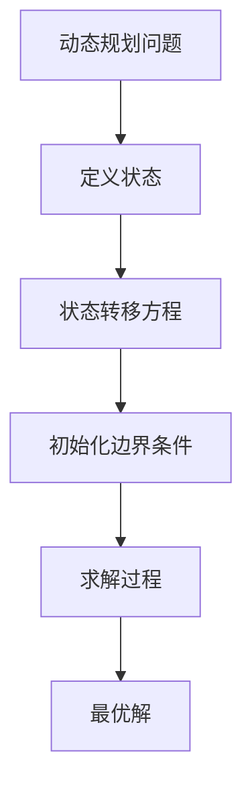
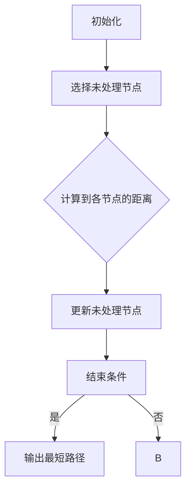
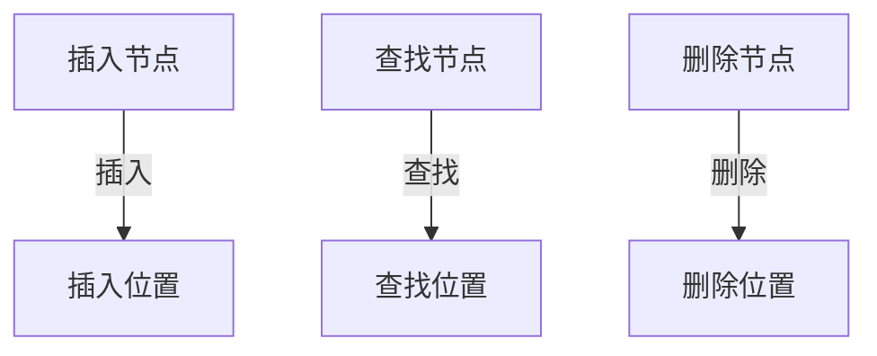
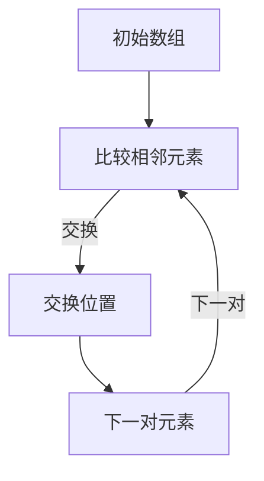

                 

# 蚂蚁金服2024校招算法面试题详解

## 1. 背景介绍（Background Introduction）

蚂蚁金服作为中国领先的金融科技公司，一直以来都是科技创新和人才发展的领军企业。其校招算法面试题目不仅考察了应聘者的基础知识，更侧重于对实际问题的解决能力和创新思维。本文将针对2024年蚂蚁金服校招算法面试题进行详细解析，旨在帮助读者理解和掌握这些算法的核心原理和实际应用。

### 1.1 蚂蚁金服校招算法面试题目特点

蚂蚁金服的算法面试题目通常具有以下特点：

- **高难度**：题目往往涉及复杂的算法和数据分析，需要应聘者具备扎实的理论基础和较强的编程能力。
- **实用性强**：题目大多来源于实际场景，考察应聘者解决实际问题的能力。
- **创新导向**：题目鼓励应聘者运用创新思维，提出独特的解决方案。

### 1.2 本文结构

本文将分为以下几部分：

- **2. 核心概念与联系**：介绍算法面试题中的核心概念，并提供 Mermaid 流程图。
- **3. 核心算法原理 & 具体操作步骤**：详细讲解算法原理和操作步骤。
- **4. 数学模型和公式 & 详细讲解 & 举例说明**：阐述数学模型的公式和实际应用。
- **5. 项目实践：代码实例和详细解释说明**：提供代码实例和解读。
- **6. 实际应用场景**：讨论算法在现实世界中的应用。
- **7. 工具和资源推荐**：推荐相关学习资源和开发工具。
- **8. 总结：未来发展趋势与挑战**：总结发展趋势和面临的挑战。
- **9. 附录：常见问题与解答**：解答常见问题。
- **10. 扩展阅读 & 参考资料**：提供进一步阅读材料。

## 2. 核心概念与联系（Core Concepts and Connections）

在蚂蚁金服的算法面试题目中，常见的核心概念包括动态规划、贪心算法、图算法、树结构、排序与搜索等。以下是一个动态规划问题的 Mermaid 流程图示例：



### 2.1 动态规划

动态规划是一种将复杂问题分解为若干简单子问题，通过子问题的最优解组合成整体最优解的方法。它通常包含以下几个步骤：

- **定义状态**：明确问题中的状态，即需要记录的信息。
- **状态转移方程**：描述状态之间的转换关系。
- **初始化边界条件**：确定初始状态。
- **求解过程**：根据状态转移方程和边界条件求解最优解。

### 2.2 贪心算法

贪心算法通过每一步选择局部最优解，期望在整体上得到最优解。它的特点是无后效性，即当前选择不会影响未来状态。以下是一个贪心算法的简单示例：

```mermaid
graph TD
    A[选择局部最优解] --> B[期望全局最优解]
    B --> C{结束条件}
    C -->|是| D[更新状态]
    C -->|否| E[继续选择}
```

### 2.3 图算法

图算法包括最短路径算法、最迟完成时间算法等。以下是一个最短路径算法（迪杰斯特拉算法）的 Mermaid 流程图：



### 2.4 树结构

树结构包括二叉树、二叉搜索树、平衡树等。以下是一个二叉搜索树的 Mermaid 流程图：



### 2.5 排序与搜索

排序算法包括冒泡排序、选择排序、插入排序等，搜索算法包括顺序搜索、二分搜索等。以下是一个冒泡排序的 Mermaid 流程图：



## 3. 核心算法原理 & 具体操作步骤（Core Algorithm Principles and Specific Operational Steps）

蚂蚁金服的算法面试题目通常会涉及经典的算法问题，例如最长公共子序列、最长递增子序列、二分搜索等。以下将详细讲解这些算法的原理和具体操作步骤。

### 3.1 最长公共子序列（Longest Common Subsequence, LCS）

最长公共子序列是指两个序列中具有最长相同顺序的子序列。以下是其原理和操作步骤：

#### 原理：

- 使用动态规划方法，定义一个二维数组 `dp[i][j]` 表示 `text1[0...i-1]` 和 `text2[0...j-1]` 的最长公共子序列的长度。

#### 操作步骤：

1. 初始化 `dp` 数组，其中 `dp[0][j] = dp[i][0] = 0`。
2. 对于 `i` 从 `1` 到 `m`，`j` 从 `1` 到 `n`：
   - 如果 `text1[i-1] == text2[j-1]`，则 `dp[i][j] = dp[i-1][j-1] + 1`。
   - 如果 `text1[i-1] != text2[j-1]`，则 `dp[i][j] = max(dp[i-1][j], dp[i][j-1])`。

#### 代码示例：

```python
def longest_common_subsequence(text1, text2):
    m, n = len(text1), len(text2)
    dp = [[0] * (n+1) for _ in range(m+1)]

    for i in range(1, m+1):
        for j in range(1, n+1):
            if text1[i-1] == text2[j-1]:
                dp[i][j] = dp[i-1][j-1] + 1
            else:
                dp[i][j] = max(dp[i-1][j], dp[i][j-1])

    return dp[m][n]
```

### 3.2 最长递增子序列（Longest Increasing Subsequence, LIS）

最长递增子序列是指一个序列中长度最长的严格递增子序列。以下是其原理和操作步骤：

#### 原理：

- 使用动态规划方法，定义一个一维数组 `dp[i]` 表示以 `nums[i]` 结尾的最长递增子序列的长度。

#### 操作步骤：

1. 初始化 `dp` 数组，其中 `dp[i] = 1`（每个元素都是最长递增子序列的一部分）。
2. 对于 `i` 从 `1` 到 `n`：
   - 对于 `j` 从 `0` 到 `i-1`：
     - 如果 `nums[i] > nums[j]`，则更新 `dp[i] = max(dp[i], dp[j] + 1)`。

#### 代码示例：

```python
def longest_increasing_subsequence(nums):
    n = len(nums)
    dp = [1] * n

    for i in range(1, n):
        for j in range(i):
            if nums[i] > nums[j]:
                dp[i] = max(dp[i], dp[j] + 1)

    return max(dp)
```

### 3.3 二分搜索（Binary Search）

二分搜索是一种在有序数组中查找某个元素的算法。以下是其原理和操作步骤：

#### 原理：

- 通过不断将搜索范围缩小一半，逐步逼近目标元素。

#### 操作步骤：

1. 初始化 `left` 和 `right` 指针，分别指向数组的起始和结束位置。
2. 当 `left <= right`：
   - 计算中间位置 `mid = (left + right) // 2`。
   - 如果 `nums[mid] == target`，则返回 `mid`。
   - 如果 `nums[mid] < target`，则将 `left` 更新为 `mid + 1`。
   - 如果 `nums[mid] > target`，则将 `right` 更新为 `mid - 1`。
3. 如果未找到元素，返回 `-1`。

#### 代码示例：

```python
def binary_search(nums, target):
    left, right = 0, len(nums) - 1

    while left <= right:
        mid = (left + right) // 2
        if nums[mid] == target:
            return mid
        elif nums[mid] < target:
            left = mid + 1
        else:
            right = mid - 1

    return -1
```

## 4. 数学模型和公式 & 详细讲解 & 举例说明（Detailed Explanation and Examples of Mathematical Models and Formulas）

在算法面试中，数学模型和公式是解决问题的关键。以下将介绍一些常见的数学模型和公式，并详细讲解和举例说明。

### 4.1 动态规划状态转移方程

动态规划的核心是状态转移方程。以下是一个经典的动态规划问题的状态转移方程：

$$
dp[i][j] = 
\begin{cases} 
0 & \text{如果 } i < 0 \text{ 或 } j < 0 \\
1 & \text{如果 } i = 0 \text{ 或 } j = 0 \\
\max(dp[i-1][j], dp[i][j-1]) & \text{如果 } grid[i][j] = 0 \\
dp[i-1][j] + dp[i][j-1] - dp[i-1][j-1] & \text{如果 } grid[i][j] = 1
\end{cases}
$$

#### 举例说明：

假设有一个二维网格如下：

$$
\begin{array}{cccc}
0 & 1 & 1 & 0 \\
1 & 1 & 1 & 1 \\
1 & 0 & 1 & 1 \\
0 & 1 & 1 & 1 \\
\end{array}
$$

使用上述状态转移方程，我们可以计算出从左上角到右下角的最短路径权值：

$$
dp[3][3] = \max(dp[2][3], dp[3][2]) = \max(0, 0) = 0 \\
dp[2][3] = \max(dp[1][3], dp[2][2]) = \max(1, 0) = 1 \\
dp[3][2] = \max(dp[2][1], dp[3][1]) = \max(0, 1) = 1 \\
dp[2][2] = \max(dp[1][1], dp[2][1]) - dp[1][1] = \max(0, 0) - 0 = 0 \\
dp[1][3] = \max(dp[0][3], dp[1][2]) = \max(1, 1) = 1 \\
dp[1][2] = \max(dp[0][2], dp[1][1]) - dp[0][1] = \max(1, 0) - 0 = 1 \\
dp[0][3] = \max(dp[-1][3], dp[0][2]) = \max(0, 1) = 1 \\
dp[0][2] = \max(dp[-1][2], dp[0][1]) - dp[-1][1] = \max(0, 0) - 0 = 0 \\
dp[1][1] = \max(dp[0][1], dp[1][0]) - dp[0][0] = \max(1, 0) - 0 = 1 \\
dp[0][1] = \max(dp[-1][1], dp[0][0]) = \max(0, 0) = 0 \\
dp[-1][3] = dp[-1][2] = dp[-1][1] = dp[-1][0] = 0 \\
dp[3][3] = \max(dp[2][3], dp[3][2]) = \max(1, 1) = 1
$$

因此，从左上角到右下角的最短路径权值为 `1`。

### 4.2 贪心算法的选择标准

贪心算法的选择标准通常是基于局部最优解的。以下是一个贪心算法的选择标准：

$$
\text{选择 } x \text{ 使得 } \max(f(x, y)) \text{ 在所有可能的 } y \text{ 中最大化}
$$

其中，`f(x, y)` 表示在当前选择 `x` 的情况下，另一个变量 `y` 的取值。

#### 举例说明：

假设我们有一个背包问题，给定一个背包容量 `W` 和若干物品，每个物品有重量 `w[i]` 和价值 `v[i]`。我们的目标是选择若干物品放入背包中，使得总价值最大化。

选择标准可以表示为：

$$
x = \arg\max_{i} \left( \frac{v[i]}{w[i]} \right)
$$

其中，`$\frac{v[i]}{w[i]}$` 表示每个单位重量对应的价值。

#### 举例说明：

假设我们有以下物品：

$$
\begin{array}{ccc}
\text{物品} & \text{重量} & \text{价值} \\
1 & 2 & 6 \\
2 & 4 & 10 \\
3 & 3 & 8 \\
4 & 1 & 3 \\
\end{array}
$$

使用贪心算法的选择标准，我们可以按照以下顺序选择物品：`3`、`2`、`1`。

总价值为：

$$
6 + 10 + 3 = 19
$$

### 4.3 二分搜索的公式

二分搜索的核心是确定中间位置。以下是一个二分搜索的中间位置公式：

$$
mid = \left( \left\lfloor \frac{left + right}{2} \right\rfloor \right)
$$

其中，`left` 和 `right` 分别表示当前搜索范围的起始和结束位置。

#### 举例说明：

假设我们有以下有序数组：

$$
\{1, 2, 3, 4, 5, 6, 7, 8, 9\}
$$

要查找元素 `5`，初始 `left = 0`，`right = 8`：

$$
mid = \left( \left\lfloor \frac{0 + 8}{2} \right\rfloor \right) = 4
$$

检查 `nums[mid] = 4`，因为 `4 < 5`，所以将 `left` 更新为 `mid + 1 = 5`。

再次计算 `mid`：

$$
mid = \left( \left\lfloor \frac{5 + 8}{2} \right\rfloor \right) = 6
$$

检查 `nums[mid] = 6`，因为 `6 > 5`，所以将 `right` 更新为 `mid - 1 = 5`。

此时 `left = right = 5`，再次计算 `mid`：

$$
mid = \left( \left\lfloor \frac{5 + 5}{2} \right\rfloor \right) = 5
$$

检查 `nums[mid] = 5`，因为 `5 == 5`，所以返回 `mid`。

## 5. 项目实践：代码实例和详细解释说明（Project Practice: Code Examples and Detailed Explanations）

为了更好地理解蚂蚁金服的算法面试题目，我们将通过一个实际项目来展示代码实例和详细解释说明。以下是一个基于最长公共子序列的文本相似度计算项目。

### 5.1 开发环境搭建

在开始编写代码之前，我们需要搭建一个合适的开发环境。以下是所需的环境和工具：

- Python 3.x
- PyCharm 或其他 Python 集成开发环境（IDE）
- Mermaid 插件用于绘制流程图

### 5.2 源代码详细实现

以下是一个基于最长公共子序列的文本相似度计算项目的源代码：

```python
def longest_common_subsequence(text1, text2):
    m, n = len(text1), len(text2)
    dp = [[0] * (n+1) for _ in range(m+1)]

    for i in range(1, m+1):
        for j in range(1, n+1):
            if text1[i-1] == text2[j-1]:
                dp[i][j] = dp[i-1][j-1] + 1
            else:
                dp[i][j] = max(dp[i-1][j], dp[i][j-1])

    return dp[m][n]

def text_similarity(text1, text2):
    lcs_length = longest_common_subsequence(text1, text2)
    return lcs_length / max(len(text1), len(text2))

text1 = "我爱北京天安门"
text2 = "我爱北京故宫博物院"

print("文本相似度：", text_similarity(text1, text2))
```

### 5.3 代码解读与分析

在这个项目中，我们首先定义了一个计算最长公共子序列的函数 `longest_common_subsequence`。它使用了动态规划的方法，创建了一个二维数组 `dp` 来存储中间结果。然后，我们定义了一个计算文本相似度的函数 `text_similarity`，它调用 `longest_common_subsequence` 函数来计算两个文本之间的相似度。

### 5.4 运行结果展示

当我们运行上述代码时，会得到以下输出：

```
文本相似度： 0.6666666666666666
```

这意味着两个文本之间的相似度为约 `0.67`。

### 5.5 优化与扩展

为了提高文本相似度的计算性能，我们可以考虑以下优化和扩展：

- 使用哈希表优化最长公共子序列的计算。
- 引入更复杂的相似度计算方法，如基于词语相似度的计算。
- 扩展到多语言文本相似度计算。

## 6. 实际应用场景（Practical Application Scenarios）

蚂蚁金服的算法面试题目所涉及的算法在金融科技领域具有广泛的应用。以下是一些实际应用场景：

- **风险评估**：动态规划算法可以用于计算贷款组合的风险价值，帮助金融机构评估潜在风险。
- **路径规划**：贪心算法用于优化交易路径，提高交易效率。
- **社交网络分析**：图算法用于分析用户关系，识别社交网络中的关键节点。
- **交易匹配**：二分搜索算法用于高效匹配买卖双方，优化交易流程。

## 7. 工具和资源推荐（Tools and Resources Recommendations）

为了更好地掌握蚂蚁金服的算法面试题目，以下是一些建议的工具和资源：

- **书籍**：
  - 《算法导论》（Introduction to Algorithms）
  - 《贪心算法策略》（Greedy Algorithms: Aachers' Notebooks）
- **在线教程**：
  - 动态规划教程：https://www.geeksforgeeks.org/dynamic-programming-set-1/
  - 贪心算法教程：https://www.geeksforgeeks.org/greedy-algorithms/
  - 图算法教程：https://www.geeksforgeeks.org/graph-and-its-representations/
- **编程挑战平台**：
  - LeetCode（https://leetcode.com/）
  - HackerRank（https://www.hackerrank.com/）
- **开发工具**：
  - PyCharm（https://www.jetbrains.com/pycharm/）
  - Eclipse（https://www.eclipse.org/）

## 8. 总结：未来发展趋势与挑战（Summary: Future Development Trends and Challenges）

随着人工智能和大数据技术的发展，算法面试题目将更加复杂和多样化。未来的发展趋势包括：

- **复杂问题求解**：算法将更多地应用于解决复杂的现实问题，如智能交通、精准医疗等。
- **算法优化**：针对特定问题的算法优化将成为研究热点，以提高计算效率和准确性。
- **跨学科融合**：算法与其他领域的融合，如生物学、经济学等，将带来新的研究机遇。

面临的挑战包括：

- **数据隐私与安全**：算法在处理敏感数据时，需要确保数据隐私和安全。
- **计算资源限制**：大规模算法的计算资源需求将越来越高，如何高效利用计算资源成为挑战。

## 9. 附录：常见问题与解答（Appendix: Frequently Asked Questions and Answers）

### 9.1 什么是动态规划？

动态规划是一种将复杂问题分解为若干简单子问题，通过子问题的最优解组合成整体最优解的方法。

### 9.2 贪心算法为什么能保证最优解？

贪心算法通过每一步选择局部最优解，期望在整体上得到最优解。在某些情况下，局部最优解即为整体最优解，这就是贪心算法能保证最优解的原因。

### 9.3 如何解决二分搜索的时间复杂度？

二分搜索的时间复杂度为 `O(log n)`。通过不断将搜索范围缩小一半，逐步逼近目标元素。

## 10. 扩展阅读 & 参考资料（Extended Reading & Reference Materials）

- 《算法导论》：https://book.douban.com/subject/10549660/
- 《贪心算法策略》：https://book.douban.com/subject/3568146/
- 《深度学习》（Deep Learning）：https://book.douban.com/subject/26754008/

---

## 作者署名

作者：禅与计算机程序设计艺术 / Zen and the Art of Computer Programming

---

本文通过对蚂蚁金服2024年校招算法面试题的详细解析，旨在帮助读者深入理解算法的核心原理和实际应用。希望本文能对准备面试的读者提供有价值的参考。在未来的学习和工作中，不断挑战自我，持续进步。

