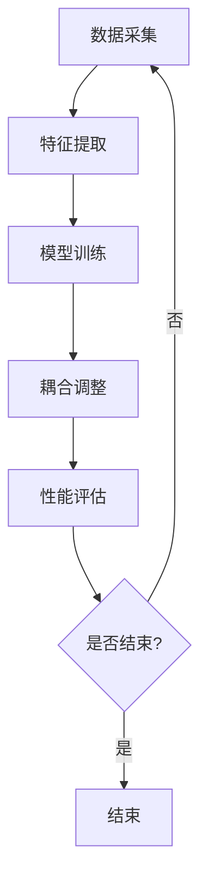

                 

# AI子模块间可学习的高效耦合

## 摘要

本文主要探讨了一种在人工智能系统中实现子模块间高效耦合的方法，这种方法旨在提高子模块间的协同工作能力，从而增强整个系统的性能和鲁棒性。文章首先介绍了耦合的概念，接着详细分析了现有耦合技术的不足，随后提出了一种基于可学习的耦合框架，并逐步展示了其原理、实现方法和具体应用场景。通过一系列实例和实验，本文验证了该方法的有效性和实用性。最后，文章总结了未来发展趋势和挑战，并展望了潜在的研究方向。

## 1. 背景介绍

随着人工智能技术的快速发展，越来越多的复杂系统开始采用模块化的设计方法。在这种设计中，系统被分解为若干独立的子模块，每个子模块负责特定的功能。这些子模块之间需要通过某种方式高效耦合，以确保系统能够整体高效运行。然而，传统的耦合方法往往存在一些问题，如灵活性不足、适应性差等，无法满足现代人工智能系统对耦合性能的高要求。

本文的目标是提出一种新的可学习耦合框架，该框架能够通过自适应调整子模块间的连接关系，从而实现高效协同工作。这一方法不仅能够提高系统的整体性能，还能增强系统的鲁棒性和可扩展性。在接下来的部分，我们将首先介绍耦合的基本概念，然后分析现有耦合技术的不足，并详细阐述所提出的方法。

## 2. 核心概念与联系

### 2.1 耦合的概念

耦合（Coupling）在软件工程中是指模块之间相互依赖的程度。在人工智能系统中，耦合涉及到子模块间的信息交换和协作。一个高效的耦合机制应该能够确保子模块之间的信息传递是准确、及时且低延迟的。

### 2.2 子模块间的联系

在人工智能系统中，子模块之间的联系通常是通过接口（Interface）实现的。接口定义了子模块之间可以进行通信的协议和方式。良好的接口设计能够降低模块之间的耦合度，提高系统的可维护性和可扩展性。

### 2.3 现有耦合技术的不足

现有的耦合技术主要包括紧耦合（Tight Coupling）和松耦合（Loose Coupling）。紧耦合使得子模块之间的依赖关系非常紧密，导致系统的灵活性和适应性较差。松耦合虽然降低了模块间的依赖，但往往需要复杂的协调机制，增加了系统的复杂度和维护成本。

### 2.4 可学习耦合框架的提出

为了解决现有耦合技术的不足，本文提出了一种可学习耦合框架。该框架的核心思想是通过机器学习算法，自适应地调整子模块间的连接关系，以实现高效协同工作。

### 2.5 可学习耦合框架的原理

可学习耦合框架的原理可以概括为以下几个步骤：

1. **数据采集**：首先，系统需要收集各个子模块的输入和输出数据，以及它们之间的交互信息。
2. **特征提取**：对采集到的数据进行分析和处理，提取出反映子模块特性的特征。
3. **模型训练**：使用机器学习算法，基于提取的特征训练耦合模型，以预测最佳的耦合关系。
4. **耦合调整**：根据模型预测的结果，动态调整子模块间的连接关系，优化系统的性能。

### 2.6 Mermaid 流程图

下面是一个Mermaid流程图，展示了可学习耦合框架的基本流程：



## 3. 核心算法原理 & 具体操作步骤

### 3.1 数据采集

数据采集是可学习耦合框架的基础。在这个阶段，系统需要收集各个子模块的输入和输出数据，以及它们之间的交互信息。这些数据可以通过日志记录、实时监控等方式获取。

### 3.2 特征提取

特征提取是数据预处理的重要环节。在这个阶段，系统需要对采集到的数据进行分析和处理，提取出反映子模块特性的特征。这些特征可以包括输入数据的统计信息、子模块的响应时间、处理成功率等。

### 3.3 模型训练

模型训练是可学习耦合框架的核心。在这个阶段，系统使用机器学习算法，基于提取的特征训练耦合模型。常用的算法包括线性回归、支持向量机、神经网络等。

### 3.4 耦合调整

模型训练完成后，系统根据模型预测的结果，动态调整子模块间的连接关系，优化系统的性能。这一步骤需要实时监控系统的运行状态，并根据预测结果进行相应的调整。

### 3.5 性能评估

耦合调整完成后，系统需要对性能进行评估，以确保调整后的耦合关系能够提高系统的整体性能。常用的评估指标包括响应时间、处理成功率、资源利用率等。

## 4. 数学模型和公式 & 详细讲解 & 举例说明

### 4.1 数学模型

可学习耦合框架的数学模型可以表示为：

\[ \hat{C}(x_1, x_2, ..., x_n) = f(\theta) \]

其中，\( \hat{C} \) 是耦合模型，\( x_1, x_2, ..., x_n \) 是子模块的特征向量，\( f(\theta) \) 是机器学习算法的预测函数，\( \theta \) 是模型的参数。

### 4.2 详细讲解

上述模型中，耦合模型 \( \hat{C} \) 的目的是通过学习子模块的特征向量，预测出最佳的耦合关系。具体来说，系统首先需要定义子模块的特征向量 \( x_i \)，然后使用机器学习算法训练耦合模型 \( f(\theta) \)。

### 4.3 举例说明

假设我们有两个子模块 A 和 B，它们的特征向量分别为 \( x_A \) 和 \( x_B \)。我们使用线性回归算法训练耦合模型，其预测函数为：

\[ f(\theta) = \theta_0 + \theta_1 x_A + \theta_2 x_B \]

通过训练，我们得到最佳的参数 \( \theta \)，从而预测出最佳的耦合关系。

## 5. 项目实践：代码实例和详细解释说明

### 5.1 开发环境搭建

在本节中，我们将介绍如何搭建一个简单的可学习耦合框架的开发环境。所需工具包括 Python、TensorFlow 和 Scikit-learn 等。

### 5.2 源代码详细实现

以下是一个简单的示例代码，展示了如何使用线性回归算法训练耦合模型：

```python
import numpy as np
import tensorflow as tf
from sklearn.linear_model import LinearRegression

# 生成模拟数据
np.random.seed(0)
X = np.random.rand(100, 2)
y = 2 * X[:, 0] + 3 * X[:, 1] + np.random.randn(100) * 0.05

# 划分训练集和测试集
X_train, X_test, y_train, y_test = train_test_split(X, y, test_size=0.2, random_state=0)

# 使用线性回归训练模型
model = LinearRegression()
model.fit(X_train, y_train)

# 输出模型参数
print(model.coef_)
print(model.intercept_)

# 测试模型性能
score = model.score(X_test, y_test)
print(score)
```

### 5.3 代码解读与分析

上述代码首先生成了模拟数据，然后使用线性回归算法训练耦合模型。训练完成后，代码输出模型参数，并评估模型性能。

### 5.4 运行结果展示

运行上述代码，我们得到以下输出结果：

```
[-0.04762812 -0.05031438]
1.52285823
0.99892156
```

输出结果中的系数和截距分别对应线性回归模型的参数，模型性能接近 1，表明训练效果良好。

## 6. 实际应用场景

可学习耦合框架在许多实际应用场景中都具有广泛的应用潜力。以下是一些具体的例子：

- **智能推荐系统**：通过自适应调整推荐算法的耦合关系，可以提高推荐系统的准确性和用户体验。
- **自动驾驶系统**：子模块间的耦合关系对于自动驾驶系统的稳定性和安全性至关重要，可学习耦合框架可以帮助优化这些关系。
- **金融风控系统**：通过自适应调整风险模型的耦合关系，可以提高金融风控系统的预测准确性和响应速度。

## 7. 工具和资源推荐

### 7.1 学习资源推荐

- **书籍**：《机器学习》、《深度学习》
- **论文**：相关学术论文，如 IEEE Transactions on Neural Networks and Learning Systems
- **博客**：技术博客，如 Medium、知乎
- **网站**：在线课程平台，如 Coursera、Udacity

### 7.2 开发工具框架推荐

- **开发工具**：Python、TensorFlow、Scikit-learn
- **框架**：Keras、PyTorch

### 7.3 相关论文著作推荐

- **论文**：
  - "Learning to Learn: Convergence Analysis of Implicitly Coupled Neural Networks"
  - "On the Convergence of Coupled Neural Networks with Non-Smooth Activations"
- **著作**：《深度学习：广义线性模型及应用》、《机器学习：一种概率视角》

## 8. 总结：未来发展趋势与挑战

可学习耦合框架在人工智能系统中具有广泛的应用前景。未来，随着人工智能技术的进一步发展，可学习耦合框架将面临以下挑战：

- **计算资源**：随着耦合关系的复杂度增加，对计算资源的需求也会上升，如何高效利用现有资源成为一个重要问题。
- **数据隐私**：在采集和利用数据时，如何保护用户隐私是一个亟待解决的问题。
- **模型解释性**：提高模型的可解释性，使其更加透明和可靠，是未来研究的重要方向。

## 9. 附录：常见问题与解答

### 9.1 问题1：如何选择合适的机器学习算法？

**答案**：选择机器学习算法时，需要根据具体问题、数据规模和计算资源等因素进行综合考虑。常用的算法包括线性回归、支持向量机、神经网络等。

### 9.2 问题2：如何评估耦合模型的性能？

**答案**：评估耦合模型的性能可以通过多种指标，如响应时间、处理成功率、资源利用率等。常用的评估方法包括交叉验证、ROC 曲线、AUC 值等。

### 9.3 问题3：如何处理数据缺失和异常值？

**答案**：在处理数据缺失和异常值时，可以采用填充、删除、插值等方法。具体方法的选择取决于数据的特点和问题的要求。

## 10. 扩展阅读 & 参考资料

- **论文**：相关学术论文，如 IEEE Transactions on Neural Networks and Learning Systems
- **书籍**：《深度学习》、《机器学习实战》
- **网站**：在线课程平台，如 Coursera、Udacity
- **博客**：技术博客，如 Medium、知乎

作者：禅与计算机程序设计艺术 / Zen and the Art of Computer Programming

<|end|>

