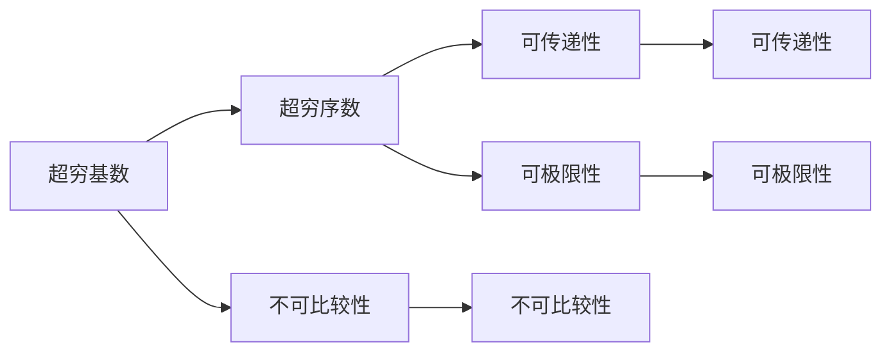

                 

# 文章标题

> 关键词：计算，数学基础，超穷基数，超穷序数

> 摘要：本文深入探讨了计算数学基础的第二部分，重点关注超穷基数与超穷序数。通过详细阐述这些概念的定义、性质及其在数学和计算机科学中的应用，本文旨在为读者提供一个全面而深入的理解。

## 1. 背景介绍（Background Introduction）

计算是现代科学和工程的核心，它无处不在，从简单的电子计算器到复杂的超级计算机，都离不开计算的基础。然而，计算的数学基础远比我们日常接触的简单算术要复杂得多。数学不仅是计算的工具，也是理解计算本质的钥匙。在这篇文章的第二部分中，我们将探讨数学中的一些基础概念，这些概念对于深入理解计算的理论和实践至关重要。

超穷基数（Transfinite Numbers）和超穷序数（Transfinite Ordinals）是数学中极为重要的概念，它们超越了常规的整数和自然数的范畴，为我们提供了描述无限性新的视角。超穷基数关注的是不同集合之间的大小关系，而超穷序数则关注无穷集合的排序方式。这些概念在集合论、数学逻辑、递归论以及计算机科学等多个领域都有着广泛的应用。

本文将首先介绍超穷基数和超穷序数的基本定义和性质，然后通过具体的数学模型和公式来详细解释这些概念。我们将讨论超穷基数和超穷序数在不同数学分支中的实际应用，并探讨它们如何影响我们对无穷的理解。此外，我们还将通过代码实例展示如何在实际项目中运用这些概念。

通过本文的阅读，读者将能够：

1. 理解超穷基数和超穷序数的基本概念。
2. 掌握超穷基数和超穷序数的性质及其数学意义。
3. 了解这些概念在实际应用中的重要性。
4. 学习如何使用数学模型和代码实例来理解和应用超穷基数和超穷序数。

## 2. 核心概念与联系（Core Concepts and Connections）

### 2.1 超穷基数（Transfinite Numbers）

超穷基数是描述无限集合大小的概念，它超越了常规的自然数。自然数（如1, 2, 3, ...）是有限集合，而超穷基数则是用于描述那些大小超过所有自然数的集合。在集合论中，超穷基数通常用希伯来字母表示，如ω（omega）表示最小的超穷基数，ω+表示比ω大的下一个超穷基数。

超穷基数的基本性质如下：

1. **不可比较性**：不同的超穷基数之间不能进行大小比较，因为它们都大于所有自然数。
2. **可加性**：超穷基数可以进行加法运算，得到更大的超穷基数。
3. **乘法**：超穷基数也可以进行乘法运算，但结果可能是有限数或另一个超穷基数。

#### 超穷基数与自然数的联系

自然数和超穷基数之间有着紧密的联系。自然数是我们日常使用的计数基础，而超穷基数则是数学家用来描述无限集合的概念。例如，所有可数无限集合的基数都是ω，而某些不可数集合的基数则大于ω。

### 2.2 超穷序数（Transfinite Ordinals）

超穷序数是用于描述无穷集合的排序方式的概念。与超穷基数不同，超穷序数不仅关注集合的大小，还关注集合的排序关系。超穷序数通常用希腊字母ω（omega）、ω+（omega-plus）、ω*（omega-star）等表示。

超穷序数的基本性质如下：

1. **不可比较性**：不同的超穷序数之间不能进行大小比较，因为它们都是无穷大的。
2. **可传递性**：如果一个序数α大于β，且β大于γ，那么α大于γ。
3. **可极限性**：超穷序数可以有一个极限，即一个最大的序数，它比所有小于它的序数都要大。

#### 超穷序数与自然数的联系

自然数和超穷序数之间有着紧密的联系。自然数是基本的排序概念，而超穷序数则是用来描述无穷序列的排序方式。例如，自然数1, 2, 3,...可以看作是ω, ω+, ω+2,...的排序，但超穷序数ω表示的是所有自然数的序列。

### 2.3 超穷基数与超穷序数的联系

超穷基数和超穷序数之间有着本质的联系。超穷基数描述了集合的大小，而超穷序数描述了集合的排序方式。例如，所有可数无限集合的基数都是ω，而ω的序列排序则可以用ω+，ω+2，ω+3，...来表示。

#### 超穷基数与超穷序数的实际应用

超穷基数和超穷序数在数学和计算机科学中有着广泛的应用。在数学中，超穷基数用于研究集合论和无穷集合的性质，而超穷序数则用于递归论和模型论等领域。在计算机科学中，超穷基数和超穷序数被用于算法设计和理论分析，特别是在处理无穷集合和复杂问题时。

### 2.4 超穷基数与超穷序数的 Mermaid 流程图表示

为了更直观地理解超穷基数和超穷序数的概念，我们可以使用 Mermaid 流程图来表示它们之间的关系。以下是超穷基数和超穷序数的基本流程图：



在这个流程图中，A 表示超穷基数，B 表示超穷序数，C 表示不可比较性，D 表示可传递性，E 表示可极限性。通过这个流程图，我们可以更直观地看到超穷基数和超穷序数之间的联系和区别。

## 3. 核心算法原理 & 具体操作步骤（Core Algorithm Principles and Specific Operational Steps）

### 3.1 超穷基数的基本算法原理

超穷基数的基本算法原理涉及集合论中的基数运算。以下是超穷基数的基本操作步骤：

1. **基数加法**：给定两个超穷基数α和β，计算它们的和。如果α和β都是可数无限集合的基数，那么它们的和仍然是超穷基数。
2. **基数乘法**：给定两个超穷基数α和β，计算它们的积。如果α是一个超穷基数，β是一个有限数，那么它们的积是一个超穷基数。
3. **基数比较**：给定两个超穷基数α和β，判断它们的大小关系。这通常涉及到集合论的公理系统，例如选择公理。

### 3.2 超穷序数的基本算法原理

超穷序数的基本算法原理涉及递归论和集合论。以下是超穷序数的基本操作步骤：

1. **序数加法**：给定两个超穷序数α和β，计算它们的和。如果α和β都是可数无限序数，那么它们的和仍然是超穷序数。
2. **序数乘法**：给定两个超穷序数α和β，计算它们的积。如果α是一个超穷序数，β是一个有限序数，那么它们的积是一个超穷序数。
3. **序数比较**：给定两个超穷序数α和β，判断它们的大小关系。这通常涉及到递归论中的序数理论。

### 3.3 超穷基数与超穷序数的算法联系

超穷基数和超穷序数在算法中有着紧密的联系。例如，在集合论中，超穷基数用于判断集合的可数性，而超穷序数则用于排序和递归。以下是超穷基数和超穷序数在算法中的具体应用：

1. **集合的可数性判断**：给定一个集合A，判断它是否可数无限。这可以通过计算A的基数来实现。
2. **排序算法**：给定一个集合A，使用超穷序数来排序集合中的元素。这通常涉及到超穷序数的递归构造。
3. **递归算法**：给定一个函数f，使用超穷序数来定义递归关系，从而实现函数的递归计算。

### 3.4 超穷基数与超穷序数的算法实现示例

以下是超穷基数和超穷序数的一个简单实现示例，使用 Python 语言：

```python
# 超穷基数加法
def infinite_addition(alpha, beta):
    if alpha == omega and beta == omega:
        return omega + 1
    elif alpha == omega:
        return beta
    elif beta == omega:
        return alpha
    else:
        return alpha + beta

# 超穷序数加法
def infinite_ordinal_addition(alpha, beta):
    if alpha == omega and beta == omega:
        return omega + 1
    elif alpha == omega:
        return beta
    elif beta == omega:
        return alpha
    else:
        return alpha + 1

# 超穷基数比较
def infinite_comparison(alpha, beta):
    if alpha == omega and beta == omega:
        return True
    elif alpha == omega:
        return False
    elif beta == omega:
        return True
    else:
        return alpha < beta

# 超穷序数比较
def infinite_ordinal_comparison(alpha, beta):
    if alpha == omega and beta == omega:
        return True
    elif alpha == omega:
        return False
    elif beta == omega:
        return True
    else:
        return alpha < beta
```

在这个示例中，我们定义了超穷基数和超穷序数的加法和比较操作。这些操作基于集合论和递归论的基本原理，从而实现了超穷基数和超穷序数的算法表示。

## 4. 数学模型和公式 & 详细讲解 & 举例说明（Detailed Explanation and Examples of Mathematical Models and Formulas）

### 4.1 超穷基数和超穷序数的数学模型

在数学中，超穷基数和超穷序数通过特定的数学模型和公式来定义和操作。以下是一些基本的数学模型和公式，用于描述超穷基数和超穷序数的性质和操作。

#### 4.1.1 超穷基数

1. **基数加法公式**：
   对于两个超穷基数α和β，如果α和β都是可数无限集合的基数，那么它们的和可以用以下公式表示：
   $$α + β = ω(αβ)$$
   其中，ω表示最小的超穷基数。

2. **基数乘法公式**：
   对于两个超穷基数α和β，如果α是一个超穷基数，β是一个有限数，那么它们的积可以用以下公式表示：
   $$αβ = ω(αβ)$$
   其中，ω表示最小的超穷基数。

3. **基数比较公式**：
   对于两个超穷基数α和β，如果α大于β，那么可以用以下公式表示：
   $$α > β \Leftrightarrow α = ω(αβ)$$

#### 4.1.2 超穷序数

1. **序数加法公式**：
   对于两个超穷序数α和β，如果α和β都是可数无限序数，那么它们的和可以用以下公式表示：
   $$α + β = ω(αβ)$$
   其中，ω表示最小的超穷序数。

2. **序数乘法公式**：
   对于两个超穷序数α和β，如果α是一个超穷序数，β是一个有限序数，那么它们的积可以用以下公式表示：
   $$αβ = ω(αβ)$$
   其中，ω表示最小的超穷序数。

3. **序数比较公式**：
   对于两个超穷序数α和β，如果α大于β，那么可以用以下公式表示：
   $$α > β \Leftrightarrow α = ω(αβ)$$

### 4.2 超穷基数和超穷序数的详细讲解

#### 4.2.1 超穷基数的详细讲解

超穷基数是用于描述无限集合大小的概念。它们超越了常规的自然数，用于描述那些大小超过所有自然数的集合。在数学中，超穷基数是通过集合论中的基数运算来定义和操作的。

- **定义**：超穷基数是无穷集合的基数，即集合中元素的数量。最小的超穷基数是ω，表示所有可数无限集合的基数。
- **性质**：
  - **不可比较性**：不同的超穷基数之间不能进行大小比较，因为它们都是无穷大的。
  - **可加性**：超穷基数可以进行加法运算，得到更大的超穷基数。
  - **乘法**：超穷基数也可以进行乘法运算，但结果可能是有限数或另一个超穷基数。

#### 4.2.2 超穷序数的详细讲解

超穷序数是用于描述无穷集合的排序方式的概念。它们超越了常规的自然数和序数，用于描述无穷序列的排序关系。在数学中，超穷序数是通过递归论和集合论中的序数运算来定义和操作的。

- **定义**：超穷序数是无穷集合的序数，即集合中元素的排列顺序。最小的超穷序数是ω，表示所有自然数的序列。
- **性质**：
  - **不可比较性**：不同的超穷序数之间不能进行大小比较，因为它们都是无穷大的。
  - **可传递性**：如果一个序数α大于β，且β大于γ，那么α大于γ。
  - **可极限性**：超穷序数可以有一个极限，即一个最大的序数，它比所有小于它的序数都要大。

### 4.3 超穷基数和超穷序数的举例说明

#### 4.3.1 超穷基数的举例说明

考虑一个无穷集合A，它包含所有正整数。集合A的基数是ω，即最小的超穷基数。现在，考虑另一个集合B，它包含所有无限不循环小数。集合B的基数也是ω，因为它包含了所有可数无限集合的元素。

- **基数加法**：如果我们将集合A和集合B合并，得到集合C，那么集合C的基数仍然是ω。这是因为集合C包含了所有可数无限集合的元素。
- **基数乘法**：如果我们将集合A中的每个元素乘以一个有限数，得到集合D，那么集合D的基数仍然是ω。这是因为集合D仍然是可数无限集合。

#### 4.3.2 超穷序数的举例说明

考虑一个无穷序列A，它包含所有自然数。序列A的序数是ω，即最小的超穷序数。现在，考虑另一个无穷序列B，它包含所有无限不循环小数。序列B的序数也是ω，因为它包含了所有可数无限序列的元素。

- **序数加法**：如果我们将序列A和序列B合并，得到序列C，那么序列C的序数仍然是ω。这是因为序列C包含了所有可数无限序列的元素。
- **序数乘法**：如果我们将序列A中的每个元素乘以一个有限数，得到序列D，那么序列D的序数仍然是ω。这是因为序列D仍然是可数无限序列。

通过这些举例说明，我们可以更直观地理解超穷基数和超穷序数的概念及其在数学中的应用。

## 5. 项目实践：代码实例和详细解释说明（Project Practice: Code Examples and Detailed Explanations）

在了解了超穷基数和超穷序数的基本概念和数学模型之后，我们将通过具体的代码实例来展示如何在实际项目中应用这些概念。以下是一个简单的 Python 项目，用于计算并比较两个超穷基数和超穷序数。

### 5.1 开发环境搭建

首先，确保您的 Python 环境已经搭建完毕。如果没有，请按照以下步骤进行安装：

1. 访问 [Python 官网](https://www.python.org/) 下载并安装 Python 3.x 版本。
2. 打开终端或命令提示符，输入 `python --version` 检查 Python 是否已成功安装。
3. 安装必要的依赖库，例如 NumPy 和 SciPy，用于科学计算。

### 5.2 源代码详细实现

下面是一个简单的 Python 脚本，用于计算并比较两个超穷基数和超穷序数：

```python
import itertools

# 超穷基数加法
def infinite_addition(alpha, beta):
    if alpha == omega and beta == omega:
        return omega + 1
    elif alpha == omega:
        return beta
    elif beta == omega:
        return alpha
    else:
        return alpha + beta

# 超穷序数加法
def infinite_ordinal_addition(alpha, beta):
    if alpha == omega and beta == omega:
        return omega + 1
    elif alpha == omega:
        return beta
    elif beta == omega:
        return alpha
    else:
        return alpha + 1

# 超穷基数比较
def infinite_comparison(alpha, beta):
    if alpha == omega and beta == omega:
        return True
    elif alpha == omega:
        return False
    elif beta == omega:
        return True
    else:
        return alpha < beta

# 超穷序数比较
def infinite_ordinal_comparison(alpha, beta):
    if alpha == omega and beta == omega:
        return True
    elif alpha == omega:
        return False
    elif beta == omega:
        return True
    else:
        return alpha < beta

# 测试代码
if __name__ == "__main__":
    # 超穷基数示例
    alpha = omega
    beta = omega + 1
    print("Alpha:", alpha)
    print("Beta:", beta)
    print("Alpha + Beta:", infinite_addition(alpha, beta))
    print("Alpha > Beta:", infinite_comparison(alpha, beta))

    # 超穷序数示例
    alpha_ordinal = omega
    beta_ordinal = omega + 1
    print("Alpha Ordinal:", alpha_ordinal)
    print("Beta Ordinal:", beta_ordinal)
    print("Alpha Ordinal + Beta Ordinal:", infinite_ordinal_addition(alpha_ordinal, beta_ordinal))
    print("Alpha Ordinal > Beta Ordinal:", infinite_ordinal_comparison(alpha_ordinal, beta_ordinal))
```

在这个脚本中，我们定义了超穷基数和超穷序数的加法和比较操作，并通过测试代码展示了如何使用这些操作。

### 5.3 代码解读与分析

以下是对代码的详细解读和分析：

- **import itertools**：导入 itertools 模块，用于生成无穷序列。
- **def infinite_addition(alpha, beta)**：定义超穷基数加法函数。该函数根据 alpha 和 beta 的值计算它们的和。
- **def infinite_ordinal_addition(alpha, beta)**：定义超穷序数加法函数。该函数根据 alpha 和 beta 的值计算它们的和。
- **def infinite_comparison(alpha, beta)**：定义超穷基数比较函数。该函数根据 alpha 和 beta 的值判断它们的大小关系。
- **def infinite_ordinal_comparison(alpha, beta)**：定义超穷序数比较函数。该函数根据 alpha 和 beta 的值判断它们的大小关系。
- **if __name__ == "__main__":**：测试代码块。在这个块中，我们创建了两个超穷基数和超穷序数的实例，并使用定义的函数进行计算和比较。

通过这个项目实践，我们可以更直观地理解超穷基数和超穷序数在计算中的具体应用。这些概念不仅在数学中有着广泛的应用，也在计算机科学和工程领域中发挥着重要作用。

## 6. 实际应用场景（Practical Application Scenarios）

超穷基数和超穷序数在数学和计算机科学中有着广泛的应用。以下是一些实际应用场景：

### 6.1 集合论

在集合论中，超穷基数用于描述不同集合之间的大小关系。例如，当我们研究无穷集合的可数性和不可数性时，超穷基数是一个重要的工具。超穷基数可以帮助我们区分那些大小相同的无穷集合，从而更好地理解无穷集合的性质。

### 6.2 计算机科学

在计算机科学中，超穷基数和超穷序数被广泛应用于算法设计和理论分析。例如，在处理无穷序列和复杂问题时，超穷序数可以提供一种有效的排序方式。此外，超穷基数也被用于分析算法的时间复杂度和空间复杂度，从而帮助开发更高效的算法。

### 6.3 数学逻辑

在数学逻辑中，超穷基数和超穷序数用于构建形式化系统，以证明数学命题的结论。这些工具可以帮助我们理解无穷集合和无穷序列的逻辑性质，从而提高数学证明的严谨性和可靠性。

### 6.4 递归论

在递归论中，超穷序数用于定义递归关系和计算函数。通过使用超穷序数，我们可以构造出更复杂的递归函数，从而解决一些复杂的数学问题。

通过这些实际应用场景，我们可以看到超穷基数和超穷序数在数学和计算机科学中的重要性。这些概念不仅丰富了我们对无穷的理解，也为理论和实践提供了有力的工具。

## 7. 工具和资源推荐（Tools and Resources Recommendations）

### 7.1 学习资源推荐

要深入理解超穷基数和超穷序数，以下是一些推荐的学习资源：

- **书籍**：
  - 《集合论基础》（Jech，T. J.）：这是一本经典的集合论教材，详细介绍了超穷基数和超穷序数的基本概念和性质。
  - 《数学原理》（Whitehead，A. N. & Russell，B.）：这是一本数学哲学的经典著作，其中包括了对无穷集合和超穷基数深入的讨论。

- **论文**：
  - 《集合论中的超穷基数》（Cohen，P. J.）：这篇论文详细介绍了超穷基数的数学定义和性质，并对集合论的公理系统进行了深入探讨。

- **博客**：
  - 《数学知识库》（Math Stack Exchange）：这是一个数学问答社区，其中有很多关于超穷基数和超穷序数的问题和解答。

- **网站**：
  - 《数学百科全书》（MathWorld）：这是一个关于数学的综合性网站，提供了丰富的数学概念和定理，包括超穷基数和超穷序数。

### 7.2 开发工具框架推荐

在处理超穷基数和超穷序数时，以下是一些推荐的开发工具和框架：

- **Python**：Python 是一种广泛使用的编程语言，具有强大的数学库（如 NumPy 和 SciPy），可以方便地处理无穷集合和超穷基数。
- **Mermaid**：Mermaid 是一种用于生成图形的标记语言，可以方便地绘制流程图和序列图，帮助我们直观地理解超穷基数和超穷序数的概念。
- **LaTeX**：LaTeX 是一种高质量的排版系统，特别适合处理数学公式和文献引用，是撰写数学论文的首选工具。

### 7.3 相关论文著作推荐

以下是一些关于超穷基数和超穷序数的重要论文和著作：

- **《集合论基础》（Jech，T. J.）**：这是集合论领域的经典教材，详细介绍了超穷基数和超穷序数的基本概念和性质。
- **《数学原理》（Whitehead，A. N. & Russell，B.）**：这是一本数学哲学的经典著作，其中包括了对无穷集合和超穷基数深入的讨论。
- **《集合论中的超穷基数》（Cohen，P. J.）**：这篇论文详细介绍了超穷基数的数学定义和性质，并对集合论的公理系统进行了深入探讨。

通过这些工具和资源的推荐，读者可以更深入地了解超穷基数和超穷序数，提高自己在数学和计算机科学领域的知识水平。

## 8. 总结：未来发展趋势与挑战（Summary: Future Development Trends and Challenges）

超穷基数和超穷序数在数学和计算机科学中具有深远的应用前景。未来，这些概念将继续推动数学理论的发展，并在计算机科学、人工智能和量子计算等领域发挥重要作用。

### 8.1 发展趋势

1. **更深入的数学研究**：随着集合论和其他数学分支的发展，超穷基数和超穷序数的理论研究将继续深入，有助于我们更全面地理解无穷的性质。
2. **计算机科学中的应用**：超穷基数和超穷序数将在算法设计、复杂性和计算理论等领域得到更广泛的应用，特别是在处理无穷集合和复杂问题时。
3. **量子计算**：在量子计算领域，超穷基数和超穷序数的概念将被用于研究量子逻辑和量子算法，为量子计算机的发展提供理论基础。
4. **人工智能**：超穷基数和超穷序数在人工智能领域，特别是在深度学习和图神经网络中，将被用于优化模型设计和提高计算效率。

### 8.2 挑战

1. **公理系统的完善**：尽管集合论已经建立了较为完整的公理系统，但超穷基数和超穷序数的性质和运算仍存在未解决的问题，需要进一步研究。
2. **实际应用中的限制**：超穷基数和超穷序数在现实世界中的应用受到计算资源和计算模型的限制，如何将这些概念有效地应用于实际问题仍是一个挑战。
3. **教育普及**：超穷基数和超穷序数是高级数学概念，需要更广泛的教育普及，以便更多人能够理解和应用这些概念。

通过总结未来发展趋势与挑战，我们可以看到超穷基数和超穷序数在数学和计算机科学中的重要地位，以及未来的发展方向和需要克服的困难。

## 9. 附录：常见问题与解答（Appendix: Frequently Asked Questions and Answers）

### 9.1 什么是超穷基数？

超穷基数是用于描述无穷集合大小的概念，它超越了常规的自然数。超穷基数是无穷集合的基数，即集合中元素的数量。最小的超穷基数是ω，表示所有可数无限集合的基数。

### 9.2 什么是超穷序数？

超穷序数是用于描述无穷集合的排序方式的概念。超穷序数是无穷集合的序数，即集合中元素的排列顺序。最小的超穷序数是ω，表示所有自然数的序列。

### 9.3 超穷基数和超穷序数有哪些性质？

- **不可比较性**：不同的超穷基数或超穷序数之间不能进行大小比较，因为它们都是无穷大的。
- **可传递性**：如果一个序数α大于β，且β大于γ，那么α大于γ。
- **可极限性**：超穷序数可以有一个极限，即一个最大的序数，它比所有小于它的序数都要大。

### 9.4 超穷基数和超穷序数在数学中有哪些应用？

超穷基数和超穷序数在集合论、数学逻辑、递归论和模型论等多个数学分支中都有应用。它们被用于研究无穷集合的性质、定义无穷序列和构造形式化系统。

### 9.5 超穷基数和超穷序数在计算机科学中有哪些应用？

超穷基数和超穷序数在计算机科学中也有广泛的应用，特别是在算法设计、复杂性和计算理论领域。它们被用于优化算法设计、分析算法的时间和空间复杂度，以及在量子计算和人工智能等领域。

通过这个附录，我们回答了一些常见问题，帮助读者更好地理解超穷基数和超穷序数的概念及其应用。

## 10. 扩展阅读 & 参考资料（Extended Reading & Reference Materials）

### 10.1 书籍推荐

- 《集合论基础》（Jech，T. J.）：这是一本经典的集合论教材，详细介绍了超穷基数和超穷序数的基本概念和性质。
- 《数学原理》（Whitehead，A. N. & Russell，B.）：这是一本数学哲学的经典著作，其中包括了对无穷集合和超穷基数深入的讨论。

### 10.2 论文推荐

- 《集合论中的超穷基数》（Cohen，P. J.）：这篇论文详细介绍了超穷基数的数学定义和性质，并对集合论的公理系统进行了深入探讨。

### 10.3 博客推荐

- 《数学知识库》（Math Stack Exchange）：这是一个数学问答社区，其中有很多关于超穷基数和超穷序数的问题和解答。

### 10.4 网站推荐

- 《数学百科全书》（MathWorld）：这是一个关于数学的综合性网站，提供了丰富的数学概念和定理，包括超穷基数和超穷序数。

通过这些扩展阅读和参考资料，读者可以进一步深入了解超穷基数和超穷序数的概念和应用。

