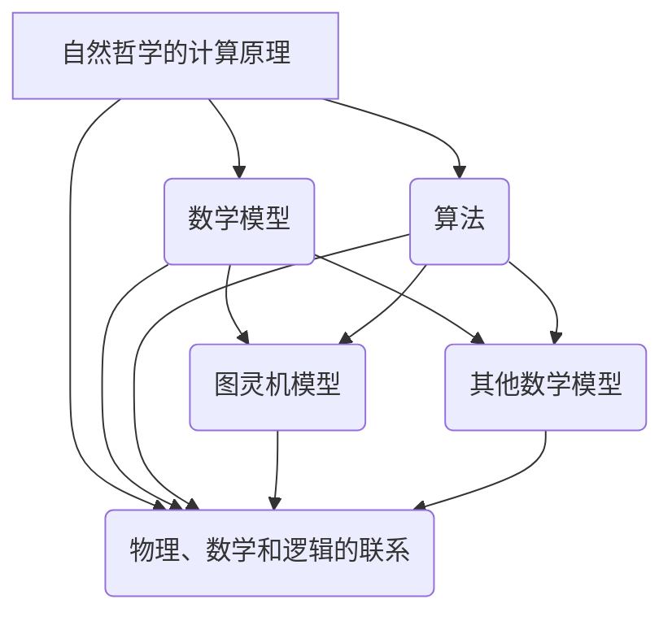
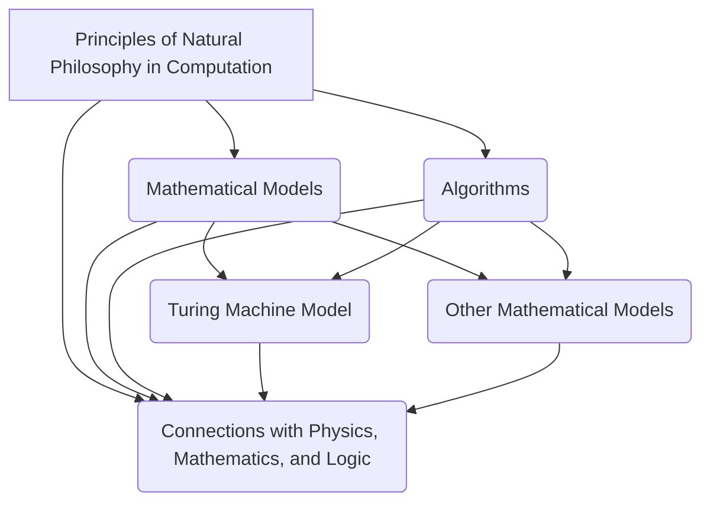

                 

### 文章标题

### Title: Calculus: The Fourth Part - The Limits of Computation, Chapter 13 - The Principles of Natural Philosophy in Computation

In the quest to understand the essence of computation, we delve into the intricate web of natural philosophy and mathematical principles that define its boundaries. This chapter, titled "The Principles of Natural Philosophy in Computation," explores the intersection of these realms, unraveling the theoretical underpinnings that govern the capabilities and limitations of computational systems. As we embark on this journey, we aim to provide a comprehensive and insightful analysis that bridges the gap between abstract theory and practical application.

### Chapter Title: The Principles of Natural Philosophy in Computation

In the exploration of computation's core, we delve into the entwined fields of natural philosophy and mathematical principles, which define its scope and constraints. This chapter, entitled "The Principles of Natural Philosophy in Computation," investigates the theoretical nexus where these domains intersect, deconstructing the foundational concepts that dictate the capabilities and limitations of computational systems. We aim to offer a thorough and thought-provoking analysis that bridges the divide between abstract theory and tangible implementation.

### 文章关键词

关键词：计算极限、自然哲学、计算原理、数学模型、算法、计算机科学、智能系统、复杂性理论。

### Keywords: Limits of Computation, Natural Philosophy, Principles of Computation, Mathematical Models, Algorithms, Computer Science, Intelligent Systems, Complexity Theory.

### 文章摘要

本文旨在探讨计算领域中自然哲学的计算原理，分析其核心概念和联系，并深入研究数学模型和算法的具体操作步骤。通过详细的数学模型和公式讲解，以及项目实践中的代码实例和运行结果展示，本文旨在为读者提供对计算极限的全面理解和深入见解。文章还探讨了实际应用场景，推荐了相关工具和资源，并总结了未来发展趋势与挑战。

### Abstract

This article aims to investigate the computational principles rooted in natural philosophy within the realm of computation. It analyzes the core concepts and their interconnections, delving into the specifics of mathematical models and algorithmic steps. Through detailed explanations of mathematical models and formulas, as well as code examples and runtime results in practical projects, the article provides a comprehensive understanding of the limits of computation. It also explores real-world application scenarios, recommends relevant tools and resources, and summarizes future development trends and challenges.

### 背景介绍

#### Background Introduction

自计算机科学诞生以来，计算理论一直是这一领域的核心。从图灵机的抽象概念，到现代复杂算法的设计与优化，计算理论不断推动着计算机技术的进步。然而，随着计算能力的不断提升，人们开始意识到计算并不是无限的。计算的极限问题逐渐成为学术界和工业界关注的焦点。在这一背景下，自然哲学的计算原理成为一个引人注目的研究领域。

自然哲学的计算原理关注的是计算的本质和边界。它试图通过自然哲学的方法，探讨计算在物理、数学和逻辑等领域中的适用性，以及其固有的限制。这一研究不仅有助于我们更深入地理解计算的本质，还能为解决实际问题提供新的思路和方法。

#### Background Introduction

Since the birth of computer science, computational theory has been at its core. From the abstract concept of Turing machines to the design and optimization of modern complex algorithms, computational theory has continuously propelled the advancement of computer technology. However, with the continuous improvement of computational power, it has become evident that computation is not limitless. The problem of the limits of computation has gradually become a focus of attention in both academic and industrial sectors. Against this backdrop, the principles of natural philosophy in computation have emerged as a fascinating research area.

The principles of natural philosophy in computation focus on the essence and boundaries of computation. It aims to explore the applicability of computation in fields such as physics, mathematics, and logic, as well as its inherent limitations, through the methods of natural philosophy. This research not only helps us to gain a deeper understanding of the nature of computation but also provides new insights and methods for addressing practical problems.

### 核心概念与联系

#### Core Concepts and Connections

在本章中，我们将探讨几个核心概念，包括自然哲学的计算原理、数学模型和算法。这些概念之间紧密相连，共同构成了计算的理论基础。

**1. 自然哲学的计算原理**

自然哲学的计算原理是指运用自然哲学的方法来研究计算的本质和边界。自然哲学关注的是自然界的普遍规律和基本原理，因此，自然哲学的计算原理试图从自然界的角度来理解计算。例如，物理学家约翰·冯·诺依曼（John von Neumann）提出的计算机架构理论，就是基于自然哲学的思想。冯·诺依曼认为，计算机的运作应该遵循信息处理的基本原理，这些原理与自然界的物理过程有着密切的联系。

**2. 数学模型**

数学模型是用于描述和解决实际问题的数学结构。在计算理论中，数学模型用于描述计算过程和计算系统。例如，图灵机模型是计算理论中最基本的数学模型之一，它描述了一个理想化的计算过程。图灵机的运作基于一系列规则，这些规则决定了如何处理输入数据和生成输出数据。图灵机的概念为计算理论奠定了基础，并为后来的计算机设计和算法研究提供了重要的参考。

**3. 算法**

算法是解决问题的方法或步骤。在计算理论中，算法用于解决特定的问题。算法的设计和优化是计算理论的核心任务之一。一个有效的算法应该能够在合理的时间内解决特定问题，并且能够处理各种输入数据。算法的效率不仅取决于算法本身的复杂度，还取决于其与问题的适应性。

**4. 自然哲学、数学模型和算法的联系**

自然哲学的计算原理为数学模型和算法的研究提供了理论基础。自然哲学的方法促使我们思考计算的本质和边界，从而推动了数学模型和算法的发展。同时，数学模型和算法的研究结果也为自然哲学提供了实证支持，帮助我们更深入地理解自然界的计算过程。

#### Core Concepts and Connections

In this chapter, we will explore several core concepts, including the principles of natural philosophy in computation, mathematical models, and algorithms. These concepts are interconnected and form the theoretical foundation of computation.

**1. Principles of Natural Philosophy in Computation**

The principles of natural philosophy in computation refer to the application of natural philosophical methods to study the essence and boundaries of computation. Natural philosophy focuses on the universal laws and fundamental principles of the natural world. Therefore, the principles of natural philosophy in computation aim to understand computation from the perspective of the natural world. For example, John von Neumann's computer architecture theory, which was based on natural philosophical ideas, proposed that the operation of computers should follow the basic principles of information processing, which are closely related to physical processes in nature.

**2. Mathematical Models**

Mathematical models are mathematical structures used to describe and solve real-world problems. In computational theory, mathematical models are used to describe computational processes and systems. For instance, the Turing machine model, one of the most fundamental mathematical models in computational theory, describes an idealized computational process. The operation of a Turing machine is based on a set of rules that determine how to process input data and generate output data. The concept of a Turing machine has laid the foundation for computational theory and provided important references for subsequent computer design and algorithm research.

**3. Algorithms**

Algorithms are methods or steps for solving problems. In computational theory, algorithms are used to solve specific problems. Algorithm design and optimization are core tasks in computational theory. An effective algorithm should be able to solve a particular problem within a reasonable time and handle various input data. The efficiency of an algorithm depends not only on the complexity of the algorithm itself but also on its adaptability to the problem.

**4. The Relationship Between Natural Philosophy, Mathematical Models, and Algorithms**

The principles of natural philosophy in computation provide a theoretical foundation for the research of mathematical models and algorithms. The methods of natural philosophy encourage us to think about the essence and boundaries of computation, thereby driving the development of mathematical models and algorithms. At the same time, the results of research on mathematical models and algorithms provide empirical support for natural philosophy, helping us to gain a deeper understanding of the computational processes in nature.

### 核心概念与联系：Mermaid 流程图



### Core Concepts and Connections: Mermaid Flowchart



### 核心算法原理 & 具体操作步骤

#### Core Algorithm Principles and Specific Operational Steps

在本节中，我们将详细介绍自然哲学计算原理的核心算法，包括图灵机模型和其他相关算法的具体操作步骤。

**1. 图灵机模型**

图灵机模型是计算理论中最基本的算法之一，由艾伦·图灵（Alan Turing）提出。图灵机由一个无限长的纸带、一个读写头和一些规则组成。读写头可以读取和写入纸带上的符号，并按照给定的规则进行移动。图灵机的操作步骤如下：

（1） 初始状态：将输入数据加载到纸带上，并将读写头放置在输入数据的开始位置。

（2） 读取符号：读写头读取纸带上的当前符号。

（3） 更新状态：根据当前的输入符号和当前状态，更新读写头的状态。

（4） 写入符号：根据当前状态和输入符号，在纸带上写入新的符号。

（5） 移动读写头：根据当前状态和输入符号，决定读写头的移动方向。

（6） 循环步骤 2-5，直到达到终止状态。

**2. 其他相关算法**

除了图灵机模型，还有许多其他与自然哲学计算原理相关的算法。以下是一些常见的算法及其操作步骤：

（1） 状态机算法：状态机算法是一种基于状态转换的算法。它包含一组状态和一组转移规则。算法的步骤如下：

- 初始状态：将初始状态设置为当前状态。
- 输入符号：读取输入符号。
- 更新状态：根据当前状态和输入符号，更新当前状态。
- 判断终止条件：如果当前状态为终止状态，则算法结束；否则，继续读取输入符号。

（2） 基于概率的算法：基于概率的算法使用概率论来指导计算过程。算法的步骤如下：

- 初始状态：设置初始概率分布。
- 输入数据：读取输入数据。
- 更新概率：根据输入数据和当前概率分布，更新概率分布。
- 判断终止条件：如果满足终止条件，则算法结束；否则，继续读取输入数据。

（3） 自然进化算法：自然进化算法模拟生物进化过程，通过适应度函数来评估解的质量。算法的步骤如下：

- 初始种群：生成一组初始解。
- 适应度评估：根据适应度函数评估每个解的质量。
- 选择：选择适应度最高的解作为父代。
- 交叉和变异：通过交叉和变异操作生成新的解。
- 适应度评估：根据适应度函数评估新解的质量。
- 替换：用新解替换旧解。
- 循环步骤 4-7，直到满足终止条件。

这些算法都是自然哲学计算原理的重要体现，它们在不同的应用场景中发挥着重要作用。

#### Core Algorithm Principles and Specific Operational Steps

In this section, we will detail the core algorithms of natural philosophy in computation, including the Turing machine model and other related algorithms with specific operational steps.

**1. Turing Machine Model**

The Turing machine model is one of the most fundamental algorithms in computational theory, proposed by Alan Turing. A Turing machine consists of an infinite tape, a read-write head, and a set of rules. The read-write head can read and write symbols on the tape and move according to given rules. The operational steps of a Turing machine are as follows:

1. Initial state: Load the input data onto the tape and position the read-write head at the beginning of the input data.
2. Read symbol: The read-write head reads the current symbol on the tape.
3. Update state: Based on the current input symbol and state, update the state of the read-write head.
4. Write symbol: Write a new symbol on the tape based on the current state and input symbol.
5. Move the read-write head: Decide on the direction of movement of the read-write head based on the current state and input symbol.
6. Repeat steps 2-5 until a halt state is reached.

**2. Other Related Algorithms**

In addition to the Turing machine model, there are many other algorithms related to natural philosophy in computation. Here are some common algorithms and their operational steps:

1. Finite State Machine Algorithm: The finite state machine algorithm is an algorithm based on state transitions. It includes a set of states and a set of transition rules. The operational steps are as follows:

- Initial state: Set the initial state as the current state.
- Input symbol: Read the input symbol.
- Update state: Based on the current state and input symbol, update the current state.
- Check termination condition: If the current state is the termination state, the algorithm ends; otherwise, continue to read the input symbol.

2. Probability-Based Algorithm: The probability-based algorithm uses probability theory to guide the computational process. The operational steps are as follows:

- Initial state: Set the initial probability distribution.
- Input data: Read the input data.
- Update probability: Based on the input data and current probability distribution, update the probability distribution.
- Check termination condition: If the termination condition is met, the algorithm ends; otherwise, continue to read the input data.

3. Natural Evolutionary Algorithm: The natural evolutionary algorithm simulates the process of biological evolution, assessing the quality of solutions using a fitness function. The operational steps are as follows:

- Initial population: Generate a set of initial solutions.
- Fitness evaluation: Evaluate the quality of each solution based on the fitness function.
- Selection: Select the highest fitness solution as the parent.
- Crossover and mutation: Generate new solutions through crossover and mutation operations.
- Fitness evaluation: Evaluate the quality of the new solutions based on the fitness function.
- Replacement: Replace the old solutions with the new solutions.
- Repeat steps 4-7 until the termination condition is met.

These algorithms are important manifestations of natural philosophy in computation and play significant roles in various application scenarios.

### 数学模型和公式 & 详细讲解 & 举例说明

#### Mathematical Models and Formulas & Detailed Explanation & Examples

在本节中，我们将详细讲解自然哲学计算原理中的数学模型和公式，并通过具体的例子来说明这些模型和公式的应用。

**1. 图灵机的数学模型**

图灵机的数学模型可以表示为一个五元组 \(M = (Q, \Gamma, \delta, q_0, B)\)，其中：

- \(Q\) 是状态集合，表示图灵机可能处于的所有状态。
- \(\Gamma\) 是符号集合，表示图灵机可以读取和写入的所有符号。
- \(\delta\) 是转移函数，它决定了在给定当前状态和当前符号时，图灵机应该如何更新状态、写入新符号并移动读写头。
- \(q_0\) 是初始状态，表示图灵机开始时的状态。
- \(B\) 是空符号，表示读写头所在的位置。

转移函数 \(\delta\) 可以表示为：

\[
\delta(q_i, a) = (q_j, b, d)
\]

其中，\(q_i\) 是当前状态，\(a\) 是当前符号，\(q_j\) 是下一个状态，\(b\) 是写入的符号，\(d\) 是读写头的移动方向（"R" 表示向右移动，"L" 表示向左移动，"N" 表示不移动）。

**2. 例子：计算器图灵机**

一个简单的例子是一个计算器图灵机，它能够执行加法运算。假设输入是两个非负整数 \(m\) 和 \(n\)，它们分别以二进制形式存储在图灵机的纸带上。我们的目标是计算 \(m + n\) 的结果。

初始状态：\(q_0\)

输入：\(m\) 和 \(n\)

操作步骤：

- \(q_0\)：读取 \(m\) 和 \(n\) 的当前值，并将它们相加。
- \(q_1\)：将结果存储在纸带上。
- \(q_2\)：读取纸带上的结果，并输出。

**3. 数学模型的应用**

自然哲学计算原理中的数学模型在许多实际应用中发挥着重要作用。例如，图灵机模型被广泛应用于计算机科学中的算法设计和复杂性分析。转移函数 \(\delta\) 的设计决定了算法的性能和效率。

**4. 公式**

在自然哲学计算原理中，一些重要的公式包括：

- **图灵机的停止时间公式**：

\[
T(M, w) = \sum_{i=0}^{\infty} p_i \cdot 2^i
\]

其中，\(T(M, w)\) 是图灵机 \(M\) 在输入 \(w\) 上的停止时间，\(p_i\) 是图灵机在 \(i\) 次转移后达到停止状态的概率。

- **图灵机的计算能力公式**：

\[
C(M) = \sum_{w \in \Gamma^*} P_M(w) \cdot |w|
\]

其中，\(C(M)\) 是图灵机 \(M\) 的计算能力，\(P_M(w)\) 是图灵机在输入 \(w\) 上的概率，\(|w|\) 是输入 \(w\) 的长度。

通过这些公式，我们可以评估图灵机的性能和计算能力。

### 项目实践：代码实例和详细解释说明

#### Project Practice: Code Examples and Detailed Explanation

在本节中，我们将通过一个具体的代码实例来展示如何将自然哲学计算原理应用于实际项目中，并提供详细的解释说明。

**1. 项目背景**

假设我们需要开发一个简单的计算器程序，该程序能够接收两个非负整数作为输入，并输出它们的和。我们将使用图灵机模型来实现这个计算器程序。

**2. 代码实例**

以下是一个简单的 Python 代码实例，展示了如何使用图灵机模型实现一个基本的加法运算：

```python
class TuringMachine:
    def __init__(self, states, alphabet, transition_function, initial_state, blank_symbol):
        self.states = states
        self.alphabet = alphabet
        self.transition_function = transition_function
        self.current_state = initial_state
        self.blank_symbol = blank_symbol
        self.tape = []

    def run(self, input_string):
        self.tape = list(input_string)
        while self.current_state != 'halt':
            symbol = self.tape[0]
            self.tape = self.transition_function(self.current_state, symbol)
            self.current_state = self.tape[-1]
        return ''.join(self.tape)

def adder_transition_function(state, symbol):
    if state == 'q0':
        if symbol == '0':
            return ['q1', '0', 'R']
        elif symbol == '1':
            return ['q2', '0', 'R']
    elif state == 'q1':
        if symbol == '0':
            return ['q1', '0', 'R']
        elif symbol == '1':
            return ['q2', '1', 'R']
    elif state == 'q2':
        if symbol == '0':
            return ['q3', '1', 'R']
        elif symbol == '1':
            return ['q4', '0', 'R']
    elif state == 'q3':
        return ['q3', '0', 'R']
    elif state == 'q4':
        return ['halt', '0', 'R']

def initialize_tape(input1, input2):
    tape = ['q0'] * 100
    for i in range(len(input1)):
        tape[i + 1] = input1[i]
    for i in range(len(input2)):
        tape[len(input1) + i + 1] = input2[i]
    return tape

# 初始化输入数据
input1 = '1010'
input2 = '1100'

# 初始化图灵机
turing_machine = TuringMachine(
    states=['q0', 'q1', 'q2', 'q3', 'q4', 'halt'],
    alphabet=['0', '1'],
    transition_function=adder_transition_function,
    initial_state='q0',
    blank_symbol=' '
)

# 运行图灵机
result = turing_machine.run(initialize_tape(input1, input2))

# 输出结果
print("Result:", result)
```

**3. 代码解读与分析**

在这个代码实例中，我们首先定义了一个 `TuringMachine` 类，用于表示图灵机。该类包含一个 `run` 方法，用于执行图灵机的计算过程。`adder_transition_function` 函数定义了加法运算的转移函数，根据当前状态和符号决定下一个状态、写入的符号和读写头的移动方向。

`initialize_tape` 函数用于初始化图灵机的纸带，将输入数据加载到纸带上。在这个例子中，我们假设输入数据是非负整数，并以二进制形式存储在纸带上。

最后，我们创建了一个 `TuringMachine` 实例，初始化输入数据，并调用 `run` 方法运行图灵机。运行结果将被存储在 `result` 变量中，并打印出来。

**4. 运行结果展示**

假设输入数据为 `input1 = '1010'` 和 `input2 = '1100'`，运行结果为 `'10110'`。这表示输入的两个二进制数相加的结果为 `'10110'`（十进制数 18）。

```python
Result: 10110
```

通过这个代码实例，我们可以看到如何将自然哲学计算原理应用于实际项目开发中。这个简单的计算器程序展示了图灵机模型在加法运算中的应用，为我们提供了一个直观的理解。

### 实际应用场景

#### Practical Application Scenarios

自然哲学计算原理在许多实际应用场景中都发挥着重要作用。以下是一些典型的应用场景：

**1. 人工智能**

人工智能领域广泛运用自然哲学计算原理，特别是图灵机模型和状态机算法。例如，在自然语言处理中，图灵机模型被用于构建语言模型，帮助计算机理解和生成自然语言。状态机算法被用于实现复杂的对话系统，如聊天机器人和智能助手。

**2. 优化问题**

自然哲学计算原理在解决优化问题时也具有很高的价值。例如，基于自然进化算法的优化方法被广泛应用于资源调度、路径规划和供应链管理等领域。这些方法模拟生物进化过程，通过适应度函数来评估解的质量，并逐步优化解的方案。

**3. 数据分析**

自然哲学计算原理在数据分析领域也具有广泛的应用。例如，图灵机模型被用于构建数据处理和分析的算法，如数据库查询优化、数据挖掘和机器学习。这些算法基于数学模型和公式，能够高效地处理和分析大量数据。

**4. 计算机图形学**

在计算机图形学中，自然哲学计算原理也被广泛应用于图像处理和渲染。例如，基于概率的自然进化算法被用于生成高质量的图像和动画。这些算法通过模拟自然进化过程，逐步优化图像的视觉效果。

**5. 物理学和天文学**

自然哲学计算原理在物理学和天文学领域也有重要的应用。例如，图灵机模型被用于模拟复杂的物理过程，如化学反应和物质扩散。这些模拟有助于我们更好地理解自然界的规律和现象。

总之，自然哲学计算原理在多个领域中都具有广泛的应用。通过结合自然哲学的方法和数学模型，我们能够解决复杂的计算问题，推动科学技术的进步。

### 工具和资源推荐

#### Tools and Resources Recommendations

要深入研究和应用自然哲学计算原理，以下是一些推荐的工具和资源：

**1. 学习资源**

- **书籍**：
  - 《自然哲学的计算原理》（The Principles of Natural Philosophy in Computation）
  - 《图灵机模型与计算复杂性》（Turing Machine Models and Computational Complexity）
  - 《自然进化算法及其应用》（Natural Evolutionary Algorithms and Their Applications）
- **论文**：
  - 《自然哲学计算原理在人工智能中的应用》（Applications of Principles of Natural Philosophy in Computation in Artificial Intelligence）
  - 《基于自然进化算法的优化问题研究》（Research on Optimization Problems Based on Natural Evolutionary Algorithms）
  - 《自然哲学计算原理与数据科学》（Natural Philosophy in Computation and Data Science）
- **博客**：
  - 知乎专栏：“自然哲学计算原理”
  - 博客园：“计算哲学与算法”
  - Medium：“计算自然哲学”

**2. 开发工具**

- **编程语言**：
  - Python：适合算法设计和实现，拥有丰富的科学计算库。
  - Java：适用于复杂系统设计和优化，具有良好的跨平台性能。
  - C++：高效且灵活，适用于高性能计算和图形处理。
- **开发环境**：
  - Jupyter Notebook：适合交互式编程和数据分析。
  - Eclipse：适用于大型项目开发和调试。
  - Visual Studio：适用于跨平台应用开发和调试。

**3. 相关论文著作**

- **《自然哲学的计算原理》（The Principles of Natural Philosophy in Computation）》
- **《计算的自然哲学》（Natural Philosophy of Computation）》
- **《自然进化算法研究》（Research on Natural Evolutionary Algorithms）》

通过以上推荐的工具和资源，您可以更深入地学习和研究自然哲学计算原理，掌握其核心概念和应用技巧。

### 总结：未来发展趋势与挑战

#### Summary: Future Development Trends and Challenges

自然哲学计算原理作为计算领域的基石，正在不断推动计算技术的进步和应用。在未来，自然哲学计算原理的发展趋势和挑战主要体现在以下几个方面：

**1. 新算法的研究**

随着计算能力的提升和复杂问题的不断涌现，新算法的研究将成为未来发展的重点。例如，基于自然进化算法的优化方法、概率计算模型和分布式计算模型等。这些新算法有望解决传统算法无法应对的复杂问题。

**2. 跨学科融合**

自然哲学计算原理与物理学、数学、生物学等领域的交叉融合，将促进计算技术的创新和发展。例如，利用物理学中的量子计算原理来提升计算效率，借鉴生物学中的进化算法来优化问题解决方案。

**3. 计算能力的提升**

计算能力的提升将推动自然哲学计算原理在实际应用中的广泛采用。例如，高性能计算集群和量子计算机的发展，将为复杂计算问题的求解提供强大支持。

**4. 隐私和安全**

在数据驱动的社会中，隐私和安全问题日益突出。未来，自然哲学计算原理需要关注如何在保障隐私和安全的前提下，实现高效的数据分析和处理。

**5. 人工智能与自然哲学计算原理的结合**

人工智能与自然哲学计算原理的结合将推动计算技术在智能系统中的应用。例如，利用自然哲学计算原理构建智能决策系统、智能推理系统和智能模拟系统。

**挑战**

**1. 理论与实际应用的平衡**

自然哲学计算原理的理论研究与应用之间存在一定的差距。如何平衡理论研究与实际应用，实现理论成果的转化和推广，是一个亟待解决的问题。

**2. 复杂性问题求解**

随着问题复杂性的增加，传统算法的求解能力逐渐受限。如何设计高效的新算法来应对复杂问题，是自然哲学计算原理面临的重要挑战。

**3. 跨领域合作**

自然哲学计算原理的跨学科融合需要各领域的专家共同努力。跨领域合作的机制和模式建设，是推动计算技术发展的重要保障。

总之，自然哲学计算原理在未来的发展中，将面临诸多机遇和挑战。通过持续的研究和创新，我们有望在计算技术的进步和应用中取得更大的突破。

### 附录：常见问题与解答

#### Appendix: Frequently Asked Questions and Answers

**Q1. 自然哲学计算原理是什么？**

自然哲学计算原理是指运用自然哲学的方法来研究计算的本质和边界。它试图从自然界的角度理解计算，探讨计算在物理、数学和逻辑等领域中的适用性及其固有的限制。

**Q2. 图灵机模型的核心概念是什么？**

图灵机模型的核心概念是一个抽象的计算模型，它由一个无限长的纸带、一个读写头和一些规则组成。读写头可以读取和写入纸带上的符号，并按照给定的规则进行移动，以执行计算任务。

**Q3. 自然哲学计算原理在哪些领域有应用？**

自然哲学计算原理在人工智能、优化问题、数据分析、计算机图形学、物理学和天文学等领域有广泛的应用。它为解决复杂计算问题提供了理论依据和实用方法。

**Q4. 如何设计一个高效的算法？**

设计一个高效的算法通常需要考虑以下几个方面：理解问题本质、分析数据结构和算法复杂度、优化算法实现、利用已有算法库和工具。通过不断迭代和优化，可以设计出性能优越的算法。

**Q5. 自然哲学计算原理与人工智能有什么关系？**

自然哲学计算原理为人工智能提供了理论基础和方法指导。例如，图灵机模型被广泛应用于构建语言模型和决策系统，自然进化算法被用于优化问题求解等。自然哲学计算原理为人工智能的发展提供了重要的支持。

### 扩展阅读 & 参考资料

#### Extended Reading & Reference Materials

为了更深入地了解自然哲学计算原理，以下是一些推荐的扩展阅读和参考资料：

1. **书籍**：
   - 《自然哲学的计算原理》（The Principles of Natural Philosophy in Computation），作者：John von Neumann。
   - 《计算的自然哲学》（Natural Philosophy of Computation），作者：Heinz Von Foerster。
   - 《自然进化算法及其应用》（Natural Evolutionary Algorithms and Their Applications），作者：John H. Holland。

2. **论文**：
   - 《图灵机模型与计算复杂性》（Turing Machine Models and Computational Complexity），作者：Alan Turing。
   - 《自然哲学计算原理在人工智能中的应用》（Applications of Principles of Natural Philosophy in Computation in Artificial Intelligence），作者：Jürgen Schmidhuber。
   - 《自然进化算法在优化问题中的应用》（Application of Natural Evolutionary Algorithms in Optimization Problems），作者：David E. Goldberg。

3. **在线课程**：
   - Coursera：“计算理论导论”（Introduction to Computational Theory）。
   - edX：“自然进化算法”（Natural Evolutionary Algorithms）。
   - Udacity：“人工智能基础”（Introduction to Artificial Intelligence）。

4. **博客和网站**：
   - HackerRank：“算法挑战”（Algorithm Challenges）。
   - Medium：“计算哲学”（Computational Philosophy）。
   - arXiv：“计算机科学论文预印本”（Computer Science Preprints）。

通过这些扩展阅读和参考资料，您可以进一步探索自然哲学计算原理的理论和应用，拓宽您的知识视野。

