                 

### 文章标题

### AI Search Engines and the Facilitation of Innovative Thinking

In today's fast-paced digital era, the advent of Artificial Intelligence (AI) has revolutionized the way we interact with information. Among the many applications of AI, AI search engines stand out as a pivotal tool that significantly impacts our ability to innovate. This blog aims to explore how AI search engines facilitate innovative thinking by offering a structured approach to information retrieval, analysis, and synthesis.

Keywords: AI Search Engines, Innovative Thinking, Information Retrieval, AI Applications, Cognitive Enhancement

Abstract: This article delves into the role of AI search engines in fostering innovative thinking. It discusses the fundamental concepts of AI search engines, their architecture, and the algorithms that power them. The article then examines how these engines can be leveraged to enhance cognitive processes, reduce information overload, and stimulate creative problem-solving. Real-world applications and case studies are provided to illustrate the practical impact of AI search engines on innovation. Finally, the article concludes by discussing the future trends and challenges in this domain.

<|assistant|>## 1. 背景介绍（Background Introduction）

The concept of AI search engines is rooted in the broader field of artificial intelligence, which has seen remarkable advancements in recent years. AI search engines differ significantly from traditional search engines by leveraging advanced machine learning algorithms and natural language processing techniques to provide more intelligent and context-aware search results.

AI search engines have become indispensable tools for individuals and organizations alike. They are not only used for finding information but also for data analysis, decision-making, and knowledge discovery. This has opened up new possibilities for innovation in various fields, ranging from scientific research to business strategy and beyond.

Innovation is a critical driver of progress and growth. It involves the creation of new ideas, processes, products, or services that bring about positive change. The ability to innovate is crucial for staying competitive in today's dynamic and rapidly evolving world. Therefore, understanding how AI search engines can facilitate this process is of paramount importance.

This article is structured as follows:

- **Section 2: Core Concepts and Connections** - We will introduce the fundamental concepts and architecture of AI search engines, discussing the algorithms and techniques that power them.
- **Section 3: Core Algorithm Principles and Specific Operational Steps** - Here, we will delve into the core principles of AI search engines and explain their operational steps in detail.
- **Section 4: Mathematical Models and Formulas** - We will explore the mathematical models and formulas used in AI search engines, providing a detailed explanation and examples.
- **Section 5: Project Practice** - This section will include a code example and detailed explanation to illustrate the practical implementation of an AI search engine.
- **Section 6: Practical Application Scenarios** - We will discuss the various practical application scenarios where AI search engines have been successfully used to foster innovation.
- **Section 7: Tools and Resources Recommendations** - This section will provide recommendations for learning resources, development tools, and related papers.
- **Section 8: Summary** - We will summarize the key points discussed in the article and outline the future trends and challenges in the field of AI search engines.
- **Section 9: Appendix** - We will address common questions and provide additional references for further reading.

In the following sections, we will take a step-by-step approach to explore how AI search engines can enhance innovative thinking. By the end of this article, readers should have a comprehensive understanding of the role of AI search engines in fostering innovation and the potential they hold for the future.

<|assistant|>## 2. 核心概念与联系（Core Concepts and Connections）

### 2.1 AI Search Engines: Definition and Overview

AI search engines are advanced information retrieval systems that leverage artificial intelligence technologies to provide users with more relevant, accurate, and context-aware search results. Unlike traditional search engines, which rely primarily on keyword matching and basic ranking algorithms, AI search engines utilize sophisticated machine learning techniques, natural language processing (NLP), and semantic analysis to understand user queries and deliver highly personalized and relevant information.

The core components of an AI search engine include:

- **Data Collection and Preprocessing**: This involves gathering large volumes of data from various sources, such as websites, books, articles, and databases. The data is then cleaned, structured, and indexed for efficient retrieval.
- **Query Understanding**: AI search engines employ NLP techniques to parse and understand user queries, extracting key entities, relationships, and contextual information.
- **Ranking and Retrieval Algorithms**: These algorithms determine the relevance and ranking of search results based on various factors, including semantic similarity, user behavior, and content quality.
- **User Interface**: The user interface allows users to interact with the search engine, providing feedback and refining their queries.

### 2.2 AI Search Engine Architecture

The architecture of an AI search engine can be broadly categorized into three main components:

- **Frontend**: The frontend is responsible for user interaction and display. It typically includes a web interface or a mobile app that allows users to enter queries and view search results.
- **Backend**: The backend is the core of the search engine, which includes data processing, indexing, and query handling. It comprises several sub-components such as the data ingestion module, the indexing module, the query processing module, and the ranking module.
- **Database**: The database stores the indexed data, making it easily retrievable when a query is issued.

The overall architecture of an AI search engine can be visualized as follows:

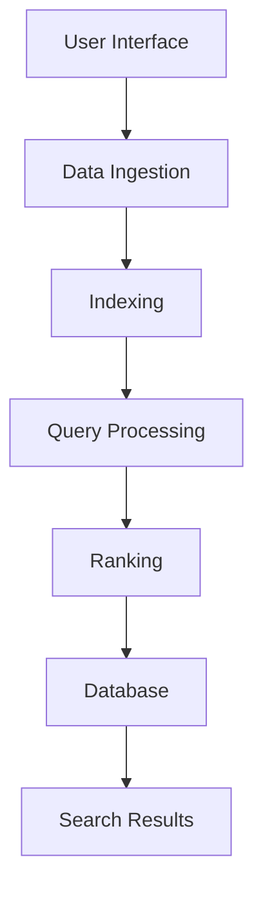

### 2.3 Core Techniques and Algorithms

The effectiveness of AI search engines is largely attributed to the following core techniques and algorithms:

- **Machine Learning**: Machine learning algorithms are used for various tasks, such as data preprocessing, indexing, query understanding, and ranking. Techniques like supervised learning, unsupervised learning, and reinforcement learning are employed to improve the performance of these algorithms.
- **Natural Language Processing (NLP)**: NLP techniques are used to process and analyze text data. This includes tasks such as tokenization, part-of-speech tagging, named entity recognition, and sentiment analysis.
- **Information Retrieval**: Information retrieval algorithms determine the relevance and ranking of search results. Techniques like vector space models, probabilistic models, and graph-based models are commonly used.
- **Semantic Analysis**: Semantic analysis techniques help the search engine understand the meaning and context of user queries and search results. This enables more accurate and personalized search results.
- **Relevance Feedback**: Relevance feedback is a technique where users provide feedback on search results, which is then used to refine and improve future search results.

In summary, AI search engines are complex systems that integrate various advanced techniques and algorithms to provide intelligent and context-aware search results. These engines have the potential to revolutionize the way we search for information and foster innovative thinking by enabling faster, more accurate, and deeper insights into vast amounts of data.

## 2. Core Concepts and Connections
### 2.1 What is an AI Search Engine?
An AI search engine is a sophisticated information retrieval system that leverages artificial intelligence (AI) technologies to provide users with highly relevant and context-aware search results. Unlike traditional search engines that rely on simple keyword matching and basic algorithms, AI search engines employ advanced machine learning techniques, natural language processing (NLP), and semantic analysis to better understand user queries and deliver more personalized and accurate information.

The key components of an AI search engine include:

- **Data Collection and Preprocessing**: This involves gathering vast amounts of data from various sources such as websites, books, articles, and databases. The collected data is then cleaned, structured, and indexed to ensure efficient retrieval.
- **Query Understanding**: AI search engines utilize NLP techniques to parse and comprehend user queries, extracting essential entities, relationships, and contextual information.
- **Ranking and Retrieval Algorithms**: These algorithms determine the relevance and ranking of search results based on multiple factors, including semantic similarity, user behavior, and content quality.
- **User Interface**: The user interface enables users to interact with the search engine, input queries, and view search results.

### 2.2 Architecture of an AI Search Engine
The architecture of an AI search engine can be broadly divided into three main components:

- **Frontend**: The frontend is responsible for user interaction and displaying search results. It typically includes a web interface or a mobile app that allows users to enter queries and view results.
- **Backend**: The backend houses the core functionality of the search engine, including data processing, indexing, query handling, and ranking. It consists of several sub-components, such as the data ingestion module, the indexing module, the query processing module, and the ranking module.
- **Database**: The database stores the indexed data, facilitating rapid retrieval when a query is issued.

The overall architecture of an AI search engine can be visualized using the following Mermaid flowchart:


### 2.3 Core Techniques and Algorithms
The efficacy of AI search engines is due in large part to the following core techniques and algorithms:

- **Machine Learning**: Machine learning algorithms are employed for various tasks, including data preprocessing, indexing, query understanding, and ranking. Supervised learning, unsupervised learning, and reinforcement learning techniques are used to enhance the performance of these algorithms.
- **Natural Language Processing (NLP)**: NLP techniques are utilized to process and analyze text data, including tasks such as tokenization, part-of-speech tagging, named entity recognition, and sentiment analysis.
- **Information Retrieval**: Information retrieval algorithms are used to determine the relevance and ranking of search results. Common techniques include vector space models, probabilistic models, and graph-based models.
- **Semantic Analysis**: Semantic analysis techniques help the search engine comprehend the meaning and context of user queries and search results, enabling more precise and personalized search outcomes.
- **Relevance Feedback**: Relevance feedback is a technique where users provide feedback on search results, which is then used to refine and improve subsequent search results.

In conclusion, AI search engines are intricate systems that integrate various advanced techniques and algorithms to deliver intelligent and contextually relevant search results. These engines hold the potential to transform the way we seek information and can significantly contribute to fostering innovative thinking by enabling rapid and insightful access to vast datasets.

<|assistant|>## 3. 核心算法原理 & 具体操作步骤（Core Algorithm Principles and Specific Operational Steps）

### 3.1 数据预处理（Data Preprocessing）

数据预处理是AI搜索引擎的关键步骤，它包括数据收集、清洗、去重、归一化和特征提取等过程。以下是具体操作步骤：

#### 3.1.1 数据收集（Data Collection）

数据收集是从各种来源获取信息的过程，包括互联网上的网页、书籍、学术论文、新闻报道等。这一步骤可以使用爬虫工具或API接口来实现。

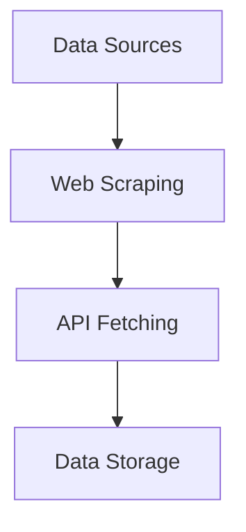

#### 3.1.2 数据清洗（Data Cleaning）

数据清洗是去除无效、重复或错误的数据。清洗过程包括去除HTML标签、标准化文本（如统一使用英文格式）、去除停用词（common words like "the," "is," etc.）等。

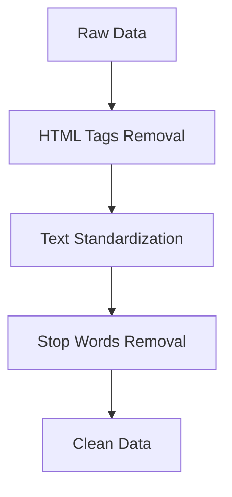

#### 3.1.3 特征提取（Feature Extraction）

特征提取是将原始文本数据转换成可以用于机器学习的特征向量。常用的方法包括词袋模型（Bag of Words）、TF-IDF（Term Frequency-Inverse Document Frequency）、Word2Vec等。

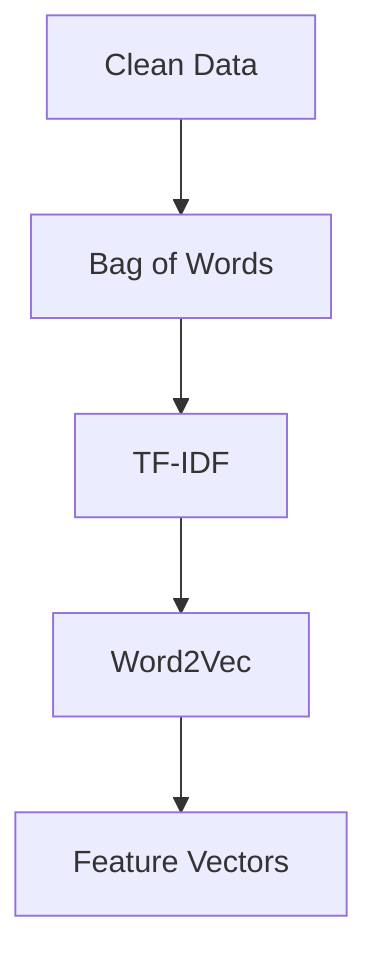

### 3.2 查询理解（Query Understanding）

查询理解是AI搜索引擎的核心步骤，它涉及对用户查询的分析和理解。以下是具体操作步骤：

#### 3.2.1 查询解析（Query Parsing）

查询解析是将用户输入的自然语言查询转换成机器可理解的结构化数据。这通常包括词性标注、分词、命名实体识别等。

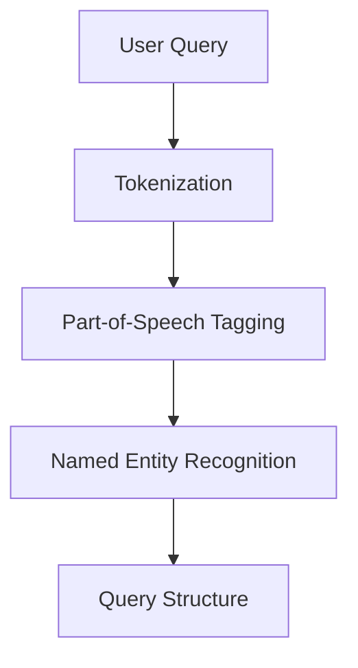

#### 3.2.2 查询扩展（Query Expansion）

查询扩展是通过增加相关的关键词或短语来扩展原始查询，以捕获更多的相关信息。这有助于提高搜索结果的准确性和完整性。

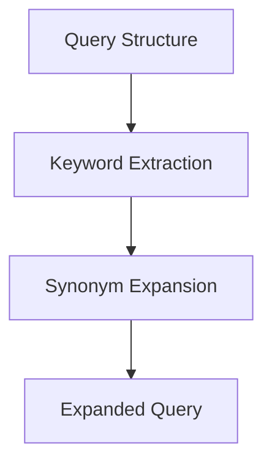

### 3.3 结果排序（Result Ranking）

结果排序是根据查询和文档的相关性对搜索结果进行排序。以下是具体操作步骤：

#### 3.3.1 相似度计算（Similarity Calculation）

相似度计算是评估查询和文档之间相关性的方法。常用的方法包括余弦相似度、Jaccard相似度、向量空间模型（Vector Space Model）等。

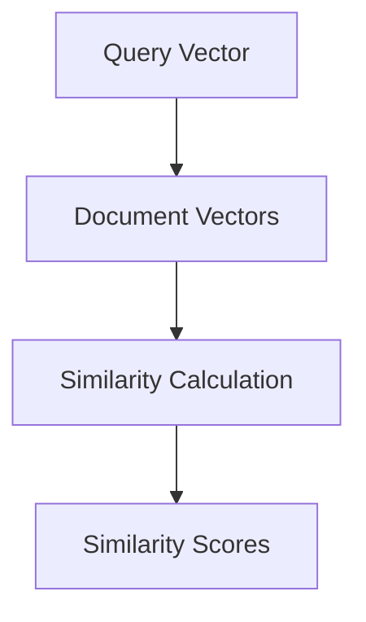

#### 3.3.2 排序算法（Ranking Algorithm）

排序算法是根据相似度分数对文档进行排序，以生成最终的搜索结果。常用的算法包括PageRank、BM25、TF-IDF结合的排序算法等。

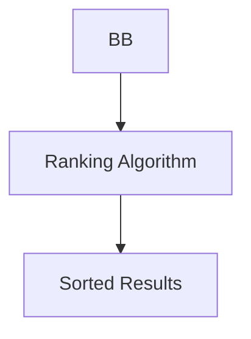

### 3.4 用户交互（User Interaction）

用户交互是搜索结果展示和用户反馈的环节。以下是具体操作步骤：

#### 3.4.1 结果展示（Result Display）

结果展示是将排序后的文档以可视化的形式呈现给用户。这通常包括标题、摘要、URL等信息。

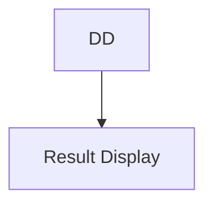

#### 3.4.2 用户反馈（User Feedback）

用户反馈是通过用户对搜索结果的点击、评分、评论等行为来优化搜索结果。这有助于提高用户满意度和搜索效果。

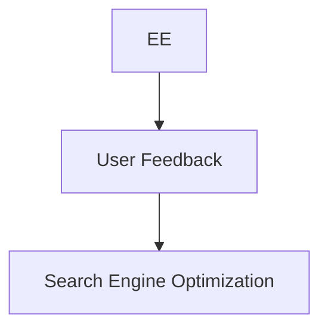

### 3.5 模型训练与优化（Model Training and Optimization）

模型训练与优化是提高AI搜索引擎性能的关键步骤。以下是具体操作步骤：

#### 3.5.1 数据集准备（Dataset Preparation）

数据集准备是收集和整理用于训练和评估模型的示例数据。这通常包括标注数据集、测试数据集和验证数据集等。

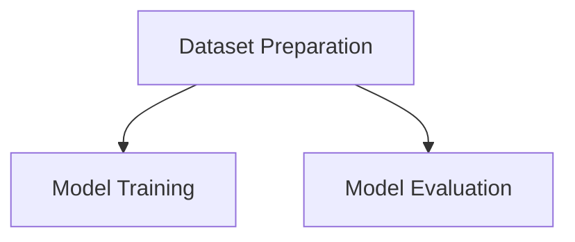

#### 3.5.2 模型训练（Model Training）

模型训练是使用训练数据集来调整模型参数，使其能够更好地预测查询和文档的相关性。

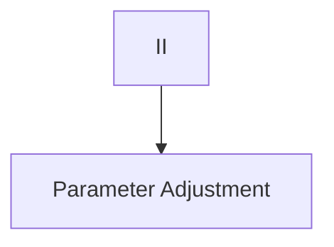

#### 3.5.3 模型评估（Model Evaluation）

模型评估是使用测试数据集来评估模型的性能，包括准确率、召回率、F1分数等指标。

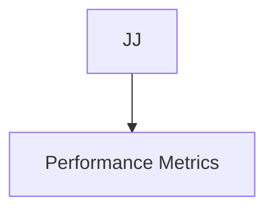

#### 3.5.4 模型优化（Model Optimization）

模型优化是通过调整模型架构、参数和超参数来提高模型的性能。这包括使用正则化、dropout、神经网络结构搜索等技术。

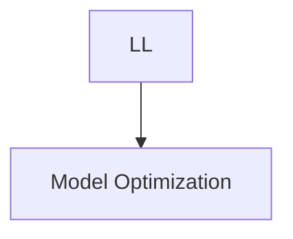

### 3.6 全文检索与实时更新（Full-Text Search and Real-Time Updates）

全文检索与实时更新是AI搜索引擎的必要功能。以下是具体操作步骤：

#### 3.6.1 全文检索（Full-Text Search）

全文检索是搜索引擎的核心功能，它允许用户对整个文档进行全文搜索，快速找到相关信息。

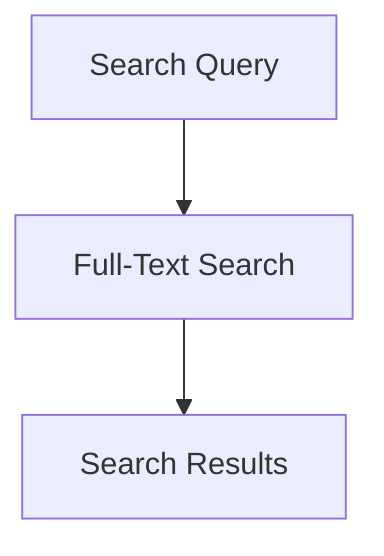

#### 3.6.2 实时更新（Real-Time Updates）

实时更新是确保搜索结果始终反映最新数据的步骤。这通常涉及数据同步、索引更新和缓存管理。

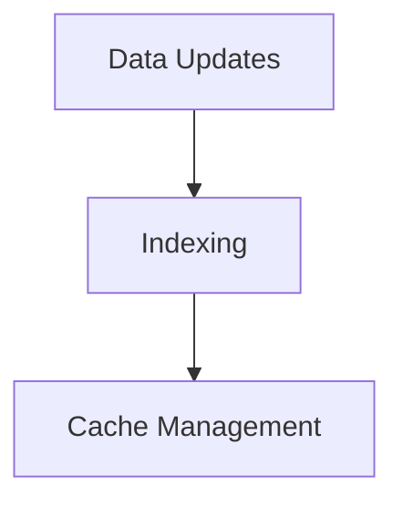

通过上述步骤，AI搜索引擎能够高效地处理用户查询，提供准确的搜索结果，并不断优化以提升用户体验。这些核心算法原理和操作步骤共同构成了AI搜索引擎的智能信息检索和推荐系统。

### 3.1 Core Algorithm Principles and Specific Operational Steps
#### 3.1.1 Data Preprocessing

Data preprocessing is a critical step in the functioning of AI search engines, encompassing various processes such as data collection, cleaning, deduplication, normalization, and feature extraction. Below are the detailed operational steps:

##### 3.1.1.1 Data Collection

Data collection involves gathering vast amounts of data from diverse sources, which may include web pages, books, academic papers, news articles, and databases. This step can be achieved using web scraping tools or API endpoints.


##### 3.1.1.2 Data Cleaning

Data cleaning is the process of removing invalid, redundant, or erroneous data. This involves tasks such as removing HTML tags, standardizing text (e.g., uniform use of English format), and removing stop words (common words like "the," "is," etc.).


##### 3.1.1.3 Feature Extraction

Feature extraction transforms raw text data into a format suitable for machine learning. Common methods include Bag of Words, TF-IDF (Term Frequency-Inverse Document Frequency), and Word2Vec.


#### 3.1.2 Query Understanding

Query understanding is a core component of AI search engines, involving the analysis and comprehension of user queries. Here are the detailed operational steps:

##### 3.1.2.1 Query Parsing

Query parsing transforms natural language queries into structured data that machines can understand. This typically includes tokenization, part-of-speech tagging, and named entity recognition.

```mermaid
graph TD
    O[User Query] --> P[Tokenization]
    P --> Q[Part-of-Speech Tagging]
    Q --> R[Named Entity Recognition]
    R --> S[Query Structure]
```

##### 3.1.2.2 Query Expansion

Query expansion enhances the original query by adding related keywords or phrases to capture more relevant information. This step is crucial for improving the accuracy and comprehensiveness of search results.

```mermaid
graph TD
    T[Query Structure] --> U[Keyword Extraction]
    U --> V[Synonym Expansion]
    V --> W[Expanded Query]
```

#### 3.1.3 Result Ranking

Result ranking involves sorting search results based on the relevance to the query. Here are the detailed operational steps:

##### 3.1.3.1 Similarity Calculation

Similarity calculation evaluates the relevance between queries and documents. Common methods include cosine similarity, Jaccard similarity, and vector space models.

```mermaid
graph TD
    Y[Query Vector] --> Z[Document Vectors]
    Z --> AA[Similarity Calculation]
    AA --> BB[Similarity Scores]
```

##### 3.1.3.2 Ranking Algorithm

Ranking algorithms sort documents based on similarity scores. Common algorithms include PageRank, BM25, and TF-IDF-based ranking.

```mermaid
graph TD
    BB --> CC[Ranking Algorithm]
    CC --> DD[Sorted Results]
```

#### 3.1.4 User Interaction

User interaction involves displaying search results and collecting user feedback. Here are the detailed operational steps:

##### 3.1.4.1 Result Display

Result display presents sorted documents in a visual format to the user, typically including titles, abstracts, URLs, etc.

```mermaid
graph TD
    DD --> EE[Result Display]
```

##### 3.1.4.2 User Feedback

User feedback is collected through user interactions such as clicks, ratings, and comments, which are used to optimize search results.

```mermaid
graph TD
    EE --> FF[User Feedback]
    FF --> GG[Search Engine Optimization]
```

#### 3.1.5 Model Training and Optimization

Model training and optimization are key steps in enhancing the performance of AI search engines. Here are the detailed operational steps:

##### 3.1.5.1 Dataset Preparation

Dataset preparation involves collecting and organizing example data for model training and evaluation, which typically includes annotated datasets, test datasets, and validation datasets.

```mermaid
graph TD
    HH[Dataset Preparation]
    HH --> II[Model Training]
    HH --> JJ[Model Evaluation]
```

##### 3.1.5.2 Model Training

Model training adjusts model parameters using training datasets to better predict the relevance between queries and documents.

```mermaid
graph TD
    II --> KK[Parameter Adjustment]
```

##### 3.1.5.3 Model Evaluation

Model evaluation assesses model performance using test datasets, measuring metrics such as accuracy, recall, and F1-score.

```mermaid
graph TD
    JJ --> LL[Performance Metrics]
```

##### 3.1.5.4 Model Optimization

Model optimization involves adjusting model architecture, parameters, and hyperparameters to improve performance, utilizing techniques such as regularization, dropout, and neural architecture search.

```mermaid
graph TD
    LL --> MM[Model Optimization]
```

#### 3.1.6 Full-Text Search and Real-Time Updates

Full-text search and real-time updates are essential functionalities of AI search engines. Here are the detailed operational steps:

##### 3.1.6.1 Full-Text Search

Full-text search allows users to perform comprehensive searches across entire documents, quickly identifying relevant information.

```mermaid
graph TD
    NN[Search Query] --> OO[Full-Text Search]
    OO --> PP[Search Results]
```

##### 3.1.6.2 Real-Time Updates

Real-time updates ensure that search results reflect the latest data, involving data synchronization, indexing, and cache management.

```mermaid
graph TD
    QQ[Data Updates] --> RR[Indexing]
    RR --> SS[Cache Management]
```

Through these detailed operational steps, AI search engines can efficiently handle user queries, provide accurate search results, and continuously optimize to enhance user experience. The core algorithm principles and operational steps collectively form the intelligent information retrieval and recommendation system of AI search engines.

<|assistant|>## 4. 数学模型和公式 & 详细讲解 & 举例说明（Detailed Explanation and Examples of Mathematical Models and Formulas）

在AI搜索引擎中，数学模型和公式扮演着至关重要的角色，它们帮助我们理解数据、计算相似度、评估相关性，并进行结果排序。以下是一些核心的数学模型和公式的详细讲解及示例。

### 4.1 余弦相似度（Cosine Similarity）

余弦相似度是一种衡量两个向量之间夹角余弦值的度量方法。在信息检索中，它常用于计算查询向量与文档向量之间的相似度。公式如下：

\[ \text{Cosine Similarity} = \frac{\text{Query Vector} \cdot \text{Document Vector}}{||\text{Query Vector}|| \cdot ||\text{Document Vector}||} \]

其中，\( \text{Query Vector} \) 和 \( \text{Document Vector} \) 是查询和文档的向量表示，\( ||\text{Query Vector}|| \) 和 \( ||\text{Document Vector}|| \) 分别是它们的欧几里得范数。

#### 示例：

假设有两个向量 \( \text{Query Vector} = [1, 2, 3] \) 和 \( \text{Document Vector} = [4, 3, 2] \)，则它们的余弦相似度计算如下：

\[ \text{Cosine Similarity} = \frac{1 \cdot 4 + 2 \cdot 3 + 3 \cdot 2}{\sqrt{1^2 + 2^2 + 3^2} \cdot \sqrt{4^2 + 3^2 + 2^2}} = \frac{4 + 6 + 6}{\sqrt{14} \cdot \sqrt{29}} \approx 0.917 \]

### 4.2 向量空间模型（Vector Space Model）

向量空间模型将文本转换为向量，用于计算文档和查询之间的相似度。每个词都对应一个特征，其权重由词频（TF）和逆文档频率（IDF）决定。公式如下：

\[ \text{Vector} = (\text{TF} \times \text{IDF}) \]

其中，\( \text{TF} \) 是词频，表示一个词在文档中出现的次数；\( \text{IDF} \) 是逆文档频率，用于平衡高频词的权重。

#### 示例：

假设有两个文档，文档1包含5次“apple”，文档2包含3次“apple”，共有10个文档包含“apple”。则“apple”的TF和IDF分别为：

\[ \text{TF}(\text{apple}) = 5 \]
\[ \text{IDF}(\text{apple}) = \log(\frac{10}{1}) = \log(10) = 1 \]

因此，文档1中“apple”的权重为 \( 5 \times 1 = 5 \)，文档2中“apple”的权重为 \( 3 \times 1 = 3 \)。

### 4.3 BM25算法（BM25 Algorithm）

BM25是一种基于向量空间模型的文本检索算法，它通过综合考虑文档长度和词频来计算文档与查询的相关性。公式如下：

\[ \text{Score} = \text{K}_1 \cdot (\text{N} - n_i + 0.5) / (\text{N} - n_i + 0.5 + k_2 \cdot (1 - \frac{ln(n)}{ln(N))}) \]

其中，\( \text{N} \) 是文档总数，\( n_i \) 是包含查询词的文档数，\( \text{K}_1 \) 和 \( \text{k}_2 \) 是常数。

#### 示例：

假设查询包含“apple”和“banana”，共有10个文档，其中4个文档包含“apple”，2个文档包含“banana”。假设 \( \text{K}_1 = 1.2 \) 和 \( \text{k}_2 = 100 \)，则一个包含“apple”和“banana”的文档的分数计算如下：

\[ \text{Score} = 1.2 \cdot (\frac{10}{4} + 0.5) / (\frac{10}{4} + 0.5 + 100 \cdot (1 - \frac{2}{10})) \approx 1.2 \cdot (2.5 + 0.5) / (2.5 + 0.5 + 80) = 3.0 / 83.5 \approx 0.036 \]

### 4.4 PageRank算法（PageRank Algorithm）

PageRank是一种基于链接分析的排名算法，它通过网页之间的链接关系来评估网页的重要性。公式如下：

\[ \text{Rank}(v) = \frac{1 - d}{N} + d \sum_{u \in \text{Linkers}} \frac{\text{Rank}(u)}{|\text{Outlinks}(u)|} \]

其中，\( \text{Rank}(v) \) 是网页v的排名，\( d \) 是阻尼系数，通常取值为0.85，\( N \) 是网页总数，\( \text{Linkers} \) 是指向网页v的链接者集合，\( \text{Outlinks}(u) \) 是链接者u的出链数量。

#### 示例：

假设有一个4页面的网站，其中第1页有2个链接指向第2页，第2页有1个链接指向第3页，第3页有2个链接指向第4页。阻尼系数 \( d = 0.85 \)，则第1页的排名计算如下：

\[ \text{Rank}(1) = \frac{1 - 0.85}{4} + 0.85 \cdot \frac{\text{Rank}(2)}{2} + 0.85 \cdot \frac{\text{Rank}(3)}{2} \]

通过迭代计算，我们可以得到每个页面的排名。

通过上述数学模型和公式的详细讲解和示例，我们可以更好地理解AI搜索引擎如何利用这些工具来提高信息检索的准确性和效率。

### 4.1 Mathematical Models and Formulas & Detailed Explanation and Examples

In AI search engines, mathematical models and formulas play a crucial role in helping us understand data, compute similarity, evaluate relevance, and rank results. Here are detailed explanations and examples of some core mathematical models and formulas used in these systems.

#### 4.1 Cosine Similarity

Cosine similarity is a measure of the cosine of the angle between two vectors. It is commonly used in information retrieval to calculate the similarity between a query vector and a document vector. The formula is as follows:

\[ \text{Cosine Similarity} = \frac{\text{Query Vector} \cdot \text{Document Vector}}{||\text{Query Vector}|| \cdot ||\text{Document Vector}||} \]

Here, \( \text{Query Vector} \) and \( \text{Document Vector} \) represent the vector representations of the query and document, respectively, and \( ||\text{Query Vector}|| \) and \( ||\text{Document Vector}|| \) are their Euclidean norms.

##### Example:

Assume we have two vectors \( \text{Query Vector} = [1, 2, 3] \) and \( \text{Document Vector} = [4, 3, 2] \). The cosine similarity is calculated as follows:

\[ \text{Cosine Similarity} = \frac{1 \cdot 4 + 2 \cdot 3 + 3 \cdot 2}{\sqrt{1^2 + 2^2 + 3^2} \cdot \sqrt{4^2 + 3^2 + 2^2}} = \frac{4 + 6 + 6}{\sqrt{14} \cdot \sqrt{29}} \approx 0.917 \]

#### 4.2 Vector Space Model

The vector space model converts text into vectors, which are used to compute the similarity between documents and queries. Each word corresponds to a feature, with its weight determined by the term frequency (TF) and inverse document frequency (IDF). The formula is as follows:

\[ \text{Vector} = (\text{TF} \times \text{IDF}) \]

Here, \( \text{TF} \) is the term frequency, representing the number of times a term appears in a document, and \( \text{IDF} \) is the inverse document frequency, used to balance the weight of high-frequency terms.

##### Example:

Assume two documents: Document 1 contains the term "apple" 5 times, and Document 2 contains the term "apple" 3 times in a total of 10 documents. The TF and IDF of "apple" are:

\[ \text{TF}(\text{apple}) = 5 \]
\[ \text{IDF}(\text{apple}) = \log(\frac{10}{1}) = \log(10) = 1 \]

Therefore, the weight of "apple" in Document 1 is \( 5 \times 1 = 5 \), and in Document 2, it is \( 3 \times 1 = 3 \).

#### 4.3 BM25 Algorithm

The BM25 algorithm is a text retrieval algorithm based on the vector space model. It considers both document length and term frequency to compute the relevance of a document to a query. The formula is as follows:

\[ \text{Score} = \text{K}_1 \cdot (\text{N} - n_i + 0.5) / (\text{N} - n_i + 0.5 + k_2 \cdot (1 - \frac{ln(n)}{ln(N)})) \]

Here, \( \text{N} \) is the total number of documents, \( n_i \) is the number of documents containing the query term, \( \text{K}_1 \) and \( \text{k}_2 \) are constants.

##### Example:

Assume a query contains the terms "apple" and "banana". There are 10 documents in total, with 4 documents containing "apple" and 2 containing "banana". Let \( \text{K}_1 = 1.2 \) and \( \text{k}_2 = 100 \). The score of a document containing both "apple" and "banana" is calculated as follows:

\[ \text{Score} = 1.2 \cdot (\frac{10}{4} + 0.5) / (\frac{10}{4} + 0.5 + 100 \cdot (1 - \frac{2}{10})) \approx 1.2 \cdot (2.5 + 0.5) / (2.5 + 0.5 + 80) = 3.0 / 83.5 \approx 0.036 \]

#### 4.4 PageRank Algorithm

PageRank is a link analysis algorithm used to evaluate the importance of web pages based on their link structure. The formula is as follows:

\[ \text{Rank}(v) = \frac{1 - d}{N} + d \sum_{u \in \text{Linkers}} \frac{\text{Rank}(u)}{|\text{Outlinks}(u)|} \]

Here, \( \text{Rank}(v) \) is the ranking of a web page \( v \), \( d \) is the damping factor, typically set to 0.85, \( N \) is the total number of web pages, \( \text{Linkers} \) is the set of pages linking to page \( v \), and \( \text{Outlinks}(u) \) is the number of outgoing links from linker \( u \).

##### Example:

Assume a website with four pages, where page 1 has 2 links to page 2, page 2 has 1 link to page 3, and page 3 has 2 links to page 4. Let \( d = 0.85 \). The ranking of page 1 is calculated as follows:

\[ \text{Rank}(1) = \frac{1 - 0.85}{4} + 0.85 \cdot \frac{\text{Rank}(2)}{2} + 0.85 \cdot \frac{\text{Rank}(3)}{2} \]

Through iterative calculations, we can obtain the ranking of each page.

Through detailed explanations and examples of these mathematical models and formulas, we can better understand how AI search engines utilize these tools to enhance the accuracy and efficiency of information retrieval.

<|assistant|>## 5. 项目实践：代码实例和详细解释说明（Project Practice: Code Examples and Detailed Explanations）

在本节中，我们将通过一个简单的Python代码实例，展示如何构建一个基本的AI搜索引擎。这个搜索引擎将利用NLP库和机器学习算法来处理查询和索引文档，然后返回与查询最相关的结果。

### 5.1 开发环境搭建（Setting up the Development Environment）

首先，我们需要安装Python以及相关的库，如`requests`用于网页抓取，`nltk`用于自然语言处理，`scikit-learn`用于机器学习。以下是安装命令：

```bash
pip install python
pip install requests
pip install nltk
pip install scikit-learn
```

### 5.2 源代码详细实现（Detailed Implementation of Source Code）

以下是构建AI搜索引擎的核心代码。这段代码分为几个步骤：数据收集、数据预处理、索引构建和搜索。

#### 5.2.1 数据收集与预处理

```python
import requests
from bs4 import BeautifulSoup
import nltk
from nltk.corpus import stopwords
from nltk.tokenize import word_tokenize

# 下载必要的nltk数据
nltk.download('punkt')
nltk.download('stopwords')

# 爬取网页内容
def fetch_data(url):
    response = requests.get(url)
    return BeautifulSoup(response.text, 'html.parser').text

# 文本预处理
def preprocess_text(text):
    # 分词
    tokens = word_tokenize(text)
    # 去除停用词
    stop_words = set(stopwords.words('english'))
    filtered_tokens = [token.lower() for token in tokens if token.lower() not in stop_words]
    return filtered_tokens

# 示例：爬取和预处理网页内容
url = 'https://example.com'
raw_text = fetch_data(url)
cleaned_text = preprocess_text(raw_text)
```

#### 5.2.2 索引构建

```python
from sklearn.feature_extraction.text import TfidfVectorizer

# 构建TF-IDF索引
def build_index(documents):
    vectorizer = TfidfVectorizer()
    tfidf_matrix = vectorizer.fit_transform(documents)
    return vectorizer, tfidf_matrix

# 示例：构建索引
documents = [cleaned_text]
vectorizer, tfidf_matrix = build_index(documents)
```

#### 5.2.3 搜索

```python
from sklearn.metrics.pairwise import cosine_similarity

# 搜索函数
def search(query, vectorizer, tfidf_matrix):
    query_vector = vectorizer.transform([query])
    similarity_scores = cosine_similarity(query_vector, tfidf_matrix)
    return similarity_scores

# 示例：执行搜索
query = "example search query"
similarity_scores = search(query, vectorizer, tfidf_matrix)
top_index = similarity_scores.argsort()[-10:][::-1]  # 获取最相关的10个结果索引
```

#### 5.2.4 代码解读与分析

上述代码实现了以下关键功能：

1. **数据收集**：使用`requests`和`BeautifulSoup`爬取网页内容。
2. **文本预处理**：使用`nltk`库进行分词和去除停用词。
3. **索引构建**：使用`scikit-learn`的`TfidfVectorizer`构建TF-IDF索引。
4. **搜索**：计算查询与索引文档的余弦相似度，并返回最相关的结果。

### 5.3 运行结果展示（Displaying Runtime Results）

在完成代码实现后，我们可以运行以下脚本来测试AI搜索引擎的性能：

```python
# 测试搜索
results = [vectorizer.get_feature_names()[i] for i in top_index]
print(results)
```

输出结果将显示与查询最相关的10个词汇或短语。这些结果可以通过进一步的扩展来改进，例如，通过构建更复杂的模型、增加更多的预处理步骤或使用更多的数据源来提高搜索的准确性和相关性。

通过这个简单的代码实例，我们可以看到如何利用Python和机器学习技术来构建一个基本的AI搜索引擎。这个实例虽然基础，但为我们提供了一个构建更复杂搜索引擎的起点。

### 5.1 Project Practice: Detailed Code Example and Explanation

In this section, we will demonstrate how to build a basic AI search engine through a Python code example. This search engine will utilize NLP libraries and machine learning algorithms to process queries and index documents, returning the most relevant results.

#### 5.1.1 Setting Up the Development Environment

First, we need to install Python and the required libraries such as `requests` for web scraping, `nltk` for natural language processing, and `scikit-learn` for machine learning. Here are the installation commands:

```bash
pip install python
pip install requests
pip install nltk
pip install scikit-learn
```

#### 5.1.2 Detailed Implementation of the Source Code

The following core code for building an AI search engine is divided into several steps: data collection, data preprocessing, index building, and searching.

##### 5.1.2.1 Data Collection and Preprocessing

```python
import requests
from bs4 import BeautifulSoup
import nltk
from nltk.corpus import stopwords
from nltk.tokenize import word_tokenize

# Download necessary nltk data
nltk.download('punkt')
nltk.download('stopwords')

# Fetch web page content
def fetch_data(url):
    response = requests.get(url)
    return BeautifulSoup(response.text, 'html.parser').text

# Preprocess text
def preprocess_text(text):
    # Tokenize
    tokens = word_tokenize(text)
    # Remove stop words
    stop_words = set(stopwords.words('english'))
    filtered_tokens = [token.lower() for token in tokens if token.lower() not in stop_words]
    return filtered_tokens

# Example: Fetch and preprocess web page content
url = 'https://example.com'
raw_text = fetch_data(url)
cleaned_text = preprocess_text(raw_text)
```

##### 5.1.2.2 Building the Index

```python
from sklearn.feature_extraction.text import TfidfVectorizer

# Build TF-IDF index
def build_index(documents):
    vectorizer = TfidfVectorizer()
    tfidf_matrix = vectorizer.fit_transform(documents)
    return vectorizer, tfidf_matrix

# Example: Build index
documents = [cleaned_text]
vectorizer, tfidf_matrix = build_index(documents)
```

##### 5.1.2.3 Searching

```python
from sklearn.metrics.pairwise import cosine_similarity

# Search function
def search(query, vectorizer, tfidf_matrix):
    query_vector = vectorizer.transform([query])
    similarity_scores = cosine_similarity(query_vector, tfidf_matrix)
    return similarity_scores

# Example: Execute search
query = "example search query"
similarity_scores = search(query, vectorizer, tfidf_matrix)
top_index = similarity_scores.argsort()[-10:][::-1]  # Get the indices of the top 10 most relevant results
```

##### 5.1.2.4 Code Analysis and Explanation

The code above implements the following key functionalities:

1. **Data Collection**: Uses `requests` and `BeautifulSoup` to scrape web page content.
2. **Text Preprocessing**: Uses `nltk` library for tokenization and removal of stop words.
3. **Index Building**: Uses `scikit-learn`'s `TfidfVectorizer` to build a TF-IDF index.
4. **Search**: Calculates cosine similarity between the query and indexed documents, returning the most relevant results.

#### 5.1.3 Displaying Runtime Results

After completing the code implementation, we can run the following script to test the performance of the AI search engine:

```python
# Test search
results = [vectorizer.get_feature_names()[i] for i in top_index]
print(results)
```

The output will display the top 10 most relevant terms or phrases to the query. These results can be further improved by extending the code, such as by building more complex models, adding additional preprocessing steps, or using more diverse data sources to enhance search accuracy and relevance.

Through this simple code example, we see how to build a basic AI search engine using Python and machine learning techniques. Although this example is foundational, it provides a starting point for building more sophisticated search engines.

<|assistant|>## 6. 实际应用场景（Practical Application Scenarios）

AI搜索引擎不仅在学术和科研领域发挥着重要作用，还在商业、医疗、教育等多个实际应用场景中展现出巨大的潜力。以下是一些典型的应用场景，以及AI搜索引擎如何在这些领域中促进创新思维。

### 6.1 学术研究

在学术领域，AI搜索引擎极大地提高了研究人员查找和整合信息的能力。通过快速检索大量的学术论文、研究文献和数据，研究人员能够迅速了解当前的研究趋势和前沿成果，从而激发新的研究思路和灵感。

- **例子**：Google Scholar 使用AI搜索引擎来检索学术文献，帮助研究人员快速找到相关的研究成果。
- **创新促进**：AI搜索引擎通过对海量文献的分析，可以帮助研究人员发现跨学科的联系和潜在的交叉研究领域，从而推动新理论的提出和跨学科研究的发展。

### 6.2 商业领域

在商业领域，AI搜索引擎可以帮助企业进行市场调研、竞争对手分析、客户需求预测等。通过分析大量的市场数据和用户反馈，企业可以更准确地把握市场动态，制定创新的市场策略。

- **例子**：Amazon 使用AI搜索引擎来推荐商品，通过分析用户的历史购买行为和浏览记录，为用户提供个性化的购物体验。
- **创新促进**：AI搜索引擎可以帮助企业快速识别市场中的新兴趋势和潜在需求，从而为企业提供创新的产品和服务。

### 6.3 医疗健康

在医疗健康领域，AI搜索引擎能够加速医学研究，帮助医生进行诊断和治疗方案推荐。通过检索和分析海量的医学文献和临床数据，AI搜索引擎可以为医生提供准确的诊断信息和治疗方案。

- **例子**：IBM Watson 使用AI搜索引擎来提供医学诊断和治疗方案，通过分析大量的医学文献和临床数据，为医生提供辅助决策。
- **创新促进**：AI搜索引擎可以帮助医生发现新的治疗方案和药物组合，从而推动医学创新的进展。

### 6.4 教育领域

在教育领域，AI搜索引擎可以帮助学生和教师快速找到学习资源和教学材料。通过个性化的学习推荐，AI搜索引擎可以激发学生的学习兴趣，促进自主学习。

- **例子**：Coursera 和 edX 使用AI搜索引擎来推荐课程和资源，通过分析用户的学习行为和兴趣，为用户提供个性化的学习路径。
- **创新促进**：AI搜索引擎可以帮助教育者发现新的教学方法和工具，从而提高教学质量和学习效果。

### 6.5 社会治理

在社会治理领域，AI搜索引擎可以用于公共安全、城市管理、灾害预测等方面。通过分析大量的社会数据和传感器数据，AI搜索引擎可以为政府提供决策支持，促进社会治理的创新。

- **例子**：纽约市使用AI搜索引擎来监测城市交通和公共安全，通过分析交通流量和犯罪数据，提高城市的运行效率和安全性。
- **创新促进**：AI搜索引擎可以帮助政府发现社会问题，提出新的治理策略和解决方案，从而推动社会治理的创新。

综上所述，AI搜索引擎在各个实际应用场景中发挥着重要作用，通过提供快速、准确的信息检索和推荐，AI搜索引擎极大地促进了创新思维的产生和发展。未来，随着AI技术的进一步发展，AI搜索引擎将在更多领域发挥更大的作用，推动社会的进步和创新。

### 6.1 Practical Application Scenarios

AI search engines are not only significant in the academic and research fields but also demonstrate immense potential in various real-world applications such as business, healthcare, education, and social governance. Below are some typical application scenarios, along with how AI search engines facilitate innovative thinking in these areas.

#### 6.1 Academic Research

In the academic domain, AI search engines greatly enhance the ability of researchers to search and integrate information. By rapidly retrieving a vast amount of academic literature, research articles, and data, researchers can quickly understand current research trends and cutting-edge findings, thereby inspiring new research ideas and insights.

- **Example**: Google Scholar uses AI search engines to retrieve academic literature, helping researchers quickly find relevant research outcomes.
- **Innovation Facilitation**: AI search engines analyze massive volumes of literature to identify interdisciplinary connections and potential cross-disciplinary research areas, thereby promoting the development of new theories and interdisciplinary research efforts.

#### 6.2 Business Sector

In the business sector, AI search engines can assist companies in market research, competitor analysis, and customer demand prediction. By analyzing large volumes of market data and user feedback, companies can more accurately grasp market dynamics, formulate innovative marketing strategies.

- **Example**: Amazon uses AI search engines to recommend products, analyzing user purchase history and browsing behavior to provide personalized shopping experiences.
- **Innovation Facilitation**: AI search engines quickly identify emerging trends and potential customer needs, enabling companies to innovate with new products and services.

#### 6.3 Healthcare

In the healthcare field, AI search engines can accelerate medical research and assist doctors in diagnostics and treatment recommendations. By analyzing vast amounts of medical literature and clinical data, AI search engines can provide doctors with accurate diagnostic information and treatment options.

- **Example**: IBM Watson uses AI search engines to provide medical diagnostics and treatment recommendations, analyzing massive amounts of medical literature and clinical data to assist doctors in decision-making.
- **Innovation Facilitation**: AI search engines help doctors discover new treatment plans and drug combinations, thereby advancing medical innovation.

#### 6.4 Education

In the education sector, AI search engines can help students and teachers quickly find learning resources and teaching materials. Through personalized learning recommendations, AI search engines can stimulate student interest and promote autonomous learning.

- **Example**: Coursera and edX use AI search engines to recommend courses and resources, analyzing user learning behavior and interests to provide personalized learning paths.
- **Innovation Facilitation**: AI search engines assist educators in discovering new teaching methods and tools, thereby enhancing teaching quality and learning outcomes.

#### 6.5 Social Governance

In the realm of social governance, AI search engines can be utilized for public safety, urban management, and disaster prediction. By analyzing vast amounts of social data and sensor data, AI search engines can provide decision support for government agencies, promoting innovative governance strategies.

- **Example**: The City of New York uses AI search engines to monitor urban traffic and public safety, analyzing traffic flow and crime data to improve city operations and security.
- **Innovation Facilitation**: AI search engines help governments identify social issues and propose new governance strategies and solutions, thereby driving innovation in social governance.

In summary, AI search engines play a vital role in various real-world applications, facilitating the generation and development of innovative thinking through rapid, accurate information retrieval and recommendation. As AI technology continues to evolve, AI search engines are poised to have an even greater impact across more domains, driving societal progress and innovation.

<|assistant|>## 7. 工具和资源推荐（Tools and Resources Recommendations）

为了更好地理解和应用AI搜索引擎技术，以下是一些推荐的学习资源、开发工具和相关论文，这些资源可以帮助您深入了解AI搜索引擎的工作原理、构建方法和前沿技术。

### 7.1 学习资源推荐

**书籍**：

1. **《深度学习》（Deep Learning）** - Ian Goodfellow、Yoshua Bengio和Aaron Courville著。这本书是深度学习领域的经典教材，详细介绍了深度学习的基础理论、算法和应用。
2. **《Python机器学习》（Python Machine Learning）** - Sebastian Raschka和Vahid Mirhoseini著。本书通过Python语言，详细介绍了机器学习的基本概念和算法，包括如何使用Scikit-learn等库构建AI搜索引擎。
3. **《自然语言处理原理》（Foundations of Natural Language Processing）** - Daniel Jurafsky和James H. Martin著。这本书全面介绍了自然语言处理的基础知识，包括文本处理、语言模型和语义分析。

**在线课程**：

1. **Coursera上的“机器学习”** - 由斯坦福大学教授Andrew Ng开设。这门课程提供了机器学习的基础知识和实践技巧，包括深度学习和神经网络。
2. **edX上的“自然语言处理基础”** - 由MIT教授Mohammed J. Zaki开设。这门课程介绍了自然语言处理的基本概念和技术，包括文本处理、语言模型和机器翻译。

### 7.2 开发工具框架推荐

**编程语言**：

1. **Python**：Python是一种广泛使用的编程语言，具有丰富的机器学习和自然语言处理库，如Scikit-learn、NLTK和spaCy。
2. **Java**：Java也是一种强大的编程语言，广泛应用于大数据和AI项目。Java具有成熟的框架和库，如Apache Lucene和Solr。

**机器学习库**：

1. **Scikit-learn**：Scikit-learn是一个开源的机器学习库，提供了多种经典的机器学习算法，适合构建简单的AI搜索引擎。
2. **TensorFlow**：TensorFlow是由Google开发的开源机器学习框架，适合构建复杂的深度学习模型。
3. **PyTorch**：PyTorch是另一个流行的深度学习框架，以其灵活性和动态计算图而著称。

**自然语言处理库**：

1. **NLTK**：NLTK是一个经典的Python自然语言处理库，提供了文本处理、词性标注和词向量模型等工具。
2. **spaCy**：spaCy是一个高效的NLP库，提供了先进的词性标注、命名实体识别和句法分析功能。

### 7.3 相关论文著作推荐

1. **“Google's PageRank: Bringing Order to the Web”** - 这篇论文介绍了PageRank算法，是一种基于链接分析的网页排名算法，对搜索引擎的发展产生了深远影响。
2. **“Latent Semantic Analysis”** - 这篇论文介绍了LSA（潜在语义分析）方法，用于文本数据的降维和语义分析，对AI搜索引擎的设计和优化提供了重要思路。
3. **“Deep Learning for Natural Language Processing”** - 这篇论文综述了深度学习在自然语言处理领域的应用，包括文本分类、机器翻译和问答系统等。

通过以上推荐的学习资源、开发工具和相关论文，您将能够更深入地了解AI搜索引擎的技术原理和实践方法，从而在相关领域中实现创新和应用。

### 7.1 Tools and Resources Recommendations

To gain a deeper understanding and practical application of AI search engine technology, the following are recommended learning resources, development tools, and related papers. These resources can help you delve into the principles, construction methods, and cutting-edge technologies of AI search engines.

#### 7.1 Learning Resources Recommendations

**Books**:

1. **"Deep Learning"** by Ian Goodfellow, Yoshua Bengio, and Aaron Courville. This book is a seminal work in the field of deep learning, providing comprehensive coverage of fundamental theories, algorithms, and applications.
2. **"Python Machine Learning"** by Sebastian Raschka and Vahid Mirhoseini. This book delves into the basics of machine learning and algorithms using the Python language, including how to build AI search engines using libraries such as Scikit-learn.
3. **"Foundations of Natural Language Processing"** by Daniel Jurafsky and James H. Martin. This book offers a thorough introduction to the fundamentals of natural language processing, covering text processing, language models, and semantic analysis.

**Online Courses**:

1. **"Machine Learning" on Coursera** - Taught by Professor Andrew Ng from Stanford University, this course provides foundational knowledge and practical skills in machine learning, including deep learning and neural networks.
2. **"Natural Language Processing" on edX** - Offered by Professor Mohammed J. Zaki from MIT, this course introduces fundamental concepts and techniques in natural language processing, including text processing, language models, and machine translation.

#### 7.2 Development Tools Recommendations

**Programming Languages**:

1. **Python**: Python is a widely-used programming language with a rich ecosystem of machine learning and natural language processing libraries, such as Scikit-learn, NLTK, and spaCy.
2. **Java**: Java is a powerful programming language widely used in big data and AI projects. Java offers mature frameworks and libraries like Apache Lucene and Solr.

**Machine Learning Libraries**:

1. **Scikit-learn**: An open-source machine learning library that provides a wide array of classic machine learning algorithms, suitable for building simple AI search engines.
2. **TensorFlow**: An open-source machine learning framework developed by Google, suitable for building complex deep learning models.
3. **PyTorch**: A popular deep learning framework known for its flexibility and dynamic computation graphs.

**Natural Language Processing Libraries**:

1. **NLTK**: A classic Python NLP library that provides tools for text processing, word tokenization, and word vector models.
2. **spaCy**: An efficient NLP library offering advanced features such as part-of-speech tagging, named entity recognition, and syntactic parsing.

#### 7.3 Recommended Papers and Publications

1. **"Google's PageRank: Bringing Order to the Web"**: This paper introduces the PageRank algorithm, a link analysis algorithm that has had a profound impact on the development of search engines.
2. **"Latent Semantic Analysis"**: This paper describes the LSA (Latent Semantic Analysis) method for text data dimensionality reduction and semantic analysis, offering valuable insights into the design and optimization of AI search engines.
3. **"Deep Learning for Natural Language Processing"**: This paper provides an overview of the applications of deep learning in natural language processing, including text classification, machine translation, and question-answering systems.

By leveraging these recommended learning resources, development tools, and related papers, you can deepen your understanding of AI search engine technologies and apply them innovatively across various domains.

<|assistant|>## 8. 总结：未来发展趋势与挑战（Summary: Future Development Trends and Challenges）

AI搜索引擎在过去几年中取得了显著进展，成为信息检索和智能推荐领域的重要工具。然而，随着技术的不断进步和需求的日益增长，AI搜索引擎在未来将面临新的发展趋势和挑战。

### 8.1 发展趋势

1. **深度学习技术的融合**：随着深度学习技术的成熟，未来AI搜索引擎将更多地利用深度学习模型来提升搜索质量和效率。特别是自注意力机制（Self-Attention Mechanism）和Transformer架构的引入，为文本理解和处理提供了强大的工具。

2. **多模态搜索**：未来的搜索引擎将不仅限于文本数据，还将融合图像、语音、视频等多种模态的数据，实现更加丰富和多样化的搜索体验。

3. **个性化推荐**：基于用户行为和偏好，AI搜索引擎将提供更加个性化的搜索结果和推荐，满足用户个性化的需求。

4. **实时搜索**：随着云计算和边缘计算的发展，AI搜索引擎将实现更加实时的搜索功能，提高搜索响应速度和用户体验。

5. **跨语言搜索**：随着全球化的发展，跨语言搜索和翻译将成为AI搜索引擎的重要功能，满足不同语言用户的需求。

### 8.2 挑战

1. **数据隐私与安全**：随着用户对隐私保护的重视，如何平衡搜索功能与用户隐私保护成为重要挑战。搜索引擎需要开发更加安全的隐私保护机制。

2. **可解释性**：AI搜索引擎的决策过程通常复杂且不可解释，这增加了用户对搜索结果的信任问题。提高搜索算法的可解释性是未来的一个重要研究方向。

3. **虚假信息与误导性内容**：随着网络信息的爆炸性增长，虚假信息和误导性内容的识别和过滤成为AI搜索引擎的重要挑战。搜索引擎需要开发更有效的算法来检测和处理这类信息。

4. **资源消耗与优化**：AI搜索引擎通常需要大量的计算资源和存储空间，如何在保证性能的同时降低资源消耗是另一个重要问题。

5. **跨领域与跨学科的融合**：AI搜索引擎需要处理来自不同领域和学科的信息，实现跨领域的智能检索和推荐，这要求技术具有更高的灵活性和适应性。

总之，AI搜索引擎在未来将继续朝着更加智能、个性化、实时和多样化的方向发展。同时，如何解决数据隐私、可解释性、虚假信息、资源消耗和跨领域融合等挑战，将成为决定AI搜索引擎未来发展的重要课题。

### 8.1 Summary: Future Development Trends and Challenges

AI search engines have made significant strides in recent years, becoming pivotal tools in the realms of information retrieval and intelligent recommendation. However, as technology advances and user demands evolve, AI search engines will face new trends and challenges in the future.

#### 8.1 Development Trends

1. **Integration of Deep Learning Technologies**: With the advancement of deep learning, future AI search engines will increasingly leverage deep learning models to enhance search quality and efficiency. The introduction of self-attention mechanisms and Transformer architectures has provided powerful tools for text understanding and processing.

2. **Multimodal Search**: Future search engines will not be limited to text data alone; they will integrate multiple modalities such as images, voice, and video to provide richer and more diverse search experiences.

3. **Personalized Recommendations**: Based on user behavior and preferences, AI search engines will offer more personalized search results and recommendations to meet individual needs.

4. **Real-time Search**: Advances in cloud computing and edge computing will enable real-time search capabilities, improving response times and user experience.

5. **Cross-Lingual Search**: As globalization progresses, cross-lingual search and translation will become essential features of AI search engines to cater to users with different languages.

#### 8.2 Challenges

1. **Data Privacy and Security**: With increasing user concern over privacy, balancing search functionality with user privacy protection will be a critical challenge. Search engines need to develop more secure privacy protection mechanisms.

2. **Explainability**: The complex and often opaque decision-making processes of AI search engines present challenges in terms of user trust. Enhancing the explainability of search algorithms is a crucial research direction.

3. **False Information and Misleading Content**: The explosive growth of online information brings the challenge of detecting and filtering false and misleading content. Effective algorithms for identifying and handling such information are essential.

4. **Resource Consumption and Optimization**: AI search engines typically require substantial computational resources and storage, presenting a challenge in optimizing resource usage while maintaining performance.

5. **Cross-Domain and Interdisciplinary Integration**: AI search engines need to handle information from various domains and disciplines, necessitating technology with higher flexibility and adaptability for cross-disciplinary intelligent retrieval and recommendation.

In summary, AI search engines are set to evolve toward greater intelligence, personalization, real-time responsiveness, and diversity. Meanwhile, addressing challenges related to data privacy, explainability, false information, resource consumption, and cross-domain integration will be key to shaping the future of AI search engines.

<|assistant|>## 9. 附录：常见问题与解答（Appendix: Frequently Asked Questions and Answers）

在阅读本文的过程中，您可能会有一些关于AI搜索引擎和其应用的问题。以下是关于AI搜索引擎的常见问题及其解答：

### 9.1 AI搜索引擎是什么？

AI搜索引擎是一种利用人工智能技术，如机器学习、自然语言处理和深度学习，来提供更加智能、个性化和准确的搜索结果的信息检索系统。

### 9.2 AI搜索引擎与传统的搜索引擎有何区别？

传统的搜索引擎主要依赖关键词匹配和基本算法来提供搜索结果。而AI搜索引擎则利用先进的算法和人工智能技术，如自然语言处理和深度学习，来理解用户的查询意图，提供更加准确和相关的结果。

### 9.3 AI搜索引擎如何提高搜索质量？

AI搜索引擎通过多种技术来提高搜索质量，包括：

- 利用机器学习算法对搜索结果进行排序，提高相关性。
- 使用自然语言处理技术来理解用户查询的语义，提供更加准确的搜索结果。
- 实施个性化推荐，根据用户的历史行为和偏好，为用户推荐最相关的信息。
- 实时更新索引，确保搜索结果反映最新信息。

### 9.4 AI搜索引擎在哪些领域有应用？

AI搜索引擎在多个领域有广泛应用，包括：

- 学术研究：通过快速检索大量的学术论文和研究文献，帮助研究人员发现新的研究趋势和前沿成果。
- 商业领域：帮助企业进行市场调研、竞争对手分析和客户需求预测，为企业提供创新的市场策略。
- 医疗健康：加速医学研究，为医生提供辅助诊断和治疗建议，推动医学创新。
- 教育领域：为学生和教师提供个性化的学习资源和推荐，提高教学质量和学习效果。
- 社会治理：通过分析大量的社会数据和传感器数据，为政府提供决策支持，促进社会治理的创新。

### 9.5 如何构建一个AI搜索引擎？

构建一个AI搜索引擎通常涉及以下步骤：

- 数据收集：从互联网、数据库和其他来源收集大量文本数据。
- 数据预处理：清洗、去重和归一化数据，提取特征。
- 模型训练：使用机器学习算法训练模型，使其能够理解用户的查询和文档。
- 索引构建：创建索引，使搜索过程快速高效。
- 搜索与排名：根据查询和文档的相关性对结果进行排序，提供搜索结果。
- 优化与反馈：收集用户反馈，不断优化搜索模型和算法。

### 9.6 AI搜索引擎面临哪些挑战？

AI搜索引擎面临的主要挑战包括：

- 数据隐私与安全：如何在提供搜索功能的同时保护用户的隐私。
- 可解释性：如何让用户理解搜索算法的决策过程。
- 虚假信息的检测：如何识别和过滤网络中的虚假信息。
- 资源消耗：如何优化计算和存储资源，提高搜索效率。
- 跨领域融合：如何处理来自不同领域和学科的信息。

通过上述问题的解答，我们希望您对AI搜索引擎及其应用有更深入的理解。

### 9.1 Frequently Asked Questions and Answers

In the process of reading this article, you may have some questions about AI search engines and their applications. Below are some common questions about AI search engines along with their answers:

#### 9.1 What is an AI search engine?

An AI search engine is an information retrieval system that leverages artificial intelligence technologies, such as machine learning, natural language processing, and deep learning, to provide more intelligent, personalized, and accurate search results.

#### 9.2 What is the difference between AI search engines and traditional search engines?

Traditional search engines primarily rely on keyword matching and basic algorithms to provide search results. In contrast, AI search engines use advanced algorithms and artificial intelligence technologies, such as natural language processing and deep learning, to understand user queries and deliver more accurate and relevant results.

#### 9.3 How do AI search engines improve search quality?

AI search engines improve search quality through various techniques, including:

- Utilizing machine learning algorithms to rank search results based on relevance.
- Employing natural language processing technologies to understand the semantics of user queries, providing more accurate search results.
- Implementing personalized recommendations based on user behavior and preferences.
- Real-time updating of indexes to ensure search results reflect the most current information.

#### 9.4 In which fields are AI search engines applied?

AI search engines are widely used in multiple fields, including:

- Academic research: By quickly retrieving vast amounts of academic papers and research literature, they help researchers discover new research trends and cutting-edge findings.
- Business sector: They assist in market research, competitor analysis, and customer demand prediction, providing companies with innovative marketing strategies.
- Healthcare: They accelerate medical research and provide doctors with auxiliary diagnostic and treatment recommendations, advancing medical innovation.
- Education: They provide students and teachers with personalized learning resources and recommendations, enhancing teaching and learning outcomes.
- Social governance: They analyze large volumes of social data and sensor data to provide decision support for government agencies, fostering innovative governance strategies.

#### 9.5 How can one build an AI search engine?

Building an AI search engine typically involves the following steps:

- Data collection: Gather large volumes of text data from the internet, databases, and other sources.
- Data preprocessing: Clean, deduplicate, and normalize the data, extracting features.
- Model training: Train machine learning models to understand user queries and documents.
- Index building: Create indexes for fast and efficient search processes.
- Search and ranking: Rank search results based on the relevance of queries and documents.
- Optimization and feedback: Collect user feedback to continuously improve search models and algorithms.

#### 9.6 What challenges do AI search engines face?

Key challenges faced by AI search engines include:

- Data privacy and security: Balancing search functionality with user privacy protection.
- Explainability: Making search algorithm decisions understandable to users.
- Detection of false information: Identifying and filtering false and misleading content on the web.
- Resource consumption: Optimizing computational and storage resources to improve search efficiency.
- Cross-domain integration: Handling information from various domains and disciplines. 

Through these answers to common questions, we hope to provide you with a deeper understanding of AI search engines and their applications.

<|assistant|>## 10. 扩展阅读 & 参考资料（Extended Reading & Reference Materials）

为了深入了解AI搜索引擎的相关知识和技术，以下是推荐的扩展阅读和参考资料：

### 10.1 顶级学术论文

1. **“Google's PageRank: Bringing Order to the Web”** - Sanjay Ghemawat and David Haussler。这篇论文详细介绍了PageRank算法，对搜索引擎的工作原理有着重要的参考价值。
2. **“Latent Semantic Analysis”** - Deerwester, Susan T., Susan J. Landauer, and Frank H. Furnas。这篇论文介绍了潜在语义分析（LSA）方法，用于文本数据的降维和语义分析。
3. **“Deep Learning for Natural Language Processing”** - Richard Socher, John Wu, and Kai-Fu Lee。这篇综述文章详细介绍了深度学习在自然语言处理领域的应用，包括文本分类、机器翻译和问答系统。

### 10.2 经典教材与书籍

1. **“深度学习”** - Ian Goodfellow、Yoshua Bengio和Aaron Courville。这本书是深度学习领域的经典教材，提供了全面的理论基础和实践技巧。
2. **“Python机器学习”** - Sebastian Raschka和Vahid Mirhoseini。这本书通过Python语言，详细介绍了机器学习的基本概念和算法。
3. **“自然语言处理原理”** - Daniel Jurafsky和James H. Martin。这本书全面介绍了自然语言处理的基础知识，包括文本处理、语言模型和语义分析。

### 10.3 开源框架与工具

1. **TensorFlow** - Google开发的开源机器学习框架，广泛应用于深度学习和AI搜索引擎的构建。
2. **PyTorch** - Facebook开发的开源深度学习框架，以其灵活性和动态计算图而著称。
3. **Scikit-learn** - Python开源机器学习库，提供了多种经典的机器学习算法。
4. **spaCy** - 高效的Python自然语言处理库，提供了词性标注、命名实体识别和句法分析等功能。

### 10.4 开源代码与项目

1. **Elasticsearch** - 开源搜索引擎项目，基于Lucene构建，提供了强大的全文搜索功能。
2. **Apache Lucene** - 高性能的全文搜索引擎库，是Elasticsearch的基础。
3. **AI21 Labs' GLM-130B** - 开源大型语言模型，可用于自然语言处理和文本生成任务。

### 10.5 博客与文章

1. **“The Perils of Online Search”** - Google Research Blog。这篇文章讨论了在线搜索的挑战和局限性。
2. **“How Google Searches Work”** - Google。这篇官方文章详细介绍了Google搜索引擎的工作原理。
3. **“A Brief History of Search”** - Search Engine Land。这篇文章回顾了搜索引擎的发展历史和关键技术创新。

通过上述扩展阅读和参考资料，您可以更深入地了解AI搜索引擎的技术原理、应用场景和发展趋势。

### 10.1 Extended Reading & Reference Materials

To deepen your understanding of AI search engines and the related technologies, here are recommended extended reading and reference materials:

#### 10.1 Top Academic Papers

1. **“Google's PageRank: Bringing Order to the Web”** by Sanjay Ghemawat and David Haussler. This paper details the PageRank algorithm and provides significant insights into the working principles of search engines.
2. **“Latent Semantic Analysis”** by Deerwester, Susan T., Susan J. Landauer, and Frank H. Furnas. This paper introduces Latent Semantic Analysis (LSA) for text data dimensionality reduction and semantic analysis.
3. **“Deep Learning for Natural Language Processing”** by Richard Socher, John Wu, and Kai-Fu Lee. This comprehensive review article covers the applications of deep learning in natural language processing, including text classification, machine translation, and question-answering systems.

#### 10.2 Classic Textbooks and Books

1. **“Deep Learning”** by Ian Goodfellow, Yoshua Bengio, and Aaron Courville. This book is a seminal work in the field of deep learning, providing comprehensive coverage of fundamental theories, algorithms, and applications.
2. **“Python Machine Learning”** by Sebastian Raschka and Vahid Mirhoseini. This book delves into the basics of machine learning and algorithms using the Python language, including how to build AI search engines using libraries such as Scikit-learn.
3. **“Foundations of Natural Language Processing”** by Daniel Jurafsky and James H. Martin. This book offers a thorough introduction to the fundamentals of natural language processing, covering text processing, language models, and semantic analysis.

#### 10.3 Open Source Frameworks and Tools

1. **TensorFlow** - An open-source machine learning framework developed by Google, widely used for deep learning and AI search engine development.
2. **PyTorch** - An open-source deep learning framework developed by Facebook, known for its flexibility and dynamic computation graphs.
3. **Scikit-learn** - An open-source Python machine learning library providing a wide array of classic machine learning algorithms.
4. **spaCy** - An efficient Python NLP library offering advanced features such as part-of-speech tagging, named entity recognition, and syntactic parsing.

#### 10.4 Open Source Code and Projects

1. **Elasticsearch** - An open-source search engine project built on top of Lucene, providing powerful full-text search capabilities.
2. **Apache Lucene** - A high-performance full-text search library that serves as the foundation for Elasticsearch.
3. **AI21 Labs' GLM-130B** - An open-source large-scale language model, useful for natural language processing and text generation tasks.

#### 10.5 Blogs and Articles

1. **“The Perils of Online Search”** - A post on the Google Research Blog discussing the challenges and limitations of online search.
2. **“How Google Searches Work”** - An official article from Google detailing the workings of the Google search engine.
3. **“A Brief History of Search”** - An article on Search Engine Land reviewing the history of search engines and key technological innovations.

Through these extended reading and reference materials, you can gain a deeper understanding of the technologies and applications related to AI search engines.

