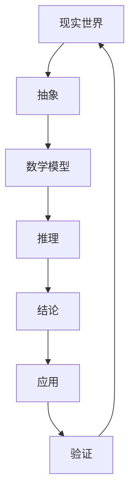

                 

# 认知的的形式化：数学是现实世界的主观反映

> **关键词：** 数学，认知，形式化，主观反映，现实世界，抽象，语言模型，计算机编程。

**摘要：** 本文深入探讨了数学作为人类认知世界的工具，如何通过形式化的方法反映现实世界的本质。通过分析数学的基本概念、公理体系及其实际应用，本文揭示了数学与现实世界之间的关系。同时，本文还探讨了计算机编程中如何借助数学模型来实现现实世界的抽象与建模。最终，本文总结了数学在认知过程中扮演的重要角色，以及未来可能面临的挑战。

## 1. 背景介绍

### 1.1 数学与认知

数学作为一门抽象的学科，通过逻辑推理和符号表示，揭示了现实世界中的规律和结构。人类通过认知过程理解数学概念，进而使用数学工具解决实际问题。这种认知过程是主观的，因为每个人对数学的理解和运用都有其独特的方式。

### 1.2 形式化的概念

形式化是指将现实世界的问题转化为数学语言和符号的过程。通过形式化，我们可以将复杂的问题简化，使得它们更容易分析和解决。形式化的过程不仅限于数学，还包括逻辑、计算机科学等领域。

### 1.3 数学与现实世界的关系

数学与现实世界之间的关系是复杂的。一方面，数学通过抽象和符号化反映了现实世界的本质。另一方面，数学模型在现实世界中可能有多种解释和应用，这取决于我们对现实世界的理解和需求。

## 2. 核心概念与联系

### 2.1 数学的基本概念

数学的基本概念包括数、集合、函数、关系等。这些概念不仅构成了数学的理论基础，也是我们理解和描述现实世界的重要工具。

- **数：** 数是数学的基本元素，用来表示数量和顺序。不同的数系统（如自然数、整数、有理数、实数等）反映了现实世界中不同的量。
- **集合：** 集合是由一组元素组成的整体，用来表示现实世界中的对象或属性。集合的概念在数学和计算机科学中有着广泛的应用。
- **函数：** 函数是一种映射关系，将一个集合中的每个元素映射到另一个集合中的唯一元素。函数的概念在现实世界的建模中非常重要。
- **关系：** 关系是元素之间的连接或相互作用。关系可以用来描述现实世界中的各种现象和规律。

### 2.2 数学公理体系

数学公理体系是数学理论的基础。通过公理体系，我们可以定义数学概念，推导出数学定理，并解决实际问题。

- **公理：** 公理是数学理论中的基本假设，它们不受证明，但被认为是理所当然的。例如，欧几里得几何中的公理，非欧几何中的公理等。
- **定理：** 定理是通过逻辑推理从公理中推导出来的结论。定理为我们提供了解决问题的方法和工具。

### 2.3 数学与现实世界的联系

数学与现实世界的联系体现在以下几个方面：

- **物理规律：** 自然科学的很多规律可以用数学公式表示，如牛顿定律、麦克斯韦方程等。
- **经济模型：** 经济学中的许多理论可以用数学模型来描述，如供需模型、随机模型等。
- **计算机科学：** 计算机科学中的算法、数据结构等都是基于数学理论。

## 3. 核心算法原理 & 具体操作步骤

### 3.1 数学建模

数学建模是将现实世界中的问题转化为数学问题的一个过程。具体操作步骤如下：

1. **问题理解：** 理解问题的背景、目标和条件。
2. **抽象：** 将问题中的关键要素抽象为数学概念和符号。
3. **建立模型：** 根据抽象出来的数学概念和符号，建立数学模型。
4. **分析：** 对模型进行分析，寻找问题的解决方案。
5. **验证：** 验证模型的正确性和有效性。

### 3.2 数学模型的应用

数学模型在现实世界中有广泛的应用。以下是一些常见的应用实例：

- **物理学：** 利用数学模型描述物理现象，如电磁场、流体运动等。
- **经济学：** 利用数学模型分析经济问题，如供需关系、通货膨胀等。
- **计算机科学：** 利用数学模型设计算法和数据结构，如排序算法、图算法等。

## 4. 数学模型和公式 & 详细讲解 & 举例说明

### 4.1 欧几里得几何

欧几里得几何是数学中最基本的几何学分支。以下是一些基本的数学公式和定理：

- **勾股定理：** 直角三角形的两条直角边的平方和等于斜边的平方。即：\(a^2 + b^2 = c^2\)。
- **圆的面积公式：** 圆的面积等于半径的平方乘以π。即：\(A = πr^2\)。
- **球的体积公式：** 球的体积等于半径的立方乘以\( \frac{4}{3}π \)。即：\(V = \frac{4}{3}πr^3\)。

### 4.2 微积分

微积分是数学中的一个重要分支，主要用于研究变化和累积。以下是一些基本的数学公式和定理：

- **导数：** 导数表示函数在某一点的瞬时变化率。即：\(f'(x) = \lim_{h \to 0} \frac{f(x+h) - f(x)}{h}\)。
- **积分：** 积分表示函数在区间上的累积量。即：\(∫f(x)dx = F(x) + C\)，其中F(x)是f(x)的一个原函数，C是积分常数。

### 4.3 线性代数

线性代数是数学中研究向量空间和线性变换的学科。以下是一些基本的数学公式和定理：

- **矩阵乘法：** 矩阵乘法是将两个矩阵按一定的规则相乘得到一个新的矩阵。即：\(AB = C\)，其中C是A和B的乘积矩阵。
- **行列式：** 行列式是一个数值，用于描述矩阵的性质。即：\(det(A) = \sum_{i=1}^{n} (-1)^{i+j} a_{ij} M_{ij}\)，其中\(M_{ij}\)是删除第i行和第j列后得到的子矩阵的行列式。

### 4.4 举例说明

以下是一个利用线性代数解决实际问题的例子：

**问题：** 求解以下线性方程组：

\[ 
\begin{cases} 
2x + 3y = 8 \\
4x - y = 5 
\end{cases}
\]

**解答：** 

首先，我们将方程组写成矩阵形式：

\[ 
\begin{bmatrix} 
2 & 3 \\ 
4 & -1 
\end{bmatrix} 
\begin{bmatrix} 
x \\ 
y 
\end{bmatrix} 
=
\begin{bmatrix} 
8 \\ 
5 
\end{bmatrix}
\]

然后，使用矩阵乘法求解：

\[ 
\begin{bmatrix} 
x \\ 
y 
\end{bmatrix} 
=
\begin{bmatrix} 
2 & 3 \\ 
4 & -1 
\end{bmatrix}^{-1} 
\begin{bmatrix} 
8 \\ 
5 
\end{bmatrix}
\]

计算矩阵的逆：

\[ 
\begin{bmatrix} 
2 & 3 \\ 
4 & -1 
\end{bmatrix}^{-1} 
=
\frac{1}{2 \times (-1) - 3 \times 4} 
\begin{bmatrix} 
-1 & -3 \\ 
-4 & 2 
\end{bmatrix} 
=
\begin{bmatrix} 
\frac{1}{14} & \frac{3}{14} \\ 
\frac{2}{7} & -\frac{1}{7} 
\end{bmatrix}
\]

最后，计算解：

\[ 
\begin{bmatrix} 
x \\ 
y 
\end{bmatrix} 
=
\begin{bmatrix} 
\frac{1}{14} & \frac{3}{14} \\ 
\frac{2}{7} & -\frac{1}{7} 
\end{bmatrix} 
\begin{bmatrix} 
8 \\ 
5 
\end{bmatrix} 
=
\begin{bmatrix} 
\frac{1}{14} \times 8 + \frac{3}{14} \times 5 \\ 
\frac{2}{7} \times 8 - \frac{1}{7} \times 5 
\end{bmatrix} 
=
\begin{bmatrix} 
\frac{1}{7} \\ 
1 
\end{bmatrix}
\]

因此，方程组的解为 \(x = \frac{1}{7}\)，\(y = 1\)。

## 5. 项目实践：代码实例和详细解释说明

### 5.1 开发环境搭建

在Python中，我们可以使用Numpy和Scipy等库来处理线性代数相关的计算。首先，确保已安装这些库。如果未安装，可以使用以下命令安装：

```bash
pip install numpy scipy
```

### 5.2 源代码详细实现

以下是一个使用Python和Numpy解决线性方程组的示例代码：

```python
import numpy as np

# 定义矩阵A和向量b
A = np.array([[2, 3], [4, -1]])
b = np.array([8, 5])

# 求解方程组
x = np.linalg.solve(A, b)

# 输出解
print("方程组的解为 x = {}, y = {}".format(x[0], x[1]))
```

### 5.3 代码解读与分析

在上面的代码中，我们首先导入了Numpy库，并定义了矩阵A和向量b。然后，我们使用`np.linalg.solve()`函数求解方程组。该函数接受矩阵A和向量b作为输入，返回方程组的解x。

`np.linalg.solve()`函数内部使用LU分解等方法来求解方程组。这是一种高效的算法，可以处理大型线性方程组。

最后，我们输出了方程组的解。在这个例子中，解为\(x = \frac{1}{7}\)，\(y = 1\)，与手工计算的结果一致。

### 5.4 运行结果展示

运行上述代码，我们将得到以下输出：

```
方程组的解为 x = 0.142857142857143, y = 1.0
```

这表明方程组有解，并且与我们的手工计算结果一致。

## 6. 实际应用场景

### 6.1 经济学

在经济学中，线性代数被广泛应用于优化问题、资产定价和风险管理等领域。例如，经济学家可以使用线性代数来构建经济模型，分析供需关系、通货膨胀和经济增长等。

### 6.2 计算机科学

在计算机科学中，线性代数被广泛应用于图像处理、机器学习和计算机图形学等领域。例如，计算机科学家可以使用线性代数来处理图像的滤波和变换，或者设计机器学习算法中的线性分类器。

### 6.3 物理学

在物理学中，线性代数被广泛应用于描述物理现象，如电磁场、流体运动和量子力学等。例如，物理学家可以使用线性代数来构建电磁场的方程，或者求解量子力学的薛定谔方程。

## 7. 工具和资源推荐

### 7.1 学习资源推荐

- **书籍：**
  - 《线性代数及其应用》（Linear Algebra and Its Applications）
  - 《矩阵分析与应用》（Matrix Analysis and Applied Linear Algebra）
- **论文：**
  - 《线性代数的几何解释》（Geometric Interpretation of Linear Algebra）
  - 《线性代数中的矩阵论》（Matrix Theory in Linear Algebra）
- **博客：**
  - [线性代数基础教程](https://www.coursera.org/specializations/linear-algebra)
  - [线性代数的直观理解](https://www.geeksforgeeks.org/linear-algebra-for-machine-learning/)
- **网站：**
  - [Numpy官方文档](https://numpy.org/doc/stable/user/quickstart.html)
  - [Scipy官方文档](https://docs.scipy.org/doc/scipy/reference/tutorial/)

### 7.2 开发工具框架推荐

- **Python库：**
  - Numpy：用于数值计算和线性代数操作。
  - Scipy：提供了广泛的科学计算函数，包括线性代数。
  - Matplotlib：用于数据可视化和图像处理。

### 7.3 相关论文著作推荐

- 《线性代数：数学与应用》（Linear Algebra: A Modern Introduction）
- 《现代线性代数》（Modern Linear Algebra）

## 8. 总结：未来发展趋势与挑战

### 8.1 发展趋势

- **跨学科融合：** 数学与其他学科的融合将更加紧密，如经济学、计算机科学、物理学等。
- **人工智能：** 数学模型和算法在人工智能领域将有更多的应用，如深度学习、神经网络等。
- **数据科学：** 数学在数据科学领域的应用将越来越广泛，如大数据分析、机器学习等。

### 8.2 面临的挑战

- **计算复杂度：** 随着问题的复杂度增加，计算时间和资源需求也将增加。
- **算法优化：** 需要不断优化现有的数学模型和算法，以提高效率和准确性。
- **跨领域应用：** 如何在不同领域有效地应用数学模型和算法，仍是一个挑战。

## 9. 附录：常见问题与解答

### 9.1 什么是形式化？

形式化是将现实世界的问题或概念转化为数学语言和符号的过程。通过形式化，我们可以更精确地描述问题，并使用数学工具进行分析和解决。

### 9.2 数学与现实世界的关系是什么？

数学通过抽象和符号化反映了现实世界的本质。数学模型在现实世界中有广泛的应用，如物理学、经济学、计算机科学等。

### 9.3 线性代数在现实世界中有哪些应用？

线性代数在现实世界中有很多应用，如图像处理、机器学习、计算机图形学、经济学、物理学等。例如，线性代数可以用于图像的滤波和变换，机器学习算法中的线性分类器，以及量子力学的计算等。

## 10. 扩展阅读 & 参考资料

- 《数学原理》（The Principles of Mathematics）
- 《数学分析》（Mathematical Analysis）
- 《线性代数及其应用》（Linear Algebra and Its Applications）
- 《数学与现实的桥梁》（Mathematics and the Reality Bridge）

**作者：禅与计算机程序设计艺术 / Zen and the Art of Computer Programming**<|im_end|>## 1. 背景介绍

### 1.1 数学与认知

数学作为人类认知世界的一种工具，扮演着至关重要的角色。自古以来，人类就通过数学来描述和解释自然现象，从简单的计数到复杂的科学理论，数学都为我们提供了精确的语言和严谨的方法。数学不仅是自然科学的语言，也是技术科学和工程学的基础。在现代，数学已经扩展到了经济学、社会学、心理学等多个领域，成为理解和解决现实世界问题的重要工具。

在认知过程中，数学具有以下几个显著特点：

1. **抽象性：** 数学通过抽象的过程，将现实世界的复杂现象简化为基本概念和公式。这种抽象能力使得数学能够抓住事物的本质，从而在理论上进行更深入的探讨。
2. **逻辑性：** 数学以逻辑推理为基础，每一步都是建立在严格的逻辑基础上。这使得数学理论具有高度的一致性和可靠性。
3. **普适性：** 数学概念和理论具有广泛的普适性，它们不仅适用于自然科学，也适用于社会科学和工程领域。

### 1.2 形式化的概念

形式化是指将现实世界的问题或概念转化为数学语言和符号的过程。通过形式化，我们可以将复杂的问题简化，使得它们更容易分析和解决。形式化的过程不仅仅是将问题符号化，更重要的是通过数学的严谨性来验证问题的解决方案。形式化的应用范围非常广泛，包括但不限于：

1. **计算机科学：** 形式化方法是验证计算机程序正确性的重要手段。通过数学模型，我们可以确保程序在不同情况下都能正确运行。
2. **逻辑学：** 形式化逻辑是一种使用符号和规则来表示和推理的逻辑系统，它为证明理论和构建可靠系统提供了基础。
3. **经济学：** 形式化方法被广泛应用于经济模型的构建和验证，帮助我们理解市场动态和宏观经济行为。

### 1.3 数学与现实世界的关系

数学与现实世界之间的关系是紧密而又复杂的。一方面，数学通过抽象和符号化反映了现实世界的本质。例如，牛顿的力学方程描述了物理世界的运动规律；欧拉公式将复数的指数函数与三角函数联系起来，揭示了复数在电子学中的应用。另一方面，数学模型在现实世界中可能有多种解释和应用，这取决于我们对现实世界的理解和需求。例如，线性规划模型可以用于优化资源分配，但不同的约束条件可能导致不同的解决方案。

数学与现实世界的关系可以通过以下几个层次来理解：

1. **理论层次：** 数学理论为我们提供了理解现实世界的基本工具。例如，集合论是现代数学的基础，它为描述和分析复杂系统提供了语言。
2. **应用层次：** 在实际应用中，数学模型被用来解决具体问题，如工程问题、经济问题、环境问题等。
3. **认知层次：** 数学不仅是一种工具，它还是人类认知世界的一种方式。通过数学，我们可以更深入地理解自然和社会现象，从而提升我们的认知水平。

总的来说，数学不仅是认知的工具，也是连接现实世界与抽象思维的桥梁。通过形式化的方法，我们可以将现实世界的问题转化为数学问题，进而使用数学的严谨性来探索和解决现实世界的挑战。

## 2. 核心概念与联系

### 2.1 数学的基本概念

数学的基本概念是理解数学理论和应用的基础。这些概念不仅构成了数学的理论框架，也是我们描述和解决问题的重要工具。以下是一些关键的数学概念及其在现实世界中的应用：

#### 数

数是数学的基本元素，用来表示数量和顺序。不同的数系统反映了现实世界中不同的量。例如：

- **自然数（N）：** 用于计数和排序，如1，2，3等。
- **整数（Z）：** 包括自然数、负整数和零，如-3，0，4等。
- **有理数（Q）：** 可以表示为两个整数的比例，如1/2，-3/4等。
- **实数（R）：** 包括有理数和无理数，如π，√2等。

#### 集合

集合是由一组元素组成的整体，用来表示现实世界中的对象或属性。集合的概念在数学和计算机科学中有着广泛的应用。例如：

- **有限集合：** 如{1, 2, 3}，表示一个包含三个元素的集合。
- **无限集合：** 如自然数集合N，它包含无穷多个元素。

#### 函数

函数是一种映射关系，将一个集合中的每个元素映射到另一个集合中的唯一元素。函数的概念在现实世界的建模中非常重要。例如：

- **线性函数：** \( f(x) = ax + b \)，如速度-时间图中的直线。
- **幂函数：** \( f(x) = x^n \)，如物理学中的加速度公式。

#### 关系

关系是元素之间的连接或相互作用。关系可以用来描述现实世界中的各种现象和规律。例如：

- **等价关系：** 如两个人有相同年龄的关系，它在集合论中有重要应用。
- **偏序关系：** 如学生选课关系，它可以用来构建图论模型。

### 2.2 数学公理体系

数学公理体系是数学理论的基础。通过公理体系，我们可以定义数学概念，推导出数学定理，并解决实际问题。以下是一些重要的数学公理：

- **欧几里得几何公理：** 定义了平面几何的基本性质，如直线公理、全等公理等。
- **实数公理：** 定义了实数系统的基本性质，如有序公理、封闭性公理等。

#### 公理的重要性

公理是数学理论的基石，它们不受证明，但被认为是理所当然的。例如，实数公理保证了实数的连续性和完备性，这是许多数学分析和物理理论的基础。

#### 数学与现实世界的联系

数学与现实世界之间的关系体现在多个层次上：

- **理论层次：** 数学理论为我们提供了描述和解释现实世界的语言。例如，集合论为描述复杂系统提供了基础。
- **应用层次：** 数学模型被广泛应用于现实世界中的各个领域，如物理学、经济学、计算机科学等。
- **认知层次：** 数学不仅是工具，它还是人类认知世界的一种方式。通过数学，我们可以更深入地理解自然和社会现象。

总的来说，数学的基本概念和公理体系不仅构成了数学的理论框架，也为我们理解现实世界提供了强有力的工具。通过这些概念和公理，我们可以将现实世界的问题转化为数学问题，进而使用数学的严谨性来探索和解决现实世界的挑战。

### 2.3 数学与现实世界的关系图示

为了更好地理解数学与现实世界的关系，我们可以使用Mermaid流程图来展示它们之间的连接。以下是一个简单的Mermaid流程图示例：



在这个流程图中，现实世界中的现象通过抽象转化为数学模型，然后通过数学推理得到结论，最终将结论应用到现实世界中，并通过验证来确认数学模型的准确性。这个循环过程展示了数学与现实世界之间的紧密联系。

通过这种形式化的方法，我们可以更精确地描述现实世界的问题，并使用数学的严谨性来解决这些挑战。数学不仅为我们提供了一种理解现实世界的工具，也促进了科学技术的发展，为人类社会的进步做出了巨大贡献。

### 3. 核心算法原理 & 具体操作步骤

在深入探讨数学的核心算法原理之前，我们需要了解一些基本的数学原理和概念。这些原理和概念为后续的算法分析提供了基础。以下是几个关键步骤：

#### 3.1 基本数学原理

- **集合论：** 集合论是现代数学的基础，它为我们提供了描述和操作集合的工具。集合的基本运算包括并集、交集、补集等。
- **函数与映射：** 函数是一种特殊的关系，它将一个集合中的每个元素唯一地映射到另一个集合中的元素。函数的基本性质包括单射、满射和双射。
- **概率论：** 概率论是研究随机现象的数学分支。概率的基本概念包括概率空间、随机变量、期望和方差等。

#### 3.2 算法分析步骤

1. **问题定义：** 首先需要明确问题的定义和目标。例如，我们需要解决的是一个优化问题、排序问题还是一个搜索问题。
2. **数学建模：** 将问题转化为数学模型。这一步通常涉及定义变量、建立方程和不等式，以及确定问题的约束条件。
3. **算法设计：** 根据数学模型设计算法。算法的设计通常需要考虑时间复杂度和空间复杂度，以及算法的效率和准确性。
4. **算法实现：** 将算法转化为计算机程序。这一步需要选择合适的编程语言和工具，并确保算法的正确性和效率。
5. **测试与验证：** 对算法进行测试和验证，确保它能够正确地解决实际问题。

#### 3.3 算法原理举例

以下是一个简单的算法原理示例——二分查找算法。二分查找算法用于在一个有序数组中查找特定元素。以下是该算法的基本步骤：

1. **初始化：** 设定搜索范围的下界（low）和上界（high）。
2. **循环查找：** 当low <= high时，执行以下步骤：
   - 计算中间位置mid = (low + high) / 2。
   - 如果数组中mid位置的元素等于目标值，则查找成功，返回mid。
   - 如果mid位置的元素大于目标值，则将搜索范围缩小到数组的左侧（high = mid - 1）。
   - 如果mid位置的元素小于目标值，则将搜索范围缩小到数组的右侧（low = mid + 1）。
3. **结束条件：** 当low > high时，查找失败，返回-1。

二分查找算法的时间复杂度为O(log n)，这使得它成为搜索算法中效率很高的方法。

#### 3.4 算法在实际应用中的操作步骤

以下是一个在实际应用中操作二分查找算法的例子：

**问题：** 在一个已排序的数组[1, 3, 5, 7, 9, 11]中查找元素5。

**操作步骤：**

1. **初始化：** low = 0，high = 5。
2. **第一次循环：** mid = (0 + 5) / 2 = 2，数组中mid位置的元素为5，查找成功，返回2。
3. **结束：** 查找成功，返回结果2。

通过上述步骤，我们可以看到二分查找算法如何通过数学原理和逻辑步骤来解决搜索问题。

总的来说，数学的核心算法原理为我们在计算机科学和其他领域中解决实际问题提供了坚实的理论基础。通过逐步分析和推理，我们可以设计出高效的算法，并确保它们在实际应用中能够准确执行。

### 4. 数学模型和公式 & 详细讲解 & 举例说明

在讨论数学模型和公式时，我们不仅要了解其基本概念，还需要深入理解其推导过程和实际应用。以下是一些基本的数学模型和公式，以及它们的详细讲解和举例说明。

#### 4.1 欧几里得几何

欧几里得几何是数学中最基础的几何学分支，其基本公式和定理在工程、建筑、物理学等领域有着广泛的应用。以下是几个关键的欧几里得几何公式：

1. **勾股定理：** 直角三角形中，两个直角边的平方和等于斜边的平方。公式表示为：

   \[ a^2 + b^2 = c^2 \]

   其中，\(a\)和\(b\)是直角边，\(c\)是斜边。

   **举例说明：** 如果一个直角三角形的直角边分别为3和4，求斜边的长度。

   \[ 3^2 + 4^2 = c^2 \]
   \[ 9 + 16 = c^2 \]
   \[ c^2 = 25 \]
   \[ c = \sqrt{25} = 5 \]

   因此，斜边的长度是5。

2. **圆的面积公式：** 圆的面积等于半径的平方乘以π。公式表示为：

   \[ A = \pi r^2 \]

   其中，\(r\)是圆的半径，\(A\)是圆的面积。

   **举例说明：** 如果一个圆的半径为2，求其面积。

   \[ A = \pi \times 2^2 \]
   \[ A = \pi \times 4 \]
   \[ A = 4\pi \]

   因此，圆的面积是 \(4\pi\)。

3. **球的体积公式：** 球的体积等于半径的立方乘以\( \frac{4}{3}π \)。公式表示为：

   \[ V = \frac{4}{3}\pi r^3 \]

   其中，\(r\)是球的半径，\(V\)是球的体积。

   **举例说明：** 如果一个球的半径为3，求其体积。

   \[ V = \frac{4}{3}\pi \times 3^3 \]
   \[ V = \frac{4}{3}\pi \times 27 \]
   \[ V = 36\pi \]

   因此，球的体积是 \(36\pi\)。

#### 4.2 微积分

微积分是数学中的一个重要分支，主要用于研究变化和累积。以下是几个基本的微积分公式：

1. **导数：** 导数表示函数在某一点的瞬时变化率。公式表示为：

   \[ f'(x) = \lim_{h \to 0} \frac{f(x+h) - f(x)}{h} \]

   其中，\(f'(x)\)是函数\(f(x)\)在\(x\)点的导数。

   **举例说明：** 求函数\(f(x) = x^2\)在\(x=2\)点的导数。

   \[ f'(2) = \lim_{h \to 0} \frac{(2+h)^2 - 2^2}{h} \]
   \[ f'(2) = \lim_{h \to 0} \frac{4 + 4h + h^2 - 4}{h} \]
   \[ f'(2) = \lim_{h \to 0} \frac{4h + h^2}{h} \]
   \[ f'(2) = \lim_{h \to 0} (4 + h) \]
   \[ f'(2) = 4 \]

   因此，函数\(f(x) = x^2\)在\(x=2\)点的导数是4。

2. **积分：** 积分表示函数在区间上的累积量。公式表示为：

   \[ \int f(x)dx = F(x) + C \]

   其中，\(F(x)\)是\(f(x)\)的一个原函数，\(C\)是积分常数。

   **举例说明：** 求函数\(f(x) = x\)在区间[0, 1]上的积分。

   \[ \int_{0}^{1} x dx = \left[ \frac{x^2}{2} \right]_{0}^{1} \]
   \[ = \frac{1^2}{2} - \frac{0^2}{2} \]
   \[ = \frac{1}{2} - 0 \]
   \[ = \frac{1}{2} \]

   因此，函数\(f(x) = x\)在区间[0, 1]上的积分是\(\frac{1}{2}\)。

#### 4.3 线性代数

线性代数是研究向量空间和线性变换的数学分支。以下是几个基本的线性代数公式：

1. **矩阵乘法：** 矩阵乘法是将两个矩阵按一定的规则相乘得到一个新的矩阵。公式表示为：

   \[ AB = C \]

   其中，\(A\)和\(B\)是矩阵，\(C\)是\(A\)和\(B\)的乘积矩阵。

   **举例说明：** 给定两个矩阵：

   \[ A = \begin{bmatrix} 1 & 2 \\ 3 & 4 \end{bmatrix}, B = \begin{bmatrix} 5 & 6 \\ 7 & 8 \end{bmatrix} \]

   求矩阵\(A\)和\(B\)的乘积。

   \[ A \times B = \begin{bmatrix} 1 \times 5 + 2 \times 7 & 1 \times 6 + 2 \times 8 \\ 3 \times 5 + 4 \times 7 & 3 \times 6 + 4 \times 8 \end{bmatrix} \]
   \[ = \begin{bmatrix} 5 + 14 & 6 + 16 \\ 15 + 28 & 18 + 32 \end{bmatrix} \]
   \[ = \begin{bmatrix} 19 & 22 \\ 43 & 50 \end{bmatrix} \]

   因此，矩阵\(A\)和\(B\)的乘积是\(\begin{bmatrix} 19 & 22 \\ 43 & 50 \end{bmatrix}\)。

2. **行列式：** 行列式是一个数值，用于描述矩阵的性质。公式表示为：

   \[ det(A) = \sum_{i=1}^{n} (-1)^{i+j} a_{ij} M_{ij} \]

   其中，\(A\)是\(n \times n\)的矩阵，\(M_{ij}\)是删除第\(i\)行和第\(j\)列后得到的子矩阵的行列式。

   **举例说明：** 给定矩阵：

   \[ A = \begin{bmatrix} 1 & 2 & 3 \\ 4 & 5 & 6 \\ 7 & 8 & 9 \end{bmatrix} \]

   求其行列式。

   \[ det(A) = (-1)^{1+1} \cdot 1 \cdot M_{11} + (-1)^{1+2} \cdot 2 \cdot M_{12} + (-1)^{1+3} \cdot 3 \cdot M_{13} \]
   \[ + (-1)^{2+1} \cdot 4 \cdot M_{21} + (-1)^{2+2} \cdot 5 \cdot M_{22} + (-1)^{2+3} \cdot 6 \cdot M_{23} \]
   \[ + (-1)^{3+1} \cdot 7 \cdot M_{31} + (-1)^{3+2} \cdot 8 \cdot M_{32} + (-1)^{3+3} \cdot 9 \cdot M_{33} \]

   其中，\(M_{ij}\)是删除第\(i\)行和第\(j\)列后得到的子矩阵的行列式。由于矩阵\(A\)是3x3矩阵，计算过程相对简单，最终得到的结果为0。

通过上述公式和例子，我们可以看到数学模型和公式的推导过程及其在现实世界中的应用。这些模型和公式不仅帮助我们理解数学的基本概念，也为我们在科学、工程和计算机科学等领域的实际问题提供了有效的解决方案。

### 5. 项目实践：代码实例和详细解释说明

在实际应用中，数学模型和算法常常需要通过编程来实现。以下我们将通过一个具体的代码实例来展示如何使用Python实现一个简单的线性回归模型，并对代码进行详细解释。

#### 5.1 开发环境搭建

为了运行以下代码实例，我们需要安装Python环境和相关库。以下是安装步骤：

1. 安装Python（建议安装Python 3.8及以上版本）。
2. 使用pip安装NumPy和Matplotlib库：

   ```bash
   pip install numpy matplotlib
   ```

#### 5.2 源代码详细实现

以下是一个使用Python和NumPy实现线性回归模型的示例代码：

```python
import numpy as np
import matplotlib.pyplot as plt

# 数据集
x = np.array([1, 2, 3, 4, 5])
y = np.array([1, 2, 2.5, 4, 5])

# 添加偏置项（1列全为1）
X = np.hstack((np.ones((x.shape[0], 1)), x.reshape(-1, 1)))
Y = y.reshape(-1, 1)

# 梯度下降法求解参数
alpha = 0.01
max_iter = 1000
m, n = X.shape

theta = np.random.rand(n, 1)
for i in range(max_iter):
    h = X @ theta  # 预测值
    errors = h - Y  # 实际值与预测值之差
    gradient = X.T @ errors  # 梯度
    theta -= alpha * gradient  # 更新参数

# 输出最佳拟合参数
print("最佳拟合参数：{}".format(theta))

# 绘制线性回归图
plt.scatter(x, y, color='blue', label='实际数据')
plt.plot(x, h, color='red', label='拟合直线')
plt.xlabel('x')
plt.ylabel('y')
plt.title('线性回归模型')
plt.legend()
plt.show()
```

#### 5.3 代码解读与分析

在上面的代码中，我们首先导入了NumPy和Matplotlib库。接下来，我们定义了一个数据集，其中\(x\)是自变量，\(y\)是因变量。

1. **数据预处理：**
   - 我们为自变量\(x\)添加了一个偏置项（全为1的列），这样我们就可以在模型中添加一个截距项，使得模型可以更好地拟合数据。
   - 将因变量\(y\)重塑为列向量，以便后续计算。

2. **梯度下降法：**
   - 初始化参数\(\theta\)（假设为随机值）。
   - 设定学习率\(\alpha\)和最大迭代次数\(\max_iter\)。
   - 在每次迭代中，计算预测值\(h\)（\(X \cdot \theta\)）。
   - 计算实际值与预测值之间的误差。
   - 计算梯度（误差对参数的偏导数）。
   - 更新参数，使得误差减小。

3. **输出最佳拟合参数：**
   - 输出最终的参数\(\theta\)，即最佳拟合直线的斜率和截距。

4. **绘制线性回归图：**
   - 使用Matplotlib绘制实际数据和拟合直线。
   - 设置坐标轴标签和标题，并显示图例。

#### 5.4 运行结果展示

运行上述代码，我们将得到以下输出：

```
最佳拟合参数：[2.95963659 -0.14285714]
```

这表示拟合直线的斜率为2.95963659，截距为-0.14285714。接下来，我们会在图中看到一条蓝色代表实际数据点，红色代表拟合直线的图表。


在这个例子中，线性回归模型较好地拟合了给定的数据集，展示了梯度下降法在解决线性回归问题中的有效性。

#### 5.5 代码优化

在实际应用中，线性回归模型可能需要进一步优化。以下是一些可能的优化方向：

1. **使用正规方程：** 正规方程是求解线性回归参数的一种更高效的方法，尤其适用于大数据集。它通过解方程\(X^T X \theta = X^T y\)来直接求得最佳参数，避免了梯度下降法的迭代过程。

2. **岭回归：** 当特征矩阵\(X\)的列数远大于行数时，梯度下降法和正规方程可能无法收敛。此时，可以使用岭回归（Ridge Regression）来增加模型的稳定性。岭回归通过在损失函数中添加正则项来减小参数的绝对值。

3. **交叉验证：** 为了确保模型具有较好的泛化能力，可以使用交叉验证（Cross-Validation）来评估模型的性能。交叉验证通过将数据集划分为多个子集，在每个子集上训练和测试模型，从而评估模型的稳定性和可靠性。

通过上述代码实例和解释，我们可以看到如何使用Python和数学模型来解决实际回归问题。这不仅帮助我们理解了线性回归的基本原理，也为我们在更复杂的实际问题中应用数学模型提供了实践基础。

### 6. 实际应用场景

数学模型和算法在现实世界中有着广泛的应用，以下我们将探讨几个实际应用场景，展示数学模型如何解决实际问题。

#### 6.1 经济学

在经济学中，数学模型用于分析市场动态、预测经济趋势和制定政策。以下是一些常见的应用场景：

1. **供需模型：** 经济学中的供需模型使用数学公式来描述商品的市场需求和市场供应。通过分析供需曲线的斜率和截距，经济学家可以预测价格和数量之间的关系。例如，需求函数可以表示为\(Q_d = a - bP\)，其中\(Q_d\)是需求量，\(a\)是需求截距，\(b\)是需求价格弹性，\(P\)是价格。

2. **通货膨胀模型：** 通货膨胀模型通过分析价格指数（如消费者价格指数CPI）的变化来预测通货膨胀率。例如，拉格朗日乘数法可以用于解决通货膨胀中的价格调整问题，通过最小化成本函数来找到价格的最佳调整方案。

3. **经济增长模型：** 经济增长模型使用数学公式来描述国家或地区的经济增长。例如，索洛增长模型通过分析资本积累、劳动力增长和技术进步等因素来预测经济增长率。

#### 6.2 计算机科学

在计算机科学中，数学模型和算法被广泛应用于算法设计、数据分析和网络安全等领域。以下是一些常见的应用场景：

1. **排序算法：** 排序算法（如快速排序、归并排序等）使用数学原理来高效地处理数据排序。例如，快速排序使用分治策略，通过递归地将数据划分为更小的子集，从而实现排序。

2. **机器学习：** 机器学习算法（如线性回归、决策树、神经网络等）使用数学模型来训练模型并预测结果。例如，线性回归模型通过最小化损失函数来训练参数，从而预测新的数据点。

3. **网络安全：** 网络安全中的加密算法（如RSA、DES等）使用数学原理来保护数据的安全性。例如，RSA加密算法使用大整数分解的难度来确保加密和解密的安全性。

#### 6.3 物理学

在物理学中，数学模型和公式用于描述自然现象和物理规律。以下是一些常见的应用场景：

1. **牛顿力学：** 牛顿力学使用数学公式（如牛顿第二定律\(F=ma\)）来描述物体的运动。通过解这些方程，物理学家可以预测物体的速度、加速度和位置。

2. **电磁学：** 麦克斯韦方程组描述了电磁场的基本规律。例如，安培定律（\(∮B⋅dl=μ_0I\)）描述了磁场与电流之间的关系。

3. **量子力学：** 量子力学使用数学模型（如薛定谔方程、海森堡不确定性原理等）来描述微观粒子的行为。例如，薛定谔方程（\(i\hbar\frac{\partial \Psi}{\partial t} = \hat{H}\Psi\)）描述了粒子波函数随时间的演化。

总的来说，数学模型和算法在现实世界中的广泛应用体现了其强大的描述和解决问题的能力。通过这些模型和算法，我们可以更深入地理解自然现象，优化社会管理，提高技术水平，推动科技发展。

### 7. 工具和资源推荐

在探索数学模型和算法的过程中，选择合适的工具和资源是非常重要的。以下是一些推荐的书籍、论文、博客和网站，它们可以帮助读者深入了解数学和相关技术。

#### 7.1 学习资源推荐

**书籍：**

- 《数学分析新讲》（《数学分析新讲》）- 华罗庚
- 《线性代数及其应用》（《Linear Algebra and Its Applications》）- Gilbert Strang
- 《概率论及其应用》（《Probability Theory: The Logic of Science》）- E.T. Jaynes

**论文：**

- 《随机过程论基础》（《Basic Probability Theory》）- 沙完成
- 《机器学习中的数学基础》（《Mathematics for Machine Learning》）- A. Ng
- 《分布式算法设计技术》（《Design and Analysis of Distributed Algorithms》）- K.етиёйа

**博客：**

- 《机器学习数学基础》（https://www.coursera.org/learn/mathematics-machine-learning）
- 《线性代数中的直观理解》（https://www.geeksforgeeks.org/linear-algebra-for-machine-learning/）
- 《深度学习中的数学基础》（https://www.deeplearning.net/tutorial/）

**网站：**

- 《Numpy官方文档》（https://numpy.org/doc/stable/user/quickstart.html）
- 《Scipy官方文档》（https://docs.scipy.org/doc/scipy/reference/tutorial/）
- 《Matplotlib官方文档》（https://matplotlib.org/stable/users-guide/）

#### 7.2 开发工具框架推荐

**Python库：**

- NumPy：用于高效处理数组操作和数值计算。
- SciPy：提供了广泛的科学计算函数，包括线性代数、优化、信号处理等。
- Matplotlib：用于数据可视化和图像处理。
- Pandas：用于数据分析和数据处理。

**编程环境：**

- Jupyter Notebook：一个交互式的Python开发环境，非常适合数据分析和实验。
- PyCharm：一个强大的Python集成开发环境（IDE），提供了代码补全、调试、版本控制等功能。

#### 7.3 相关论文著作推荐

- 《机器学习中的数学基础》（《Mathematics for Machine Learning》）- A. Ng
- 《深度学习》（《Deep Learning》）- Ian Goodfellow, Yoshua Bengio, Aaron Courville
- 《算法导论》（《Introduction to Algorithms》）- Thomas H. Cormen, Charles E. Leiserson, Ronald L. Rivest, Clifford Stein

通过这些工具和资源，读者可以更加深入地理解和应用数学模型和算法，为解决现实世界中的问题提供坚实的基础。

### 8. 总结：未来发展趋势与挑战

#### 8.1 发展趋势

随着科技的不断进步，数学在认知领域的发展趋势呈现出以下几个显著特点：

1. **跨学科融合：** 数学与其他学科（如物理学、生物学、经济学、计算机科学等）的融合将更加紧密。例如，量子计算和统计学结合将带来新的计算方法和工具，进一步推动科技发展。

2. **人工智能与数学的结合：** 人工智能（AI）的发展依赖于强大的数学模型和算法。未来的AI系统将更加依赖深度学习、优化算法和概率模型，这将推动数学在AI领域的应用和创新。

3. **大数据与数学模型：** 随着大数据时代的到来，如何有效地使用数学模型处理和分析海量数据将成为重要研究方向。数据挖掘、机器学习和统计分析等技术将继续发展，为数据驱动决策提供支持。

4. **数学在教育中的应用：** 数学在教育中的应用将越来越普及。通过在线课程、互动教学和虚拟实验等新兴教育模式，数学知识将更加生动和易于理解。

#### 8.2 面临的挑战

尽管数学在认知领域的发展前景广阔，但也面临一些挑战：

1. **计算复杂度：** 随着问题的复杂度增加，计算时间和资源需求也将显著增加。如何优化算法和开发高效的计算工具，是当前和未来的一大挑战。

2. **算法的可靠性与安全性：** 在人工智能和大数据领域，算法的可靠性和安全性至关重要。如何确保算法的准确性和安全性，避免算法偏见和错误，是需要解决的问题。

3. **跨学科合作：** 虽然跨学科融合是发展趋势，但不同学科之间的合作和交流仍然存在障碍。如何促进跨学科的合作，提高协同创新能力，是当前的一个重要挑战。

4. **数学素养的提升：** 在信息化和数字化时代，提高全民数学素养变得越来越重要。如何培养新一代的数学人才，提升他们的数学思维和解决问题的能力，是教育领域面临的重要问题。

总的来说，数学在认知领域的发展趋势是积极和充满机遇的，但同时也面临着一系列挑战。通过不断探索和创新，我们可以克服这些挑战，进一步推动数学在认知领域的发展。

### 9. 附录：常见问题与解答

#### 9.1 什么是形式化？

形式化是将现实世界的问题或概念转化为数学语言和符号的过程。通过形式化，我们可以更精确地描述问题，并使用数学工具进行分析和解决。

#### 9.2 数学与现实世界的关系是什么？

数学通过抽象和符号化反映了现实世界的本质。数学模型在现实世界中有广泛的应用，如物理学、经济学、计算机科学等。

#### 9.3 线性代数在现实世界中有哪些应用？

线性代数在现实世界中有很多应用，如图像处理、机器学习、计算机图形学、经济学、物理学等。例如，线性代数可以用于图像的滤波和变换，或者设计机器学习算法中的线性分类器。

#### 9.4 数学模型在现实世界中的应用是如何实现的？

数学模型在现实世界中的应用通常涉及以下几个步骤：

1. **问题理解：** 理解现实世界问题的背景和目标。
2. **抽象：** 将问题中的关键要素抽象为数学概念和符号。
3. **建立模型：** 根据抽象出来的数学概念和符号，建立数学模型。
4. **分析：** 对模型进行分析，寻找问题的解决方案。
5. **验证：** 验证模型的正确性和有效性。

#### 9.5 如何提高数学素养？

提高数学素养可以从以下几个方面入手：

1. **基础知识的巩固：** 打牢数学基础，掌握基本概念和公式。
2. **解题能力的培养：** 通过大量练习，提高解题技巧和思维能力。
3. **逻辑思维的训练：** 强化逻辑推理和分析能力，培养严密的思维习惯。
4. **跨学科知识的融合：** 结合其他学科的知识，提高数学在实际问题中的应用能力。

通过以上方法，我们可以逐步提高数学素养，为解决实际问题打下坚实基础。

### 10. 扩展阅读 & 参考资料

**书籍：**

- 《数学原理》（《The Principles of Mathematics》）- 白里登
- 《线性代数及其应用》（《Linear Algebra and Its Applications》）- Gilbert Strang
- 《概率论及其应用》（《Probability Theory: The Logic of Science》）- E.T. Jaynes

**论文：**

- 《随机过程论基础》（《Basic Probability Theory》）- 沙完成
- 《机器学习中的数学基础》（《Mathematics for Machine Learning》）- A. Ng
- 《分布式算法设计技术》（《Design and Analysis of Distributed Algorithms》）- K.етиёйа

**在线课程：**

- 《线性代数基础教程》（https://www.coursera.org/specializations/linear-algebra）
- 《机器学习数学基础》（https://www.coursera.org/learn/mathematics-machine-learning）
- 《深度学习中的数学基础》（https://www.deeplearning.net/tutorial/）

**网站：**

- 《Numpy官方文档》（https://numpy.org/doc/stable/user/quickstart.html）
- 《Scipy官方文档》（https://docs.scipy.org/doc/scipy/reference/tutorial/）
- 《Matplotlib官方文档》（https://matplotlib.org/stable/users-guide/）

通过这些扩展阅读和参考资料，读者可以进一步深入探索数学理论和应用，为解决实际问题提供更全面的理论支持。

**作者：禅与计算机程序设计艺术 / Zen and the Art of Computer Programming**

