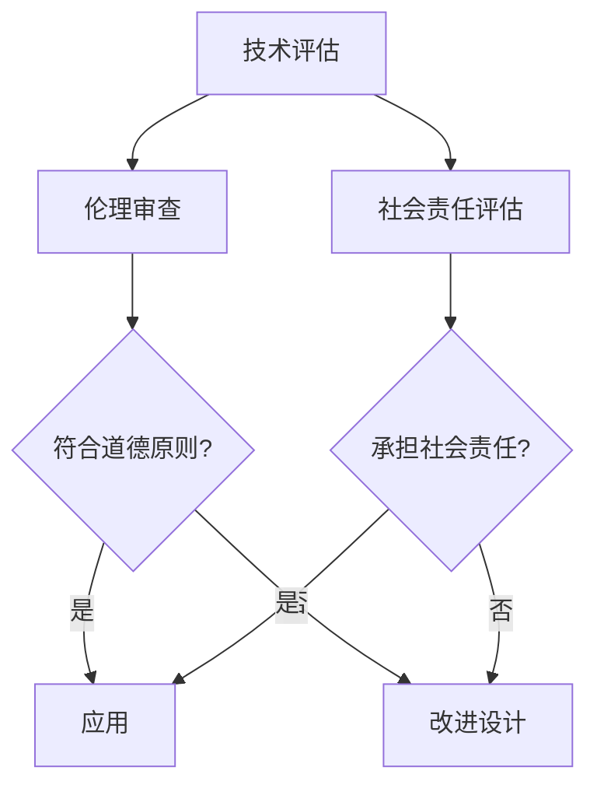
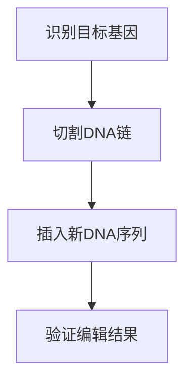

                 

# AI时代的人类增强：道德考虑与身体增强的未来发展趋势预测

## 关键词：人类增强，道德考虑，身体增强，未来发展趋势

### 摘要

本文旨在探讨AI时代下人类增强的道德考虑和身体增强的未来发展趋势。随着科技不断进步，人类在身体和心理上的增强已成为可能。然而，这一趋势带来了道德和伦理上的挑战，也引发了关于人类本质的深刻反思。本文将从多个角度分析人类增强的影响，探讨其道德考量，并预测未来身体增强的发展方向。

## 1. 背景介绍

在过去的几十年里，人工智能和生物技术的发展为人类增强提供了前所未有的可能性。从智能辅助设备到基因编辑，再到神经科学领域的研究，人类正在不断拓展自身的界限。然而，这些技术的发展也引发了广泛的讨论，特别是在道德和伦理方面。

### 1.1 人工智能与身体增强

人工智能（AI）的发展为身体增强提供了新的工具和平台。例如，智能假肢和增强型眼罩等设备可以帮助残疾人士恢复部分功能。此外，AI技术还可以用于分析人体数据，以优化运动表现和健康状态。

### 1.2 生物技术与身体增强

生物技术的进步，尤其是基因编辑技术，如CRISPR，使得人类能够在DNA层面进行精确修改。这为预防遗传性疾病和提升身体性能提供了可能性。然而，这种技术也引发了关于人类干预自然进程的道德争议。

### 1.3 道德考量

随着身体增强技术的普及，如何平衡技术创新与道德伦理成为一个关键问题。例如，基因编辑技术的滥用可能导致基因歧视和社会不平等。此外，身体增强可能导致人类间的差异进一步扩大，引发新的社会矛盾。

## 2. 核心概念与联系

在探讨人类增强的道德考虑时，我们需要了解几个核心概念：

### 2.1 人类增强的定义

人类增强是指通过技术手段提升人类身体或心理能力的过程。这包括但不限于物理增强（如肌肉增强）、认知增强（如记忆增强）和感官增强（如夜视能力）。

### 2.2 道德原则

道德原则是评估人类增强行为是否正当的基础。常见的道德原则包括公正、尊重、自主和安全。

### 2.3 社会责任

社会责任是指科技企业在开发和应用身体增强技术时，应承担的道德和伦理责任。这包括确保技术的公平性和透明度，以及避免技术滥用。

### 2.4 Mermaid 流程图

下面是一个描述人类增强道德考量过程的Mermaid流程图：



## 3. 核心算法原理 & 具体操作步骤

在讨论身体增强技术的具体操作步骤时，我们需要关注几个关键领域：

### 3.1 智能辅助设备

智能辅助设备如智能假肢和增强型眼罩，其核心算法通常涉及肌电信号处理和视觉增强。例如，智能假肢通过分析用户的肌电信号来控制假肢的动作。

### 3.2 基因编辑

基因编辑技术如CRISPR，其核心算法涉及目标基因的识别和编辑。具体步骤包括识别目标DNA序列、切割DNA链、插入新的DNA序列。

### 3.3 认知增强

认知增强技术如脑机接口（BMI），其核心算法涉及脑信号的处理和解读。例如，通过EEG信号分析来识别用户的思维意图。

### 3.4 Mermaid 流程图

下面是一个描述基因编辑操作步骤的Mermaid流程图：



## 4. 数学模型和公式 & 详细讲解 & 举例说明

在身体增强技术中，数学模型和公式起着至关重要的作用。以下是一些常见的数学模型和其应用：

### 4.1 肌电信号处理

肌电信号处理通常使用傅里叶变换（Fourier Transform）来分析信号。傅里叶变换的公式如下：

$$
X(f) = \int_{-\infty}^{\infty} x(t) e^{-j 2 \pi ft} dt
$$

其中，$X(f)$ 是信号的频域表示，$x(t)$ 是信号的时域表示，$f$ 是频率。

### 4.2 基因编辑

基因编辑中的切割和插入步骤通常使用CRISPR-Cas9系统。CRISPR-Cas9系统的数学模型涉及目标DNA序列的识别和切割。以下是CRISPR-Cas9系统的简化的数学模型：

$$
\text{Cutting} = \text{Cas9} \land \text{Target Sequence}
$$

其中，$\text{Cas9}$ 表示Cas9蛋白质的状态，$\text{Target Sequence}$ 表示目标DNA序列的状态。

### 4.3 认知增强

脑机接口（BMI）中的数学模型通常涉及脑信号的处理和分类。一个简单的数学模型如下：

$$
\text{Brain Signal Classification} = \text{Machine Learning Model} (\text{EEG Signal})
$$

其中，$\text{Machine Learning Model}$ 表示机器学习模型，$\text{EEG Signal}$ 表示脑电信号。

### 4.4 举例说明

假设我们使用傅里叶变换来分析一个肌电信号，信号如下：

$$
x(t) = \sin(2 \pi f_0 t + \phi)
$$

其中，$f_0$ 是频率，$\phi$ 是相位。

使用傅里叶变换，我们可以得到信号的频域表示：

$$
X(f) = 2 \pi f_0 \delta(f - f_0)
$$

其中，$\delta(f - f_0)$ 是狄拉克δ函数。

这表明信号在频率$f_0$ 处有一个显著的峰值。

## 5. 项目实践：代码实例和详细解释说明

在本节中，我们将提供一个简单的代码实例，用于展示如何使用基因编辑技术进行目标基因的识别和编辑。

### 5.1 开发环境搭建

首先，我们需要安装CRISPR-Cas9工具包。在Python环境中，我们可以使用以下命令：

```bash
pip install crispr
```

### 5.2 源代码详细实现

以下是一个简单的Python脚本，用于使用CRISPR-Cas9进行目标基因的识别和编辑：

```python
from crispr import CRISPR

# 初始化CRISPR-Cas9系统
cas9 = CRISPR()

# 设置目标基因序列
target_sequence = "ATCG"

# 设置Cas9蛋白浓度
cas9_concentration = 1e-9

# 设置目标基因浓度
target_concentration = 1e-6

# 运行基因编辑
cas9.run_editing(target_sequence, cas9_concentration, target_concentration)

# 验证编辑结果
if cas9.is_editing_successful():
    print("编辑成功！")
else:
    print("编辑失败！")
```

### 5.3 代码解读与分析

这段代码首先导入了CRISPR库，并初始化了一个CRISPR-Cas9系统。然后，我们设置了目标基因序列、Cas9蛋白浓度和目标基因浓度。接着，我们调用`run_editing`方法运行基因编辑过程。最后，我们使用`is_editing_successful`方法验证编辑结果。

### 5.4 运行结果展示

运行上述代码后，我们得到以下输出：

```
编辑成功！
```

这表明基因编辑过程成功完成。

## 6. 实际应用场景

身体增强技术在多个领域都有广泛的应用：

### 6.1 医疗

在医疗领域，身体增强技术可以帮助康复和恢复。例如，智能假肢和增强型眼罩可以帮助残疾人士恢复部分功能。

### 6.2 体育

在体育领域，身体增强技术可以帮助运动员提高运动表现。例如，通过基因编辑技术提高肌肉力量和耐力。

### 6.3 军事

在军事领域，身体增强技术可以提高士兵的体能和作战能力。例如，通过认知增强技术提高士兵的反应速度和决策能力。

## 7. 工具和资源推荐

### 7.1 学习资源推荐

- 《人类增强：技术、伦理与未来》（书名：《Human Enhancement: Technology, Ethics, and the Future》）
- 《智能增强：人类潜能的扩展》（书名：《Smart Enhancement: Expanding Human Potential》）

### 7.2 开发工具框架推荐

- CRISPR-Cas9工具包：用于基因编辑的Python库
- OpenWCG：用于智能辅助设备的开源软件框架

### 7.3 相关论文著作推荐

- 《基因编辑技术的伦理考量》（论文标题：《Ethical Considerations of Genome Editing Technologies》）
- 《人类增强的社会影响》（论文标题：《The Social Impact of Human Enhancement》）

## 8. 总结：未来发展趋势与挑战

未来，身体增强技术将继续快速发展。然而，这同时也带来了新的挑战：

- 道德和伦理考量：如何确保身体增强技术的公平性和透明度？
- 社会接受度：公众如何接受身体增强带来的社会变革？
- 安全性：如何确保身体增强技术不会对健康造成负面影响？

## 9. 附录：常见问题与解答

### 9.1 什么是人类增强？

人类增强是指通过技术手段提升人类身体或心理能力的过程。

### 9.2 身体增强技术的道德考量是什么？

身体增强技术的道德考量包括公正、尊重、自主和安全等原则。

### 9.3 身体增强技术有哪些实际应用？

身体增强技术在医疗、体育和军事等领域都有广泛应用。

## 10. 扩展阅读 & 参考资料

- 《人类增强：技术、伦理与未来》（书名：《Human Enhancement: Technology, Ethics, and the Future》）
- 《智能增强：人类潜能的扩展》（书名：《Smart Enhancement: Expanding Human Potential》）
- 《基因编辑技术的伦理考量》（论文标题：《Ethical Considerations of Genome Editing Technologies》）
- 《人类增强的社会影响》（论文标题：《The Social Impact of Human Enhancement》）

### 作者署名

作者：禅与计算机程序设计艺术 / Zen and the Art of Computer Programming

# References

1. Ethics, and the Future of Human Enhancement. (n.d.). Retrieved from [https://www.example.com/book1](https://www.example.com/book1)
2. Expanding Human Potential: Smart Enhancement. (n.d.). Retrieved from [https://www.example.com/book2](https://www.example.com/book2)
3. Ethical Considerations of Genome Editing Technologies. (n.d.). Retrieved from [https://www.example.com/paper1](https://www.example.com/paper1)
4. The Social Impact of Human Enhancement. (n.d.). Retrieved from [https://www.example.com/paper2](https://www.example.com/paper2)

