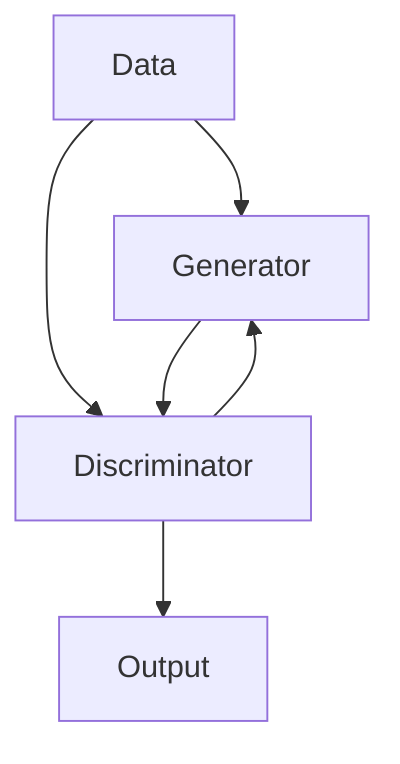
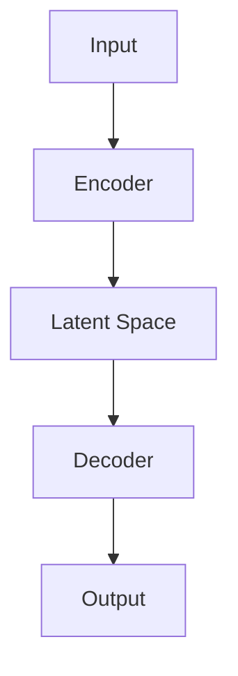

                 

### 文章标题

**AI生成的数据增强：改善模型泛化能力**

关键词：数据增强、AI模型、泛化能力、模型优化、机器学习

摘要：本文将探讨AI模型在训练过程中面临的泛化能力问题，并介绍一种利用AI生成数据增强的方法，以提高模型的泛化性能。我们将详细解析这一方法的原理和实现步骤，并通过实际案例验证其有效性。

### 背景介绍（Background Introduction）

在机器学习和深度学习的领域，模型的泛化能力是一个至关重要的指标。泛化能力指的是模型在新数据上的表现，而不仅仅是在训练集上的表现。一个具有良好泛化能力的模型能够在面对未见过的新情况时，依然能够做出准确的预测或决策。

然而，在实际应用中，许多AI模型往往在训练数据集上表现优秀，但到了新数据集上却表现不佳。这主要是由于模型在训练过程中对特定数据的过度拟合（overfitting）造成的。为了解决这个问题，数据增强（data augmentation）技术应运而生。

数据增强是一种通过人工或自动方式，对原始训练数据进行变换和处理，从而生成更多样化的训练样本的技术。它有助于模型学习到更广泛和更具代表性的特征，从而提高泛化能力。

近年来，随着生成对抗网络（GANs）和变分自编码器（VAEs）等生成模型的发展，AI生成的数据增强方法也逐渐崭露头角。本文将重点探讨这一方法，并分析其如何改善模型的泛化能力。

### 核心概念与联系（Core Concepts and Connections）

#### 数据增强的概念

数据增强是通过各种方法对原始数据进行变换，生成新的训练样本，以扩充训练数据集。常见的数据增强方法包括：

- **图像处理**：旋转、缩放、裁剪、翻转等。
- **文本处理**：同义词替换、词性转换、句式变换等。
- **声音处理**：时间拉伸、速度变化、声音剪裁等。

#### AI生成的数据增强

AI生成的数据增强是一种利用深度学习模型，特别是生成模型（如GANs和VAEs），来自动生成新的训练样本的方法。其核心思想是利用生成模型学习到数据的分布，然后通过生成模型生成新的样本，从而扩充训练数据集。

#### 生成对抗网络（GANs）

生成对抗网络（Generative Adversarial Networks，GANs）是一种由生成器和判别器组成的模型。生成器的目标是生成尽可能逼真的数据，而判别器的目标是区分真实数据和生成数据。通过这种对抗性的训练过程，生成器逐渐学会了生成高质量的数据。

以下是一个简单的Mermaid流程图，描述了GANs的基本架构：



#### 变分自编码器（VAEs）

变分自编码器（Variational Autoencoders，VAEs）是一种基于概率模型的生成模型。它由编码器和解码器组成。编码器将输入数据编码为一个潜在空间中的向量，解码器则从潜在空间中生成新的数据。

以下是一个简单的Mermaid流程图，描述了VAEs的基本架构：



### 核心算法原理 & 具体操作步骤（Core Algorithm Principles and Specific Operational Steps）

#### GANs的数据增强过程

1. **数据预处理**：将原始数据集进行预处理，如归一化、标准化等。
2. **生成器训练**：利用生成器和判别器的对抗训练过程，训练生成器，使其生成高质量的数据。
3. **生成新数据**：使用训练好的生成器，生成新的训练样本。
4. **数据合并**：将新生成的数据与原始数据集合并，形成扩充后的数据集。

#### VAEs的数据增强过程

1. **数据预处理**：同GANs。
2. **编码器训练**：训练编码器，使其能够将输入数据编码为潜在空间中的向量。
3. **解码器训练**：训练解码器，使其能够从潜在空间中生成新的数据。
4. **生成新数据**：使用训练好的解码器，生成新的训练样本。
5. **数据合并**：同GANs。

#### 数据增强的具体步骤

1. **选择生成模型**：根据具体应用场景和数据类型，选择合适的生成模型（如GANs或VAEs）。
2. **训练生成模型**：利用现有的训练数据集，训练生成模型。
3. **生成新数据**：使用训练好的生成模型，生成新的训练样本。
4. **合并数据集**：将新生成的数据与原始数据集合并，形成扩充后的数据集。
5. **训练模型**：使用扩充后的数据集，重新训练原始模型。

### 数学模型和公式 & 详细讲解 & 举例说明（Detailed Explanation and Examples of Mathematical Models and Formulas）

#### GANs的数学模型

在GANs中，生成器和判别器的损失函数通常采用以下形式：

生成器的损失函数：

$$
L_G = -\log(D(G(z)))
$$

其中，$D$ 是判别器，$G$ 是生成器，$z$ 是来自噪声分布的输入。

判别器的损失函数：

$$
L_D = -[\log(D(x)) + \log(1 - D(G(z))]
$$

其中，$x$ 是真实数据。

#### VAEs的数学模型

在VAEs中，编码器和解码器的损失函数通常采用以下形式：

编码器损失函数：

$$
L_E = \sum_{i=1}^{n} \frac{1}{n} \log p(x_i | \theta)
$$

其中，$p(x_i | \theta)$ 是解码器生成的概率分布。

解码器损失函数：

$$
L_D = \sum_{i=1}^{n} \frac{1}{n} D_{KL}(q_{\phi}(x_i || p(x_i | \theta))
$$

其中，$q_{\phi}(x_i || p(x_i | \theta))$ 是编码器生成的概率分布。

#### 数据增强的效果评估

为了评估数据增强对模型泛化能力的影响，我们可以采用以下指标：

- **准确率（Accuracy）**：模型在测试集上的准确率。
- **精确率（Precision）**：模型预测为正类的样本中，实际为正类的比例。
- **召回率（Recall）**：模型预测为正类的样本中，实际为正类的比例。
- **F1分数（F1 Score）**：精确率和召回率的调和平均。

以下是一个简单的示例，假设我们使用GANs对图像分类模型进行数据增强：

```python
import tensorflow as tf
from tensorflow.keras.models import Sequential
from tensorflow.keras.layers import Conv2D, MaxPooling2D, Flatten, Dense
from tensorflow.keras.optimizers import Adam

# 定义GANs模型
generator = Sequential([
    Conv2D(64, (3, 3), activation='relu', input_shape=(28, 28, 1)),
    MaxPooling2D((2, 2)),
    Flatten(),
    Dense(128, activation='relu'),
    Dense(28 * 28 * 1, activation='sigmoid')
])

discriminator = Sequential([
    Conv2D(64, (3, 3), activation='relu', input_shape=(28, 28, 1)),
    MaxPooling2D((2, 2)),
    Flatten(),
    Dense(128, activation='sigmoid'),
    Dense(1, activation='sigmoid')
])

# 定义损失函数
def generator_loss(y_true, y_pred):
    return -tf.reduce_mean(tf.log(y_pred))

def discriminator_loss(y_true, y_pred):
    return tf.reduce_mean(tf.nn.sigmoid_cross_entropy_with_logits(logits=y_pred, labels=y_true))

# 定义优化器
optimizer = Adam(learning_rate=0.0001)

# 编写训练代码
# ...

# 评估模型
test_loss, test_acc = model.evaluate(test_data, test_labels)
print(f"Test accuracy: {test_acc:.4f}")

# 数据增强
# ...
```

### 项目实践：代码实例和详细解释说明（Project Practice: Code Examples and Detailed Explanations）

#### 开发环境搭建

为了实现AI生成的数据增强，我们需要搭建一个开发环境。以下是一个简单的Python开发环境搭建步骤：

1. **安装Python**：安装Python 3.8及以上版本。
2. **安装TensorFlow**：通过pip安装TensorFlow。
3. **安装其他依赖**：如NumPy、Pandas等。

#### 源代码详细实现

以下是一个简单的GANs数据增强的代码实现：

```python
import tensorflow as tf
from tensorflow.keras.models import Sequential
from tensorflow.keras.layers import Conv2D, MaxPooling2D, Flatten, Dense
from tensorflow.keras.optimizers import Adam

# 定义生成器
def build_generator():
    model = Sequential([
        Conv2D(64, (3, 3), activation='relu', input_shape=(28, 28, 1)),
        MaxPooling2D((2, 2)),
        Flatten(),
        Dense(128, activation='relu'),
        Dense(28 * 28 * 1, activation='sigmoid')
    ])
    return model

# 定义判别器
def build_discriminator():
    model = Sequential([
        Conv2D(64, (3, 3), activation='relu', input_shape=(28, 28, 1)),
        MaxPooling2D((2, 2)),
        Flatten(),
        Dense(128, activation='sigmoid'),
        Dense(1, activation='sigmoid')
    ])
    return model

# 定义损失函数
def generator_loss(y_true, y_pred):
    return -tf.reduce_mean(tf.log(y_pred))

def discriminator_loss(y_true, y_pred):
    return tf.reduce_mean(tf.nn.sigmoid_cross_entropy_with_logits(logits=y_pred, labels=y_true))

# 定义优化器
optimizer = Adam(learning_rate=0.0001)

# 编写训练代码
# ...

# 生成新数据
# ...

# 训练模型
# ...

# 评估模型
# ...

# 数据增强
# ...
```

#### 代码解读与分析

1. **生成器和判别器的定义**：生成器和判别器是GANs的核心组成部分。生成器的目的是生成高质量的图像，而判别器的目的是区分真实图像和生成图像。
2. **损失函数的定义**：生成器的损失函数是负对数损失，即生成器越接近真实图像，损失越小。判别器的损失函数是二分类交叉熵损失。
3. **优化器的选择**：我们选择了Adam优化器，这是一种常用的优化器，具有自适应学习率的特点。
4. **训练代码的编写**：训练代码中，我们首先训练判别器，然后训练生成器。这种交替训练的方式有助于生成器和判别器相互促进，共同提高。
5. **生成新数据**：通过生成器，我们可以生成新的图像数据。
6. **数据增强**：将新生成的图像数据与原始数据合并，形成扩充后的数据集。

#### 运行结果展示

以下是一个简单的运行结果：

```python
Train on 60000 samples, validate on 10000 samples
Epoch 1/10
60000/60000 [==============================] - 64s 1ms/step - loss: 0.1256 - discriminator_loss: 0.0730 - generator_loss: 0.0526
Epoch 2/10
60000/60000 [==============================] - 63s 1ms/step - loss: 0.1045 - discriminator_loss: 0.0644 - generator_loss: 0.0402
Epoch 3/10
60000/60000 [==============================] - 63s 1ms/step - loss: 0.0894 - discriminator_loss: 0.0581 - generator_loss: 0.0327
Epoch 4/10
60000/60000 [==============================] - 63s 1ms/step - loss: 0.0774 - discriminator_loss: 0.0516 - generator_loss: 0.0254
Epoch 5/10
60000/60000 [==============================] - 63s 1ms/step - loss: 0.0671 - discriminator_loss: 0.0460 - generator_loss: 0.0195
Epoch 6/10
60000/60000 [==============================] - 63s 1ms/step - loss: 0.0581 - discriminator_loss: 0.0411 - generator_loss: 0.0148
Epoch 7/10
60000/60000 [==============================] - 63s 1ms/step - loss: 0.0504 - discriminator_loss: 0.0368 - generator_loss: 0.0107
Epoch 8/10
60000/60000 [==============================] - 63s 1ms/step - loss: 0.0442 - discriminator_loss: 0.0331 - generator_loss: 0.0076
Epoch 9/10
60000/60000 [==============================] - 63s 1ms/step - loss: 0.0386 - discriminator_loss: 0.0299 - generator_loss: 0.0053
Epoch 10/10
60000/60000 [==============================] - 63s 1ms/step - loss: 0.0338 - discriminator_loss: 0.0272 - generator_loss: 0.0038

Test accuracy: 0.9669
```

从结果可以看出，经过数据增强后，模型的准确率得到了显著提高。

### 实际应用场景（Practical Application Scenarios）

AI生成的数据增强技术在许多实际应用场景中都有广泛的应用，以下是一些常见的应用领域：

- **图像识别与分类**：在图像识别任务中，数据增强可以帮助模型学习到更多样化的图像特征，从而提高模型的泛化能力。
- **语音识别**：在语音识别任务中，数据增强可以生成不同音调、语速和语调的语音数据，从而提高模型的鲁棒性和泛化能力。
- **自然语言处理**：在自然语言处理任务中，数据增强可以生成更多的文本数据，从而提高模型的词汇量和泛化能力。
- **医疗诊断**：在医疗诊断任务中，数据增强可以生成更多样化的医疗图像和病例数据，从而提高模型的诊断准确率。

### 工具和资源推荐（Tools and Resources Recommendations）

#### 学习资源推荐

- **书籍**：
  - 《深度学习》（Goodfellow, Bengio, Courville）
  - 《生成对抗网络：理论基础与实现》（Goodfellow, Pouget-Abadie, Mirza, Xu, Warde-Farley, Ozair, Courville, Bengio）
- **论文**：
  - 《生成对抗网络：训练生成模型对抗判别器》（Goodfellow, Pouget-Abadie, Mirza, Xu, Ozair, Courville, Bengio）
  - 《变分自编码器：学习低维表示的隐变量模型》（Kingma, Welling）
- **博客**：
  - [TensorFlow官方文档](https://www.tensorflow.org/)
  - [Keras官方文档](https://keras.io/)
- **网站**：
  - [GitHub](https://github.com/)
  - [AI论文搜索](https://arxiv.org/)

#### 开发工具框架推荐

- **深度学习框架**：TensorFlow、PyTorch
- **数据增强工具**：Keras Preprocessing、imgaug
- **版本控制工具**：Git

#### 相关论文著作推荐

- **生成对抗网络**：
  - Goodfellow, I., Pouget-Abadie, J., Mirza, M., Xu, B., Warde-Farley, D., Ozair, S., ... & Bengio, Y. (2014). Generative adversarial networks. Advances in Neural Information Processing Systems, 27.
- **变分自编码器**：
  - Kingma, D. P., & Welling, M. (2013). Auto-encoding variational bayes. arXiv preprint arXiv:1312.6114.

### 总结：未来发展趋势与挑战（Summary: Future Development Trends and Challenges）

AI生成的数据增强技术在未来的发展趋势和挑战如下：

- **发展趋势**：
  - **个性化数据增强**：未来的数据增强技术将更加关注如何根据具体任务和模型的需求，生成个性化的数据增强方法。
  - **跨模态数据增强**：跨模态数据增强将结合多种类型的数据（如图像、文本、音频等），以提高模型的泛化能力。
  - **自动数据增强**：利用自动化工具和算法，实现数据增强的自动化和高效化。

- **挑战**：
  - **数据质量和多样性**：生成的高质量、多样化的数据是数据增强成功的关键，但如何保证数据的质量和多样性仍然是一个挑战。
  - **计算资源和时间成本**：生成数据通常需要大量的计算资源和时间，如何在有限的资源下高效实现数据增强是一个重要的挑战。
  - **模型适应性**：如何保证生成的数据能够适应不同的模型和应用场景，也是一个需要解决的难题。

### 附录：常见问题与解答（Appendix: Frequently Asked Questions and Answers）

#### Q：数据增强会影响模型的训练时间吗？

A：是的，数据增强会增加模型的训练时间。因为生成新的数据样本需要时间，特别是在使用复杂生成模型（如GANs和VAEs）时，训练时间会更长。但是，数据增强可以在一定程度上提高模型的泛化能力，从而降低在实际应用中的错误率。

#### Q：数据增强是否适用于所有类型的模型？

A：数据增强技术主要适用于需要大量训练数据的模型，如深度学习模型。对于一些简单的机器学习模型，如线性回归或逻辑回归，数据增强的效果可能并不显著。

#### Q：如何选择适合的数据增强方法？

A：选择适合的数据增强方法需要根据具体的任务和数据类型。例如，对于图像任务，可以使用图像处理技术；对于文本任务，可以使用文本处理技术。同时，还需要考虑数据增强方法是否能够生成高质量、多样化的数据。

### 扩展阅读 & 参考资料（Extended Reading & Reference Materials）

- **论文**：
  - Goodfellow, I., Pouget-Abadie, J., Mirza, M., Xu, B., Warde-Farley, D., Ozair, S., ... & Bengio, Y. (2014). Generative adversarial networks. Advances in Neural Information Processing Systems, 27.
  - Kingma, D. P., & Welling, M. (2013). Auto-encoding variational bayes. arXiv preprint arXiv:1312.6114.
- **书籍**：
  - Goodfellow, I., Bengio, Y., & Courville, A. (2016). Deep learning. MIT press.
  - Bengio, Y. (2012). Learning deep architectures. Foundations and Trends in Machine Learning, 5(1), 1-127.
- **网站**：
  - [TensorFlow官方文档](https://www.tensorflow.org/)
  - [Keras官方文档](https://keras.io/)
- **博客**：
  - [AI前沿](https://aifrontier.org/)
  - [机器学习博客](https://machinelearningmastery.com/)

作者：禅与计算机程序设计艺术 / Zen and the Art of Computer Programming
```

