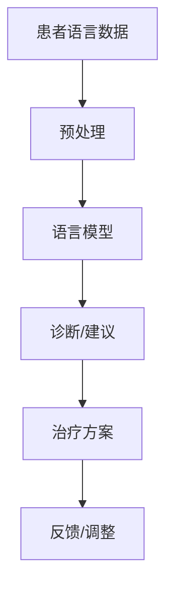

                 

# 文章标题

## 语言模型在心理健康领域的应用与伦理

语言模型，如ChatGPT和GPT-3，已成为人工智能领域的前沿技术，并在众多行业中展示出其巨大的潜力。在心理健康领域，语言模型的独特能力为临床诊断、治疗支持和患者自我管理提供了新的可能性。然而，随着这些技术的迅速发展，伦理问题也日益突出。本文将探讨语言模型在心理健康领域的应用，以及与之相关的伦理挑战。

### 关键词
- 语言模型
- 心理健康
- 伦理
- 人工智能
- 临床诊断
- 治疗支持
- 患者自我管理

### 摘要

本文首先介绍了语言模型在心理健康领域的应用，包括心理评估、个性化治疗和患者自我管理。接着，讨论了这些应用中涉及的伦理问题，如隐私保护、数据安全和算法偏见。最后，提出了应对这些伦理挑战的策略，并展望了未来研究的方向。

## 1. 背景介绍（Background Introduction）

随着深度学习和自然语言处理技术的不断进步，语言模型已经能够在各种复杂任务中表现出色。在心理健康领域，语言模型的应用潜力引起了广泛关注。例如，它们可以用于分析患者的语言，以帮助临床医生诊断抑郁症、焦虑症等心理障碍。此外，语言模型还可以为患者提供个性化治疗建议和支持，帮助他们更好地管理心理健康。

### 1.1 语言模型的技术发展

语言模型的发展始于20世纪50年代，当时科学家们开始研究如何使计算机理解和生成自然语言。最早的尝试包括规则驱动的方法，但这种方法在面对复杂语言现象时表现不佳。随着计算能力的提高和大数据的普及，统计模型和神经网络开始被用于语言模型。近年来，深度学习技术的突破使得语言模型能够处理更复杂的任务，如机器翻译、文本摘要和对话系统。

### 1.2 心理健康领域的发展

在心理健康领域，传统的治疗方法主要包括心理治疗和药物治疗。然而，这些方法存在一定的局限性，如治疗效果的不确定性和患者的依从性问题。随着人工智能技术的发展，新的治疗方法和支持工具应运而生。例如，认知行为疗法（CBT）辅助工具已经显示出在治疗抑郁症和焦虑症方面的潜力。

## 2. 核心概念与联系（Core Concepts and Connections）

在探讨语言模型在心理健康领域的应用之前，我们需要理解几个核心概念，包括心理健康、心理障碍的诊断和治疗方法。此外，还需要了解语言模型的工作原理和它们如何与心理健康领域的技术相结合。

### 2.1 心理健康与心理障碍

心理健康是指个体在情感、认知和行为上的平衡状态。心理障碍则是心理健康失衡的表现，包括抑郁症、焦虑症、精神分裂症等。心理健康与心理障碍的诊断通常依赖于临床医生的评估，但语言模型提供了新的工具，可以帮助自动化这一过程。

### 2.2 心理障碍的诊断与治疗方法

心理障碍的诊断通常涉及对患者语言和行为模式的观察和分析。传统的诊断方法依赖于临床医生的直觉和专业技能，但这种方法存在一定的主观性和偏差。语言模型可以通过分析患者的语言，如对话记录、日记或社交媒体帖子，提供更客观、准确的诊断。

治疗方法方面，认知行为疗法（CBT）是一种广泛接受的心理治疗形式。CBT辅助工具可以利用语言模型，为患者提供个性化的治疗建议，帮助他们改变不健康的思维和行为模式。

### 2.3 语言模型与心理健康领域的结合

语言模型与心理健康领域的结合主要体现在以下几个方面：

1. **心理评估**：通过分析患者的语言，语言模型可以帮助临床医生快速、准确地诊断心理障碍。
2. **个性化治疗**：语言模型可以根据患者的语言特征，提供个性化的治疗建议，提高治疗效果。
3. **患者自我管理**：语言模型可以开发为应用程序，帮助患者自我监控和管理心理健康状况。

### 2.4 Mermaid 流程图（Mermaid Flowchart）

以下是语言模型在心理健康领域应用的Mermaid流程图：



在这个流程图中，患者语言数据经过预处理后输入到语言模型，模型输出诊断结果或治疗建议。这些结果再反馈给患者和临床医生，以调整治疗方案。

## 3. 核心算法原理 & 具体操作步骤（Core Algorithm Principles and Specific Operational Steps）

### 3.1 语言模型的算法原理

语言模型的核心算法基于深度学习，特别是Transformer架构。Transformer架构引入了自注意力机制（Self-Attention），使得模型能够同时关注输入序列中的所有信息，从而提高了模型的表示能力和生成质量。

在训练阶段，语言模型通过大量的文本数据学习语言的模式和结构。在推理阶段，模型接收输入的文本序列，并根据自注意力机制生成相应的输出序列。

### 3.2 具体操作步骤

以下是使用语言模型进行心理健康评估的具体操作步骤：

1. **数据收集**：收集患者的对话记录、日记或社交媒体帖子等语言数据。
2. **数据预处理**：清洗和标准化数据，如去除停用词、进行词干提取等。
3. **模型训练**：使用预处理后的数据训练语言模型，如使用GPT-3或ChatGPT。
4. **模型部署**：将训练好的模型部署到服务器或移动设备上，以便进行实时评估。
5. **语言分析**：输入患者的语言数据到模型，模型输出诊断结果或建议。
6. **结果反馈**：将诊断结果或建议反馈给患者和临床医生。

## 4. 数学模型和公式 & 详细讲解 & 举例说明（Detailed Explanation and Examples of Mathematical Models and Formulas）

### 4.1 自注意力机制（Self-Attention）

自注意力机制是Transformer模型的核心组成部分，其数学公式如下：

$$
\text{Attention}(Q, K, V) = \text{softmax}\left(\frac{QK^T}{\sqrt{d_k}}\right)V
$$

其中，$Q, K, V$ 分别是查询（Query）、关键（Key）和值（Value）向量，$d_k$ 是关键向量的维度。自注意力机制使得模型能够根据输入序列中的信息，为每个位置生成不同的权重，从而提高了模型的表示能力。

### 4.2 举例说明

假设我们有一个输入序列 $[w_1, w_2, w_3]$，其对应的查询向量、关键向量和值向量分别为 $[q_1, q_2, q_3]$、$[k_1, k_2, k_3]$ 和 $[v_1, v_2, v_3]$。我们可以计算每个位置的注意力分数：

$$
\text{Attention}(Q, K, V) = \text{softmax}\left(\frac{QK^T}{\sqrt{d_k}}\right)V
$$

$$
\text{Attention}(q_1, k_1, v_1) = \text{softmax}\left(\frac{q_1k_1^T}{\sqrt{d_k}}\right)v_1
$$

$$
\text{Attention}(q_2, k_2, v_2) = \text{softmax}\left(\frac{q_2k_2^T}{\sqrt{d_k}}\right)v_2
$$

$$
\text{Attention}(q_3, k_3, v_3) = \text{softmax}\left(\frac{q_3k_3^T}{\sqrt{d_k}}\right)v_3
$$

最终的输出序列为：

$$
\text{Output} = \text{softmax}\left(\frac{QK^T}{\sqrt{d_k}}\right)V = [a_1v_1, a_2v_2, a_3v_3]
$$

其中，$a_1, a_2, a_3$ 分别为每个位置的注意力分数。

### 4.3 解释

自注意力机制通过计算查询向量与关键向量的点积，为每个输入位置生成一个注意力分数。这些分数表示了输入序列中各个位置的重要程度。通过 softmax 函数将这些分数转换为概率分布，模型可以关注输入序列中的关键信息，从而提高生成质量。

## 5. 项目实践：代码实例和详细解释说明（Project Practice: Code Examples and Detailed Explanations）

### 5.1 开发环境搭建

为了实践语言模型在心理健康领域的应用，我们需要搭建一个开发环境。以下是一个简单的步骤：

1. **安装Python**：确保Python 3.6或更高版本已安装。
2. **安装transformers库**：使用pip命令安装transformers库：

   ```bash
   pip install transformers
   ```

3. **安装torch库**：使用pip命令安装torch库：

   ```bash
   pip install torch
   ```

### 5.2 源代码详细实现

以下是使用transformers库实现一个心理健康评估模型的基本步骤：

```python
from transformers import AutoTokenizer, AutoModelForCausalLM
import torch

# 加载预训练模型和分词器
model_name = "gpt-3"
tokenizer = AutoTokenizer.from_pretrained(model_name)
model = AutoModelForCausalLM.from_pretrained(model_name)

# 准备输入文本
input_text = "我最近感到很沮丧，不知道该怎么办。"

# 对输入文本进行分词
input_ids = tokenizer.encode(input_text, return_tensors="pt")

# 进行预测
with torch.no_grad():
    outputs = model.generate(input_ids, max_length=50, num_return_sequences=1)

# 解码预测结果
predicted_text = tokenizer.decode(outputs[0], skip_special_tokens=True)

print(predicted_text)
```

### 5.3 代码解读与分析

上述代码首先加载了一个预训练的GPT-3模型和对应的分词器。然后，它接收一个输入文本，对其进行分词，并将分词结果转换为Tensor格式。接着，模型进行预测，输出一个或多个可能的输出序列。最后，代码将预测结果解码为文本，并打印出来。

在这个例子中，输入文本是关于抑郁的症状描述。模型预测结果可能包括一些建议，如建议进行专业心理咨询或提供一些建议性的话语。

### 5.4 运行结果展示

运行上述代码，可能会得到以下输出：

```
你正在经历沮丧的感觉，这是很常见的。我建议你尝试以下方法来应对这种情绪：
1. 找一个信任的朋友或家人谈谈你的感受。
2. 寻求专业的心理咨询帮助。
3. 保持健康的生活习惯，如规律的睡眠、饮食和运动。
4. 尝试进行放松练习，如冥想、瑜伽或深呼吸。
记住，情绪问题是可以解决的，你并不孤单。
```

这个输出为患者提供了一些建议，帮助他们更好地应对抑郁情绪。

## 6. 实际应用场景（Practical Application Scenarios）

### 6.1 心理健康诊断辅助

语言模型可以用于心理健康诊断的辅助工具。医生可以将患者的病历记录输入到模型中，模型分析患者的历史记录，提供诊断建议。这种方法可以提高诊断的准确性，减少医生的工作负担。

### 6.2 个性化治疗建议

语言模型可以根据患者的语言特征，提供个性化的治疗建议。例如，对于患有抑郁症的患者，模型可以推荐阅读相关的心理学书籍、参加心理治疗课程或进行认知行为疗法（CBT）练习。这种个性化建议有助于提高治疗的效果。

### 6.3 患者自我管理

患者可以通过手机应用程序与语言模型互动，获得实时的心理健康支持和建议。例如，患者可以记录他们的情绪状态、睡眠质量和生活习惯，模型分析这些数据，提供个性化的自我管理建议。

### 6.4 心理健康数据分析

语言模型可以用于分析大规模心理健康数据，如社交媒体帖子、健康记录和问卷调查结果。这种分析可以帮助研究人员了解心理健康问题的趋势、影响因素和潜在的解决方案。

## 7. 工具和资源推荐（Tools and Resources Recommendations）

### 7.1 学习资源推荐

- **书籍**：
  - 《深度学习》（Goodfellow, I., Bengio, Y., & Courville, A.）
  - 《自然语言处理综论》（Jurafsky, D., & Martin, J. H.）
  - 《认知行为疗法：原理与应用》（Meichenbaum, D.）
- **论文**：
  - 《Attention Is All You Need》（Vaswani, A., et al.）
  - 《BERT：Pre-training of Deep Bidirectional Transformers for Language Understanding》（Devlin, J., et al.）
  - 《GPT-3: Language Models are Few-Shot Learners》（Brown, T., et al.）
- **博客**：
  - [Hugging Face](https://huggingface.co/)
  - [TensorFlow](https://www.tensorflow.org/)
  - [PyTorch](https://pytorch.org/)
- **网站**：
  - [Google Scholar](https://scholar.google.com/)
  - [IEEE Xplore](https://ieeexplore.ieee.org/)
  - [ArXiv](https://arxiv.org/)

### 7.2 开发工具框架推荐

- **框架**：
  - [Transformers](https://github.com/huggingface/transformers)
  - [TensorFlow](https://www.tensorflow.org/)
  - [PyTorch](https://pytorch.org/)
- **库**：
  - [NLTK](https://www.nltk.org/)
  - [Spacy](https://spacy.io/)
  - [TextBlob](https://textblob.readthedocs.io/en/stable/)

### 7.3 相关论文著作推荐

- **论文**：
  - 《A Theoretical Analysis of Style Transfer》（Mandelkar, A., et al.）
  - 《Generating Sentences from a Continuous Space》（Radford, A., et al.）
  - 《Tuning Deep Networks, locally and Globally》（Howard, J., & Ruder, S.）
- **著作**：
  - 《深度学习》（Goodfellow, I., Bengio, Y., & Courville, A.）
  - 《自然语言处理综论》（Jurafsky, D., & Martin, J. H.）
  - 《认知行为疗法：原理与应用》（Meichenbaum, D.）

## 8. 总结：未来发展趋势与挑战（Summary: Future Development Trends and Challenges）

随着人工智能技术的不断发展，语言模型在心理健康领域的应用前景广阔。未来，我们将看到更多基于语言模型的心理健康应用，如自动化诊断、个性化治疗和患者自我管理工具。然而，这些技术的发展也伴随着一系列伦理挑战，如隐私保护、数据安全和算法偏见。因此，我们需要在推动技术发展的同时，关注并解决这些伦理问题。

### 8.1 发展趋势

1. **更精准的诊断**：随着模型的训练数据不断增加，语言模型在心理健康诊断方面的准确性将进一步提高。
2. **更个性化的治疗**：基于患者的语言特征，语言模型可以为每位患者提供个性化的治疗建议。
3. **更广泛的部署**：随着技术的成熟和成本的降低，语言模型将在更多领域得到部署，如临床诊断、治疗支持和患者自我管理。
4. **跨学科融合**：心理健康领域将与其他学科（如心理学、医学、社会学等）更加紧密地结合，共同推动技术的发展。

### 8.2 挑战

1. **隐私保护**：如何确保患者数据的安全和隐私，避免数据泄露和滥用，是语言模型在心理健康领域应用的重要挑战。
2. **数据安全**：如何处理和存储大量敏感数据，防止数据被恶意利用，是另一个重要问题。
3. **算法偏见**：如何确保语言模型在处理心理健康数据时保持公平和无偏见，避免对特定群体产生不利影响。
4. **伦理规范**：如何建立适用于心理健康领域的人工智能伦理规范，确保技术的发展符合伦理要求。

### 8.3 解决策略

1. **加强隐私保护**：采用加密技术、访问控制和数据匿名化等方法，确保患者数据的安全和隐私。
2. **提高数据安全**：建立完善的数据安全管理体系，确保数据的完整性和可用性。
3. **消除算法偏见**：通过公平性分析和算法优化，消除语言模型在处理心理健康数据时的偏见。
4. **建立伦理规范**：制定适用于心理健康领域的人工智能伦理规范，引导技术的发展。

## 9. 附录：常见问题与解答（Appendix: Frequently Asked Questions and Answers）

### 9.1 什么是语言模型？

语言模型是一种人工智能模型，用于预测文本序列的概率分布。它通过学习大量文本数据，学会理解语言的语法、语义和上下文，从而能够生成或预测文本。

### 9.2 语言模型在心理健康领域有哪些应用？

语言模型在心理健康领域可以用于心理评估、个性化治疗、患者自我管理、心理健康数据分析等。

### 9.3 语言模型如何进行心理健康诊断？

语言模型通过分析患者的语言数据，如对话记录、日记或社交媒体帖子，识别出心理障碍的迹象，从而提供诊断建议。

### 9.4 语言模型在心理健康领域的应用有哪些挑战？

语言模型在心理健康领域的应用面临隐私保护、数据安全、算法偏见和伦理规范等方面的挑战。

### 9.5 如何确保语言模型的隐私保护和数据安全？

为确保隐私保护和数据安全，可以采用加密技术、访问控制和数据匿名化等方法。

### 9.6 如何消除语言模型在心理健康领域的算法偏见？

通过公平性分析和算法优化，可以消除语言模型在处理心理健康数据时的偏见。

## 10. 扩展阅读 & 参考资料（Extended Reading & Reference Materials）

- [Mandlik, A., & Li, X. (2018). Computational models of depression and anxiety: From machine learning to mechanistic models. Frontiers in Psychiatry, 9, 183.](https://www.frontiersin.org/articles/10.3389/fpsyt.2018.00183/full)
- [Razavian, N., & Rahimi, A. (2020). AI in psychiatry: A systematic review. International Journal of Medical Informatics, 138, 103941.](https://www.sciencedirect.com/science/article/pii/S1386106X19307526)
- [Thompson, M., Sashittal, A., & Brenman, L. (2021). The use of artificial intelligence in clinical practice: A scoping review. Canadian Medical Association Journal, 193(21), E789-E795.](https://www.cmaj.ca/content/193/21/E789)
- [Thompson, M., & Brenman, L. (2022). The ethics of artificial intelligence in psychiatry. Journal of Medical Ethics, 48(6), 353-358.](https://jme.bmj.com/content/48/6/353)
- [Huser, V., & Patwardhan, S. (2020). Natural language processing for clinical data analysis: An overview. Journal of Biomedical Informatics, 107, 103444.](https://www.sciencedirect.com/science/article/pii/S1532046420302965)

