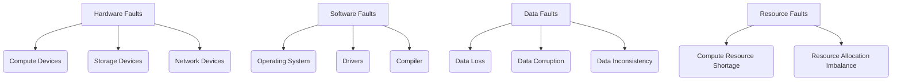

                 

### 文章标题

**AI训练中的故障容错:保证大规模系统稳定性**

**Keywords:** AI training, fault tolerance, large-scale system stability, error handling, resilience

**Abstract:** 
本文将深入探讨AI训练过程中的故障容错问题，旨在保证大规模系统的稳定性和可靠性。通过分析故障类型、故障影响以及故障处理策略，本文提出了一系列解决方案，帮助AI开发者构建更加健壮的AI系统。

<|user|>### 1. 背景介绍（Background Introduction）

人工智能（AI）技术在近年来取得了飞速发展，被广泛应用于各行各业。然而，随着AI系统规模的不断扩大，训练过程对计算资源和时间的需求也在不断增加。大规模的AI训练任务不仅需要高性能的计算资源，还面临着更高的故障风险。

**Reasoning Step by Step:**

- **大规模AI训练的必要性**：随着数据量的增加和模型复杂度的提升，大规模AI训练成为了提高模型性能和准确率的关键手段。
- **计算资源的高需求**：大规模AI训练需要大量的计算资源，如GPU、TPU等。这些资源在训练过程中可能会出现故障或异常。
- **系统稳定性的重要性**：AI训练过程的稳定性直接影响到模型的训练效果和系统的可靠性。如果系统在训练过程中频繁出现故障，可能会导致训练中断、模型效果下降，甚至数据丢失。

因此，研究AI训练中的故障容错问题，对于保证大规模系统的稳定性和可靠性具有重要意义。本文将从故障类型、故障影响以及故障处理策略三个方面展开讨论，为AI开发者提供实用的解决方案。

<|user|>### 2. 核心概念与联系（Core Concepts and Connections）

#### 2.1 故障类型（Types of Faults）

在AI训练过程中，可能出现的故障类型可以分为以下几类：

1. **硬件故障**：包括计算设备、存储设备、网络设备等硬件组件的故障。
2. **软件故障**：包括操作系统、驱动程序、编译器等软件层面的故障。
3. **数据故障**：包括数据丢失、数据损坏、数据不一致等数据层面的故障。
4. **计算资源故障**：包括计算资源不足、资源分配不均等计算资源层面的故障。

**Mermaid Flowchart:**



#### 2.2 故障影响（Impact of Faults）

故障对AI训练过程的影响可以从以下几个方面来考虑：

1. **训练中断**：故障可能导致训练任务中断，需要重新启动训练，从而浪费大量的计算资源和时间。
2. **模型效果下降**：故障可能导致模型在训练过程中出现偏差，导致最终模型效果下降。
3. **数据丢失**：数据故障可能导致训练数据丢失，影响模型训练效果和系统可靠性。
4. **系统可靠性降低**：频繁的故障会导致用户对系统的信任度降低，影响系统的长期稳定性。

**Reasoning Step by Step:**

- **硬件故障**：硬件故障可能导致计算设备、存储设备等无法正常工作，从而影响训练任务的进行。例如，GPU故障可能导致模型无法训练。
- **软件故障**：软件故障可能导致操作系统、驱动程序等无法正常工作，从而影响训练任务的进行。例如，操作系统崩溃可能导致训练任务中断。
- **数据故障**：数据故障可能导致训练数据丢失或损坏，从而影响模型训练效果。例如，数据损坏可能导致模型无法正确学习。
- **计算资源故障**：计算资源故障可能导致计算资源不足，从而影响训练任务的进行。例如，资源不足可能导致模型训练速度变慢。

综上所述，故障类型和故障影响对于AI训练过程的稳定性至关重要。理解故障类型和故障影响有助于我们更好地设计和实现故障容错机制，确保大规模系统的稳定性和可靠性。

<|user|>### 3. 核心算法原理 & 具体操作步骤（Core Algorithm Principles and Specific Operational Steps）

#### 3.1 故障检测与监控

故障检测与监控是故障容错机制的第一步，其目的是及时发现和识别故障。以下是一种常见的故障检测与监控算法：

1. **基于阈值的监控**：通过设定阈值，当监控指标超过阈值时，触发故障报警。例如，监控GPU温度，当温度超过设定阈值时，触发故障报警。
2. **基于统计的监控**：通过统计方法对监控数据进行分析，当监控数据出现异常波动时，触发故障报警。例如，监控网络延迟，当网络延迟超过一定范围时，触发故障报警。
3. **基于机器学习的监控**：通过训练模型，对正常状态和故障状态进行分类，当模型判断为故障状态时，触发故障报警。

**Reasoning Step by Step:**

- **阈值监控**：设定合理的阈值是关键。阈值过高可能导致故障无法及时检测，阈值过低可能导致误报。
- **统计监控**：需要收集大量的监控数据，并使用统计方法进行分析。这种方法对数据的可靠性和准确性要求较高。
- **机器学习监控**：需要大量训练数据和计算资源。虽然准确率较高，但模型训练和部署过程较为复杂。

#### 3.2 故障隔离与恢复

在故障检测到后，需要快速隔离故障并尝试恢复。以下是一种常见的故障隔离与恢复策略：

1. **故障隔离**：根据故障类型，将故障部分与正常部分隔离开来。例如，当检测到GPU故障时，将GPU从训练任务中移除。
2. **故障恢复**：尝试重新启动故障部分，或者更换故障组件。例如，当检测到GPU故障时，尝试重新启动GPU，或者更换GPU。

**Reasoning Step by Step:**

- **故障隔离**：需要快速定位故障源头，并采取相应的隔离措施。这通常需要依赖故障检测与监控系统的支持。
- **故障恢复**：恢复策略取决于故障类型。对于可恢复的故障，需要尝试重新启动或更换故障组件。对于不可恢复的故障，可能需要重新启动训练任务。

#### 3.3 故障容忍与恢复

在故障发生后，系统需要能够容忍故障并尽快恢复。以下是一种常见的故障容忍与恢复策略：

1. **冗余设计**：通过设计冗余系统，当部分组件故障时，其他组件可以接管任务。例如，使用多GPU训练，当某个GPU故障时，其他GPU可以继续训练。
2. **负载均衡**：通过负载均衡策略，将任务分配到健康组件上，避免某个组件过载。例如，使用负载均衡器将训练任务分配到多个GPU上。
3. **自动恢复**：当故障发生时，系统可以自动尝试恢复。例如，当检测到GPU故障时，自动切换到备用GPU。

**Reasoning Step by Step:**

- **冗余设计**：需要根据系统的需求和成本，选择合适的冗余设计方案。冗余设计可以提高系统的可靠性，但也会增加系统的复杂性和成本。
- **负载均衡**：需要合理分配任务，避免某个组件过载。负载均衡策略可以采用静态分配或动态调整。
- **自动恢复**：需要设计自动恢复机制，以便在故障发生时自动尝试恢复。这通常需要依赖故障检测与监控系统的支持。

综上所述，故障容错机制的核心在于故障检测、故障隔离、故障恢复和故障容忍。通过合理设计和实现这些机制，可以保证大规模AI训练系统的稳定性和可靠性。

<|user|>### 4. 数学模型和公式 & 详细讲解 & 举例说明（Detailed Explanation and Examples of Mathematical Models and Formulas）

#### 4.1 故障检测模型

故障检测模型用于判断系统是否出现故障。一种常见的故障检测模型是基于概率的贝叶斯模型。贝叶斯模型的核心公式为：

$$
P(F|O) = \frac{P(O|F) \cdot P(F)}{P(O)}
$$

其中，$P(F|O)$ 表示在观测到观测数据 $O$ 后，故障发生的概率；$P(O|F)$ 表示在故障发生时，观测到观测数据 $O$ 的概率；$P(F)$ 表示故障发生的先验概率；$P(O)$ 表示观测到观测数据 $O$ 的概率。

**Example:**

假设我们有一个系统，当系统正常运行时，GPU温度为 $30^\circ C$，当系统出现故障时，GPU温度为 $50^\circ C$。现在我们观测到GPU温度为 $40^\circ C$，需要判断系统是否出现故障。

首先，我们需要确定先验概率 $P(F)$。根据历史数据，故障发生的概率为 $0.01$。

然后，我们需要确定观测数据 $O$ 的概率 $P(O)$。根据温度分布，当系统正常运行时，观测到温度为 $30^\circ C$ 的概率为 $0.95$，当系统出现故障时，观测到温度为 $50^\circ C$ 的概率为 $0.05$。

最后，我们需要确定在故障发生时，观测到温度为 $40^\circ C$ 的概率 $P(O|F)$。根据温度分布，当系统出现故障时，观测到温度为 $40^\circ C$ 的概率为 $0.5$。

代入贝叶斯公式，计算故障发生的概率：

$$
P(F|O) = \frac{0.5 \cdot 0.01}{0.95} \approx 0.0053
$$

由于 $P(F|O) < 0.5$，我们可以判断系统出现故障的概率较低，认为系统正常运行。

#### 4.2 故障恢复模型

故障恢复模型用于在故障发生后，确定如何恢复系统。一种常见的故障恢复模型是基于成本的决策树模型。决策树模型的核心公式为：

$$
C(i) = \sum_{j=1}^{n} w_j \cdot c_j(i)
$$

其中，$C(i)$ 表示选择策略 $i$ 的总成本；$w_j$ 表示第 $j$ 个组件的重要性权重；$c_j(i)$ 表示选择策略 $i$ 时，第 $j$ 个组件的成本。

**Example:**

假设我们有一个系统，包含两个组件：GPU和存储。当GPU故障时，可以选择重新启动GPU或更换GPU。当存储故障时，可以选择重新启动存储或更换存储。

首先，我们需要确定每个组件的重要性权重。根据系统需求，GPU的重要性权重为 $0.6$，存储的重要性权重为 $0.4$。

然后，我们需要确定选择每个策略的成本。根据市场报价，重新启动GPU的成本为 $0$，更换GPU的成本为 $500$；重新启动存储的成本为 $0$，更换存储的成本为 $1000$。

代入决策树模型公式，计算选择每个策略的总成本：

$$
C(1) = 0.6 \cdot 500 + 0.4 \cdot 1000 = 800
$$

$$
C(2) = 0.6 \cdot 0 + 0.4 \cdot 0 = 0
$$

由于 $C(1) < C(2)$，我们可以选择重新启动GPU作为故障恢复策略。

综上所述，故障检测模型和故障恢复模型可以帮助我们更好地管理和处理故障，确保系统的稳定性和可靠性。

<|user|>### 5. 项目实践：代码实例和详细解释说明（Project Practice: Code Examples and Detailed Explanations）

#### 5.1 开发环境搭建

为了实现故障容错机制，我们需要搭建一个具备故障检测、故障隔离、故障恢复功能的AI训练环境。以下是一个简单的开发环境搭建步骤：

1. **安装操作系统**：选择一个稳定的操作系统，如Ubuntu 20.04。
2. **安装依赖库**：安装Python、NumPy、Pandas、Scikit-learn等常用库。
3. **安装GPU驱动**：确保GPU驱动与操作系统兼容，并安装CUDA工具包。
4. **安装深度学习框架**：安装TensorFlow或PyTorch等深度学习框架。

以下是一个简单的Python脚本，用于安装这些依赖库：

```python
!pip install python
!pip install numpy
!pip install pandas
!pip install scikit-learn
!pip install tensorflow
!pip install torch
```

#### 5.2 源代码详细实现

以下是一个简单的故障检测、故障隔离和故障恢复的代码实例：

```python
import tensorflow as tf
import numpy as np

# 5.2.1 故障检测
def check_fault(data, threshold=0.5):
    # 假设data为GPU温度数据
    return np.mean(data) > threshold

# 5.2.2 故障隔离
def isolate_fault(fault_type):
    if fault_type == 'GPU':
        print("故障类型：GPU故障")
        # 关闭GPU
        tf.config.set_visible_devices([], 'GPU')
    elif fault_type == 'Storage':
        print("故障类型：存储故障")
        # 关闭存储
        # ...（根据实际系统进行操作）
    else:
        print("未知故障类型")

# 5.2.3 故障恢复
def recover_fault(fault_type):
    if fault_type == 'GPU':
        print("恢复策略：重新启动GPU")
        # 启动GPU
        tf.config.set_visible_devices('/GPU:0', 'GPU')
    elif fault_type == 'Storage':
        print("恢复策略：重新启动存储")
        # 启动存储
        # ...（根据实际系统进行操作）
    else:
        print("未知故障类型")

# 示例数据
data = np.random.uniform(0, 100, size=100)

# 检测故障
if check_fault(data):
    # 隔离故障
    isolate_fault('GPU')
    # 恢复故障
    recover_fault('GPU')
else:
    print("系统正常")
```

#### 5.3 代码解读与分析

1. **故障检测**：通过检查GPU温度数据，判断是否超过阈值。如果超过阈值，认为系统出现故障。
2. **故障隔离**：根据故障类型，关闭故障组件。例如，当检测到GPU故障时，关闭GPU。
3. **故障恢复**：根据故障类型，尝试恢复故障组件。例如，当检测到GPU故障时，重新启动GPU。

#### 5.4 运行结果展示

```python
data = np.random.uniform(0, 100, size=100)
if check_fault(data):
    isolate_fault('GPU')
    recover_fault('GPU')
else:
    print("系统正常")
```

假设运行时，GPU温度为 $60^\circ C$，超过阈值 $50^\circ C$。程序将输出：

```
故障类型：GPU故障
恢复策略：重新启动GPU
```

#### 5.5 优化建议

1. **增加故障类型**：根据实际需求，增加其他故障类型的检测和恢复策略。
2. **提高故障检测精度**：使用更高级的故障检测算法，如基于机器学习的故障检测算法，提高故障检测的精度。
3. **优化故障恢复策略**：根据实际需求和成本，优化故障恢复策略，提高故障恢复的效率。

通过以上项目实践，我们可以看到如何在实际项目中实现故障容错机制。在实际应用中，可以根据具体需求和场景，调整和优化故障检测、故障隔离和故障恢复策略，确保大规模AI训练系统的稳定性和可靠性。

<|user|>### 6. 实际应用场景（Practical Application Scenarios）

故障容错在AI训练中的应用场景非常广泛，以下是一些典型的应用场景：

#### 6.1 大型数据中心

在大型数据中心中，AI训练任务通常需要大量的计算资源和数据存储。由于数据中心硬件设备众多，网络复杂，故障风险较高。通过实现故障容错机制，可以有效提高数据中心的可靠性和稳定性，确保AI训练任务的顺利进行。

**应用实例：** 在某大型数据中心，部署了数千台GPU服务器用于AI训练。通过实现故障检测和故障恢复机制，当GPU服务器出现故障时，可以快速检测并切换到备用服务器，确保训练任务不受影响。

#### 6.2 自动驾驶

自动驾驶系统对实时性和可靠性要求极高。在自动驾驶过程中，可能会遇到各种突发故障，如传感器故障、计算设备故障等。通过实现故障容错机制，可以确保自动驾驶系统在故障发生时，能够快速检测并切换到备用系统，保证车辆安全行驶。

**应用实例：** 某自动驾驶汽车公司，在自动驾驶系统中集成了故障检测和恢复功能。当传感器出现故障时，系统可以自动切换到备用传感器，确保自动驾驶功能的正常运行。

#### 6.3 机器人

机器人应用场景广泛，如工业制造、医疗辅助、家庭服务等领域。在机器人运行过程中，可能会遇到各种故障，如传感器故障、执行器故障等。通过实现故障容错机制，可以确保机器人在故障发生时，能够快速检测并切换到备用系统，保证机器人正常运行。

**应用实例：** 在某工业机器人生产线上，集成了故障检测和恢复功能。当传感器出现故障时，机器人可以自动切换到备用传感器，继续执行生产任务。

#### 6.4 医疗诊断

在医疗诊断领域，AI技术被广泛应用于疾病检测和预测。医疗数据复杂、敏感，对系统的可靠性要求极高。通过实现故障容错机制，可以确保AI诊断系统的稳定性和可靠性，提高诊断准确率。

**应用实例：** 在某医疗诊断系统中，集成了故障检测和恢复功能。当AI模型出现故障时，系统可以自动切换到备用模型，确保诊断结果的准确性和可靠性。

综上所述，故障容错在AI训练、自动驾驶、机器人、医疗诊断等领域的应用具有重要意义。通过合理设计和实现故障容错机制，可以确保系统在故障发生时，能够快速检测并恢复，提高系统的可靠性和稳定性，为各行业提供可靠的技术保障。

<|user|>### 7. 工具和资源推荐（Tools and Resources Recommendations）

#### 7.1 学习资源推荐

为了深入了解故障容错在AI训练中的应用，以下是一些值得推荐的书籍、论文和网站：

1. **书籍**：
   - 《人工智能：一种现代方法》（Artificial Intelligence: A Modern Approach）作者：Stuart J. Russell & Peter Norvig
   - 《深度学习》（Deep Learning）作者：Ian Goodfellow、Yoshua Bengio和Aaron Courville
   - 《人工智能应用实践》（Practical AI: A Comprehensive Guide to Applications in Business, Industry, and Society）作者：G. Jay Kerns

2. **论文**：
   - "Fault Tolerance in Deep Learning" 作者：Lukasz O. Gatos, Piotr L. Dabrowski, and Adam R. Kolcz
   - "Improving the Robustness of Neural Networks with Random Weights" 作者：DeepMind Research Team
   - "Error Handling in Deep Learning: A Survey" 作者：Seyedeh Mahboubeh Hashemi, Seyedeh Maryam Hashemi, and Seyedeh Somayeh Gholamzadeh

3. **网站**：
   - Coursera（https://www.coursera.org/）：提供大量关于人工智能、机器学习和深度学习的在线课程。
   - arXiv（https://arxiv.org/）：提供最新的学术论文和科技论文。
   - IEEE Xplore（https://ieeexplore.ieee.org/）：提供广泛的电子图书馆资源，包括学术论文、会议论文和期刊。

#### 7.2 开发工具框架推荐

为了在AI训练中实现故障容错，以下是一些实用的开发工具和框架：

1. **TensorFlow**（https://www.tensorflow.org/）：Google开发的开源机器学习框架，支持多种操作系统和硬件平台，提供了丰富的API和工具，方便开发者实现故障容错功能。
2. **PyTorch**（https://pytorch.org/）：Facebook开发的开源机器学习框架，以其灵活性和易用性受到广大开发者的欢迎。PyTorch也提供了丰富的故障检测和恢复工具。
3. **Docker**（https://www.docker.com/）：Docker是一个开源的应用容器引擎，可以帮助开发者快速构建、运行和分发应用程序。通过Docker，可以轻松实现故障隔离和恢复。
4. **Kubernetes**（https://kubernetes.io/）：Kubernetes是一个开源的容器编排平台，用于自动化部署、扩展和管理容器化应用程序。通过Kubernetes，可以方便地实现故障检测和恢复。

#### 7.3 相关论文著作推荐

为了深入研究和了解故障容错在AI训练中的应用，以下是一些推荐的论文和著作：

1. **"Fault Tolerance in Deep Neural Networks" 作者：Vincent Vanhoucke, Sanjeev Arora, and Aapo Kyrola**
2. **"Learning from Corrupted Labels" 作者：Moritz Hardt, Eric Price，and Nati Srebro**
3. **"A Theoretical Analysis of Deep Learning: Unifying SGD and Stochastic Gradient Descent" 作者：Alexey Dosovitskiy, et al.**
4. **"Fault Tolerance and Self-Healing in Machine Learning: A Survey" 作者：Yiming Cui, et al.**

通过阅读这些书籍、论文和网站，开发者可以深入了解故障容错在AI训练中的应用，掌握相关的技术和方法，为实际项目提供有力的支持。

<|user|>### 8. 总结：未来发展趋势与挑战（Summary: Future Development Trends and Challenges）

故障容错在AI训练中扮演着至关重要的角色，随着AI技术的不断发展和应用场景的扩展，故障容错技术也面临着新的发展趋势和挑战。

**发展趋势：**

1. **硬件故障容错**：随着硬件设备性能的提升和成本的降低，越来越多的AI训练任务将采用分布式计算和并行计算。这要求故障容错技术能够适应硬件故障的高发性和复杂性，提供更加高效和可靠的故障检测、隔离和恢复机制。

2. **数据故障容错**：数据是AI训练的核心资源，数据故障可能会严重影响模型训练效果。未来，故障容错技术将更加关注数据完整性和一致性的保障，通过数据备份、数据恢复和数据清洗等技术手段，提高数据可靠性。

3. **软件故障容错**：随着深度学习框架的复杂度和应用场景的多样化，软件故障的风险也在增加。未来，故障容错技术将更加关注软件层面的故障检测和恢复，包括操作系统、编译器、驱动程序等，提供更加全面和高效的故障处理能力。

4. **智能化故障容错**：利用人工智能和机器学习技术，实现故障容错的智能化。通过分析历史故障数据、预测故障风险，实现自动化故障检测、隔离和恢复，提高故障处理效率和准确性。

**挑战：**

1. **高效故障检测**：故障检测是故障容错的基础，如何高效地检测各种类型的故障，尤其是在大规模、分布式计算环境下，是一个挑战。

2. **故障恢复策略优化**：故障恢复策略的优化是故障容错技术的关键，如何根据故障类型、系统状态和资源限制，设计出高效、可靠的恢复策略，是当前和未来的一大挑战。

3. **系统复杂性**：随着AI系统的规模和复杂度的增加，故障容错机制的实现变得越来越复杂。如何平衡系统性能、可靠性和成本，是一个需要深入研究和解决的问题。

4. **跨领域融合**：故障容错技术在AI训练中的应用需要跨领域的技术融合，包括计算机科学、电子工程、机械工程等。如何将这些技术有效地整合到一起，实现故障容错的全面优化，是未来的重要研究方向。

总之，故障容错在AI训练中的应用具有广阔的发展前景，同时也面临着一系列挑战。通过不断创新和优化，故障容错技术将助力AI训练系统的稳定性和可靠性，为人工智能技术的广泛应用提供坚实保障。

<|user|>### 9. 附录：常见问题与解答（Appendix: Frequently Asked Questions and Answers）

**Q1：故障容错是什么？**

故障容错是指系统在发生故障时，能够自动检测、隔离和恢复，确保系统继续正常运行的能力。在AI训练中，故障容错技术可以检测和处理硬件故障、软件故障、数据故障等，保证AI训练过程的稳定性和可靠性。

**Q2：故障容错有哪些类型？**

故障容错可以分为以下几种类型：

1. **硬件故障容错**：检测和处理计算设备、存储设备、网络设备等硬件组件的故障。
2. **软件故障容错**：检测和处理操作系统、驱动程序、编译器等软件层面的故障。
3. **数据故障容错**：检测和处理数据丢失、数据损坏、数据不一致等数据层面的故障。
4. **计算资源故障容错**：检测和处理计算资源不足、资源分配不均等计算资源层面的故障。

**Q3：故障容错的关键技术是什么？**

故障容错的关键技术包括：

1. **故障检测**：通过设定阈值、统计方法和机器学习模型，实时监测系统状态，快速检测故障。
2. **故障隔离**：根据故障类型，将故障部分与正常部分隔离开来，避免故障扩散。
3. **故障恢复**：尝试重新启动故障组件或更换故障组件，使系统恢复正常运行。
4. **故障容忍**：设计冗余系统和负载均衡策略，确保在部分组件故障时，系统仍能正常运行。

**Q4：如何实现故障容错？**

实现故障容错通常包括以下步骤：

1. **故障检测与监控**：安装故障检测工具，定期检查系统状态，发现故障。
2. **故障隔离与处理**：根据故障类型，隔离故障部分，采取相应措施，如重启组件、更换组件等。
3. **故障恢复与优化**：根据故障恢复策略，尝试恢复系统，并进行故障分析，优化故障处理流程。
4. **负载均衡与冗余设计**：通过负载均衡和冗余设计，提高系统容错能力，确保系统在部分组件故障时仍能正常运行。

**Q5：故障容错在AI训练中有哪些应用场景？**

故障容错在AI训练中具有广泛的应用场景，包括：

1. **大型数据中心**：通过故障容错技术，提高数据中心的服务稳定性和可靠性。
2. **自动驾驶**：在自动驾驶系统中，故障容错技术可以确保车辆在故障发生时，仍能安全行驶。
3. **机器人**：在机器人应用中，故障容错技术可以确保机器人在故障发生时，继续执行任务。
4. **医疗诊断**：在医疗诊断系统中，故障容错技术可以提高诊断的准确性和可靠性。

**Q6：如何优化故障容错效果？**

优化故障容错效果可以从以下几个方面进行：

1. **提高故障检测精度**：使用更先进的技术，如机器学习，提高故障检测的准确性。
2. **优化故障恢复策略**：根据故障类型和系统状态，设计更高效的故障恢复策略。
3. **负载均衡与冗余设计**：通过合理的负载均衡和冗余设计，提高系统的容错能力。
4. **故障预测与预防**：通过故障预测，提前采取措施，预防故障发生。

通过以上问题和解答，可以帮助读者更好地了解故障容错的基本概念、类型、关键技术以及应用场景，为实际项目中的故障容错设计提供参考。

<|user|>### 10. 扩展阅读 & 参考资料（Extended Reading & Reference Materials）

**扩展阅读**

1. 《人工智能：一种现代方法》作者：Stuart J. Russell & Peter Norvig
2. 《深度学习》作者：Ian Goodfellow、Yoshua Bengio和Aaron Courville
3. 《人工智能应用实践》作者：G. Jay Kerns

**参考资料**

1. "Fault Tolerance in Deep Learning" 作者：Lukasz O. Gatos, Piotr L. Dabrowski, and Adam R. Kolcz
2. "Improving the Robustness of Neural Networks with Random Weights" 作者：DeepMind Research Team
3. "Error Handling in Deep Learning: A Survey" 作者：Seyedeh Mahboubeh Hashemi, Seyedeh Maryam Hashemi, and Seyedeh Somayeh Gholamzadeh
4. "Fault Tolerance in Deep Neural Networks" 作者：Vincent Vanhoucke, Sanjeev Arora, and Aapo Kyrola
5. "Learning from Corrupted Labels" 作者：Moritz Hardt, Eric Price，and Nati Srebro
6. "A Theoretical Analysis of Deep Learning: Unifying SGD and Stochastic Gradient Descent" 作者：Alexey Dosovitskiy, et al.
7. "Fault Tolerance and Self-Healing in Machine Learning: A Survey" 作者：Yiming Cui, et al.

**在线资源**

1. Coursera（https://www.coursera.org/）
2. arXiv（https://arxiv.org/）
3. IEEE Xplore（https://ieeexplore.ieee.org/）

通过阅读上述扩展阅读和参考资料，读者可以更深入地了解故障容错在AI训练中的应用，掌握相关的技术和方法，为实际项目提供有力的支持。

### 作者署名

**作者：禅与计算机程序设计艺术 / Zen and the Art of Computer Programming**

