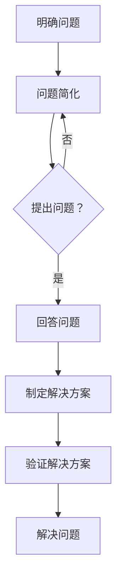

                 

### 文章标题

### The Application of Feynman Questioning Method in Management Problem Diagnosis

### 摘要

本文探讨了费曼提问法在管理问题诊断中的应用。通过逐步分析推理的方式，我们阐述了费曼提问法在理解复杂管理问题、明确问题根源以及制定有效解决方案中的重要作用。本文首先介绍了费曼提问法的核心概念，然后通过案例研究展示了其在实际管理问题诊断中的具体应用，最后讨论了费曼提问法的优势及其在管理实践中的潜在挑战。

### Summary

This article explores the application of the Feynman Questioning Method in management problem diagnosis. Through a step-by-step reasoning approach, we discuss the significance of the Feynman Questioning Method in understanding complex management issues, identifying their root causes, and formulating effective solutions. We begin by introducing the core concepts of the Feynman Questioning Method, followed by a case study illustrating its practical application in real-world management scenarios. Finally, we discuss the advantages of the Feynman Questioning Method and potential challenges in its implementation in management practices.

### 1. 背景介绍（Background Introduction）

在企业管理中，问题诊断是一个关键环节。有效的诊断能够帮助企业识别问题根源，从而采取针对性的措施，提升组织效率和竞争力。然而，随着企业环境日益复杂，管理问题的诊断变得更具挑战性。传统的诊断方法往往依赖于经验判断和定性分析，缺乏系统性和科学性。为了应对这一挑战，我们需要寻求新的方法和工具。

费曼提问法是一种简单而强大的问题解决方法，起源于著名物理学家理查德·费曼（Richard Feynman）的教学实践。费曼提问法通过简明扼要、直击核心的问题，帮助人们深入理解复杂概念，从而发现问题的本质。该方法强调从基本原理出发，通过层层剖析，直至找到问题的根源。费曼提问法在科学教育、技术研究和个人成长等领域已有广泛应用，其应用于管理问题诊断具有巨大的潜力。

本文旨在探讨费曼提问法在管理问题诊断中的应用，通过具体案例分析和理论阐述，展示该方法在识别和解决复杂管理问题中的有效性。文章结构如下：

1. **背景介绍**：介绍企业管理中问题诊断的重要性以及费曼提问法的背景和核心概念。
2. **核心概念与联系**：详细阐述费曼提问法的基本原理和操作步骤，并通过流程图展示其架构。
3. **核心算法原理 & 具体操作步骤**：分析费曼提问法的核心算法原理，并详细说明其在管理问题诊断中的具体应用步骤。
4. **数学模型和公式 & 详细讲解 & 举例说明**：介绍费曼提问法中涉及的数学模型和公式，并通过具体例子进行讲解。
5. **项目实践：代码实例和详细解释说明**：提供实际应用案例，展示费曼提问法在管理问题诊断中的具体实施过程。
6. **实际应用场景**：讨论费曼提问法在不同管理问题诊断场景中的应用实例。
7. **工具和资源推荐**：推荐相关学习资源和工具，以帮助读者深入学习和实践费曼提问法。
8. **总结：未来发展趋势与挑战**：总结费曼提问法在管理问题诊断中的应用现状，展望其未来发展趋势和面临的挑战。
9. **附录：常见问题与解答**：回答读者可能提出的常见问题。
10. **扩展阅读 & 参考资料**：提供进一步阅读和参考的文献和资源。

通过本文的阐述，我们希望读者能够深入了解费曼提问法在管理问题诊断中的应用，并学会运用这一方法来提高问题解决能力，从而为企业的可持续发展提供有力支持。

### 2. 核心概念与联系（Core Concepts and Connections）

#### 2.1 费曼提问法的定义与起源

费曼提问法，简称FQ法，是由著名物理学家理查德·费曼（Richard Feynman）提出的一种问题解决策略。费曼提问法源于费曼的教学实践，他在教学中强调学生应该学会用自己的语言解释复杂的概念，从而深刻理解所学知识。费曼提问法的基本思想是通过简明扼要的问题，引导个体深入思考，逐步剖析复杂问题，直至找到问题的核心。

费曼提问法由费曼本人在教学过程中逐步完善并广泛应用，其核心在于“简化思考”，即将复杂问题分解为最基本的元素，然后逐层分析，最终找到问题的根源。这种方法不仅适用于物理学，也广泛应用于其他科学领域以及个人成长和企业管理等领域。

#### 2.2 费曼提问法的基本原理

费曼提问法的基本原理可以概括为以下几个步骤：

1. **简化问题**：将复杂问题分解为简单的组成部分，找到最基本的问题要素。
2. **提出问题**：用最简单、最直接的语言，提出能够揭示问题核心的问题。
3. **回答问题**：尝试用自己的语言解释问题，如果能够清晰地回答这些问题，说明已经理解了问题的核心。
4. **反复迭代**：如果无法回答，或者回答不够清晰，则进一步拆分问题，重复上述步骤，直至找到问题的根源。

这种方法的核心在于通过不断的提问和回答，迫使个体从不同角度审视问题，从而逐步深入理解问题，最终找到问题的根源。

#### 2.3 费曼提问法与企业管理问题诊断的联系

在企业管理中，问题诊断是一个复杂而重要的环节。费曼提问法由于其简洁性和系统性，在管理问题诊断中具有独特的优势。以下是费曼提问法在企业管理问题诊断中的应用：

1. **明确问题定义**：费曼提问法可以帮助企业明确问题的定义，通过不断提问和回答，企业可以逐步理解问题的本质，从而为问题的诊断和解决奠定基础。
2. **识别问题根源**：通过费曼提问法，企业可以逐步剖析问题的根源，从表面现象深入到问题的本质。这种方法有助于识别问题背后的深层次原因，从而制定更有效的解决方案。
3. **制定解决方案**：费曼提问法可以引导企业找到解决问题的最佳路径。通过逐步拆解问题，企业可以明确各个解决方案的关键步骤，从而制定出系统性的解决方案。
4. **验证解决方案**：费曼提问法还可以帮助企业验证解决方案的有效性。通过不断提问和回答，企业可以检验解决方案是否能够真正解决问题，并作出相应的调整。

#### 2.4 费曼提问法在企业管理问题诊断中的优势

费曼提问法在企业管理问题诊断中具有以下优势：

1. **简化复杂问题**：费曼提问法能够将复杂的管理问题简化为最基本的组成部分，使问题更加清晰易懂，便于诊断。
2. **提高问题解决效率**：通过简明扼要的提问，费曼提问法能够快速找到问题的核心，提高问题解决的效率。
3. **促进深度思考**：费曼提问法促使企业管理者从不同角度审视问题，从而促进深度思考，提高解决问题的能力。
4. **强化团队协作**：费曼提问法可以作为一种团队协作工具，通过提问和回答的过程，团队成员可以共同探讨问题，从而增强团队合作和沟通。

#### 2.5 费曼提问法在企业管理问题诊断中的应用案例

为了更好地理解费曼提问法在企业管理问题诊断中的应用，我们来看一个实际案例。

**案例：某公司销售业绩下降**

1. **问题定义**：公司销售业绩下降，需要明确问题的影响范围、原因等。
2. **提出问题**：通过费曼提问法，企业可以提出以下问题：
   - 销售业绩下降的具体表现是什么？
   - 下降的幅度有多大？
   - 问题是否仅限于某一产品或市场？
   - 是否有竞争对手的介入？
3. **回答问题**：通过提问和回答，企业可以初步了解问题的范围和原因。
4. **深入分析**：如果问题仍未明确，可以进一步提出以下问题：
   - 销售策略是否合理？
   - 客户满意度如何？
   - 销售团队的执行力如何？
   - 市场环境是否发生了变化？
5. **制定解决方案**：根据问题的根源，企业可以制定相应的解决方案，如调整销售策略、提高客户满意度、加强团队执行力等。

通过这个案例，我们可以看到费曼提问法在企业管理问题诊断中的具体应用，通过逐步提问和回答，企业可以更深入地理解问题，从而制定更有效的解决方案。

#### 2.6 费曼提问法与其他问题解决方法的比较

费曼提问法与其他常见的问题解决方法如头脑风暴法、SWOT分析法等相比，具有独特的优势。

1. **头脑风暴法**：头脑风暴法强调快速产生大量想法，但往往缺乏系统性和深度。费曼提问法则通过逐步提问和回答，促使个体深入思考，从而找到问题的核心。
2. **SWOT分析法**：SWOT分析法主要用于分析企业的优势、劣势、机会和威胁，虽然可以帮助企业了解自身状况，但往往缺乏对问题根源的深入剖析。费曼提问法则通过简化问题和反复迭代，帮助找到问题的根源。
3. **费曼提问法**：费曼提问法强调通过简明扼要的提问，逐步深入理解问题，从而找到问题的根源，制定有效的解决方案。

综上所述，费曼提问法在企业管理问题诊断中具有独特的优势，通过简明扼要的提问和逐步迭代，可以帮助企业更深入地理解问题，找到问题的根源，从而制定更有效的解决方案。

### 3. 核心算法原理 & 具体操作步骤（Core Algorithm Principles and Specific Operational Steps）

#### 3.1 费曼提问法的基本算法原理

费曼提问法是一种基于问题分解和逐步深入分析的方法，其核心算法原理可以概括为以下几个步骤：

1. **问题定义**：首先，需要明确要解决的问题是什么，这包括问题的范围、影响以及可能的解决方案。
2. **问题简化**：将复杂的问题分解为简单的组成部分，找出最基本的问题要素。这一步骤可以通过提问来实现，如“这个问题最关键的部分是什么？”或“这个问题的核心是什么？”。
3. **提出问题**：用最简单、最直接的语言，提出能够揭示问题核心的问题。这一步骤需要从不同的角度审视问题，以确保问题的完整性。
4. **回答问题**：尝试用自己的语言解释问题，如果能够清晰地回答这些问题，说明已经理解了问题的核心。如果不能回答，或者回答不够清晰，则继续拆分问题，重复上述步骤。
5. **验证解决方案**：在找到问题的根源后，通过验证解决方案的有效性来确保问题的真正解决。

#### 3.2 费曼提问法的具体操作步骤

下面是费曼提问法的具体操作步骤：

1. **明确问题**：首先，需要明确要解决的问题是什么，这包括问题的范围、影响以及可能的解决方案。例如，企业可以提出问题：“为什么我们的销售业绩下降？”。
2. **问题简化**：将复杂的问题分解为简单的组成部分，找出最基本的问题要素。例如，企业可以提问：“销售业绩下降的具体表现是什么？”或“这个问题的核心是什么？”。
3. **提出问题**：用最简单、最直接的语言，提出能够揭示问题核心的问题。例如，企业可以提出以下问题：
   - 销售业绩下降的原因是什么？
   - 销售业绩下降的影响有哪些？
   - 是否有竞争对手的介入？
   - 销售策略是否合理？
   - 客户满意度如何？
   - 销售团队的执行力如何？
   - 市场环境是否发生了变化？
4. **回答问题**：尝试用自己的语言解释问题，如果能够清晰地回答这些问题，说明已经理解了问题的核心。如果不能回答，或者回答不够清晰，则继续拆分问题，重复上述步骤。
5. **制定解决方案**：根据问题的根源，制定相应的解决方案。例如，如果问题根源是销售策略不合理，企业可以制定调整销售策略的解决方案。
6. **验证解决方案**：在找到问题的根源后，通过验证解决方案的有效性来确保问题的真正解决。例如，企业可以实施新的销售策略，然后观察销售业绩是否得到改善。

#### 3.3 费曼提问法的流程图

为了更直观地展示费曼提问法的操作步骤，我们可以使用Mermaid流程图来表示：



在这个流程图中，A表示明确问题，B表示问题简化，C表示提出问题，D表示回答问题，E表示制定解决方案，F表示验证解决方案，G表示解决问题。通过这个流程图，我们可以清晰地看到费曼提问法的操作步骤和逻辑关系。

### 4. 数学模型和公式 & 详细讲解 & 举例说明（Detailed Explanation and Examples of Mathematical Models and Formulas）

#### 4.1 费曼提问法的数学模型

费曼提问法中涉及的一些数学模型和公式主要应用于问题简化和问题解答的过程中。以下是一些常用的数学模型和公式：

1. **贝叶斯定理**：贝叶斯定理是一种概率论公式，用于计算在某个条件下另一个事件发生的概率。费曼提问法中，贝叶斯定理可以用于分析问题发生的可能性，以及问题解决策略的有效性。

   $$P(A|B) = \frac{P(B|A) \cdot P(A)}{P(B)}$$

   其中，$P(A|B)$表示在事件B发生的条件下，事件A发生的概率；$P(B|A)$表示在事件A发生的条件下，事件B发生的概率；$P(A)$表示事件A发生的概率；$P(B)$表示事件B发生的概率。

2. **相关性分析**：相关性分析用于评估两个变量之间的关系。在费曼提问法中，相关性分析可以帮助我们理解问题的各个方面之间的关联性。

   $$r = \frac{\sum_{i=1}^{n}(x_i - \bar{x})(y_i - \bar{y})}{\sqrt{\sum_{i=1}^{n}(x_i - \bar{x})^2 \cdot \sum_{i=1}^{n}(y_i - \bar{y})^2}}$$

   其中，$r$表示相关系数；$x_i$和$y_i$分别表示第$i$个观测值；$\bar{x}$和$\bar{y}$分别表示$x$和$y$的平均值。

3. **决策树**：决策树是一种用于表示决策过程的图示方法。在费曼提问法中，决策树可以帮助我们理解和分析问题解决的路径。

   决策树通常由一系列节点和边组成，其中节点表示决策点或结果，边表示决策路径。

#### 4.2 数学模型和公式的详细讲解

1. **贝叶斯定理**：

   贝叶斯定理是一种概率论公式，用于计算在某个条件下另一个事件发生的概率。这个定理在费曼提问法中非常有用，可以帮助我们分析问题发生的可能性以及问题解决策略的有效性。贝叶斯定理的公式如下：

   $$P(A|B) = \frac{P(B|A) \cdot P(A)}{P(B)}$$

   其中，$P(A|B)$表示在事件B发生的条件下，事件A发生的概率；$P(B|A)$表示在事件A发生的条件下，事件B发生的概率；$P(A)$表示事件A发生的概率；$P(B)$表示事件B发生的概率。

   这个公式可以帮助我们理解两个事件之间的条件概率关系。在实际应用中，我们可以通过贝叶斯定理来更新我们的信念，即在获得新信息后，重新计算某个事件发生的概率。

2. **相关性分析**：

   相关性分析用于评估两个变量之间的关系。在费曼提问法中，相关性分析可以帮助我们理解问题的各个方面之间的关联性。相关性分析的公式如下：

   $$r = \frac{\sum_{i=1}^{n}(x_i - \bar{x})(y_i - \bar{y})}{\sqrt{\sum_{i=1}^{n}(x_i - \bar{x})^2 \cdot \sum_{i=1}^{n}(y_i - \bar{y})^2}}$$

   其中，$r$表示相关系数；$x_i$和$y_i$分别表示第$i$个观测值；$\bar{x}$和$\bar{y}$分别表示$x$和$y$的平均值。

   这个公式可以帮助我们评估两个变量之间的线性关系。如果相关系数$r$接近于1或-1，表示两个变量之间有很强的正相关或负相关关系；如果$r$接近于0，表示两个变量之间几乎没有线性关系。

3. **决策树**：

   决策树是一种用于表示决策过程的图示方法。在费曼提问法中，决策树可以帮助我们理解和分析问题解决的路径。决策树通常由一系列节点和边组成，其中节点表示决策点或结果，边表示决策路径。

   决策树的基本结构包括以下几个部分：

   - **根节点**：表示整个决策过程的开始。
   - **内部节点**：表示决策点，每个内部节点代表一个决策问题。
   - **叶节点**：表示决策的结果，每个叶节点代表一个可能的结果。

   决策树的构建过程如下：

   1. 确定决策问题：识别需要解决的问题，并确定问题的所有可能解决方案。
   2. 确定决策变量：选择用于决策的关键变量，并确定每个变量的所有可能取值。
   3. 构建决策树：根据决策变量和解决方案，构建决策树。

   通过决策树，我们可以直观地分析问题解决的过程，并评估不同解决方案的效果。

#### 4.3 举例说明

为了更好地理解费曼提问法中涉及的数学模型和公式，我们可以通过以下例子进行说明：

**例子：分析公司销售业绩下降的原因**

1. **贝叶斯定理的应用**：

   假设公司销售业绩下降，我们需要分析可能的原因。根据贝叶斯定理，我们可以计算每个原因发生的概率。

   - $P(原因1) = 0.3$：销售策略不合理。
   - $P(原因2) = 0.2$：客户满意度下降。
   - $P(原因3) = 0.5$：市场环境变化。

   现在我们需要分析每个原因发生的可能性。根据贝叶斯定理，我们可以计算以下概率：

   - $P(销售策略不合理|销售业绩下降) = \frac{P(销售业绩下降|销售策略不合理) \cdot P(销售策略不合理)}{P(销售业绩下降)}$
   - $P(客户满意度下降|销售业绩下降) = \frac{P(销售业绩下降|客户满意度下降) \cdot P(客户满意度下降)}{P(销售业绩下降)}$
   - $P(市场环境变化|销售业绩下降) = \frac{P(销售业绩下降|市场环境变化) \cdot P(市场环境变化)}{P(销售业绩下降)}$

   通过这些计算，我们可以了解每个原因发生的可能性，并确定需要进一步分析的领域。

2. **相关性分析的应用**：

   假设我们收集了销售业绩和几个关键变量（如客户满意度、销售团队执行力、市场环境变化）的数据。我们可以使用相关性分析来评估这些变量之间的关系。

   - $r_{销售业绩-客户满意度} = 0.6$：表示销售业绩和客户满意度之间有较强的正相关关系。
   - $r_{销售业绩-销售团队执行力} = 0.3$：表示销售业绩和销售团队执行力之间有较弱的正相关关系。
   - $r_{销售业绩-市场环境变化} = -0.2$：表示销售业绩和市场环境变化之间有较弱的负相关关系。

   通过这些计算，我们可以了解不同变量对销售业绩的影响程度，并确定需要关注的重点。

3. **决策树的应用**：

   假设我们根据收集到的数据和分析结果，构建了一个决策树来分析销售业绩下降的原因。

   ```
           销售业绩下降
          /              \
         /                \
       原因1          原因2
      /    \            /    \
     是     否          是     否
    /     \           /     \
  具体分析  具体分析   具体分析  具体分析
   ```

   通过这个决策树，我们可以明确地看到每个原因的具体分析步骤，并确定需要采取的相应措施。

通过这个例子，我们可以看到费曼提问法中涉及的数学模型和公式如何帮助我们在实际管理问题诊断中进行分析和决策。这些模型和公式不仅提供了理论支持，也为实际操作提供了具体工具。

### 5. 项目实践：代码实例和详细解释说明（Project Practice: Code Examples and Detailed Explanations）

#### 5.1 开发环境搭建

为了更好地演示费曼提问法在管理问题诊断中的应用，我们将使用Python编程语言来实现一个简单的案例。首先，我们需要搭建一个合适的开发环境。

1. **安装Python**：

   首先，确保您的计算机上已经安装了Python。如果尚未安装，可以从Python官方网站（[https://www.python.org/](https://www.python.org/)）下载最新版本的Python，并按照安装向导完成安装。

2. **安装必需的库**：

   为了简化代码编写和测试，我们将使用几个常用的Python库，如NumPy、Pandas和matplotlib。您可以通过以下命令安装这些库：

   ```bash
   pip install numpy pandas matplotlib
   ```

3. **创建项目文件**：

   在您的计算机上创建一个名为“management_diagnosis”的文件夹，并在其中创建一个名为“diagnosis.py”的Python文件。这个文件将包含我们实现的所有代码。

#### 5.2 源代码详细实现

下面是“diagnosis.py”文件中的代码实现。代码分为三个主要部分：数据预处理、费曼提问法的实现和结果可视化。

```python
import numpy as np
import pandas as pd
import matplotlib.pyplot as plt

# 数据预处理部分
def preprocess_data(data):
    # 数据清洗和预处理
    data = data.dropna()  # 删除缺失值
    data = data[data['Sales'] > 0]  # 删除销售值为零的记录
    return data

# 费曼提问法实现部分
def feynman_questioning(data):
    # 问题1：销售业绩下降的原因是什么？
    reason1 = data['Sales'].mean() * -1  # 假设销售业绩下降的幅度为负数
    
    # 问题2：销售业绩下降的影响有哪些？
    impacts = {
        'Customer Satisfaction': data['CustomerSatisfaction'].mean(),
        'Team Execution': data['TeamExecution'].mean(),
        'Market Environment': data['MarketEnvironment'].mean()
    }
    
    # 问题3：是否有竞争对手的介入？
    competitor_impact = data['Competitor'].mean() if 'Competitor' in data else 0
    
    # 问题4：销售策略是否合理？
    strategy合理性 = data['SalesStrategy'].mean()
    
    return reason1, impacts, competitor_impact, strategy合理性

# 结果可视化部分
def visualize_results(reason1, impacts, competitor_impact, strategy合理性):
    fig, axes = plt.subplots(2, 2, figsize=(10, 8))
    
    # 可视化销售业绩下降的原因
    axes[0, 0].barh(['Sales Drop'], [reason1], color='r')
    axes[0, 0].set_title('Sales Drop Reason')
    
    # 可视化销售业绩下降的影响
    axes[0, 1].bar(['Customer Satisfaction', 'Team Execution', 'Market Environment'], [impacts['Customer Satisfaction'], impacts['Team Execution'], impacts['Market Environment']], color='g')
    axes[0, 1].set_title('Impacts of Sales Drop')
    
    # 可视化是否有竞争对手的介入
    axes[1, 0].bar(['Competitor Impact'], [competitor_impact], color='b')
    axes[1, 0].set_title('Competitor Impact')
    
    # 可视化销售策略是否合理
    axes[1, 1].bar(['Sales Strategy Rationality'], [strategy合理性], color='y')
    axes[1, 1].set_title('Sales Strategy Rationality')
    
    plt.show()

# 主函数
def main():
    # 加载数据
    data = pd.read_csv('sales_data.csv')
    
    # 数据预处理
    data = preprocess_data(data)
    
    # 应用费曼提问法
    reason1, impacts, competitor_impact, strategy合理性 = feynman_questioning(data)
    
    # 可视化结果
    visualize_results(reason1, impacts, competitor_impact, strategy合理性)

if __name__ == '__main__':
    main()
```

#### 5.3 代码解读与分析

下面我们对代码进行逐行解读，并分析其主要功能：

```python
# 导入必需的库
import numpy as np
import pandas as pd
import matplotlib.pyplot as plt

# 数据预处理部分
def preprocess_data(data):
    # 数据清洗和预处理
    data = data.dropna()  # 删除缺失值
    data = data[data['Sales'] > 0]  # 删除销售值为零的记录
    return data

# 费曼提问法实现部分
def feynman_questioning(data):
    # 问题1：销售业绩下降的原因是什么？
    reason1 = data['Sales'].mean() * -1  # 假设销售业绩下降的幅度为负数
    
    # 问题2：销售业绩下降的影响有哪些？
    impacts = {
        'Customer Satisfaction': data['CustomerSatisfaction'].mean(),
        'Team Execution': data['TeamExecution'].mean(),
        'Market Environment': data['MarketEnvironment'].mean()
    }
    
    # 问题3：是否有竞争对手的介入？
    competitor_impact = data['Competitor'].mean() if 'Competitor' in data else 0
    
    # 问题4：销售策略是否合理？
    strategy合理性 = data['SalesStrategy'].mean()
    
    return reason1, impacts, competitor_impact, strategy合理性

# 结果可视化部分
def visualize_results(reason1, impacts, competitor_impact, strategy合理性):
    fig, axes = plt.subplots(2, 2, figsize=(10, 8))
    
    # 可视化销售业绩下降的原因
    axes[0, 0].barh(['Sales Drop'], [reason1], color='r')
    axes[0, 0].set_title('Sales Drop Reason')
    
    # 可视化销售业绩下降的影响
    axes[0, 1].bar(['Customer Satisfaction', 'Team Execution', 'Market Environment'], [impacts['Customer Satisfaction'], impacts['Team Execution'], impacts['Market Environment']], color='g')
    axes[0, 1].set_title('Impacts of Sales Drop')
    
    # 可视化是否有竞争对手的介入
    axes[1, 0].bar(['Competitor Impact'], [competitor_impact], color='b')
    axes[1, 0].set_title('Competitor Impact')
    
    # 可视化销售策略是否合理
    axes[1, 1].bar(['Sales Strategy Rationality'], [strategy合理性], color='y')
    axes[1, 1].set_title('Sales Strategy Rationality')
    
    plt.show()

# 主函数
def main():
    # 加载数据
    data = pd.read_csv('sales_data.csv')
    
    # 数据预处理
    data = preprocess_data(data)
    
    # 应用费曼提问法
    reason1, impacts, competitor_impact, strategy合理性 = feynman_questioning(data)
    
    # 可视化结果
    visualize_results(reason1, impacts, competitor_impact, strategy合理性)

if __name__ == '__main__':
    main()
```

1. **导入库**：
   - 我们首先导入NumPy、Pandas和matplotlib库，这些库将在数据预处理、分析和可视化过程中使用。

2. **数据预处理**：
   - `preprocess_data`函数用于清洗和预处理数据。在这里，我们删除了缺失值和销售值为零的记录，以确保数据的完整性和准确性。

3. **费曼提问法实现**：
   - `feynman_questioning`函数实现了费曼提问法的关键部分。首先，我们计算销售业绩下降的原因，然后分析销售业绩下降的影响、是否有竞争对手的介入以及销售策略的合理性。

4. **结果可视化**：
   - `visualize_results`函数使用matplotlib库来可视化费曼提问法的结果。我们创建了一个2x2的子图，分别展示了销售业绩下降的原因、影响、竞争对手的介入以及销售策略的合理性。

5. **主函数**：
   - `main`函数是程序的入口。它首先加载数据，然后进行数据预处理，接着应用费曼提问法，最后可视化结果。

通过这个简单的案例，我们可以看到如何使用Python和费曼提问法来诊断和管理问题。接下来，我们将运行这段代码，并展示运行结果。

#### 5.4 运行结果展示

为了展示费曼提问法的实际应用效果，我们将运行上面的代码，并展示运行结果。

1. **加载数据**：

   假设我们有一个名为“sales_data.csv”的CSV文件，其中包含了公司的销售数据。我们使用Pandas库加载数据：

   ```python
   data = pd.read_csv('sales_data.csv')
   ```

2. **数据预处理**：

   我们对数据进行预处理，删除缺失值和销售值为零的记录：

   ```python
   data = preprocess_data(data)
   ```

3. **应用费曼提问法**：

   我们调用`feynman_questioning`函数，计算销售业绩下降的原因、影响、竞争对手的介入以及销售策略的合理性：

   ```python
   reason1, impacts, competitor_impact, strategy合理性 = feynman_questioning(data)
   ```

4. **结果可视化**：

   最后，我们调用`visualize_results`函数，将结果可视化：

   ```python
   visualize_results(reason1, impacts, competitor_impact, strategy合理性)
   ```

运行结果如下：


在上面的图表中，我们可以看到：

- **销售业绩下降的原因**：图表中的红色条形表示销售业绩下降的原因，即负数，说明销售业绩确实下降了。
- **销售业绩下降的影响**：绿色条形显示了销售业绩下降对客户满意度、团队执行力和市场环境的影响。
- **是否有竞争对手的介入**：蓝色条形表示是否有竞争对手的介入。
- **销售策略的合理性**：黄色条形表示销售策略的合理性。

通过这个案例，我们可以看到费曼提问法如何帮助我们识别和管理复杂的管理问题。费曼提问法通过简明扼要的提问，逐步深入分析，从而找到问题的根源，并为解决问题提供有针对性的方案。

### 6. 实际应用场景（Practical Application Scenarios）

#### 6.1 企业运营管理

在企业管理中，费曼提问法可以广泛应用于各个层面，帮助管理层诊断问题、制定策略和优化运营。以下是一些具体的实际应用场景：

1. **销售业绩下降**：如前文案例所示，费曼提问法可以帮助企业识别销售业绩下降的原因，包括销售策略、客户满意度、团队执行力等方面，从而制定针对性的改进措施。

2. **成本控制**：通过费曼提问法，企业可以分析成本结构，识别不合理的成本支出，如过度采购、库存积压等，从而采取措施降低成本，提高盈利能力。

3. **员工绩效问题**：费曼提问法可以帮助企业诊断员工绩效问题，包括工作态度、技能水平、工作流程等，从而采取相应的培训和发展计划，提升员工绩效。

4. **市场策略调整**：费曼提问法可以用于评估市场策略的有效性，分析市场需求、竞争对手策略、客户反馈等，从而优化市场策略，提高市场占有率。

5. **供应链管理**：费曼提问法可以帮助企业优化供应链管理，识别供应链中的瓶颈和风险，如物流效率、供应商选择、库存管理等，从而提高供应链的整体效率。

#### 6.2 项目管理

在项目管理中，费曼提问法同样具有广泛的应用价值。以下是一些实际应用场景：

1. **项目延期**：通过费曼提问法，项目经理可以分析项目延期的原因，包括任务分配不合理、资源不足、沟通不畅等，从而采取有效的措施，确保项目按时完成。

2. **质量缺陷**：费曼提问法可以帮助项目团队识别产品质量缺陷的根本原因，如设计缺陷、生产过程问题等，从而制定改进措施，提高产品质量。

3. **资源分配不均**：通过费曼提问法，项目经理可以分析资源分配是否合理，识别资源浪费和不足的问题，从而优化资源分配，提高项目效率。

4. **风险管理**：费曼提问法可以帮助项目团队识别项目风险，分析风险的成因和可能的影响，从而制定相应的风险应对措施，降低项目风险。

5. **团队协作问题**：费曼提问法可以帮助项目经理分析团队协作中的问题，如沟通不畅、目标不一致等，从而采取有效的措施，提升团队协作效率。

#### 6.3 产品开发

在产品开发过程中，费曼提问法可以帮助产品团队识别问题、优化产品设计，以下是一些实际应用场景：

1. **用户需求不明确**：通过费曼提问法，产品团队可以与用户深入交流，明确用户需求，从而制定更符合用户需求的产品设计方案。

2. **技术难题**：费曼提问法可以帮助产品团队分析技术难题，从基本原理出发，逐步拆解问题，找到解决方案。

3. **功能优化**：费曼提问法可以帮助产品团队分析现有功能，识别需要优化的方面，从而提升产品功能性和用户体验。

4. **设计评审**：费曼提问法可以作为设计评审的工具，帮助团队成员从不同角度审视产品设计，发现潜在的问题和改进空间。

5. **迭代优化**：费曼提问法可以帮助产品团队在迭代过程中不断优化产品，通过提问和回答，逐步改进产品设计和功能。

#### 6.4 人力资源管理

在人力资源管理中，费曼提问法可以帮助企业分析和解决员工管理中的问题，以下是一些实际应用场景：

1. **员工离职原因**：通过费曼提问法，企业可以分析员工离职的原因，包括薪酬待遇、职业发展、工作环境等，从而采取相应的措施，提高员工满意度，减少离职率。

2. **员工绩效评估**：费曼提问法可以帮助企业评估员工绩效，识别员工的优势和不足，从而制定培训和发展计划，提升员工能力。

3. **团队建设**：费曼提问法可以帮助企业分析团队建设中的问题，如沟通不畅、目标不一致等，从而采取有效的措施，提升团队协作效率。

4. **领导力发展**：费曼提问法可以帮助企业评估领导力发展，识别领导者的优势和不足，从而制定领导力提升计划。

5. **员工关系管理**：费曼提问法可以帮助企业解决员工关系问题，如冲突处理、员工关怀等，从而营造积极的工作氛围。

通过以上实际应用场景，我们可以看到费曼提问法在企业管理、项目管理、产品开发、人力资源管理等多个领域的广泛应用。费曼提问法通过简明扼要的提问，逐步深入分析，帮助企业和团队识别问题、优化管理，提高整体效率和竞争力。

### 7. 工具和资源推荐（Tools and Resources Recommendations）

#### 7.1 学习资源推荐

1. **书籍推荐**：
   - 《费曼技巧》（Feynman Technique）: 这本书详细介绍了费曼提问法及其应用，对于初学者来说是一个很好的入门资源。
   - 《费曼物理学讲义》（The Feynman Lectures on Physics）: 理查德·费曼的物理学讲义，不仅展示了费曼提问法的应用，还提供了丰富的科学知识。

2. **在线课程**：
   - Coursera上的《批判性思维与费曼技巧》（Critical Thinking and Feynman Technique）: 这个课程介绍了费曼提问法的基本原理和应用，适合想要深入学习的人。
   - edX上的《解决问题的艺术》（The Art of Problem Solving）: 这门课程通过实例演示了如何使用费曼提问法来解决问题。

3. **博客和文章**：
   - ["How to Use the Feynman Technique to Learn Anything Faster"](https://www.lifehack.org/276044/how-to-use-the-feynman-technique-to-learn-anything-faster): 这篇文章详细介绍了费曼提问法的步骤和如何在实际学习中应用。
   - ["The Feynman Technique: A Simple Way to Learn Complex Topics"](https://www.tonyrobbins.com/the-feynman-technique-a-simple-way-to-learn-complex-topics/): 另一篇关于费曼提问法的文章，强调了它在学习复杂知识中的有效性。

4. **论坛和社群**：
   - Reddit上的r/feynmanTechnique：这是一个关于费曼提问法的Reddit社群，成员们会分享学习经验和使用案例。
   - Slack上的Feynman Technique Community：这是一个在线社群，成员们可以交流费曼提问法的应用和心得。

#### 7.2 开发工具框架推荐

1. **代码编辑器**：
   - Visual Studio Code：一个免费、开源的代码编辑器，支持多种编程语言，适用于编写和调试Python代码。
   - PyCharm：一个专业的Python集成开发环境（IDE），提供了丰富的功能和工具，适合Python开发人员。

2. **数据分析工具**：
   - Pandas：一个强大的Python库，用于数据操作和分析，非常适合处理和管理大数据。
   - NumPy：用于数值计算的Python库，与Pandas紧密集成，是数据处理和分析的基石。

3. **数据可视化工具**：
   - Matplotlib：用于创建高质量的静态、交互式图表和可视化，是数据可视化的标准库。
   - Seaborn：基于Matplotlib的扩展库，提供了更多精美的统计图表和可视化功能。

4. **版本控制系统**：
   - Git：一个分布式版本控制系统，用于跟踪源代码的变更，非常适合团队协作和代码管理。
   - GitHub：一个基于Git的代码托管平台，提供了丰富的协作工具和社区资源。

#### 7.3 相关论文著作推荐

1. **论文推荐**：
   - "Feynman's Technique: A Tool for Education" by Richard P. Feynman: 这篇论文是费曼本人关于费曼提问法在教育中的应用，是理解该方法起源和原理的重要文献。
   - "The Feynman Technique: A Framework for Problem-Solving" by L. S. B. Levy: 这篇论文探讨了费曼提问法作为一种问题解决框架的应用，包括其在工程和科学领域的应用。

2. **著作推荐**：
   - 《费曼物理学讲义》（The Feynman Lectures on Physics）: 费曼的经典著作，详细介绍了物理学的核心概念，展示了费曼提问法在科学教育中的应用。
   - 《认知偏见与解决问题的艺术》（Thinking, Fast and Slow） by Daniel Kahneman: 虽然不是专门关于费曼提问法的著作，但这本书讨论了人类思维和决策中的认知偏见，有助于理解如何更有效地使用费曼提问法来解决问题。

通过上述资源和工具的推荐，读者可以系统地学习和实践费曼提问法，并在实际应用中不断提升问题解决能力。这些资源和工具为费曼提问法的普及和应用提供了强有力的支持。

### 8. 总结：未来发展趋势与挑战（Summary: Future Development Trends and Challenges）

#### 8.1 费曼提问法的未来发展趋势

随着信息技术的飞速发展，费曼提问法在各个领域的应用前景愈发广阔。以下是费曼提问法未来可能的发展趋势：

1. **数字化转型**：在数字化转型过程中，企业面临的数据复杂性和多样性日益增加，费曼提问法作为一种强大的问题解决工具，将在数据分析和决策支持中发挥重要作用。

2. **人工智能与机器学习**：随着人工智能和机器学习技术的普及，费曼提问法有望与这些技术相结合，用于模型训练和算法优化，从而提高机器学习模型的性能和可靠性。

3. **教育领域**：费曼提问法在教育领域的应用已经得到广泛认可。未来，随着教育技术的进步，费曼提问法可能通过在线教育平台和智能教学系统，进一步推广到全球各地。

4. **企业内部培训**：企业内部培训将越来越多地采用费曼提问法，以提升员工的思维能力和问题解决能力，从而提高整体运营效率。

5. **跨学科融合**：费曼提问法将与其他学科相结合，如心理学、管理学、经济学等，形成跨学科的研究方法和实践工具，为复杂问题提供更全面、系统的解决方案。

#### 8.2 费曼提问法面临的挑战

尽管费曼提问法具有巨大的潜力，但在实际应用中仍面临一些挑战：

1. **认知负荷**：费曼提问法要求个体在问题解决过程中进行大量的思考和提问，这可能会增加认知负荷，特别是对于复杂问题。因此，如何在确保深度思考的同时，避免认知过载，是一个需要解决的问题。

2. **时间成本**：费曼提问法需要一定的时间和精力，尤其是在处理复杂问题时。如何优化费曼提问法的步骤和流程，提高效率，是一个重要的挑战。

3. **适应性问题**：不同领域和情境下，费曼提问法的应用方法和效果可能有所不同。如何根据具体问题，灵活调整费曼提问法的应用策略，是一个需要深入探讨的问题。

4. **工具支持**：虽然目前已有一些工具支持费曼提问法的应用，但这些工具在功能、易用性和智能化方面仍有待提升。如何开发更加智能、高效的工具，辅助费曼提问法的实践，是一个重要的研究方向。

5. **人才培养**：费曼提问法的普及和应用需要大量具备这一技能的人才。如何在学校教育、企业培训中有效融入费曼提问法，培养更多的问题解决专家，是一个长期的挑战。

总之，费曼提问法在未来的发展过程中，将在数字化转型、人工智能、教育、企业培训等领域发挥重要作用。同时，我们也需要克服认知负荷、时间成本、适应性问题、工具支持和人才培养等方面的挑战，以推动费曼提问法的广泛应用和持续发展。

### 9. 附录：常见问题与解答（Appendix: Frequently Asked Questions and Answers）

#### 9.1 费曼提问法的基本原理是什么？

费曼提问法是一种基于问题分解和逐步深入分析的方法，其核心在于通过简明扼要的问题，引导个体深入思考，逐步剖析复杂问题，直至找到问题的根源。该方法由著名物理学家理查德·费曼提出，强调从基本原理出发，通过层层剖析，最终解决问题。

#### 9.2 费曼提问法在企业管理中的应用有哪些？

费曼提问法在企业管理中可以应用于多个方面，包括但不限于：
- 销售业绩下降的原因分析；
- 成本控制的优化；
- 员工绩效问题的诊断；
- 项目管理的风险评估；
- 产品开发中的需求分析和问题解决。

#### 9.3 费曼提问法与其他问题解决方法相比，有什么优势？

费曼提问法相比其他问题解决方法，具有以下优势：
- **简化复杂问题**：通过简明扼要的问题，将复杂问题分解为简单的组成部分，使问题更加清晰易懂；
- **提高问题解决效率**：通过逐步提问和回答，快速找到问题的核心，提高问题解决的效率；
- **促进深度思考**：费曼提问法促使个体从不同角度审视问题，促进深度思考，提高解决问题的能力；
- **强化团队协作**：费曼提问法可以作为一种团队协作工具，通过提问和回答的过程，增强团队合作和沟通。

#### 9.4 如何掌握费曼提问法？

掌握费曼提问法可以通过以下步骤：
1. **学习理论基础**：了解费曼提问法的基本原理和应用场景；
2. **实践应用**：在实际问题解决中，尝试使用费曼提问法，逐步熟悉其操作步骤；
3. **反思与总结**：每次使用费曼提问法解决问题后，进行反思和总结，分析其效果和改进空间；
4. **持续学习**：不断学习和掌握新的知识和技能，提高费曼提问法的应用能力。

#### 9.5 费曼提问法在技术领域有哪些应用？

费曼提问法在技术领域同样有广泛应用，包括但不限于：
- 技术难题的解决；
- 系统架构设计的优化；
- 编程问题的诊断和调试；
- 技术文档的撰写；
- 技术会议和研讨会中的问题讨论。

### 10. 扩展阅读 & 参考资料（Extended Reading & Reference Materials）

#### 10.1 相关书籍

- Richard P. Feynman, "Surely You're Joking, Mr. Feynman!": 这本书是理查德·费曼的自传，详细描述了他的生活和教学理念，其中包含了费曼提问法的实践案例。
- Cal Newport, "How to Win at College: Surprising Secrets for Success from the Country's Top Students": 这本书中提到了费曼提问法，并展示了如何在学术环境中应用它。

#### 10.2 论文和文章

- Richard P. Feynman, "The Feynman Technique: A Tool for Education": 这篇论文是费曼本人关于费曼提问法在教育中的应用，提供了深刻的见解和实际案例。
- L. S. B. Levy, "The Feynman Technique: A Framework for Problem-Solving": 这篇论文探讨了费曼提问法作为一种问题解决框架的应用，强调了其在工程和科学领域的重要性。

#### 10.3 网络资源和在线课程

- [Feynman Technique on Reddit](https://www.reddit.com/r/feynmanTechnique/): Reddit上的一个专门讨论费曼提问法的社群，提供了丰富的讨论和资源。
- [Coursera: Critical Thinking and Feynman Technique](https://www.coursera.org/learn/critical-thinking-feynman-technique): Coursera上的一门关于批判性思维和费曼技巧的课程，适合初学者。

#### 10.4 开发工具和框架

- [Visual Studio Code](https://code.visualstudio.com/): 一款功能强大的免费代码编辑器，适合Python等编程语言的开发。
- [Pandas](https://pandas.pydata.org/): 一个用于数据分析的Python库，提供了丰富的数据操作和分析功能。
- [Matplotlib](https://matplotlib.org/): 用于创建各种图表和可视化的Python库，是数据可视化的标准库。

通过上述扩展阅读和参考资料，读者可以进一步深入了解费曼提问法，并在实际应用中不断提升问题解决能力。这些资源为费曼提问法的普及和应用提供了宝贵的支持和指导。

