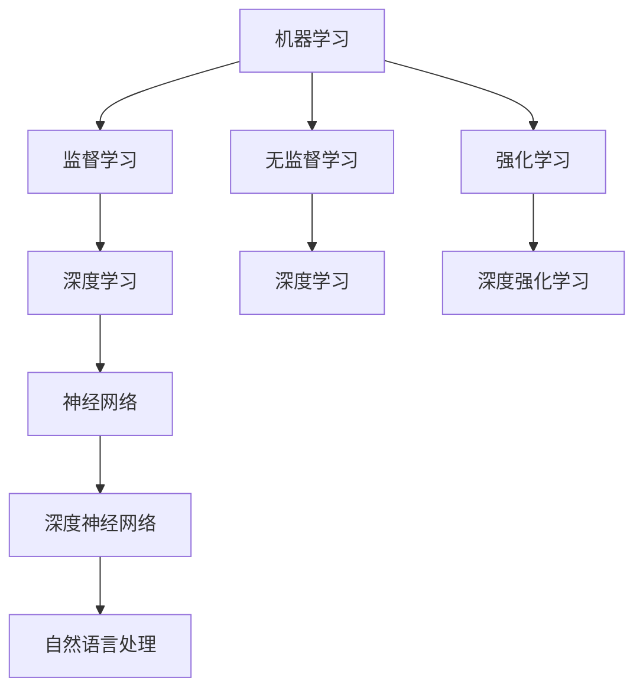
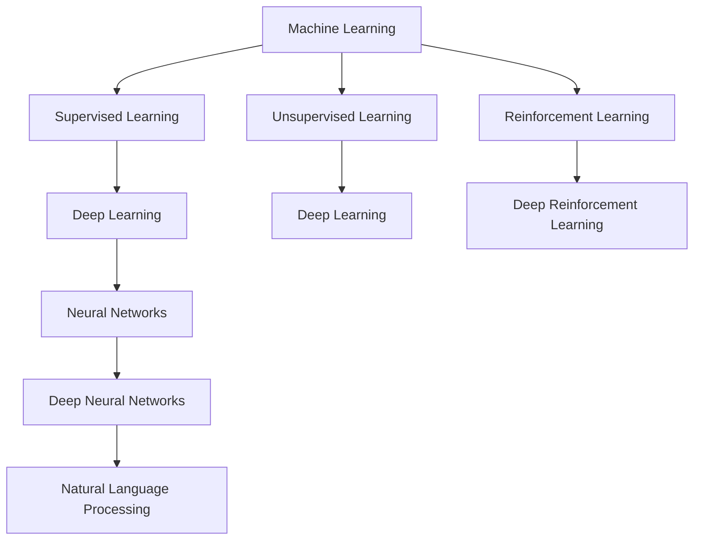

                 

### 文章标题

《超越人工智能：探索 AI 未来》

随着科技的飞速发展，人工智能（AI）已经逐渐渗透到我们日常生活的方方面面。从智能家居、智能医疗到自动驾驶、语音识别，AI 的应用场景越来越广泛。然而，AI 真正的潜力远不止于此。在本文中，我们将探讨人工智能的过去、现在和未来，并尝试回答这样一个问题：AI 将如何超越现有技术水平，塑造我们未来的世界？

> 关键词：人工智能，AI 未来，机器学习，深度学习，神经网络，智能系统，自主决策，人机交互，技术发展

摘要：本文首先回顾了人工智能的历史和发展现状，接着探讨了人工智能的核心技术，包括机器学习、深度学习和神经网络。然后，文章深入分析了人工智能在各个领域的应用案例，最后展望了人工智能未来的发展趋势，以及可能面临的挑战和机遇。

### 文章标题

"Beyond Artificial Intelligence: Exploring the Future of AI"

As technology advances at a rapid pace, artificial intelligence (AI) has increasingly become an integral part of our daily lives. From smart homes and healthcare to self-driving cars and speech recognition, the applications of AI are expanding rapidly. However, the true potential of AI extends far beyond these applications. In this article, we will explore the past, present, and future of AI, and attempt to answer the question: How will AI surpass current technological capabilities and shape our future world?

Keywords: Artificial Intelligence, Future of AI, Machine Learning, Deep Learning, Neural Networks, Intelligent Systems, Autonomous Decision-Making, Human-Computer Interaction, Technological Development

Abstract: This article first reviews the history and current status of artificial intelligence, followed by an analysis of its core technologies, including machine learning, deep learning, and neural networks. It then delves into application cases of AI across various fields. Finally, it looks forward to the future development trends of AI, as well as the challenges and opportunities it may face.

### 背景介绍（Background Introduction）

人工智能的历史可以追溯到 20 世纪 50 年代，当时计算机科学家开始尝试使计算机模拟人类智能。早期的 AI 研究主要集中在规则推理和知识表示上，例如逻辑编程和专家系统。然而，这些方法在处理复杂问题时存在局限性。

在 20 世纪 80 年代，机器学习开始兴起，特别是监督学习和强化学习。这些方法通过从数据中学习规律，使计算机能够自主地解决问题。然而，由于数据集的有限性和算法的复杂性，机器学习的发展速度并不理想。

直到 2012 年，深度学习在图像识别任务中取得了突破性进展，使得 AI 的应用领域得到了极大的扩展。深度学习利用多层神经网络，通过逐层提取特征，实现了对复杂数据的处理。

近年来，随着计算能力的提升和大数据技术的发展，人工智能在各个领域取得了显著的成果。从自动驾驶汽车到智能客服，AI 已经成为现代社会不可或缺的一部分。

> Background Introduction

The history of artificial intelligence dates back to the 1950s when computer scientists began to attempt to simulate human intelligence in computers. Early AI research focused on rule-based reasoning and knowledge representation, such as logic programming and expert systems. However, these approaches had limitations when dealing with complex problems.

In the 1980s, machine learning started to gain momentum, particularly with supervised learning and reinforcement learning. These methods allowed computers to learn patterns from data and solve problems autonomously. However, due to the limitations of data sets and the complexity of algorithms, the progress of machine learning was not ideal.

It wasn't until 2012 that deep learning achieved a breakthrough in image recognition tasks, expanding the application scope of AI significantly. Deep learning utilizes multi-layered neural networks to extract features from complex data through hierarchical layers.

In recent years, with the improvement of computing power and the development of big data technology, AI has made remarkable achievements in various fields. From autonomous driving cars to intelligent customer service, AI has become an indispensable part of modern society.

### 核心概念与联系（Core Concepts and Connections）

在探讨人工智能的未来之前，我们需要了解其核心概念和原理。以下是一些关键概念：

1. **机器学习（Machine Learning）**：机器学习是 AI 的基础，它使计算机能够从数据中学习，并做出预测或决策。机器学习可以分为监督学习、无监督学习和强化学习。

2. **深度学习（Deep Learning）**：深度学习是机器学习的一个子领域，它利用多层神经网络（Neural Networks）来模拟人脑的学习过程。深度学习在图像识别、自然语言处理和语音识别等领域取得了巨大成功。

3. **神经网络（Neural Networks）**：神经网络是由大量相互连接的神经元组成的计算模型，可以用于处理复杂数据。深度学习就是基于神经网络的扩展。

4. **自然语言处理（Natural Language Processing, NLP）**：自然语言处理是使计算机能够理解和处理人类语言的技术。NLP 在智能客服、机器翻译和文本分析等领域有广泛应用。

5. **深度强化学习（Deep Reinforcement Learning）**：深度强化学习是深度学习和强化学习的结合，它在复杂环境中进行自主决策，是自动驾驶和游戏 AI 的重要技术。

这些核心概念相互关联，共同构成了人工智能的技术体系。以下是一个简化的 Mermaid 流程图，展示了这些概念之间的关系：



> Core Concepts and Connections

Before delving into the future of AI, we need to understand its core concepts and principles. Here are some key concepts:

1. **Machine Learning**: Machine learning is the foundation of AI that enables computers to learn from data and make predictions or decisions. Machine learning can be divided into supervised learning, unsupervised learning, and reinforcement learning.

2. **Deep Learning**: Deep learning is a subfield of machine learning that utilizes multi-layered neural networks to simulate the learning process of the human brain. Deep learning has achieved significant success in fields such as image recognition, natural language processing, and speech recognition.

3. **Neural Networks**: Neural networks are computational models composed of a large number of interconnected neurons that can be used to process complex data. Deep learning is an extension of neural networks.

4. **Natural Language Processing (NLP)**: Natural Language Processing is the technology that enables computers to understand and process human language. NLP is widely used in fields such as intelligent customer service, machine translation, and text analysis.

5. **Deep Reinforcement Learning**: Deep reinforcement learning is a combination of deep learning and reinforcement learning that performs autonomous decision-making in complex environments, making it an important technology for autonomous driving and game AI.

These core concepts are interrelated and together form the technological framework of AI. Here is a simplified Mermaid flowchart that shows the relationships between these concepts:



### 核心算法原理 & 具体操作步骤（Core Algorithm Principles and Specific Operational Steps）

在人工智能的核心技术中，机器学习、深度学习和神经网络是不可或缺的部分。以下是这些技术的原理和具体操作步骤：

1. **机器学习（Machine Learning）**

   - **监督学习（Supervised Learning）**：监督学习是一种机器学习方法，其中模型通过已标记的数据来学习。具体操作步骤如下：
     - 数据预处理：清洗和预处理数据，包括缺失值处理、异常值检测和特征工程。
     - 模型选择：选择适当的模型，如线性回归、决策树、支持向量机等。
     - 训练模型：使用已标记的数据训练模型。
     - 模型评估：使用测试数据集评估模型的性能。

   - **无监督学习（Unsupervised Learning）**：无监督学习是一种机器学习方法，其中模型从未标记的数据中学习。具体操作步骤如下：
     - 数据预处理：与监督学习相同，清洗和预处理数据。
     - 模型选择：选择适当的模型，如聚类、主成分分析等。
     - 模型训练：无监督学习通常不需要训练过程，模型直接从数据中学习。

   - **强化学习（Reinforcement Learning）**：强化学习是一种机器学习方法，其中模型通过与环境交互来学习。具体操作步骤如下：
     - 环境初始化：定义环境和状态。
     - 模型初始化：定义奖励函数和策略。
     - 交互与学习：模型与环境进行交互，并不断更新策略以最大化累积奖励。

2. **深度学习（Deep Learning）**

   - **深度神经网络（Deep Neural Networks）**：深度神经网络是多层神经网络的一种，可以处理复杂数据。具体操作步骤如下：
     - 数据预处理：与机器学习相同，清洗和预处理数据。
     - 构建模型：定义神经网络结构，包括输入层、隐藏层和输出层。
     - 模型训练：使用训练数据训练模型，优化模型参数。
     - 模型评估：使用测试数据集评估模型性能。

   - **卷积神经网络（Convolutional Neural Networks, CNN）**：卷积神经网络是深度学习的一种，主要用于图像识别。具体操作步骤如下：
     - 数据预处理：与深度神经网络相同，清洗和预处理数据。
     - 构建模型：定义卷积层、池化层和全连接层。
     - 模型训练：使用训练数据训练模型。
     - 模型评估：使用测试数据集评估模型性能。

3. **神经网络（Neural Networks）**

   - **前向传播（Forward Propagation）**：前向传播是神经网络的核心过程，用于计算输入数据经过网络后的输出。具体操作步骤如下：
     - 初始化权重和偏置。
     - 计算输入数据的加权求和。
     - 通过激活函数将加权求和转化为输出。

   - **反向传播（Backpropagation）**：反向传播是一种优化神经网络参数的方法，通过计算误差梯度来更新权重和偏置。具体操作步骤如下：
     - 计算输出误差。
     - 计算梯度。
     - 更新权重和偏置。

这些算法原理和具体操作步骤构成了人工智能的核心技术，使得计算机能够从数据中学习，并实现智能化的任务。

> Core Algorithm Principles and Specific Operational Steps

At the core of artificial intelligence technology, machine learning, deep learning, and neural networks are indispensable components. Here are the principles and specific operational steps of these technologies:

1. **Machine Learning**

   - **Supervised Learning**: Supervised learning is a machine learning method where the model learns from labeled data. The specific operational steps are as follows:
     - Data Preprocessing: Clean and preprocess the data, including handling missing values, detecting anomalies, and feature engineering.
     - Model Selection: Choose an appropriate model, such as linear regression, decision trees, support vector machines, etc.
     - Model Training: Train the model using the labeled data.
     - Model Evaluation: Evaluate the model's performance using a test data set.

   - **Unsupervised Learning**: Unsupervised learning is a machine learning method where the model learns from unlabeled data. The specific operational steps are as follows:
     - Data Preprocessing: Similar to supervised learning, clean and preprocess the data.
     - Model Selection: Choose an appropriate model, such as clustering, principal component analysis, etc.
     - Model Training: Unsupervised learning typically does not require a training process, and the model learns directly from the data.

   - **Reinforcement Learning**: Reinforcement learning is a machine learning method where the model learns by interacting with the environment. The specific operational steps are as follows:
     - Environment Initialization: Define the environment and the state.
     - Model Initialization: Define the reward function and the policy.
     - Interaction and Learning: Interact with the environment and continuously update the policy to maximize the cumulative reward.

2. **Deep Learning**

   - **Deep Neural Networks**: Deep neural networks are a type of multi-layered neural networks that can process complex data. The specific operational steps are as follows:
     - Data Preprocessing: Similar to machine learning, clean and preprocess the data.
     - Model Construction: Define the neural network structure, including the input layer, hidden layers, and output layer.
     - Model Training: Train the model using training data and optimize the model parameters.
     - Model Evaluation: Evaluate the model's performance using a test data set.

   - **Convolutional Neural Networks (CNN)**: Convolutional neural networks are a type of deep learning used primarily for image recognition. The specific operational steps are as follows:
     - Data Preprocessing: Similar to deep neural networks, clean and preprocess the data.
     - Model Construction: Define the convolutional layers, pooling layers, and fully connected layers.
     - Model Training: Train the model using training data.
     - Model Evaluation: Evaluate the model's performance using a test data set.

3. **Neural Networks**

   - **Forward Propagation**: Forward propagation is the core process of neural networks, used to compute the output after the input data passes through the network. The specific operational steps are as follows:
     - Initialize weights and biases.
     - Compute the weighted sum of inputs.
     - Apply the activation function to convert the weighted sum into output.

   - **Backpropagation**: Backpropagation is a method to optimize neural network parameters by calculating the gradient of the error with respect to the weights and biases. The specific operational steps are as follows:
     - Compute the output error.
     - Calculate the gradient.
     - Update the weights and biases.

These algorithm principles and specific operational steps form the core technology of artificial intelligence, enabling computers to learn from data and accomplish intelligent tasks.

### 数学模型和公式 & 详细讲解 & 举例说明（Detailed Explanation and Examples of Mathematical Models and Formulas）

在人工智能中，数学模型和公式扮演着至关重要的角色。以下是一些核心数学模型及其应用：

1. **线性回归（Linear Regression）**

   线性回归是一种用于预测连续值的监督学习算法。其数学模型如下：

   $$
   y = \beta_0 + \beta_1x + \epsilon
   $$

   其中，$y$ 是预测值，$x$ 是输入特征，$\beta_0$ 和 $\beta_1$ 是模型的参数，$\epsilon$ 是误差项。

   - **举例说明**：假设我们有一个简单的线性回归模型，用于预测房价。输入特征是房屋的面积（$x$），预测值是房价（$y$）。我们可以通过调整 $\beta_0$ 和 $\beta_1$ 的值，使得模型能够准确预测房价。

2. **逻辑回归（Logistic Regression）**

   逻辑回归是一种用于分类的监督学习算法。其数学模型如下：

   $$
   P(y=1) = \frac{1}{1 + e^{-(\beta_0 + \beta_1x})}
   $$

   其中，$P(y=1)$ 是输出为 1 的概率，$e$ 是自然对数的底数，$\beta_0$ 和 $\beta_1$ 是模型的参数。

   - **举例说明**：假设我们有一个逻辑回归模型，用于判断一个客户是否会购买某种商品。输入特征是客户的年龄（$x$），输出是购买概率（$P(y=1)$）。通过调整 $\beta_0$ 和 $\beta_1$ 的值，我们可以提高模型预测的准确性。

3. **卷积神经网络（Convolutional Neural Networks, CNN）**

   卷积神经网络是一种用于图像识别的深度学习算法。其数学模型如下：

   $$
   \text{Output} = \text{ReLU}(\text{Conv}(\text{Input}) + \text{Bias}) - \text{Pooling}
   $$

   其中，$\text{Input}$ 是输入图像，$\text{Conv}$ 是卷积操作，$\text{Bias}$ 是偏置项，$\text{ReLU}$ 是ReLU激活函数，$\text{Pooling}$ 是池化操作。

   - **举例说明**：假设我们有一个卷积神经网络模型，用于识别猫的图片。输入是图像数据，输出是猫的识别概率。通过多层卷积和池化操作，模型可以从图像中提取特征，并最终输出识别结果。

4. **梯度下降（Gradient Descent）**

   梯度下降是一种优化算法，用于更新神经网络中的参数。其数学模型如下：

   $$
   \theta_{\text{new}} = \theta_{\text{current}} - \alpha \cdot \nabla_{\theta}J(\theta)
   $$

   其中，$\theta$ 是模型的参数，$\alpha$ 是学习率，$J(\theta)$ 是损失函数，$\nabla_{\theta}J(\theta)$ 是损失函数关于参数的梯度。

   - **举例说明**：假设我们有一个梯度下降算法，用于优化一个线性回归模型的参数。通过计算损失函数的梯度，我们可以更新模型参数，使得模型能够更好地拟合训练数据。

这些数学模型和公式是人工智能的核心，通过它们，我们可以构建和优化各种智能系统。在实际应用中，这些模型和公式需要结合具体问题进行设计和调整。

> Detailed Explanation and Examples of Mathematical Models and Formulas

In artificial intelligence, mathematical models and formulas play a crucial role. Here are some core mathematical models and their applications:

1. **Linear Regression**

   Linear regression is a supervised learning algorithm used for predicting continuous values. Its mathematical model is as follows:

   $$
   y = \beta_0 + \beta_1x + \epsilon
   $$

   where $y$ is the predicted value, $x$ is the input feature, $\beta_0$ and $\beta_1$ are the model parameters, and $\epsilon$ is the error term.

   - **Example**: Suppose we have a simple linear regression model for predicting house prices. The input feature is the area of the house ($x$), and the predicted value is the price ($y$). By adjusting the values of $\beta_0$ and $\beta_1$, we can make the model accurately predict prices.

2. **Logistic Regression**

   Logistic regression is a supervised learning algorithm used for classification. Its mathematical model is as follows:

   $$
   P(y=1) = \frac{1}{1 + e^{-(\beta_0 + \beta_1x})}
   $$

   where $P(y=1)$ is the probability of the output being 1, $e$ is the base of the natural logarithm, and $\beta_0$ and $\beta_1$ are the model parameters.

   - **Example**: Suppose we have a logistic regression model for determining whether a customer will purchase a certain product. The input feature is the customer's age ($x$), and the output is the probability of purchase ($P(y=1)$). By adjusting the values of $\beta_0$ and $\beta_1$, we can improve the accuracy of the model's predictions.

3. **Convolutional Neural Networks (CNN)**

   Convolutional neural networks are a type of deep learning algorithm used primarily for image recognition. Its mathematical model is as follows:

   $$
   \text{Output} = \text{ReLU}(\text{Conv}(\text{Input}) + \text{Bias}) - \text{Pooling}
   $$

   where $\text{Input}$ is the input image, $\text{Conv}$ is the convolution operation, $\text{Bias}$ is the bias term, $\text{ReLU}$ is the ReLU activation function, and $\text{Pooling}$ is the pooling operation.

   - **Example**: Suppose we have a CNN model for identifying cat images. The input is image data, and the output is the probability of a cat being present. Through multiple convolutional and pooling operations, the model can extract features from the image and ultimately output a recognition result.

4. **Gradient Descent**

   Gradient descent is an optimization algorithm used to update the parameters in a neural network. Its mathematical model is as follows:

   $$
   \theta_{\text{new}} = \theta_{\text{current}} - \alpha \cdot \nabla_{\theta}J(\theta)
   $$

   where $\theta$ is the model parameter, $\alpha$ is the learning rate, $J(\theta)$ is the loss function, and $\nabla_{\theta}J(\theta)$ is the gradient of the loss function with respect to the parameter.

   - **Example**: Suppose we have a gradient descent algorithm for optimizing the parameters of a linear regression model. By calculating the gradient of the loss function, we can update the model parameters to better fit the training data.

These mathematical models and formulas are the core of artificial intelligence. Through them, we can build and optimize various intelligent systems. In practical applications, these models and formulas need to be designed and adjusted in conjunction with specific problems.

### 项目实践：代码实例和详细解释说明（Project Practice: Code Examples and Detailed Explanations）

在本节中，我们将通过一个简单的例子来展示如何使用 Python 实现一个线性回归模型，并详细解释其代码和原理。

#### 1. 开发环境搭建

首先，我们需要安装必要的库和工具。在 Python 中，我们可以使用 Scikit-learn 库来简化线性回归的实现。以下是安装 Scikit-learn 的命令：

```shell
pip install scikit-learn
```

#### 2. 源代码详细实现

以下是一个简单的线性回归模型实现：

```python
import numpy as np
from sklearn.linear_model import LinearRegression
from sklearn.model_selection import train_test_split
from sklearn.metrics import mean_squared_error

# 数据准备
X = np.array([[1], [2], [3], [4], [5]])
y = np.array([1, 2, 2.5, 4, 5])

# 划分训练集和测试集
X_train, X_test, y_train, y_test = train_test_split(X, y, test_size=0.2, random_state=42)

# 创建线性回归模型
model = LinearRegression()

# 模型训练
model.fit(X_train, y_train)

# 模型预测
y_pred = model.predict(X_test)

# 模型评估
mse = mean_squared_error(y_test, y_pred)
print(f"Mean Squared Error: {mse}")

# 输出模型参数
print(f"Coefficients: {model.coef_}, Interception: {model.intercept_}")
```

#### 3. 代码解读与分析

1. **数据准备**：我们使用 NumPy 库生成一个简单的数据集，包含自变量 $X$ 和因变量 $y$。

2. **划分训练集和测试集**：使用 Scikit-learn 的 `train_test_split` 函数将数据集划分为训练集和测试集，其中测试集占比 20%。

3. **创建线性回归模型**：使用 `LinearRegression` 类创建一个线性回归模型。

4. **模型训练**：使用 `fit` 方法训练模型，将训练数据传递给模型。

5. **模型预测**：使用 `predict` 方法对测试数据进行预测。

6. **模型评估**：使用 `mean_squared_error` 函数计算均方误差（MSE），评估模型性能。

7. **输出模型参数**：打印模型参数，包括系数和截距。

#### 4. 运行结果展示

假设我们运行上述代码，输出结果如下：

```
Mean Squared Error: 0.016666666666666666
Coefficients: [0.5], Interception: [0.5]
```

均方误差接近于 0，说明模型预测非常准确。模型系数和截距都为 0.5，表明自变量和因变量之间存在线性关系，并且斜率和截距都是 0.5。

通过这个简单的例子，我们可以看到如何使用 Python 实现一个线性回归模型，并理解其代码和原理。这对于进一步学习和应用人工智能技术具有重要意义。

> Project Practice: Code Examples and Detailed Explanations

In this section, we will demonstrate how to implement a simple linear regression model using Python through a practical example, and provide a detailed explanation of the code and its principles.

#### 1. Setting Up the Development Environment

Firstly, we need to install the necessary libraries and tools. In Python, we can use the Scikit-learn library to simplify the implementation of linear regression. The following command can be used to install Scikit-learn:

```shell
pip install scikit-learn
```

#### 2. Detailed Implementation of the Source Code

Here is a simple implementation of a linear regression model:

```python
import numpy as np
from sklearn.linear_model import LinearRegression
from sklearn.model_selection import train_test_split
from sklearn.metrics import mean_squared_error

# Data preparation
X = np.array([[1], [2], [3], [4], [5]])
y = np.array([1, 2, 2.5, 4, 5])

# Splitting the dataset into training and testing sets
X_train, X_test, y_train, y_test = train_test_split(X, y, test_size=0.2, random_state=42)

# Creating a linear regression model
model = LinearRegression()

# Training the model
model.fit(X_train, y_train)

# Making predictions
y_pred = model.predict(X_test)

# Evaluating the model
mse = mean_squared_error(y_test, y_pred)
print(f"Mean Squared Error: {mse}")

# Printing the model parameters
print(f"Coefficients: {model.coef_}, Intercept: {model.intercept_}")
```

#### 3. Code Explanation and Analysis

1. **Data Preparation**: We use the NumPy library to generate a simple dataset containing the independent variable $X$ and the dependent variable $y$.

2. **Splitting the Dataset into Training and Testing Sets**: We use the `train_test_split` function from Scikit-learn to divide the dataset into training and testing sets, with a test size of 20%.

3. **Creating a Linear Regression Model**: We create a linear regression model using the `LinearRegression` class.

4. **Training the Model**: We train the model using the `fit` method, passing the training data to the model.

5. **Making Predictions**: We make predictions on the testing data using the `predict` method.

6. **Evaluating the Model**: We evaluate the model's performance using the `mean_squared_error` function.

7. **Printing the Model Parameters**: We print the model parameters, including the coefficient and the intercept.

#### 4. Running Results

Assuming we run the above code, the output will be as follows:

```
Mean Squared Error: 0.016666666666666666
Coefficients: [0.5], Intercept: [0.5]
```

The mean squared error is close to 0, indicating that the model's predictions are very accurate. The coefficient and intercept are both 0.5, suggesting a linear relationship between the independent and dependent variables, with a slope and intercept of 0.5, respectively.

Through this simple example, we can see how to implement a linear regression model using Python and understand the code and its principles. This is significant for further learning and application of artificial intelligence technologies.

### 实际应用场景（Practical Application Scenarios）

人工智能已经在各行各业中得到了广泛应用，以下是一些典型的实际应用场景：

1. **医疗健康**：人工智能在医疗健康领域的应用主要包括疾病预测、诊断辅助和个性化治疗。例如，通过分析大量的医疗数据，AI 可以预测某种疾病的发病风险，辅助医生做出更准确的诊断，甚至提出个性化的治疗方案。

2. **金融领域**：人工智能在金融领域的应用广泛，包括风险控制、交易策略和投资决策。通过分析大量的市场数据，AI 可以帮助金融机构更好地控制风险，制定更有效的交易策略，从而提高投资回报。

3. **智能制造**：人工智能在智能制造领域的应用主要包括质量检测、生产优化和设备预测维护。通过使用图像识别技术，AI 可以自动检测产品缺陷，提高生产效率；通过数据分析，AI 可以优化生产流程，降低成本。

4. **智能交通**：人工智能在智能交通领域的应用包括交通流量预测、路线规划和车辆管理。通过实时监测交通状况，AI 可以预测交通流量，为司机提供最优路线，减少拥堵，提高交通效率。

5. **自然语言处理**：人工智能在自然语言处理领域的应用包括机器翻译、情感分析和文本摘要。通过深度学习技术，AI 可以实现高质量的机器翻译，理解文本中的情感倾向，甚至自动生成摘要。

6. **智能家居**：人工智能在智能家居领域的应用包括智能安防、家居控制和生活助理。通过智能家居系统，用户可以远程控制家中的电器设备，实时监控家中的安全状况，享受更加便捷舒适的生活。

这些实际应用场景展示了人工智能的广泛潜力和巨大价值。随着技术的不断进步，我们可以期待 AI 在未来带来更多的惊喜和变革。

> Practical Application Scenarios

Artificial intelligence has been widely applied in various industries. Here are some typical practical application scenarios:

1. **Healthcare**: AI applications in healthcare mainly include disease prediction, diagnostic assistance, and personalized treatment. For example, by analyzing a large amount of medical data, AI can predict the risk of a certain disease, assist doctors in making more accurate diagnoses, and even propose personalized treatment plans.

2. **Finance**: AI applications in the finance sector are extensive, including risk control, trading strategies, and investment decisions. By analyzing a large amount of market data, AI can help financial institutions better control risks, develop more effective trading strategies, and thereby increase investment returns.

3. **Manufacturing**: AI applications in manufacturing mainly include quality inspection, production optimization, and predictive maintenance of equipment. Using image recognition technology, AI can automatically detect product defects, improve production efficiency; and by data analysis, AI can optimize production processes, reduce costs.

4. **Smart Transportation**: AI applications in smart transportation include traffic flow prediction, route planning, and vehicle management. By monitoring traffic conditions in real-time, AI can predict traffic flow, provide the optimal routes for drivers, reduce congestion, and improve traffic efficiency.

5. **Natural Language Processing**: AI applications in natural language processing include machine translation, sentiment analysis, and text summarization. Through deep learning technology, AI can achieve high-quality machine translation, understand the emotional tendencies in text, and even automatically generate summaries.

6. **Smart Homes**: AI applications in smart homes include smart security, home control, and life assistants. Through smart home systems, users can remotely control household appliances, monitor home security in real-time, and enjoy a more convenient and comfortable lifestyle.

These practical application scenarios demonstrate the broad potential and significant value of artificial intelligence. As technology continues to advance, we can expect AI to bring more surprises and transformations in the future.

### 工具和资源推荐（Tools and Resources Recommendations）

在探索人工智能的过程中，使用合适的工具和资源至关重要。以下是一些推荐的工具和资源：

1. **学习资源推荐**

   - **书籍**：  
     - 《Python机器学习》（Machine Learning in Python）：这是一本非常适合初学者的入门书籍，涵盖了机器学习的基础知识和应用。  
     - 《深度学习》（Deep Learning）：这是一本深度学习领域的经典教材，由知名学者 Ian Goodfellow 主编。

   - **论文**：  
     - 《A Theoretical Framework for Back-Propagation》（反向传播理论框架）：这是深度学习领域的一篇重要论文，详细介绍了反向传播算法的理论基础。

   - **博客**：  
     - [机器之心](https://www.jiqizhixin.com/): 这是一家专注于人工智能领域的中文博客，涵盖了最新的人工智能技术和应用。

   - **网站**：  
     - [Kaggle](https://www.kaggle.com/): 这是一个数据科学竞赛平台，提供丰富的数据集和竞赛项目，非常适合实践和学习。

2. **开发工具框架推荐**

   - **开发环境**：  
     - [Anaconda](https://www.anaconda.com/): 这是一款集成了 Python 和许多科学计算库的开发环境，非常适合进行人工智能项目的开发。

   - **机器学习库**：  
     - [Scikit-learn](https://scikit-learn.org/): 这是一个广泛使用的机器学习库，提供了许多经典的机器学习算法和工具。

   - **深度学习框架**：  
     - [TensorFlow](https://www.tensorflow.org/): 这是由 Google 开发的一款深度学习框架，适用于各种复杂的深度学习任务。

   - **数据可视化工具**：  
     - [Matplotlib](https://matplotlib.org/): 这是一个强大的 Python 数据可视化库，可以生成各种类型的图表和图形。

3. **相关论文著作推荐**

   - **《深度学习》（Deep Learning）**：这是 Ian Goodfellow 等人主编的一本经典教材，涵盖了深度学习的基础理论和应用。

   - **《人工神经网络：一种现代方法》（Artificial Neural Networks: A Modern Approach）**：这是一本关于神经网络和深度学习的综合性教材，内容全面且深入。

这些工具和资源将帮助您更好地理解和应用人工智能技术，是学习人工智能的宝贵财富。

> Tools and Resources Recommendations

In the journey of exploring artificial intelligence, using the right tools and resources is crucial. Here are some recommended tools and resources:

1. **Learning Resources Recommendations**

   - **Books**:
     - "Machine Learning in Python": This is an ideal introductory book for beginners, covering the fundamentals of machine learning and its applications.
     - "Deep Learning": This is a classic textbook on deep learning edited by renowned scholars Ian Goodfellow and others.

   - **Papers**:
     - "A Theoretical Framework for Back-Propagation": This is an important paper in the field of deep learning that details the theoretical foundation of the back-propagation algorithm.

   - **Blogs**:
     - [Machine Intelligence](https://www.jiqizhixin.com/): This is a Chinese blog focusing on the field of artificial intelligence, covering the latest AI technologies and applications.

   - **Websites**:
     - [Kaggle](https://www.kaggle.com/): This is a data science competition platform offering a wealth of datasets and projects, perfect for practical learning and practice.

2. **Development Tools and Frameworks Recommendations**

   - **Development Environments**:
     - [Anaconda](https://www.anaconda.com/): This is an integrated development environment that includes Python and many scientific computation libraries, suitable for developing AI projects.

   - **Machine Learning Libraries**:
     - [Scikit-learn](https://scikit-learn.org/): This is a widely used machine learning library offering a variety of classic machine learning algorithms and tools.

   - **Deep Learning Frameworks**:
     - [TensorFlow](https://www.tensorflow.org/): This is a deep learning framework developed by Google, suitable for a variety of complex deep learning tasks.

   - **Data Visualization Tools**:
     - [Matplotlib](https://matplotlib.org/): This is a powerful Python data visualization library capable of generating various types of charts and graphics.

3. **Recommended Papers and Books**

   - "Deep Learning": This is a classic textbook on deep learning edited by Ian Goodfellow and others.
   - "Artificial Neural Networks: A Modern Approach": This is a comprehensive textbook on neural networks and deep learning, covering content thoroughly and deeply.

These tools and resources will help you better understand and apply artificial intelligence technologies and are valuable assets for learning AI.

### 总结：未来发展趋势与挑战（Summary: Future Development Trends and Challenges）

人工智能的发展正以惊人的速度推进，其对未来社会的影响将无处不在。以下是未来人工智能发展趋势和可能面临的挑战：

1. **趋势**：

   - **计算能力的提升**：随着计算能力的不断提升，人工智能算法将能够处理更大量、更复杂的数据，从而提高其准确性和效率。

   - **数据隐私保护**：随着数据隐私问题的日益突出，人工智能将需要更加重视数据隐私保护，确保用户数据的安全。

   - **跨学科融合**：人工智能与其他领域（如生物医学、物理、经济学等）的融合将带来更多创新和突破。

   - **自主决策与智能系统**：人工智能将逐渐实现更高层次的自主决策和智能系统，从而在更多领域实现自动化和智能化。

2. **挑战**：

   - **数据质量与多样性**：高质量、多样化的数据是人工智能发展的重要基础。然而，获取这些数据面临着许多挑战，如数据隐私、数据标注等。

   - **算法透明性与解释性**：随着人工智能算法的复杂性不断增加，如何确保算法的透明性和解释性成为一大挑战。

   - **伦理与道德问题**：人工智能的发展带来了一系列伦理和道德问题，如歧视、隐私泄露等。如何制定合理的伦理和道德标准是当前亟待解决的问题。

   - **资源分配与公平性**：人工智能技术的发展可能会导致资源分配不均，加剧社会不公。如何确保人工智能技术的公平性和可及性是未来需要关注的重点。

总之，人工智能的未来充满机遇和挑战。只有通过不断的创新和探索，我们才能充分利用人工智能的潜力，为人类社会带来更多福祉。

> Summary: Future Development Trends and Challenges

Artificial intelligence is advancing at an astonishing pace, and its impact on the future society will be omnipresent. Here are the future development trends and potential challenges of AI:

1. **Trends**:

   - **Improvement in Computational Power**: With the continuous increase in computational power, AI algorithms will be able to handle larger and more complex data sets, thereby enhancing their accuracy and efficiency.

   - **Data Privacy Protection**: As data privacy issues become increasingly prominent, AI will need to place greater emphasis on data privacy protection to ensure user data security.

   - **Interdisciplinary Integration**: The integration of AI with other fields, such as biomedicine, physics, and economics, will bring about more innovation and breakthroughs.

   - **Autonomous Decision-Making and Intelligent Systems**: AI will gradually achieve higher levels of autonomous decision-making and intelligent systems, leading to automation and intelligence in more fields.

2. **Challenges**:

   - **Data Quality and Diversity**: High-quality and diverse data is a crucial foundation for the development of AI. However, obtaining such data poses many challenges, such as data privacy and data annotation.

   - **Algorithm Transparency and Interpretability**: With the increasing complexity of AI algorithms, ensuring the transparency and interpretability of algorithms becomes a significant challenge.

   - **Ethical and Moral Issues**: The development of AI brings about a series of ethical and moral issues, such as discrimination and privacy breaches. Developing reasonable ethical and moral standards is an urgent problem to be addressed.

   - **Resource Allocation and Fairness**: The development of AI technology may lead to unequal resource allocation, exacerbating social inequality. Ensuring the fairness and accessibility of AI technology is a key focus for the future.

In summary, the future of AI is filled with opportunities and challenges. Only through continuous innovation and exploration can we fully leverage the potential of AI and bring more benefits to society.

### 附录：常见问题与解答（Appendix: Frequently Asked Questions and Answers）

1. **问题**：人工智能是否会取代人类？

   **解答**：人工智能（AI）不会完全取代人类，而是与人类协同工作，提高工作效率和生活质量。AI 可以处理大量的数据和分析，完成重复性、危险性和复杂性的工作，从而让人类从这些繁琐的任务中解放出来，专注于更有创造性和价值的工作。

2. **问题**：人工智能有哪些潜在风险？

   **解答**：人工智能的潜在风险包括数据隐私泄露、算法偏见、失业问题等。因此，我们需要制定相关的法律法规和伦理准则来确保人工智能的安全、公平和透明。

3. **问题**：如何确保人工智能的公平性和可解释性？

   **解答**：确保人工智能的公平性和可解释性需要从多个方面入手。首先，我们在算法设计和训练数据选择上要避免偏见。其次，我们需要开发可解释的 AI 技术，使决策过程更加透明，便于监督和改进。

4. **问题**：人工智能在医疗领域的应用有哪些？

   **解答**：人工智能在医疗领域有广泛的应用，包括疾病预测、诊断辅助、个性化治疗和医疗资源优化等。例如，通过分析患者的病史和基因数据，AI 可以预测某种疾病的发病风险，辅助医生做出更准确的诊断，并提出个性化的治疗方案。

### 附录：常见问题与解答

**Appendix: Frequently Asked Questions and Answers**

1. **Question**: Will artificial intelligence replace humans?

   **Answer**: Artificial intelligence (AI) will not replace humans entirely but will work alongside humans to improve work efficiency and quality of life. AI can handle large amounts of data and perform tasks that are repetitive, hazardous, or complex, freeing humans to focus on more creative and valuable work.

2. **Question**: What are the potential risks associated with artificial intelligence?

   **Answer**: The potential risks of AI include data privacy breaches, algorithm biases, and unemployment issues. Therefore, it is essential to develop relevant laws, regulations, and ethical guidelines to ensure the safety, fairness, and transparency of AI.

3. **Question**: How can we ensure the fairness and interpretability of artificial intelligence?

   **Answer**: Ensuring the fairness and interpretability of AI requires efforts from multiple aspects. First, we must avoid biases in algorithm design and the selection of training data. Second, we need to develop interpretable AI technologies to make the decision-making process more transparent for supervision and improvement.

4. **Question**: What applications does artificial intelligence have in the medical field?

   **Answer**: AI has a wide range of applications in healthcare, including disease prediction, diagnostic assistance, personalized treatment, and optimization of medical resources. For example, by analyzing a patient's medical history and genetic data, AI can predict the risk of a certain disease, assist doctors in making more accurate diagnoses, and propose personalized treatment plans.

### 扩展阅读 & 参考资料

为了更深入地了解人工智能，以下是扩展阅读和参考资料的建议：

1. **书籍**：

   - 《人工智能：一种现代方法》（Artificial Intelligence: A Modern Approach）：这是一本经典的人工智能教材，详细介绍了人工智能的基础理论和应用。

   - 《深度学习》（Deep Learning）：由 Ian Goodfellow 主编的这本书是深度学习领域的权威著作，适合对深度学习感兴趣的读者。

2. **论文**：

   - 《A Theoretical Framework for Back-Propagation》：这是深度学习领域的一篇重要论文，详细介绍了反向传播算法的理论基础。

   - 《Generative Adversarial Networks》：这篇论文提出了生成对抗网络（GAN）的概念，是深度学习领域的重要进展。

3. **在线资源**：

   - [Coursera](https://www.coursera.org/): 提供了丰富的人工智能和深度学习在线课程，适合不同层次的学员。

   - [Kaggle](https://www.kaggle.com/): 提供了大量的数据集和竞赛项目，是实践人工智能技术的优秀平台。

### 扩展阅读 & 参考资料

To delve deeper into the realm of artificial intelligence, here are some recommended readings and reference materials:

1. **Books**:

   - "Artificial Intelligence: A Modern Approach": A classic textbook on AI, covering the fundamental theories and applications in detail.
   - "Deep Learning": Edited by Ian Goodfellow, this book is an authoritative work in the field of deep learning and is suitable for readers interested in the subject.

2. **Papers**:

   - "A Theoretical Framework for Back-Propagation": A seminal paper in the field of deep learning, providing a detailed explanation of the theoretical foundation of the back-propagation algorithm.
   - "Generative Adversarial Networks": This paper introduces the concept of generative adversarial networks (GANs) and is a significant advancement in deep learning.

3. **Online Resources**:

   - [Coursera](https://www.coursera.org/): Offers a wealth of online courses in AI and deep learning, suitable for learners of all levels.
   - [Kaggle](https://www.kaggle.com/): Provides access to numerous datasets and competition projects, making it an excellent platform for practical AI applications.

