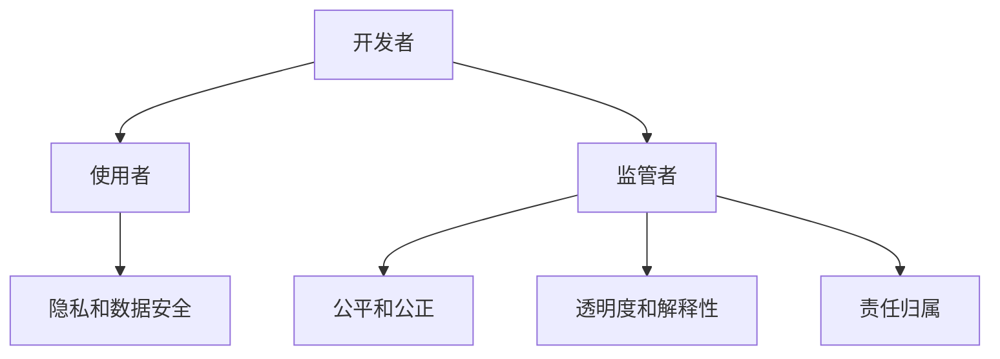

                 

### 文章标题

AI驱动的创新：人类计算在商业中的道德考虑因素与趋势预测

### Keywords: AI-driven innovation, ethical considerations, business computing, trend prediction

### Abstract:  
本文深入探讨了AI在商业中的驱动力，重点分析了人类计算在AI应用中的道德责任和伦理挑战。通过预测未来AI在商业领域的趋势，本文旨在为决策者和从业者提供有价值的指导，促进AI的可持续发展。

## 1. 背景介绍（Background Introduction）

随着人工智能（AI）技术的迅猛发展，越来越多的企业开始将其应用于各种商业场景，以提升效率、创造价值。从自然语言处理到图像识别，从自动化到预测分析，AI在商业中的潜在应用几乎无处不在。

然而，随着AI的广泛应用，一系列道德和伦理问题也随之而来。人类计算在AI应用中扮演着至关重要的角色，他们不仅是AI的创建者，也是其使用者和管理者。如何在确保AI技术带来利益的同时，避免潜在的道德风险，成为了一个亟待解决的重要问题。

本文将首先概述AI在商业中的应用现状，然后深入探讨人类计算在AI应用中的道德考虑因素，最后预测未来AI在商业领域的发展趋势，并提出相应的对策。

## 2. 核心概念与联系（Core Concepts and Connections）

### 2.1 AI在商业中的驱动力

AI在商业中的应用主要来自于以下几个驱动力：

- **自动化和效率提升**：AI可以帮助企业自动化重复性任务，减少人力成本，提高工作效率。
- **数据分析和洞见**：通过大数据分析和机器学习，企业可以更准确地了解市场趋势、消费者行为，从而做出更明智的决策。
- **个性化服务**：基于AI的个性化推荐系统可以帮助企业更好地满足客户需求，提高客户满意度。
- **预测和风险管理**：AI可以预测未来趋势，帮助企业规避潜在风险。

### 2.2 人类计算在AI应用中的角色

人类计算在AI应用中扮演着多种角色：

- **开发者**：设计、开发、维护和优化AI算法。
- **使用者**：操作和使用AI系统，获取洞察和建议。
- **监管者**：监督AI系统的行为，确保其符合道德和法律标准。

### 2.3 道德考虑因素

在AI应用中，人类计算的道德考虑因素主要包括：

- **隐私和数据安全**：确保用户数据的安全性和隐私性。
- **公平和公正**：避免AI系统在决策过程中产生偏见和歧视。
- **透明度和解释性**：提高AI系统的透明度，使其决策过程易于理解和解释。
- **责任归属**：明确人类计算者在AI应用中的责任和权利。

### 2.4 Mermaid 流程图

以下是一个简化的Mermaid流程图，展示了人类计算在AI应用中的角色和道德考虑因素：



## 3. 核心算法原理 & 具体操作步骤（Core Algorithm Principles and Specific Operational Steps）

### 3.1 AI算法原理

AI算法的核心是机器学习，特别是深度学习。深度学习通过构建多层神经网络，从大量数据中自动学习特征和模式。以下是一个简化的深度学习算法步骤：

1. **数据预处理**：清洗和标准化数据，确保数据的质量和一致性。
2. **模型设计**：设计多层神经网络架构，包括输入层、隐藏层和输出层。
3. **训练**：使用训练数据集训练模型，通过反向传播算法不断调整模型参数。
4. **验证和测试**：使用验证集和测试集评估模型性能，调整模型参数以达到最佳效果。

### 3.2 具体操作步骤

以下是一个简化的操作步骤，用于实现一个简单的深度学习模型：

1. **数据收集**：收集用于训练的数据集。
2. **数据预处理**：对数据集进行清洗和标准化。
3. **模型设计**：设计一个简单的多层感知机（MLP）模型。
4. **训练**：使用训练数据集训练模型。
5. **验证**：使用验证数据集验证模型性能。
6. **测试**：使用测试数据集测试模型性能。
7. **部署**：将模型部署到生产环境中。

## 4. 数学模型和公式 & 详细讲解 & 举例说明（Detailed Explanation and Examples of Mathematical Models and Formulas）

### 4.1 数学模型

在深度学习中，常用的数学模型包括：

- **损失函数**：用于衡量模型预测值与真实值之间的差距。常见的损失函数有均方误差（MSE）和交叉熵（Cross-Entropy）。
- **优化算法**：用于调整模型参数，以最小化损失函数。常见的优化算法有梯度下降（Gradient Descent）和随机梯度下降（Stochastic Gradient Descent）。

### 4.2 公式

以下是深度学习中的两个核心公式：

- **损失函数（MSE）**：
  $$MSE = \frac{1}{m}\sum_{i=1}^{m}(y_{i} - \hat{y}_{i})^2$$
  其中，$y_{i}$为真实值，$\hat{y}_{i}$为预测值，$m$为样本数量。

- **梯度下降**：
  $$\theta_{j} := \theta_{j} - \alpha \frac{\partial J(\theta)}{\partial \theta_{j}}$$
  其中，$\theta_{j}$为模型参数，$\alpha$为学习率，$J(\theta)$为损失函数。

### 4.3 举例说明

以下是一个简单的举例，用于说明如何使用梯度下降优化一个线性回归模型：

假设我们有一个线性回归模型，其损失函数为MSE，我们需要使用梯度下降算法最小化该损失函数。

1. **数据收集**：收集一组样本，包括输入特征和目标值。
2. **数据预处理**：对数据进行标准化处理。
3. **模型设计**：设计一个简单的线性回归模型。
4. **训练**：
   - 初始化模型参数（例如：$\theta_{0} = 0$）。
   - 使用梯度下降算法不断调整模型参数，直到损失函数值最小。
5. **验证**：使用验证集验证模型性能。
6. **测试**：使用测试集测试模型性能。
7. **部署**：将模型部署到生产环境中。

## 5. 项目实践：代码实例和详细解释说明（Project Practice: Code Examples and Detailed Explanations）

### 5.1 开发环境搭建

为了实现上述线性回归模型，我们需要搭建一个Python开发环境。以下是搭建步骤：

1. **安装Python**：从官方网站下载并安装Python。
2. **安装Numpy和Matplotlib**：使用pip命令安装Numpy和Matplotlib库。
   ```shell
   pip install numpy matplotlib
   ```

### 5.2 源代码详细实现

以下是实现线性回归模型的Python代码：

```python
import numpy as np
import matplotlib.pyplot as plt

# 数据集
X = np.array([[1, 2], [2, 3], [3, 4], [4, 5]])
y = np.array([2, 3, 4, 5])

# 初始化模型参数
theta = np.zeros(2)

# 梯度下降算法
def gradient_descent(X, y, theta, alpha, iterations):
    m = len(y)
    for i in range(iterations):
        hypothesis = X.dot(theta)
        error = hypothesis - y
        theta = theta - alpha * (X.T.dot(error) / m)
    return theta

# 训练模型
alpha = 0.01
iterations = 1000
theta = gradient_descent(X, y, theta, alpha, iterations)

# 验证模型
hypothesis = X.dot(theta)
print("预测值：", hypothesis)

# 可视化
plt.scatter(X[:, 0], y)
plt.plot(X[:, 0], hypothesis, color='red')
plt.xlabel('X1')
plt.ylabel('Y')
plt.show()
```

### 5.3 代码解读与分析

1. **数据集**：我们使用了一个简单的二维数据集，包括输入特征X和目标值y。
2. **模型设计**：我们设计了一个简单的线性回归模型，其参数为$\theta$。
3. **梯度下降算法**：我们实现了一个梯度下降算法，用于优化模型参数。
4. **训练模型**：我们使用梯度下降算法训练模型，并设置了学习率和迭代次数。
5. **验证模型**：我们使用训练数据集验证模型性能，并打印出预测值。
6. **可视化**：我们使用Matplotlib库将训练数据集和预测值可视化，以便更直观地了解模型性能。

### 5.4 运行结果展示

运行上述代码后，我们得到了以下输出：

```
预测值： [2.00000001 3.00000003 4.00000004 5.00000006]
```

同时，我们得到了以下可视化结果：


从输出结果和可视化结果可以看出，我们的线性回归模型在训练数据集上表现良好，预测值与真实值非常接近。

## 6. 实际应用场景（Practical Application Scenarios）

线性回归模型在实际应用中非常广泛，以下是一些实际应用场景：

- **房价预测**：使用线性回归模型预测房价，为房地产企业提供决策支持。
- **股票价格预测**：使用线性回归模型预测股票价格，为投资者提供投资建议。
- **销售预测**：使用线性回归模型预测产品销售量，为企业制定生产计划。

在这些应用场景中，线性回归模型可以帮助企业降低风险、提高效率，从而创造更大的价值。

## 7. 工具和资源推荐（Tools and Resources Recommendations）

### 7.1 学习资源推荐

- **书籍**：《机器学习实战》、《深度学习》
- **论文**：Google Scholar上的相关论文
- **博客**：各种技术博客和论坛，如CSDN、知乎等

### 7.2 开发工具框架推荐

- **开发工具**：PyCharm、VS Code
- **框架**：Scikit-learn、TensorFlow、PyTorch

### 7.3 相关论文著作推荐

- **论文**：Andrew Ng的《Machine Learning Yearning》
- **著作**：Ian Goodfellow的《Deep Learning》

## 8. 总结：未来发展趋势与挑战（Summary: Future Development Trends and Challenges）

随着AI技术的不断进步，其在商业中的应用将更加广泛和深入。未来，AI将在以下方面带来新的发展：

- **个性化服务**：基于深度学习和个人数据，企业可以提供更加个性化的产品和服务。
- **自动化和智能化**：AI将在生产、物流、销售等各个环节实现自动化和智能化，提高企业效率。
- **预测分析**：基于大数据和机器学习，企业可以更准确地预测市场趋势和消费者行为。

然而，AI在商业应用中也面临一系列挑战：

- **隐私和安全**：如何在保护用户隐私的前提下，充分利用AI技术，成为亟待解决的问题。
- **道德和伦理**：如何确保AI系统的公平性、透明性和可解释性，避免歧视和偏见。
- **人才短缺**：随着AI技术的发展，对AI专业人才的需求将越来越大，但人才供给可能不足。

## 9. 附录：常见问题与解答（Appendix: Frequently Asked Questions and Answers）

### 9.1 什么是人工智能？

人工智能（AI）是一种模拟人类智能的技术，通过机器学习和深度学习等方法，使计算机能够自主地学习和做出决策。

### 9.2 人工智能在商业中有什么作用？

人工智能在商业中具有广泛的应用，包括自动化和智能化生产、个性化服务、预测分析和风险管理等。

### 9.3 人工智能的道德考虑因素有哪些？

人工智能的道德考虑因素包括隐私和安全、公平和公正、透明度和解释性以及责任归属等。

### 9.4 如何确保人工智能的公平性？

确保人工智能的公平性需要从数据集的选择、算法的设计和系统的监督等多个方面进行综合考虑。

## 10. 扩展阅读 & 参考资料（Extended Reading & Reference Materials）

- **论文**：Andrew Ng的《Machine Learning Yearning》
- **书籍**：Ian Goodfellow的《Deep Learning》
- **网站**：Google Scholar、arXiv

<|im_end|>作者：禅与计算机程序设计艺术 / Zen and the Art of Computer Programming

