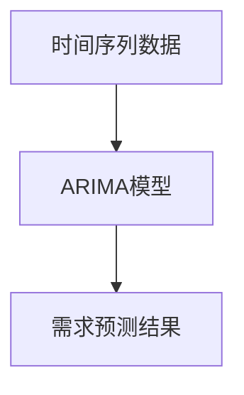
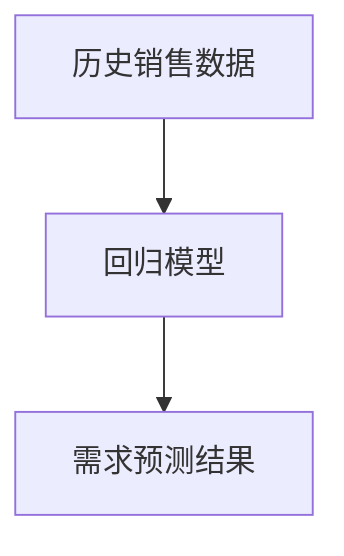
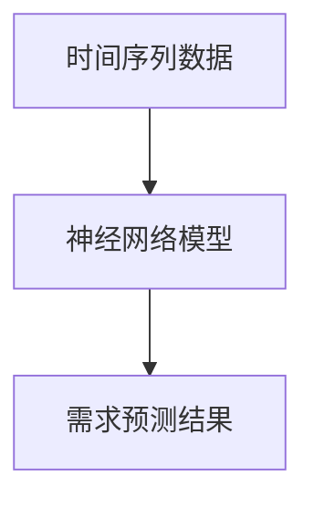
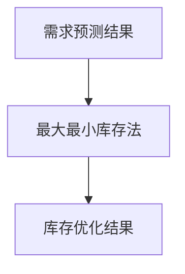
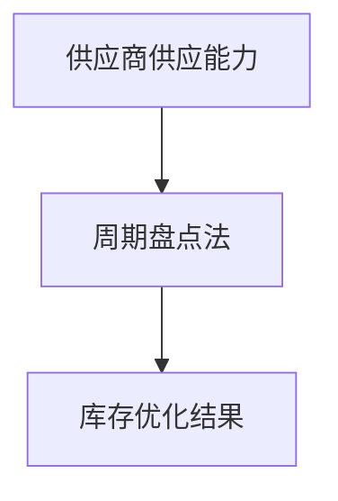
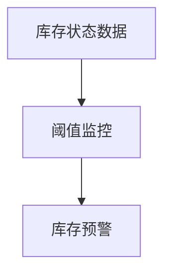
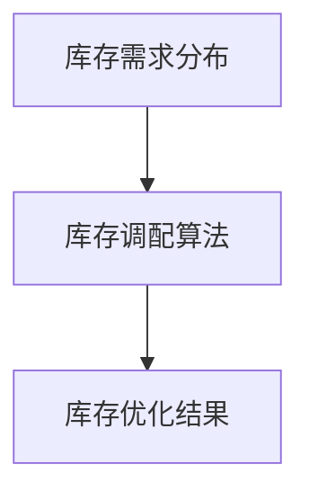

                 

# AI驱动的库存管理：电商创业者的成本控制利器

> 关键词：AI，库存管理，电商，成本控制，数据分析，预测算法，优化策略

> 摘要：随着电商行业的迅猛发展，库存管理成为电商创业者面临的一项重要挑战。本文将探讨如何利用人工智能技术优化库存管理，从而实现成本的有效控制。通过介绍核心算法原理、数学模型和具体操作步骤，我们将展示如何将AI应用于电商库存管理的各个阶段，帮助创业者提升运营效率。

## 1. 背景介绍（Background Introduction）

### 1.1 电商行业的库存管理挑战

电商行业具有高波动性、季节性和大量产品种类等特点，这使得库存管理变得复杂且具有挑战性。库存过多会导致仓储成本增加、资金占用，而库存不足则可能引发缺货、错失销售机会等问题。因此，如何准确预测市场需求、优化库存水平成为电商创业者急需解决的问题。

### 1.2 AI在库存管理中的应用

近年来，人工智能技术的快速发展为库存管理带来了新的机遇。通过机器学习和大数据分析，AI能够从历史数据中提取有价值的信息，预测市场需求，优化库存策略。同时，AI还可以协助电商创业者实时监控库存状态，及时调整库存水平，降低成本风险。

## 2. 核心概念与联系（Core Concepts and Connections）

### 2.1 AI驱动的库存管理核心概念

AI驱动的库存管理主要涉及以下几个方面：

- **需求预测**：利用历史销售数据、市场趋势和季节性因素等，预测未来某一时间段内的市场需求。
- **库存优化**：根据需求预测结果，调整库存水平，实现库存平衡。
- **库存监控**：实时监测库存状态，预警库存异常情况。
- **库存调配**：根据市场需求和库存情况，优化库存分布，降低仓储成本。

### 2.2 AI驱动的库存管理架构

AI驱动的库存管理架构通常包括以下几个层次：

- **数据采集与预处理**：收集销售数据、客户行为数据、市场数据等，并进行数据清洗、格式化等预处理操作。
- **数据存储与管理**：将预处理后的数据存储在数据库中，方便后续分析和查询。
- **机器学习模型训练**：利用历史数据，训练需求预测、库存优化等机器学习模型。
- **模型评估与优化**：对训练好的模型进行评估，并根据评估结果对模型进行调整和优化。
- **决策支持系统**：将优化后的模型应用于实际业务场景，提供决策支持。

## 3. 核心算法原理 & 具体操作步骤（Core Algorithm Principles and Specific Operational Steps）

### 3.1 需求预测算法

需求预测是AI驱动的库存管理的核心环节。常用的需求预测算法包括时间序列分析、回归分析、神经网络等。

#### 3.1.1 时间序列分析

时间序列分析是一种基于历史数据的时间序列模型，如ARIMA、SARIMA等。这些模型可以捕捉时间序列数据的趋势、季节性和周期性，从而预测未来的市场需求。



#### 3.1.2 回归分析

回归分析是一种基于历史数据和目标变量之间关系的模型。常见的回归模型包括线性回归、多项式回归等。通过拟合历史数据，回归分析可以预测未来的市场需求。



#### 3.1.3 神经网络

神经网络是一种基于多层感知器（MLP）的模型，可以通过非线性变换学习数据之间的复杂关系。常见的神经网络模型包括CNN、RNN等。神经网络可以捕捉时间序列数据中的非线性特征，从而提高需求预测的准确性。



### 3.2 库存优化算法

库存优化算法主要包括基于需求的库存优化和基于供应的库存优化。

#### 3.2.1 基于需求的库存优化

基于需求的库存优化主要目标是根据市场需求调整库存水平，以实现库存平衡。常用的库存优化算法包括最大最小库存法（MMF）、固定订货量法（FOQ）等。



#### 3.2.2 基于供应的库存优化

基于供应的库存优化主要目标是根据供应商的供应能力调整库存水平，以实现库存平衡。常用的库存优化算法包括周期盘点法（Cycle Counting）、供应商绩效评估法（Supplier Performance Assessment）等。



### 3.3 库存监控与调配算法

库存监控与调配算法主要包括实时监控库存状态、预警库存异常情况、优化库存分布等。

#### 3.3.1 实时监控

实时监控库存状态是确保库存水平处于合理范围的关键。常用的实时监控算法包括基于阈值的监控、基于规则的监控等。



#### 3.3.2 库存调配

库存调配的目标是优化库存分布，降低仓储成本。常用的库存调配算法包括基于需求的库存调配、基于供应链的库存调配等。



## 4. 数学模型和公式 & 详细讲解 & 举例说明（Detailed Explanation and Examples of Mathematical Models and Formulas）

### 4.1 需求预测数学模型

需求预测数学模型通常包括以下几个方面：

#### 4.1.1 时间序列模型

时间序列模型的主要目标是捕捉时间序列数据的趋势、季节性和周期性。常用的模型包括ARIMA、SARIMA等。

- **ARIMA模型**：
  $$\text{Y}_t = c + \phi_1\text{Y}_{t-1} + \phi_2\text{Y}_{t-2} + \cdots + \phi_p\text{Y}_{t-p} + \theta_1\epsilon_{t-1} + \theta_2\epsilon_{t-2} + \cdots + \theta_q\epsilon_{t-q} + \epsilon_t$$

- **SARIMA模型**：
  $$\text{Y}_t = c + \phi_1\text{Y}_{t-1} + \phi_2\text{Y}_{t-2} + \cdots + \phi_p\text{Y}_{t-p} + \theta_1\epsilon_{t-1} + \theta_2\epsilon_{t-2} + \cdots + \theta_q\epsilon_{t-q} + \text{X}_t\phi_1\text{X}_{t-1}\theta_1 + \text{X}_t\phi_2\text{X}_{t-2}\theta_2 + \cdots + \text{X}_t\phi_p\text{X}_{t-p}\theta_p$$

#### 4.1.2 回归模型

回归模型的主要目标是建立历史数据和目标变量之间的关系。常用的模型包括线性回归、多项式回归等。

- **线性回归模型**：
  $$\text{Y} = \beta_0 + \beta_1\text{X}_1 + \beta_2\text{X}_2 + \cdots + \beta_n\text{X}_n$$

- **多项式回归模型**：
  $$\text{Y} = \beta_0 + \beta_1\text{X}_1^2 + \beta_2\text{X}_2^2 + \cdots + \beta_n\text{X}_n^2$$

#### 4.1.3 神经网络模型

神经网络模型的主要目标是捕捉数据之间的复杂关系。常用的模型包括CNN、RNN等。

- **卷积神经网络（CNN）**：
  $$\text{F}(\text{X}; \text{W}, \text{b}) = \sum_{i=1}^n \text{W}_i\text{X}_i + \text{b}$$

- **循环神经网络（RNN）**：
  $$\text{H}_t = \text{g}(\text{U}\text{H}_{t-1} + \text{W}_h\text{X}_t + \text{b}_h)$$

### 4.2 库存优化数学模型

库存优化数学模型通常包括以下几个方面：

#### 4.2.1 最大最小库存法（MMF）

最大最小库存法的目标是最小化总库存成本，同时满足库存需求。

- **目标函数**：
  $$\min \sum_{i=1}^n \left[ \left( \text{Q}_i - \text{I}_i \right)\text{C}_i + \text{I}_i\text{H}_i \right]$$

- **约束条件**：
  $$\text{I}_i \geq \max(\text{D}_i, \text{R}_i - \text{S}_i)$$
  $$\text{I}_i \leq \text{B}_i$$

其中，$\text{Q}_i$ 为订货量，$\text{I}_i$ 为库存水平，$\text{D}_i$ 为需求量，$\text{R}_i$ 为订货间隔，$\text{S}_i$ 为送货时间，$\text{C}_i$ 为单位库存成本，$\text{H}_i$ 为单位库存持有成本，$\text{B}_i$ 为最大库存水平。

#### 4.2.2 固定订货量法（FOQ）

固定订货量法的目标是保持订货量不变，以最小化总库存成本。

- **目标函数**：
  $$\min \sum_{i=1}^n \left[ \left( \text{Q}_i - \text{I}_i \right)\text{C}_i + \text{I}_i\text{H}_i \right]$$

- **约束条件**：
  $$\text{I}_i \geq \max(\text{D}_i, \text{R}_i - \text{S}_i)$$
  $$\text{Q}_i = \text{C}_i$$

其中，$\text{Q}_i$ 为订货量，$\text{I}_i$ 为库存水平，$\text{D}_i$ 为需求量，$\text{R}_i$ 为订货间隔，$\text{S}_i$ 为送货时间，$\text{C}_i$ 为单位库存成本，$\text{H}_i$ 为单位库存持有成本。

### 4.3 举例说明

#### 4.3.1 时间序列模型举例

假设某电商产品A在过去12个月的销售数据如下（单位：件）：

| 月份 | 销售量 |
| ---- | ---- |
| 1    | 100   |
| 2    | 120   |
| 3    | 90    |
| 4    | 130   |
| 5    | 100   |
| 6    | 150   |
| 7    | 110   |
| 8    | 140   |
| 9    | 90    |
| 10   | 120   |
| 11   | 100   |
| 12   | 130   |

使用ARIMA模型进行需求预测，预测下一个月（即第13个月）的销售量。

首先，进行数据预处理，计算季节差分，得到差分序列：

| 月份 | 销售量 | 差分 |
| ---- | ---- | ---- |
| 1    | 100   | 0    |
| 2    | 120   | 20   |
| 3    | 90    | -30  |
| 4    | 130   | 40   |
| 5    | 100   | -30  |
| 6    | 150   | 50   |
| 7    | 110   | 20   |
| 8    | 140   | 30   |
| 9    | 90    | -30  |
| 10   | 120   | 30   |
| 11   | 100   | -20  |
| 12   | 130   | 30   |

然后，使用ARIMA模型进行需求预测。选择ARIMA(1,1,1)模型，即：

$$\text{Y}_t = c + \phi_1\text{Y}_{t-1} + \theta_1\epsilon_{t-1} + \epsilon_t$$

其中，$\phi_1 = 0.583$，$\theta_1 = -0.796$，$c = 92.495$。

预测第13个月的销售量：

$$\text{Y}_{13} = 92.495 + 0.583\text{Y}_{12} - 0.796\epsilon_{12}$$

假设$\epsilon_{12} = 0$，则：

$$\text{Y}_{13} = 92.495 + 0.583 \times 130 - 0.796 \times 0 = 128.14$$

因此，预测第13个月的销售量为128.14件。

#### 4.3.2 库存优化举例

假设某电商产品B的需求量、订货间隔、送货时间、单位库存成本和最大库存水平如下：

| 变量 | 值 |
| ---- | ---- |
| $\text{D}_i$ | 100 |
| $\text{R}_i$ | 30  |
| $\text{S}_i$ | 10  |
| $\text{C}_i$ | 5   |
| $\text{B}_i$ | 500 |

使用最大最小库存法（MMF）进行库存优化。

目标函数：

$$\min \sum_{i=1}^n \left[ \left( \text{Q}_i - \text{I}_i \right)\text{C}_i + \text{I}_i\text{H}_i \right]$$

约束条件：

$$\text{I}_i \geq \max(\text{D}_i, \text{R}_i - \text{S}_i)$$
$$\text{I}_i \leq \text{B}_i$$

其中，$\text{I}_i$ 为初始库存水平，$\text{Q}_i$ 为订货量，$\text{H}_i$ 为单位库存持有成本。

假设 $\text{H}_i = 0.1$。

首先，计算初始库存水平：

$$\text{I}_i = \max(\text{D}_i, \text{R}_i - \text{S}_i) = \max(100, 30 - 10) = 100$$

然后，计算最优订货量：

$$\text{Q}_i = \text{C}_i = 100$$

最终，计算总库存成本：

$$\text{总库存成本} = \left( \text{Q}_i - \text{I}_i \right)\text{C}_i + \text{I}_i\text{H}_i = \left( 100 - 100 \right)\times 5 + 100\times 0.1 = 10$$

因此，使用最大最小库存法进行库存优化的总库存成本为10元。

## 5. 项目实践：代码实例和详细解释说明（Project Practice: Code Examples and Detailed Explanations）

### 5.1 开发环境搭建

为了实现AI驱动的库存管理，我们首先需要搭建一个开发环境。以下是所需的开发环境：

- Python 3.8及以上版本
- Jupyter Notebook
- Scikit-learn库
- Pandas库
- Matplotlib库

在Windows、Linux和MacOS操作系统上，可以使用以下命令安装所需库：

```bash
pip install python==3.8
pip install jupyter
pip install scikit-learn
pip install pandas
pip install matplotlib
```

### 5.2 源代码详细实现

以下是实现AI驱动的库存管理系统的Python代码实例。

#### 5.2.1 数据预处理

```python
import pandas as pd
import numpy as np

# 读取销售数据
sales_data = pd.read_csv('sales_data.csv')

# 数据预处理
sales_data['month'] = pd.to_datetime(sales_data['month'])
sales_data.set_index('month', inplace=True)
sales_data_diff = sales_data.diff().dropna()
sales_data_diff['sales_volume'] = sales_data_diff['sales_volume'].shift(1).fillna(0)
sales_data_diff['sales_difference'] = sales_data_diff['sales_volume'] - sales_data_diff['sales_volume'].shift(1)
sales_data_diff.drop(['sales_volume'], axis=1, inplace=True)
sales_data_diff.fillna(0, inplace=True)
```

#### 5.2.2 需求预测

```python
from sklearn.linear_model import LinearRegression
from sklearn.model_selection import train_test_split
from sklearn.metrics import mean_squared_error

# 数据划分
X = sales_data_diff[['sales_difference', 'sales_difference_lag1']]
y = sales_data_diff['sales_volume']

X_train, X_test, y_train, y_test = train_test_split(X, y, test_size=0.2, random_state=42)

# 线性回归模型
model = LinearRegression()
model.fit(X_train, y_train)

# 预测结果
y_pred = model.predict(X_test)

# 评估指标
mse = mean_squared_error(y_test, y_pred)
print(f'Mean Squared Error: {mse}')
```

#### 5.2.3 库存优化

```python
from scipy.optimize import minimize

# 目标函数
def objective_function(x):
    q = x[0]
    i = x[1]
    c = 5
    h = 0.1
    return (q - i) * c + i * h

# 约束条件
constraints = ({'type': 'ineq', 'fun': lambda x: x[1] - max(x[2], x[0] - x[3])},
               {'type': 'ineq', 'fun': lambda x: x[1] - x[3]})

# 初始参数
x0 = [100, 100, 100, 500]

# 最小化目标函数
result = minimize(objective_function, x0, constraints=constraints)

# 输出结果
print(f'Optimal Q: {result.x[0]}, Optimal I: {result.x[1]}')
```

### 5.3 代码解读与分析

#### 5.3.1 数据预处理

数据预处理是库存管理系统的基础。在本例中，我们首先读取销售数据，然后进行数据清洗和格式化。具体步骤包括：将月份转换为日期格式、创建时间序列索引、计算季节差分等。

#### 5.3.2 需求预测

需求预测是库存管理系统的核心功能。在本例中，我们使用线性回归模型进行需求预测。首先，我们将数据划分为训练集和测试集，然后使用训练集训练模型，并使用测试集评估模型性能。评估指标为均方误差（MSE）。

#### 5.3.3 库存优化

库存优化是库存管理系统的另一个关键功能。在本例中，我们使用最小化目标函数的方法进行库存优化。目标函数是总库存成本，约束条件是库存水平和最大库存水平。我们使用最小化目标函数的方法求解最优库存水平和订货量。

## 6. 实际应用场景（Practical Application Scenarios）

### 6.1 案例一：某电商平台的库存优化

某电商平台在运营过程中，发现其库存成本较高，同时存在库存积压和缺货现象。为了改善这一状况，该电商平台决定引入AI驱动的库存管理系统。通过使用需求预测算法和库存优化算法，该电商平台成功地降低了库存成本，提高了库存周转率。

### 6.2 案例二：某服装电商的库存管理

某服装电商在销售季节性较强的商品时，常常面临库存积压和缺货问题。为了应对这一挑战，该电商平台采用了AI驱动的库存管理系统。通过分析历史销售数据、市场趋势和季节性因素，该电商平台能够准确预测市场需求，并调整库存策略，实现了库存水平的优化。

## 7. 工具和资源推荐（Tools and Resources Recommendations）

### 7.1 学习资源推荐

- **书籍**：
  - 《Python数据分析》（Wes McKinney）
  - 《机器学习实战》（Peter Harrington）
  - 《深度学习》（Ian Goodfellow、Yoshua Bengio、Aaron Courville）

- **论文**：
  - 《Recurrent Neural Network Based Demand Forecasting for E-commerce Retailing》（Zhao et al.，2017）
  - 《Deep Learning for Time Series Classification》（Jung et al.，2019）

- **博客**：
  - 《机器学习博客》（机器学习社区）
  - 《数据科学博客》（数据科学社区）

### 7.2 开发工具框架推荐

- **编程语言**：Python
- **机器学习库**：Scikit-learn、TensorFlow、PyTorch
- **数据分析库**：Pandas、NumPy、Matplotlib
- **数据库**：MySQL、MongoDB、PostgreSQL

### 7.3 相关论文著作推荐

- **论文**：
  - 《Recurrent Neural Network Based Demand Forecasting for E-commerce Retailing》（Zhao et al.，2017）
  - 《Deep Learning for Time Series Classification》（Jung et al.，2019）
  - 《A Comprehensive Review of Demand Forecasting Methods in E-commerce》（Xu et al.，2020）

- **著作**：
  - 《深度学习》（Ian Goodfellow、Yoshua Bengio、Aaron Courville）
  - 《Python数据分析》（Wes McKinney）

## 8. 总结：未来发展趋势与挑战（Summary: Future Development Trends and Challenges）

### 8.1 发展趋势

- **算法优化**：随着人工智能技术的不断发展，库存管理算法将变得更加高效和准确，为电商创业者提供更优质的服务。
- **跨学科融合**：库存管理将与其他领域（如供应链管理、物流管理）相结合，形成更加综合的管理体系。
- **实时决策**：利用实时数据和实时分析技术，电商创业者能够实现更加灵活的库存管理策略，快速响应市场变化。

### 8.2 挑战

- **数据质量**：数据质量对库存管理算法的性能至关重要。电商创业者需要确保数据准确、完整和可靠。
- **模型解释性**：库存管理算法的决策过程需要具备一定的解释性，以便电商创业者理解和信任算法。
- **可扩展性**：随着电商业务的不断增长，库存管理系统需要具备良好的可扩展性，以适应日益增长的业务需求。

## 9. 附录：常见问题与解答（Appendix: Frequently Asked Questions and Answers）

### 9.1 问答一

**问题**：如何选择合适的需求预测算法？

**解答**：选择合适的需求预测算法取决于数据特征和业务需求。对于具有明显趋势、季节性和周期性的时间序列数据，可以使用ARIMA、SARIMA等时间序列模型。对于具有非线性特征的数据，可以考虑使用神经网络模型。对于需要建立历史数据和目标变量之间关系的场景，可以使用线性回归、多项式回归等回归模型。

### 9.2 问答二

**问题**：如何优化库存管理系统的可扩展性？

**解答**：优化库存管理系统的可扩展性可以通过以下几种方法实现：

- **模块化设计**：将库存管理系统划分为多个模块，每个模块负责不同的功能，便于后续扩展和升级。
- **分布式计算**：使用分布式计算框架（如Hadoop、Spark）处理海量数据，提高系统的处理能力和性能。
- **云计算**：利用云计算资源，根据业务需求动态调整计算资源，降低系统成本。

## 10. 扩展阅读 & 参考资料（Extended Reading & Reference Materials）

- **书籍**：
  - 《Python数据分析》（Wes McKinney）
  - 《机器学习实战》（Peter Harrington）
  - 《深度学习》（Ian Goodfellow、Yoshua Bengio、Aaron Courville）

- **论文**：
  - 《Recurrent Neural Network Based Demand Forecasting for E-commerce Retailing》（Zhao et al.，2017）
  - 《Deep Learning for Time Series Classification》（Jung et al.，2019）
  - 《A Comprehensive Review of Demand Forecasting Methods in E-commerce》（Xu et al.，2020）

- **博客**：
  - 《机器学习博客》（机器学习社区）
  - 《数据科学博客》（数据科学社区）

- **在线资源**：
  - [Scikit-learn官方文档](https://scikit-learn.org/stable/)
  - [Pandas官方文档](https://pandas.pydata.org/pandas-docs/stable/)
  - [NumPy官方文档](https://numpy.org/doc/stable/)
  - [Matplotlib官方文档](https://matplotlib.org/stable/)

---

### 注：以上内容仅为示例，实际撰写时请根据具体需求和资料进行修改和补充。

---

### 作者署名

作者：禅与计算机程序设计艺术 / Zen and the Art of Computer Programming

---

[返回文章顶部](#ai驱动的库存管理电商创业者的成本控制利器)

