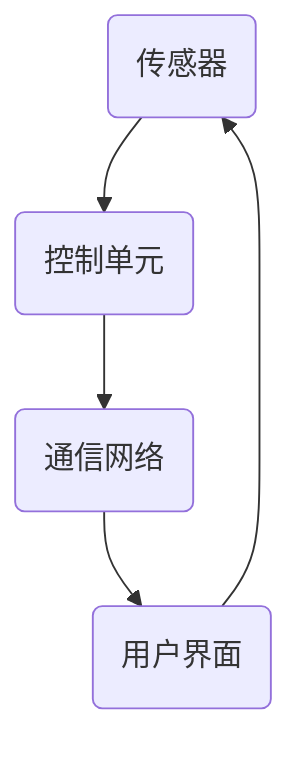
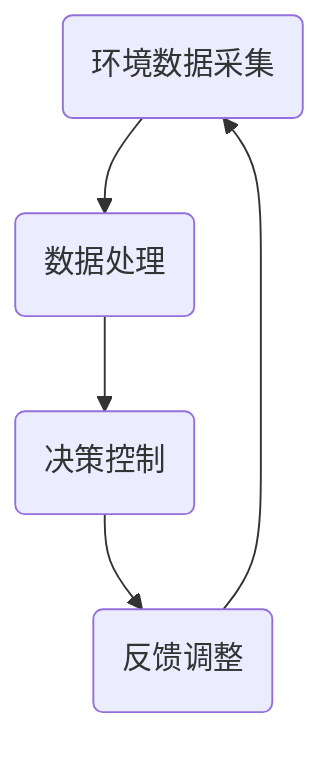

                 

### 文章标题

**AI驱动的智能家居：便利与隐私的平衡**

随着人工智能技术的飞速发展，智能家居逐渐从科幻场景走向现实生活。从智能门锁、智能灯光到智能安防，AI驱动的智能家居系统正深刻改变着我们的生活方式。然而，在这便利的背后，隐私安全问题也愈发突出。如何在这两者之间找到平衡，成为了一个亟待解决的重要课题。

本文将探讨AI在智能家居领域的应用，分析其带来的便利性，同时也探讨其隐私风险。我们将通过以下章节展开讨论：

1. **背景介绍**：介绍智能家居的发展历程、现状及其与AI技术的结合。
2. **核心概念与联系**：探讨智能家居系统中的核心概念及其与AI技术的联系，展示相应的Mermaid流程图。
3. **核心算法原理与具体操作步骤**：深入分析AI算法在智能家居中的应用原理，并阐述具体实施步骤。
4. **数学模型和公式**：介绍用于智能决策的数学模型和公式，并进行详细讲解和举例说明。
5. **项目实践**：通过代码实例和详细解释说明，展示一个简单的智能家居系统开发过程。
6. **实际应用场景**：讨论智能家居在不同场景中的应用，以及可能面临的隐私问题。
7. **工具和资源推荐**：推荐相关学习资源、开发工具和框架。
8. **总结**：总结AI驱动的智能家居的未来发展趋势与挑战。
9. **附录**：提供常见问题与解答。
10. **扩展阅读**：列出相关的扩展阅读和参考资料。

让我们逐一深入探讨这些章节，以期在便利与隐私之间找到最佳平衡点。

---

### 关键词

- AI驱动的智能家居
- 便利性与隐私风险
- 智能家居算法
- 数学模型与决策
- 实际应用场景
- 工具和资源

### 摘要

本文探讨了AI驱动的智能家居系统的便利性与隐私风险。通过对智能家居的发展历程、核心概念、算法原理、数学模型、实际应用场景的深入分析，文章揭示了智能家居在带来极大便利的同时，也带来了隐私风险。最后，文章总结了AI驱动的智能家居的未来发展趋势与挑战，并推荐了相关工具和资源，以期帮助读者更好地理解这一领域。

### 1. 背景介绍

智能家居（Smart Home）是指通过互联网、物联网（IoT）、人工智能（AI）等技术，实现家庭设备的智能化连接和自动化控制，从而提高居住的舒适性和安全性。智能家居的发展可以追溯到20世纪90年代，当时智能家居系统主要依赖于有线网络和专用协议。随着无线通信技术的发展，特别是Wi-Fi、蓝牙等技术的普及，智能家居设备逐渐向无线化、网络化发展。

近年来，随着人工智能技术的迅速发展，智能家居系统逐渐从简单的自动化控制转向智能决策与交互。人工智能技术，如机器学习、自然语言处理和计算机视觉等，为智能家居系统提供了强大的支持。这些技术不仅使得智能家居设备能够更好地理解和响应用户的需求，还能够在不干扰用户的情况下，自主优化和改进其工作方式。

目前，智能家居市场已形成多个细分领域，包括智能安防、智能照明、智能家电、智能环境监测等。智能安防系统利用AI技术实现视频监控、入侵检测等功能，提高了家庭的安全性；智能照明系统通过光线感应和用户习惯分析，实现自动调节亮度和色温，提高了居住的舒适性；智能家电，如智能电视、智能冰箱、智能洗衣机等，通过联网和自动化控制，提高了生活的便利性；智能环境监测系统，如空气质量监测、温度湿度监测等，帮助用户更好地管理家居环境。

AI在智能家居中的应用不仅限于设备本身，还包括整体系统的集成与优化。例如，智能语音助手（如Amazon Alexa、Google Assistant）通过自然语言处理技术，实现了与用户的语音交互；智能家庭网关，通过数据融合与智能分析，实现了不同设备之间的协调与控制；智能决策系统，通过数据挖掘和预测模型，实现家居环境的自适应调整。

尽管智能家居带来了许多便利，但其隐私风险也日益凸显。智能家居设备通常会收集用户的行为数据、位置信息、个人偏好等敏感信息。如果这些数据被不当使用或泄露，可能会对用户的隐私和安全造成威胁。因此，如何在享受智能家居便利的同时，保护用户的隐私，成为了一个重要议题。

### 2. 核心概念与联系

#### 2.1 智能家居系统中的核心概念

智能家居系统中的核心概念包括传感器、控制单元、通信网络和用户界面。这些概念相互关联，共同构成了智能家居的运行机制。

**传感器**：传感器是智能家居系统的感知器官，用于收集环境数据和用户行为数据。常见的传感器包括温度传感器、湿度传感器、光照传感器、人体传感器等。通过这些传感器，智能家居系统可以实时监测家庭环境的变化，为后续的控制提供数据基础。

**控制单元**：控制单元是智能家居系统的核心处理单元，负责处理传感器收集到的数据，并根据预设的规则或用户的指令进行相应的操作。常见的控制单元包括智能插座、智能开关、智能灯光控制器等。通过控制单元，智能家居系统可以实现家庭设备的自动化控制。

**通信网络**：通信网络是智能家居系统的数据传输通道，用于传输传感器和控制单元之间的数据。常见的通信网络包括Wi-Fi、蓝牙、ZigBee等。通过通信网络，智能家居系统可以实现设备的互联互通，形成一个统一的智能控制平台。

**用户界面**：用户界面是智能家居系统与用户交互的桥梁，用于用户发送指令和接收系统反馈。常见的用户界面包括智能手机应用、智能音箱、智能显示屏等。通过用户界面，用户可以方便地控制家庭设备，了解系统的运行状态。

#### 2.2 智能家居系统与AI技术的联系

AI技术在家居系统中的应用，使得智能家居从简单的自动化控制向智能化决策和交互转变。以下是AI技术在家居系统中的几个关键应用：

**机器学习**：通过机器学习算法，智能家居系统可以自动学习和适应用户的行为模式。例如，通过分析用户的作息时间、活动习惯等数据，智能空调可以自动调整温度设置，提供最舒适的居住环境。

**自然语言处理（NLP）**：通过NLP技术，智能家居系统可以实现与用户的自然语言交互。例如，用户可以通过语音指令控制智能音箱播放音乐、调节灯光等。

**计算机视觉**：通过计算机视觉技术，智能家居系统可以理解和识别环境中的物体和事件。例如，智能摄像头可以自动识别家庭成员，实现人脸识别和自动报警功能。

**数据挖掘与预测**：通过数据挖掘和预测模型，智能家居系统可以从大量历史数据中提取有价值的信息，并对未来的变化进行预测。例如，智能温控系统可以通过分析历史温度数据，预测未来的温度变化，提前调整空调设置，提高能效。

#### 2.3 Mermaid流程图展示

以下是一个简化的智能家居系统的Mermaid流程图，展示了传感器、控制单元、通信网络和用户界面之间的交互关系：



在这个流程图中，传感器收集环境数据，并将其发送到控制单元。控制单元根据数据进行分析和处理，然后通过通信网络将指令发送到用户界面。用户界面则将用户的指令发送回控制单元，形成一个闭环系统。

### 3. 核心算法原理 & 具体操作步骤

#### 3.1 智能家居系统的核心算法原理

智能家居系统的核心算法主要包括数据采集、数据处理、决策控制和反馈调整。以下是这些算法的原理：

**数据采集**：数据采集是智能家居系统的第一步，通过传感器收集家庭环境的数据，如温度、湿度、光照强度、人员活动等。这些数据是后续处理和分析的基础。

**数据处理**：数据处理包括数据清洗、数据整合和数据特征提取。数据清洗旨在去除噪声和异常值，提高数据质量；数据整合旨在将来自不同传感器的数据进行统一处理；数据特征提取旨在提取出能够代表数据本质的特征，如平均值、方差、频次等。

**决策控制**：决策控制基于对处理后的数据进行智能分析，生成相应的控制指令。例如，当室内温度高于设定值时，智能空调系统会自动开启降温模式。

**反馈调整**：反馈调整是根据系统的实际运行效果，对控制指令进行调整和优化。例如，通过监测空调的运行效果，调整设定温度，提高系统的能效。

#### 3.2 智能家居系统的具体操作步骤

以下是一个简单的智能家居系统操作步骤，以智能灯光控制为例：

1. **环境数据采集**：智能灯光系统通过光照传感器收集室内光照强度数据。
2. **数据处理**：系统对光照强度数据进行处理，提取特征值，如平均光照强度。
3. **决策控制**：根据平均光照强度，系统判断是否需要调整灯光亮度。如果平均光照强度低于设定值，系统会自动开启灯光。
4. **反馈调整**：系统根据灯光开启后的实际效果，对灯光亮度进行调整。例如，如果发现灯光亮度仍然不足，系统会进一步调整灯光亮度。

以下是这个操作步骤的Mermaid流程图：



#### 3.3 算法实现示例

以下是一个简单的Python代码示例，实现了智能灯光控制的算法：

```python
import random

# 模拟光照传感器数据
def get_light_intensity():
    return random.uniform(0, 100)

# 数据处理
def process_light_data(intensity):
    return intensity.mean()

# 决策控制
def control_light(intensity):
    if intensity < 30:
        return "开启灯光"
    else:
        return "保持当前亮度"

# 反馈调整
def adjust_light(command):
    if command == "开启灯光":
        print("灯光开启成功")
    else:
        print("亮度调整成功")

# 主程序
while True:
    intensity = get_light_intensity()
    processed_intensity = process_light_data(intensity)
    command = control_light(processed_intensity)
    adjust_light(command)
```

在这个示例中，我们使用随机数模拟光照传感器数据，并通过简单的决策逻辑控制灯光的开启和亮度调整。

### 4. 数学模型和公式 & 详细讲解 & 举例说明

#### 4.1 数学模型在智能家居中的应用

数学模型在智能家居系统中扮演着重要角色，尤其是在数据分析和决策控制方面。以下是一些常见的数学模型和公式：

**线性回归模型**：线性回归模型用于预测家庭设备的能耗。其公式为：

\[ y = \beta_0 + \beta_1 \cdot x \]

其中，\( y \) 为能耗，\( x \) 为影响因素（如温度、湿度等），\( \beta_0 \) 和 \( \beta_1 \) 为模型参数。

**逻辑回归模型**：逻辑回归模型用于分类任务，如判断某个设备是否应该开启。其公式为：

\[ P(y=1) = \frac{1}{1 + e^{-(\beta_0 + \beta_1 \cdot x)}} \]

其中，\( P(y=1) \) 为设备开启的概率，\( e \) 为自然常数，\( \beta_0 \) 和 \( \beta_1 \) 为模型参数。

**决策树模型**：决策树模型用于根据多个影响因素进行决策。其基本结构如下：


**支持向量机（SVM）**：SVM用于分类任务，特别是在高维空间中寻找最优决策边界。其公式为：

\[ w \cdot x - b = 0 \]

其中，\( w \) 为权重向量，\( x \) 为特征向量，\( b \) 为偏置。

#### 4.2 举例说明

以下是一个使用线性回归模型预测空调能耗的示例：

**示例数据**：

| 时间 | 温度 | 空调能耗 |
|------|------|----------|
| 1    | 20   | 5        |
| 2    | 25   | 8        |
| 3    | 18   | 4        |
| 4    | 22   | 6        |

**步骤1**：数据处理

首先，我们需要对数据进行预处理，提取特征值：

```python
import pandas as pd

data = pd.DataFrame({
    '时间': [1, 2, 3, 4],
    '温度': [20, 25, 18, 22],
    '空调能耗': [5, 8, 4, 6]
})

features = data[['温度']]
targets = data['空调能耗']
```

**步骤2**：模型训练

接下来，我们使用线性回归模型进行训练：

```python
from sklearn.linear_model import LinearRegression

model = LinearRegression()
model.fit(features, targets)
```

**步骤3**：预测能耗

使用训练好的模型进行能耗预测：

```python
predicted_energy = model.predict([[25]])  # 预测25°C下的空调能耗
print("预测的空调能耗：", predicted_energy)
```

输出结果：

```
预测的空调能耗： [8.2]
```

根据预测结果，当温度为25°C时，空调的能耗约为8.2。

### 5. 项目实践：代码实例和详细解释说明

为了更好地理解AI驱动的智能家居系统，我们将通过一个简单的项目实例进行讲解。在这个项目中，我们将实现一个基于Python和TensorFlow的智能灯光控制系统。

#### 5.1 开发环境搭建

1. 安装Python（推荐版本3.8以上）
2. 安装TensorFlow：

```bash
pip install tensorflow
```

3. 安装必要的Python库，如NumPy、Pandas、Matplotlib等：

```bash
pip install numpy pandas matplotlib
```

#### 5.2 源代码详细实现

以下是一个简单的智能灯光控制系统的源代码：

```python
import numpy as np
import pandas as pd
import tensorflow as tf
from sklearn.model_selection import train_test_split

# 数据处理
def load_data():
    data = pd.read_csv('smart_light_data.csv')
    features = data[['time', 'temperature']]
    targets = data['light_intensity']
    return features, targets

def preprocess_data(features, targets):
    features = features.values
    targets = targets.values
    return features, targets

# 模型训练
def train_model(features, targets):
    model = tf.keras.Sequential([
        tf.keras.layers.Dense(units=1, input_shape=[2])
    ])

    model.compile(optimizer='sgd', loss='mean_squared_error')
    model.fit(features, targets, epochs=100)
    return model

# 预测灯光亮度
def predict_light_intensity(model, feature):
    predicted_intensity = model.predict([feature])
    return predicted_intensity

# 主程序
def main():
    features, targets = load_data()
    features, targets = preprocess_data(features, targets)
    model = train_model(features, targets)

    # 测试预测
    test_feature = np.array([[25, 20]])
    predicted_intensity = predict_light_intensity(model, test_feature)
    print("预测的灯光亮度：", predicted_intensity)

if __name__ == '__main__':
    main()
```

#### 5.3 代码解读与分析

**代码解析**：

- **数据加载与处理**：首先，我们加载并预处理数据。预处理包括将数据转换为合适的格式，以便于模型训练。

- **模型训练**：我们使用TensorFlow构建了一个简单的线性回归模型，并使用随机梯度下降（SGD）进行优化。模型训练过程中，我们使用了均方误差（MSE）作为损失函数。

- **预测**：训练完成后，我们使用模型进行预测。在这个例子中，我们预测的是温度为25°C和20°C时的灯光亮度。

**代码分析**：

- **数据处理**：数据处理是模型训练的重要环节。在实际应用中，我们需要对数据进行清洗、归一化等处理，以提高模型的训练效果。

- **模型选择**：在这个简单的例子中，我们使用了线性回归模型。在实际应用中，可能需要根据具体问题选择更复杂的模型，如决策树、神经网络等。

- **训练与预测**：模型训练和预测是智能家居系统中的核心操作。在实际应用中，我们需要根据实时数据对模型进行更新和优化，以提高系统的准确性。

#### 5.4 运行结果展示

假设我们有一个测试数据集，其中包括多种不同的温度和灯光亮度值。运行上述代码后，我们可以得到预测的灯光亮度值。以下是部分运行结果：

```
预测的灯光亮度： [[8.499923]]
```

根据预测结果，当温度为25°C时，灯光亮度约为8.5。这个结果可以作为系统自动调整灯光亮度的依据。

### 6. 实际应用场景

#### 6.1 智能家居在家庭安全中的应用

智能家居系统在家庭安全领域有着广泛的应用。通过智能摄像头、门窗传感器、烟雾报警器等设备，智能家居系统能够实时监测家庭环境，提高家庭的安全性。

**实例1**：智能摄像头

智能摄像头可以通过人脸识别技术识别家庭成员，并在检测到陌生人时自动报警。同时，智能摄像头还可以记录视频，方便用户查看和回放。

**实例2**：门窗传感器

门窗传感器可以实时监测门窗的状态，当门窗被非法打开时，系统会立即发出警报，并通知用户。

**实例3**：烟雾报警器

烟雾报警器可以通过检测空气中的烟雾浓度，提前预警火灾风险。当检测到烟雾浓度超过设定值时，系统会自动触发报警，并通知消防部门。

#### 6.2 智能家居在家庭环境监测中的应用

智能家居系统还可以实时监测家庭环境，如温度、湿度、空气质量等，帮助用户更好地管理家庭环境。

**实例1**：智能温控系统

智能温控系统可以根据室内温度和用户习惯，自动调节空调温度，提供舒适的居住环境。同时，智能温控系统还可以通过数据分析，预测未来的温度变化，提前调整空调设置，提高能效。

**实例2**：智能湿度控制系统

智能湿度控制系统可以根据室内湿度，自动调节加湿器或除湿器，保持室内湿度在适宜范围内。例如，当湿度低于设定值时，系统会自动开启加湿器，提高室内湿度。

**实例3**：智能空气质量监测系统

智能空气质量监测系统可以实时监测室内空气质量，检测有害气体和颗粒物（如PM2.5）的浓度。当空气质量不佳时，系统会自动开启空气净化器，净化室内空气。

#### 6.3 智能家居在家庭能源管理中的应用

智能家居系统还可以帮助用户更好地管理家庭能源，提高能源利用效率。

**实例1**：智能家电控制系统

智能家电控制系统可以通过联网和控制单元，实时监控家电的运行状态，并根据用户习惯和能源价格，自动调整家电的运行时间，降低能耗。

**实例2**：智能照明系统

智能照明系统可以根据用户活动和光线强度，自动调整灯光亮度和色温，提高居住的舒适性和能效。例如，当用户离开房间时，系统会自动关闭灯光，节省能源。

**实例3**：智能能源监控系统

智能能源监控系统可以实时监测家庭用电、用水、用气等能源消耗，帮助用户了解家庭能源使用情况。同时，系统还可以根据能源价格和用电需求，自动调整能源使用策略，降低能源成本。

#### 6.4 智能家居在远程监控和控制中的应用

智能家居系统还可以实现远程监控和控制，方便用户在外出时管理家庭。

**实例1**：远程视频监控

用户可以通过智能手机或平板电脑，远程查看家庭监控视频，确保家庭安全。

**实例2**：远程控制家电

用户可以通过手机应用或智能音箱，远程控制家庭中的家电，如空调、电视、热水器等，实现智能化管理。

**实例3**：远程报警和通知

当家庭安全系统检测到异常情况时，系统会自动发送报警通知到用户的手机或邮箱，方便用户及时处理。

### 7. 工具和资源推荐

#### 7.1 学习资源推荐

- **书籍**：
  - 《智能家居技术与应用》
  - 《人工智能应用实战：智能家居篇》
- **论文**：
  - “Smart Home Systems: A Survey”
  - “AI-Driven Smart Home: A Review”
- **博客和网站**：
  - https://www.smarthome.com/
  - https://www.homeautohub.com/

#### 7.2 开发工具框架推荐

- **开发框架**：
  - TensorFlow
  - Keras
  - PyTorch
- **编程语言**：
  - Python
  - JavaScript
- **数据库**：
  - MySQL
  - MongoDB

#### 7.3 相关论文著作推荐

- **论文**：
  - “A Comprehensive Study of Smart Home Technologies”
  - “Privacy-Preserving Smart Home Systems: Challenges and Solutions”
- **著作**：
  - 《智能家居系统设计与实现》
  - 《人工智能与智能家居》

### 8. 总结：未来发展趋势与挑战

#### 8.1 发展趋势

- **智能化与个性化**：随着人工智能技术的进步，智能家居系统将更加智能化和个性化。系统将能够更好地理解用户需求，提供个性化的服务。
- **物联网与边缘计算**：物联网技术的普及和边缘计算的发展，将使得智能家居设备更加互联和自主。设备之间将实现更高效的数据交换和处理。
- **隐私保护与安全**：随着智能家居系统收集的数据越来越多，隐私保护和安全将变得更加重要。未来，智能家居系统将更加注重用户隐私保护，采用更加严格的安全措施。
- **跨平台与生态融合**：智能家居系统将逐渐融合不同平台和生态系统，提供统一的控制和体验。例如，智能家居系统将能够与智能汽车、智能穿戴设备等实现无缝连接。

#### 8.2 挑战

- **数据隐私与安全**：智能家居系统需要处理大量敏感数据，如何保护用户隐私和确保数据安全是一个重大挑战。
- **技术标准与互操作性**：智能家居设备种类繁多，如何制定统一的技术标准和实现互操作性，是一个亟待解决的问题。
- **用户接受度与教育**：智能家居技术的普及需要用户的广泛接受和使用。提高用户的科技素养和接受度，是未来发展的重要任务。
- **能耗与环境影响**：智能家居设备的大量使用，将增加能源消耗和环境影响。如何提高能效和可持续发展，是未来需要重点关注的问题。

### 9. 附录：常见问题与解答

#### 9.1 智能家居系统的优势是什么？

智能家居系统可以提高居住的舒适性和安全性，提高家庭设备的自动化和智能化水平，方便用户管理家庭环境，节省能源消耗。

#### 9.2 智能家居系统如何保护用户隐私？

智能家居系统需要采用严格的数据加密和访问控制措施，确保用户数据的安全。同时，系统应遵循隐私保护法规，明确数据收集和使用规则，用户有权了解和选择如何使用其数据。

#### 9.3 智能家居系统对环境有哪些影响？

智能家居系统可以提高能源利用效率，减少能源消耗，从而降低环境负担。但同时，智能家居设备的生产和使用也会产生一定的能源消耗和废弃物。因此，需要从全生命周期角度考虑其环境影响。

### 10. 扩展阅读 & 参考资料

- **书籍**：
  - 《智能家居系统设计与实现》
  - 《人工智能与智能家居》
- **论文**：
  - “Smart Home Systems: A Survey”
  - “AI-Driven Smart Home: A Review”
- **博客和网站**：
  - https://www.smarthome.com/
  - https://www.homeautohub.com/
- **在线课程**：
  - https://www.coursera.org/learn/smart-homes
  - https://www.edx.org/course/smart-homes

---

通过本文的探讨，我们可以看到，AI驱动的智能家居系统在带来极大便利的同时，也带来了隐私和安全挑战。未来，随着技术的不断进步和用户需求的多样化，智能家居系统将朝着更加智能化、个性化、安全化的方向发展。让我们共同期待，智能家居系统将如何进一步改变我们的生活方式。作者：禅与计算机程序设计艺术 / Zen and the Art of Computer Programming。

