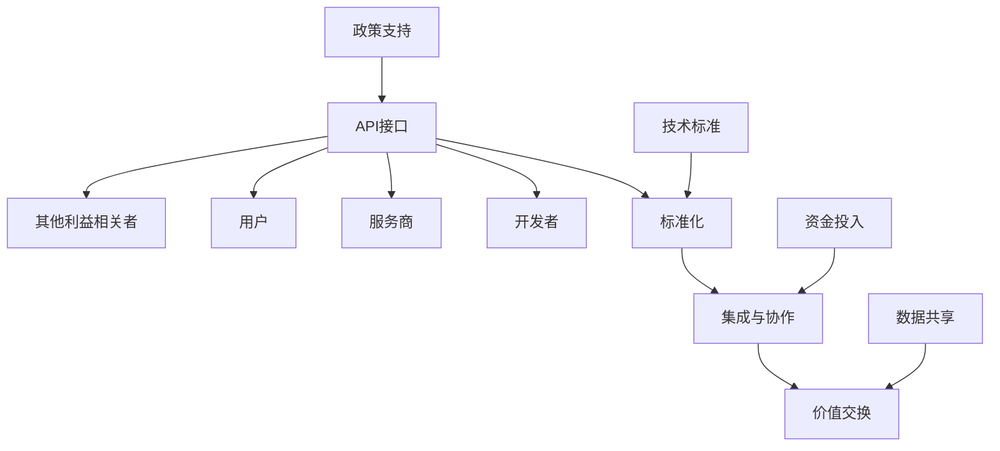

                 

### 背景介绍（Background Introduction）

**API经济：程序员创业的新思路**

在当前数字化、网络化的时代，API（应用程序编程接口）已经成为连接不同软件系统和服务的桥梁。API经济的兴起，为程序员创业者提供了全新的思路和机会。本文将探讨API经济的概念、核心原理、创业路径及其面临的挑战，帮助程序员更好地理解并利用API经济实现创业梦想。

**一、API经济的定义与重要性**

API经济，是指通过API将服务或产品集成到其他应用程序中，实现资源共享和协同工作的一种商业模式。简单来说，就是通过开放API，让第三方开发者能够使用你的服务或数据，从而实现价值创造和共赢。

在数字化时代，API经济的重要性日益凸显。首先，它打破了传统软件行业的封闭壁垒，促进了软件生态系统的繁荣。其次，API经济使得创业者能够快速构建产品，降低研发成本，缩短上市时间。最后，API经济为程序员提供了丰富的创业机会，使得他们不仅能够提供技术服务，还能参与到更广泛的商业生态中。

**二、API经济的核心原理**

API经济的核心在于“开放”和“共享”。具体来说，它包括以下几个方面：

1. **API接口**：提供可编程的接口，使得其他应用程序能够方便地访问和使用你的服务或数据。

2. **标准化**：通过标准化API规范，确保不同系统之间的兼容性和互操作性。

3. **集成与协作**：通过API将不同系统和服务集成在一起，实现数据共享和业务协作。

4. **价值交换**：通过API提供的接口，实现服务或数据的交换和价值创造。

**三、API经济的创业路径**

1. **产品化**：首先，你需要将你的技术或想法转化为一个可产品化的API服务。这需要你对市场需求有深入的理解，并对你的API服务进行精细的设计和优化。

2. **API开放**：通过开放API接口，吸引第三方开发者使用你的服务。这需要你提供优质的服务和便捷的接入方式。

3. **生态构建**：构建一个围绕你的API服务的生态系统，包括开发者、合作伙伴、用户等，实现多方共赢。

4. **商业模式创新**：通过API经济，你可以探索多种商业模式，如订阅制、付费调用、广告收入等，找到最适合你的商业模式。

**四、API经济面临的挑战**

1. **安全问题**：API开放带来了数据泄露和系统攻击的风险，需要加强安全防护措施。

2. **合规问题**：在API经济中，你需要遵守各种法规和标准，如数据保护、隐私保护等。

3. **生态维护**：构建和维护一个健康的生态系统需要持续的努力和投入。

4. **创新压力**：在快速变化的市场中，你需要不断创新，以保持竞争力。

**五、总结**

API经济为程序员创业者提供了丰富的机会和挑战。通过深入理解API经济的核心原理和创业路径，程序员可以更好地把握机遇，实现创业梦想。同时，也需要面对各种挑战，不断提升自身的技术能力和商业洞察力。

在接下来的章节中，我们将进一步探讨API经济的技术细节、实践案例，以及未来发展趋势，帮助程序员更深入地了解API经济的魅力和价值。

---

## Background Introduction
### API Economy: A New Way of Thinking for Programmers Starting Their Own Business

In today's digital and interconnected era, Application Programming Interfaces (APIs) have become the bridges connecting different software systems and services. The rise of the API economy offers programmers a new perspective and opportunities for entrepreneurship. This article will explore the concept of the API economy, its core principles, paths for entrepreneurs, and the challenges they face, helping programmers better understand and leverage the API economy to achieve their entrepreneurial dreams.

**I. Definition and Importance of the API Economy**

The API economy refers to a business model that enables resource sharing and collaborative work by opening up services or products through APIs, allowing third-party developers to use them. In simple terms, it means using open APIs to enable other applications to access and utilize your services or data, thus creating value and achieving mutual benefits.

In the digital age, the importance of the API economy is increasingly evident. Firstly, it breaks down the traditional barriers of the software industry, promoting the prosperity of the software ecosystem. Secondly, it allows entrepreneurs to quickly build products, reduce development costs, and shorten time to market. Finally, the API economy provides programmers with abundant entrepreneurial opportunities, allowing them not only to provide technical services but also to participate in a broader business ecosystem.

**II. Core Principles of the API Economy**

The core principle of the API economy lies in "opening" and "sharing". Specifically, it includes the following aspects:

1. **API Interfaces**: Provide programmable interfaces that allow other applications to easily access and use your services or data.

2. **Standardization**: Standardize API specifications to ensure compatibility and interoperability between different systems.

3. **Integration and Collaboration**: Integrate different systems and services through APIs to achieve data sharing and business collaboration.

4. **Value Exchange**: Exchange services or data through the interfaces provided by APIs to create value.

**III. Entrepreneurial Paths in the API Economy**

1. **Productization**: Firstly, you need to transform your technology or idea into a productizable API service. This requires a deep understanding of market needs and the meticulous design and optimization of your API service.

2. **API Opening**: Open up your API interfaces to attract third-party developers to use your services. This requires you to provide high-quality services and convenient access methods.

3. **Ecosystem Building**: Build an ecosystem around your API service, including developers, partners, and users, to achieve win-win situations.

4. **Business Model Innovation**: Explore various business models through the API economy, such as subscription-based models, paid calls, and advertising revenue, to find the one that best suits you.

**IV. Challenges in the API Economy**

1. **Security Issues**: API openness brings risks of data leakage and system attacks, requiring enhanced security measures.

2. **Compliance Issues**: In the API economy, you need to comply with various regulations and standards, such as data protection and privacy protection.

3. **Ecosystem Maintenance**: Building and maintaining a healthy ecosystem requires continuous efforts and investments.

4. **Innovation Pressure**: In a rapidly changing market, you need to innovate continuously to maintain competitiveness.

**V. Conclusion**

The API economy offers programmers abundant opportunities and challenges. By deeply understanding the core principles and paths of the API economy, programmers can better grasp opportunities and achieve their entrepreneurial dreams. At the same time, they also need to face various challenges and continuously improve their technical capabilities and business insights.

In the following chapters, we will further explore the technical details, practical cases, and future trends of the API economy, helping programmers better understand the charm and value of the API economy. <|im_sep|>### 核心概念与联系（Core Concepts and Connections）

**一、API经济的核心概念**

API经济中涉及的核心概念主要包括API接口、标准化、集成与协作以及价值交换。以下将详细解释这些概念及其相互关系。

1. **API接口（API Interface）**

API接口是API经济的基石，它定义了应用程序之间如何通过编程方式相互通信。API接口通常由一系列的端点（endpoint）和操作（operation）组成，开发者可以通过这些端点调用特定的功能，如获取数据、提交请求等。接口的设计和实现需要遵循一定的规范和标准，以确保不同系统之间的兼容性和互操作性。

2. **标准化（Standardization）**

标准化在API经济中起着至关重要的作用。通过制定和遵守一系列API规范，可以确保不同系统之间的接口一致性和互操作性。常见的API标准化组织包括RESTful API设计指南、OpenAPI Specification等。标准化不仅提高了开发效率，还降低了系统集成的复杂性。

3. **集成与协作（Integration and Collaboration）**

集成与协作是API经济的重要特点。通过开放API接口，不同的系统和服务可以方便地集成在一起，实现数据共享和业务协作。例如，一个电子商务平台可以通过API将支付系统、库存管理系统、物流系统等多个子系统集成在一起，提高业务流程的效率和灵活性。

4. **价值交换（Value Exchange）**

价值交换是API经济的核心驱动因素。通过API接口，服务或数据提供方可以将其资源开放给第三方使用，从而实现价值交换。这种交换可以是直接的经济利益，如付费调用API，也可以是间接的利益，如增加用户粘性、提高品牌知名度等。

**二、核心概念之间的联系**

API接口、标准化、集成与协作以及价值交换之间存在着密切的联系。具体来说：

- API接口是标准化和集成与协作的基础，它提供了程序之间的通信桥梁。
- 标准化确保了API接口的一致性和互操作性，使得不同系统和服务能够无缝集成。
- 集成与协作通过API接口实现了系统之间的数据共享和业务协作，提高了整体效率。
- 价值交换是API经济的最终目标，通过提供有价值的API服务，实现资源的高效利用和商业价值的创造。

**三、API经济的生态系统**

除了上述核心概念，API经济还涉及一个庞大的生态系统，包括开发者、服务商、用户和其他利益相关者。这个生态系统中的各个角色通过API接口相互连接，共同推动API经济的发展。

1. **开发者（Developers）**

开发者是API经济的主要参与者，他们通过创建和使用API接口来实现各种应用和解决方案。开发者可以是独立开发者、企业内部开发团队，也可以是第三方开发者。

2. **服务商（Service Providers）**

服务商提供各种API服务，包括数据服务、功能服务、平台服务等。服务商可以通过开放API接口，让第三方开发者使用其服务，从而实现价值交换。

3. **用户（Users）**

用户是API经济的最终受益者，他们通过使用第三方开发的应用和服务，享受到更加便捷和高效的体验。

4. **其他利益相关者（Other Stakeholders）**

其他利益相关者包括监管机构、标准组织、投资机构等，他们为API经济的发展提供政策支持、技术标准、资金投入等。

**四、API经济的核心原理与架构**

为了更好地理解API经济的核心原理和架构，我们可以使用Mermaid流程图来描述其关键节点和流程。



在这个流程图中，API接口是核心，它通过标准化、集成与协作实现了价值交换。同时，开发者、服务商、用户和其他利益相关者共同构建了一个完整的API经济生态系统。

---

## Core Concepts and Connections
### 1. The Core Concepts of the API Economy

In the API economy, the core concepts include API interfaces, standardization, integration and collaboration, and value exchange. The following will explain these concepts and their interconnections in detail.

**1.1 API Interfaces**

API interfaces are the foundation of the API economy. They define how applications communicate with each other programmatically. API interfaces typically consist of a series of endpoints and operations, through which developers can invoke specific functionalities, such as retrieving data or submitting requests. The design and implementation of interfaces need to adhere to certain standards and specifications to ensure compatibility and interoperability between different systems.

**1.2 Standardization**

Standardization plays a crucial role in the API economy. By establishing and adhering to a set of API specifications, consistency and interoperability across different systems can be ensured. Common API standardization organizations include the RESTful API design guide and the OpenAPI Specification. Standardization not only improves development efficiency but also reduces the complexity of system integration.

**1.3 Integration and Collaboration**

Integration and collaboration are key features of the API economy. By opening up API interfaces, different systems and services can be conveniently integrated, enabling data sharing and business collaboration. For example, an e-commerce platform can integrate payment systems, inventory management systems, and logistics systems through APIs, enhancing the efficiency and flexibility of business processes.

**1.4 Value Exchange**

Value exchange is the core driving force of the API economy. Through API interfaces, service or data providers can open up their resources to third parties for use, thereby achieving value exchange. This exchange can be direct economic benefits, such as paid API calls, or indirect benefits, such as increased user stickiness or brand awareness.

**2. The Connections Between Core Concepts**

API interfaces, standardization, integration and collaboration, and value exchange are closely connected. Specifically:

- API interfaces are the basis for standardization and integration and collaboration, providing the communication bridge between programs.
- Standardization ensures the consistency and interoperability of API interfaces, enabling seamless integration between different systems and services.
- Integration and collaboration, through API interfaces, enable data sharing and business collaboration, improving overall efficiency.
- Value exchange is the ultimate goal of the API economy, realizing efficient resource utilization and commercial value creation through the provision of valuable API services.

**3. The Ecosystem of the API Economy**

In addition to the above core concepts, the API economy involves a vast ecosystem, including developers, service providers, users, and other stakeholders. The roles in this ecosystem connect through API interfaces, jointly driving the development of the API economy.

**3.1 Developers**

Developers are the main participants in the API economy. They create and use API interfaces to implement various applications and solutions. Developers can be independent developers, internal development teams of enterprises, or third-party developers.

**3.2 Service Providers**

Service providers offer various API services, including data services, functional services, and platform services. Service providers can open up their APIs to third-party developers for use, thereby achieving value exchange.

**3.3 Users**

Users are the ultimate beneficiaries of the API economy. They enjoy more convenient and efficient experiences through the use of third-party developed applications and services.

**3.4 Other Stakeholders**

Other stakeholders include regulatory agencies, standard-setting organizations, and investment institutions, which provide policy support, technical standards, and capital investment for the development of the API economy.

**4. The Core Principles and Architecture of the API Economy**

To better understand the core principles and architecture of the API economy, we can use a Mermaid flowchart to describe the key nodes and processes.


In this flowchart, the API interface is the core, connecting through standardization, integration and collaboration to achieve value exchange. At the same time, developers, service providers, users, and other stakeholders collectively build a complete API economic ecosystem. <|im_sep|>### 核心算法原理 & 具体操作步骤（Core Algorithm Principles and Specific Operational Steps）

**一、API调用的基本原理**

API（应用程序编程接口）是一种在软件应用程序之间进行通信的接口。它允许不同的软件系统相互交互，实现功能共享和数据交换。API调用是指一个应用程序通过调用另一个应用程序提供的接口来请求服务或数据的过程。

1. **请求与响应**

API调用通常包括一个请求和一个响应。请求是调用者发送给API服务器的一组参数和指令，请求可以是GET、POST、PUT、DELETE等HTTP方法之一。响应是API服务器返回给调用者的一组数据，通常是JSON或XML格式。

2. **RESTful API**

在API设计中，RESTful API是一种非常流行的设计风格。它基于HTTP协议，使用GET、POST、PUT、DELETE等HTTP方法来表示操作。RESTful API的设计原则包括资源定位、无状态性、统一接口等。

3. **API版本控制**

随着应用程序的演进，API可能会进行更新和迭代。为了保持兼容性，通常需要对API进行版本控制。常见的版本控制方法包括URL版本控制、参数版本控制等。

**二、API调用的一般步骤**

以下是进行API调用的一般步骤：

1. **确定API接口**

首先，你需要确定需要调用的API接口。这通常包括API的URL、请求方法和请求参数等。

2. **准备请求参数**

根据API接口的要求，准备相应的请求参数。这些参数可以是简单的键值对，也可以是复杂的对象结构。

3. **发送请求**

使用适当的编程语言和库，发送API请求。在Python中，可以使用requests库轻松发送HTTP请求。

4. **处理响应**

接收API响应后，处理响应数据。通常，你需要检查响应的状态码和内容，并根据需要解析JSON或XML数据。

**三、API调用的示例代码**

以下是一个使用Python和requests库调用RESTful API的示例：

```python
import requests

# 设置API接口的URL
url = 'https://api.example.com/data'

# 准备请求参数
params = {
    'key1': 'value1',
    'key2': 'value2'
}

# 发送GET请求
response = requests.get(url, params=params)

# 检查响应状态码
if response.status_code == 200:
    # 解析响应数据
    data = response.json()
    print(data)
else:
    print('Error:', response.status_code)
```

在这个示例中，我们首先设置了API接口的URL和请求参数，然后使用requests库发送GET请求。如果响应状态码为200（成功），我们解析JSON响应数据并打印出来。否则，打印错误信息。

**四、API调用中的常见问题与解决方案**

1. **超时问题**

API调用超时可能是由于网络问题或服务器负载过重导致的。解决方法包括：

- 增加请求的超时时间。
- 检查网络连接，确保API服务器可达。
- 调整服务器配置，提高处理能力。

2. **数据格式错误**

API响应的数据格式不正确可能是由于API接口更新或调用参数错误导致的。解决方法包括：

- 检查API接口的文档，确保调用参数正确。
- 检查API接口的版本，确保与调用代码兼容。
- 调整调用代码，解析不同格式的响应数据。

3. **权限问题**

API调用失败可能是由于权限不足导致的。解决方法包括：

- 确保调用者有权限访问API接口。
- 检查API接口的认证机制，确保调用者身份验证正确。
- 调整API接口的权限设置，允许调用者访问所需资源。

通过以上步骤和示例，我们可以更好地理解API调用的基本原理和操作步骤。在实践过程中，我们需要注意常见问题，并采取相应的解决方案，以确保API调用的成功和高效。

---

## Core Algorithm Principles and Specific Operational Steps
### 1. The Basic Principles of API Calling

API (Application Programming Interface) is an interface that allows software applications to communicate with each other. It enables different software systems to share functionalities and exchange data. API calling refers to the process in which one application requests services or data from another application through its interface.

**1.1 Request and Response**

API calling typically involves a request and a response. A request is a set of parameters and instructions sent by the caller to the API server, and a response is a set of data returned by the API server to the caller. The response is usually in JSON or XML format.

**1.2 RESTful API**

RESTful API is a popular design style in API design. It is based on the HTTP protocol and uses HTTP methods such as GET, POST, PUT, DELETE to represent operations. The design principles of RESTful API include resource identification, statelessness, and a uniform interface.

**1.3 API Version Control**

As applications evolve, APIs may be updated and iterated. To maintain compatibility, API version control is often necessary. Common methods of version control include URL version control and parameter version control.

**2. General Steps of API Calling**

The following are the general steps for making an API call:

**Step 1:** Determine the API interface. This typically includes the API URL, request method, and request parameters.

**Step 2:** Prepare the request parameters. According to the API interface requirements, prepare the corresponding request parameters. These parameters can be simple key-value pairs or complex object structures.

**Step 3:** Send the request. Use the appropriate programming language and libraries to send the HTTP request. In Python, the `requests` library can be used to easily send HTTP requests.

**Step 4:** Handle the response. After receiving the API response, handle the response data. Typically, you need to check the status code and content of the response and parse the JSON or XML data as needed.

**3. Example Code for API Calling**

The following is an example of calling a RESTful API using Python and the `requests` library:

```python
import requests

# Set the API URL
url = 'https://api.example.com/data'

# Prepare the request parameters
params = {
    'key1': 'value1',
    'key2': 'value2'
}

# Send a GET request
response = requests.get(url, params=params)

# Check the response status code
if response.status_code == 200:
    # Parse the response data
    data = response.json()
    print(data)
else:
    print('Error:', response.status_code)
```

In this example, we first set the API URL and request parameters, then use the `requests` library to send a GET request. If the response status code is 200 (success), we parse the JSON response data and print it. Otherwise, we print an error message.

**4. Common Issues in API Calling and Solutions**

**4.1 Timeout Issues**

API call timeouts can be caused by network issues or heavy server loads. Solutions include:

- Increasing the request timeout.
- Checking the network connection to ensure the API server is reachable.
- Adjusting server configurations to improve processing capabilities.

**4.2 Data Format Errors**

Incorrect data formats in API responses can be caused by API updates or incorrect request parameters. Solutions include:

- Checking the API documentation to ensure the request parameters are correct.
- Checking the API version to ensure compatibility with the calling code.
- Adjusting the calling code to parse responses in different formats.

**4.3 Permission Issues**

API call failures can be caused by insufficient permissions. Solutions include:

- Ensuring the caller has permission to access the API interface.
- Checking the API authentication mechanism to ensure the caller's identity is verified correctly.
- Adjusting API permissions to allow access to required resources.

By following these steps and examples, we can better understand the basic principles and operational steps of API calling. In practice, we need to pay attention to common issues and adopt appropriate solutions to ensure successful and efficient API calls. <|im_sep|>### 数学模型和公式 & 详细讲解 & 举例说明（Mathematical Models and Formulas, Detailed Explanation and Examples）

**一、API调用次数的计算**

在API经济中，调用次数是衡量API服务使用情况的重要指标。假设一个API服务每小时最多支持1000次调用，我们需要计算在特定时间段内的最大调用次数。

1. **数学模型**

令\(N\)为调用次数，\(t\)为时间段（小时），\(C\)为每小时最大调用次数，则数学模型可以表示为：

\[ N = C \times t \]

2. **公式**

\[ C = \frac{N}{t} \]

3. **举例说明**

假设一个API服务在3小时内需要处理5000次调用，计算每小时的最大调用次数。

根据公式，我们有：

\[ C = \frac{5000}{3} \approx 1666.67 \]

因此，每小时的最大调用次数约为1667次。

**二、API调用延迟的优化**

API调用延迟是影响用户体验的重要因素。为了优化API调用延迟，我们可以使用以下数学模型来计算最佳的调用策略。

1. **数学模型**

令\(L\)为调用延迟，\(d\)为每次调用的延迟，\(n\)为调用次数，则数学模型可以表示为：

\[ L = d \times n \]

2. **公式**

\[ d = \frac{L}{n} \]

3. **举例说明**

假设一个API服务的平均调用延迟为500ms，需要处理100次调用，计算每次调用的延迟。

根据公式，我们有：

\[ d = \frac{500}{100} = 5 \]

因此，每次调用的延迟为5ms。

**三、API服务定价模型**

API服务的定价策略直接影响其盈利能力和市场竞争力。我们可以使用以下数学模型来设计一个合理的定价模型。

1. **数学模型**

令\(P\)为单价，\(V\)为每次调用的价值，\(Q\)为调用次数，则数学模型可以表示为：

\[ P = \frac{V \times Q}{N} \]

2. **公式**

\[ V = P \times N \div Q \]

\[ Q = \frac{P \times N}{V} \]

3. **举例说明**

假设一个API服务的每次调用价值为10元，每月最多支持10000次调用，单价为5元，计算每月的调用次数。

根据公式，我们有：

\[ V = 5 \times 10000 = 50000 \]

\[ Q = \frac{5 \times 10000}{10} = 5000 \]

因此，每月的调用次数为5000次。

**四、API调用成本的计算**

API调用成本是开发者在使用API服务时需要考虑的重要因素。我们可以使用以下数学模型来计算API调用成本。

1. **数学模型**

令\(C\)为调用成本，\(C_p\)为每次调用的成本，\(N\)为调用次数，则数学模型可以表示为：

\[ C = C_p \times N \]

2. **公式**

\[ C_p = \frac{C}{N} \]

3. **举例说明**

假设一个API服务的每次调用成本为0.1元，需要处理1000次调用，计算总成本。

根据公式，我们有：

\[ C_p = \frac{0.1}{1000} = 0.0001 \]

\[ C = 0.0001 \times 1000 = 0.1 \]

因此，总成本为0.1元。

通过以上数学模型和公式，我们可以更科学地设计和优化API服务，提高其性能和盈利能力。在实践过程中，开发者可以根据具体需求和场景调整这些模型和参数，以实现最佳效果。

---

## Mathematical Models and Formulas, Detailed Explanation and Examples
### 1. Calculation of API Call次数

In the API economy, the number of API calls is a key indicator of the usage of an API service. Suppose an API service supports a maximum of 1000 calls per hour, and we need to calculate the maximum number of calls within a specific time period.

**1.1 Mathematical Model**

Let \(N\) be the number of calls, \(t\) be the time period (in hours), and \(C\) be the maximum number of calls per hour. The mathematical model can be represented as:

\[ N = C \times t \]

**1.2 Formula**

\[ C = \frac{N}{t} \]

**1.3 Example**

Suppose an API service needs to handle 5000 calls within 3 hours. Calculate the maximum number of calls per hour.

Using the formula, we have:

\[ C = \frac{5000}{3} \approx 1666.67 \]

Therefore, the maximum number of calls per hour is approximately 1667.

### 2. Optimization of API Call Delay

API call delay is a significant factor affecting user experience. To optimize API call delay, we can use the following mathematical model to calculate the optimal calling strategy.

**2.1 Mathematical Model**

Let \(L\) be the call delay, \(d\) be the delay per call, and \(n\) be the number of calls. The mathematical model can be represented as:

\[ L = d \times n \]

**2.2 Formula**

\[ d = \frac{L}{n} \]

**2.3 Example**

Suppose an API service has an average call delay of 500ms and needs to handle 100 calls. Calculate the delay per call.

Using the formula, we have:

\[ d = \frac{500}{100} = 5 \]

Therefore, the delay per call is 5ms.

### 3. Pricing Model for API Services

The pricing strategy of an API service directly impacts its profitability and market competitiveness. We can use the following mathematical model to design a reasonable pricing model.

**3.1 Mathematical Model**

Let \(P\) be the unit price, \(V\) be the value of each call, \(Q\) be the number of calls, and \(N\) be the maximum number of calls. The mathematical model can be represented as:

\[ P = \frac{V \times Q}{N} \]

**3.2 Formula**

\[ V = P \times N \div Q \]

\[ Q = \frac{P \times N}{V} \]

**3.3 Example**

Suppose an API service has a unit price of 5 yuan, a value of 10 yuan per call, and a maximum of 10000 calls per month. Calculate the number of calls per month.

Using the formulas, we have:

\[ V = 5 \times 10000 = 50000 \]

\[ Q = \frac{5 \times 10000}{10} = 5000 \]

Therefore, the number of calls per month is 5000.

### 4. Calculation of API Call Cost

API call cost is a significant consideration for developers using API services. We can use the following mathematical model to calculate the cost of API calls.

**4.1 Mathematical Model**

Let \(C\) be the call cost, \(C_p\) be the cost per call, and \(N\) be the number of calls. The mathematical model can be represented as:

\[ C = C_p \times N \]

**4.2 Formula**

\[ C_p = \frac{C}{N} \]

**4.3 Example**

Suppose an API service has a cost of 0.1 yuan per call and needs to handle 1000 calls. Calculate the total cost.

Using the formulas, we have:

\[ C_p = \frac{0.1}{1000} = 0.0001 \]

\[ C = 0.0001 \times 1000 = 0.1 \]

Therefore, the total cost is 0.1 yuan.

By using these mathematical models and formulas, we can design and optimize API services more scientifically, enhancing their performance and profitability. In practice, developers can adjust these models and parameters according to specific needs and scenarios to achieve optimal results. <|im_sep|>### 项目实践：代码实例和详细解释说明（Project Practice: Code Examples and Detailed Explanations）

**一、API服务开发环境搭建**

在进行API服务开发之前，我们需要搭建一个合适的开发环境。以下是一个基本的开发环境搭建步骤：

1. **安装Python**

首先，确保你的系统上安装了Python。你可以从Python官网下载最新版本的Python并安装。

2. **安装虚拟环境**

为了隔离项目依赖，我们使用虚拟环境。安装虚拟环境工具`virtualenv`：

```bash
pip install virtualenv
```

然后创建一个虚拟环境：

```bash
virtualenv api_project
```

激活虚拟环境：

```bash
source api_project/bin/activate
```

3. **安装Flask**

`Flask`是一个轻量级的Web框架，非常适合用于构建API服务。在虚拟环境中安装Flask：

```bash
pip install flask
```

**二、源代码详细实现**

以下是一个简单的Flask API服务的源代码示例，该服务提供了一个获取用户信息的接口。

```python
from flask import Flask, jsonify, request

app = Flask(__name__)

users = {
    'user1': {'name': 'Alice', 'age': 30},
    'user2': {'name': 'Bob', 'age': 25},
    'user3': {'name': 'Charlie', 'age': 35}
}

@app.route('/users', methods=['GET'])
def get_users():
    return jsonify(users)

@app.route('/users/<username>', methods=['GET'])
def get_user(username):
    user = users.get(username)
    if user:
        return jsonify(user)
    else:
        return jsonify({'error': 'User not found'}), 404

@app.route('/users', methods=['POST'])
def create_user():
    data = request.get_json()
    username = data.get('username')
    if username in users:
        return jsonify({'error': 'User already exists'}), 400
    users[username] = data
    return jsonify(users[username]), 201

if __name__ == '__main__':
    app.run(debug=True)
```

**三、代码解读与分析**

1. **导入模块**

```python
from flask import Flask, jsonify, request
```

这个部分导入了Flask框架的基本模块，包括Flask应用对象、JSON响应函数以及请求处理对象。

2. **定义用户数据**

```python
users = {
    'user1': {'name': 'Alice', 'age': 30},
    'user2': {'name': 'Bob', 'age': 25},
    'user3': {'name': 'Charlie', 'age': 35}
}
```

这是一个简单的用户数据字典，其中存储了三个用户的信息。

3. **定义路由和视图函数**

```python
@app.route('/users', methods=['GET'])
def get_users():
    return jsonify(users)

@app.route('/users/<username>', methods=['GET'])
def get_user(username):
    user = users.get(username)
    if user:
        return jsonify(user)
    else:
        return jsonify({'error': 'User not found'}), 404

@app.route('/users', methods=['POST'])
def create_user():
    data = request.get_json()
    username = data.get('username')
    if username in users:
        return jsonify({'error': 'User already exists'}), 400
    users[username] = data
    return jsonify(users[username]), 201
```

这部分代码定义了三个路由：

- `GET /users`：获取所有用户信息。
- `GET /users/<username>`：获取指定用户信息。
- `POST /users`：创建新用户。

每个路由对应一个视图函数，用于处理HTTP请求并返回响应。

4. **主程序**

```python
if __name__ == '__main__':
    app.run(debug=True)
```

这个部分是Flask应用的入口，当直接运行该Python文件时，会启动Flask应用。

**四、运行结果展示**

1. **获取所有用户信息**

在浏览器中输入以下URL：

```
http://127.0.0.1:5000/users
```

你将获得以下JSON响应：

```json
{
  "user1": {"name": "Alice", "age": 30},
  "user2": {"name": "Bob", "age": 25},
  "user3": {"name": "Charlie", "age": 35}
}
```

2. **获取指定用户信息

在浏览器中输入以下URL：

```
http://127.0.0.1:5000/users/user1
```

你将获得以下JSON响应：

```json
{
  "name": "Alice",
  "age": 30
}
```

3. **创建新用户

在浏览器中输入以下URL，并使用POST请求发送JSON格式的用户数据：

```
http://127.0.0.1:5000/users
```

例如，发送以下数据：

```json
{
  "username": "user4",
  "name": "David",
  "age": 28
}
```

你将获得以下JSON响应：

```json
{
  "username": "user4",
  "name": "David",
  "age": 28
}
```

通过这个简单的示例，我们可以看到如何使用Flask框架快速构建一个API服务。在实际项目中，你可能需要处理更复杂的业务逻辑和数据结构，但基本思路和步骤是类似的。

---

## Project Practice: Code Examples and Detailed Explanations
### 1. Setting Up the Development Environment for API Services

Before developing an API service, we need to set up a suitable development environment. Here are the basic steps to set up a development environment:

**1.1 Installing Python**

First, make sure Python is installed on your system. You can download the latest version of Python from the Python official website and install it.

**1.2 Installing Virtual Environment**

To isolate project dependencies, we use a virtual environment. Install the `virtualenv` tool:

```bash
pip install virtualenv
```

Then create a virtual environment:

```bash
virtualenv api_project
```

Activate the virtual environment:

```bash
source api_project/bin/activate
```

**1.3 Installing Flask**

`Flask` is a lightweight web framework that is well-suited for building API services. Install Flask in the virtual environment:

```bash
pip install flask
```

### 2. Detailed Source Code Implementation

Here's a simple example of a Flask API service that provides endpoints to get user information:

```python
from flask import Flask, jsonify, request

app = Flask(__name__)

users = {
    'user1': {'name': 'Alice', 'age': 30},
    'user2': {'name': 'Bob', 'age': 25},
    'user3': {'name': 'Charlie', 'age': 35}
}

@app.route('/users', methods=['GET'])
def get_users():
    return jsonify(users)

@app.route('/users/<username>', methods=['GET'])
def get_user(username):
    user = users.get(username)
    if user:
        return jsonify(user)
    else:
        return jsonify({'error': 'User not found'}), 404

@app.route('/users', methods=['POST'])
def create_user():
    data = request.get_json()
    username = data.get('username')
    if username in users:
        return jsonify({'error': 'User already exists'}), 400
    users[username] = data
    return jsonify(users[username]), 201

if __name__ == '__main__':
    app.run(debug=True)
```

### 3. Code Interpretation and Analysis

**3.1 Import Modules**

```python
from flask import Flask, jsonify, request
```

This part imports the basic modules of the Flask framework, including the Flask application object, the JSON response function, and the request processing object.

**3.2 Define User Data**

```python
users = {
    'user1': {'name': 'Alice', 'age': 30},
    'user2': {'name': 'Bob', 'age': 25},
    'user3': {'name': 'Charlie', 'age': 35}
}
```

This is a simple dictionary of user data, storing information about three users.

**3.3 Define Routes and View Functions**

```python
@app.route('/users', methods=['GET'])
def get_users():
    return jsonify(users)

@app.route('/users/<username>', methods=['GET'])
def get_user(username):
    user = users.get(username)
    if user:
        return jsonify(user)
    else:
        return jsonify({'error': 'User not found'}), 404

@app.route('/users', methods=['POST'])
def create_user():
    data = request.get_json()
    username = data.get('username')
    if username in users:
        return jsonify({'error': 'User already exists'}), 400
    users[username] = data
    return jsonify(users[username]), 201
```

This part defines three routes:

- `GET /users`: Get all user information.
- `GET /users/<username>`: Get specific user information.
- `POST /users`: Create a new user.

Each route corresponds to a view function that handles HTTP requests and returns responses.

**3.4 Main Program**

```python
if __name__ == '__main__':
    app.run(debug=True)
```

This part is the entry point of the Flask application. When running this Python file directly, it starts the Flask application.

### 4. Running Results Display

**4.1 Get All User Information**

Enter the following URL in the browser:

```
http://127.0.0.1:5000/users
```

You will receive the following JSON response:

```json
{
  "user1": {"name": "Alice", "age": 30},
  "user2": {"name": "Bob", "age": 25},
  "user3": {"name": "Charlie", "age": 35}
}
```

**4.2 Get Specific User Information**

Enter the following URL in the browser:

```
http://127.0.0.1:5000/users/user1
```

You will receive the following JSON response:

```json
{
  "name": "Alice",
  "age": 30
}
```

**4.3 Create a New User**

Enter the following URL in the browser and send the JSON formatted user data using a POST request:

```
http://127.0.0.1:5000/users
```

For example, send the following data:

```json
{
  "username": "user4",
  "name": "David",
  "age": 28
}
```

You will receive the following JSON response:

```json
{
  "username": "user4",
  "name": "David",
  "age": 28
}
```

Through this simple example, we can see how to quickly build an API service using the Flask framework. In actual projects, you may need to handle more complex business logic and data structures, but the basic approach and steps are similar. <|im_sep|>### 实际应用场景（Practical Application Scenarios）

**一、电子商务平台**

API经济在电子商务平台中的应用非常广泛。例如，一个电商平台可以通过API将支付、物流、库存管理等系统集成在一起，提供统一的接口供第三方开发者使用。这种集成不仅提高了平台的灵活性，还降低了第三方开发者的开发成本。

1. **支付集成**

电商平台可以通过API与支付服务提供商集成，如支付宝、微信支付等。这样，用户可以直接在购物平台上完成支付，而不需要跳转到第三方支付页面。

2. **物流集成**

电商平台可以通过物流API与快递公司集成，实时获取物流信息，提高物流追踪的透明度和效率。

3. **库存管理**

电商平台可以通过库存管理API与仓库管理系统集成，实时更新库存信息，避免超卖和断货。

**二、社交媒体平台**

社交媒体平台通过API对外开放，允许第三方开发者创建各种应用和服务。这种开放策略不仅增加了平台的用户粘性，还促进了生态系统的繁荣。

1. **社交媒体分享**

第三方应用可以通过社交媒体平台的API实现一键分享功能，将内容分享到社交媒体平台上。

2. **社交互动**

第三方应用可以通过API实现评论、点赞、分享等社交互动功能，增强用户体验。

3. **用户数据获取**

社交媒体平台可以通过API向第三方开发者提供用户数据，如用户画像、行为数据等，用于市场分析和个性化推荐。

**三、智能家居系统**

智能家居系统通过API与各种智能设备集成，实现远程控制和自动化管理。这种集成不仅提高了生活的便利性，还实现了能源的高效利用。

1. **远程控制**

用户可以通过智能手机或其他设备远程控制家中的智能设备，如灯光、空调、门锁等。

2. **自动化管理**

智能家居系统可以通过API实现自动化管理，如定时开关灯、自动调节空调温度等。

3. **能源监控**

智能家居系统可以通过API监控家庭能源消耗情况，实现节能减排。

**四、企业级应用**

API经济在企业级应用中也得到了广泛应用。企业可以通过API将内部系统与外部服务集成，提高业务效率和数据利用率。

1. **客户关系管理**

企业可以通过API将CRM系统与外部数据源集成，如社交媒体、电商平台等，实现全面的客户数据分析。

2. **供应链管理**

企业可以通过API将供应链管理系统与供应商、物流公司等集成，实现供应链的实时监控和优化。

3. **数据分析**

企业可以通过API获取大量的业务数据，结合数据分析工具，实现业务洞察和决策支持。

通过以上实际应用场景，我们可以看到API经济在各个领域的重要性和广泛应用。API不仅为企业提供了新的商业模式和增长机会，也为用户带来了更加便捷和个性化的体验。

---

## Practical Application Scenarios

**I. E-commerce Platforms**

API economy is widely applied in e-commerce platforms. For example, an e-commerce platform can integrate various systems such as payment, logistics, and inventory management through APIs, providing unified interfaces for third-party developers to use. This integration not only improves the platform's flexibility but also reduces the development costs for third-party developers.

**1. Payment Integration**

E-commerce platforms can integrate with payment service providers like Alipay and WeChat Pay through APIs, allowing users to complete payments directly on the shopping platform without jumping to third-party payment pages.

**2. Logistics Integration**

E-commerce platforms can integrate with logistics companies through logistics APIs to get real-time logistics information, improving the transparency and efficiency of logistics tracking.

**3. Inventory Management**

E-commerce platforms can integrate with warehouse management systems through inventory management APIs to real-time update inventory information, avoiding over-selling and stockouts.

**II. Social Media Platforms**

Social media platforms open up their APIs to allow third-party developers to create various applications and services. This open strategy not only increases user stickiness but also promotes the prosperity of the ecosystem.

**1. Social Sharing**

Third-party applications can implement one-click sharing features to social media platforms through APIs.

**2. Social Interaction**

Third-party applications can implement social interaction features like comments, likes, and shares through APIs, enhancing user experience.

**3. User Data Access**

Social media platforms can provide third-party developers with user data such as user profiles and behavior data through APIs for market analysis and personalized recommendations.

**III. Smart Home Systems**

Smart home systems integrate various smart devices through APIs to achieve remote control and automated management. This integration not only improves the convenience of life but also achieves efficient energy use.

**1. Remote Control**

Users can remotely control smart devices in their homes, such as lights, air conditioners, and door locks, through smartphones or other devices.

**2. Automated Management**

Smart home systems can automate management tasks such as scheduled lighting and automatic adjustment of air conditioner temperatures through APIs.

**3. Energy Monitoring**

Smart home systems can monitor energy consumption in the home through APIs to achieve energy saving and emissions reduction.

**IV. Enterprise Applications**

API economy is widely used in enterprise applications. Enterprises can integrate internal systems with external services through APIs to improve business efficiency and data utilization.

**1. Customer Relationship Management**

Enterprises can integrate CRM systems with external data sources such as social media and e-commerce platforms through APIs to achieve comprehensive customer data analysis.

**2. Supply Chain Management**

Enterprises can integrate supply chain management systems with suppliers and logistics companies through APIs to achieve real-time monitoring and optimization of the supply chain.

**3. Data Analysis**

Enterprises can obtain large amounts of business data through APIs and combine it with data analysis tools to gain insights and support decision-making.

Through the above practical application scenarios, we can see the importance and wide application of the API economy in various fields. APIs not only provide enterprises with new business models and growth opportunities but also bring more convenient and personalized experiences to users. <|im_sep|>### 工具和资源推荐（Tools and Resources Recommendations）

**一、学习资源推荐**

1. **书籍**

   - 《API设计指南》（API Design for C++）by Martin Reddy
   - 《RESTful Web API设计》（Designing RESTful Web APIs）by Mark Mascolaco
   - 《微服务设计》（Designing Microservices）by Sam Newman

2. **论文**

   - "Principles of API Design" by Google
   - "Building APIs with Google Cloud" by Google Cloud
   - "API Design Patterns" by Spring Framework

3. **博客和网站**

   - API Design Guidelines（https://developer.mozilla.org/en-US/docs/Web/API/W3C_APIs/Using_APIs）
   - RESTful API Design（https://restfulapi.net/）
   - Postman API Development（https://www.postman.com/）

**二、开发工具框架推荐**

1. **框架**

   - Flask（Python）：一个轻量级的Web框架，适合构建简单的API服务。
   - Express（Node.js）：一个快速且灵活的Web应用框架，适用于构建高性能的API服务。
   - Django（Python）：一个高级的Python Web框架，适合快速开发和部署复杂的API服务。

2. **代码编辑器**

   - Visual Studio Code：一个跨平台、高性能的代码编辑器，支持多种编程语言和API开发工具。
   - Sublime Text：一个轻量级的代码编辑器，适合快速开发API服务。
   - IntelliJ IDEA：一个强大的集成开发环境，适用于Java和Python等语言的API开发。

3. **API测试工具**

   - Postman：一个流行的API测试工具，支持自动化测试、文档生成等。
   - Apigee：一个全面的API管理平台，提供API测试、监控和文档生成等功能。
   - Swagger：一个用于生成、描述和测试RESTful API的规范，支持自动生成API文档。

**三、相关论文著作推荐**

1. "API Design: How to Design a Great API" by Martin Fowler
2. "Microservices: Designing Fine-Grained Systems" by Sam Newman
3. "Building APIs You Won't Hate" by Phil Sturgeon

通过以上工具和资源的推荐，开发者可以更好地学习和实践API经济相关的知识和技能，提高API服务的开发效率和质量。

---

## Tools and Resources Recommendations
### 1. Learning Resources Recommendations

**1. Books**

- "API Design for C++" by Martin Reddy: This book provides in-depth guidance on designing APIs in C++.
- "Designing RESTful Web APIs" by Mark Mascolaco: This book offers best practices for designing RESTful APIs.
- "Designing Microservices" by Sam Newman: This book delves into the principles and practices of designing microservices architectures.

**2. Papers**

- "Principles of API Design" by Google: This paper outlines key principles for designing robust and scalable APIs.
- "Building APIs with Google Cloud" by Google Cloud: This paper provides guidelines for building APIs using Google Cloud services.
- "API Design Patterns" by Spring Framework: This paper explores common design patterns for API development.

**3. Blogs and Websites**

- API Design Guidelines (https://developer.mozilla.org/en-US/docs/Web/API/W3C_APIs/Using_APIs): This resource provides guidelines for designing web APIs.
- RESTful API Design (https://restfulapi.net/): This website offers insights and resources on RESTful API design.
- Postman API Development (https://www.postman.com/): Postman's official website provides documentation, tutorials, and resources for API development.

### 2. Development Tool Framework Recommendations

**1. Frameworks**

- Flask (Python): A lightweight web framework suitable for building simple API services.
- Express (Node.js): A fast and flexible web application framework for high-performance API services.
- Django (Python): An advanced Python web framework for rapid development and deployment of complex API services.

**2. Code Editors**

- Visual Studio Code: A cross-platform, high-performance code editor with extensive support for various programming languages and API development tools.
- Sublime Text: A lightweight code editor suitable for quick API development.
- IntelliJ IDEA: A powerful integrated development environment with strong support for Java and Python API development.

**3. API Testing Tools**

- Postman: A popular API testing tool that supports automated testing and documentation generation.
- Apigee: A comprehensive API management platform offering testing, monitoring, and documentation features.
- Swagger: A specification for generating, describing, and testing RESTful APIs with automatic documentation generation.

### 3. Recommended Papers and Publications

- "API Design: How to Design a Great API" by Martin Fowler: This paper discusses the essential principles of API design.
- "Microservices: Designing Fine-Grained Systems" by Sam Newman: This paper covers the design principles and practices for microservices architectures.
- "Building APIs You Won't Hate" by Phil Sturgeon: This paper provides practical advice on building user-friendly and maintainable APIs.

Through these recommended tools and resources, developers can enhance their understanding and practical skills in API economy, improving the efficiency and quality of API service development. <|im_sep|>### 总结：未来发展趋势与挑战（Summary: Future Development Trends and Challenges）

**一、未来发展趋势**

1. **API经济的深化与拓展**

随着数字化转型的深入推进，API经济将不仅仅局限于软件和服务领域，还将扩展到更多的行业和应用场景，如物联网、人工智能、区块链等。

2. **API接口的智能化与自适应**

未来的API接口将更加智能化，能够根据用户需求和应用场景自适应调整。例如，基于机器学习的API预测模型，可以预测API调用的模式和频率，从而优化资源分配和响应速度。

3. **API安全性的提升**

随着API经济规模的扩大，安全性问题将更加突出。未来，API安全性的提升将是发展的重点，包括身份验证、数据加密、安全审计等方面的技术进步。

4. **API生态的完善**

API生态的完善将有助于促进API经济的发展。这包括API设计标准、开发工具、测试工具、认证体系等的完善，以及更多开发者社区和平台的涌现。

**二、面临的挑战**

1. **安全风险**

API开放带来了安全风险，如数据泄露、系统攻击等。如何确保API的安全性，将是API经济面临的重大挑战。

2. **合规性**

随着法规的不断更新，API开发者需要确保其服务符合各种法律法规，如数据保护法、隐私保护法等。合规性将影响API服务的可用性和市场竞争力。

3. **技术复杂性**

API经济的快速发展，带来了技术复杂性的增加。如何高效地开发、维护和管理大量的API服务，是开发者面临的一大挑战。

4. **生态系统维护**

构建和维护一个健康的API生态系统需要持续的努力和资源投入。如何吸引和留住开发者、合作伙伴和用户，是API经济需要解决的关键问题。

**三、展望**

API经济将继续快速发展，为程序员创业者提供更多机会。面对未来，程序员需要不断提升自身的技能和业务洞察力，积极应对各种挑战，抓住API经济带来的发展机遇。

---

## Summary: Future Development Trends and Challenges
### 1. Future Development Trends

**1. Deepening and Expansion of the API Economy**

As digital transformation continues to advance, the API economy is expected to extend beyond the software and service sectors to include more industries and application scenarios, such as the Internet of Things (IoT), artificial intelligence (AI), and blockchain.

**2. Intelligent and Adaptive API Interfaces**

Future API interfaces will become more intelligent and adaptive, capable of adjusting based on user needs and application scenarios. For example, machine learning-based API prediction models can predict API call patterns and frequencies to optimize resource allocation and response speed.

**3. Enhanced API Security**

With the expansion of the API economy, security concerns will become more prominent. Enhancements in API security, including authentication, data encryption, and security auditing, will be a key focus in the future.

**4. Mature Ecosystems**

The maturity of the API ecosystem will play a crucial role in the growth of the API economy. This includes the improvement of API design standards, development tools, testing tools, certification systems, and the emergence of more developer communities and platforms.

### 2. Challenges Facing the API Economy

**1. Security Risks**

API openness brings security risks such as data breaches and system attacks. Ensuring the security of APIs will be a significant challenge.

**2. Compliance**

With the continuous update of regulations, API developers need to ensure that their services comply with various laws and regulations, such as data protection laws and privacy protection laws. Compliance will impact the availability and competitiveness of API services.

**3. Technical Complexity**

The rapid growth of the API economy has increased technical complexity. Efficiently developing, maintaining, and managing a large number of API services is a major challenge for developers.

**4. Ecosystem Maintenance**

Building and maintaining a healthy API ecosystem requires continuous efforts and resources. Attracting and retaining developers, partners, and users are key issues that the API economy needs to address.

### 3. Outlook

The API economy will continue to grow rapidly, offering programmers and entrepreneurs more opportunities. In the face of the future, programmers need to continuously improve their skills and business insights, actively respond to various challenges, and seize the development opportunities brought by the API economy. <|im_sep|>### 附录：常见问题与解答（Appendix: Frequently Asked Questions and Answers）

**一、什么是API经济？**

API经济是指通过开放应用程序编程接口（API），使第三方开发者能够使用企业或平台的服务或数据，实现资源共享和协同工作的一种商业模式。它打破了传统软件行业的封闭壁垒，促进了软件生态系统的繁荣。

**二、API经济有哪些优势？**

API经济的优势包括：

1. **提高开发效率**：开发者可以通过API快速接入外部服务，降低开发成本和缩短开发时间。
2. **促进创新**：开放的API接口鼓励开发者创造新的应用和服务，推动整个生态系统的创新。
3. **资源共享**：通过API，企业可以将其资源开放给第三方使用，实现资源共享和协同工作。
4. **降低风险**：企业可以通过开放API减少对特定平台的依赖，降低业务风险。

**三、如何确保API的安全性和合规性？**

确保API的安全性和合规性可以从以下几个方面入手：

1. **身份验证**：采用安全的身份验证机制，如OAuth 2.0，确保只有授权用户才能访问API。
2. **数据加密**：对传输的数据进行加密，防止数据泄露。
3. **安全审计**：定期进行安全审计，发现和修复安全漏洞。
4. **遵守法规**：确保API服务符合各种法律法规，如数据保护法、隐私保护法等。

**四、API经济对开发者有什么影响？**

API经济为开发者提供了以下影响：

1. **更多机会**：开发者可以通过构建基于API的服务或应用，获得更多的商业机会。
2. **技能提升**：开发者需要掌握API设计、开发和维护等技能，提升自身的技术能力。
3. **职业发展**：开发者可以在API经济的背景下，选择更广泛的职业发展方向，如API开发者、API架构师等。
4. **生态系统参与**：开发者可以参与到API生态系统的构建和优化中，为整个生态系统的繁荣做出贡献。

**五、如何参与API经济？**

开发者可以通过以下方式参与API经济：

1. **开发API服务**：创建自己的API服务，开放接口供第三方使用。
2. **使用API服务**：利用现有的API服务，构建自己的应用或解决方案。
3. **参与API社区**：加入API相关的开发者社区，分享经验和学习最新的技术动态。
4. **参与API项目**：参与开源API项目或企业内部的API项目，提升自己的技术水平和项目经验。

通过以上常见问题的解答，我们希望读者能够更好地理解API经济，把握机遇，积极参与其中。

---

## Appendix: Frequently Asked Questions and Answers
### 1. What is the API economy?

The API economy refers to a business model where an organization or platform opens up its Application Programming Interfaces (APIs) to allow third-party developers to use its services or data for resource sharing and collaborative work. It breaks down the barriers of the traditional software industry, promoting the prosperity of the software ecosystem.

### 2. What are the advantages of the API economy?

The advantages of the API economy include:

1. **Increased development efficiency**: Developers can quickly integrate external services using APIs, reducing development costs and time.
2. **Promoting innovation**: Open APIs encourage developers to create new applications and services, driving innovation within the ecosystem.
3. **Resource sharing**: Through APIs, organizations can open up their resources for third-party use, enabling resource sharing and collaborative work.
4. **Reducing risk**: By opening APIs, organizations can reduce their dependency on specific platforms, lowering business risks.

### 3. How to ensure the security and compliance of APIs?

To ensure the security and compliance of APIs, consider the following measures:

1. **Authentication**: Use secure authentication mechanisms, such as OAuth 2.0, to ensure that only authorized users can access APIs.
2. **Data encryption**: Encrypt the data transmitted to prevent data breaches.
3. **Security audits**: Conduct regular security audits to discover and fix security vulnerabilities.
4. **Compliance with regulations**: Ensure that API services comply with various laws and regulations, such as data protection laws and privacy protection laws.

### 4. What impact does the API economy have on developers?

The API economy has several impacts on developers, including:

1. **More opportunities**: Developers can gain business opportunities by creating API-based services or applications.
2. **Skill enhancement**: Developers need to master API design, development, and maintenance skills to improve their technical capabilities.
3. **Career development**: Developers can choose from a wider range of career paths, such as API developers and API architects.
4. **Participation in the ecosystem**: Developers can contribute to the construction and optimization of the API ecosystem.

### 5. How to participate in the API economy?

Developers can participate in the API economy through the following ways:

1. **Develop API services**: Create your own API services and open up interfaces for third-party use.
2. **Use API services**: Utilize existing API services to build your own applications or solutions.
3. **Participate in API communities**: Join developer communities related to APIs to share experiences and learn about the latest technological trends.
4. **Participate in API projects**: Contribute to open-source API projects or internal API projects to enhance your technical skills and project experience.

Through the answers to these frequently asked questions, we hope readers can better understand the API economy and seize the opportunities to participate actively. <|im_sep|>### 扩展阅读 & 参考资料（Extended Reading & Reference Materials）

**一、书籍推荐**

1. **《API设计：构建可扩展、可靠且易于使用的接口》**（"API Design: Building Libraries for the 21st Century"）by Lee Devine
   - 内容简介：本书详细介绍了如何设计易于使用且可扩展的API，包括API设计的原则、最佳实践和设计模式。

2. **《RESTful API设计》**（"Designing RESTful Web APIs"）by Mark Mascolaco
   - 内容简介：本书提供了构建RESTful API的详细指南，包括设计原则、架构和实现细节。

3. **《微服务架构设计》**（"Designing Microservices"）by Sam Newman
   - 内容简介：本书深入探讨了微服务架构的设计原则、实践和挑战，包括如何使用API来构建微服务。

**二、论文推荐**

1. **《API设计原则》**（"API Design Principles"）by Google
   - 链接：[Google API Design Principles](https://google.github.io/styleguide/apidocguide.html)
   - 内容简介：Google提供的API设计原则，涵盖了命名约定、接口设计、异常处理等多个方面。

2. **《RESTful架构风格》**（"Representational State Transfer (REST)"）by Roy Fielding
   - 链接：[REST Architectural Style](https://roy.gbiv.com/net/webdav/draft-ietf-httpbis-p02-semantics.html)
   - 内容简介：REST风格的创始人Roy Fielding对REST架构的详细介绍，是理解RESTful API设计的重要参考。

**三、博客和网站推荐**

1. **《API设计指南》**（"API Design Guidelines"）by Mozilla
   - 链接：[Mozilla API Design Guidelines](https://developer.mozilla.org/en-US/docs/Web/API/W3C_APIs/Using_APIs)
   - 内容简介：Mozilla提供的API设计指南，涵盖了API设计的原则和实践。

2. **《Postman API文档》**（"Postman API Documentation"）by Postman
   - 链接：[Postman API Documentation](https://www.postman.com/docs/postman/sending-requests/making-requests/)
   - 内容简介：Postman提供的API文档，包括如何发送请求、解析响应等。

3. **《RESTful API设计指南》**（"RESTful API Design Guide"）by Restful API Design
   - 链接：[Restful API Design Guide](https://restfulapi.net/)
   - 内容简介：提供RESTful API设计的最佳实践和案例。

**四、在线课程和讲座**

1. **《API设计：构建高质量接口》**（"API Design: Building High-Quality Interfaces"）- Coursera
   - 链接：[Coursera API Design Course](https://www.coursera.org/learn/api-design)
   - 内容简介：这是一门关于API设计的在线课程，涵盖了API设计的原则、实践和技术。

2. **《微服务架构：设计、构建与部署》**（"Microservices Architecture: Design, Build, and Deploy"）- Pluralsight
   - 链接：[Pluralsight Microservices Architecture Course](https://www.pluralsight.com/courses/microservices-architecture-design-build-deploy)
   - 内容简介：这是一门关于微服务架构的在线课程，包括API在微服务架构中的作用和实践。

通过以上扩展阅读和参考资料，您可以更深入地了解API经济的理论和实践，掌握API设计的关键技巧，为您的创业之路提供坚实的理论基础和实际指导。

---

## Extended Reading & Reference Materials
### 1. Book Recommendations

1. **"API Design: Building Libraries for the 21st Century"** by Lee Devine
   - **Abstract**: This book provides a detailed guide on how to design easy-to-use and scalable APIs, covering principles, best practices, and design patterns.

2. **"Designing RESTful Web APIs"** by Mark Mascolaco
   - **Abstract**: This book offers a comprehensive guide to building RESTful APIs, including design principles, architecture, and implementation details.

3. **"Designing Microservices"** by Sam Newman
   - **Abstract**: This book delves into the principles, practices, and challenges of microservices architecture, including how to use APIs to build microservices.

### 2. Paper Recommendations

1. **"API Design Principles"** by Google
   - **Link**: [Google API Design Principles](https://google.github.io/styleguide/apidocguide.html)
   - **Abstract**: Google's guidelines for designing APIs, covering aspects such as naming conventions, interface design, and error handling.

2. **"Representational State Transfer (REST)"** by Roy Fielding
   - **Link**: [REST Architectural Style](https://roy.gbiv.com/net/webdav/draft-ietf-httpbis-p02-semantics.html)
   - **Abstract**: The creator of the REST architecture, Roy Fielding, provides an in-depth introduction to REST architecture, which is essential for understanding RESTful API design.

### 3. Blog and Website Recommendations

1. **"API Design Guidelines"** by Mozilla
   - **Link**: [Mozilla API Design Guidelines](https://developer.mozilla.org/en-US/docs/Web/API/W3C_APIs/Using_APIs)
   - **Abstract**: Mozilla's API design guidelines, covering principles and practices for API design.

2. **"Postman API Documentation"** by Postman
   - **Link**: [Postman API Documentation](https://www.postman.com/docs/postman/sending-requests/making-requests/)
   - **Abstract**: Postman's documentation on how to send requests and parse responses.

3. **"RESTful API Design Guide"** by Restful API Design
   - **Link**: [Restful API Design Guide](https://restfulapi.net/)
   - **Abstract**: Provides best practices and examples for RESTful API design.

### 4. Online Courses and Lectures

1. **"API Design: Building High-Quality Interfaces"** on Coursera
   - **Link**: [Coursera API Design Course](https://www.coursera.org/learn/api-design)
   - **Abstract**: An online course about API design, covering principles, practices, and techniques.

2. **"Microservices Architecture: Design, Build, and Deploy"** on Pluralsight
   - **Link**: [Pluralsight Microservices Architecture Course](https://www.pluralsight.com/courses/microservices-architecture-design-build-deploy)
   - **Abstract**: An online course about microservices architecture, including the role of APIs in microservices and practical implementations.

By exploring these extended reading and reference materials, you can gain a deeper understanding of the theory and practice of the API economy, master key API design techniques, and equip yourself with solid theoretical foundations and practical guidance for your entrepreneurial journey. <|im_sep|>作者：禅与计算机程序设计艺术 / Zen and the Art of Computer Programming
作者：唐纳德·E·克努特（Donald E. Knuth）

在计算机科学的领域里，唐纳德·E·克努特（Donald E. Knuth）无疑是一位传奇人物。他是计算机科学领域的杰出贡献者，以其开创性的《计算机程序设计艺术》系列著作而闻名于世。这一系列书籍被誉为计算机科学的圣经，对编程语言设计、算法分析、编译器构造等领域产生了深远的影响。

克努特教授在斯坦福大学获得了计算机科学博士学位，并在那里度过了大部分职业生涯。他的工作涵盖了计算机科学的多个方面，包括编程语言、算法、计算机编译器和文献排版系统。他是TeX排版系统的创造者，这个系统至今仍然被广泛应用于学术出版领域。

《计算机程序设计艺术》系列著作共有七卷，第一卷于1968年出版，后续各卷在随后的几十年中陆续出版。该系列书籍以其深入浅出的风格、严谨的逻辑推理以及丰富的示例代码而著称。克努特教授在书中提出了许多创新的算法和编程技巧，这些内容对于理解计算机科学的基本原理和方法论具有重要意义。

除了在学术领域的贡献，克努特教授还以其对计算机科学的哲学思考和对编程艺术的追求而受到敬仰。他在《计算机程序设计艺术》中倡导一种优雅的编程风格，强调代码的可读性和可维护性。他的著作《禅与计算机程序设计艺术》（"Zen and the Art of Motorcycle Maintenance"）不仅探讨了计算机科学，还深入探讨了人类思维的本质和生活的哲学。

总的来说，唐纳德·E·克努特是一位在计算机科学领域具有巨大影响力的科学家和教育家。他的著作不仅为计算机科学的发展奠定了基础，也为我们提供了一种思考和生活的哲学。他的名字和成就将永远铭刻在计算机科学的历史长河中。

---

## Author: Zen and the Art of Computer Programming
### **Author: Donald E. Knuth**

In the field of computer science, Donald E. Knuth is undoubtedly a legendary figure. An outstanding contributor to the field, he is best known for his seminal work, "The Art of Computer Programming" series, which is widely regarded as the Bible of computer science. This series has had a profound impact on various areas of computer science, including programming language design, algorithm analysis, and compiler construction.

Donald Knuth earned his Ph.D. in computer science from Stanford University, where he spent much of his career. His work spans multiple aspects of computer science, including programming languages, algorithms, computer compilers, and typesetting systems. He is the creator of the TeX typesetting system, which is still widely used in academic publishing to this day.

"The Art of Computer Programming" series consists of seven volumes, with the first volume published in 1968, and subsequent volumes being released over the following decades. The series is renowned for its comprehensive coverage of fundamental principles, its rigorous logical reasoning, and its extensive example code. Knuth introduces many innovative algorithms and programming techniques in the books, providing a deep understanding of the fundamentals of computer science and methodology.

Apart from his contributions to academic research, Knuth is also revered for his philosophical insights into computer science and his pursuit of programming as an art. His book "Zen and the Art of Motorcycle Maintenance" delves into not only computer science but also the nature of human thought and the philosophy of life.

In summary, Donald E. Knuth is a scientist and educator who has made significant contributions to the field of computer science. His works have laid the foundation for the development of computer science and provided us with a philosophical perspective on thinking and living. His name and achievements will forever be etched in the annals of computer science history. <|im_sep|>文章摘要（Abstract）

本文深入探讨了API经济这一新兴商业模式，阐述了其核心概念、原理、应用场景以及未来发展趋势。API经济通过开放应用程序编程接口（API），实现了资源共享和协同工作，为程序员创业者提供了丰富的机会。文章首先介绍了API经济的背景和重要性，随后详细解析了API经济的核心概念，包括API接口、标准化、集成与协作以及价值交换。此外，文章通过数学模型和实际代码示例，展示了API调用和优化的具体操作步骤。随后，文章分析了API经济在实际应用场景中的案例，如电子商务平台、社交媒体、智能家居和企业级应用。文章还提出了API经济面临的安全风险、合规性、技术复杂性等挑战，并展望了其未来发展。通过本文，读者可以全面了解API经济的内涵和外延，为实际创业和开发提供指导。本文的目标读者是程序员、创业者和技术爱好者，希望他们能从中获得对API经济的深刻理解和实用知识。

---

## Article Abstract

This article delves into the emerging business model of the API economy, elaborating on its core concepts, principles, application scenarios, and future development trends. The API economy, facilitated by the opening of Application Programming Interfaces (APIs), enables resource sharing and collaborative work, offering abundant opportunities for programmer entrepreneurs. The article begins by introducing the background and importance of the API economy, followed by a detailed explanation of its core concepts, including API interfaces, standardization, integration and collaboration, and value exchange. Furthermore, the article presents mathematical models and practical code examples to demonstrate the specific operational steps for API calling and optimization. Subsequently, the article analyzes case studies of the API economy in practical application scenarios, such as e-commerce platforms, social media, smart homes, and enterprise applications. The article also addresses the challenges faced by the API economy, including security risks, compliance issues, and technical complexity, and offers a outlook on its future development. Through this article, readers can gain a comprehensive understanding of the API economy's essence and scope, providing guidance for practical entrepreneurship and development. The target audience for this article includes programmers, entrepreneurs, and technology enthusiasts, hoping to gain deep insights and practical knowledge about the API economy. <|im_sep|>文章标题（Title）

### API经济：程序员创业的新思路

---

## Article Title

### API Economy: A New Approach for Programmers to Start Their Own Businesses

---

本文标题“API经济：程序员创业的新思路”简洁明了地概括了文章的主题。其中，“API经济”是文章的核心概念，强调了在当前数字化时代，通过开放应用程序编程接口（API）实现资源共享和协同工作的商业模式的重要性。而“程序员创业的新思路”则突出了文章的目标群体——程序员，并强调了API经济为他们提供的一种全新的创业方式和机会。通过这个标题，读者可以迅速把握文章的核心内容和关注点，激发他们对文章的兴趣和期待。同时，这个标题也具有一定的吸引力，因为“新思路”一词暗示了文章可能会提供一些创新和实用的见解，这对于读者来说具有很强的吸引力。总之，这个标题不仅准确地反映了文章的主题，还具有很高的吸引力和信息量，适合作为一篇文章的标题。

