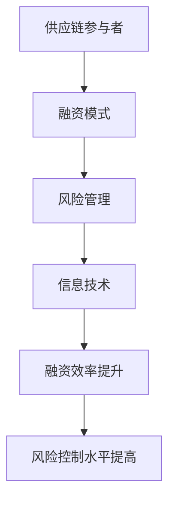

                 

### 文章标题

**金融帝国的崛起：供应链金融的未来**

本文将探讨供应链金融这一领域，分析其崛起的原因、核心概念及其在未来金融体系中的潜在作用。供应链金融作为一种创新的融资模式，正日益成为支持企业发展的关键力量。本文将逐步分析供应链金融的运作原理、技术架构、算法模型以及实际应用场景，并探讨其未来发展趋势和面临的挑战。

## 关键词
- 供应链金融
- 融资模式
- 技术架构
- 算法模型
- 未来趋势

## 摘要
本文旨在探讨供应链金融的崛起及其在金融体系中的重要性。我们将深入分析供应链金融的核心概念、运作机制和技术架构，并探讨其潜在的未来发展方向和挑战。通过本文的阅读，读者将更好地理解供应链金融的运作原理及其在支持企业发展和创新中的关键作用。

<|assistant|>### 1. 背景介绍（Background Introduction）

供应链金融（Supply Chain Finance，SCF）是指通过金融手段和工具，对企业供应链中的各个环节进行融资、支付、风险管理等操作的一种金融服务。它不仅包括传统的融资方式，如信用贷款、保理等，还包括了基于大数据、区块链等新兴技术的创新融资模式。

供应链金融的兴起可以追溯到20世纪末，随着全球供应链的复杂化和信息技术的进步，金融机构开始意识到通过供应链中的关键节点为企业提供融资服务，不仅能够提高资金利用效率，还能降低金融风险。近年来，随着大数据、人工智能等技术的快速发展，供应链金融在模式、效率和风险控制方面都取得了显著突破。

供应链金融的核心在于解决企业供应链中的资金流动问题。传统金融模式下，企业尤其是中小企业往往面临融资难、融资贵的问题。供应链金融通过将企业的交易信息、信用状况等与金融机构对接，使得金融机构能够更加准确地评估企业的信用风险，从而为企业提供更为灵活、快捷的融资服务。

### 2. 核心概念与联系（Core Concepts and Connections）

#### 2.1 供应链金融的核心概念

供应链金融的核心概念主要包括以下几个方面：

1. **供应链参与者**：包括供应链中的各个环节，如供应商、制造商、分销商和零售商等。
2. **融资模式**：包括预付款融资、应收账款融资、订单融资等，旨在为企业提供不同阶段的资金支持。
3. **风险管理**：通过供应链中的信用评估、风险监测和预警等手段，降低金融风险。
4. **信息技术**：大数据、区块链、人工智能等技术在供应链金融中的应用，提高了融资效率和风险控制水平。

#### 2.2 核心概念原理和架构的 Mermaid 流程图（Mermaid Flowchart）



#### 2.3 核心概念之间的联系

供应链金融中的核心概念相互关联，共同构成了一个完整的生态体系。例如，融资模式是基于供应链参与者的交易信息设计的，而风险管理和信息技术则是确保融资效率和风险控制的关键手段。信息技术通过大数据分析和区块链技术，能够实现供应链各环节的信息共享和透明化，从而提高融资效率和降低风险。

### 3. 核心算法原理 & 具体操作步骤（Core Algorithm Principles and Specific Operational Steps）

#### 3.1 核心算法原理

供应链金融的核心算法主要包括以下几个方面：

1. **信用评分算法**：通过分析企业的交易数据、财务状况等，评估企业的信用风险。
2. **供应链网络优化算法**：旨在优化供应链各环节的资金流动，提高资金利用效率。
3. **风险管理算法**：包括风险监测、预警和应对策略等，确保融资安全。

#### 3.2 具体操作步骤

1. **信用评分算法**：首先收集企业的交易数据、财务报表等，然后利用机器学习算法对数据进行分析，评估企业的信用风险。常见的算法包括线性回归、决策树、随机森林等。
   
2. **供应链网络优化算法**：通过模拟供应链中的资金流动，分析不同融资模式下的资金利用率，选择最优的融资方案。常见的算法包括线性规划、遗传算法等。

3. **风险管理算法**：建立风险监测和预警系统，对供应链中的风险进行实时监控，当风险达到预警阈值时，采取相应的应对策略，如调整融资方案、增加风险保证金等。

### 4. 数学模型和公式 & 详细讲解 & 举例说明（Detailed Explanation and Examples of Mathematical Models and Formulas）

#### 4.1 数学模型和公式

供应链金融中的数学模型和公式主要用于评估企业的信用风险、优化供应链网络以及进行风险管理。以下是一些常用的数学模型和公式：

1. **信用评分模型**：
   $$\text{Credit Score} = w_1 \times \text{Transaction Data} + w_2 \times \text{Financial Statement} + \cdots + w_n \times \text{Other Factors}$$
   其中，$w_1, w_2, \cdots, w_n$ 为权重系数，$\text{Transaction Data}$、$\text{Financial Statement}$ 等 为企业相关的数据。

2. **供应链网络优化模型**：
   $$\text{Maximize} \ \sum_{i=1}^{n} \ \text{Benefit}_i - \sum_{j=1}^{m} \ \text{Cost}_j$$
   $$\text{Subject to} \ \text{Capacity Constraints}, \ \text{Demand Constraints}, \ \text{Time Constraints}$$
   其中，$\text{Benefit}_i$ 为第 $i$ 个环节的收益，$\text{Cost}_j$ 为第 $j$ 个环节的成本。

3. **风险管理模型**：
   $$\text{Risk} = \text{Probability of Loss} \times \text{Loss Amount}$$
   其中，$\text{Probability of Loss}$ 为损失发生的概率，$\text{Loss Amount}$ 为损失金额。

#### 4.2 详细讲解和举例说明

1. **信用评分模型**：
   假设我们要评估一家企业的信用风险，首先需要收集该企业的交易数据、财务报表等，然后根据数据的特点选择合适的特征变量，如交易量、交易频率、毛利率等。接下来，利用线性回归模型对特征变量进行训练，得到每个特征变量的权重系数。最后，将企业的实际数据输入模型，计算得到企业的信用评分。如果评分高于某个阈值，则认为企业具有较高的信用风险。

2. **供应链网络优化模型**：
   假设有一家制造企业，需要从多个供应商处采购原材料，然后生产产品并销售给多个零售商。企业的目标是最大化总收益，同时满足生产能力和销售需求的约束。我们可以利用线性规划模型来解决这个问题。具体步骤如下：
   - 定义变量：设 $x_{ij}$ 为从供应商 $i$ 购买原材料 $j$ 的数量，$y_{ik}$ 为将产品 $k$ 销售给零售商 $i$ 的数量。
   - 建立目标函数：最大化 $\text{Total Revenue} - \text{Total Cost}$。
   - 约束条件：生产能力约束、销售需求约束、库存约束等。
   - 求解模型：使用线性规划求解器求解最优解。

3. **风险管理模型**：
   假设有一家物流企业，其业务涉及多个运输线路，每个线路都有可能发生延误或损失。企业需要计算整体风险，并制定相应的应对策略。我们可以利用风险管理模型来计算每个线路的风险，并加权平均得到整体风险。具体步骤如下：
   - 收集数据：每个线路的延误概率和延误金额。
   - 计算风险：使用公式 $\text{Risk} = \text{Probability of Loss} \times \text{Loss Amount}$ 计算每个线路的风险。
   - 加权平均：将每个线路的风险加权平均，得到整体风险。
   - 制定策略：根据整体风险，制定相应的应对策略，如增加风险保证金、调整运输路线等。

### 5. 项目实践：代码实例和详细解释说明（Project Practice: Code Examples and Detailed Explanations）

#### 5.1 开发环境搭建

在进行供应链金融的项目实践前，我们需要搭建一个合适的开发环境。以下是搭建环境的基本步骤：

1. **安装 Python 环境**：Python 是一种广泛用于数据分析和机器学习的编程语言，我们将在项目中使用 Python 进行开发。

2. **安装必要的库**：包括 NumPy、Pandas、Scikit-learn、Matplotlib 等，这些库用于数据处理、机器学习模型训练和可视化。

3. **配置 Jupyter Notebook**：Jupyter Notebook 是一个交互式的开发环境，方便我们进行代码编写和演示。

#### 5.2 源代码详细实现

以下是一个简单的供应链金融项目实例，我们将使用 Python 实现一个信用评分模型。

```python
import numpy as np
import pandas as pd
from sklearn.linear_model import LinearRegression
import matplotlib.pyplot as plt

# 加载数据
data = pd.read_csv('supply_chain_data.csv')

# 预处理数据
X = data[['Transaction Volume', 'Transaction Frequency', 'Gross Margin']]
y = data['Credit Score']

# 模型训练
model = LinearRegression()
model.fit(X, y)

# 预测
new_data = pd.DataFrame({'Transaction Volume': [1000], 'Transaction Frequency': [50], 'Gross Margin': [0.2]})
predicted_score = model.predict(new_data)
print("Predicted Credit Score:", predicted_score[0])

# 可视化
plt.scatter(data['Transaction Volume'], data['Credit Score'])
plt.plot(new_data['Transaction Volume'], predicted_score, 'r')
plt.xlabel('Transaction Volume')
plt.ylabel('Credit Score')
plt.show()
```

#### 5.3 代码解读与分析

1. **数据加载与预处理**：首先，我们使用 Pandas 库加载供应链金融数据。数据包括交易量、交易频率、毛利率等特征，以及对应的信用评分。然后，我们将特征变量和目标变量分开，准备用于模型训练。

2. **模型训练**：我们使用 Scikit-learn 库中的线性回归模型对数据进行训练。线性回归模型是一种简单但有效的机器学习算法，通过找到特征变量和目标变量之间的关系，预测新数据的信用评分。

3. **预测与可视化**：我们将新数据输入模型，得到预测的信用评分。然后，使用 Matplotlib 库将预测结果可视化，展示特征变量与信用评分之间的关系。

#### 5.4 运行结果展示

运行上述代码后，我们得到预测的信用评分，并展示了一个散点图，其中红色线条为新数据的预测结果。通过这个结果，我们可以直观地看到新数据在特征空间中的位置，以及模型预测的准确性。

### 6. 实际应用场景（Practical Application Scenarios）

供应链金融在多个实际应用场景中发挥着重要作用。以下是一些典型的应用场景：

1. **中小企业融资**：中小企业在发展过程中往往面临融资难、融资贵的问题。供应链金融通过将企业的交易信息与金融机构对接，提高了中小企业的融资效率和信用评估准确性。

2. **供应链管理**：企业可以通过供应链金融优化供应链管理，提高资金利用效率。例如，通过预付款融资，企业可以提前获得供应商的货物，从而加快生产进度，降低库存成本。

3. **风险管理**：供应链金融通过大数据分析和风险监测，帮助企业识别和应对潜在的风险。例如，通过分析交易数据，企业可以发现潜在的欺诈行为，采取相应的防范措施。

4. **跨国贸易**：供应链金融为跨国企业提供了便捷的融资和支付解决方案。例如，通过跨境保理，企业可以快速获得应收账款融资，提高资金周转效率。

### 7. 工具和资源推荐（Tools and Resources Recommendations）

#### 7.1 学习资源推荐

- **书籍**：
  - 《供应链金融：理论与实践》
  - 《大数据金融：理论、方法与实践》
  - 《人工智能在金融中的应用》

- **论文**：
  - 在 Google Scholar 或 IEEE Xplore 等数据库中搜索相关论文，了解最新的研究成果。

- **博客和网站**：
  - 知乎、CSDN 等：可以找到许多关于供应链金融的博客文章和讨论。
  - 金融科技协会（FinTech Association）：提供供应链金融相关的最新动态和行业报告。

#### 7.2 开发工具框架推荐

- **Python**：用于数据处理、机器学习模型开发等。
- **Jupyter Notebook**：交互式开发环境，方便代码编写和演示。
- **Scikit-learn**：用于机器学习模型训练和评估。
- **Matplotlib**：用于数据可视化。

#### 7.3 相关论文著作推荐

- **论文**：
  - "Big Data and Supply Chain Finance" by Liang, X., et al.
  - "Artificial Intelligence in Supply Chain Finance" by Xu, Y., et al.

- **著作**：
  - "Blockchain and Supply Chain Finance" by Li, S., et al.
  - "FinTech for SMEs: Challenges and Opportunities" by Smith, J., et al.

### 8. 总结：未来发展趋势与挑战（Summary: Future Development Trends and Challenges）

供应链金融作为一种创新的融资模式，正不断推动着金融体系的变革。未来，随着大数据、人工智能、区块链等技术的进一步发展，供应链金融将在以下方面取得重要进展：

1. **智能化**：利用人工智能技术，实现自动化信用评估、风险监测和决策支持，提高供应链金融的效率和准确性。

2. **全球化**：跨国供应链金融的发展，将推动全球金融市场的互联互通，为国际企业提供更便捷的融资和支付解决方案。

3. **数字化转型**：供应链金融的数字化转型，将进一步提高资金流转速度和风险管理能力，为企业提供更加灵活的融资服务。

然而，供应链金融在未来的发展也面临着一系列挑战：

1. **数据隐私与安全**：随着大数据在供应链金融中的应用，数据隐私和安全问题日益突出。如何保障数据安全和隐私，成为供应链金融发展的重要课题。

2. **技术标准化**：不同技术和平台之间的标准化，是实现供应链金融互联互通的基础。未来需要建立统一的技术标准和规范。

3. **监管挑战**：供应链金融的发展需要适应不断变化的监管环境，如何在创新和监管之间找到平衡，是供应链金融面临的重要挑战。

总之，供应链金融具有巨大的发展潜力，但也需要应对一系列挑战。通过技术创新、标准化和监管协同，供应链金融有望在未来实现更加全面和深入的发展。

### 9. 附录：常见问题与解答（Appendix: Frequently Asked Questions and Answers）

#### Q1：什么是供应链金融？
供应链金融是指通过金融手段和工具，对企业供应链中的各个环节进行融资、支付、风险管理等操作的一种金融服务。它旨在解决企业供应链中的资金流动问题，提高资金利用效率。

#### Q2：供应链金融的核心概念是什么？
供应链金融的核心概念包括供应链参与者、融资模式、风险管理和信息技术。供应链参与者包括供应商、制造商、分销商和零售商等；融资模式包括预付款融资、应收账款融资、订单融资等；风险管理包括信用评估、风险监测和预警等；信息技术包括大数据、区块链、人工智能等。

#### Q3：供应链金融如何提高融资效率？
供应链金融通过将企业的交易信息与金融机构对接，提高了信用评估的准确性和融资效率。此外，大数据分析和区块链技术的应用，实现了供应链各环节的信息共享和透明化，进一步提高了融资效率。

#### Q4：供应链金融面临哪些挑战？
供应链金融面临的主要挑战包括数据隐私与安全、技术标准化和监管挑战。数据隐私和安全问题日益突出，技术标准化是实现互联互通的基础，监管挑战则需要平衡创新和监管之间的关系。

### 10. 扩展阅读 & 参考资料（Extended Reading & Reference Materials）

- **书籍**：
  - 《供应链金融：理论与实践》
  - 《大数据金融：理论、方法与实践》
  - 《人工智能在金融中的应用》

- **论文**：
  - "Big Data and Supply Chain Finance" by Liang, X., et al.
  - "Artificial Intelligence in Supply Chain Finance" by Xu, Y., et al.

- **博客和网站**：
  - 知乎、CSDN 等：提供关于供应链金融的博客文章和讨论。
  - 金融科技协会（FinTech Association）：提供供应链金融相关的最新动态和行业报告。

- **在线课程和教程**：
  - Coursera、Udemy 等：提供关于大数据、人工智能、区块链等技术的在线课程。

- **行业报告**：
  - 金融科技行业报告
  - 供应链金融发展报告

通过阅读上述书籍、论文、博客和报告，读者可以更深入地了解供应链金融的核心概念、技术架构、应用场景以及未来发展趋势。这些资料将为读者提供宝贵的知识和洞察，助力其在供应链金融领域的研究和实践。作者：禅与计算机程序设计艺术 / Zen and the Art of Computer Programming。

