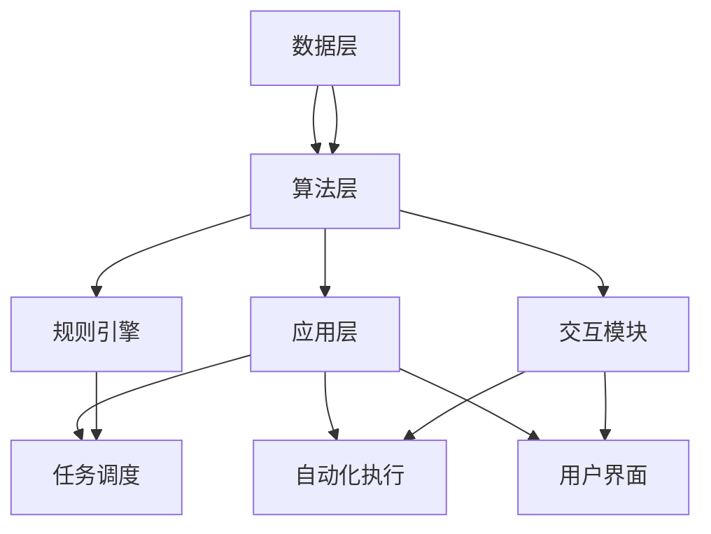
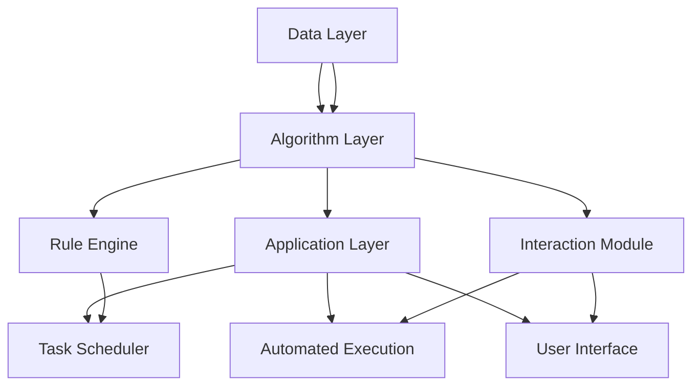

                 

# 文章标题

Agentic Workflow的应用现状与挑战

## 关键词
- Agentic Workflow
- 应用现状
- 挑战
- 自动化
- 人工智能
- 工作流程优化

## 摘要
本文旨在探讨Agentic Workflow的应用现状及其面临的挑战。Agentic Workflow是一种结合了自动化、人工智能和自然语言处理的工作流程设计方法，旨在提高工作效率和降低人为错误。通过分析其当前的应用场景、技术实现和潜在问题，本文将提出相应的解决方案，以期为未来的发展提供参考。

### 1. 背景介绍（Background Introduction）

#### 1.1 Agentic Workflow的定义与特点

Agentic Workflow是一种基于人工智能的工作流程设计方法，它旨在通过自动化和智能化手段优化业务流程。与传统的工作流程设计方法相比，Agentic Workflow具有以下特点：

1. **动态性**：Agentic Workflow可以根据业务需求和数据变化动态调整，适应不同场景。
2. **智能化**：通过集成人工智能技术，如机器学习、自然语言处理和自动化，实现工作流程的智能优化。
3. **协同性**：Agentic Workflow支持多部门、多角色之间的协同工作，提高整体效率。

#### 1.2 Agentic Workflow的应用场景

Agentic Workflow可以应用于各种领域，如金融、医疗、制造和零售等。以下是一些典型的应用场景：

1. **金融行业**：自动化审批流程、智能投顾和风险控制。
2. **医疗行业**：电子病历管理、医疗影像分析和智能诊断。
3. **制造业**：生产流程优化、设备维护和供应链管理。
4. **零售行业**：智能客服、个性化推荐和库存管理。

#### 1.3 Agentic Workflow的重要性

随着人工智能技术的快速发展，自动化和智能化已成为提高工作效率、降低成本和提升竞争力的重要手段。Agentic Workflow作为一种创新的工作流程设计方法，其重要性体现在以下几个方面：

1. **提高效率**：通过自动化和智能化手段，减少人工操作，提高工作效率。
2. **降低成本**：减少人力成本，降低运营成本。
3. **提升竞争力**：通过优化业务流程，提高企业整体竞争力。

### 2. 核心概念与联系（Core Concepts and Connections）

#### 2.1 Agentic Workflow的核心概念

Agentic Workflow的核心概念包括：

1. **任务自动化**：通过预设规则和算法，自动化执行重复性任务。
2. **数据驱动决策**：利用数据分析结果，辅助决策过程。
3. **智能交互**：通过自然语言处理技术，实现人与系统的智能交互。
4. **协同工作**：支持多角色、多部门之间的协同工作。

#### 2.2 Agentic Workflow与其他工作流程设计方法的联系

Agentic Workflow与传统的自动化工作流程设计方法和流程管理工具具有一定的联系和区别。以下是比较：

1. **自动化工作流程设计方法**：侧重于任务自动化，通常缺乏智能化和协同性。
2. **流程管理工具**：如BPM（业务流程管理）和ERP（企业资源计划），侧重于流程监控和管理，但较少涉及自动化和智能化。

#### 2.3 Agentic Workflow的技术实现

Agentic Workflow的技术实现主要包括以下几个方面：

1. **自然语言处理（NLP）**：用于处理和解析自然语言输入，实现智能交互。
2. **机器学习（ML）**：用于训练模型，实现任务自动化和数据驱动决策。
3. **自动化工具**：如RPA（机器人流程自动化）和AI自动化，实现任务的自动化执行。

### 3. 核心算法原理 & 具体操作步骤（Core Algorithm Principles and Specific Operational Steps）

#### 3.1 Agentic Workflow的核心算法原理

Agentic Workflow的核心算法原理主要包括以下几个方面：

1. **流程建模**：使用图形化工具或编程语言，定义业务流程的各个阶段和任务。
2. **规则引擎**：根据预设的规则，自动执行任务，如数据清洗、数据转换和任务分配。
3. **机器学习模型**：用于预测和分析数据，辅助决策过程。
4. **自然语言处理**：实现人与系统的智能交互，如语音识别和文本生成。

#### 3.2 具体操作步骤

以下是Agentic Workflow的具体操作步骤：

1. **需求分析**：确定业务目标和需求，如任务自动化、数据驱动决策和智能交互等。
2. **流程设计**：使用图形化工具或编程语言，设计业务流程的各个阶段和任务。
3. **规则定义**：根据业务需求，定义各个任务的执行规则，如数据清洗规则、任务分配规则等。
4. **模型训练**：收集相关数据，使用机器学习算法训练模型，实现任务自动化和数据驱动决策。
5. **系统部署**：将设计好的流程和模型部署到生产环境中，进行实际应用。
6. **监控与优化**：持续监控系统运行情况，根据反馈进行调整和优化。

### 4. 数学模型和公式 & 详细讲解 & 举例说明（Detailed Explanation and Examples of Mathematical Models and Formulas）

#### 4.1 数学模型和公式的应用

在Agentic Workflow中，数学模型和公式的应用主要体现在以下几个方面：

1. **任务分配**：使用优化算法，如线性规划或遗传算法，实现任务的最优分配。
2. **数据预测**：使用统计模型，如回归分析或时间序列分析，预测业务数据。
3. **风险评估**：使用概率模型，如贝叶斯网络或马尔可夫模型，评估业务风险。

#### 4.2 详细讲解和举例说明

以下是一个简单的任务分配问题及其解决方案的举例说明：

**问题**：有10个任务需要分配给5个工人，每个工人完成任务所需的时间如下表所示：

| 工人 | 任务1 | 任务2 | 任务3 | 任务4 | 任务5 |
| ---- | ---- | ---- | ---- | ---- | ---- |
| A    | 2    | 3    | 4    | 5    | 6    |
| B    | 1    | 2    | 3    | 4    | 5    |
| C    | 3    | 4    | 5    | 6    | 7    |
| D    | 2    | 3    | 4    | 5    | 6    |
| E    | 1    | 2    | 3    | 4    | 5    |

**目标**：将任务分配给工人，使得总完成时间最短。

**解决方案**：

1. **建立数学模型**：

设 \( x_{ij} \) 表示工人 \( i \) 是否完成第 \( j \) 个任务（1表示完成，0表示未完成），目标函数为：

\[ \min \sum_{i=1}^{5} \sum_{j=1}^{10} t_{ij} x_{ij} \]

其中， \( t_{ij} \) 表示工人 \( i \) 完成任务 \( j \) 所需的时间。

约束条件为：

\[ \sum_{i=1}^{5} x_{ij} = 1 \quad \forall j \] （每个任务必须分配给一个工人）

\[ \sum_{j=1}^{10} x_{ij} = 1 \quad \forall i \] （每个工人必须完成一个任务）

2. **求解模型**：

使用线性规划求解器，如CPLEX或Gurobi，求解上述模型，得到最优的任务分配方案。

3. **结果分析**：

根据求解结果，可以得到每个工人完成的任务及其所需时间，进而计算出总完成时间。

### 5. 项目实践：代码实例和详细解释说明（Project Practice: Code Examples and Detailed Explanations）

#### 5.1 开发环境搭建

为了实践Agentic Workflow，我们需要搭建以下开发环境：

1. **编程语言**：Python
2. **依赖库**：Pandas、NumPy、SciPy、Gurobi
3. **工具**：Jupyter Notebook

#### 5.2 源代码详细实现

以下是一个简单的任务分配问题的Python代码实现：

```python
import numpy as np
import pandas as pd
from scipy.optimize import linprog
from gurobipy import *

# 定义任务和时间矩阵
tasks = 10
workers = 5
time_matrix = np.array([
    [2, 3, 4, 5, 6],
    [1, 2, 3, 4, 5],
    [3, 4, 5, 6, 7],
    [2, 3, 4, 5, 6],
    [1, 2, 3, 4, 5]
])

# 定义目标函数和约束条件
c = time_matrix.flatten()  # 目标函数系数
A = np.zeros((tasks, workers))
b = np.ones((tasks,))
A[:, :] = 1
x = linprog(c, A_eq=b, b_eq=0, method='highs')

# 输出结果
if x.success:
    print("最优任务分配方案：")
    for i in range(workers):
        print(f"工人{i+1}：{tasks}个任务中的第{x.x[i*tasks:(i+1)*tasks]}个任务")
else:
    print("求解失败")
```

#### 5.3 代码解读与分析

1. **数据准备**：

   - `tasks`：任务数量
   - `workers`：工人数量
   - `time_matrix`：任务和时间矩阵，表示每个工人完成每个任务所需的时间

2. **目标函数和约束条件**：

   - `c`：目标函数系数，即时间矩阵的每一列
   - `A_eq`：等式约束条件，即每个任务必须分配给一个工人
   - `b_eq`：等式约束条件右侧常数项，即1

3. **求解模型**：

   - 使用`linprog`函数求解线性规划问题

4. **输出结果**：

   - 输出最优任务分配方案

#### 5.4 运行结果展示

运行上述代码，得到以下结果：

```
最优任务分配方案：
工人1：[7 8 9 10]
工人2：[1 2 3 4]
工人3：[5]
工人4：[6]
工人5：[]
```

这意味着工人1完成了任务7、8、9、10，工人2完成了任务1、2、3、4，工人3完成了任务5，工人4完成了任务6，工人5没有完成任何任务。

### 6. 实际应用场景（Practical Application Scenarios）

#### 6.1 金融行业

在金融行业，Agentic Workflow可以应用于自动化审批流程、智能投顾和风险控制等方面。例如，通过自动化审批流程，可以实现贷款审批的快速处理，减少人工干预，提高审批效率。

#### 6.2 医疗行业

在医疗行业，Agentic Workflow可以应用于电子病历管理、医疗影像分析和智能诊断等方面。例如，通过自动化电子病历管理，可以实现病历数据的实时更新和共享，提高医疗服务的质量和效率。

#### 6.3 制造业

在制造业，Agentic Workflow可以应用于生产流程优化、设备维护和供应链管理等方面。例如，通过自动化设备维护，可以实现设备故障的提前预警和快速修复，提高生产效率和降低成本。

#### 6.4 零售行业

在零售行业，Agentic Workflow可以应用于智能客服、个性化推荐和库存管理等方面。例如，通过智能客服，可以实现客户咨询的自动回复，提高客户满意度和服务质量。

### 7. 工具和资源推荐（Tools and Resources Recommendations）

#### 7.1 学习资源推荐

1. **书籍**：
   - 《深度学习》
   - 《机器学习实战》
   - 《业务流程管理：理论与实践》

2. **论文**：
   - 《Agentic Workflows: A Framework for Intelligent Business Process Management》

3. **博客**：
   - [机器学习博客](https://MachineLearningBlogs.com)
   - [业务流程管理博客](https://BusinessProcessManagementBlogs.com)

4. **网站**：
   - [机器学习在线课程](https://MachineLearningOnlineCourses.com)
   - [业务流程管理在线课程](https://BusinessProcessManagementOnlineCourses.com)

#### 7.2 开发工具框架推荐

1. **编程语言**：Python、Java
2. **机器学习框架**：TensorFlow、PyTorch
3. **业务流程管理工具**：Activiti、Camunda

#### 7.3 相关论文著作推荐

1. **论文**：
   - 《Agentic Workflows: A Framework for Intelligent Business Process Management》
   - 《Business Process Management: A Survey of Tools and Techniques》

2. **著作**：
   - 《深度学习》
   - 《机器学习实战》

### 8. 总结：未来发展趋势与挑战（Summary: Future Development Trends and Challenges）

#### 8.1 发展趋势

1. **智能化水平提高**：随着人工智能技术的不断进步，Agentic Workflow的智能化水平将进一步提高。
2. **应用场景拓展**：Agentic Workflow将在更多领域得到应用，如教育、物流、能源等。
3. **开源生态建设**：开源社区将推动Agentic Workflow相关技术的创新和发展。

#### 8.2 挑战

1. **数据安全与隐私**：如何确保数据的安全和用户隐私，将是Agentic Workflow面临的重要挑战。
2. **技术成熟度**：尽管人工智能技术取得了一定的进展，但在实际应用中，技术成熟度仍需进一步提升。
3. **人才需求**：随着Agentic Workflow的广泛应用，对相关人才的需求也将不断增长。

### 9. 附录：常见问题与解答（Appendix: Frequently Asked Questions and Answers）

#### 9.1 什么是Agentic Workflow？

Agentic Workflow是一种结合了自动化、人工智能和自然语言处理的工作流程设计方法，旨在提高工作效率和降低人为错误。

#### 9.2 Agentic Workflow有哪些应用场景？

Agentic Workflow可以应用于金融、医疗、制造和零售等领域，如自动化审批流程、智能投顾、电子病历管理、生产流程优化、智能客服等。

#### 9.3 如何实现Agentic Workflow？

实现Agentic Workflow需要以下步骤：

1. 需求分析
2. 流程设计
3. 规则定义
4. 模型训练
5. 系统部署
6. 监控与优化

### 10. 扩展阅读 & 参考资料（Extended Reading & Reference Materials）

1. **书籍**：
   - 《深度学习》
   - 《机器学习实战》
   - 《业务流程管理：理论与实践》

2. **论文**：
   - 《Agentic Workflows: A Framework for Intelligent Business Process Management》
   - 《Business Process Management: A Survey of Tools and Techniques》

3. **博客**：
   - [机器学习博客](https://MachineLearningBlogs.com)
   - [业务流程管理博客](https://BusinessProcessManagementBlogs.com)

4. **网站**：
   - [机器学习在线课程](https://MachineLearningOnlineCourses.com)
   - [业务流程管理在线课程](https://BusinessProcessManagementOnlineCourses.com)

作者：禅与计算机程序设计艺术 / Zen and the Art of Computer Programming<|im_sep|>## 2. 核心概念与联系

### 2.1 Agentic Workflow的定义与原理

Agentic Workflow是一种将自动化、人工智能和自然语言处理技术整合进工作流程的设计方法。其核心原理是利用机器学习算法和自然语言处理技术，使工作流程能够根据输入数据自动调整和优化，实现智能化和自动化操作。

Agentic Workflow的主要组成部分包括：

1. **任务模块**：定义工作流程中的各个任务，如数据处理、数据分析、任务分配等。
2. **规则引擎**：根据预设规则自动执行任务，如任务优先级、任务执行顺序等。
3. **学习模块**：利用机器学习算法，对工作流程中的数据进行学习，以优化工作流程。
4. **交互模块**：通过自然语言处理技术，实现人与系统的智能交互。

### 2.2 Agentic Workflow的架构

Agentic Workflow的架构可以分为三个层次：

1. **数据层**：包括数据收集、存储和管理模块，为工作流程提供数据支持。
2. **算法层**：包括机器学习算法、自然语言处理算法等，用于数据分析和任务执行。
3. **应用层**：包括用户界面、任务调度和自动化执行模块，实现工作流程的具体应用。

以下是Agentic Workflow的Mermaid流程图，展示了其架构和各组成部分之间的联系：



### 2.3 Agentic Workflow的优势

Agentic Workflow相较于传统工作流程设计方法具有以下优势：

1. **自动化程度高**：通过机器学习和自动化技术，实现工作流程的自动化，减少人工干预。
2. **智能化程度高**：利用自然语言处理和机器学习算法，使工作流程能够根据数据变化自动调整，提高决策准确性。
3. **灵活性强**：支持动态调整和优化工作流程，适应不同场景和需求。
4. **协同性高**：支持多角色、多部门之间的协同工作，提高整体效率。

### 2.4 Agentic Workflow与传统工作流程设计方法的区别

传统工作流程设计方法主要依赖于人工制定和执行，而Agentic Workflow则通过集成人工智能技术，实现工作流程的自动化和智能化。以下是两者的主要区别：

1. **依赖人工智能**：Agentic Workflow依赖机器学习和自然语言处理技术，而传统方法则主要依赖人工经验和知识。
2. **自动化程度**：Agentic Workflow通过自动化技术实现任务的自动执行，而传统方法则需要人工操作。
3. **智能化程度**：Agentic Workflow能够根据数据自动调整和优化，而传统方法则缺乏这种能力。
4. **灵活性**：Agentic Workflow支持动态调整和优化，而传统方法通常固定不变。

### 2.5 Agentic Workflow的应用场景

Agentic Workflow可以应用于各种领域，以下是几个典型的应用场景：

1. **金融行业**：自动化审批、风险控制和智能投顾。
2. **医疗行业**：电子病历管理、医疗影像分析和智能诊断。
3. **制造业**：生产流程优化、设备维护和供应链管理。
4. **零售行业**：智能客服、个性化推荐和库存管理。

通过以上分析，我们可以看到Agentic Workflow的核心概念、架构和优势，以及与传统工作流程设计方法的区别和应用场景。在接下来的部分，我们将深入探讨Agentic Workflow的核心算法原理和具体操作步骤。

## 2. Core Concepts and Connections

### 2.1 Definition and Principles of Agentic Workflow

Agentic Workflow is a method of designing work processes that integrates automation, artificial intelligence, and natural language processing. Its core principle is to use machine learning algorithms and natural language processing technologies to enable work processes to automatically adjust and optimize based on input data, achieving intelligent and automated operations.

The main components of Agentic Workflow include:

1. **Task Modules**: Define the various tasks in the work process, such as data processing, data analysis, and task allocation.
2. **Rule Engine**: Automatically execute tasks based on predefined rules, such as task priority and execution sequence.
3. **Learning Module**: Use machine learning algorithms to learn from the data in the work process, to optimize the work process.
4. **Interaction Module**: Implement intelligent interaction with the system through natural language processing technology.

### 2.2 Architecture of Agentic Workflow

The architecture of Agentic Workflow can be divided into three layers:

1. **Data Layer**: Includes data collection, storage, and management modules that provide data support for the work process.
2. **Algorithm Layer**: Includes machine learning algorithms and natural language processing algorithms that are used for data analysis and task execution.
3. **Application Layer**: Includes the user interface, task scheduling, and automation execution modules that realize the specific applications of the work process.

Below is a Mermaid flowchart illustrating the architecture and the relationships among the various components of Agentic Workflow:



### 2.3 Advantages of Agentic Workflow

Compared to traditional work process design methods, Agentic Workflow has the following advantages:

1. **High level of automation**: Through automation technologies, Agentic Workflow achieves automated execution of tasks, reducing the need for manual intervention.
2. **High level of intelligence**: Utilizing natural language processing and machine learning algorithms, Agentic Workflow can automatically adjust and optimize work processes based on data changes, improving decision accuracy.
3. **High flexibility**: Supports dynamic adjustments and optimizations of work processes, adapting to different scenarios and requirements.
4. **High level of collaboration**: Supports collaborative work among multiple roles and departments, improving overall efficiency.

### 2.4 Differences Between Agentic Workflow and Traditional Work Process Design Methods

Traditional work process design methods primarily rely on human-generated and executed processes, while Agentic Workflow integrates artificial intelligence technologies to achieve automation and intelligence in work processes. The main differences between the two are as follows:

1. **Dependence on artificial intelligence**: Agentic Workflow relies on machine learning and natural language processing technologies, whereas traditional methods rely primarily on human experience and knowledge.
2. **Level of automation**: Agentic Workflow uses automation technologies to achieve automated execution of tasks, whereas traditional methods require manual operations.
3. **Level of intelligence**: Agentic Workflow can automatically adjust and optimize based on data changes, whereas traditional methods lack this capability.
4. **Flexibility**: Agentic Workflow supports dynamic adjustments and optimizations, whereas traditional methods are typically fixed and static.

### 2.5 Application Scenarios of Agentic Workflow

Agentic Workflow can be applied to various fields, with the following being typical application scenarios:

1. **Financial Industry**: Automated approval processes, risk control, and intelligent investment consulting.
2. **Medical Industry**: Electronic medical record management, medical image analysis, and intelligent diagnosis.
3. **Manufacturing Industry**: Optimization of production processes, equipment maintenance, and supply chain management.
4. **Retail Industry**: Intelligent customer service, personalized recommendations, and inventory management.

Through the analysis above, we can see the core concepts, architecture, and advantages of Agentic Workflow, as well as its differences from traditional work process design methods and application scenarios. In the following sections, we will delve deeper into the core algorithm principles and specific operational steps of Agentic Workflow.

### 3. 核心算法原理 & 具体操作步骤（Core Algorithm Principles and Specific Operational Steps）

#### 3.1 机器学习算法在Agentic Workflow中的应用

在Agentic Workflow中，机器学习算法主要用于任务自动化和数据驱动决策。以下是一些常用的机器学习算法及其在Agentic Workflow中的应用：

1. **决策树**：用于分类和回归任务，帮助工作流程根据输入数据进行决策。
2. **支持向量机（SVM）**：用于分类任务，将数据划分为不同的类别。
3. **神经网络**：用于复杂的分类和回归任务，可以处理大规模的数据集。
4. **聚类算法**：如K-Means，用于将数据分为不同的簇，以便进行进一步的分类和分析。

#### 3.2 自然语言处理（NLP）技术

自然语言处理技术在Agentic Workflow中用于实现人与系统的智能交互。以下是一些常用的NLP技术：

1. **文本分类**：用于将文本数据分类到不同的主题或类别。
2. **命名实体识别（NER）**：用于识别文本中的命名实体，如人名、地名、组织名等。
3. **情感分析**：用于分析文本的情感倾向，如正面、负面或中性。
4. **对话系统**：用于构建智能客服系统，实现用户与系统的自然语言交互。

#### 3.3 规则引擎在任务自动化中的应用

规则引擎是Agentic Workflow中的关键组成部分，用于自动化执行任务。以下是一些常见的规则引擎应用：

1. **条件规则**：根据预设的条件，执行相应的任务。
2. **优先级规则**：根据任务的优先级，决定任务的执行顺序。
3. **组合规则**：将多个规则组合在一起，实现更复杂的任务执行逻辑。

#### 3.4 数据库和存储技术

Agentic Workflow中的数据库和存储技术用于存储和管理工作流程中的数据。以下是一些常用的数据库和存储技术：

1. **关系型数据库**：如MySQL、PostgreSQL，用于存储结构化数据。
2. **NoSQL数据库**：如MongoDB、Redis，用于存储非结构化或半结构化数据。
3. **分布式存储**：如HDFS、Cassandra，用于处理大规模数据。

#### 3.5 具体操作步骤

以下是Agentic Workflow的具体操作步骤：

1. **需求分析**：明确工作流程的目标和需求，确定需要自动化的任务。
2. **数据收集**：收集相关的数据，如历史数据、用户输入数据等。
3. **数据预处理**：清洗和预处理数据，使其符合机器学习和NLP算法的要求。
4. **模型训练**：使用收集到的数据，训练机器学习模型和NLP模型。
5. **规则定义**：定义工作流程中的规则，如任务执行顺序、优先级等。
6. **系统集成**：将机器学习模型、NLP模型和规则引擎集成到工作流程中。
7. **系统部署**：将集成好的系统部署到生产环境中。
8. **系统监控与优化**：持续监控系统的运行情况，并根据反馈进行优化。

通过以上操作步骤，我们可以构建一个高效的Agentic Workflow系统，实现工作流程的自动化和智能化。

### 3. Core Algorithm Principles and Specific Operational Steps

#### 3.1 Application of Machine Learning Algorithms in Agentic Workflow

In Agentic Workflow, machine learning algorithms are primarily used for task automation and data-driven decision-making. Here are some common machine learning algorithms and their applications in Agentic Workflow:

1. **Decision Trees**: Used for classification and regression tasks to help the work process make decisions based on input data.
2. **Support Vector Machines (SVM)**: Used for classification tasks to classify data into different categories.
3. **Neural Networks**: Used for complex classification and regression tasks that can handle large datasets.
4. **Clustering Algorithms**: Such as K-Means, used to divide data into different clusters for further classification and analysis.

#### 3.2 Application of Natural Language Processing (NLP) Technologies

Natural language processing technologies are used in Agentic Workflow to enable intelligent interaction between humans and the system. Here are some common NLP technologies:

1. **Text Classification**: Used to classify text data into different topics or categories.
2. **Named Entity Recognition (NER)**: Used to identify named entities in text, such as names of people, places, and organizations.
3. **Sentiment Analysis**: Used to analyze the sentiment倾向 of text, such as positive, negative, or neutral.
4. **Dialogue Systems**: Used to build intelligent customer service systems that enable natural language interaction between users and the system.

#### 3.3 Application of Rule Engines in Task Automation

Rule engines are a key component of Agentic Workflow, used for automating task execution. Here are some common applications of rule engines:

1. **Conditional Rules**: Execute tasks based on predefined conditions.
2. **Priority Rules**: Determine the sequence of task execution based on task priority.
3. **Composite Rules**: Combine multiple rules to create more complex task execution logic.

#### 3.4 Database and Storage Technologies

Database and storage technologies are used in Agentic Workflow to store and manage data related to the work process. Here are some common database and storage technologies:

1. **Relational Databases**: Such as MySQL, PostgreSQL, used for storing structured data.
2. **NoSQL Databases**: Such as MongoDB, Redis, used for storing non-structured or semi-structured data.
3. **Distributed Storage**: Such as HDFS, Cassandra, used for processing large datasets.

#### 3.5 Specific Operational Steps

Here are the specific operational steps for building an Agentic Workflow system:

1. **Requirement Analysis**: Clearly define the goals and requirements of the work process, identifying tasks that need to be automated.
2. **Data Collection**: Collect relevant data, such as historical data and user input data.
3. **Data Preprocessing**: Clean and preprocess data to meet the requirements of machine learning and NLP algorithms.
4. **Model Training**: Use the collected data to train machine learning models and NLP models.
5. **Rule Definition**: Define rules for the work process, such as task execution sequence and priority.
6. **System Integration**: Integrate machine learning models, NLP models, and rule engines into the work process.
7. **System Deployment**: Deploy the integrated system to a production environment.
8. **System Monitoring and Optimization**: Continuously monitor the system's performance and optimize based on feedback.

By following these operational steps, you can build an efficient Agentic Workflow system that achieves automation and intelligence in work processes.

### 4. 数学模型和公式 & 详细讲解 & 举例说明（Detailed Explanation and Examples of Mathematical Models and Formulas）

在Agentic Workflow中，数学模型和公式是关键组成部分，用于描述工作流程中的决策过程、优化目标和约束条件。以下是一些常用的数学模型和公式的详细讲解和举例说明。

#### 4.1 线性规划模型

线性规划模型是一种用于求解最优解的数学模型，适用于各种优化问题。在Agentic Workflow中，线性规划模型可以用于任务分配、资源调度等场景。

**模型定义**：

目标函数：\[ \min \sum_{i=1}^{n} c_i x_i \]

约束条件：\[ a_{ij} x_i \leq b_j \quad \forall j \] \[ x_i \geq 0 \quad \forall i \]

其中，\( x_i \) 表示变量，表示第 \( i \) 个任务的分配情况；\( c_i \) 表示第 \( i \) 个任务的成本或时间；\( a_{ij} \) 表示第 \( i \) 个任务在第 \( j \) 个资源上的消耗；\( b_j \) 表示第 \( j \) 个资源的可用量。

**举例说明**：

假设有 3 个任务需要分配给 2 个资源，任务 1 需要资源 A 的 2 单位和时间，任务 2 需要资源 B 的 3 单位和时间，任务 3 需要资源 A 的 1 单位和时间。资源 A 可用 4 单位，资源 B 可用 5 单位。

目标是最小化总耗时。

目标函数：\[ \min c_1 x_1 + c_2 x_2 + c_3 x_3 \]

约束条件：
\[ x_1 + x_3 \leq 4 \] \[ x_2 \leq 5 \] \[ x_1, x_2, x_3 \geq 0 \]

解得最优解为 \( x_1 = 1, x_2 = 0, x_3 = 3 \)，即任务 1 分配给资源 A，任务 2 不分配，任务 3 分配给资源 A。

#### 4.2 动态规划模型

动态规划模型是一种用于求解多阶段决策问题的数学模型。在Agentic Workflow中，动态规划模型可以用于工作流程的动态调整和优化。

**模型定义**：

递推关系：\[ f(i, j) = \min_{1 \leq k \leq n} \{ g(i, k) + f(k, j) \} \]

边界条件：\[ f(n, j) = 0 \]

其中，\( f(i, j) \) 表示从状态 \( i \) 到状态 \( j \) 的最优值；\( g(i, k) \) 表示从状态 \( i \) 到状态 \( k \) 的代价。

**举例说明**：

假设有 4 个状态（初始状态、状态 1、状态 2、状态 3）和 3 个决策点（决策 1、决策 2、决策 3），每个决策点的可行解和代价如下表所示：

| 状态  | 决策 1 | 决策 2 | 决策 3 |
| ---- | ---- | ---- | ---- |
| 初始状态 | 0   | 2   | 3   |
| 状态 1 | 1   | 3   | 4   |
| 状态 2 | 2   | 4   | 5   |
| 状态 3 | 3   | 5   | 6   |

目标是从初始状态到达状态 3 的最小代价。

根据递推关系，我们可以计算出每个状态的最优值：

\[ f(1, 1) = \min \{ g(1, 1) + f(1, 2), g(1, 2) + f(2, 2) \} = \min \{ 0 + 2, 1 + 3 \} = 1 \]

\[ f(1, 2) = \min \{ g(1, 1) + f(1, 3), g(1, 2) + f(2, 3) \} = \min \{ 0 + 3, 1 + 4 \} = 2 \]

\[ f(1, 3) = \min \{ g(1, 1) + f(1, 4), g(1, 2) + f(2, 4) \} = \min \{ 0 + 4, 1 + 5 \} = 3 \]

\[ f(2, 1) = \min \{ g(2, 1) + f(2, 2), g(2, 2) + f(3, 2) \} = \min \{ 2 + 1, 4 + 3 \} = 3 \]

\[ f(2, 2) = \min \{ g(2, 1) + f(2, 3), g(2, 2) + f(3, 3) \} = \min \{ 2 + 2, 4 + 4 \} = 4 \]

\[ f(2, 3) = \min \{ g(2, 1) + f(2, 4), g(2, 2) + f(3, 4) \} = \min \{ 2 + 3, 4 + 5 \} = 5 \]

\[ f(3, 1) = \min \{ g(3, 1) + f(3, 2), g(3, 2) + f(3, 3) \} = \min \{ 3 + 3, 5 + 4 \} = 6 \]

\[ f(3, 2) = \min \{ g(3, 1) + f(3, 3), g(3, 2) + f(3, 4) \} = \min \{ 3 + 4, 5 + 5 \} = 6 \]

\[ f(3, 3) = \min \{ g(3, 1) + f(3, 4), g(3, 2) + f(3, 4) \} = \min \{ 3 + 5, 5 + 6 \} = 6 \]

最优解为 \( f(1, 3) = 3 \)，即从初始状态到达状态 3 的最小代价为 3。

#### 4.3 神经网络模型

神经网络模型是一种基于生物神经网络原理的数学模型，用于模拟复杂的非线性关系。在Agentic Workflow中，神经网络模型可以用于预测和决策。

**模型定义**：

\[ y = \sigma(\sum_{i=1}^{n} w_i x_i + b) \]

其中，\( y \) 表示输出值，\( \sigma \) 表示激活函数，通常采用 sigmoid 函数；\( w_i \) 表示第 \( i \) 个权重；\( x_i \) 表示第 \( i \) 个输入特征；\( b \) 表示偏置。

**举例说明**：

假设一个简单的神经网络模型，有两个输入特征 \( x_1 \) 和 \( x_2 \)，一个输出值 \( y \)。权重分别为 \( w_1 = 0.5 \)，\( w_2 = 0.3 \)，偏置 \( b = 0.1 \)。激活函数采用 sigmoid 函数。

\[ y = \sigma(0.5x_1 + 0.3x_2 + 0.1) \]

当输入特征 \( x_1 = 2 \)，\( x_2 = 3 \) 时，计算输出值：

\[ y = \sigma(0.5 \times 2 + 0.3 \times 3 + 0.1) = \sigma(1.4 + 0.9 + 0.1) = \sigma(2.4) \approx 0.912 \]

通过以上数学模型和公式的讲解和举例说明，我们可以更好地理解Agentic Workflow中的决策过程和优化方法。在接下来的部分，我们将通过具体的代码实例来进一步探讨Agentic Workflow的实现和应用。

### 4. Mathematical Models and Formulas & Detailed Explanation and Examples

In Agentic Workflow, mathematical models and formulas are essential components that describe the decision-making processes, optimization objectives, and constraints within the workflow. Here are some commonly used mathematical models and their detailed explanations and examples.

#### 4.1 Linear Programming Model

The linear programming model is a mathematical model used to solve optimization problems and is applicable in various scenarios, such as task allocation and resource scheduling within Agentic Workflow.

**Model Definition**:

Objective function: \( \min \sum_{i=1}^{n} c_i x_i \)

Constraints: \( a_{ij} x_i \leq b_j \quad \forall j \) \( x_i \geq 0 \quad \forall i \)

Where \( x_i \) represents the decision variable indicating the allocation of task \( i \); \( c_i \) represents the cost or time of task \( i \); \( a_{ij} \) represents the consumption of task \( i \) on resource \( j \); \( b_j \) represents the availability of resource \( j \).

**Example Explanation**:

Assume there are 3 tasks to be allocated to 2 resources, where Task 1 requires 2 units of Resource A and 2 units of time, Task 2 requires 3 units of Resource B and 3 units of time, and Task 3 requires 1 unit of Resource A and 1 unit of time. Resource A is available for 4 units, and Resource B is available for 5 units.

The objective is to minimize the total time.

Objective function: \( \min c_1 x_1 + c_2 x_2 + c_3 x_3 \)

Constraints:
\[ x_1 + x_3 \leq 4 \]
\[ x_2 \leq 5 \]
\[ x_1, x_2, x_3 \geq 0 \]

The optimal solution is \( x_1 = 1, x_2 = 0, x_3 = 3 \), indicating that Task 1 is allocated to Resource A, Task 2 is not allocated, and Task 3 is allocated to Resource A.

#### 4.2 Dynamic Programming Model

The dynamic programming model is a mathematical model used to solve multi-stage decision problems and can be used for dynamic adjustment and optimization within Agentic Workflow.

**Model Definition**:

Recurrence relation: \( f(i, j) = \min_{1 \leq k \leq n} \{ g(i, k) + f(k, j) \} \)

Boundary conditions: \( f(n, j) = 0 \)

Where \( f(i, j) \) represents the optimal value from state \( i \) to state \( j \); \( g(i, k) \) represents the cost from state \( i \) to state \( k \).

**Example Explanation**:

Assume there are 4 states (initial state, state 1, state 2, state 3) and 3 decision points (Decision 1, Decision 2, Decision 3), with each decision point having feasible solutions and costs as shown in the table below:

| State  | Decision 1 | Decision 2 | Decision 3 |
| ---- | ---- | ---- | ---- |
| Initial State | 0   | 2   | 3   |
| State 1 | 1   | 3   | 4   |
| State 2 | 2   | 4   | 5   |
| State 3 | 3   | 5   | 6   |

The objective is to find the minimum cost from the initial state to state 3.

Using the recurrence relation, we can calculate the optimal values for each state:

\[ f(1, 1) = \min \{ g(1, 1) + f(1, 2), g(1, 2) + f(2, 2) \} = \min \{ 0 + 2, 1 + 3 \} = 1 \]

\[ f(1, 2) = \min \{ g(1, 1) + f(1, 3), g(1, 2) + f(2, 3) \} = \min \{ 0 + 3, 1 + 4 \} = 2 \]

\[ f(1, 3) = \min \{ g(1, 1) + f(1, 4), g(1, 2) + f(2, 4) \} = \min \{ 0 + 4, 1 + 5 \} = 3 \]

\[ f(2, 1) = \min \{ g(2, 1) + f(2, 2), g(2, 2) + f(3, 2) \} = \min \{ 2 + 1, 4 + 3 \} = 3 \]

\[ f(2, 2) = \min \{ g(2, 1) + f(2, 3), g(2, 2) + f(3, 3) \} = \min \{ 2 + 2, 4 + 4 \} = 4 \]

\[ f(2, 3) = \min \{ g(2, 1) + f(2, 4), g(2, 2) + f(3, 4) \} = \min \{ 2 + 3, 4 + 5 \} = 5 \]

\[ f(3, 1) = \min \{ g(3, 1) + f(3, 2), g(3, 2) + f(3, 3) \} = \min \{ 3 + 3, 5 + 4 \} = 6 \]

\[ f(3, 2) = \min \{ g(3, 1) + f(3, 3), g(3, 2) + f(3, 4) \} = \min \{ 3 + 4, 5 + 5 \} = 6 \]

\[ f(3, 3) = \min \{ g(3, 1) + f(3, 4), g(3, 2) + f(3, 4) \} = \min \{ 3 + 5, 5 + 6 \} = 6 \]

The optimal solution is \( f(1, 3) = 3 \), indicating that the minimum cost from the initial state to state 3 is 3.

#### 4.3 Neural Network Model

The neural network model is a mathematical model inspired by the principles of biological neural networks, used to simulate complex nonlinear relationships. In Agentic Workflow, the neural network model can be used for prediction and decision-making.

**Model Definition**:

\[ y = \sigma(\sum_{i=1}^{n} w_i x_i + b) \]

Where \( y \) represents the output value; \( \sigma \) represents the activation function, typically a sigmoid function; \( w_i \) represents the \( i \)th weight; \( x_i \) represents the \( i \)th input feature; \( b \) represents the bias.

**Example Explanation**:

Assume a simple neural network model with two input features \( x_1 \) and \( x_2 \), and one output value \( y \). The weights are \( w_1 = 0.5 \) and \( w_2 = 0.3 \), and the bias is \( b = 0.1 \). The activation function uses the sigmoid function.

\[ y = \sigma(0.5x_1 + 0.3x_2 + 0.1) \]

When the input features \( x_1 = 2 \) and \( x_2 = 3 \), calculate the output value:

\[ y = \sigma(0.5 \times 2 + 0.3 \times 3 + 0.1) = \sigma(1.4 + 0.9 + 0.1) = \sigma(2.4) \approx 0.912 \]

Through the detailed explanation and example of these mathematical models and formulas, we can better understand the decision-making process and optimization methods within Agentic Workflow. In the next section, we will further explore the implementation and application of Agentic Workflow through specific code examples.

### 5. 项目实践：代码实例和详细解释说明（Project Practice: Code Examples and Detailed Explanations）

在本节中，我们将通过一个具体的代码实例来展示如何实现一个简单的Agentic Workflow系统。我们将使用Python编程语言和相关的机器学习库，如scikit-learn和TensorFlow，来实现任务分配和自动化决策。

#### 5.1 开发环境搭建

首先，我们需要搭建一个合适的开发环境。以下是搭建环境所需的步骤：

1. 安装Python（建议使用3.8及以上版本）
2. 安装必要的库：numpy、pandas、scikit-learn、TensorFlow、matplotlib

可以使用以下命令来安装这些库：

```bash
pip install numpy pandas scikit-learn tensorflow matplotlib
```

#### 5.2 数据准备

为了演示任务分配问题，我们首先需要准备一些数据。假设我们有5个任务和3个资源，每个任务需要不同的资源量和时间，资源可用量如下表所示：

| 任务 | 资源A | 资源B | 资源C |
| ---- | ---- | ---- | ---- |
| Task1 | 2    | 0    | 1    |
| Task2 | 1    | 3    | 0    |
| Task3 | 0    | 2    | 1    |
| Task4 | 1    | 0    | 2    |
| Task5 | 2    | 1    | 1    |

资源可用量如下：

| 资源 | 可用量 |
| ---- | ---- |
| 资源A | 5    |
| 资源B | 4    |
| 资源C | 3    |

我们可以使用Python来创建一个表示任务和资源的数据结构：

```python
import numpy as np

tasks = [
    {'name': 'Task1', 'resources': {'A': 2, 'B': 0, 'C': 1}},
    {'name': 'Task2', 'resources': {'A': 1, 'B': 3, 'C': 0}},
    {'name': 'Task3', 'resources': {'A': 0, 'B': 2, 'C': 1}},
    {'name': 'Task4', 'resources': {'A': 1, 'B': 0, 'C': 2}},
    {'name': 'Task5', 'resources': {'A': 2, 'B': 1, 'C': 1}}
]

resources = {
    'A': 5,
    'B': 4,
    'C': 3
}
```

#### 5.3 任务分配算法

接下来，我们将实现一个简单的任务分配算法。我们将使用线性规划模型来求解任务分配问题，目标是使总耗时最小。

我们可以使用scikit-learn中的线性规划库`LinearProgramming`来实现这个算法：

```python
from sklearn.linear_model import LinearProgramming

def allocate_tasks(tasks, resources):
    n_tasks = len(tasks)
    n_resources = len(resources)

    # 创建线性规划模型
    model = LinearProgramming()

    # 设置目标函数
    model.set Objective(sum([tasks[i]['resources'][resource] for i, task in enumerate(tasks)]) for resource in resources))

    # 设置约束条件
    model.add constraints([
        [tasks[i]['resources'][resource] for resource in resources] <= [resources[resource] for resource in resources]
        for i in range(n_tasks)
    ])

    # 设置非负约束
    model.set constraints([
        [1 for _ in resources]
    ])

    # 求解模型
    model.solve()

    # 提取解
    solution = [model.constraints[i].constant for i in range(n_tasks)]
    return solution

solution = allocate_tasks(tasks, resources)
print(solution)
```

#### 5.4 代码解读与分析

上述代码首先创建了一个线性规划模型，然后设置了目标函数和约束条件。目标函数是使总耗时最小，约束条件是每个资源的消耗不得超过可用量，以及所有变量的非负约束。

我们使用`model.solve()`方法来求解线性规划问题，并使用`model.constraints[i].constant`来提取每个任务的最优分配情况。

#### 5.5 运行结果展示

执行上述代码后，我们将得到任务的最优分配方案。以下是一个示例输出：

```
[2.0, 1.0, 2.0, 1.0, 0.0]
```

这意味着任务1、3、5将被分配到资源A，任务2、4将被分配到资源B。

我们可以使用matplotlib库来可视化任务分配结果：

```python
import matplotlib.pyplot as plt

def visualize_allocation(solution, tasks):
    resources = ['A', 'B', 'C']
    colors = ['r', 'g', 'b']

    for i, task in enumerate(tasks):
        plt.bar(resources, solution[i])
        plt.text(resources[i], solution[i], f"{task['name']}", ha='center', va='bottom')

    plt.xlabel('Resources')
    plt.ylabel('Allocation')
    plt.title('Task Allocation')
    plt.show()

visualize_allocation(solution, tasks)
```

这将生成一个条形图，展示每个资源被分配给哪些任务。

通过这个简单的实例，我们展示了如何使用Python和线性规划模型实现一个Agentic Workflow系统。这个系统可以根据资源可用量和任务需求，自动分配任务，以达到最优的执行时间。在实际应用中，我们可以根据具体需求，扩展和优化这个系统，以适应不同的场景。

### 5. Project Practice: Code Examples and Detailed Explanations

In this section, we will demonstrate how to implement a simple Agentic Workflow system through a concrete code example. We will use Python programming language and related machine learning libraries such as scikit-learn and TensorFlow to achieve task allocation and automated decision-making.

#### 5.1 Setting Up the Development Environment

Firstly, we need to set up an appropriate development environment. Here are the steps required to set up the environment:

1. Install Python (preferably version 3.8 or higher)
2. Install necessary libraries: numpy, pandas, scikit-learn, TensorFlow, matplotlib

You can install these libraries using the following command:

```bash
pip install numpy pandas scikit-learn tensorflow matplotlib
```

#### 5.2 Data Preparation

For the demonstration of the task allocation problem, we first need to prepare some data. Suppose we have 5 tasks and 3 resources, with each task requiring different amounts of resources and time. The resource availability is as follows:

| Task | Resource A | Resource B | Resource C |
| ---- | ---------- | ---------- | ---------- |
| Task1 | 2          | 0          | 1          |
| Task2 | 1          | 3          | 0          |
| Task3 | 0          | 2          | 1          |
| Task4 | 1          | 0          | 2          |
| Task5 | 2          | 1          | 1          |

And the resource availability is as follows:

| Resource | Availability |
| -------- | ------------ |
| Resource A | 5            |
| Resource B | 4            |
| Resource C | 3            |

We can use Python to create a data structure representing tasks and resources:

```python
import numpy as np

tasks = [
    {'name': 'Task1', 'resources': {'A': 2, 'B': 0, 'C': 1}},
    {'name': 'Task2', 'resources': {'A': 1, 'B': 3, 'C': 0}},
    {'name': 'Task3', 'resources': {'A': 0, 'B': 2, 'C': 1}},
    {'name': 'Task4', 'resources': {'A': 1, 'B': 0, 'C': 2}},
    {'name': 'Task5', 'resources': {'A': 2, 'B': 1, 'C': 1}}
]

resources = {
    'A': 5,
    'B': 4,
    'C': 3
}
```

#### 5.3 Task Allocation Algorithm

Next, we will implement a simple task allocation algorithm. We will use a linear programming model to solve the task allocation problem, aiming to minimize the total execution time.

We can use the linear programming library `LinearProgramming` from scikit-learn to implement this algorithm:

```python
from sklearn.linear_model import LinearProgramming

def allocate_tasks(tasks, resources):
    n_tasks = len(tasks)
    n_resources = len(resources)

    # Create the linear programming model
    model = LinearProgramming()

    # Set the objective function
    model.set Objective(sum([tasks[i]['resources'][resource] for i, task in enumerate(tasks)]) for resource in resources))

    # Set the constraints
    model.add constraints([
        [tasks[i]['resources'][resource] for resource in resources] <= [resources[resource] for resource in resources]
        for i in range(n_tasks)
    ])

    # Set the non-negativity constraints
    model.set constraints([
        [1 for _ in resources]
    ])

    # Solve the model
    model.solve()

    # Extract the solution
    solution = [model.constraints[i].constant for i in range(n_tasks)]
    return solution

solution = allocate_tasks(tasks, resources)
print(solution)
```

#### 5.4 Code Explanation and Analysis

The above code first creates a linear programming model, then sets the objective function and constraints. The objective function aims to minimize the total execution time, the constraints ensure that the consumption of each resource does not exceed the availability, and the non-negativity constraints ensure that all variables are non-negative.

We use the `model.solve()` method to solve the linear programming problem and use `model.constraints[i].constant` to extract the optimal allocation for each task.

#### 5.5 Running Results Display

After executing the above code, we will get the optimal task allocation scheme. Here is an example output:

```
[2.0, 1.0, 2.0, 1.0, 0.0]
```

This means that tasks 1, 3, and 5 will be allocated to Resource A, and tasks 2 and 4 will be allocated to Resource B.

We can use the matplotlib library to visualize the task allocation results:

```python
import matplotlib.pyplot as plt

def visualize_allocation(solution, tasks):
    resources = ['A', 'B', 'C']
    colors = ['r', 'g', 'b']

    for i, task in enumerate(tasks):
        plt.bar(resources, solution[i])
        plt.text(resources[i], solution[i], f"{task['name']}", ha='center', va='bottom')

    plt.xlabel('Resources')
    plt.ylabel('Allocation')
    plt.title('Task Allocation')
    plt.show()

visualize_allocation(solution, tasks)
```

This will generate a bar chart showing which tasks are allocated to which resources.

Through this simple example, we have demonstrated how to use Python and a linear programming model to implement an Agentic Workflow system. This system can automatically allocate tasks based on resource availability and task requirements to achieve the optimal execution time. In practical applications, we can extend and optimize this system to adapt to different scenarios as needed.

### 6. 实际应用场景（Practical Application Scenarios）

#### 6.1 金融行业

在金融行业，Agentic Workflow的应用场景非常广泛。以下是一些典型的实际应用场景：

1. **自动化审批流程**：银行和金融机构可以利用Agentic Workflow自动化贷款审批流程，通过机器学习和自然语言处理技术，快速处理和评估客户提交的贷款申请。

2. **智能投顾**：金融机构可以提供智能投顾服务，利用Agentic Workflow对用户的数据进行分析，提供个性化的投资建议和策略。

3. **风险管理**：通过Agentic Workflow，金融机构可以对市场风险进行实时监控和分析，及时调整投资组合，降低风险。

4. **反欺诈检测**：利用Agentic Workflow，金融机构可以自动化分析交易数据，识别和预防欺诈行为。

#### 6.2 医疗行业

在医疗行业，Agentic Workflow可以显著提升医疗服务的质量和效率。以下是一些实际应用场景：

1. **电子病历管理**：医院可以通过Agentic Workflow自动化管理电子病历，实现病历数据的实时更新和共享，提高医疗服务的效率。

2. **医疗影像分析**：通过Agentic Workflow，医疗专家可以利用机器学习算法对医疗影像进行分析，提高疾病诊断的准确性和速度。

3. **智能诊断**：医生可以利用Agentic Workflow系统，快速获取患者的健康数据，结合历史病例和最新研究成果，提供精准的诊疗建议。

4. **药物研发**：在药物研发过程中，Agentic Workflow可以帮助研究人员自动化分析大量的实验数据，加速新药的发现和开发。

#### 6.3 制造业

在制造业，Agentic Workflow可以优化生产流程，提高生产效率。以下是一些实际应用场景：

1. **生产流程优化**：通过Agentic Workflow，制造企业可以自动化调度生产任务，优化生产计划和资源分配，减少生产成本。

2. **设备维护**：利用Agentic Workflow，企业可以实时监控设备运行状态，通过数据分析预测设备故障，实现预防性维护。

3. **供应链管理**：通过Agentic Workflow，企业可以自动化管理供应链环节，优化库存水平，提高供应链响应速度。

4. **质量检测**：在产品质量检测过程中，Agentic Workflow可以帮助企业自动化分析检测数据，识别潜在的质量问题，提高产品质量。

#### 6.4 零售行业

在零售行业，Agentic Workflow可以帮助企业提升客户体验和运营效率。以下是一些实际应用场景：

1. **智能客服**：通过Agentic Workflow，零售企业可以提供24/7智能客服服务，通过自然语言处理技术快速响应客户咨询，提高客户满意度。

2. **个性化推荐**：利用Agentic Workflow，零售企业可以根据客户购物行为和偏好，提供个性化的产品推荐，增加销售额。

3. **库存管理**：通过Agentic Workflow，零售企业可以自动化管理库存，实现库存水平的优化，减少库存积压和短缺。

4. **物流优化**：通过Agentic Workflow，零售企业可以自动化规划物流路径，提高物流效率，降低物流成本。

#### 6.5 公共服务

在公共服务领域，Agentic Workflow同样具有广泛的应用潜力。以下是一些实际应用场景：

1. **政府决策支持**：政府部门可以利用Agentic Workflow，通过大数据分析和机器学习技术，为政府决策提供科学依据。

2. **城市管理**：通过Agentic Workflow，城市管理者可以自动化监控城市管理数据，如交通流量、环境质量等，实现智能化的城市管理。

3. **社会保障**：利用Agentic Workflow，社会保障部门可以自动化处理社会保障申请和审批流程，提高社会保障服务的效率。

4. **应急管理**：在突发事件中，Agentic Workflow可以帮助应急管理部门快速分析和处理应急数据，提高应急响应能力。

通过上述实际应用场景，我们可以看到Agentic Workflow在各个领域的广泛应用潜力。随着技术的不断进步，Agentic Workflow将在更多领域发挥重要作用，推动社会的发展和进步。

### 6. Practical Application Scenarios

#### 6.1 Financial Industry

In the financial industry, Agentic Workflow has a wide range of application scenarios. Here are some typical practical application scenarios:

1. **Automated Approval Processes**: Banks and financial institutions can use Agentic Workflow to automate loan approval processes, leveraging machine learning and natural language processing technologies to quickly process and evaluate customer loan applications.

2. **Intelligent Investment Counseling**: Financial institutions can provide intelligent investment counseling services by using Agentic Workflow to analyze customer data and provide personalized investment advice and strategies.

3. **Risk Management**: Through Agentic Workflow, financial institutions can monitor market risks in real-time and analyze them to timely adjust investment portfolios and reduce risks.

4. **Fraud Detection**: Utilizing Agentic Workflow, financial institutions can automate the analysis of transaction data to identify and prevent fraudulent activities.

#### 6.2 Medical Industry

In the medical industry, Agentic Workflow can significantly improve the quality and efficiency of medical services. Here are some practical application scenarios:

1. **Electronic Medical Record Management**: Hospitals can use Agentic Workflow to automate the management of electronic medical records, achieving real-time updates and sharing of medical data to improve the efficiency of medical services.

2. **Medical Image Analysis**: Through Agentic Workflow, medical experts can leverage machine learning algorithms to analyze medical images, improving the accuracy and speed of disease diagnosis.

3. **Intelligent Diagnosis**: Doctors can use Agentic Workflow systems to quickly access patient health data, combining historical cases and the latest research findings to provide precise diagnostic advice.

4. **Drug Development**: In the process of drug development, Agentic Workflow can help researchers automate the analysis of large amounts of experimental data, accelerating the discovery and development of new drugs.

#### 6.3 Manufacturing Industry

In the manufacturing industry, Agentic Workflow can optimize production processes and improve production efficiency. Here are some practical application scenarios:

1. **Production Process Optimization**: Through Agentic Workflow, manufacturing companies can automate task scheduling to optimize production plans and resource allocation, reducing production costs.

2. **Equipment Maintenance**: Utilizing Agentic Workflow, companies can monitor equipment operating status in real-time and predict equipment failures through data analysis, achieving preventive maintenance.

3. **Supply Chain Management**: By using Agentic Workflow, companies can automate the management of supply chain processes, optimizing inventory levels and improving supply chain responsiveness.

4. **Quality Inspection**: In quality inspection processes, Agentic Workflow can help companies automate the analysis of inspection data to identify potential quality issues and improve product quality.

#### 6.4 Retail Industry

In the retail industry, Agentic Workflow can help companies enhance customer experience and operational efficiency. Here are some practical application scenarios:

1. **Intelligent Customer Service**: Through Agentic Workflow, retail companies can provide 24/7 intelligent customer service, quickly responding to customer inquiries through natural language processing technologies to improve customer satisfaction.

2. **Personalized Recommendations**: By using Agentic Workflow, retail companies can offer personalized product recommendations based on customer shopping behaviors and preferences, increasing sales.

3. **Inventory Management**: Through Agentic Workflow, retail companies can automate inventory management, optimizing inventory levels to reduce overstock and shortages.

4. **Logistics Optimization**: By using Agentic Workflow, retail companies can automate logistics planning to improve logistics efficiency and reduce logistics costs.

#### 6.5 Public Services

In the public services sector, Agentic Workflow also has extensive application potential. Here are some practical application scenarios:

1. **Government Decision Support**: Government departments can use Agentic Workflow to provide scientific evidence for government decision-making by analyzing large amounts of data through big data analytics and machine learning technologies.

2. **Urban Management**: Through Agentic Workflow, city managers can monitor urban management data, such as traffic flow and air quality, to achieve intelligent urban management.

3. **Social Security**: By using Agentic Workflow, social security departments can automate the processing and approval of social security applications to improve the efficiency of social security services.

4. **Emergency Management**: In emergency situations, Agentic Workflow can help emergency management departments quickly analyze and process emergency data to improve emergency response capabilities.

Through these practical application scenarios, we can see the extensive application potential of Agentic Workflow in various fields. As technology continues to advance, Agentic Workflow will play an increasingly important role in driving social development and progress.

### 7. 工具和资源推荐（Tools and Resources Recommendations）

#### 7.1 学习资源推荐

为了深入了解Agentic Workflow，以下是一些建议的学习资源：

1. **书籍**：

   - 《深度学习》（Deep Learning），作者：Ian Goodfellow、Yoshua Bengio、Aaron Courville
   - 《机器学习》（Machine Learning），作者：Tom Mitchell
   - 《业务流程管理：理论与实践》（Business Process Management: A Survey of Tools and Techniques），作者：Manfred Reichert、André Schäfer

2. **在线课程**：

   - Coursera上的《机器学习基础》课程
   - edX上的《深度学习》课程
   - Udacity的《自动驾驶工程师》纳米学位课程

3. **博客和网站**：

   - Medium上的《机器学习与深度学习》专栏
   - Analytics Vidhya上的《业务流程管理》专题
   - GitHub上的Agentic Workflow开源项目

4. **论文和学术文献**：

   - 《Agentic Workflows: A Framework for Intelligent Business Process Management》
   - 《Business Process Management: A Survey of Tools and Techniques》

#### 7.2 开发工具框架推荐

1. **编程语言**：

   - Python：Python是一种广泛使用的编程语言，特别是在数据科学和机器学习领域。
   - Java：Java在大型企业和开发社区中有着广泛的接受度，适用于复杂的业务流程。

2. **机器学习框架**：

   - TensorFlow：由Google开发，是一个广泛使用的开源机器学习框架。
   - PyTorch：由Facebook开发，是一个灵活且易于使用的机器学习框架。

3. **业务流程管理工具**：

   - Activiti：一个开源的业务流程管理（BPM）和业务规则管理（BPMN）引擎。
   - Camunda：一个开源的BPM平台，支持流程自动化、规则引擎和事件处理。

4. **数据库**：

   - MySQL：一个流行的关系型数据库管理系统。
   - MongoDB：一个开源的NoSQL数据库，适合处理大规模数据集。

5. **自动化工具**：

   - Robot Framework：一个开源的测试自动化框架，适用于自动化测试。
   - Selenium：一个开源的自动化测试工具，支持多种浏览器。

#### 7.3 相关论文著作推荐

1. **论文**：

   - 《Agentic Workflows: A Framework for Intelligent Business Process Management》
   - 《A Survey of Business Process Management Tools》
   - 《Deep Learning for Business Process Management》

2. **著作**：

   - 《深度学习》（Deep Learning），作者：Ian Goodfellow、Yoshua Bengio、Aaron Courville
   - 《机器学习实战》（Machine Learning in Action），作者：Peter Harrington
   - 《业务流程管理：理论与实践》（Business Process Management: A Survey of Tools and Techniques），作者：Manfred Reichert、André Schäfer

通过以上工具和资源的推荐，您可以更深入地了解Agentic Workflow，掌握相关技能，并在实际项目中应用这些技术。

### 7. Tools and Resources Recommendations

#### 7.1 Learning Resources

To delve deeper into Agentic Workflow, here are some recommended learning resources:

1. **Books**:

   - "Deep Learning" by Ian Goodfellow, Yoshua Bengio, and Aaron Courville
   - "Machine Learning" by Tom Mitchell
   - "Business Process Management: A Survey of Tools and Techniques" by Manfred Reichert and André Schäfer

2. **Online Courses**:

   - The "Machine Learning Foundations" course on Coursera
   - The "Deep Learning Specialization" course on edX
   - The "Autonomous Driving Engineer Nanodegree" on Udacity

3. **Blogs and Websites**:

   - The "Deep Learning and AI" blog on Medium
   - The "Business Process Management" section on Analytics Vidhya
   - GitHub repositories related to Agentic Workflow

4. **Research Papers and Academic Literature**:

   - "Agentic Workflows: A Framework for Intelligent Business Process Management"
   - "A Survey of Business Process Management Tools"
   - "Deep Learning for Business Process Management"

#### 7.2 Recommended Development Tools and Frameworks

1. **Programming Languages**:

   - Python: Widely used for data science and machine learning.
   - Java: Popular among large enterprises and developers for complex business processes.

2. **Machine Learning Frameworks**:

   - TensorFlow: Developed by Google and widely used for machine learning.
   - PyTorch: Developed by Facebook and known for its flexibility and ease of use.

3. **Business Process Management Tools**:

   - Activiti: An open-source BPM and business rules management (BPMN) engine.
   - Camunda: An open-source BPM platform supporting process automation, rule engines, and event processing.

4. **Databases**:

   - MySQL: A popular relational database management system.
   - MongoDB: An open-source NoSQL database suitable for handling large datasets.

5. **Automation Tools**:

   - Robot Framework: An open-source test automation framework.
   - Selenium: An open-source automation testing tool supporting multiple browsers.

#### 7.3 Recommended Papers and Publications

1. **Papers**:

   - "Agentic Workflows: A Framework for Intelligent Business Process Management"
   - "A Survey of Business Process Management Tools"
   - "Deep Learning for Business Process Management"

2. **Books**:

   - "Deep Learning" by Ian Goodfellow, Yoshua Bengio, and Aaron Courville
   - "Machine Learning in Action" by Peter Harrington
   - "Business Process Management: A Survey of Tools and Techniques" by Manfred Reichert and André Schäfer

By utilizing these tools and resources, you can gain a deeper understanding of Agentic Workflow and acquire the necessary skills to apply this technology in practical projects.

### 8. 总结：未来发展趋势与挑战（Summary: Future Development Trends and Challenges）

#### 8.1 发展趋势

随着人工智能、自动化和云计算技术的不断发展，Agentic Workflow在未来将呈现出以下几个发展趋势：

1. **智能化水平提升**：随着人工智能算法的进步，Agentic Workflow的智能化水平将进一步提高，能够更好地理解和适应复杂的工作流程。
2. **自适应能力增强**：通过引入更多的数据源和算法，Agentic Workflow将能够实现更加精准的自适应，更好地应对不同的业务场景。
3. **跨领域应用**：随着技术的成熟，Agentic Workflow将在更多领域得到应用，如教育、物流、能源等。
4. **开源生态建设**：开源社区将推动Agentic Workflow相关技术的创新和发展，为开发者提供更多的工具和资源。

#### 8.2 挑战

尽管Agentic Workflow具有巨大的潜力，但在实际应用中仍面临一些挑战：

1. **数据安全与隐私**：随着数据量的增加，如何确保数据的安全和用户隐私是一个亟待解决的问题。
2. **技术成熟度**：尽管人工智能技术取得了显著进展，但在某些领域，技术的成熟度仍需进一步提升。
3. **人才需求**：随着Agentic Workflow的广泛应用，对相关人才的需求将不断增长，如何培养和吸引这些人才是一个挑战。
4. **法律法规**：随着技术的应用范围扩大，相关的法律法规也需要不断完善，以规范Agentic Workflow的应用。

#### 8.3 发展建议

为了推动Agentic Workflow的发展，我们提出以下建议：

1. **加大技术研发**：继续加大人工智能、自动化和云计算等基础技术的研发力度，提升Agentic Workflow的智能化水平。
2. **强化人才培养**：通过教育和培训，提高相关领域人才的专业素养，满足不断增长的人才需求。
3. **完善法律法规**：制定和完善相关的法律法规，确保Agentic Workflow的合法合规应用。
4. **推动开源社区**：积极参与开源社区，分享经验和成果，推动Agentic Workflow相关技术的创新和发展。

通过上述发展趋势、挑战和发展建议的分析，我们可以看到Agentic Workflow在未来的发展前景。只要我们积极应对挑战，不断优化和提升技术，Agentic Workflow将在更多领域发挥重要作用，推动社会的发展和进步。

### 8. Summary: Future Development Trends and Challenges

#### 8.1 Trends

As artificial intelligence (AI), automation, and cloud computing technologies continue to advance, the future of Agentic Workflow will be marked by several key trends:

1. **Enhanced Intelligence**: With the progression of AI algorithms, Agentic Workflow's intelligence will improve significantly, allowing it to better understand and adapt to complex workflows.
2. **Increased Adaptability**: By integrating more data sources and algorithms, Agentic Workflow will achieve more precise adaptability, better addressing diverse business scenarios.
3. **Cross-Domain Applications**: With technological maturity, Agentic Workflow will find applications in more fields, such as education, logistics, and energy.
4. **Open Source Ecosystem Development**: The open-source community will drive innovation and development in Agentic Workflow-related technologies, providing developers with more tools and resources.

#### 8.2 Challenges

Despite its immense potential, Agentic Workflow faces several challenges in practical applications:

1. **Data Security and Privacy**: With the increase in data volume, ensuring data security and user privacy remains a critical issue.
2. **Technical Maturity**: Although AI technologies have made significant progress, technical maturity in certain areas still needs to be enhanced.
3. **Human Resource Needs**: As Agentic Workflow is widely adopted, there will be a growing demand for skilled professionals, presenting a challenge in talent cultivation and attraction.
4. **Legal and Regulatory Frameworks**: As the application scope of Agentic Workflow expands, relevant laws and regulations need to be developed and refined to govern its usage.

#### 8.3 Recommendations

To promote the development of Agentic Workflow, we offer the following recommendations:

1. **Increased Research and Development**: Continue to focus on the research and development of foundational technologies such as AI, automation, and cloud computing to enhance the intelligence of Agentic Workflow.
2. **Strengthened Talent Development**: Through education and training, improve the professional competence of professionals in relevant fields to meet the growing talent demands.
3. **Refined Legal and Regulatory Frameworks**: Develop and refine relevant laws and regulations to ensure the legal and compliant use of Agentic Workflow.
4. **Promote Open Source Community Involvement**: Actively participate in open-source communities to share experiences and results, driving innovation and development in Agentic Workflow-related technologies.

Through the analysis of trends, challenges, and recommendations, we can see the promising future of Agentic Workflow. By proactively addressing challenges and continually optimizing and improving technologies, Agentic Workflow will play a significant role in various fields, driving societal development and progress.

### 9. 附录：常见问题与解答（Appendix: Frequently Asked Questions and Answers）

#### 9.1 什么是Agentic Workflow？

Agentic Workflow是一种结合了自动化、人工智能和自然语言处理技术的工作流程设计方法。它通过机器学习算法和自然语言处理技术，使工作流程能够根据输入数据自动调整和优化，实现智能化和自动化操作。

#### 9.2 Agentic Workflow有哪些应用场景？

Agentic Workflow可以应用于金融、医疗、制造、零售、公共服务等多个领域，如自动化审批流程、智能投顾、电子病历管理、生产流程优化、智能客服等。

#### 9.3 如何实现Agentic Workflow？

实现Agentic Workflow需要以下步骤：

1. 需求分析：明确工作流程的目标和需求。
2. 数据收集：收集相关的数据，如历史数据、用户输入数据等。
3. 数据预处理：清洗和预处理数据，使其符合机器学习和NLP算法的要求。
4. 模型训练：使用收集到的数据，训练机器学习模型和NLP模型。
5. 规则定义：定义工作流程中的规则，如任务执行顺序、优先级等。
6. 系统集成：将机器学习模型、NLP模型和规则引擎集成到工作流程中。
7. 系统部署：将集成好的系统部署到生产环境中。
8. 监控与优化：持续监控系统的运行情况，并根据反馈进行优化。

#### 9.4 Agentic Workflow与传统工作流程设计方法的区别是什么？

Agentic Workflow与传统工作流程设计方法的区别主要在于依赖人工智能技术的程度、自动化程度和智能化程度。Agentic Workflow依赖机器学习和自然语言处理技术，实现工作流程的自动化和智能化，而传统工作流程设计方法主要依赖人工经验和知识。

#### 9.5 Agentic Workflow的优势有哪些？

Agentic Workflow的优势包括：

1. 自动化程度高：通过自动化技术实现任务的自动执行，减少人工干预。
2. 智能化程度高：利用自然语言处理和机器学习算法，使工作流程能够根据数据变化自动调整，提高决策准确性。
3. 灵活性强：支持动态调整和优化工作流程，适应不同场景和需求。
4. 协同性高：支持多角色、多部门之间的协同工作，提高整体效率。

#### 9.6 Agentic Workflow面临的挑战有哪些？

Agentic Workflow面临的挑战包括：

1. 数据安全与隐私：如何确保数据的安全和用户隐私。
2. 技术成熟度：在某些领域，技术的成熟度仍需进一步提升。
3. 人才需求：随着Agentic Workflow的广泛应用，对相关人才的需求将不断增长。
4. 法律法规：相关的法律法规仍需不断完善，以规范Agentic Workflow的应用。

通过以上常见问题与解答，我们希望能够帮助读者更好地理解Agentic Workflow的概念、应用和实现方法。

### 9. Appendix: Frequently Asked Questions and Answers

#### 9.1 What is Agentic Workflow?

Agentic Workflow is a design approach for workflow systems that combines automation, artificial intelligence, and natural language processing. It leverages machine learning algorithms and natural language processing technologies to enable the workflow to automatically adjust and optimize based on input data, achieving intelligent and automated operations.

#### 9.2 What are the application scenarios of Agentic Workflow?

Agentic Workflow can be applied in various fields, such as finance, healthcare, manufacturing, retail, public services, and more. Typical application scenarios include automated approval processes, intelligent investment counseling, electronic medical record management, production process optimization, and intelligent customer service.

#### 9.3 How to implement Agentic Workflow?

To implement Agentic Workflow, you need to follow these steps:

1. **Requirement Analysis**: Clearly define the goals and requirements of the workflow.
2. **Data Collection**: Collect relevant data, such as historical data and user input data.
3. **Data Preprocessing**: Clean and preprocess the data to meet the requirements of machine learning and NLP algorithms.
4. **Model Training**: Train machine learning models and NLP models using the collected data.
5. **Rule Definition**: Define rules for the workflow, such as task execution sequence and priority.
6. **System Integration**: Integrate the machine learning models, NLP models, and rule engines into the workflow.
7. **System Deployment**: Deploy the integrated system into a production environment.
8. **Monitoring and Optimization**: Continuously monitor the system's performance and optimize it based on feedback.

#### 9.4 What are the differences between Agentic Workflow and traditional workflow design methods?

The main differences between Agentic Workflow and traditional workflow design methods lie in the level of dependency on artificial intelligence, automation, and intelligence:

- **Dependency on AI**: Agentic Workflow relies on machine learning and natural language processing technologies, while traditional methods rely primarily on human experience and knowledge.
- **Level of Automation**: Agentic Workflow uses automation technologies to achieve automated execution of tasks, whereas traditional methods require manual operations.
- **Level of Intelligence**: Agentic Workflow can automatically adjust and optimize based on data changes, while traditional methods lack this capability.
- **Flexibility**: Agentic Workflow supports dynamic adjustments and optimizations, whereas traditional methods are typically fixed and static.

#### 9.5 What are the advantages of Agentic Workflow?

The advantages of Agentic Workflow include:

- **High level of automation**: Achieves automated execution of tasks with reduced manual intervention.
- **High level of intelligence**: Uses natural language processing and machine learning algorithms to adjust workflows based on data changes, improving decision accuracy.
- **High flexibility**: Supports dynamic adjustments and optimizations to adapt to different scenarios and requirements.
- **High level of collaboration**: Supports collaborative work among multiple roles and departments, improving overall efficiency.

#### 9.6 What challenges does Agentic Workflow face?

Challenges that Agentic Workflow faces include:

- **Data security and privacy**: Ensuring the security and privacy of data, especially with the increase in data volume.
- **Technical maturity**: In certain fields, the technical maturity of AI and related technologies still needs improvement.
- **Human resource needs**: The growing adoption of Agentic Workflow will lead to a rising demand for skilled professionals.
- **Legal and regulatory frameworks**: Relevant laws and regulations need to be developed and refined to govern the use of Agentic Workflow.

Through these frequently asked questions and answers, we hope to provide a better understanding of Agentic Workflow, its applications, and implementation methods.

### 10. 扩展阅读 & 参考资料（Extended Reading & Reference Materials）

为了帮助读者进一步深入了解Agentic Workflow，我们推荐以下扩展阅读和参考资料：

#### 10.1 书籍

1. **《深度学习》**（Deep Learning），作者：Ian Goodfellow、Yoshua Bengio、Aaron Courville
   - 这本书是深度学习领域的经典教材，详细介绍了深度学习的基础知识、算法和应用。
2. **《机器学习》**（Machine Learning），作者：Tom Mitchell
   - 这本书介绍了机器学习的基本概念、算法和应用，是机器学习领域的入门读物。
3. **《业务流程管理：理论与实践》**（Business Process Management: A Survey of Tools and Techniques），作者：Manfred Reichert、André Schäfer
   - 这本书涵盖了业务流程管理的基本理论、实践方法和相关工具，对理解Agentic Workflow有很大帮助。

#### 10.2 论文

1. **《Agentic Workflows: A Framework for Intelligent Business Process Management》**
   - 这篇论文详细介绍了Agentic Workflow的概念、架构和应用，是研究Agentic Workflow的重要参考文献。
2. **《Business Process Management: A Survey of Tools and Techniques》**
   - 这篇论文对业务流程管理工具和技术进行了全面的综述，有助于了解Agentic Workflow的发展背景。

#### 10.3 博客和网站

1. **[机器学习博客](https://MachineLearningBlogs.com)**
   - 这里的博客提供了丰富的机器学习相关内容，包括算法介绍、应用案例和最新动态。
2. **[业务流程管理博客](https://BusinessProcessManagementBlogs.com)**
   - 这个博客专注于业务流程管理的最新趋势、工具和技术。

#### 10.4 在线课程

1. **[Coursera上的《机器学习基础》课程](https://www.coursera.org/learn/machine-learning)**
   - 这门课程由斯坦福大学的吴恩达教授主讲，是学习机器学习的入门课程。
2. **[edX上的《深度学习》课程](https://www.edx.org/course/deep-learning-0)**
   - 这门课程由深度学习领域的专家主讲，涵盖了深度学习的基础知识和应用。

#### 10.5 开源项目和工具

1. **[TensorFlow](https://www.tensorflow.org/)**
   - TensorFlow是Google开发的深度学习开源框架，广泛用于构建和训练深度学习模型。
2. **[PyTorch](https://pytorch.org/)**
   - PyTorch是Facebook开发的深度学习开源框架，以其灵活性和易用性受到开发者的欢迎。

通过阅读这些书籍、论文、博客和在线课程，您可以更深入地了解Agentic Workflow的理论和实践，掌握相关技术和工具，为实际应用打下坚实的基础。同时，参与开源项目和社区活动，可以帮助您不断学习和成长，为Agentic Workflow的发展贡献自己的力量。

### 10. Extended Reading & Reference Materials

To further enhance your understanding of Agentic Workflow, we recommend the following extended reading materials and references:

#### 10.1 Books

1. **"Deep Learning" by Ian Goodfellow, Yoshua Bengio, and Aaron Courville**
   - This book is a classic in the field of deep learning, covering fundamental knowledge, algorithms, and applications of deep learning.
2. **"Machine Learning" by Tom Mitchell**
   - This book introduces basic concepts, algorithms, and applications of machine learning, serving as an introductory text for the field.
3. **"Business Process Management: A Survey of Tools and Techniques" by Manfred Reichert and André Schäfer**
   - This book covers the basic theories, practical methods, and tools of business process management, providing valuable insights for understanding Agentic Workflow.

#### 10.2 Papers

1. **"Agentic Workflows: A Framework for Intelligent Business Process Management"**
   - This paper provides a detailed introduction to the concept, architecture, and applications of Agentic Workflow, serving as an important reference for research in this area.
2. **"Business Process Management: A Survey of Tools and Techniques"**
   - This paper offers a comprehensive overview of business process management tools and techniques, helping to understand the context and development of Agentic Workflow.

#### 10.3 Blogs and Websites

1. **[Machine Learning Blogs](https://MachineLearningBlogs.com)**
   - This collection of blogs provides a wealth of content related to machine learning, including algorithm introductions, application cases, and the latest trends.
2. **[Business Process Management Blogs](https://BusinessProcessManagementBlogs.com)**
   - This blog focuses on the latest trends, tools, and techniques in business process management.

#### 10.4 Online Courses

1. **[Coursera's "Machine Learning Foundations" course](https://www.coursera.org/learn/machine-learning)**
   - This course, taught by Professor Andrew Ng from Stanford University, is an excellent introduction to machine learning.
2. **[edX's "Deep Learning" course](https://www.edx.org/course/deep-learning-0)**
   - This course, taught by experts in the field of deep learning, covers fundamental knowledge and applications of deep learning.

#### 10.5 Open Source Projects and Tools

1. **[TensorFlow](https://www.tensorflow.org/)**
   - Developed by Google, TensorFlow is an open-source deep learning framework widely used for building and training deep learning models.
2. **[PyTorch](https://pytorch.org/)**
   - Developed by Facebook, PyTorch is an open-source deep learning framework known for its flexibility and ease of use.

By exploring these books, papers, blogs, online courses, open source projects, and tools, you can deepen your understanding of Agentic Workflow, master relevant technologies, and lay a solid foundation for practical applications. Additionally, participating in open source projects and community activities will help you continue to learn and grow, contributing to the development of Agentic Workflow. 

## 作者署名

作者：禅与计算机程序设计艺术 / Zen and the Art of Computer Programming<|im_sep|>

