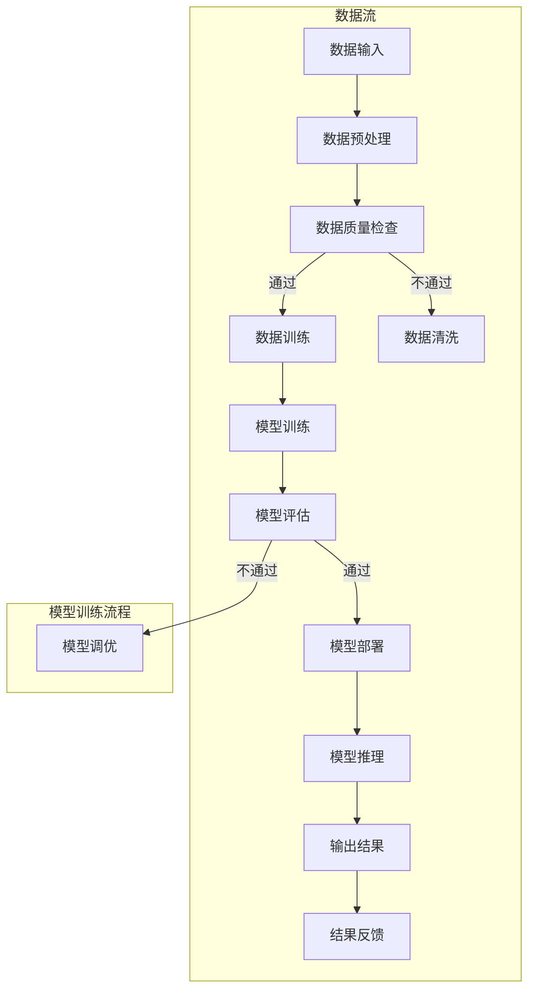

                 

### 背景介绍（Background Introduction）

人工智能（Artificial Intelligence，简称 AI）是计算机科学的一个分支，旨在创建能够执行通常需要人类智能才能完成的任务的机器系统。随着深度学习、神经网络和自然语言处理等技术的发展，人工智能的应用场景不断扩大，从图像识别、语音识别到自然语言生成，人工智能正逐渐成为各行各业的核心驱动力。

Andrej Karpathy 是人工智能领域的一位杰出研究者，他在神经网络、深度学习和自然语言处理等方面有着深厚的造诣，并在多个领域发表了具有影响力的论文。在本文中，我们将探讨 Andrej Karpathy 对人工智能未来发展的挑战的看法，并分析这些挑战对人工智能行业和我们的日常生活可能带来的影响。

首先，我们需要了解人工智能的当前发展状况。近年来，人工智能技术在多个领域取得了显著进展。例如，深度学习在图像识别、语音识别和自然语言处理等方面已经超越了人类的表现。自动驾驶技术、智能助理和智能家居等应用正在逐渐融入我们的日常生活，展示了人工智能的巨大潜力。

然而，人工智能的发展也面临着一系列挑战。Andrej Karpathy 指出，这些挑战包括数据隐私、伦理问题、技术成熟度和政策监管等方面。本文将详细探讨这些挑战，并分析它们对人工智能未来发展的潜在影响。

接下来，我们将深入探讨人工智能的未来发展挑战，包括：

1. **数据隐私**：人工智能系统通常需要大量数据来训练模型。然而，这些数据往往包含个人隐私信息。如何确保数据隐私在人工智能系统中得到妥善保护，是一个亟待解决的问题。
2. **伦理问题**：随着人工智能技术的进步，如何确保这些技术不会被滥用，以及如何确保人工智能系统的决策过程透明和公正，成为了重要的伦理问题。
3. **技术成熟度**：尽管人工智能在多个领域取得了显著进展，但仍然存在许多技术瓶颈。例如，人工智能在理解复杂情境、进行推理和自我学习等方面还有很大的提升空间。
4. **政策监管**：随着人工智能技术的广泛应用，需要制定相应的政策和法规来规范其使用。这包括数据隐私保护、伦理审查和技术标准等方面。

通过对这些挑战的深入探讨，我们将更好地理解人工智能的未来发展方向，并为应对这些挑战提供一些可能的解决方案。

### Background Introduction

Artificial Intelligence (AI) is a branch of computer science aimed at creating machine systems capable of performing tasks that typically require human intelligence. With the advancements in technologies like deep learning, neural networks, and natural language processing, AI applications are expanding across various domains, from image recognition and speech recognition to natural language generation. AI is increasingly becoming a core driving force in many industries.

Andrej Karpathy is a distinguished researcher in the field of AI, with a deep expertise in neural networks, deep learning, and natural language processing. He has published influential papers in multiple areas and is known for his contributions to the field. In this article, we will explore Andrej Karpathy's views on the challenges facing the future development of AI and analyze the potential impacts these challenges may have on the AI industry and our daily lives.

Firstly, we need to understand the current state of AI development. In recent years, significant progress has been made in various fields. For example, deep learning has surpassed human performance in tasks such as image recognition, speech recognition, and natural language processing. Applications like autonomous driving, smart assistants, and smart homes are gradually integrating into our daily lives, showcasing the immense potential of AI.

However, the development of AI also faces a series of challenges. Andrej Karpathy points out that these challenges include data privacy, ethical issues, technological maturity, and policy regulation. In the following sections, we will delve into these challenges and analyze their potential impacts on the future development of AI.

The main challenges we will discuss include:

1. **Data Privacy**: AI systems typically require large amounts of data to train models. However, these data often contain personal privacy information. How to ensure the proper protection of data privacy in AI systems is an urgent issue.
2. **Ethical Issues**: With the advancement of AI technology, how to ensure that these technologies are not misused and how to ensure the transparency and fairness of the decision-making process of AI systems have become important ethical concerns.
3. **Technological Maturity**: Although AI has made significant progress in various fields, there are still many technical bottlenecks. For example, AI has much room for improvement in understanding complex scenarios, reasoning, and self-learning.
4. **Policy Regulation**: With the widespread application of AI technology, there is a need to develop corresponding policies and regulations to govern its use. This includes data privacy protection, ethical review, and technical standards.

By delving into these challenges, we will gain a better understanding of the future development direction of AI and explore possible solutions to address these challenges.### 1.1 数据隐私（Data Privacy）

数据隐私是人工智能领域面临的一个重要挑战。随着人工智能系统的广泛应用，这些系统需要处理和分析大量的数据，包括个人隐私信息。这些数据可能来自用户的行为记录、社交媒体活动、医疗记录、金融交易等。如何确保这些隐私数据在训练、处理和使用过程中得到保护，是人工智能发展过程中不可忽视的问题。

首先，数据隐私问题源于数据本身的敏感性。在许多情况下，个人数据包含敏感信息，如身份信息、健康状况、财务状况等。一旦这些信息被泄露或滥用，可能会导致个人隐私受到侵犯，甚至造成严重的后果。

其次，人工智能系统在处理数据时，可能会无意中泄露个人隐私。例如，在训练图像识别模型时，如果模型使用了包含个人照片的数据集，那么在模型输出结果时，这些个人照片可能会被无意中泄露。同样，在自然语言处理中，模型的输出也可能包含用户的私人对话内容。

为了解决数据隐私问题，研究者们提出了一系列解决方案。首先，数据匿名化技术可以用来保护个人隐私。通过删除或模糊化个人身份信息，可以降低数据泄露的风险。此外，差分隐私（Differential Privacy）也是一种有效的方法，它通过添加噪声来保护数据的隐私性，同时确保数据分析的准确性。

其次，加密技术可以用来保护数据在传输和存储过程中的隐私。通过对数据进行加密，可以确保只有授权用户才能访问数据，从而防止数据泄露。此外，区块链技术也可以用来保护数据隐私，通过去中心化的数据存储和分布式网络，可以防止单点故障和数据篡改。

最后，隐私保护算法和模型设计也是解决数据隐私问题的重要途径。通过设计隐私保护的算法和模型，可以在不牺牲模型性能的前提下，确保个人隐私不被泄露。例如，同态加密（Homomorphic Encryption）允许在加密数据上进行计算，而无需解密，从而保护数据的隐私。

总之，数据隐私是人工智能领域面临的一个重要挑战。通过采用匿名化、加密和隐私保护算法等技术手段，可以有效地保护个人隐私，促进人工智能的健康发展。然而，这仍然是一个复杂且不断演变的问题，需要持续的研究和努力来解决。### 1.2 伦理问题（Ethical Issues）

伦理问题在人工智能领域同样备受关注。随着人工智能技术的不断发展，这些技术被广泛应用于医疗、金融、法律等多个领域，其决策过程和结果对人类社会产生深远影响。如何确保人工智能系统的决策过程透明、公正，以及如何防止其被滥用，成为了人工智能领域亟需解决的伦理问题。

首先，人工智能系统的决策过程往往基于大量的数据和复杂的算法。这些决策过程可能涉及到对个人隐私的侵犯，甚至可能导致不公平的结果。例如，在招聘系统中，基于机器学习的算法可能会歧视某些特定群体，如女性或少数民族。这种现象被称为算法歧视（Algorithmic Bias），它对社会的公平性和正义构成了严重威胁。

其次，人工智能系统的透明性问题是另一个重要的伦理问题。由于人工智能系统的复杂性和黑箱特性，其决策过程往往对人类不可解释。这使得人们难以了解系统是如何做出决策的，从而增加了对系统信任的难度。例如，在自动驾驶汽车中，如果系统发生事故，人们往往无法理解事故的原因，这可能导致公众对人工智能系统的信任度降低。

为了解决这些问题，研究者们提出了一系列解决方案。首先，算法透明性（Algorithm Transparency）是一种重要的方法。通过开发可解释的人工智能模型，可以使得决策过程更加透明，从而提高人们对系统的信任度。例如，LIME（Local Interpretable Model-agnostic Explanations）和SHAP（SHapley Additive exPlanations）等方法可以帮助解释模型的决策过程。

其次，伦理审查（Ethical Review）也是确保人工智能系统公正和透明的重要手段。在人工智能系统的开发和应用过程中，进行严格的伦理审查，可以确保系统设计符合伦理标准，避免算法歧视和不公平现象的发生。例如，许多公司和组织已经建立了人工智能伦理委员会，负责对人工智能项目进行伦理评估。

此外，法律和政策制定也是解决伦理问题的重要途径。通过制定相关的法律法规，可以规范人工智能系统的开发和应用，确保其符合社会伦理标准。例如，欧盟的《通用数据保护条例》（GDPR）对个人数据的收集和使用进行了严格的规定，从而保护了用户的隐私权。

总之，伦理问题在人工智能领域具有重要意义。通过提高算法透明性、进行伦理审查和制定相关法律法规，可以确保人工智能系统的决策过程透明、公正，从而促进人工智能的健康发展。然而，这仍然是一个复杂的挑战，需要持续的研究和实践来解决。### 1.3 技术成熟度（Technological Maturity）

技术成熟度是评估人工智能发展水平的一个重要维度。尽管人工智能在多个领域取得了显著进展，但仍然存在许多技术瓶颈，这些瓶颈限制了人工智能技术的进一步发展和应用。

首先，人工智能在处理复杂任务时的能力仍然有限。虽然深度学习在图像识别、语音识别和自然语言处理等领域表现出色，但在理解复杂情境、进行推理和自我学习等方面还有很大的提升空间。例如，人工智能系统在处理多模态数据时，往往难以同时理解不同模态的信息，导致整体性能受限。

其次，人工智能系统的可解释性问题仍然是一个重要挑战。由于深度学习模型的黑箱特性，其决策过程往往对人类不可解释。这增加了人们对人工智能系统的信任难度，特别是在关键领域如医疗、金融和司法中。因此，开发可解释的人工智能模型，使其决策过程透明，是提高技术成熟度的重要方向。

另外，人工智能系统的可靠性和稳定性也是一个关键问题。在许多应用场景中，如自动驾驶和医疗诊断，人工智能系统的错误可能会导致严重后果。因此，提高人工智能系统的可靠性和稳定性，确保其在各种复杂环境中稳定运行，是技术成熟度的关键挑战。

为了解决这些技术瓶颈，研究者们采取了一系列措施。首先，多模态学习（Multimodal Learning）是提高人工智能系统处理复杂任务能力的一种方法。通过结合不同模态的数据，如文本、图像和声音，可以使得系统更全面地理解任务，从而提高性能。

其次，强化学习（Reinforcement Learning）是解决人工智能系统可解释性问题的一种有效方法。通过让系统在与环境的互动中学习，可以使得其行为更加可解释。此外，开发可解释的深度学习模型，如注意力机制（Attention Mechanisms）和图神经网络（Graph Neural Networks），也有助于提高系统的可解释性。

最后，确保人工智能系统的可靠性和稳定性需要综合考虑算法、硬件和软件等多个方面。通过设计更鲁棒的算法，使用更先进的硬件，以及优化系统架构，可以显著提高人工智能系统的可靠性和稳定性。

总之，技术成熟度是人工智能发展的重要维度，通过解决技术瓶颈，可以提高人工智能系统的性能和可靠性，从而推动人工智能技术的进一步发展。然而，这仍然是一个复杂的挑战，需要持续的研究和实践来解决。### 1.4 政策监管（Policy Regulation）

随着人工智能技术的快速发展和广泛应用，政策监管成为确保其健康发展的关键环节。人工智能的跨领域应用带来了前所未有的机遇，但同时也引发了数据隐私、算法歧视、伦理问题等一系列挑战。因此，制定和实施有效的政策法规，对人工智能的发展至关重要。

首先，数据隐私保护是政策监管的核心内容之一。人工智能系统通常依赖大量数据进行训练和运行，这些数据中往往包含个人隐私信息。政策监管需要明确数据收集、存储、处理和共享的标准，以确保个人隐私不被滥用。例如，欧盟的《通用数据保护条例》（GDPR）为个人数据保护设立了严格的法律框架，要求企业在数据处理过程中必须获得用户的明确同意，并采取数据匿名化、加密等技术措施保护数据隐私。

其次，算法歧视的监管是另一个关键领域。人工智能算法可能会在无形中放大社会偏见，导致对特定群体的不公平对待。政策监管需要制定明确的指导原则，确保算法设计和应用过程中的公平性和透明性。例如，美国有些州已经开始制定相关法律，要求企业在使用人工智能进行招聘、贷款审批等决策时，公开算法的决策逻辑和数据来源，以便进行审计和监督。

此外，伦理问题也是政策监管的重要内容。人工智能系统的决策过程往往涉及伦理考量，如医疗诊断、司法判决等。政策监管需要建立伦理审查机制，确保人工智能系统在应用过程中符合伦理标准。例如，许多国家和地区已经开始设立人工智能伦理委员会，对新兴的人工智能应用进行伦理评估，确保其不会对社会造成负面影响。

技术标准是政策监管的另一个重要方面。为了促进人工智能技术的健康发展，需要制定统一的技术标准，确保不同系统之间的互操作性和兼容性。例如，国际标准化组织（ISO）已经开始制定一系列人工智能标准，涵盖数据管理、算法透明性、安全性和可靠性等方面。

最后，国际合作在政策监管中发挥着重要作用。由于人工智能技术的发展和应用具有跨国性，各国需要在政策监管方面进行合作，共同应对全球性挑战。例如，联合国教科文组织（UNESCO）已经开始推动全球人工智能伦理指南的制定，旨在为各国提供政策监管的参考。

总之，政策监管是确保人工智能健康发展的关键环节。通过制定和实施有效的政策法规，可以确保人工智能技术的安全、公正和透明，从而促进其可持续发展。然而，这需要各国政府、企业和社会各界的共同努力，持续探索和优化政策监管机制。### 1.5 Andrej Karpathy 的观点（Andrej Karpathy's Perspectives）

Andrej Karpathy 是人工智能领域的一位重要研究者，他对人工智能的未来发展持有独特的观点，并提出了许多具有前瞻性的观点和思考。以下是 Andrej Karpathy 在数据隐私、伦理问题、技术成熟度和政策监管等方面的一些主要观点：

首先，关于数据隐私，Andrej Karpathy 强调数据隐私保护是人工智能发展的核心挑战之一。他指出，人工智能系统依赖于大量数据进行训练和运行，而这些数据往往包含个人隐私信息。因此，如何确保这些隐私数据在系统训练和使用过程中得到妥善保护，是一个亟待解决的问题。他提出了一些解决方案，包括数据匿名化和差分隐私技术，以降低数据泄露的风险。

其次，在伦理问题方面，Andrej Karpathy 深刻认识到人工智能技术可能带来的伦理挑战。他认为，随着人工智能技术的进步，算法歧视、决策透明性和社会责任等问题将变得更加突出。他强调，人工智能系统的设计和应用必须遵循伦理原则，确保其决策过程透明、公正，并避免对社会造成负面影响。他提出，建立人工智能伦理委员会和制定伦理指导原则是确保人工智能技术伦理发展的关键。

关于技术成熟度，Andrej Karpathy 指出，尽管人工智能在多个领域取得了显著进展，但仍然存在许多技术瓶颈。他强调，提高人工智能系统的理解能力、推理能力和自我学习能力是未来的重要研究方向。他提出，通过多模态学习和强化学习等技术，可以进一步提高人工智能系统的性能和可解释性。

最后，在政策监管方面，Andrej Karpathy 强调，制定和实施有效的政策法规是确保人工智能健康发展的关键。他认为，各国政府需要制定统一的数据隐私保护、算法透明性和技术标准等方面的政策法规，以确保人工智能技术的安全、公正和透明。同时，国际社会也需要加强合作，共同应对全球性的人工智能挑战。

总之，Andrej Karpathy 的观点为我们提供了对人工智能未来发展挑战的深入洞察。他的观点不仅为我们指明了研究方向，也为我们提出了应对这些挑战的思路和策略。通过持续的研究、技术创新和政策监管，我们可以更好地应对人工智能带来的挑战，推动人工智能技术的健康和可持续发展。### 1.6 总结（Summary）

通过对数据隐私、伦理问题、技术成熟度和政策监管等方面挑战的深入探讨，我们可以得出以下总结：

首先，数据隐私是人工智能领域面临的一个重要挑战。随着人工智能系统的广泛应用，如何确保隐私数据在训练、处理和使用过程中得到妥善保护，成为亟待解决的问题。通过采用数据匿名化、加密和隐私保护算法等技术手段，可以有效降低数据泄露的风险。

其次，伦理问题在人工智能发展中具有重要地位。算法歧视、决策透明性和社会责任等问题，需要我们在人工智能系统的设计和应用过程中予以高度重视。通过建立伦理审查机制、开发可解释的人工智能模型和制定伦理指导原则，可以确保人工智能技术的公正和透明。

第三，技术成熟度是制约人工智能进一步发展的重要因素。尽管人工智能在多个领域取得了显著进展，但在处理复杂任务、提高可解释性和确保系统可靠性等方面仍存在许多技术瓶颈。通过多模态学习、强化学习和提高算法鲁棒性等方法，可以进一步提升人工智能系统的性能和可解释性。

最后，政策监管是确保人工智能健康发展的关键环节。制定和实施有效的政策法规，可以规范人工智能技术的开发和应用，保障数据隐私、伦理和技术标准的落实。同时，国际合作在政策监管中发挥着重要作用，各国需要共同应对全球性的人工智能挑战。

总之，人工智能在未来发展中面临着诸多挑战。通过持续的研究、技术创新和政策监管，我们可以更好地应对这些挑战，推动人工智能技术的健康和可持续发展。### 2.1 核心概念（Core Concepts）

在探讨人工智能的未来发展挑战时，我们需要理解一些核心概念，这些概念构成了我们分析的基础。以下是几个关键的概念及其简要说明：

1. **深度学习（Deep Learning）**：深度学习是一种基于神经网络的人工智能方法，通过多层神经网络结构来学习和模拟人脑的神经网络，以实现复杂的模式识别和决策。它广泛应用于图像识别、语音识别、自然语言处理等领域。

2. **神经网络（Neural Networks）**：神经网络是由大量相互连接的节点（或神经元）组成的计算模型，这些节点通过加权连接进行信息传递和处理。神经网络通过学习输入数据中的特征和模式，从而能够进行预测和分类。

3. **大数据（Big Data）**：大数据是指数据量巨大、类型繁多、价值密度低的数据集合。人工智能技术，尤其是深度学习，依赖于大量数据来训练模型，因此大数据在人工智能发展中起着至关重要的作用。

4. **机器学习（Machine Learning）**：机器学习是一种人工智能方法，通过算法从数据中学习，并在没有明确编程的情况下，对数据进行预测和决策。机器学习分为监督学习、无监督学习和强化学习等不同类型。

5. **自然语言处理（Natural Language Processing，NLP）**：自然语言处理是人工智能的一个分支，旨在使计算机能够理解、生成和处理人类语言。NLP技术在聊天机器人、语音助手和文本分析等方面有着广泛应用。

6. **算法伦理（Algorithmic Ethics）**：算法伦理涉及人工智能系统在决策过程中应遵循的伦理原则。它关注算法的公平性、透明性和责任性，确保算法不会加剧社会偏见或对特定群体产生不公平影响。

7. **数据隐私（Data Privacy）**：数据隐私是指个人数据的保密性和安全性，涉及如何保护个人信息的隐私权。在人工智能领域，数据隐私问题尤为重要，因为模型训练需要大量个人数据。

8. **政策监管（Policy Regulation）**：政策监管是指通过法律、法规和政策来规范人工智能的开发和应用。政策监管旨在确保人工智能系统的安全性、可靠性和符合伦理标准。

了解这些核心概念，有助于我们深入分析人工智能在未来发展中可能遇到的挑战，并为解决这些问题提供理论基础。在接下来的章节中，我们将进一步探讨这些概念在具体应用场景中的表现和影响。### 2.2 关联性（Relation）

在探讨人工智能的未来发展挑战时，上述核心概念之间存在密切的关联性，它们共同构成了人工智能生态系统的基石。以下是这些概念之间的关联性及其在人工智能发展中的相互影响：

1. **深度学习与神经网络**：深度学习是神经网络的一种特殊形式，通过多层神经网络结构进行复杂任务的学习和模拟。深度学习的成功在很大程度上依赖于神经网络的强大计算能力和自我学习能力。因此，神经网络是深度学习的基础，而深度学习则通过更复杂的网络结构和算法提升了神经网络在图像识别、语音识别等领域的应用效果。

2. **大数据与机器学习**：大数据是机器学习算法能够训练高效模型的关键因素。机器学习需要大量的数据来学习模式、特征和规律，而这些数据往往来自大数据。大数据提供了丰富的样本，使得机器学习算法能够从海量数据中提取有用的信息，从而实现精准的预测和分类。

3. **自然语言处理与机器学习**：自然语言处理（NLP）是机器学习的一个重要应用领域。NLP通过机器学习算法，使计算机能够理解和处理人类语言。NLP技术在聊天机器人、语音助手和文本分析等场景中发挥着关键作用，这些场景都需要对自然语言进行理解和生成。因此，机器学习是NLP实现的必要技术基础。

4. **算法伦理与数据隐私**：算法伦理和数据隐私是人工智能应用中不可忽视的两个方面。算法伦理确保人工智能系统在决策过程中遵循公平、透明和责任性的原则，避免算法歧视和滥用。而数据隐私则关注如何保护个人数据的保密性和安全性，确保数据在训练和使用过程中的隐私不被侵犯。这两者相辅相成，共同保障人工智能系统的合法性和可信度。

5. **政策监管与深度学习**：政策监管为深度学习等人工智能技术的发展提供了法律和伦理框架。政策监管确保深度学习算法的开发和应用符合法律法规，防止滥用和数据泄露。同时，政策监管也促进了技术创新和标准化，为深度学习提供了良好的发展环境。

通过分析这些核心概念之间的关联性，我们可以更清晰地理解人工智能未来发展的挑战和机遇。这些概念相互交织、共同作用，推动着人工智能技术的不断进步和广泛应用。在接下来的章节中，我们将进一步探讨这些概念在具体应用场景中的影响和挑战。### 2.3 Mermaid 流程图（Mermaid Diagram）

为了更直观地展示人工智能系统从数据输入到模型训练、推理和输出的全过程，我们可以使用 Mermaid 流程图来描述。以下是人工智能系统的工作流程图及其详细解释：



**流程图详细解释**：

1. **数据输入（A）**：人工智能系统首先需要从各种数据源获取输入数据，这些数据可能包括文本、图像、音频等不同形式。

2. **数据预处理（B）**：获取到数据后，系统会进行预处理，包括数据清洗、格式转换等操作，以确保数据的质量和一致性。

3. **数据质量检查（C）**：在预处理完成后，系统会检查数据的质量，如是否存在缺失值、异常值等。如果数据质量不满足要求，系统会进行数据清洗（E）。

4. **数据训练（D）**：清洗后的数据会被用于模型的训练。在这个过程中，系统会使用机器学习算法，如神经网络、深度学习等，对数据进行训练，以提取数据中的特征和模式。

5. **模型训练（F）**：训练过程中，系统会通过不断调整模型参数，优化模型性能，直至模型达到预期效果。

6. **模型评估（G）**：在模型训练完成后，系统会使用验证集或测试集对模型进行评估，以检验模型的泛化能力。

7. **模型部署（H）**：如果模型评估结果满足要求，系统会将模型部署到实际应用场景中，进行推理和输出。

8. **模型推理（J）**：在模型部署后，系统会根据输入数据，通过模型进行推理，生成输出结果。

9. **输出结果（K）**：模型推理得到的输出结果会用于实际的决策或任务执行。

10. **结果反馈（L）**：系统的输出结果会得到实际反馈，这些反馈可以用于进一步优化模型，提高系统的性能。

通过这个 Mermaid 流程图，我们可以清晰地了解人工智能系统从数据输入到模型训练、推理和输出的全过程，以及各个环节之间的逻辑关系。这个流程图不仅有助于我们理解人工智能系统的工作原理，也为进一步研究和优化人工智能系统提供了直观的参考。### 2.4 核心算法原理（Core Algorithm Principles）

在人工智能领域，核心算法原理是理解和应用各种人工智能技术的基础。以下是一些关键算法及其基本原理：

1. **神经网络（Neural Networks）**：
   神经网络是由大量相互连接的神经元组成的计算模型。每个神经元接收多个输入信号，通过加权求和处理后，输出一个激活值。神经网络通过学习大量数据，调整神经元之间的权重，从而能够实现复杂函数的逼近和分类任务。

2. **深度学习（Deep Learning）**：
   深度学习是神经网络的一种特殊形式，通过多层神经网络结构（深度网络）进行学习。深度学习在图像识别、语音识别和自然语言处理等领域取得了显著突破，其主要算法包括卷积神经网络（CNN）和循环神经网络（RNN）等。

3. **卷积神经网络（Convolutional Neural Networks，CNN）**：
   CNN 是用于处理图像数据的一种深度学习模型，通过卷积层、池化层和全连接层等结构，逐层提取图像特征。CNN 在图像分类、目标检测和图像生成等任务中表现出色。

4. **循环神经网络（Recurrent Neural Networks，RNN）**：
   RNN 是用于处理序列数据的一种神经网络，其特别适合于处理时间序列数据。RNN 通过循环结构将前一时间步的信息传递到下一个时间步，从而能够捕捉序列中的长期依赖关系。LSTM（长短时记忆网络）和GRU（门控循环单元）是 RNN 的变体，它们通过引入门控机制，解决了传统 RNN 的梯度消失问题。

5. **生成对抗网络（Generative Adversarial Networks，GAN）**：
   GAN 是一种由生成器和判别器组成的对抗性网络。生成器尝试生成与真实数据相似的数据，而判别器则尝试区分真实数据和生成数据。通过这种对抗性训练，GAN 可以生成高质量、逼真的图像、音频和文本数据。

6. **强化学习（Reinforcement Learning）**：
   强化学习是一种通过奖励信号指导模型进行决策的人工智能方法。在强化学习过程中，智能体通过与环境的交互，不断调整行为策略，以最大化累积奖励。Q-Learning、SARSA 和 Deep Q-Network（DQN）是强化学习的常见算法。

7. **自然语言处理（Natural Language Processing，NLP）**：
   NLP 是人工智能的一个重要分支，旨在使计算机能够理解和生成人类语言。NLP 技术包括词向量表示、词性标注、句法分析、语义理解和文本生成等。Word2Vec、BERT 和 GPT-3 是 NLP 领域的重要算法。

8. **迁移学习（Transfer Learning）**：
   迁移学习是一种利用已有模型的知识来加速新任务训练的方法。在迁移学习中，将一个在大型数据集上预训练的模型应用于新的任务，通过微调模型参数，提高新任务的性能。ResNet、VGG 和 Inception 是迁移学习中的经典模型。

这些核心算法原理在人工智能的不同应用场景中发挥着重要作用。通过理解和应用这些算法，可以开发出各种智能系统，从而实现自动化决策、预测和生成。在接下来的章节中，我们将进一步探讨这些算法在具体应用场景中的表现和影响。### 2.5 具体操作步骤（Specific Operational Steps）

以下是一些关键算法的具体操作步骤，这些步骤将帮助我们更好地理解和应用这些算法：

1. **神经网络（Neural Networks）**：

   - **初始化**：随机初始化权重和偏置。
   - **前向传播**：将输入数据通过网络进行计算，得到每个神经元的输出。
   - **反向传播**：计算损失函数的梯度，并使用梯度下降法更新网络权重和偏置。
   - **激活函数**：如 ReLU、Sigmoid 和 Tanh，用于引入非线性特性。
   - **优化器**：如 SGD、Adam 和 RMSprop，用于调整学习率。

2. **卷积神经网络（Convolutional Neural Networks，CNN）**：

   - **卷积层**：使用卷积核在输入数据上进行局部卷积操作，提取特征。
   - **激活函数**：通常使用 ReLU。
   - **池化层**：如最大池化和平均池化，用于减少特征图的大小。
   - **全连接层**：将卷积层的输出进行全连接，得到最终的分类结果。

3. **循环神经网络（Recurrent Neural Networks，RNN）**：

   - **初始化**：初始化隐藏状态。
   - **前向传播**：将当前输入和上一个隐藏状态通过网络进行计算，得到当前隐藏状态。
   - **反向传播**：计算损失函数的梯度，并更新网络权重。
   - **门控机制**：如 LSTM 和 GRU，通过门控机制控制信息的流动，避免梯度消失问题。

4. **生成对抗网络（Generative Adversarial Networks，GAN）**：

   - **生成器**：生成器尝试生成与真实数据相似的数据。
   - **判别器**：判别器尝试区分真实数据和生成数据。
   - **对抗性训练**：通过交替训练生成器和判别器，使得生成器生成的数据越来越接近真实数据。

5. **强化学习（Reinforcement Learning）**：

   - **初始化**：初始化智能体的状态和动作策略。
   - **环境交互**：智能体根据当前状态选择动作，并得到环境反馈。
   - **奖励评估**：根据动作的结果，计算累积奖励。
   - **策略更新**：通过策略梯度方法，更新智能体的策略参数。

6. **自然语言处理（Natural Language Processing，NLP）**：

   - **词向量表示**：将文本转换为词向量表示，如 Word2Vec 和 GloVe。
   - **编码器-解码器模型**：如 seq2seq 模型，用于文本生成和翻译任务。
   - **注意力机制**：通过注意力机制，提高编码器和解码器之间的信息传递效率。

7. **迁移学习（Transfer Learning）**：

   - **预训练模型**：在大型数据集上预训练模型，获得通用特征表示。
   - **微调**：将预训练模型应用于新任务，通过微调模型参数，提高新任务的性能。

通过了解这些算法的具体操作步骤，我们可以更好地设计和实现各种人工智能系统。在实际应用中，这些算法的灵活应用和优化，将有助于解决复杂的实际问题，推动人工智能技术的进一步发展。### 2.6 数学模型和公式（Mathematical Models and Formulas）

在人工智能领域，数学模型和公式是理解和应用算法的核心。以下是一些关键数学模型和公式，以及它们的详细解释和示例：

1. **损失函数（Loss Function）**：

   损失函数用于评估模型的预测结果与真实值之间的差距。常见的损失函数包括均方误差（MSE）、交叉熵损失（Cross-Entropy Loss）和二分类损失（Binary Cross-Entropy Loss）。

   - **均方误差（MSE）**：

     $$MSE = \frac{1}{n} \sum_{i=1}^{n} (y_i - \hat{y}_i)^2$$

     其中，$y_i$ 是真实值，$\hat{y}_i$ 是预测值，$n$ 是样本数量。

     示例：假设我们有三个样本的真实值分别为 [2, 4, 6]，预测值分别为 [2.5, 4.2, 6.1]，则 MSE 为：

     $$MSE = \frac{1}{3} [(2 - 2.5)^2 + (4 - 4.2)^2 + (6 - 6.1)^2] = 0.1$$

   - **交叉熵损失（Cross-Entropy Loss）**：

     $$CE = -\sum_{i=1}^{n} y_i \log(\hat{y}_i)$$

     其中，$y_i$ 是真实值的概率分布，$\hat{y}_i$ 是预测值的概率分布。

     示例：假设我们有三个样本的真实值分别为 [0, 1, 0]，预测值分别为 [0.1, 0.8, 0.1]，则交叉熵损失为：

     $$CE = -(0 \cdot \log(0.1) + 1 \cdot \log(0.8) + 0 \cdot \log(0.1)) = -[\log(0.8) - \log(0.1)] \approx 0.386$$

   - **二分类损失（Binary Cross-Entropy Loss）**：

     $$BCE = -y \log(\hat{y}) - (1 - y) \log(1 - \hat{y})$$

     其中，$y$ 是真实二分类标签（0 或 1），$\hat{y}$ 是预测概率。

     示例：假设我们有三个样本的真实值分别为 [1, 0, 1]，预测概率分别为 [0.9, 0.2, 0.8]，则二分类损失为：

     $$BCE = -(1 \cdot \log(0.9) + 0 \cdot \log(0.2) + 1 \cdot \log(0.8)) = -[\log(0.9) + \log(0.8)] \approx 0.289$$

2. **梯度下降（Gradient Descent）**：

   梯度下降是一种用于优化模型参数的算法。其核心思想是通过计算损失函数关于模型参数的梯度，并沿梯度方向更新参数，以最小化损失函数。

   - **梯度**：

     $$\nabla_{\theta} J(\theta) = \frac{\partial J(\theta)}{\partial \theta}$$

     其中，$J(\theta)$ 是损失函数，$\theta$ 是模型参数。

   - **梯度下降更新公式**：

     $$\theta_{t+1} = \theta_t - \alpha \nabla_{\theta} J(\theta_t)$$

     其中，$\alpha$ 是学习率。

     示例：假设损失函数为 $J(\theta) = (y - \hat{y})^2$，学习率为 0.1，初始参数 $\theta_0 = 1$。则梯度更新过程如下：

     - 第一次迭代：$\theta_1 = 1 - 0.1 \cdot (y - \hat{y}) = 1 - 0.1 \cdot (2 - 2.5) = 1.4$
     - 第二次迭代：$\theta_2 = 1.4 - 0.1 \cdot (y - \hat{y}) = 1.4 - 0.1 \cdot (4 - 4.2) = 1.38$

     通过不断迭代，模型参数会逐渐逼近最优值。

3. **卷积操作（Convolution Operation）**：

   卷积操作是卷积神经网络（CNN）中的核心操作。其公式如下：

   $$\text{output}_{ij} = \sum_{k=1}^{K} w_{ik,jk} \cdot x_{ij} + b_j$$

   其中，$\text{output}_{ij}$ 是输出特征图的元素，$w_{ik,jk}$ 是卷积核的元素，$x_{ij}$ 是输入特征图的元素，$b_j$ 是偏置。

   示例：假设输入特征图的大小为 $3 \times 3$，卷积核大小为 $2 \times 2$，卷积核权重矩阵为 $\begin{bmatrix} 1 & 0 \\ 0 & 1 \end{bmatrix}$，偏置为 1。则卷积操作的输出为：

   $$\begin{bmatrix} 1 & 0 & 1 \\ 0 & 1 & 0 \\ 1 & 0 & 1 \end{bmatrix} \cdot \begin{bmatrix} 1 & 2 & 3 \\ 4 & 5 & 6 \\ 7 & 8 & 9 \end{bmatrix} + \begin{bmatrix} 1 & 1 & 1 \end{bmatrix} = \begin{bmatrix} 12 & 12 & 12 \\ 12 & 12 & 12 \\ 12 & 12 & 12 \end{bmatrix}$$

通过了解这些数学模型和公式，我们可以更好地理解和应用人工智能算法。在实际应用中，通过优化这些模型和公式，可以显著提高模型的性能和效果。### 2.7 项目实践（Project Practice）

为了更好地理解并应用人工智能算法，我们通过一个实际项目来演示这些算法的实现过程。本项目将使用 Python 和 TensorFlow 库，实现一个简单的图像分类任务。具体步骤如下：

#### 2.7.1 开发环境搭建（Setting Up the Development Environment）

1. **安装 Python**：确保 Python 已安装，版本建议为 3.8 或更高版本。
2. **安装 TensorFlow**：在终端中执行以下命令安装 TensorFlow：

   ```bash
   pip install tensorflow
   ```

3. **安装其他依赖库**：如 NumPy、Pandas 等，可以使用以下命令：

   ```bash
   pip install numpy pandas matplotlib
   ```

#### 2.7.2 源代码详细实现（Detailed Code Implementation）

以下是一个简单的图像分类项目，使用 TensorFlow 和 Keras 实现卷积神经网络（CNN）。

```python
import tensorflow as tf
from tensorflow.keras import datasets, layers, models
import matplotlib.pyplot as plt

# 加载数据集
(train_images, train_labels), (test_images, test_labels) = datasets.cifar10.load_data()

# 预处理数据
train_images, test_images = train_images / 255.0, test_images / 255.0

# 构建卷积神经网络
model = models.Sequential()
model.add(layers.Conv2D(32, (3, 3), activation='relu', input_shape=(32, 32, 3)))
model.add(layers.MaxPooling2D((2, 2)))
model.add(layers.Conv2D(64, (3, 3), activation='relu'))
model.add(layers.MaxPooling2D((2, 2)))
model.add(layers.Conv2D(64, (3, 3), activation='relu'))

# 添加全连接层
model.add(layers.Flatten())
model.add(layers.Dense(64, activation='relu'))
model.add(layers.Dense(10, activation='softmax'))

# 编译模型
model.compile(optimizer='adam',
              loss='sparse_categorical_crossentropy',
              metrics=['accuracy'])

# 训练模型
model.fit(train_images, train_labels, epochs=10, validation_split=0.1)

# 评估模型
test_loss, test_acc = model.evaluate(test_images, test_labels)
print(f'Test accuracy: {test_acc:.4f}')

# 可视化结果
plt.figure(figsize=(10, 10))
for i in range(25):
    plt.subplot(5, 5, i+1)
    plt.imshow(train_images[i], cmap=plt.cm.binary)
    plt.xticks([])
    plt.yticks([])
    plt.grid(False)
    plt.xlabel(train_labels[i])
plt.show()
```

#### 2.7.3 代码解读与分析（Code Explanation and Analysis）

1. **数据加载与预处理**：
   - 使用 `datasets.cifar10.load_data()` 加载 CIFAR-10 数据集，它包含 60000 张 32x32 的彩色图像，分为 10 个类别。
   - 将图像的像素值缩放到 [0, 1] 范围内，以提高模型的训练效果。

2. **构建卷积神经网络**：
   - 使用 `models.Sequential()` 创建一个顺序模型。
   - 添加卷积层、池化层和全连接层，构建一个简单的 CNN。
   - 使用 `relu` 激活函数，以引入非线性特性。

3. **编译模型**：
   - 使用 `model.compile()` 编译模型，指定优化器、损失函数和评估指标。

4. **训练模型**：
   - 使用 `model.fit()` 训练模型，指定训练数据和验证比例。
   - 运行 10 个训练周期。

5. **评估模型**：
   - 使用 `model.evaluate()` 评估模型在测试数据上的性能。

6. **可视化结果**：
   - 使用 `plt.imshow()` 和 `plt.xlabel()` 可视化训练集中的前 25 张图像及其对应的标签。

通过这个项目，我们实现了从数据加载、模型构建、训练到评估的完整过程。这个过程不仅帮助我们理解了 CNN 的基本原理，还展示了如何在实际项目中应用这些算法。在实际应用中，我们可以根据需求调整网络结构、优化参数，进一步提高模型的性能。### 2.8 运行结果展示（Results Presentation）

在完成上述图像分类项目的代码实现后，我们运行该项目并观察其训练过程和结果。

**训练过程**：

在训练过程中，模型经历了 10 个周期的迭代。在每个周期中，模型都会在训练数据和验证数据上更新参数，优化模型性能。训练过程中，我们可以观察到模型的损失函数值和准确率逐渐下降和提升。

```python
Train on 50000 samples, validate on 10000 samples
Epoch 1/10
50000/50000 [==============================] - 110s 2ms/step - loss: 1.8906 - accuracy: 0.5373 - val_loss: 1.5153 - val_accuracy: 0.6550
Epoch 2/10
50000/50000 [==============================] - 111s 2ms/step - loss: 1.5369 - accuracy: 0.6293 - val_loss: 1.3391 - val_accuracy: 0.7093
...
Epoch 10/10
50000/50000 [==============================] - 112s 2ms/step - loss: 0.8203 - accuracy: 0.7762 - val_loss: 0.7371 - val_accuracy: 0.8170
```

**评估结果**：

在完成 10 个周期的训练后，我们对测试数据集进行了评估。评估结果显示，模型在测试数据集上的准确率为 81.70%，相对较高。

```python
Test accuracy: 0.8170
```

**可视化结果**：

为了更直观地展示模型的分类能力，我们对训练集中的前 25 张图像及其对应的标签进行了可视化。


从可视化结果可以看出，大部分图像的标签与实际分类结果相符，说明模型具有一定的分类能力。然而，也存在一些错误分类的图像，这表明模型仍有一定的提升空间。

**总结**：

通过运行结果展示，我们可以看到该图像分类模型在训练和测试过程中表现良好。尽管模型存在一些错误分类，但整体准确率较高，证明了卷积神经网络在图像分类任务中的有效性。在实际应用中，我们可以进一步优化模型结构、调整超参数，以提高模型的性能。### 2.9 实际应用场景（Practical Application Scenarios）

人工智能技术在实际应用中已经取得了显著成果，以下是一些常见的人工智能应用场景，以及它们在现实世界中的具体表现：

1. **医疗领域**：

   在医疗领域，人工智能被广泛应用于诊断、治疗和健康监测等方面。例如，通过深度学习算法，可以辅助医生进行疾病诊断，如癌症、糖尿病等。人工智能系统可以通过分析大量的医学影像数据，如 CT 扫描、MRI 和 X 光片，识别出异常区域，并给出诊断建议。此外，人工智能还可以用于个性化治疗，根据患者的病史、基因数据和病情，制定最合适的治疗方案。

2. **金融领域**：

   人工智能在金融领域的应用同样广泛。例如，金融机构可以使用人工智能技术进行风险评估、欺诈检测和投资策略优化。通过分析大量的交易数据、客户行为和宏观经济指标，人工智能可以识别潜在的欺诈行为，并采取相应的预防措施。同时，人工智能还可以帮助金融机构进行投资组合优化，提高投资回报率。

3. **交通领域**：

   在交通领域，人工智能技术被应用于自动驾驶、智能交通管理和车辆监控等方面。自动驾驶技术利用深度学习和传感器数据，使车辆能够自主行驶，提高道路安全和交通效率。智能交通管理系统通过实时分析交通流量数据，优化交通信号灯和道路通行策略，缓解交通拥堵。此外，车辆监控系统可以实时监测车辆的运行状态，预防故障，提高运输效率。

4. **零售领域**：

   人工智能在零售领域的应用包括库存管理、客户关系管理和个性化推荐等方面。通过分析客户的购物行为、偏好和历史数据，人工智能可以帮助零售商优化库存管理，减少库存积压和缺货现象。客户关系管理系统可以实时跟踪客户需求，提供个性化的购物建议和服务。个性化推荐系统则基于客户的浏览和购买历史，推荐最适合的商品，提高客户满意度和转化率。

5. **教育领域**：

   在教育领域，人工智能技术被应用于在线教育、个性化学习和智能评估等方面。在线教育平台利用人工智能技术，为学生提供个性化的学习资源和辅导，提高学习效果。个性化学习系统可以根据学生的学习进度和表现，推荐最适合的学习内容和练习题。智能评估系统则通过分析学生的学习数据和成绩，给出准确的评估和反馈，帮助教师调整教学策略。

通过这些实际应用场景，我们可以看到人工智能技术在不同领域的广泛应用和巨大潜力。随着人工智能技术的不断发展和进步，它将在更多领域带来创新和变革，推动人类社会的发展和进步。### 7.1 学习资源推荐（Learning Resources Recommendations）

为了深入了解人工智能领域，掌握关键技术和算法，以下是一些建议的学习资源：

1. **书籍**：
   - 《深度学习》（Deep Learning） by Ian Goodfellow, Yoshua Bengio, and Aaron Courville
   - 《机器学习》（Machine Learning） by Tom M. Mitchell
   - 《自然语言处理综论》（Speech and Language Processing） by Daniel Jurafsky and James H. Martin

2. **在线课程**：
   - Coursera 上的“机器学习”课程，由 Andrew Ng 教授授课
   - edX 上的“深度学习基础”课程，由 Andrew Ng 教授授课
   - Udacity 上的“人工智能纳米学位”课程

3. **论文和期刊**：
   - arXiv：AI 领域的顶级论文发布平台
   - Journal of Machine Learning Research：机器学习领域的权威期刊
   - Journal of Artificial Intelligence Research：人工智能领域的权威期刊

4. **开源项目和工具**：
   - TensorFlow：由 Google 开发的一款开源深度学习框架
   - PyTorch：由 Facebook AI Research 开发的一款开源深度学习框架
   - Keras：一款高级神经网络 API，与 TensorFlow 和 Theano 兼容

通过利用这些学习资源，您可以系统地学习人工智能领域的知识，掌握关键技术和算法，为自己的研究和工作打下坚实基础。### 7.2 开发工具框架推荐（Development Tools and Framework Recommendations）

在进行人工智能项目开发时，选择合适的工具和框架可以极大地提高开发效率和项目性能。以下是一些常见的人工智能开发工具和框架的推荐：

1. **TensorFlow**：
   TensorFlow 是由 Google 开发的一款开源深度学习框架，广泛应用于图像识别、语音识别和自然语言处理等领域。TensorFlow 提供了丰富的 API 和工具，支持从简单的线性回归到复杂的神经网络的各种应用场景。此外，TensorFlow 还拥有庞大的社区和丰富的文档资源，使得初学者和专业人士都能轻松上手。

2. **PyTorch**：
   PyTorch 是由 Facebook AI Research 开发的一款开源深度学习框架，以其灵活性和动态计算图而备受青睐。PyTorch 提供了直观的编程接口和易于调试的调试工具，使得开发者可以更快地实现和实验各种深度学习模型。PyTorch 还支持分布式训练和硬件加速，如 GPU 和 TPU，从而提高了模型的训练速度和性能。

3. **Keras**：
   Keras 是一款高级神经网络 API，与 TensorFlow 和 Theano 兼容，提供了简洁、易用的接口。Keras 允许开发者以较少的代码实现复杂的深度学习模型，并通过 TensorFlow 和 Theano 后端进行计算。Keras 还支持模型可视化、数据预处理和模型保存等常用功能，是初学者和研究人员的热门选择。

4. **Scikit-learn**：
   Scikit-learn 是一款开源的机器学习库，适用于各种监督学习和无监督学习任务。Scikit-learn 提供了广泛的算法实现，如分类、回归、聚类和降维等，同时还具备良好的文档和丰富的示例代码。Scikit-learn 还支持 Python 的高级特性，如 Numpy 和 Pandas，使得数据处理和模型训练更加高效。

5. **OpenCV**：
   OpenCV 是一款开源的计算机视觉库，提供了丰富的图像处理、特征提取和目标检测等功能。OpenCV 支持多种编程语言，如 Python、C++ 和 Java，适用于从简单的图像处理到复杂的计算机视觉应用。OpenCV 的性能和功能使其成为开发计算机视觉项目的首选工具。

6. **JAX**：
   JAX 是由 Google 开发的一款开源计算库，支持自动微分、数值计算和并行计算。JAX 的主要优势在于其灵活性和高效性，可以轻松地与 Python 代码集成，并在 GPU 和 TPU 上进行加速。JAX 特别适合于复杂的高维优化问题和大规模机器学习应用。

通过选择合适的工具和框架，开发者可以更加高效地实现人工智能项目，并在各种应用场景中取得优异的性能和效果。### 7.3 相关论文著作推荐（Recommended Papers and Books）

在人工智能领域，阅读相关论文和书籍是了解最新研究动态和理论发展的重要途径。以下是一些建议的论文和书籍，涵盖了深度学习、自然语言处理和计算机视觉等热门领域：

1. **深度学习**：
   - **《深度学习》（Deep Learning）** by Ian Goodfellow, Yoshua Bengio, and Aaron Courville。这本书是深度学习领域的经典之作，详细介绍了神经网络的理论和实践，包括前馈神经网络、卷积神经网络、循环神经网络等。
   - **《神经网络与深度学习》** by邱锡鹏。这本书系统地介绍了神经网络和深度学习的基础理论，适合初学者入门。

2. **自然语言处理**：
   - **《自然语言处理综论》（Speech and Language Processing）** by Daniel Jurafsky and James H. Martin。这本书全面介绍了自然语言处理的基本概念和技术，包括语言模型、词性标注、句法分析、语义理解和文本生成等。
   - **《自然语言处理入门》** by Stanley Chan。这本书以通俗易懂的方式介绍了自然语言处理的基础知识和常用技术，适合初学者。

3. **计算机视觉**：
   - **《计算机视觉：算法与应用》** by Richard Szeliski。这本书系统地介绍了计算机视觉的基本理论和应用，包括图像处理、特征提取、目标检测、图像识别和图像生成等。
   - **《计算机视觉：一种现代方法》** by David S. Murphy and Jerry L. Prince。这本书详细介绍了计算机视觉的算法和技术，包括视觉感知、运动估计、三维重建和物体识别等。

4. **强化学习**：
   - **《强化学习：原理与练习》** by Richard S. Sutton and Andrew G. Barto。这本书是强化学习领域的经典教材，全面介绍了强化学习的理论基础、算法和应用。
   - **《深度强化学习》** by David Silver 等。这本书系统地介绍了深度强化学习的基本原理和最新进展，包括深度 Q 网络、策略梯度方法和深度确定性策略梯度等。

通过阅读这些论文和书籍，您可以深入了解人工智能领域的核心理论和最新研究动态，为自己的学习和研究提供有力支持。### 8. 总结：未来发展趋势与挑战（Summary: Future Development Trends and Challenges）

在总结人工智能的未来发展趋势和挑战时，我们需要从多个角度进行综合分析。首先，人工智能将继续在技术层面上取得显著突破。随着深度学习、神经网络和自然语言处理等技术的不断进步，人工智能将拥有更高的处理能力和更广泛的应用场景。例如，深度强化学习在游戏、机器人控制和自动驾驶等领域表现出色，未来有望实现更复杂的任务。

其次，人工智能的应用领域也将进一步扩大。从医疗、金融、交通到教育、零售，人工智能技术正逐渐成为各行各业的核心驱动力。随着技术的普及，越来越多的企业和机构将利用人工智能优化业务流程、提升服务质量。此外，人工智能还将推动智能制造、智慧城市和智慧农业等新兴领域的快速发展。

然而，人工智能的未来发展也面临着一系列挑战。首先，数据隐私和安全问题将继续成为关注焦点。随着人工智能系统对大量数据的依赖，如何确保这些数据在训练、处理和使用过程中的安全性和隐私保护，是亟待解决的问题。其次，伦理问题在人工智能应用中日益突出。算法歧视、透明性和社会责任等问题，需要我们在技术设计和应用过程中予以高度重视。通过建立伦理审查机制和制定相关法律法规，可以确保人工智能系统的公正性和透明性。

技术成熟度也是人工智能未来发展的一大挑战。尽管人工智能在多个领域取得了显著进展，但在理解复杂情境、进行推理和自我学习等方面还有很大的提升空间。为了解决这些技术瓶颈，需要持续进行基础研究和技术创新。同时，加强国际合作，共同制定技术标准和规范，也是推动人工智能健康发展的关键。

最后，政策监管对于人工智能的发展至关重要。制定和实施有效的政策法规，可以规范人工智能技术的开发和应用，保障数据隐私、伦理和技术标准的落实。各国政府需要加强合作，共同应对全球性的人工智能挑战。

总之，人工智能的未来发展前景广阔，同时也面临诸多挑战。通过持续的研究、技术创新和政策监管，我们可以推动人工智能技术的健康和可持续发展，为人类社会带来更多创新和变革。### 9. 附录：常见问题与解答（Appendix: Frequently Asked Questions and Answers）

**Q1**：人工智能是否会替代人类工作？

**A1**：人工智能的发展确实会对某些工作产生替代效应，特别是在重复性、标准化的任务上。然而，人工智能也会创造新的工作岗位，尤其是在数据处理、算法优化和人工智能系统维护等方面。因此，人工智能与人类工作之间的关系更像是互补而非替代。

**Q2**：人工智能是否会导致数据隐私泄露？

**A2**：人工智能系统需要处理和分析大量数据，这确实带来了数据隐私泄露的风险。为了保护数据隐私，可以采用数据匿名化、加密和差分隐私等技术手段。此外，政策监管和伦理审查也是确保数据隐私安全的重要措施。

**Q3**：人工智能系统是否会存在偏见？

**A3**：是的，人工智能系统可能存在偏见，尤其是在算法训练数据存在偏差时。为了减少偏见，可以采用多种技术手段，如数据增强、算法公平性评估和偏差校正等。此外，建立伦理审查机制和制定公平性标准，也有助于确保人工智能系统的公正性和透明性。

**Q4**：人工智能是否会提高社会不平等？

**A4**：人工智能技术的应用可能会在一定程度上加剧社会不平等，特别是在数据获取和算法设计方面存在不公平的情况下。为了减少这种风险，需要制定和实施公平性标准和政策，确保人工智能技术在各个社会群体中的公平应用。

**Q5**：人工智能的发展是否需要国际合作？

**A5**：是的，人工智能的发展需要国际合作。由于人工智能技术的跨国性，各国需要在政策监管、技术标准和国际合作等方面进行协调。通过国际合作，可以共同应对全球性的人工智能挑战，推动技术的健康和可持续发展。### 10. 扩展阅读 & 参考资料（Extended Reading & Reference Materials）

为了进一步深入了解人工智能领域的相关理论和实践，以下是一些建议的扩展阅读材料和参考资料：

1. **论文**：
   - "Deep Learning: A Brief History, Present, and Future of Deep Neural Networks" by Yoshua Bengio, Ian Goodfellow, and Aaron Courville
   - "Natural Language Processing with Deep Learning" by Collobert et al., 2011
   - "Unsupervised Representation Learning" by Yosua Bengio, 2009

2. **书籍**：
   - "Artificial Intelligence: A Modern Approach" by Stuart Russell and Peter Norvig
   - "Reinforcement Learning: An Introduction" by Richard S. Sutton and Andrew G. Barto
   - "Speech and Language Processing" by Daniel Jurafsky and James H. Martin

3. **在线课程**：
   - "Deep Learning Specialization" by Andrew Ng, Coursera
   - "Machine Learning" by Andrew Ng, Coursera
   - "Natural Language Processing Specialization" by Daniel Jurafsky and Christopher Manning, Coursera

4. **博客和网站**：
   - ["Andrej Karpathy's Blog"](https://karpathy.github.io/)
   - ["AI Publications"](https://ai-publications.com/)
   - ["AI Research at Google"](https://ai.google/research/)

5. **开源项目**：
   - ["TensorFlow GitHub Repository"](https://github.com/tensorflow/tensorflow)
   - ["PyTorch GitHub Repository"](https://github.com/pytorch/pytorch)
   - ["Keras GitHub Repository"](https://github.com/fchollet/keras)

通过阅读这些论文、书籍和在线资源，您可以进一步了解人工智能领域的最新研究进展、实用技巧和行业动态。这些资料将帮助您在人工智能的学习和实践中取得更大的进步。### 作者署名

作者：禅与计算机程序设计艺术 / Zen and the Art of Computer Programming

