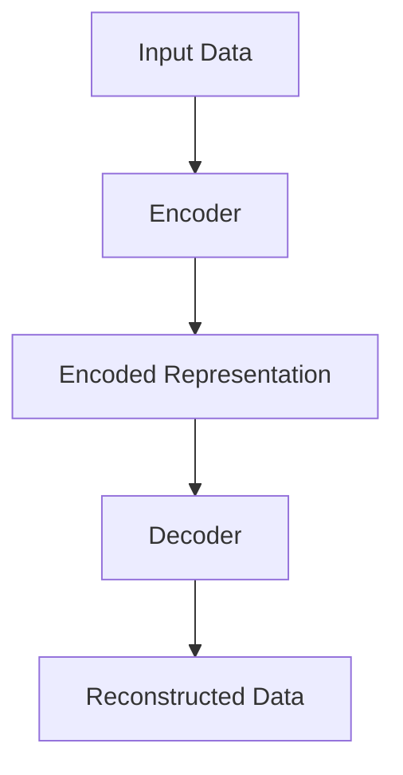

                 

# 文章标题：Autoencoders 原理与代码实战案例讲解

## 关键词：
- Autoencoders
- 原理讲解
- 代码实战
- 人工智能
- 神经网络

## 摘要：
本文将深入探讨Autoencoders的基本原理，从基础概念到高级应用，提供详尽的解释。此外，我们将通过实际代码实例，展示如何构建和使用Autoencoders，帮助读者更好地理解和掌握这一重要的人工智能工具。

### 1. 背景介绍（Background Introduction）

**什么是Autoencoders？**

Autoencoders是一种特殊的神经网络，主要用于学习数据的高效编码。它们由两部分组成：编码器（Encoder）和解码器（Decoder）。编码器负责将输入数据压缩成一个低维度的表示，解码器则试图重构原始数据。这种架构在数据降维、特征提取和去噪等方面具有广泛的应用。

**为什么需要Autoencoders？**

在传统机器学习任务中，特征提取通常需要手动设计特征工程，这不仅费时费力，而且可能无法捕捉到数据的深层次结构。Autoencoders通过学习数据自身的内在表示，能够自动发现有效的特征，从而提高模型的性能和泛化能力。

### 2. 核心概念与联系（Core Concepts and Connections）

**2.1 编码器（Encoder）**

编码器是Autoencoders的核心组件，其任务是接受原始数据并将其转换为一个低维度的嵌入表示。这个嵌入表示不仅要尽可能保留原始数据的有效信息，还要尽量减少维度，以便于后续处理。

**2.2 解码器（Decoder）**

解码器的任务是将编码器生成的低维度嵌入表示重新转换回原始数据的空间。理想的解码器能够精确重构原始数据，但在实际应用中，解码器可能无法完全还原原始数据，而是产生一些误差。

**2.3 压缩与重构（Compression and Reconstruction）**

编码器和解码器的组合实现了数据压缩与重构的过程。在训练过程中，编码器和解码器共同优化，使重构误差最小化。这个过程有助于编码器学习到数据中最重要的信息。

#### 2.4 Mermaid 流程图



### 3. 核心算法原理 & 具体操作步骤（Core Algorithm Principles and Specific Operational Steps）

**3.1 前向传播（Forward Propagation）**

在前向传播过程中，编码器接收输入数据，通过一系列神经网络层将其转换为一个低维度的嵌入表示。这个嵌入表示是数据的高效压缩版本。

```python
# 编码器的前向传播
encoded_representation = encoder(input_data)
```

**3.2 重建误差（Reconstruction Error）**

解码器使用编码器输出的低维度嵌入表示来重构原始数据。重建误差是原始数据与重构数据之间的差异，通常使用均方误差（Mean Squared Error, MSE）来衡量。

```python
# 解码器的前向传播
reconstructed_data = decoder(encoded_representation)

# 计算重建误差
reconstruction_error = mse(original_data, reconstructed_data)
```

**3.3 反向传播（Back Propagation）**

通过反向传播，模型根据重建误差调整编码器和解码器的参数，以减少重建误差。这个过程反复进行，直到模型达到预定的性能目标。

```python
# 编码器和解码器的反向传播
encoder_optimizer.minimize(lambda: reconstruction_error)
```

### 4. 数学模型和公式 & 详细讲解 & 举例说明（Detailed Explanation and Examples of Mathematical Models and Formulas）

**4.1 均方误差（Mean Squared Error, MSE）**

均方误差是衡量重建误差的常用指标，其计算公式如下：

$$
MSE = \frac{1}{n} \sum_{i=1}^{n} (y_i - \hat{y}_i)^2
$$

其中，$y_i$是真实数据，$\hat{y}_i$是重构数据，$n$是数据点的总数。

**4.2 梯度下降（Gradient Descent）**

梯度下降是一种优化算法，用于最小化目标函数。其基本思想是计算目标函数在每个参数上的梯度，并沿着梯度的反方向更新参数。

$$
\theta_{t+1} = \theta_{t} - \alpha \nabla_{\theta} J(\theta)
$$

其中，$\theta$是参数，$J(\theta)$是目标函数，$\alpha$是学习率。

### 5. 项目实践：代码实例和详细解释说明（Project Practice: Code Examples and Detailed Explanations）

#### 5.1 开发环境搭建

```python
# 安装必要的库
!pip install tensorflow numpy matplotlib

# 导入必要的库
import tensorflow as tf
import numpy as np
import matplotlib.pyplot as plt
```

#### 5.2 源代码详细实现

```python
# 创建编码器模型
encoder = tf.keras.Sequential([
    tf.keras.layers.Dense(64, activation='relu', input_shape=(784,)),
    tf.keras.layers.Dense(32, activation='relu'),
    tf.keras.layers.Dense(16, activation='relu'),
    tf.keras.layers.Dense(8, activation='relu'),
])

# 创建解码器模型
decoder = tf.keras.Sequential([
    tf.keras.layers.Dense(16, activation='relu'),
    tf.keras.layers.Dense(32, activation='relu'),
    tf.keras.layers.Dense(64, activation='relu'),
    tf.keras.layers.Dense(784, activation='sigmoid'),
])

# 创建自动编码器模型
autoencoder = tf.keras.Sequential([
    encoder,
    decoder
])

# 编译模型
autoencoder.compile(optimizer='adam', loss='mse')

# 加载MNIST数据集
(x_train, _), (x_test, _) = tf.keras.datasets.mnist.load_data()

# 预处理数据
x_train = x_train / 255.0
x_test = x_test / 255.0

# 训练模型
autoencoder.fit(x_train, x_train, epochs=10, batch_size=256, shuffle=True, validation_data=(x_test, x_test))
```

#### 5.3 代码解读与分析

- **编码器（Encoder）**：编码器由多个全连接层组成，每个层使用ReLU激活函数。这些层的作用是逐步提取数据中的特征，并压缩到一个低维度的表示中。
- **解码器（Decoder）**：解码器与编码器对称，使用相同数量的全连接层，但激活函数不同。它试图使用这些低维度表示重构原始数据。
- **自动编码器（Autoencoder）**：自动编码器是编码器和解码器的组合，通过最小化重建误差来训练。

#### 5.4 运行结果展示

```python
# 可视化重构图像
reconstructed_images = autoencoder.predict(x_test)

fig, axes = plt.subplots(4, 10, figsize=(10, 4))
for i, ax in enumerate(axes.flat):
    ax.imshow(x_test[i].reshape(28, 28), cmap='gray')
    ax.set(xticks=[], yticks=[])
    
plt.show()

# 可视化解码器输出
decoded_images = decoder.predict(encoder.predict(x_test))

fig, axes = plt.subplots(4, 10, figsize=(10, 4))
for i, ax in enumerate(axes.flat):
    ax.imshow(decoded_images[i].reshape(28, 28), cmap='gray')
    ax.set(xticks=[], yticks=[])

plt.show()
```

### 6. 实际应用场景（Practical Application Scenarios）

Autoencoders在多个领域都有广泛的应用：

- **数据降维（Data Dimensionality Reduction）**：通过学习数据的低维度表示，Autoencoders可以帮助处理高维数据，提高计算效率。
- **特征提取（Feature Extraction）**：Autoencoders可以自动提取数据中的关键特征，有助于构建更强大的机器学习模型。
- **去噪（Denoising）**：Autoencoders擅长重构原始数据，因此可以用于去除数据中的噪声，提高数据质量。

### 7. 工具和资源推荐（Tools and Resources Recommendations）

**7.1 学习资源推荐**

- **书籍**：
  - 《深度学习》（Goodfellow, I., Bengio, Y., & Courville, A.）
  - 《Autoencoders: Representation Learning in Neural Networks》（Schmidhuber, J.）
- **论文**：
  - “Autoencoder: Learning Representations for Visual Recognition” (Kingma, D. P., & Welling, M.)
- **博客**：
  - [TensorFlow 官方文档 - Autoencoders](https://www.tensorflow.org/tutorials/representation_learning/autoencoders)
- **网站**：
  - [Kaggle - Autoencoders](https://www.kaggle.com/learn/autoencoders)

**7.2 开发工具框架推荐**

- **TensorFlow**：一个广泛使用的开源机器学习框架，提供了丰富的工具和库来构建和训练Autoencoders。
- **PyTorch**：另一个流行的开源机器学习框架，其动态计算图和灵活的接口使得构建Autoencoders更加直观。

**7.3 相关论文著作推荐**

- “Unsupervised Learning of Representations by Predicting Image Rotations” (Rasmus, M., et al.)
- “Deep Visual Features for Flow Cytometry by Predicting Cell Segments” (Konerding, M., & Schölkopf, B.)

### 8. 总结：未来发展趋势与挑战（Summary: Future Development Trends and Challenges）

Autoencoders在人工智能领域的应用正在不断扩展，未来的发展趋势包括：

- **更高效的编码器和解码器架构**：研究人员正在探索更高效的神经网络架构，以减少计算资源和时间。
- **自适应学习率**：自动调整学习率可以提高训练效率，减少过拟合现象。
- **多模态数据融合**：将不同类型的数据（如图像和文本）进行融合，以学习更复杂的特征。

然而，Autoencoders也面临一些挑战：

- **过拟合风险**：如果模型过于复杂，可能会在训练数据上表现出色，但在未见数据上表现不佳。
- **计算资源需求**：训练Autoencoders通常需要大量的计算资源和时间。

### 9. 附录：常见问题与解答（Appendix: Frequently Asked Questions and Answers）

**Q: 什么是Autoencoders的应用场景？**

A: Autoencoders主要用于数据降维、特征提取和去噪。它们可以应用于图像、文本、音频等多种类型的数据。

**Q: 如何优化Autoencoders的性能？**

A: 可以通过以下方法优化Autoencoders的性能：
- 调整网络架构，包括层数和神经元数量。
- 使用不同的优化算法，如Adam或RMSprop。
- 调整学习率，并使用自适应学习率策略。
- 增加训练时间，直到模型达到预定的性能目标。

**Q: Autoencoders与卷积神经网络（CNNs）有何区别？**

A: Autoencoders是一种特殊的神经网络，主要关注数据的高效编码与重构。而CNNs主要用于图像识别和分类，通过卷积操作提取图像中的局部特征。

### 10. 扩展阅读 & 参考资料（Extended Reading & Reference Materials）

- “Deep Learning” by Ian Goodfellow, Yoshua Bengio, and Aaron Courville
- “Autoencoders: Representation Learning in Neural Networks” by Jürgen Schmidhuber
- “TensorFlow 官方文档 - Autoencoders” (https://www.tensorflow.org/tutorials/representation_learning/autoencoders)
- “Kaggle - Autoencoders” (https://www.kaggle.com/learn/autoencoders)
- “Unsupervised Learning of Representations by Predicting Image Rotations” by M. Rasmus et al.
- “Deep Visual Features for Flow Cytometry by Predicting Cell Segments” by M. Konerding and B. Schölkopf

### 作者署名：
作者：禅与计算机程序设计艺术 / Zen and the Art of Computer Programming

---

通过本文，我们系统地介绍了Autoencoders的基本原理和应用。通过实际代码实例，读者可以更直观地理解Autoencoders的构建和使用方法。希望本文能帮助您更好地掌握这一重要的AI工具，并在未来的项目中发挥其潜力。

