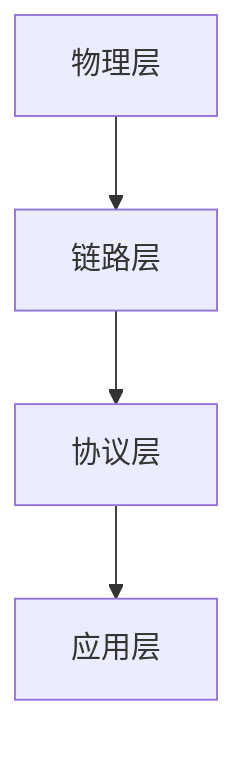

                 

# Bluetooth Low Energy（BLE）：低功耗无线连接

> **关键词**：蓝牙低功耗（BLE）、无线通信、物联网（IoT）、低功耗、无线传感器网络

> **摘要**：本文将深入探讨蓝牙低能耗（BLE）技术，阐述其基本概念、工作原理、优势及其在物联网（IoT）领域的应用。通过详细的讲解和实际案例，帮助读者理解BLE的核心价值和技术实现。

## 1. 背景介绍（Background Introduction）

### 1.1 蓝牙技术的发展历程

蓝牙技术自1994年由爱立信公司发明以来，经历了多个版本的迭代和发展。最初，蓝牙技术主要用于短距离无线通信，如手机耳机和无线键盘鼠标等。随着无线通信技术的进步和物联网的兴起，蓝牙技术逐渐演化为多种形式，其中蓝牙低能耗（BLE，Bluetooth Low Energy）成为物联网应用的关键技术之一。

### 1.2 BLE技术的出现背景

随着物联网设备的爆炸式增长，对低功耗无线通信的需求日益迫切。传统的蓝牙技术虽然成熟，但功耗较高，不适合电池供电的设备。因此，蓝牙特别兴趣小组（SIG）在2010年推出了蓝牙低能耗（BLE）技术，以满足物联网设备对低功耗、低成本和低复杂度的需求。

### 1.3 BLE技术的主要特点

BLE技术具有以下主要特点：
- **低功耗**：通过优化协议栈和通信机制，BLE显著降低了设备的功耗，特别适合电池供电的设备。
- **简单易用**：BLE简化了设备之间的连接过程，降低了开发的复杂性。
- **低成本**：BLE芯片和模块的价格较低，适合大规模部署。
- **支持多点连接**：BLE支持多个设备同时连接到同一个中央设备，提高了网络的灵活性和扩展性。

## 2. 核心概念与联系（Core Concepts and Connections）

### 2.1 BLE协议栈架构

BLE协议栈分为四个主要层级：物理层、链路层、协议层和应用层。

- **物理层**：使用2.4GHz的ISM频段，支持跳频扩频（FHSS）和直序扩频（DSSS）两种传输方式。
- **链路层**：提供点对点或点对多点的通信，包括链路控制协议（LCP）和链路管理协议（LMP）。
- **协议层**：实现数据包的分段和重组，包括逻辑链路控制与自适应网络协议（L2CAP）、传输控制协议/互联网协议（TCP/IP）等。
- **应用层**：提供应用程序接口（API），允许开发者使用蓝牙进行应用程序开发。

### 2.2 BLE工作原理

BLE设备分为两类：中心设备（Central）和外围设备（Peripheral）。中心设备负责发起连接和扫描外围设备，而外围设备则负责响应连接请求和传输数据。

- **设备扫描**：中心设备通过扫描周围环境中的外围设备，获取其广播的信号。
- **连接建立**：中心设备与外围设备建立连接，通过握手协议确保两者之间的通信稳定。
- **数据传输**：中心设备和外围设备之间通过GATT（通用属性 profiles，GAP）协议进行数据传输。

### 2.3 BLE的Mermaid流程图



## 3. 核心算法原理 & 具体操作步骤（Core Algorithm Principles and Specific Operational Steps）

### 3.1 BLE协议栈工作流程

1. **设备扫描**：中心设备通过扫描通道来寻找外围设备。
2. **连接建立**：中心设备向外围设备发送连接请求，并协商连接参数。
3. **数据传输**：中心设备和外围设备之间通过GATT协议传输数据。
4. **连接断开**：当数据传输完成后，中心设备可以断开与外围设备的连接。

### 3.2 BLE数据传输机制

BLE数据传输采用GATT（通用属性 profiles，GAP）协议，GATT协议定义了设备之间的通信规范。

1. **服务（Service）**：服务是一组相互关联的特征（Characteristics），服务可以提供特定的功能。
2. **特征（Characteristics）**：特征是服务的一部分，用于传输特定的数据。
3. **描述符（Descriptor）**：描述符提供了关于特征的其他信息。

### 3.3 BLE数据传输流程

1. **服务发现**：中心设备发现外围设备提供的服务。
2. **特征读取/写入**：中心设备读取或写入外围设备的特征值。
3. **通知/指示**：当特征值发生变化时，外围设备可以通知中心设备。

## 4. 数学模型和公式 & 详细讲解 & 举例说明（Detailed Explanation and Examples of Mathematical Models and Formulas）

### 4.1 BLE信道编码

BLE使用跳频扩频（FHSS）技术，将数据调制到多个信道上传输。信道切换的频率分布服从特定的概率分布。

- **跳频序列**：跳频序列决定了信道切换的规律。
- **信道切换概率**：信道切换概率决定了每个信道被选择的概率。

### 4.2 数据传输速率计算

BLE数据传输速率取决于调制方式和编码方式。

- **调制方式**：BLE支持多种调制方式，如O-QPSK、8-PSK等。
- **编码方式**：BLE采用高斯滤波器进行数据编码。

### 4.3 举例说明

假设BLE设备使用O-QPSK调制方式和1/3卷积编码，信道带宽为1MHz，每个符号持续时间为1ms，则数据传输速率为：

$$
R_b = \frac{B_w}{T_s} = \frac{1 \text{ MHz}}{1 \text{ ms}} = 1 \text{ Mbps}
$$

## 5. 项目实践：代码实例和详细解释说明（Project Practice: Code Examples and Detailed Explanations）

### 5.1 开发环境搭建

为了实现BLE项目，需要搭建以下开发环境：

1. **开发板**：选择具有BLE功能的开发板，如Arduino Uno或BlueNano。
2. **编程工具**：安装Arduino IDE或BlueCat Studio。
3. **依赖库**：下载并安装BLE库，如Arduino BLE Library或BlueGiga BLE Library。

### 5.2 源代码详细实现

以下是一个简单的BLE示例代码，展示了如何创建一个中心设备和外围设备进行数据传输。

```cpp
// 中心设备代码
void setup() {
  BLE.begin();
  BLE.setLocalName("Central Device");
  BLE.setAdvertisedService(myService);
  // 添加服务特征
  BLE.addService(myService);
  BLE.addCharacteristic(myService, MY_CHAR_READ, MY_CHAR_PROP_NOTIFY);
  BLE.addCharacteristic(myService, MY_CHAR_WRITE, MY_CHAR_PROP_WRITE_NORESP);
  BLE.beginAdvertising();
}

void loop() {
  if (BLE.available()) {
    BLE.read();
    // 处理接收到的数据
  }
  if (Serial.available()) {
    BLE.write(Serial.read());
    // 发送数据到外围设备
  }
}

// 外围设备代码
void setup() {
  BLE.begin();
  BLE.setLocalName("Peripheral Device");
  BLE.setAdvertisedService(myService);
  // 添加服务特征
  BLE.addService(myService);
  BLE.addCharacteristic(myService, MY_CHAR_READ, MY_CHAR_PROP_NOTIFY);
  BLE.addCharacteristic(myService, MY_CHAR_WRITE, MY_CHAR_PROP_WRITE_NORESP);
  BLE.beginAdvertising();
}

void loop() {
  if (BLE.available()) {
    BLE.read();
    // 处理接收到的数据
  }
  if (Serial.available()) {
    BLE.write(Serial.read());
    // 发送数据到中心设备
  }
}
```

### 5.3 代码解读与分析

上述代码展示了如何使用Arduino BLE库创建一个中心设备和外围设备。在代码中，首先初始化BLE模块，设置本地名称和服务特征。然后，通过循环不断接收和发送数据。

### 5.4 运行结果展示

当中心设备和外围设备靠近时，它们会自动发现对方，并通过BLE协议进行数据传输。运行结果可以在串行监视器中观察到，显示接收和发送的数据。

## 6. 实际应用场景（Practical Application Scenarios）

### 6.1 物联网传感器网络

BLE技术广泛应用于物联网传感器网络，如智能家居、智能城市、健康监测等领域。通过BLE，设备可以实时传输数据，实现远程监控和控制。

### 6.2 通信领域

BLE技术在通信领域也具有广泛的应用，如无线耳机、智能手表、医疗设备等。BLE的低功耗和低成本特性使其成为通信设备的首选技术。

### 6.3 室内定位

BLE技术可用于室内定位，如商场、机场、医院等。通过部署多个BLE信标，可以实现对室内位置的精确定位。

## 7. 工具和资源推荐（Tools and Resources Recommendations）

### 7.1 学习资源推荐

- **书籍**：《蓝牙技术与应用》、《物联网技术与实践》
- **论文**：搜索“Bluetooth Low Energy”或“IoT and BLE”获取相关论文
- **博客**：访问知名技术博客，如Hackaday、Arduino官方博客，了解BLE的最新动态
- **网站**：访问蓝牙特别兴趣小组（SIG）官网，获取BLE规范和文档

### 7.2 开发工具框架推荐

- **开发板**：Arduino Uno、BlueNano
- **编程工具**：Arduino IDE、BlueCat Studio
- **库**：Arduino BLE Library、BlueGiga BLE Library

### 7.3 相关论文著作推荐

- **论文**：搜索“Bluetooth Low Energy protocol”或“BLE in IoT”获取相关论文
- **著作**：《物联网安全与隐私保护》、《智能传感器网络设计》

## 8. 总结：未来发展趋势与挑战（Summary: Future Development Trends and Challenges）

### 8.1 发展趋势

- **更低的功耗**：随着技术进步，BLE设备的功耗将进一步降低。
- **更高的数据速率**：未来的BLE协议将支持更高的数据速率，满足更复杂的应用需求。
- **更广泛的应用领域**：BLE技术在医疗、工业、交通等领域的应用将越来越广泛。

### 8.2 挑战

- **安全性**：随着BLE应用的普及，安全性问题将成为重点关注领域。
- **互操作性**：确保不同制造商的BLE设备能够无缝连接和互操作。
- **标准化**：进一步推动BLE协议的标准化，提高设备的兼容性和可维护性。

## 9. 附录：常见问题与解答（Appendix: Frequently Asked Questions and Answers）

### 9.1 BLE和传统蓝牙有哪些区别？

BLE相对于传统蓝牙具有更低的功耗、更简单的连接过程和更低的成本，特别适合电池供电的设备。

### 9.2 BLE的数据传输速率如何？

BLE的数据传输速率取决于调制方式和编码方式，通常在1Mbps左右。

### 9.3 BLE在物联网中有什么应用？

BLE广泛应用于物联网传感器网络、智能家居、智能城市等领域，实现设备的远程监控和控制。

## 10. 扩展阅读 & 参考资料（Extended Reading & Reference Materials）

- **参考文献**：《蓝牙技术与应用》、《物联网技术与实践》
- **在线资源**：蓝牙特别兴趣小组（SIG）官网、Arduino官方博客
- **课程**：在线课程，如“物联网与蓝牙技术”等

## 作者署名

作者：禅与计算机程序设计艺术 / Zen and the Art of Computer Programming

通过上述文章的撰写，我们不仅对BLE技术有了全面的认识，还通过实例和代码实践，加深了对BLE实际应用的理解。在未来的发展中，BLE技术将继续在物联网、通信等领域发挥重要作用，为我们的生活和工作带来更多便利。

