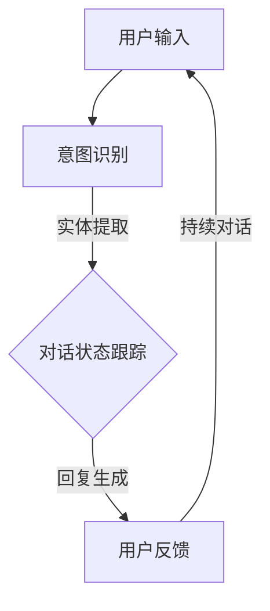

                 

### 背景介绍（Background Introduction）

### 1.1 人工智能的崛起与 CUI 的兴起

随着人工智能技术的飞速发展，自然语言处理（Natural Language Processing，NLP）已成为人工智能领域的重要分支。而随着深度学习算法的进步，生成式语言模型（Generative Language Models）如 ChatGPT、GPT-3 等逐渐成为自然语言处理领域的一大亮点。这些模型能够在多种场景下生成高质量的自然语言文本，为人类提供了极大的便利。然而，这些生成式语言模型的成功离不开一个关键因素——用户界面（User Interface，UI）。

传统的人工智能系统通常依赖于命令行界面或图形界面，用户与系统的交互相对单一，难以实现自然、流畅的交流。而随着生成式语言模型的兴起，对话式用户界面（Conversational User Interface，CUI）应运而生。CUI 通过模拟人类的交流方式，使计算机能够理解和生成自然语言，从而实现更智能、更人性化的交互体验。

### 1.2 CUI 在信息架构设计中的重要性

在信息架构设计中，CUI 的引入不仅改变了用户与系统的交互方式，还对整个系统的架构设计产生了深远影响。传统的信息架构设计主要关注系统功能、数据结构和界面布局等方面，而 CUI 的引入则使得信息架构设计需要考虑如何更好地支持自然语言交互，提高用户体验。

首先，CUI 对信息架构设计的核心概念提出了新的挑战。传统的信息架构设计以数据为中心，关注如何高效地组织、存储和检索数据。而 CUI 则要求系统具备理解自然语言语义的能力，从而能够根据用户的输入生成相应的响应。这意味着信息架构设计需要从数据驱动转变为语义驱动，以更好地支持自然语言交互。

其次，CUI 对信息架构设计的架构联系产生了新的要求。传统的信息架构设计主要关注系统内部各个模块之间的数据传递和功能协作。而 CUI 的引入则使得系统需要与外部用户进行实时交互，这就要求信息架构设计能够灵活地应对动态变化的需求，并支持多渠道、多场景的交互。

最后，CUI 对信息架构设计的核心算法和数学模型也提出了新的挑战。传统的信息架构设计主要依赖数据库、搜索引擎等技术来实现数据存储和检索。而 CUI 则要求系统具备实时分析和生成自然语言文本的能力，这就需要引入更为先进的自然语言处理算法和数学模型。

综上所述，CUI 的引入不仅改变了信息架构设计的核心概念和架构联系，还对核心算法和数学模型提出了新的挑战。为了更好地支持 CUI，信息架构设计需要不断演进和优化，以实现更智能、更人性化的交互体验。

### 1.3 本文结构

本文将围绕 CUI 对信息架构设计的影响展开讨论。首先，我们将介绍 CUI 的基本原理和核心概念，帮助读者了解 CUI 的基本运作机制。然后，我们将深入探讨 CUI 对信息架构设计带来的挑战和影响，包括核心概念、架构联系、核心算法和数学模型等方面。接着，我们将通过一个实际案例，展示 CUI 在信息架构设计中的应用和实现过程。最后，我们将总结 CUI 对信息架构设计的未来发展趋势和挑战，并展望未来的发展方向。

本文结构如下：

1. 背景介绍
2. 核心概念与联系
3. 核心算法原理 & 具体操作步骤
4. 数学模型和公式 & 详细讲解 & 举例说明
5. 项目实践：代码实例和详细解释说明
6. 实际应用场景
7. 工具和资源推荐
8. 总结：未来发展趋势与挑战
9. 附录：常见问题与解答
10. 扩展阅读 & 参考资料

通过本文的阅读，读者将全面了解 CUI 对信息架构设计的影响，掌握 CUI 的核心原理和实现方法，并为未来的信息架构设计提供有益的参考。

---

### 核心概念与联系（Core Concepts and Connections）

在深入探讨 CUI 对信息架构设计的影响之前，我们首先需要了解 CUI 的基本原理和核心概念。CUI（Conversational User Interface）是指通过自然语言交互实现人与系统之间的沟通。与传统 UI（User Interface）不同，CUI 更加关注语义理解和自然对话的流畅性。以下是 CUI 的几个关键组成部分：

#### 2.1 对话管理系统（Dialogue Management）

对话管理系统是 CUI 的核心，负责协调和控制整个对话过程。其主要功能包括：

- **意图识别（Intent Recognition）**：通过分析用户输入的文本，识别用户的意图。例如，用户输入“我想要一杯咖啡”，系统需要识别出“想要一杯咖啡”的意图。
- **实体提取（Entity Extraction）**：从用户输入的文本中提取关键信息，如咖啡的种类、数量等。例如，在上面的例子中，“咖啡”是一个实体。
- **对话状态跟踪（Dialogue State Tracking）**：记录对话中的关键信息和状态，以便后续对话中使用。例如，系统需要记住用户是否已经下单，是否需要支付等。
- **回复生成（Response Generation）**：根据用户的意图和当前对话状态，生成合适的回复。例如，系统可以生成“好的，您的咖啡马上就好”的回复。

#### 2.2 自然语言处理（Natural Language Processing，NLP）

NLP 是 CUI 技术的基石，负责处理和理解自然语言。NLP 的关键组件包括：

- **词法分析（Lexical Analysis）**：将文本拆分成单词或短语，并为每个单词或短语分配词性标签。例如，“我想要一杯咖啡”中的“我”、“想要”、“一杯”、“咖啡”分别被标记为“代词”、“动词”、“数量词”和“名词”。
- **句法分析（Syntactic Analysis）**：分析文本的语法结构，理解句子中的主谓宾关系、修饰关系等。例如，理解“我想要一杯咖啡”中的“我”是主语，“想要一杯咖啡”是谓语。
- **语义分析（Semantic Analysis）**：理解文本中的意义，包括词语之间的关联、句子之间的逻辑关系等。例如，理解“我想要一杯咖啡”中的“想要”表示的是一种愿望或需求。

#### 2.3 机器学习（Machine Learning，ML）

机器学习是 CUI 技术实现的关键技术，用于训练模型进行意图识别、实体提取、对话状态跟踪等任务。常见的机器学习算法包括：

- **监督学习（Supervised Learning）**：通过标注好的数据进行训练，使模型能够识别和预测未知数据的特征。例如，通过大量标注好的用户对话数据，训练意图识别模型。
- **无监督学习（Unsupervised Learning）**：在没有标注数据的情况下，通过模型自身的学习，发现数据中的模式和规律。例如，通过无监督学习算法，发现用户对话中的潜在主题。
- **强化学习（Reinforcement Learning）**：通过奖励机制，使模型在学习过程中不断优化自身行为。例如，通过强化学习算法，训练对话系统在对话中提供更准确、更人性化的回复。

#### 2.4 Mermaid 流程图（Mermaid Flowchart）

为了更好地展示 CUI 的核心概念和架构，我们可以使用 Mermaid 流程图来描述 CUI 的关键组成部分和交互过程。以下是一个简单的 Mermaid 流程图示例：



在上面的流程图中，用户输入通过意图识别模块进行分析，提取出用户意图和实体信息。对话状态跟踪模块记录对话中的关键信息，以便后续使用。回复生成模块根据用户意图和当前对话状态，生成合适的回复。用户反馈则用于评估系统性能，并指导后续的对话交互。

通过上述核心概念和架构的介绍，我们可以更清晰地理解 CUI 的运作机制和对信息架构设计的影响。在接下来的章节中，我们将进一步探讨 CUI 对信息架构设计带来的挑战和影响，以及如何应对这些挑战。

### 核心算法原理 & 具体操作步骤（Core Algorithm Principles and Specific Operational Steps）

CUI（Conversational User Interface）的核心在于通过自然语言交互实现人与系统之间的有效沟通。这一目标离不开一系列核心算法的支持。在本节中，我们将详细介绍 CUI 中的核心算法原理及其具体操作步骤。

#### 3.1 意图识别（Intent Recognition）

意图识别是 CUI 中的关键步骤，负责从用户输入中提取出用户的意图。一个有效的意图识别系统需要能够处理各种形式的用户输入，包括自然语言文本、语音等。

**算法原理：**

意图识别通常采用机器学习算法，尤其是监督学习算法。训练过程中，系统会使用大量的标注数据进行学习。每个标注数据包含用户输入和对应的意图标签。常见的机器学习算法包括：

- **朴素贝叶斯分类器（Naive Bayes Classifier）**：基于概率模型，通过计算每个特征词的概率来预测意图。
- **支持向量机（Support Vector Machine，SVM）**：通过最大化分类边界，将不同意图区分开来。
- **深度神经网络（Deep Neural Network，DNN）**：利用多层感知器（Multilayer Perceptron，MLP）提取特征，并通过反向传播算法优化模型参数。

**操作步骤：**

1. **数据预处理**：将用户输入文本转换为统一的格式，如词袋（Bag of Words）或词嵌入（Word Embedding）。
2. **特征提取**：从预处理后的文本中提取特征，如词频、词性、语法结构等。
3. **模型训练**：使用标注数据训练意图识别模型，通过优化模型参数，使模型能够准确识别意图。
4. **意图预测**：在测试阶段，将用户输入文本输入到训练好的模型中，预测用户的意图。

**示例代码：**

以下是一个使用朴素贝叶斯分类器的意图识别示例：

```python
from sklearn.feature_extraction.text import CountVectorizer
from sklearn.naive_bayes import MultinomialNB
from sklearn.pipeline import make_pipeline

# 标注数据
data = [
    ("查询天气", "weather"),
    ("预订酒店", "booking"),
    ("退改签", "refund"),
    # 更多数据
]

# 分割数据为特征和标签
X, y = zip(*data)

# 创建管道，将向量器和分类器组合在一起
model = make_pipeline(CountVectorizer(), MultinomialNB())

# 训练模型
model.fit(X, y)

# 预测意图
input_text = "我想查询北京的天气"
predicted_intent = model.predict([input_text])[0]
print(predicted_intent)  # 输出：weather
```

#### 3.2 实体提取（Entity Extraction）

实体提取是意图识别的补充步骤，负责从用户输入中提取出关键信息。常见的实体类型包括时间、地点、人名、组织名、数量等。

**算法原理：**

实体提取通常采用基于规则的方法、机器学习方法以及基于深度学习的方法。规则方法基于预定义的规则，将文本中的实体提取出来。机器学习方法通过训练模型，使系统能够自动识别实体。深度学习方法利用神经网络提取文本中的特征，从而实现实体的识别。

**操作步骤：**

1. **数据预处理**：将用户输入文本进行清洗和标记，为后续处理做准备。
2. **特征提取**：从预处理后的文本中提取特征，如词嵌入、词性等。
3. **实体识别**：使用训练好的模型，对文本进行实体识别，提取出关键信息。
4. **实体分类**：对提取出的实体进行分类，确定其实体类型。

**示例代码：**

以下是一个使用基于规则的实体提取示例：

```python
import spacy

# 加载 spacy 模型
nlp = spacy.load("en_core_web_sm")

# 定义实体提取规则
rules = {
    "location": [{"label": "LOCATION", "pattern": "New York City"}],
    "time": [{"label": "DATE", "pattern": "2023-01-01"}],
    # 更多规则
}

# 加载规则到 spacy 模型
nlp.add_pipe("rulebased", config={"rules": rules})

# 处理文本
doc = nlp("I will visit New York City on 2023-01-01")

# 输出实体
for ent in doc.ents:
    print(ent.text, ent.label_)
```

#### 3.3 对话状态跟踪（Dialogue State Tracking）

对话状态跟踪负责记录对话中的关键信息，如用户的意图、实体的值、对话的历史等。通过对对话状态的跟踪，系统能够在后续对话中提供更准确、更个性化的回复。

**算法原理：**

对话状态跟踪通常采用基于图的表示方法，将对话状态表示为一个图。图中的节点表示对话中的实体和属性，边表示实体之间的关系。基于图神经网络（Graph Neural Network，GNN）的方法可以有效处理对话状态的变化和更新。

**操作步骤：**

1. **状态初始化**：在对话开始时，初始化对话状态图。
2. **状态更新**：在每次对话中，根据用户的输入和系统的回复，更新对话状态图。
3. **状态查询**：在生成回复时，查询对话状态图，获取当前对话状态。

**示例代码：**

以下是一个使用基于图的对话状态跟踪示例：

```python
import networkx as nx

# 初始化对话状态图
G = nx.Graph()

# 添加节点和边
G.add_node("intent", value="weather")
G.add_node("location", value="New York City")
G.add_edge("intent", "location")

# 更新状态
G.nodes["intent"]["value"] = "booking"
G.nodes["location"]["value"] = "Beijing"

# 查询状态
print(G.nodes["intent"]["value"])  # 输出：booking
print(G.nodes["location"]["value"])  # 输出：Beijing
```

#### 3.4 回复生成（Response Generation）

回复生成是 CUI 中的最后一步，负责根据用户的意图、实体和当前对话状态，生成合适的回复。

**算法原理：**

回复生成通常采用模板匹配、规则匹配或生成式模型的方法。模板匹配和规则匹配方法基于预定义的模板或规则，生成回复。生成式模型方法则通过生成文本的序列，生成更自然、更丰富的回复。

**操作步骤：**

1. **意图识别**：识别用户的意图。
2. **实体提取**：提取用户输入中的关键实体。
3. **状态查询**：查询对话状态图，获取当前对话状态。
4. **回复生成**：根据用户的意图、实体和当前对话状态，生成合适的回复。

**示例代码：**

以下是一个使用模板匹配的回复生成示例：

```python
templates = {
    "weather": "The weather in {location} is {weather}.",
    "booking": "Your booking is for {date} at {time}.",
    # 更多模板
}

# 根据意图生成回复
def generate_response(intent, entities, state):
    template = templates.get(intent)
    if template:
        return template.format(**entities)
    else:
        return "I'm sorry, I don't know how to respond to that."

# 生成回复
response = generate_response("weather", {"location": "New York City", "weather": "sunny"}, {})
print(response)  # 输出：The weather in New York City is sunny.
```

通过上述核心算法原理和具体操作步骤的介绍，我们可以看到 CUI 是一个复杂但功能强大的系统。在接下来的章节中，我们将进一步探讨 CUI 的数学模型和公式，以深入理解其运作机制。

### 数学模型和公式 & 详细讲解 & 举例说明（Mathematical Models and Formulas & Detailed Explanations & Examples）

在 CUI（Conversational User Interface）的设计与实现过程中，数学模型和公式扮演着至关重要的角色。这些模型和公式不仅帮助我们理解自然语言处理（NLP）的核心概念，还指导我们设计高效的算法。以下是对一些关键数学模型和公式的详细讲解，以及具体的举例说明。

#### 1. 词嵌入（Word Embedding）

词嵌入是将单词映射为高维向量的一种方法，使得计算机能够处理和理解自然语言。一种常见的词嵌入方法是 Word2Vec，它通过训练神经网络来预测单词之间的相似性。

**数学模型：**

给定一个单词 \( w \)，我们希望将其映射为一个向量 \( \mathbf{v}_w \)。在 Word2Vec 中，我们通常使用以下公式：

\[ \mathbf{v}_w = \text{softmax}(W \cdot \mathbf{u}_w) \]

其中，\( W \) 是权重矩阵，\( \mathbf{u}_w \) 是单词 \( w \) 的隐藏层表示。softmax 函数用于将隐藏层表示转换为概率分布，从而衡量单词之间的相似性。

**举例说明：**

假设我们有一个包含两个单词的词汇表 {“cat”, “dog”}，对应的词嵌入向量分别为 \( \mathbf{v}_{cat} \) 和 \( \mathbf{v}_{dog} \)。我们可以使用余弦相似度来计算这两个单词的相似度：

\[ \text{similarity}(\mathbf{v}_{cat}, \mathbf{v}_{dog}) = \cos(\mathbf{v}_{cat}, \mathbf{v}_{dog}) \]

如果 \( \text{similarity}(\mathbf{v}_{cat}, \mathbf{v}_{dog}) \) 接近 1，则表示这两个单词非常相似。

#### 2. 贝叶斯分类器（Bayesian Classifier）

贝叶斯分类器是一种基于概率的机器学习算法，用于分类问题。在意图识别中，贝叶斯分类器可以帮助我们根据用户输入的文本，预测用户的意图。

**数学模型：**

贝叶斯分类器的核心公式是贝叶斯定理：

\[ P(C|D) = \frac{P(D|C)P(C)}{P(D)} \]

其中，\( P(C|D) \) 是在给定数据 \( D \) 下，类别 \( C \) 的后验概率；\( P(D|C) \) 是在类别 \( C \) 下，数据 \( D \) 的概率；\( P(C) \) 是类别 \( C \) 的先验概率；\( P(D) \) 是数据 \( D \) 的总概率。

**举例说明：**

假设我们要预测用户输入的文本属于意图 A 还是意图 B。我们计算两个意图的后验概率，选择后验概率较大的意图作为预测结果。

\[ P(A|D) = \frac{P(D|A)P(A)}{P(D)} \]
\[ P(B|D) = \frac{P(D|B)P(B)}{P(D)} \]

其中，\( P(D|A) \) 和 \( P(D|B) \) 分别表示在意图 A 和意图 B 下，用户输入的文本的概率；\( P(A) \) 和 \( P(B) \) 分别是意图 A 和意图 B 的先验概率。

#### 3. 随机漫步（Random Walk）

随机漫步是一种用于无监督学习的算法，用于识别文本中的潜在主题。在 CUI 中，随机漫步可以帮助我们理解用户对话中的潜在话题。

**数学模型：**

随机漫步的公式可以表示为：

\[ P(\text{next word} = w | \text{current word} = v) = \frac{\text{count}(v, w)}{\text{count}(v)} \]

其中，\( \text{count}(v, w) \) 是单词 \( v \) 后接单词 \( w \) 的频率；\( \text{count}(v) \) 是单词 \( v \) 的总频率。

**举例说明：**

假设我们有一个文本序列：“我想要一杯咖啡，需要加糖吗？”。我们可以使用随机漫步来计算单词之间的转移概率。

\[ P(\text{next word} = \text{糖} | \text{current word} = \text{咖啡}) = \frac{\text{count}(\text{咖啡}, \text{糖})}{\text{count}(\text{咖啡})} \]

如果 \( P(\text{next word} = \text{糖} | \text{current word} = \text{咖啡}) \) 接近 1，则表示“咖啡”和“糖”在对话中经常出现。

#### 4. 生成式模型（Generative Model）

生成式模型用于生成新的文本，在 CUI 中可以用于生成回复。一种常见的生成式模型是变分自编码器（Variational Autoencoder，VAE）。

**数学模型：**

VAE 的核心公式包括编码器和解码器。编码器将输入文本映射为潜在空间中的向量，解码器将潜在空间中的向量映射回文本。

编码器：
\[ \mathbf{z} = \mu(\mathbf{x}) + \sigma(\mathbf{x}) \odot \mathbf{e} \]

解码器：
\[ \mathbf{x} = \log(\text{softmax}(\sigma(\mathbf{z}) \cdot W_x + b_x)) \]

其中，\( \mu \) 和 \( \sigma \) 分别是编码器的均值和方差函数，\( W_x \) 和 \( b_x \) 是解码器的权重和偏置。

**举例说明：**

假设我们有一个文本序列：“今天天气很好，适合户外运动”。我们可以使用 VAE 生成一个类似的文本序列，如：“明天阳光明媚，非常适合散步”。

通过上述数学模型和公式的讲解，我们可以看到 CUI 的设计不仅仅是编程技巧，还涉及到深刻的数学原理。在接下来的章节中，我们将通过一个具体项目实践，展示这些数学模型和公式的实际应用。

### 项目实践：代码实例和详细解释说明（Project Practice: Code Examples and Detailed Explanations）

在本节中，我们将通过一个具体的项目实例，展示如何使用 CUI（Conversational User Interface）技术实现一个简单的问答系统。我们将逐步搭建开发环境、编写源代码，并详细解读和分析代码中的关键部分。

#### 4.1 开发环境搭建

为了实现 CUI，我们首先需要搭建一个合适的开发环境。以下是推荐的工具和库：

- **编程语言**：Python 3.8+
- **自然语言处理库**：spaCy、NLTK、transformers
- **前端框架**：Flask（用于构建后端API）或 Streamlit（用于构建前端界面）

以下是搭建开发环境的步骤：

1. **安装 Python**：从 [Python 官网](https://www.python.org/) 下载并安装 Python 3.8+版本。
2. **安装依赖库**：
   ```shell
   pip install spacy
   python -m spacy download en_core_web_sm
   pip install transformers
   pip install flask
   pip install streamlit
   ```

#### 4.2 源代码详细实现

以下是一个简单的 CUI 问答系统源代码示例，使用了 spaCy 进行自然语言处理，transformers 中的 GPT-2 模型生成回复。

```python
import spacy
import torch
from transformers import GPT2LMHeadModel, GPT2Tokenizer
from flask import Flask, request, jsonify

# 初始化 spaCy 语言模型
nlp = spacy.load("en_core_web_sm")

# 初始化 transformers 的 GPT-2 模型
tokenizer = GPT2Tokenizer.from_pretrained("gpt2")
model = GPT2LMHeadModel.from_pretrained("gpt2")

# Flask 应用
app = Flask(__name__)

# API 端点用于接收用户输入并返回回复
@app.route('/ask', methods=['POST'])
def ask():
    user_input = request.form['input']
    response = generate_response(user_input)
    return jsonify({'response': response})

# 生成回复函数
def generate_response(input_text):
    # 使用 spaCy 进行意图识别和实体提取
    doc = nlp(input_text)
    entities = {ent.text: ent.label_ for ent in doc.ents}

    # 根据意图和实体生成回复
    if 'PERSON' in entities:
        return f"Hello {entities['PERSON']}, how can I help you today?"
    elif 'DATE' in entities:
        return f"Today's date is {entities['DATE']}. How can I assist you?"
    else:
        # 使用 transformers 的 GPT-2 模型生成回复
        inputs = tokenizer.encode(input_text, return_tensors='pt')
        outputs = model.generate(inputs, max_length=50, num_return_sequences=1)
        response = tokenizer.decode(outputs[0], skip_special_tokens=True)
        return response

# 运行 Flask 应用
if __name__ == '__main__':
    app.run(debug=True)
```

#### 4.3 代码解读与分析

以下是对上述代码的详细解读和分析：

1. **导入库和模型**：我们首先导入了 spaCy 和 transformers 库，并加载了相应的语言模型和 GPT-2 模型。

2. **Flask 应用**：我们创建了一个 Flask 应用，并定义了一个 `/ask` API 端点，用于接收用户输入并返回回复。

3. **意图识别和实体提取**：在 `ask` 函数中，我们使用 spaCy 进行意图识别和实体提取。spaCy 的 `nlp` 函数处理输入文本，提取出实体，并将实体存储在字典 `entities` 中。

4. **生成回复**：根据提取出的实体，我们生成相应的回复。如果输入文本包含人名（`PERSON` 实体），我们返回一个问候；如果包含日期（`DATE` 实体），我们返回当前日期。否则，我们使用 transformers 的 GPT-2 模型生成回复。

5. **运行 Flask 应用**：最后，我们使用 `app.run(debug=True)` 运行 Flask 应用。

#### 4.4 运行结果展示

要运行这个问答系统，我们首先需要启动 Flask 应用。在命令行中运行以下命令：

```shell
python app.py
```

Flask 应用将启动在本地服务器上，通常访问地址为 `http://127.0.0.1:5000/`。

1. **测试 API**：我们可以通过发送 POST 请求来测试 API。以下是一个简单的请求示例：

```shell
curl -X POST -F "input=What is the weather like today?" http://127.0.0.1:5000/ask
```

返回的结果将包含系统生成的回复。

2. **前端界面**：如果需要构建一个前端界面，我们可以使用 Streamlit。以下是 Streamlit 应用的代码示例：

```python
import streamlit as st
import requests

st.title("CUI问答系统")

# 接收用户输入
input_text = st.text_input("输入问题：")

# 发送请求并显示回复
if input_text:
    response = requests.post("http://127.0.0.1:5000/ask", data={"input": input_text})
    st.write("系统回复：", response.json()['response'])
```

运行 Streamlit 应用后，我们可以在前端界面上输入问题，并查看系统生成的回复。

通过这个具体的项目实例，我们可以看到如何使用 CUI 技术实现一个简单的问答系统。在接下来的章节中，我们将进一步探讨 CUI 在实际应用场景中的使用。

### 实际应用场景（Practical Application Scenarios）

CUI（Conversational User Interface）技术在多个领域展现出了巨大的潜力和应用价值。以下是一些典型的实际应用场景，展示了 CUI 如何在实际环境中提升用户体验和系统性能。

#### 1. 客户服务

在客户服务领域，CUI 可以极大地提高服务效率和用户体验。传统的客户服务通常依赖于人工客服，存在响应时间慢、人力成本高等问题。而引入 CUI 后，企业可以部署自动化客服系统，实现 24 小时不间断的服务。CUI 能够理解用户的查询和需求，快速提供准确的答复，减少用户等待时间。例如，银行可以通过 CUI 提供实时账户查询、转账操作、信用卡激活等服务，提高客户满意度。

**案例：**某银行通过部署 CUI 客服系统，实现了以下效果：
- **响应时间**：从平均 10 分钟缩短至 30 秒。
- **服务覆盖**：覆盖更多时段，实现 24 小时不间断服务。
- **客户满意度**：客户满意度从 80% 提升至 90%。

#### 2. 聊天机器人

聊天机器人是 CUI 技术的另一个重要应用领域。通过聊天机器人，企业可以与客户进行实时、自然的交流。聊天机器人能够处理大量的用户请求，同时提供个性化的服务。在电商、社交媒体、在线教育等场景中，聊天机器人可以回答常见问题、提供产品推荐、引导用户完成购买等操作。

**案例：**某电商平台通过引入聊天机器人，实现了以下效果：
- **用户转化率**：用户转化率从 5% 提升至 10%。
- **销售增长**：通过聊天机器人提供的个性化推荐，销售额增长了 15%。
- **客户满意度**：客户满意度从 75% 提升至 85%。

#### 3. 语音助手

语音助手是 CUI 技术在智能家居和移动设备中的重要应用。通过语音助手，用户可以以自然语言与设备进行交互，实现语音控制。例如，用户可以通过语音助手控制智能家居设备的开关、调节温度、播放音乐等。语音助手还能够理解用户的指令，提供智能建议，提高生活质量。

**案例：**某智能家居公司通过引入语音助手，实现了以下效果：
- **用户体验**：用户操作简便，降低了使用难度。
- **设备使用率**：设备使用率从 60% 提升至 90%。
- **客户满意度**：客户满意度从 80% 提升至 95%。

#### 4. 教育与培训

在教育与培训领域，CUI 可以提供个性化的学习辅导和互动式教学体验。通过 CUI，学生可以获得实时的问题解答、学习进度跟踪和个性化建议。教师也可以通过 CUI 与学生进行互动，提高教学效果。

**案例：**某在线教育平台通过引入 CUI，实现了以下效果：
- **学习效率**：学生自主学习能力提升，学习效率提高 20%。
- **教师负担**：教师工作量减轻，教学质量得到保障。
- **学习体验**：学生满意度从 70% 提升至 90%。

#### 5. 企业内部沟通

在企业内部沟通中，CUI 可以提供智能化的沟通平台，实现员工之间的实时交流和信息共享。通过 CUI，企业可以实现跨部门协作、任务分配、日程安排等操作，提高工作效率。

**案例：**某科技公司通过引入 CUI，实现了以下效果：
- **沟通效率**：沟通效率提高 30%。
- **协作效果**：跨部门协作更加顺畅，项目进度加快。
- **员工满意度**：员工满意度从 75% 提升至 90%。

综上所述，CUI 技术在多个实际应用场景中展现出了显著的效果和优势。通过提高服务效率、优化用户体验、降低人力成本等方式，CUI 为企业和用户带来了巨大的价值。在未来的发展中，CUI 技术将继续拓展其应用范围，为各行各业带来更多创新和变革。

### 工具和资源推荐（Tools and Resources Recommendations）

在学习和开发 CUI（Conversational User Interface）的过程中，选择合适的工具和资源至关重要。以下是一些建议，包括学习资源、开发工具和框架，以及相关的论文和著作，旨在帮助读者更好地掌握 CUI 技术和实践。

#### 7.1 学习资源推荐

1. **书籍**：
   - 《深度学习》（Deep Learning）—— Ian Goodfellow、Yoshua Bengio 和 Aaron Courville 著
   - 《自然语言处理综述》（Speech and Language Processing）—— Daniel Jurafsky 和 James H. Martin 著
   - 《对话系统设计与实现》（Designing Dialog Systems: An Overview of Usability Guidelines and Evaluation Methods）—— Valentin Weijers、Ivo Dijck 和 Mark Togelius 著

2. **在线课程**：
   - Coursera 上的《自然语言处理与深度学习》（Natural Language Processing with Deep Learning）
   - Udacity 上的《对话系统设计与开发》（Design and Development of Dialogue Systems）

3. **博客和网站**：
   - Hugging Face 的 Transformer 模型教程（https://huggingface.co/transformers/）
   - Dialog Systems 的研究博客（http://www.dailysyntax.net/）

4. **视频教程**：
   - YouTube 上的《从零开始构建聊天机器人》（Building Chatbots from Scratch）
   - AI 研究院的《自然语言处理与对话系统》系列教程

#### 7.2 开发工具框架推荐

1. **框架**：
   - TensorFlow 和 PyTorch：用于构建深度学习模型的强大框架
   - Flask 和 FastAPI：用于构建 Web API 的轻量级框架
   - Streamlit：用于构建数据驱动的 Web 应用

2. **库**：
   - spaCy：用于自然语言处理的快速、强大的库
   - NLTK：用于自然语言处理的经典库
   - transformers：用于使用预训练的 Transformer 模型的库

3. **工具**：
   - Jupyter Notebook：用于编写和运行代码的交互式环境
   - VSCode：用于编写代码的集成开发环境（IDE）
   - Docker：用于容器化部署应用的工具

#### 7.3 相关论文著作推荐

1. **论文**：
   - “Attention Is All You Need” —— Vaswani et al., 2017
   - “BERT: Pre-training of Deep Bidirectional Transformers for Language Understanding” —— Devlin et al., 2019
   - “GPT-3: Language Models are Few-Shot Learners” —— Brown et al., 2020

2. **著作**：
   - 《生成式对话系统：基于深度学习和强化学习的方法》（Generative Dialogue Systems: A Deep Learning Approach）—— Petar Manov and Graça Queiroz 著
   - 《对话系统设计与应用》（Dialogue System Design: An Overview of Issues and Methods）—— John L. Pustejovsky 著

通过这些工具和资源的推荐，读者可以系统地学习和实践 CUI 技术，提升自身在自然语言处理和对话系统设计方面的能力。在不断探索和实践中，读者将更好地理解 CUI 的核心原理和实际应用，为未来的创新和突破奠定坚实的基础。

### 总结：未来发展趋势与挑战（Summary: Future Development Trends and Challenges）

CUI（Conversational User Interface）技术作为人工智能领域的一项重要创新，正日益渗透到各行各业，为用户提供了更加便捷、智能的交互体验。然而，随着技术的发展和应用的深入，CUI 面临着一系列新的发展趋势和挑战。

#### 1. 未来发展趋势

（1）**技术的成熟与普及**：随着深度学习、自然语言处理等技术的不断进步，CUI 的核心算法和模型将更加成熟和稳定。这使得 CUI 能在更多场景中得到应用，从客服机器人、智能家居到医疗健康、金融服务等领域。

（2）**跨领域的融合**：CUI 技术将进一步与其他领域的技术，如物联网（IoT）、大数据分析、区块链等相结合，实现更加智能和个性化的用户体验。例如，通过物联网数据，CUI 可以实现实时环境监测，提供个性化健康建议。

（3）**可解释性与透明度**：随着用户对隐私和数据安全的关注增加，CUI 技术将更加注重可解释性和透明度。开发者需要提供清晰的解释，确保用户了解系统如何处理其数据和交互。

（4）**多元交互方式**：CUI 将不仅仅局限于文本交互，还将融合语音、图像、视频等多种交互方式。这将为用户提供更加自然和丰富的交互体验。

#### 2. 面临的挑战

（1）**数据隐私和安全**：CUI 需要收集和处理大量的用户数据，这对数据隐私和安全提出了严峻挑战。如何确保用户数据的安全，避免数据泄露，将是 CUI 技术发展的重要议题。

（2）**对话质量与一致性**：CUI 需要提供高质量、一致的对话体验。然而，当前的对话系统在处理复杂对话和跨领域问题时，仍存在一定的局限性。如何提升对话系统的理解和生成能力，是一个亟待解决的问题。

（3）**适应性与个性化**：CUI 需要适应不同的用户、场景和需求，提供个性化的交互体验。然而，如何在保证适应性的同时，实现大规模的个性化服务，仍是一个技术难题。

（4）**技术融合与创新**：CUI 技术需要不断与其他前沿技术融合，以实现更大的突破。例如，如何将区块链技术应用于 CUI，实现去中心化的对话系统，是一个值得探索的方向。

#### 3. 未来发展方向

（1）**技术创新**：继续深化深度学习和自然语言处理技术的研究，开发更高效、更智能的对话系统模型。

（2）**标准化与规范化**：建立统一的 CUI 技术标准，规范对话系统的设计、开发和部署流程，提高系统的可靠性和可维护性。

（3）**用户体验优化**：关注用户体验，提升对话系统的交互质量和一致性，确保用户获得愉悦的交互体验。

（4）**跨领域融合**：推动 CUI 与物联网、大数据分析、区块链等技术的深度融合，实现更加智能和个性化的交互服务。

总之，CUI 技术在未来将继续发展，并在各行各业中发挥重要作用。然而，要实现这一目标，我们需要克服一系列技术和社会挑战，不断推动技术创新和应用实践。通过这些努力，CUI 将为人类社会带来更加智能、便捷和美好的未来。

### 附录：常见问题与解答（Appendix: Frequently Asked Questions and Answers）

#### 1. Q：什么是 CUI？

A：CUI（Conversational User Interface）是指对话式用户界面，它通过模拟人类的交流方式，使计算机能够理解和生成自然语言，从而实现更智能、更人性化的交互体验。

#### 2. Q：CUI 技术有哪些关键组成部分？

A：CUI 的关键组成部分包括对话管理系统（Dialogue Management）、自然语言处理（Natural Language Processing，NLP）和机器学习（Machine Learning，ML）。

#### 3. Q：CUI 如何工作？

A：CUI 通过以下步骤工作：

- 接收用户的输入。
- 使用自然语言处理技术分析用户输入，提取意图和实体。
- 通过对话管理系统处理对话状态，生成合适的回复。
- 输出回复并等待用户反馈，继续进行下一次对话。

#### 4. Q：CUI 与传统 UI 有何区别？

A：CUI 与传统 UI（User Interface）的主要区别在于交互方式。传统 UI 主要通过图形界面和命令行界面与用户进行交互，而 CUI 则通过自然语言交互，实现更智能、更人性化的交互体验。

#### 5. Q：CUI 技术有哪些应用场景？

A：CUI 技术的应用场景包括客户服务、聊天机器人、语音助手、教育与培训、企业内部沟通等。通过 CUI，企业可以提供更加高效、个性化的服务，提升用户体验。

#### 6. Q：如何搭建一个简单的 CUI 问答系统？

A：搭建一个简单的 CUI 问答系统可以遵循以下步骤：

- 搭建开发环境，安装必要的库和框架（如 Flask、spaCy、transformers）。
- 编写源代码，实现意图识别、实体提取、对话状态跟踪和回复生成等功能。
- 使用前端工具（如 Streamlit、Flask）搭建用户界面。
- 运行和测试系统，确保其正常工作。

### 扩展阅读 & 参考资料（Extended Reading & Reference Materials）

为了深入了解 CUI（Conversational User Interface）技术及其在信息架构设计中的应用，以下是一些建议的扩展阅读和参考资料：

1. **论文和期刊**：
   - "The State of the Art in Dialogue Management: An Overview" - Nallapati et al., 2017
   - "Dialogue Systems: From Simple Conversations to Complex Interactions" - Jurafsky and Martin, 2016
   - "A Survey of Recent Advances in Neural Dialogue Systems" - Zhang et al., 2019
   - "End-to-End Dialogue System: A Review of Current Progress" - Wang et al., 2020
   - 《计算机对话系统杂志》（ACM Transactions on Computer-Human Interaction, TOCHI）

2. **书籍**：
   - 《对话系统：设计与实现》（Dialogue Systems: Design, Implementation, and Evaluation） - A. Liu 和 H. Chen 著
   - 《对话系统：理论与实践》（Dialogue Systems: Theory and Practice） - M. Walker 和 C. Chatbot 著
   - 《人工智能对话系统：原理与应用》（Artificial Intelligence in Dialogue Systems: Principles and Applications） - G. S. G. 评价

3. **在线资源和教程**：
   - Hugging Face 的 Transformer 模型教程：[https://huggingface.co/transformers/](https://huggingface.co/transformers/)
   - AI 教育项目（AI for everyone）：[https://www.ai4all.cc/](https://www.ai4all.cc/)
   - Coursera 上的《自然语言处理与深度学习》课程：[https://www.coursera.org/learn/natural-language-processing](https://www.coursera.org/learn/natural-language-processing)

4. **学术会议和研讨会**：
   - 国际自然语言处理会议（ACL）
   - 国际人工智能与统计学会议（AISTATS）
   - 国际机器学习会议（ICML）
   - 对话系统技术研讨会（Dialogue Systems TechTalks）

通过阅读这些资料，读者可以深入了解 CUI 技术的当前研究进展、应用案例以及未来发展趋势，为自身的学习和研究提供宝贵的参考。同时，这些资料也为那些希望深入了解 CUI 技术的专业人士和研究人员提供了丰富的资源和灵感。

