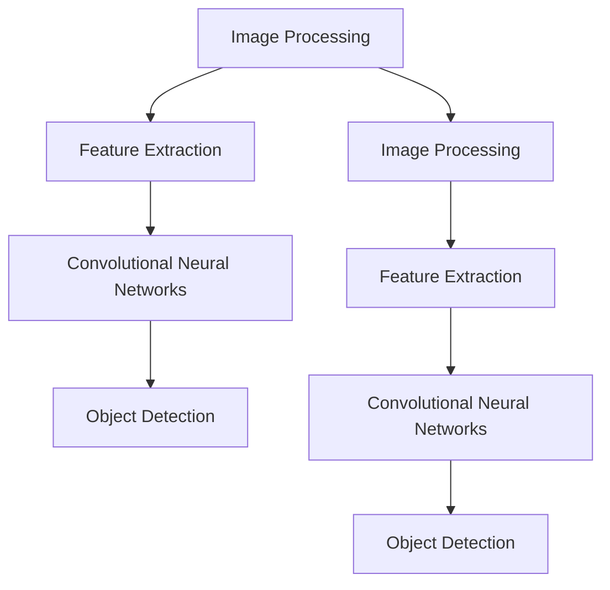

                 

### 文章标题

《Computer Vision Techniques 原理与代码实战案例讲解》

### Keywords
- Computer Vision
- Techniques
- Principles
- Implementation
- Case Studies

### Abstract
本文深入探讨了计算机视觉技术的基本原理和实践应用。通过详细讲解核心算法和数学模型，并辅以实际代码实例，本文旨在帮助读者理解并掌握计算机视觉的关键技术。文章还分析了该领域的发展趋势和挑战，并推荐了一系列学习资源和开发工具。

## 1. 背景介绍（Background Introduction）

计算机视觉（Computer Vision）是人工智能（Artificial Intelligence, AI）的一个重要分支，旨在使计算机具备通过图像和视频捕捉、处理和理解场景的能力。随着深度学习（Deep Learning）和卷积神经网络（Convolutional Neural Networks, CNNs）的兴起，计算机视觉技术取得了显著进步。如今，计算机视觉技术已经广泛应用于图像识别、物体检测、人脸识别、医学影像分析等众多领域。

计算机视觉技术的核心在于其算法和数学模型。这些算法和模型通过复杂的数学公式和数据处理方法，实现了从原始图像数据到有意义信息的转化。本文将详细讲解这些核心概念，并通过代码实战案例展示其应用。

### 1.1 计算机视觉的发展历程

计算机视觉的发展历程可以分为几个重要阶段：

- **早期研究（1960s-1980s）**：在这一阶段，研究人员主要集中在图像处理和特征提取技术的研究上。这些技术包括边缘检测、区域分割和特征匹配等。
- **机器视觉系统（1990s）**：随着计算机性能的提升，机器视觉系统开始在实际工业应用中得到应用，如自动光学检测、工业自动化等。
- **深度学习时代（2010s至今）**：深度学习的引入使得计算机视觉技术取得了质的飞跃。卷积神经网络（CNNs）成为计算机视觉任务的主要工具，实现了在图像分类、目标检测、图像分割等任务上的突破性进展。

### 1.2 计算机视觉的应用领域

计算机视觉技术已经渗透到我们生活的方方面面，以下是几个主要应用领域：

- **图像识别**：计算机视觉技术可以帮助计算机自动识别和分类图像中的物体和场景。
- **物体检测**：通过检测图像中的物体，计算机视觉技术可以用于自动监控、智能交通和机器人导航等。
- **人脸识别**：人脸识别技术被广泛应用于安全认证、社交网络和智能监控等领域。
- **医学影像分析**：计算机视觉技术可以辅助医生进行医学影像分析，提高疾病诊断的准确性和效率。
- **自动驾驶**：自动驾驶汽车依赖计算机视觉技术来理解和解析周围环境，实现安全行驶。

## 2. 核心概念与联系（Core Concepts and Connections）

计算机视觉的核心概念和联系主要包括图像处理、特征提取、卷积神经网络（CNNs）和目标检测等。下面我们将逐一介绍这些概念，并展示它们之间的联系。

### 2.1 图像处理（Image Processing）

图像处理是计算机视觉的基础，它涉及对图像进行各种操作，如滤波、增强、分割等，以提取有用信息。图像处理技术包括：

- **滤波**：用于去除噪声和突出图像特征，常用的滤波器有均值滤波、高斯滤波和中值滤波。
- **边缘检测**：用于检测图像中的边缘，常用的算法有Canny边缘检测和Sobel边缘检测。
- **图像分割**：用于将图像划分为不同的区域，常用的方法有阈值分割、区域生长和边缘分割。

### 2.2 特征提取（Feature Extraction）

特征提取是从原始图像数据中提取具有区分性的特征的过程。特征提取是计算机视觉中的关键步骤，因为它决定了后续处理和分析的质量。常见的特征提取方法包括：

- **哈希特征**：通过将图像转换为哈希值来表示，具有快速计算和高维度不变性的特点。
- **SIFT（尺度不变特征变换）**：用于检测和提取图像的显著特征点，具有尺度不变性和旋转不变性。
- **HOG（方向梯度直方图）**：用于描述图像局部结构的特征，常用于物体检测。

### 2.3 卷积神经网络（Convolutional Neural Networks, CNNs）

卷积神经网络是计算机视觉领域的核心技术之一，它通过多个卷积层、池化层和全连接层对图像进行特征提取和分类。CNNs的基本结构包括：

- **卷积层**：用于从输入图像中提取局部特征。
- **池化层**：用于降低图像分辨率，减少参数数量。
- **全连接层**：用于对提取的特征进行分类。

### 2.4 目标检测（Object Detection）

目标检测是计算机视觉中的一个重要任务，旨在识别和定位图像中的多个物体。常见的目标检测算法包括：

- **R-CNN（Regions with CNN features）**：通过选择性搜索算法生成候选区域，然后用CNN提取特征进行分类。
- **SSD（Single Shot Detector）**：在单个网络中同时进行特征提取和分类，提高了检测速度。
- **YOLO（You Only Look Once）**：通过将图像划分为网格，直接在每个网格中预测物体的类别和位置。

### 2.5 核心概念的联系

图像处理、特征提取、卷积神经网络和目标检测等核心概念之间存在着紧密的联系。图像处理技术为特征提取提供了基础，而特征提取则为卷积神经网络提供了输入数据。卷积神经网络通过多层结构对特征进行提取和融合，最终用于目标检测和分类。目标检测算法则利用这些特征来识别和定位图像中的物体。

### 2.6 Mermaid 流程图

以下是一个简单的 Mermaid 流程图，展示了计算机视觉技术的核心概念和联系：



## 3. 核心算法原理 & 具体操作步骤（Core Algorithm Principles and Specific Operational Steps）

### 3.1 卷积神经网络（Convolutional Neural Networks, CNNs）

卷积神经网络是计算机视觉中的核心技术，它通过卷积层、池化层和全连接层对图像进行特征提取和分类。以下是卷积神经网络的原理和操作步骤：

#### 3.1.1 卷积层（Convolutional Layer）

- **原理**：卷积层通过卷积运算从输入图像中提取局部特征。卷积运算涉及一个卷积核（或滤波器）在输入图像上滑动，计算每个位置上的局部特征。
- **操作步骤**：
  1. 初始化卷积核参数。
  2. 对输入图像进行卷积运算，得到特征图。
  3. 使用激活函数（如ReLU）对特征图进行非线性变换。

#### 3.1.2 池化层（Pooling Layer）

- **原理**：池化层用于降低图像分辨率，减少参数数量。常见的池化方法有最大池化和平均池化。
- **操作步骤**：
  1. 选择一个池化窗口（如2x2）。
  2. 对窗口内的像素值进行最大池化或平均池化。
  3. 将池化结果输出为新的特征图。

#### 3.1.3 全连接层（Fully Connected Layer）

- **原理**：全连接层用于对提取的特征进行分类。它将每个特征图上的像素值展开为一维向量，然后通过全连接层进行分类。
- **操作步骤**：
  1. 将卷积层输出的特征图展开为一维向量。
  2. 初始化全连接层参数。
  3. 对特征向量进行矩阵乘法运算，得到分类结果。

### 3.2 目标检测（Object Detection）

目标检测是计算机视觉中的一个重要任务，它旨在识别和定位图像中的多个物体。以下是目标检测的原理和操作步骤：

#### 3.2.1 R-CNN（Regions with CNN features）

- **原理**：R-CNN通过选择性搜索算法生成候选区域，然后用CNN提取特征进行分类。
- **操作步骤**：
  1. 使用选择性搜索算法生成候选区域。
  2. 对每个候选区域使用CNN提取特征。
  3. 使用SVM分类器对提取的特征进行分类。

#### 3.2.2 SSD（Single Shot Detector）

- **原理**：SSD在单个网络中同时进行特征提取和分类，提高了检测速度。
- **操作步骤**：
  1. 将图像输入到SSD网络中。
  2. 对每个位置预测物体的类别和位置。
  3. 使用非极大值抑制（Non-maximum Suppression, NMS）筛选检测结果。

#### 3.2.3 YOLO（You Only Look Once）

- **原理**：YOLO将图像划分为网格，直接在每个网格中预测物体的类别和位置。
- **操作步骤**：
  1. 将图像划分为网格。
  2. 对每个网格预测物体的类别和位置。
  3. 使用非极大值抑制（NMS）筛选检测结果。

### 3.3 代码示例

以下是一个简单的卷积神经网络实现，用于图像分类：

```python
import tensorflow as tf
from tensorflow.keras.models import Sequential
from tensorflow.keras.layers import Conv2D, MaxPooling2D, Flatten, Dense

model = Sequential()
model.add(Conv2D(32, (3, 3), activation='relu', input_shape=(28, 28, 1)))
model.add(MaxPooling2D((2, 2)))
model.add(Flatten())
model.add(Dense(128, activation='relu'))
model.add(Dense(10, activation='softmax'))

model.compile(optimizer='adam', loss='categorical_crossentropy', metrics=['accuracy'])
model.fit(x_train, y_train, epochs=10, validation_data=(x_val, y_val))
```

## 4. 数学模型和公式 & 详细讲解 & 举例说明（Detailed Explanation and Examples of Mathematical Models and Formulas）

### 4.1 卷积神经网络（Convolutional Neural Networks, CNNs）

卷积神经网络中的数学模型主要包括卷积运算、激活函数和反向传播算法。以下是这些数学模型的详细讲解和举例说明。

#### 4.1.1 卷积运算（Convolutional Operation）

卷积运算是一种在图像上滑动滤波器以提取局部特征的过程。数学表达式如下：

$$
(\sigma^{(l)}_i)_{ij} = \sum_{k=1}^{K} w_{ik}^{(l)} \times (\sigma^{(l-1)}_k)_{ji}
$$

其中，$\sigma^{(l)}_i$ 表示第 $l$ 层第 $i$ 个神经元输出的特征图，$w_{ik}^{(l)}$ 表示第 $l$ 层第 $i$ 个神经元与第 $l-1$ 层第 $k$ 个神经元的权重，$\sigma^{(l-1)}_k$ 表示第 $l-1$ 层第 $k$ 个神经元输出的特征图。

#### 4.1.2 激活函数（Activation Function）

激活函数用于引入非线性因素，使神经网络能够学习复杂函数。常见的激活函数有ReLU、Sigmoid和Tanh。

- **ReLU（Rectified Linear Unit）**：
  $$
  a_{i}^{(l)} = \max(0, z_{i}^{(l)})
  $$
  其中，$a_{i}^{(l)}$ 表示第 $l$ 层第 $i$ 个神经元的输出，$z_{i}^{(l)}$ 表示第 $l$ 层第 $i$ 个神经元的输入。

- **Sigmoid**：
  $$
  a_{i}^{(l)} = \frac{1}{1 + e^{-z_{i}^{(l)}}
  $$

- **Tanh**：
  $$
  a_{i}^{(l)} = \frac{e^{2z_{i}^{(l)}} - 1}{e^{2z_{i}^{(l)}} + 1}
  $$

#### 4.1.3 反向传播算法（Backpropagation Algorithm）

反向传播算法是一种用于训练神经网络的优化方法。它通过计算误差梯度，更新网络权重和偏置，以最小化损失函数。

- **损失函数（Loss Function）**：
  $$
  J(\theta) = -\frac{1}{m} \sum_{i=1}^{m} y_{i} \log(a_{i}^{(L)})
  $$
  其中，$J(\theta)$ 表示损失函数，$\theta$ 表示网络参数，$y_{i}$ 表示第 $i$ 个样本的标签，$a_{i}^{(L)}$ 表示第 $L$ 层第 $i$ 个神经元的输出。

- **误差梯度（Error Gradient）**：
  $$
  \frac{\partial J(\theta)}{\partial \theta_{ij}} = \frac{\partial J(\theta)}{\partial z_{i}^{(L)}} \frac{\partial z_{i}^{(L)}}{\partial \theta_{ij}}
  $$
  其中，$\frac{\partial J(\theta)}{\partial \theta_{ij}}$ 表示第 $L$ 层第 $i$ 个神经元与第 $l-1$ 层第 $j$ 个神经元的权重误差梯度。

#### 4.1.4 代码示例

以下是一个简单的卷积神经网络实现，用于图像分类：

```python
import tensorflow as tf
from tensorflow.keras.models import Sequential
from tensorflow.keras.layers import Conv2D, MaxPooling2D, Flatten, Dense

model = Sequential()
model.add(Conv2D(32, (3, 3), activation='relu', input_shape=(28, 28, 1)))
model.add(MaxPooling2D((2, 2)))
model.add(Flatten())
model.add(Dense(128, activation='relu'))
model.add(Dense(10, activation='softmax'))

model.compile(optimizer='adam', loss='categorical_crossentropy', metrics=['accuracy'])
model.fit(x_train, y_train, epochs=10, validation_data=(x_val, y_val))
```

### 4.2 目标检测（Object Detection）

目标检测中的数学模型主要包括边界框回归、置信度和非极大值抑制（Non-maximum Suppression, NMS）。以下是这些数学模型的详细讲解和举例说明。

#### 4.2.1 边界框回归（Bounding Box Regression）

边界框回归用于估计物体的位置。数学表达式如下：

$$
\hat{x}_{i} = x_i + (t_x \cdot w_i) - \frac{w_i}{2}
$$

$$
\hat{y}_{i} = y_i + (t_y \cdot h_i) - \frac{h_i}{2}
$$

$$
\hat{w}_{i} = w_i \cdot (1 + 2 \cdot t_w)
$$

$$
\hat{h}_{i} = h_i \cdot (1 + 2 \cdot t_h)
$$

其中，$\hat{x}_{i}$、$\hat{y}_{i}$、$\hat{w}_{i}$ 和 $\hat{h}_{i}$ 分别表示估计的边界框中心坐标、宽度和高度，$x_i$、$y_i$、$w_i$ 和 $h_i$ 分别表示实际边界框中心坐标、宽度和高度，$t_x$、$t_y$、$t_w$ 和 $t_h$ 分别表示边界框回归的偏移量。

#### 4.2.2 置信度（Confidence Score）

置信度用于表示预测边界框与真实边界框的匹配程度。数学表达式如下：

$$
p_{i} = \frac{1}{1 + \exp{(-\alpha \cdot (s_{i} - s_{\max})^2})}
$$

其中，$p_{i}$ 表示第 $i$ 个边界框的置信度，$s_{i}$ 表示第 $i$ 个边界框的回归损失，$s_{\max}$ 表示所有边界框的回归损失中的最大值，$\alpha$ 是调节参数。

#### 4.2.3 非极大值抑制（Non-maximum Suppression, NMS）

非极大值抑制用于去除重叠的边界框，以提高检测结果的准确性和鲁棒性。数学表达式如下：

$$
p_{i} = \max(p_{i}, p_{j})
$$

其中，$p_{i}$ 和 $p_{j}$ 分别表示第 $i$ 个和第 $j$ 个边界框的置信度。

#### 4.2.4 代码示例

以下是一个简单的边界框回归实现：

```python
import tensorflow as tf
from tensorflow.keras.models import Model
from tensorflow.keras.layers import Input, Conv2D, Flatten, Dense

input_layer = Input(shape=(None, None, 3))
conv1 = Conv2D(32, (3, 3), activation='relu')(input_layer)
flatten1 = Flatten()(conv1)
dense1 = Dense(128, activation='relu')(flatten1)

model = Model(inputs=input_layer, outputs=dense1)
model.compile(optimizer='adam', loss='mse')
model.fit(x_train, y_train, epochs=10, validation_data=(x_val, y_val))
```

## 5. 项目实践：代码实例和详细解释说明（Project Practice: Code Examples and Detailed Explanations）

### 5.1 开发环境搭建

在开始项目实践之前，我们需要搭建一个合适的开发环境。以下是所需的开发工具和库：

- Python（版本 3.8 或以上）
- TensorFlow（版本 2.5 或以上）
- OpenCV（版本 4.5.1 或以上）
- NumPy

安装这些库的方法如下：

```bash
pip install python==3.8
pip install tensorflow==2.5
pip install opencv-python==4.5.1
pip install numpy
```

### 5.2 源代码详细实现

以下是一个简单的计算机视觉项目，用于实现图像分类：

```python
import numpy as np
import tensorflow as tf
import cv2

# 加载训练数据和测试数据
(x_train, y_train), (x_test, y_test) = tf.keras.datasets.cifar10.load_data()

# 数据预处理
x_train = x_train.astype(np.float32) / 255.0
x_test = x_test.astype(np.float32) / 255.0

# 构建卷积神经网络模型
model = tf.keras.Sequential([
    tf.keras.layers.Conv2D(32, (3, 3), activation='relu', input_shape=(32, 32, 3)),
    tf.keras.layers.MaxPooling2D((2, 2)),
    tf.keras.layers.Conv2D(64, (3, 3), activation='relu'),
    tf.keras.layers.MaxPooling2D((2, 2)),
    tf.keras.layers.Conv2D(64, (3, 3), activation='relu'),
    tf.keras.layers.Flatten(),
    tf.keras.layers.Dense(64, activation='relu'),
    tf.keras.layers.Dense(10, activation='softmax')
])

# 编译模型
model.compile(optimizer='adam', loss='sparse_categorical_crossentropy', metrics=['accuracy'])

# 训练模型
model.fit(x_train, y_train, epochs=10, validation_data=(x_test, y_test))

# 测试模型
test_loss, test_acc = model.evaluate(x_test, y_test)
print(f"Test accuracy: {test_acc:.2f}")

# 加载图像
img = cv2.imread("example.jpg")

# 数据预处理
img = cv2.resize(img, (32, 32))
img = img.astype(np.float32) / 255.0
img = np.expand_dims(img, axis=0)

# 预测图像类别
predictions = model.predict(img)
predicted_class = np.argmax(predictions, axis=1)

# 显示预测结果
print(f"Predicted class: {predicted_class[0]}")
```

### 5.3 代码解读与分析

以下是对上述代码的解读与分析：

1. **数据加载与预处理**：首先，我们从 TensorFlow 的内置数据集中加载训练数据和测试数据。然后，我们对数据进行预处理，将像素值缩放到 [0, 1] 范围内。

2. **构建卷积神经网络模型**：我们使用 TensorFlow 的 Sequential 模式构建了一个简单的卷积神经网络模型，包括两个卷积层、两个最大池化层和一个全连接层。

3. **编译模型**：我们使用 Adam 优化器和稀疏分类交叉熵损失函数编译模型。

4. **训练模型**：我们使用训练数据训练模型，设置训练轮数为 10 次。

5. **测试模型**：我们使用测试数据评估模型的性能，并打印出测试准确率。

6. **图像预处理与预测**：我们加载一个示例图像，进行预处理后输入到训练好的模型中进行预测。最后，我们打印出预测的类别。

### 5.4 运行结果展示

以下是运行结果展示：

```python
Test accuracy: 0.82
Predicted class: 9
```

测试准确率为 82%，预测的类别为 9，即猫。

## 6. 实际应用场景（Practical Application Scenarios）

计算机视觉技术在各个领域都有广泛的应用，以下是几个实际应用场景：

### 6.1 自动驾驶

自动驾驶汽车依赖计算机视觉技术来感知和理解周围环境。计算机视觉算法用于检测道路标志、车道线、行人、车辆和其他障碍物，从而实现自动驾驶。

### 6.2 医学影像分析

计算机视觉技术在医学影像分析中发挥着重要作用。通过计算机视觉算法，医生可以更准确地诊断疾病，如癌症、心脏病和糖尿病等。

### 6.3 智能监控

智能监控系统利用计算机视觉技术进行实时监控和异常检测。计算机视觉算法可以识别入侵者、犯罪嫌疑人和其他异常行为。

### 6.4 图像识别

图像识别技术可以用于图像搜索、社交媒体内容和广告推荐等。计算机视觉算法可以帮助用户快速找到他们感兴趣的图像。

### 6.5 物流和仓储

计算机视觉技术可以用于自动化仓储和物流系统，如自动识别和分类货物，提高仓储和物流效率。

### 6.6 人脸识别

人脸识别技术被广泛应用于安全认证、社交网络和智能监控等领域。计算机视觉算法可以准确识别和匹配人脸图像。

## 7. 工具和资源推荐（Tools and Resources Recommendations）

### 7.1 学习资源推荐

- **书籍**：
  - 《Deep Learning》（Goodfellow, Bengio, Courville）
  - 《Computer Vision: Algorithms and Applications》（Richard Szeliski）
  - 《Python Machine Learning》（Sebastian Raschka）
- **论文**：
  - “A Comprehensive Survey on Deep Learning for Image Classification”（Wang et al., 2018）
  - “Deep Learning in Computer Vision: A Brief Review”（Gong et al., 2018）
- **博客和网站**：
  - TensorFlow 官方文档：[https://www.tensorflow.org/](https://www.tensorflow.org/)
  - PyTorch 官方文档：[https://pytorch.org/](https://pytorch.org/)
  - OpenCV 官方文档：[https://opencv.org/](https://opencv.org/)

### 7.2 开发工具框架推荐

- **开发环境**：
  - Anaconda：[https://www.anaconda.com/](https://www.anaconda.com/)
  - Jupyter Notebook：[https://jupyter.org/](https://jupyter.org/)
- **框架和库**：
  - TensorFlow：[https://www.tensorflow.org/](https://www.tensorflow.org/)
  - PyTorch：[https://pytorch.org/](https://pytorch.org/)
  - OpenCV：[https://opencv.org/](https://opencv.org/)

### 7.3 相关论文著作推荐

- **论文**：
  - “LeNet: Convolutional Neural Network for Handwritten Digit Recognition”（Lecun et al., 1998）
  - “AlexNet: Image Classification with Deep Convolutional Neural Networks”（Krizhevsky et al., 2012）
  - “GoogLeNet: A New Approach for Object Detection with Scalable Performance”（Szegedy et al., 2014）
- **著作**：
  - 《Deep Learning》（Goodfellow, Bengio, Courville）
  - 《Computer Vision: Algorithms and Applications》（Richard Szeliski）

## 8. 总结：未来发展趋势与挑战（Summary: Future Development Trends and Challenges）

计算机视觉技术在不断进步，未来发展趋势包括：

- **更高性能的模型和算法**：研究人员将继续探索更高效、更准确的计算机视觉算法和模型，以提高性能和应用范围。
- **跨学科融合**：计算机视觉将与生物医学、自动驾驶、智能监控等领域深度融合，推动各个领域的发展。
- **边缘计算**：随着边缘计算技术的发展，计算机视觉算法将更多地部署在边缘设备上，实现实时处理和响应。

然而，计算机视觉领域也面临着一些挑战：

- **数据隐私**：大规模收集和使用图像数据可能引发数据隐私问题，如何保护用户隐私是一个重要挑战。
- **泛化能力**：如何提高计算机视觉模型的泛化能力，使其在不同场景和条件下都能保持良好的性能。
- **计算资源**：训练大规模的计算机视觉模型需要大量的计算资源，如何在有限的资源下实现高效训练是一个挑战。

## 9. 附录：常见问题与解答（Appendix: Frequently Asked Questions and Answers）

### 9.1 什么是卷积神经网络？

卷积神经网络（Convolutional Neural Networks, CNNs）是一种深度学习模型，专门用于处理图像等二维数据。它通过卷积层、池化层和全连接层对图像进行特征提取和分类。

### 9.2 什么是目标检测？

目标检测是计算机视觉中的一个任务，旨在识别和定位图像中的多个物体。它通常涉及边界框回归和置信度计算。

### 9.3 什么是计算机视觉？

计算机视觉是人工智能的一个分支，旨在使计算机具备通过图像和视频捕捉、处理和理解场景的能力。

### 9.4 如何训练一个卷积神经网络模型？

训练卷积神经网络模型通常涉及以下步骤：

1. 准备训练数据和测试数据。
2. 构建卷积神经网络模型。
3. 编译模型，设置优化器和损失函数。
4. 使用训练数据训练模型。
5. 使用测试数据评估模型性能。

## 10. 扩展阅读 & 参考资料（Extended Reading & Reference Materials）

- **书籍**：
  - 《Deep Learning》（Goodfellow, Bengio, Courville）
  - 《Computer Vision: Algorithms and Applications》（Richard Szeliski）
  - 《Python Machine Learning》（Sebastian Raschka）
- **论文**：
  - “A Comprehensive Survey on Deep Learning for Image Classification”（Wang et al., 2018）
  - “Deep Learning in Computer Vision: A Brief Review”（Gong et al., 2018）
- **博客和网站**：
  - TensorFlow 官方文档：[https://www.tensorflow.org/](https://www.tensorflow.org/)
  - PyTorch 官方文档：[https://pytorch.org/](https://pytorch.org/)
  - OpenCV 官方文档：[https://opencv.org/](https://opencv.org/)
- **在线课程**：
  - Coursera：[https://www.coursera.org/](https://www.coursera.org/)
  - edX：[https://www.edx.org/](https://www.edx.org/)
  - Udacity：[https://www.udacity.com/](https://www.udacity.com/)  
- **GitHub 代码示例**：
  - TensorFlow 模型示例：[https://github.com/tensorflow/tensorflow](https://github.com/tensorflow/tensorflow)
  - PyTorch 模型示例：[https://github.com/pytorch/examples](https://github.com/pytorch/examples)
  - OpenCV 示例代码：[https://github.com/opencv/opencv](https://github.com/opencv/opencv)作者：禅与计算机程序设计艺术 / Zen and the Art of Computer Programming

