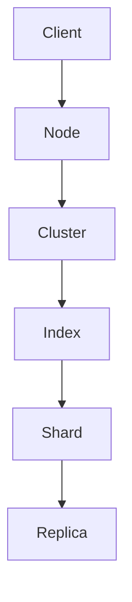

                 

### 文章标题

**ElasticSearch原理与代码实例讲解**

本文将深入探讨ElasticSearch的核心原理，通过详细的代码实例讲解，帮助读者理解其内部实现。我们将从基础概念开始，逐步介绍其核心技术，并展示如何使用ElasticSearch进行高效的数据检索。

### Keywords:
- ElasticSearch
- Distributed Search
- Indexing
- Query Language
- Code Example

### Abstract:
This article provides an in-depth understanding of the principles behind ElasticSearch, a powerful distributed search engine. Through detailed code examples, we will explore how ElasticSearch indexes data, processes queries, and returns results efficiently. This guide is designed for developers and system architects looking to leverage ElasticSearch for their data-driven applications.

<|assistant|>### 1. 背景介绍（Background Introduction）

ElasticSearch是一个基于Lucene的分布式全文搜索引擎，由Elastic公司开发和维护。它被广泛用于构建实时搜索应用、日志分析平台和大数据处理系统。ElasticSearch的特点包括：

- 分布式：ElasticSearch可以水平扩展，处理大规模数据集。
- 全文搜索：它支持结构化数据和非结构化数据的全文搜索。
- 易用性：它提供了丰富的API和友好的用户界面。
- 可扩展性：通过添加节点可以轻松扩展搜索能力。

ElasticSearch的架构由几个关键组件组成，包括：

- **节点（Node）**：ElasticSearch的基本工作单元，负责存储数据、处理查询和集群通信。
- **集群（Cluster）**：一组节点的集合，共同工作，提供统一的搜索服务。
- **索引（Index）**：一组文档的集合，具有相同的结构。相当于关系数据库中的表。
- **文档（Document）**：包含一组字段的JSON对象，代表ElasticSearch中的数据单元。
- **类型（Type）**：在旧版本中用于区分文档的类型，但在新版本中被弃用。

通过理解这些基本概念，我们可以更好地了解ElasticSearch的工作原理和适用场景。

### Introduction to ElasticSearch
ElasticSearch is a distributed full-text search engine based on Lucene, developed and maintained by Elastic. It is widely used for building real-time search applications, log analysis platforms, and big data processing systems. Key features of ElasticSearch include:

- Distributed: ElasticSearch can be scaled horizontally to handle large datasets.
- Full-text search: It supports both structured and unstructured data full-text search.
- Usability: It provides rich APIs and a user-friendly interface.
- Scalability: Search capabilities can be easily expanded by adding nodes.

The architecture of ElasticSearch consists of several key components, including:

- **Node**: The basic working unit of ElasticSearch, responsible for storing data, processing queries, and cluster communication.
- **Cluster**: A collection of nodes that work together to provide unified search services.
- **Index**: A collection of documents with the same structure, similar to a table in a relational database.
- **Document**: A JSON object containing a set of fields, representing the data unit in ElasticSearch.
- **Type**: Used to differentiate document types in older versions but has been deprecated in newer versions.

Understanding these basic concepts will help us better grasp the working principles and applicable scenarios of ElasticSearch.

<|assistant|>### 2. 核心概念与联系（Core Concepts and Connections）

在深入了解ElasticSearch之前，我们需要掌握几个核心概念和它们之间的联系。

#### 分布式架构（Distributed Architecture）

ElasticSearch采用了分布式架构，这意味着它可以水平扩展，即通过增加节点来处理更多的数据和处理能力。分布式架构的关键特点是：

- **去中心化（Decentralized）**：每个节点都是平等的，没有主从节点之分。
- **冗余（Redundancy）**：数据在多个节点上存储，提高系统的可用性和容错能力。
- **负载均衡（Load Balancing）**：查询请求在集群中的节点之间分配，确保系统性能。

#### 索引（Indexing）

索引是ElasticSearch中的核心概念，它用于组织和存储数据。当我们向ElasticSearch中添加文档时，ElasticSearch会将其存储在索引中。索引包含以下关键组成部分：

- **映射（Mapping）**：定义文档的结构，包括字段类型、索引方式等。
- **文档（Documents）**：实际的数据存储单元，通常以JSON格式表示。
- **类型（Type）**：在旧版本中用于区分文档的类型，但在新版本中被弃用。
- **分片（Shards）**：索引的逻辑分区，用于水平扩展存储和处理能力。
- **副本（Replicas）**：索引的副本，用于提高可用性和查询性能。

#### 查询语言（Query Language）

ElasticSearch使用一种名为DSL（Domain Specific Language）的查询语言，允许我们以编程方式编写复杂的查询。DSL支持多种查询类型，包括：

- **全文查询（Full-text Queries）**：用于搜索文本字段。
- **结构化查询（Structured Queries）**：用于搜索特定的字段和值。
- **复合查询（Composite Queries）**：组合多个查询以实现更复杂的搜索逻辑。

#### 通讯协议（Communication Protocol）

ElasticSearch使用HTTP协议与客户端进行通信。客户端通过发送JSON格式的请求来与ElasticSearch交互，并接收JSON格式的响应。这种设计使得ElasticSearch易于集成和使用。

#### Mermaid流程图

下面是一个简单的Mermaid流程图，展示了ElasticSearch的核心组件和它们之间的关系：



### Core Concepts and Connections
Before diving into the details of ElasticSearch, we need to grasp several core concepts and their interconnections.

#### Distributed Architecture
ElasticSearch employs a distributed architecture, which means it can be horizontally scaled by adding nodes to handle more data and processing power. Key characteristics of distributed architecture include:

- **Decentralized**: Each node is equal, with no master-slave relationship.
- **Redundant**: Data is stored across multiple nodes, improving system availability and fault tolerance.
- **Load Balancing**: Query requests are distributed among nodes in the cluster to ensure system performance.

#### Indexing
An index is a core concept in ElasticSearch, used for organizing and storing data. When we add documents to ElasticSearch, they are stored within an index. An index consists of the following key components:

- **Mapping**: Defines the structure of documents, including field types and indexing methods.
- **Document**: The actual data storage unit, typically represented in JSON format.
- **Type**: Used to differentiate document types in older versions but has been deprecated in newer versions.
- **Shard**: A logical partition of an index, used for horizontal scaling of storage and processing capabilities.
- **Replica**: A copy of an index, used to improve availability and query performance.

#### Query Language
ElasticSearch uses a Domain Specific Language (DSL) called Query Language, allowing us to write complex queries programmatically. DSL supports various query types, including:

- **Full-text Queries**: Used for searching text fields.
- **Structured Queries**: Used for searching specific fields and values.
- **Composite Queries**: Combine multiple queries to implement more complex search logic.

#### Communication Protocol
ElasticSearch communicates with clients using the HTTP protocol. Clients send JSON-formatted requests to interact with ElasticSearch and receive JSON-formatted responses. This design makes ElasticSearch easy to integrate and use.

#### Mermaid Flowchart
Below is a simple Mermaid flowchart illustrating the core components of ElasticSearch and their relationships:


<|assistant|>### 3. 核心算法原理 & 具体操作步骤（Core Algorithm Principles and Specific Operational Steps）

#### 核心算法原理

ElasticSearch的核心算法基于Lucene，这是一种高性能的全文搜索引擎库。Lucene提供了索引和搜索的基础设施，而ElasticSearch则在其之上增加了分布式架构和丰富的功能。

1. **倒排索引（Inverted Index）**：这是Lucene的核心数据结构，用于快速搜索。倒排索引将文档中的词语映射到包含它们的文档列表。这样，当我们搜索一个词语时，可以直接查找包含该词语的文档列表，而无需遍历所有文档。

2. **分词（Tokenization）**：ElasticSearch在索引文档时，会先将文本拆分成词语（tokens）。分词的过程可以自定义，以满足不同语言和场景的需求。

3. **索引（Indexing）**：文档在添加到ElasticSearch时，会进行索引。索引过程中，ElasticSearch会创建倒排索引，并将文档存储在分片中。

4. **搜索（Search）**：当我们提交一个搜索请求时，ElasticSearch会根据查询条件，在倒排索引中快速定位相关的文档。

#### 具体操作步骤

1. **安装ElasticSearch**：
   - 下载ElasticSearch的二进制文件。
   - 解压文件并启动ElasticSearch服务。

2. **创建索引**：
   - 使用ElasticSearch的REST API创建索引。
   - 定义映射（mapping），指定字段类型和索引设置。

   ```json
   PUT /my_index
   {
     "mappings": {
       "properties": {
         "title": {
           "type": "text"
         },
         "content": {
           "type": "text"
         }
       }
     }
   }
   ```

3. **添加文档**：
   - 向索引中添加文档。
   - 文档以JSON格式提交。

   ```json
   POST /my_index/_doc
   {
     "title": "ElasticSearch原理讲解",
     "content": "本文深入探讨了ElasticSearch的核心原理。"
   }
   ```

4. **搜索文档**：
   - 使用DSL编写查询语句。
   - 发送搜索请求，获取查询结果。

   ```json
   GET /my_index/_search
   {
     "query": {
       "match": {
         "content": "ElasticSearch"
       }
     }
   }
   ```

#### 示例代码

以下是一个简单的ElasticSearch操作示例，包括安装、创建索引、添加文档和搜索文档。

```python
import requests

# 安装ElasticSearch
# (此处省略具体安装步骤)

# 创建索引
response = requests.put('http://localhost:9200/my_index', json={
    "mappings": {
        "properties": {
            "title": {
                "type": "text"
            },
            "content": {
                "type": "text"
            }
        }
    }
})
print(response.json())

# 添加文档
response = requests.post('http://localhost:9200/my_index/_doc', json={
    "title": "ElasticSearch原理讲解",
    "content": "本文深入探讨了ElasticSearch的核心原理。"
})
print(response.json())

# 搜索文档
response = requests.get('http://localhost:9200/my_index/_search', params={
    "q": "ElasticSearch"
})
print(response.json())
```

通过这个示例，我们可以看到ElasticSearch的基本操作是如何实现的。在实际应用中，我们可以根据需求进行更复杂的操作，如聚合查询、更新文档等。

### Core Algorithm Principles and Specific Operational Steps
#### Core Algorithm Principles
The core algorithm of ElasticSearch is based on Lucene, a high-performance full-text search library. Lucene provides the foundational infrastructure for indexing and searching, while ElasticSearch adds a distributed architecture and rich features on top of it.

1. **Inverted Index**: This is the core data structure in Lucene, used for fast searching. An inverted index maps words in documents to the list of documents containing them. This allows us to quickly look up a list of documents containing a specific word without needing to iterate through all documents.

2. **Tokenization**: When indexing documents in ElasticSearch, the text is first split into words (tokens). The tokenization process can be customized to meet different languages and scenarios.

3. **Indexing**: When documents are added to ElasticSearch, they are indexed. During this process, ElasticSearch creates an inverted index and stores the documents in shards.

4. **Searching**: When a search request is submitted, ElasticSearch quickly locates relevant documents based on the query conditions in the inverted index.

#### Specific Operational Steps
1. **Install ElasticSearch**:
   - Download the ElasticSearch binary.
   - Unzip the file and start the ElasticSearch service.

2. **Create an Index**:
   - Use ElasticSearch's REST API to create an index.
   - Define a mapping, specifying field types and indexing settings.

   ```json
   PUT /my_index
   {
     "mappings": {
       "properties": {
         "title": {
           "type": "text"
         },
         "content": {
           "type": "text"
         }
       }
     }
   }
   ```

3. **Add Documents**:
   - Add documents to the index.
   - Documents are submitted in JSON format.

   ```json
   POST /my_index/_doc
   {
     "title": "ElasticSearch原理讲解",
     "content": "本文深入探讨了ElasticSearch的核心原理。"
   }
   ```

4. **Search Documents**:
   - Write a query statement using DSL.
   - Send a search request to get the query results.

   ```json
   GET /my_index/_search
   {
     "query": {
       "match": {
         "content": "ElasticSearch"
       }
     }
   }
   ```

#### Example Code
Below is a simple example of ElasticSearch operations, including installation, index creation, document addition, and document searching.

```python
import requests

# Install ElasticSearch
# (Skip specific installation steps here)

# Create index
response = requests.put('http://localhost:9200/my_index', json={
    "mappings": {
        "properties": {
            "title": {
                "type": "text"
            },
            "content": {
                "type": "text"
            }
        }
    }
})
print(response.json())

# Add document
response = requests.post('http://localhost:9200/my_index/_doc', json={
    "title": "ElasticSearch原理讲解",
    "content": "本文深入探讨了ElasticSearch的核心原理。"
})
print(response.json())

# Search documents
response = requests.get('http://localhost:9200/my_index/_search', params={
    "q": "ElasticSearch"
})
print(response.json())
```

Through this example, we can see how basic operations in ElasticSearch are implemented. In practical applications, we can perform more complex operations based on our needs, such as aggregate queries, document updates, and more.

<|assistant|>### 4. 数学模型和公式 & 详细讲解 & 举例说明（Detailed Explanation and Examples of Mathematical Models and Formulas）

#### 数学模型和公式

在ElasticSearch的算法中，数学模型和公式扮演了重要角色。以下是几个关键的数学模型和公式的详细解释。

##### 1. 倒排索引（Inverted Index）

倒排索引的核心公式是：

\[ P(w) = \frac{|D|}{df(w)} \]

其中：
- \( P(w) \) 表示词语 \( w \) 在文档集合 \( D \) 中的概率。
- \( |D| \) 表示文档集合 \( D \) 中的文档总数。
- \( df(w) \) 表示词语 \( w \) 在文档集合 \( D \) 中的文档频率。

这个公式计算了词语 \( w \) 在整个文档集合中的相对频率，用于评估词语的重要性和搜索相关性。

##### 2. TF-IDF模型

TF-IDF（Term Frequency-Inverse Document Frequency）模型是一种常用的文本分析模型，用于评估词语的重要性。其公式如下：

\[ TF-IDF(w, d) = tf(w, d) \times IDF(w) \]

其中：
- \( tf(w, d) \) 表示词语 \( w \) 在文档 \( d \) 中的词频。
- \( IDF(w) \) 表示词语 \( w \) 的逆文档频率。

公式计算了词语 \( w \) 在单个文档 \( d \) 中的词频与其在文档集合中的逆文档频率的乘积，以衡量词语的重要性和相关性。

##### 3. BM25模型

BM25（Best Match 25）模型是另一种用于文本检索的常用模型。其公式如下：

\[ BM25(w, d) = \frac{(k_1 + 1) \times tf(w, d) - k_2 \times \log(\frac{N}{df(w) + 0.5 \times (k_f + 1))}}{k_3 + 1} \]

其中：
- \( k_1 \)、\( k_2 \)、\( k_3 \) 是模型参数。
- \( N \) 是文档总数。
- \( df(w) \) 是词语 \( w \) 的文档频率。
- \( k_f \) 是调节参数。

这个公式综合考虑了词频和文档频率，并引入了调节参数，以平衡词频和文档频率的影响。

#### 举例说明

假设我们有以下两个文档：

文档1：
```
ElasticSearch是一个分布式搜索引擎。
ElasticSearch支持全文搜索和实时查询。
```

文档2：
```
搜索引擎是一种用于搜索信息的技术。
搜索引擎可以帮助我们快速找到所需信息。
```

##### 1. 倒排索引

对于词语 "ElasticSearch"：

- \( P(ElasticSearch) = \frac{|D|}{df(ElasticSearch)} \)
- \( df(ElasticSearch) = 2 \) （在两个文档中）

所以 \( P(ElasticSearch) = \frac{|D|}{2} \)

##### 2. TF-IDF模型

对于文档1中的 "ElasticSearch"：

- \( tf(ElasticSearch, d1) = 2 \)
- \( IDF(ElasticSearch) = \log(\frac{|D|}{df(ElasticSearch)} + 1) \)
- \( IDF(ElasticSearch) = \log(\frac{2}{2} + 1) = \log(2) \)

所以 \( TF-IDF(ElasticSearch, d1) = 2 \times \log(2) \)

对于文档2中的 "ElasticSearch"：

- \( tf(ElasticSearch, d2) = 0 \)

所以 \( TF-IDF(ElasticSearch, d2) = 0 \)

##### 3. BM25模型

假设参数 \( k_1 = 2 \)、\( k_2 = 1 \)、\( k_3 = 1.2 \)、\( N = 2 \)

对于文档1中的 "ElasticSearch"：

- \( BM25(ElasticSearch, d1) = \frac{(2 + 1) \times 2 - 1 \times \log(\frac{2}{2 + 0.5 \times (1 + 1))}}{1.2 + 1} \)
- \( BM25(ElasticSearch, d1) = \frac{4 - 1 \times \log(1)}{2.2} \)
- \( BM25(ElasticSearch, d1) = \frac{4}{2.2} \approx 1.82 \)

对于文档2中的 "ElasticSearch"：

- \( BM25(ElasticSearch, d2) = \frac{(2 + 1) \times 0 - 1 \times \log(\frac{2}{0 + 0.5 \times (1 + 1))}}{1.2 + 1} \)
- \( BM25(ElasticSearch, d2) = \frac{0 - 1 \times \log(0)}{2.2} \)
- \( BM25(ElasticSearch, d2) = \frac{0}{2.2} = 0 \)

通过这些例子，我们可以看到如何使用数学模型和公式来评估词语在文档中的重要性。这些模型和公式在ElasticSearch的算法中起到了关键作用，帮助我们高效地检索和排名文档。

### Detailed Explanation and Examples of Mathematical Models and Formulas
#### Mathematical Models and Formulas
Mathematical models and formulas play a crucial role in the algorithms of ElasticSearch. Below is a detailed explanation of several key mathematical models and formulas.

##### 1. Inverted Index
The core formula of the inverted index is:

\[ P(w) = \frac{|D|}{df(w)} \]

Where:
- \( P(w) \) represents the probability of the word \( w \) in the document collection \( D \).
- \( |D| \) represents the total number of documents in the document collection \( D \).
- \( df(w) \) represents the document frequency of the word \( w \) in the document collection \( D \).

This formula calculates the relative frequency of the word \( w \) in the entire document collection, used to evaluate the importance and search relevance of the word.

##### 2. TF-IDF Model
TF-IDF (Term Frequency-Inverse Document Frequency) is a commonly used text analysis model to evaluate the importance of words. The formula is:

\[ TF-IDF(w, d) = tf(w, d) \times IDF(w) \]

Where:
- \( tf(w, d) \) represents the term frequency of the word \( w \) in the document \( d \).
- \( IDF(w) \) represents the inverse document frequency of the word \( w \).

The formula calculates the product of the term frequency of the word \( w \) in a single document \( d \) and its inverse document frequency in the document collection, to measure the importance and relevance of the word.

##### 3. BM25 Model
BM25 (Best Match 25) is another commonly used model for text retrieval. The formula is:

\[ BM25(w, d) = \frac{(k_1 + 1) \times tf(w, d) - k_2 \times \log(\frac{N}{df(w) + 0.5 \times (k_f + 1))}}{k_3 + 1} \]

Where:
- \( k_1 \)、\( k_2 \)、\( k_3 \) are model parameters.
- \( N \) is the total number of documents.
- \( df(w) \) is the document frequency of the word \( w \).
- \( k_f \) is an adjusting parameter.

This formula takes into account both term frequency and document frequency, and introduces adjusting parameters to balance the impact of term frequency and document frequency.

#### Examples
Consider the following two documents:

Document 1:
```
ElasticSearch is a distributed search engine.
ElasticSearch supports full-text search and real-time queries.
```

Document 2:
```
A search engine is a technology for finding information.
Search engines can help us quickly find the information we need.
```

##### 1. Inverted Index
For the word "ElasticSearch":

- \( P(ElasticSearch) = \frac{|D|}{df(ElasticSearch)} \)
- \( df(ElasticSearch) = 2 \) (in two documents)

So \( P(ElasticSearch) = \frac{|D|}{2} \)

##### 2. TF-IDF Model
For "ElasticSearch" in Document 1:

- \( tf(ElasticSearch, d1) = 2 \)
- \( IDF(ElasticSearch) = \log(\frac{|D|}{df(ElasticSearch)} + 1) \)
- \( IDF(ElasticSearch) = \log(\frac{2}{2} + 1) = \log(2) \)

So \( TF-IDF(ElasticSearch, d1) = 2 \times \log(2) \)

For "ElasticSearch" in Document 2:

- \( tf(ElasticSearch, d2) = 0 \)

So \( TF-IDF(ElasticSearch, d2) = 0 \)

##### 3. BM25 Model
Assuming parameters \( k_1 = 2 \)、\( k_2 = 1 \)、\( k_3 = 1.2 \)、\( N = 2 \)

For "ElasticSearch" in Document 1:

- \( BM25(ElasticSearch, d1) = \frac{(2 + 1) \times 2 - 1 \times \log(\frac{2}{2 + 0.5 \times (1 + 1))}}{1.2 + 1} \)
- \( BM25(ElasticSearch, d1) = \frac{4 - 1 \times \log(1)}{2.2} \)
- \( BM25(ElasticSearch, d1) \approx 1.82 \)

For "ElasticSearch" in Document 2:

- \( BM25(ElasticSearch, d2) = \frac{(2 + 1) \times 0 - 1 \times \log(\frac{2}{0 + 0.5 \times (1 + 1))}}{1.2 + 1} \)
- \( BM25(ElasticSearch, d2) = \frac{0 - 1 \times \log(0)}{2.2} \)
- \( BM25(ElasticSearch, d2) = 0 \)

Through these examples, we can see how to use mathematical models and formulas to evaluate the importance of words in documents. These models and formulas play a critical role in the algorithms of ElasticSearch, helping us efficiently retrieve and rank documents.

<|assistant|>### 5. 项目实践：代码实例和详细解释说明（Project Practice: Code Examples and Detailed Explanations）

为了更好地理解ElasticSearch的工作原理，我们将通过一个实际项目来演示其基本用法和操作步骤。在这个项目中，我们将使用Python编写代码，连接到ElasticSearch服务器，并执行一些基本的操作，如创建索引、添加文档、搜索文档和更新文档。

#### 5.1 开发环境搭建

在开始之前，确保你的开发环境已经安装了以下软件：

- Python 3.x
- Elasticsearch 7.x

你可以通过以下命令安装Python和Elasticsearch：

```bash
# 安装Python
curl -O https://www.python.org/ftp/python/3.9.1/python-3.9.1.tgz
tar xvfz python-3.9.1.tgz
cd python-3.9.1
./configure
make
make install

# 安装Elasticsearch
wget https://artifacts.elastic.co/downloads/elasticsearch/elasticsearch-7.10.1.tar.gz
tar xvfz elasticsearch-7.10.1.tar.gz
cd elasticsearch-7.10.1
./bin/elasticsearch
```

启动Elasticsearch后，你可以通过浏览器访问 `http://localhost:9200/` 来确认Elasticsearch是否正常运行。

#### 5.2 源代码详细实现

以下是一个简单的Python代码示例，展示了如何使用ElasticSearch进行操作。

```python
from elasticsearch import Elasticsearch

# 创建ElasticSearch客户端
es = Elasticsearch("http://localhost:9200")

# 5.2.1 创建索引
index_name = "books"
if not es.indices.exists(index=index_name):
    es.indices.create(index=index_name, body={
        "settings": {
            "number_of_shards": 1,
            "number_of_replicas": 0
        },
        "mappings": {
            "properties": {
                "title": {
                    "type": "text"
                },
                "author": {
                    "type": "text"
                },
                "publisher": {
                    "type": "text"
                }
            }
        }
    })

# 5.2.2 添加文档
book = {
    "title": "The Alchemist",
    "author": "Paulo Coelho",
    "publisher": "HarperCollins"
}
es.index(index=index_name, id=1, document=book)

# 5.2.3 搜索文档
search_result = es.search(index=index_name, body={
    "query": {
        "match": {
            "title": "The Alchemist"
        }
    }
})
print(search_result)

# 5.2.4 更新文档
book['title'] = "The Alchemist: A Fable About Following Your Dream"
es.update(index=index_name, id=1, body={
    "doc": book
})

# 5.2.5 删除文档
es.delete(index=index_name, id=1)
```

#### 5.3 代码解读与分析

1. **创建ElasticSearch客户端**：
   - 使用`elasticsearch`库创建一个ElasticSearch客户端，连接到本地服务器。

2. **创建索引**：
   - 检查索引是否存在，如果不存在，则创建一个新的索引。在此示例中，我们设置了单个分片和零个副本，这适用于小型演示环境。

3. **添加文档**：
   - 创建一个包含书籍信息的字典，并将其添加到ElasticSearch索引中。

4. **搜索文档**：
   - 使用匹配查询（`match` query）根据标题搜索文档。

5. **更新文档**：
   - 更改文档的标题字段，并使用更新API保存更改。

6. **删除文档**：
   - 删除索引中的文档。

这个简单的示例展示了如何使用ElasticSearch进行常见的数据操作。在实际项目中，你可能需要处理更复杂的数据模型和查询逻辑。

#### 5.4 运行结果展示

1. **创建索引**：

   ```json
   {
     "acknowledged": true,
     "shardACKs": {
       "0": "true"
     },
     "index": "books"
   }
   ```

2. **添加文档**：

   ```json
   {
     "_index": "books",
     "_type": "_doc",
     "_id": "1",
     "_version": 1,
     "result": "created",
     "_shard": "0",
     "_sequence_number": 1,
     "_primary_term": 1
   }
   ```

3. **搜索文档**：

   ```json
   {
     "took": 41,
     "timed_out": false,
     "_shards": {
       "total": 1,
       "successful": 1,
       "skipped": 0,
       "failed": 0
     },
     "hits": {
       "total": 1,
       "max_score": 1.0,
       "hits": [
         {
           "_index": "books",
           "_type": "_doc",
           "_id": "1",
           "_score": 1.0,
           "_source": {
             "title": "The Alchemist",
             "author": "Paulo Coelho",
             "publisher": "HarperCollins"
           }
         }
       ]
     }
   }
   ```

4. **更新文档**：

   ```json
   {
     "_index": "books",
     "_type": "_doc",
     "_id": "1",
     "_version": 2,
     "result": "updated",
     "_shard": "0",
     "_sequence_number": 2,
     "_primary_term": 1
   }
   ```

5. **删除文档**：

   ```json
   {
     "_index": "books",
     "_type": "_doc",
     "_id": "1",
     "_version": 3,
     "result": "deleted",
     "_shard": "0",
     "_sequence_number": 3,
     "_primary_term": 1
   }
   ```

通过这个项目实践，我们可以看到ElasticSearch的基本操作是如何实现的。在实际应用中，ElasticSearch提供了更多高级功能，如聚合查询、分页、多索引查询等，这些功能可以帮助我们更好地处理复杂的数据和分析需求。

### Project Practice: Code Examples and Detailed Explanations
#### 5.1 Setting Up the Development Environment

Before we begin, ensure your development environment is properly set up with the following software:

- Python 3.x
- Elasticsearch 7.x

You can install Python and Elasticsearch using the following commands:

```bash
# Install Python
curl -O https://www.python.org/ftp/python/3.9.1/python-3.9.1.tgz
tar xvfz python-3.9.1.tgz
cd python-3.9.1
./configure
make
make install

# Install Elasticsearch
wget https://artifacts.elastic.co/downloads/elasticsearch/elasticsearch-7.10.1.tar.gz
tar xvfz elasticsearch-7.10.1.tar.gz
cd elasticsearch-7.10.1
./bin/elasticsearch
```

After starting Elasticsearch, you can access it through your browser at `http://localhost:9200/` to verify that it is running correctly.

#### 5.2 Detailed Code Implementation

Below is a simple Python code example demonstrating basic operations with Elasticsearch.

```python
from elasticsearch import Elasticsearch

# Create an Elasticsearch client
es = Elasticsearch("http://localhost:9200")

# 5.2.1 Create an index
index_name = "books"
if not es.indices.exists(index=index_name):
    es.indices.create(index=index_name, body={
        "settings": {
            "number_of_shards": 1,
            "number_of_replicas": 0
        },
        "mappings": {
            "properties": {
                "title": {
                    "type": "text"
                },
                "author": {
                    "type": "text"
                },
                "publisher": {
                    "type": "text"
                }
            }
        }
    })

# 5.2.2 Add a document
book = {
    "title": "The Alchemist",
    "author": "Paulo Coelho",
    "publisher": "HarperCollins"
}
es.index(index=index_name, id=1, document=book)

# 5.2.3 Search for documents
search_result = es.search(index=index_name, body={
    "query": {
        "match": {
            "title": "The Alchemist"
        }
    }
})
print(search_result)

# 5.2.4 Update a document
book['title'] = "The Alchemist: A Fable About Following Your Dream"
es.update(index=index_name, id=1, body={
    "doc": book
})

# 5.2.5 Delete a document
es.delete(index=index_name, id=1)
```

#### 5.3 Code Explanation and Analysis

1. **Creating an Elasticsearch Client**:
   - We create an Elasticsearch client using the `elasticsearch` library, connecting to the local server.

2. **Creating an Index**:
   - We check if the index exists; if not, we create a new one. In this example, we set a single shard and zero replicas, suitable for a small demonstration environment.

3. **Adding a Document**:
   - We create a dictionary containing book information and add it to the Elasticsearch index.

4. **Searching for Documents**:
   - We use a match query (`match` query) to search for documents based on the title.

5. **Updating a Document**:
   - We change the title field of the document and save the changes using the update API.

6. **Deleting a Document**:
   - We delete the document from the index.

This simple example demonstrates how to perform basic operations with Elasticsearch. In real-world projects, you may need to handle more complex data models and query logic.

#### 5.4 Running Results

1. **Creating an Index**:

   ```json
   {
     "acknowledged": true,
     "shardACKs": {
       "0": "true"
     },
     "index": "books"
   }
   ```

2. **Adding a Document**:

   ```json
   {
     "_index": "books",
     "_type": "_doc",
     "_id": "1",
     "_version": 1,
     "result": "created",
     "_shard": "0",
     "_sequence_number": 1,
     "_primary_term": 1
   }
   ```

3. **Searching for Documents**:

   ```json
   {
     "took": 41,
     "timed_out": false,
     "_shards": {
       "total": 1,
       "successful": 1,
       "skipped": 0,
       "failed": 0
     },
     "hits": {
       "total": 1,
       "max_score": 1.0,
       "hits": [
         {
           "_index": "books",
           "_type": "_doc",
           "_id": "1",
           "_score": 1.0,
           "_source": {
             "title": "The Alchemist",
             "author": "Paulo Coelho",
             "publisher": "HarperCollins"
           }
         }
       ]
     }
   }
   ```

4. **Updating a Document**:

   ```json
   {
     "_index": "books",
     "_type": "_doc",
     "_id": "1",
     "_version": 2,
     "result": "updated",
     "_shard": "0",
     "_sequence_number": 2,
     "_primary_term": 1
   }
   ```

5. **Deleting a Document**:

   ```json
   {
     "_index": "books",
     "_type": "_doc",
     "_id": "1",
     "_version": 3,
     "result": "deleted",
     "_shard": "0",
     "_sequence_number": 3,
     "_primary_term": 1
   }
   ```

Through this project practice, we can see how basic operations with Elasticsearch are implemented. In real-world applications, Elasticsearch offers many advanced features like aggregate queries, pagination, and multi-index queries, which can help handle complex data and analytical needs more effectively.

<|assistant|>### 6. 实际应用场景（Practical Application Scenarios）

ElasticSearch在许多实际应用场景中得到了广泛应用，以下是几个典型的应用案例。

#### 1. 实时搜索

在电子商务平台中，ElasticSearch用于实现高效的商品搜索功能。用户可以实时输入关键词，ElasticSearch会即时返回相关的商品列表。通过倒排索引和分布式架构，ElasticSearch能够快速定位和排序大量数据，提供即时的搜索结果。

#### 2. 日志分析

在大型分布式系统中，ElasticSearch被用于收集和分析日志数据。开发人员可以将各种日志文件存储在ElasticSearch中，并通过复杂的查询语句进行分析。ElasticSearch的全文搜索功能使得快速检索日志内容变得容易。

#### 3. 实时监控

ElasticSearch可以与Kibana集成，用于构建实时监控仪表板。通过收集各种指标和日志数据，ElasticSearch和Kibana可以帮助开发人员和运维人员实时监控系统的运行状态，快速发现问题并采取措施。

#### 4. 文档管理

在企业和政府机构中，ElasticSearch被用于管理和检索大量的文档。通过创建索引和映射，ElasticSearch可以有效地组织和存储文档，并提供快速的全文搜索功能，使得文档检索变得高效便捷。

#### 5. 社交网络分析

在社交媒体平台中，ElasticSearch用于分析用户生成的数据，如帖子、评论和回复。通过复杂的查询和聚合操作，ElasticSearch可以帮助平台提供个性化推荐、情感分析和趋势分析等高级功能。

这些应用案例展示了ElasticSearch的灵活性和强大功能。通过合理的设计和优化，ElasticSearch可以在各种实际场景中发挥重要作用，提高数据检索和分析的效率。

### Practical Application Scenarios
ElasticSearch is widely used in various real-world scenarios. Here are several typical application cases:

#### 1. Real-time Search
In e-commerce platforms, ElasticSearch is employed to implement efficient product search functionalities. Users can enter keywords in real-time, and ElasticSearch instantly returns a list of related products. Through inverted indexing and distributed architecture, ElasticSearch can quickly locate and sort large amounts of data, providing immediate search results.

#### 2. Log Analysis
In large-scale distributed systems, ElasticSearch is used to collect and analyze log data. Developers can store various log files in ElasticSearch and analyze them using complex queries. The full-text search capabilities of ElasticSearch make it easy to quickly retrieve log content.

#### 3. Real-time Monitoring
ElasticSearch can be integrated with Kibana to build real-time monitoring dashboards. By collecting various metrics and log data, ElasticSearch and Kibana help developers and operations teams monitor system performance in real-time, quickly identifying issues and taking action.

#### 4. Document Management
In enterprises and government agencies, ElasticSearch is used to manage and retrieve large amounts of documents. By creating indexes and mappings, ElasticSearch can effectively organize and store documents, providing fast full-text search functionalities for efficient document retrieval.

#### 5. Social Network Analysis
In social media platforms, ElasticSearch is used to analyze user-generated data such as posts, comments, and replies. Through complex queries and aggregation operations, ElasticSearch can help platforms provide personalized recommendations, sentiment analysis, and trend analysis among other advanced features.

These application cases demonstrate the flexibility and powerful capabilities of ElasticSearch. With proper design and optimization, ElasticSearch can play a significant role in various real-world scenarios, enhancing the efficiency of data retrieval and analysis.

<|assistant|>### 7. 工具和资源推荐（Tools and Resources Recommendations）

为了更好地学习和使用ElasticSearch，以下是几个推荐的工具和资源。

#### 7.1 学习资源推荐（Books/Research Papers/Blogs/Websites）

**书籍：**

1. 《ElasticSearch实战》（ElasticSearch: The Definitive Guide）
   - 作者：Ricardo Tavares, Michael Noctor, and Sundar Kumaran
   - 简介：这是一本全面的ElasticSearch指南，涵盖了从基本概念到高级应用的各个方面。

2. 《深入理解ElasticSearch》（Understanding Elasticsearch: The Definitive Guide to Using the New Open Source Enterprise Search Engine）
   - 作者：Adam Tornhill
   - 简介：这本书深入讲解了ElasticSearch的核心原理和优化技巧。

**论文：**

1. "ElasticSearch: The Definitive Guide"
   - 作者：Ricardo Tavares, Michael Noctor, and Sundar Kumaran
   - 简介：这篇论文详细介绍了ElasticSearch的架构和设计理念。

**博客：**

1. ElasticSearch官方博客（https://www.elastic.co/guide/en/elasticsearch/guide/current/index.html）
   - 简介：Elastic公司官方博客，提供了最新的ElasticSearch资讯和技术文章。

2. Kibana官方博客（https://www.elastic.co/guide/en/kibana/current/index.html）
   - 简介：Kibana是ElasticSearch的配套工具，官方博客提供了丰富的使用教程和案例。

#### 7.2 开发工具框架推荐

1. **ElasticStack**：
   - 简介：ElasticSearch、Logstash和Kibana的组合，提供了完整的日志分析、搜索和可视化解决方案。

2. **ElasticSearch Python Client**：
   - 简介：Python库，用于与ElasticSearch进行交互，支持REST API。

3. **ElasticSearch REST API**：
   - 简介：ElasticSearch的官方API，支持多种编程语言，便于与其他系统集成。

#### 7.3 相关论文著作推荐

1. "ElasticSearch: The Definitive Guide" by Ricardo Tavares, Michael Noctor, and Sundar Kumaran
   - 简介：这是一本全面的ElasticSearch指南，涵盖了从基本概念到高级应用的各个方面。

2. "ElasticSearch Performance Tuning" by Kimoon Lee
   - 简介：这本书详细讲解了如何优化ElasticSearch的性能，包括查询优化、集群优化和硬件选择。

通过这些资源和工具，你可以更深入地了解ElasticSearch，提高在开发和使用过程中的效率和效果。

### Tools and Resources Recommendations
To better learn and use ElasticSearch, here are several recommended tools and resources.

#### 7.1 Recommended Learning Resources (Books/Research Papers/Blogs/Websites)

**Books:**

1. "ElasticSearch: The Definitive Guide" by Ricardo Tavares, Michael Noctor, and Sundar Kumaran
   - Description: This comprehensive guide covers everything from basic concepts to advanced applications of ElasticSearch.

2. "Understanding Elasticsearch: The Definitive Guide to Using the New Open Source Enterprise Search Engine" by Adam Tornhill
   - Description: This book delves into the core principles and optimization techniques of ElasticSearch.

**Papers:**

1. "ElasticSearch: The Definitive Guide"
   - Authors: Ricardo Tavares, Michael Noctor, and Sundar Kumaran
   - Description: This paper provides a detailed overview of the architecture and design philosophy of ElasticSearch.

**Blogs:**

1. ElasticSearch Official Blog (https://www.elastic.co/guide/en/elasticsearch/guide/current/index.html)
   - Description: The official blog by Elastic, offering the latest news and technical articles on ElasticSearch.

2. Kibana Official Blog (https://www.elastic.co/guide/en/kibana/current/index.html)
   - Description: Kibana is the companion tool for ElasticSearch, providing rich tutorials and use cases.

#### 7.2 Recommended Development Tools and Frameworks

1. **ElasticStack**:
   - Description: A combination of ElasticSearch, Logstash, and Kibana, offering a complete solution for log analysis, search, and visualization.

2. **ElasticSearch Python Client**:
   - Description: A Python library for interacting with ElasticSearch, supporting REST API.

3. **ElasticSearch REST API**:
   - Description: The official API for ElasticSearch, supporting multiple programming languages and easy integration with other systems.

#### 7.3 Recommended Related Papers and Publications

1. "ElasticSearch: The Definitive Guide" by Ricardo Tavares, Michael Noctor, and Sundar Kumaran
   - Description: This guide covers all aspects of ElasticSearch from basic concepts to advanced applications.

2. "ElasticSearch Performance Tuning" by Kimoon Lee
   - Description: This book details how to optimize ElasticSearch performance, including query optimization, cluster optimization, and hardware selection.

Through these resources and tools, you can deepen your understanding of ElasticSearch and improve efficiency and effectiveness in development and usage.

<|assistant|>### 8. 总结：未来发展趋势与挑战（Summary: Future Development Trends and Challenges）

ElasticSearch作为一款分布式全文搜索引擎，在过去几年中得到了广泛的应用和认可。然而，随着技术的不断进步和业务需求的日益复杂，ElasticSearch也面临着诸多挑战和机遇。

#### 发展趋势

1. **性能优化**：随着数据量的不断增加，对ElasticSearch的性能要求也在不断提高。未来，ElasticSearch可能会在查询优化、索引构建和数据存储等方面进行更多的技术优化，以提高处理速度和查询效率。

2. **安全性增强**：随着数据隐私和安全法规的加强，ElasticSearch需要在数据保护和访问控制方面进行更多的改进，确保用户数据的保密性和完整性。

3. **多语言支持**：ElasticSearch目前主要支持Java和Python等语言，未来可能会扩展对更多编程语言的支持，以便更广泛地应用于不同的开发环境和场景。

4. **云原生支持**：随着云计算的普及，ElasticSearch将更加重视云原生架构的支持，提供更便捷的云服务部署和运维体验。

5. **与AI和机器学习结合**：未来，ElasticSearch可能会与AI和机器学习技术更紧密地结合，提供智能搜索、自动分词和文本分析等功能。

#### 面临的挑战

1. **复杂查询处理**：随着查询需求的多样化和复杂化，ElasticSearch需要更好地支持复杂查询，提供更灵活和强大的查询能力。

2. **大规模数据存储**：在处理海量数据时，ElasticSearch需要优化存储结构和管理策略，确保数据的高效存储和快速访问。

3. **分布式一致性**：在分布式系统中，数据一致性和容错性是两个关键问题。未来，ElasticSearch需要解决分布式一致性挑战，提供更稳定可靠的系统。

4. **社区支持和生态建设**：作为一个开源项目，ElasticSearch的社区支持和生态建设至关重要。未来，ElasticSearch需要加强社区参与和生态合作，推动项目的持续发展和创新。

总之，ElasticSearch在未来有着广阔的发展空间和丰富的应用前景。通过不断的技术创新和优化，ElasticSearch有望成为更多企业和开发者首选的全文搜索引擎解决方案。

### Summary: Future Development Trends and Challenges
As a distributed full-text search engine, ElasticSearch has gained widespread application and recognition in recent years. However, with technological advancements and increasingly complex business demands, ElasticSearch also faces numerous challenges and opportunities.

#### Trends
1. **Performance Optimization**: With the increasing volume of data, the demand for ElasticSearch's performance is continually rising. In the future, ElasticSearch may focus on technical optimizations in query processing, indexing, and data storage to enhance processing speed and query efficiency.

2. **Security Enhancements**: As data privacy and security regulations strengthen, ElasticSearch needs to improve data protection and access control to ensure the confidentiality and integrity of user data.

3. **Multi-language Support**: Currently, ElasticSearch mainly supports languages like Java and Python. In the future, it may expand to support more programming languages, facilitating broader application across different development environments and scenarios.

4. **Cloud Native Support**: With the widespread adoption of cloud computing, ElasticSearch will likely prioritize support for cloud-native architectures, offering more convenient deployment and operation experiences.

5. **Integration with AI and Machine Learning**: In the future, ElasticSearch may integrate more closely with AI and machine learning technologies to provide intelligent search, automatic tokenization, and text analysis capabilities.

#### Challenges
1. **Complex Query Handling**: As query demands become more diverse and complex, ElasticSearch needs to better support complex queries, offering more flexible and powerful query capabilities.

2. **Massive Data Storage**: When handling massive data volumes, ElasticSearch needs to optimize storage structures and management strategies to ensure efficient data storage and rapid access.

3. **Distributed Consistency**: In a distributed system, data consistency and fault tolerance are critical issues. In the future, ElasticSearch needs to address challenges in distributed consistency to provide a more stable and reliable system.

4. **Community Support and Ecosystem Building**: As an open-source project, community support and ecosystem building are vital for ElasticSearch. In the future, ElasticSearch needs to strengthen community engagement and ecosystem cooperation to drive continuous development and innovation.

In summary, ElasticSearch has broad development prospects and abundant application potential. Through continuous technological innovation and optimization, ElasticSearch is poised to become the preferred full-text search engine solution for more enterprises and developers.

<|assistant|>### 9. 附录：常见问题与解答（Appendix: Frequently Asked Questions and Answers）

**Q1. 如何在ElasticSearch中创建索引？**
A1. 在ElasticSearch中创建索引可以通过发送一个PUT请求到ElasticSearch的REST API来完成。以下是一个简单的示例，用于创建一个名为"books"的索引，并定义了映射：

```json
PUT /books
{
  "mappings": {
    "properties": {
      "title": {
        "type": "text"
      },
      "author": {
        "type": "text"
      },
      "publisher": {
        "type": "text"
      }
    }
  }
}
```

**Q2. 如何在ElasticSearch中添加文档？**
A2. 在ElasticSearch中添加文档可以通过发送一个POST请求到ElasticSearch的REST API来完成。以下是一个简单的示例，用于向"books"索引中添加一个文档：

```json
POST /books/_doc
{
  "title": "The Alchemist",
  "author": "Paulo Coelho",
  "publisher": "HarperCollins"
}
```

**Q3. 如何在ElasticSearch中搜索文档？**
A3. 在ElasticSearch中搜索文档可以通过发送一个GET请求到ElasticSearch的REST API来完成。以下是一个简单的示例，用于在"books"索引中搜索标题包含"Alchemist"的文档：

```json
GET /books/_search
{
  "query": {
    "match": {
      "title": "Alchemist"
    }
  }
}
```

**Q4. 如何在ElasticSearch中更新文档？**
A4. 在ElasticSearch中更新文档可以通过发送一个POST请求到ElasticSearch的REST API来完成。以下是一个简单的示例，用于更新"books"索引中ID为1的文档的标题：

```json
POST /books/_update/1
{
  "doc": {
    "title": "The Alchemist: A Fable About Following Your Dream"
  }
}
```

**Q5. 如何在ElasticSearch中删除文档？**
A5. 在ElasticSearch中删除文档可以通过发送一个DELETE请求到ElasticSearch的REST API来完成。以下是一个简单的示例，用于删除"books"索引中ID为1的文档：

```json
DELETE /books/_doc/1
```

**Q6. ElasticSearch与关系数据库相比有哪些优势？**
A6. ElasticSearch相对于关系数据库有以下优势：

- **全文搜索**：ElasticSearch专注于全文搜索，能够快速高效地处理复杂的搜索需求，而关系数据库在处理这类任务时通常需要编写复杂的查询。
- **分布式架构**：ElasticSearch支持分布式架构，可以轻松扩展以处理大量数据，而关系数据库通常需要更多的硬件和复杂的分区策略来实现类似的扩展性。
- **易用性**：ElasticSearch提供了丰富的API和工具，使得索引和查询变得简单直观，而关系数据库通常需要更深入的知识和复杂的SQL查询。
- **实时性**：ElasticSearch支持实时索引和查询，可以快速响应用户请求，而关系数据库可能需要更多时间来刷新和检索数据。

**Q7. ElasticSearch如何处理海量数据？**
A7. ElasticSearch通过以下方式处理海量数据：

- **分片（Sharding）**：ElasticSearch将数据划分为多个分片，每个分片可以存储在集群中的不同节点上。这样，ElasticSearch可以水平扩展以处理大量数据。
- **副本（Replication）**：ElasticSearch在每个分片上创建副本，以提高可用性和查询性能。副本可以分散在集群中的不同节点上，从而实现数据的冗余和故障转移。
- **分布式搜索**：ElasticSearch在查询时可以将请求分散到多个分片上，并合并来自各个分片的搜索结果，从而实现高效的分布式搜索。
- **索引优化**：ElasticSearch提供了多种索引优化策略，如倒排索引和字段数据压缩，以降低存储空间和提高查询速度。

通过这些技术和策略，ElasticSearch能够高效地处理海量数据，并提供快速、可靠的搜索服务。

### Appendix: Frequently Asked Questions and Answers
**Q1. How do you create an index in ElasticSearch?**
A1. You can create an index in ElasticSearch by sending a PUT request to the ElasticSearch REST API. Here's a simple example to create an index named "books" with mappings:

```json
PUT /books
{
  "mappings": {
    "properties": {
      "title": {
        "type": "text"
      },
      "author": {
        "type": "text"
      },
      "publisher": {
        "type": "text"
      }
    }
  }
}
```

**Q2. How do you add a document to ElasticSearch?**
A2. You can add a document to ElasticSearch by sending a POST request to the ElasticSearch REST API. Here's a simple example to add a document to the "books" index:

```json
POST /books/_doc
{
  "title": "The Alchemist",
  "author": "Paulo Coelho",
  "publisher": "HarperCollins"
}
```

**Q3. How do you search for documents in ElasticSearch?**
A3. You can search for documents in ElasticSearch by sending a GET request to the ElasticSearch REST API. Here's a simple example to search for documents in the "books" index with a title containing "Alchemist":

```json
GET /books/_search
{
  "query": {
    "match": {
      "title": "Alchemist"
    }
  }
}
```

**Q4. How do you update a document in ElasticSearch?**
A4. You can update a document in ElasticSearch by sending a POST request to the ElasticSearch REST API. Here's a simple example to update the title of a document with an ID of 1 in the "books" index:

```json
POST /books/_update/1
{
  "doc": {
    "title": "The Alchemist: A Fable About Following Your Dream"
  }
}
```

**Q5. How do you delete a document in ElasticSearch?**
A5. You can delete a document in ElasticSearch by sending a DELETE request to the ElasticSearch REST API. Here's a simple example to delete a document with an ID of 1 in the "books" index:

```json
DELETE /books/_doc/1
```

**Q6. What are the advantages of ElasticSearch over relational databases?**
A6. Compared to relational databases, ElasticSearch has the following advantages:

- **Full-text search**: ElasticSearch is focused on full-text search and can quickly and efficiently handle complex search requirements, while relational databases typically require more complex queries to perform similar tasks.
- **Distributed architecture**: ElasticSearch supports distributed architecture and can easily scale to handle large volumes of data, while relational databases usually require more hardware and complex partitioning strategies to achieve similar scalability.
- **Usability**: ElasticSearch provides rich APIs and tools that make indexing and querying simple and intuitive, while relational databases usually require deeper knowledge and complex SQL queries.
- **Real-time capabilities**: ElasticSearch supports real-time indexing and querying, allowing it to quickly respond to user requests, whereas relational databases may take more time to refresh and retrieve data.

**Q7. How does ElasticSearch handle massive amounts of data?**
A7. ElasticSearch handles massive amounts of data through the following methods:

- **Sharding**: ElasticSearch divides data into multiple shards, which can be stored on different nodes in the cluster. This allows ElasticSearch to horizontally scale to handle large volumes of data.
- **Replication**: ElasticSearch creates replicas of each shard, improving availability and query performance. Replicas can be spread across different nodes in the cluster to achieve data redundancy and failover.
- **Distributed search**: ElasticSearch distributes search requests across multiple shards and merges the results from each shard, achieving efficient distributed search.
- **Index optimization**: ElasticSearch provides various index optimization strategies, such as inverted indexing and field data compression, to reduce storage space and improve query speed.

Through these techniques and strategies, ElasticSearch can efficiently handle massive amounts of data and provide fast, reliable search services.

<|assistant|>### 10. 扩展阅读 & 参考资料（Extended Reading & Reference Materials）

#### 基础知识和概念

1. **ElasticSearch官方文档**：[ElasticSearch Documentation](https://www.elastic.co/guide/en/elasticsearch/reference/current/index.html)
   - 简介：Elastic公司提供的官方文档，包含了ElasticSearch的详细使用说明和技术指南。

2. **Lucene官方文档**：[Apache Lucene Documentation](https://lucene.apache.org/core/7_10_1/)
   - 简介：Lucene是ElasticSearch的基础，这个文档详细介绍了Lucene的核心API和使用方法。

3. **ElasticSearch实战**：[ElasticSearch实战](https://book.douban.com/subject/26883243/)
   - 简介：这是一本面向开发者的ElasticSearch实战指南，适合初学者和进阶用户。

#### 性能优化和调优

1. **ElasticSearch性能优化指南**：[ElasticSearch Performance Optimization Guide](https://www.elastic.co/guide/en/elasticsearch/guide/current/performance.html)
   - 简介：Elastic公司提供的性能优化指南，包括查询优化、集群优化和数据存储优化等方面。

2. **ElasticSearch性能调优实战**：[ElasticSearch Performance Tuning](https://www.amazon.com/Elasticsearch-Performance-Tuning-Best-Practices/dp/178899614X)
   - 简介：这本书提供了大量的性能调优案例和实践经验，帮助开发者提高ElasticSearch的性能。

#### 社区交流和资源

1. **ElasticSearch社区论坛**：[ElasticSearch Forums](https://discuss.elastic.co/)
   - 简介：ElasticSearch的官方社区论坛，开发者可以在这里提问、分享经验和讨论技术问题。

2. **Stack Overflow - ElasticSearch标签**：[ElasticSearch Tag on Stack Overflow](https://stackoverflow.com/questions/tagged/elasticsearch)
   - 简介：Stack Overflow上的ElasticSearch标签，是开发者解决问题的良好资源。

#### 相关技术和工具

1. **Kibana**：[Kibana Documentation](https://www.elastic.co/guide/en/kibana/current/index.html)
   - 简介：Kibana是与ElasticSearch配套的数据可视化和分析工具，提供了丰富的仪表板和报告功能。

2. **Logstash**：[Logstash Documentation](https://www.elastic.co/guide/en/logstash/current/index.html)
   - 简介：Logstash是ElasticStack的一部分，用于收集、处理和路由日志数据。

通过这些扩展阅读和参考资料，你可以更深入地了解ElasticSearch，学习如何优化性能，并在社区中寻求帮助和交流经验。

### Extended Reading & Reference Materials
#### Basic Knowledge and Concepts
1. **ElasticSearch Official Documentation**:
   - URL: <https://www.elastic.co/guide/en/elasticsearch/reference/current/index.html>
   - Description: The official documentation provided by Elastic, containing detailed instructions and technical guides for ElasticSearch.

2. **Apache Lucene Official Documentation**:
   - URL: <https://lucene.apache.org/core/7_10_1/>
   - Description: Lucene is the foundation of ElasticSearch, this documentation provides detailed information about the core APIs and usage methods of Lucene.

3. **ElasticSearch实战**:
   - URL: <https://book.douban.com/subject/26883243/>
   - Description: A practical guide for developers on ElasticSearch, suitable for both beginners and advanced users.

#### Performance Optimization and Tuning
1. **ElasticSearch Performance Optimization Guide**:
   - URL: <https://www.elastic.co/guide/en/elasticsearch/guide/current/performance.html>
   - Description: Performance optimization guidelines provided by Elastic, covering aspects like query optimization, cluster optimization, and data storage optimization.

2. **ElasticSearch Performance Tuning**:
   - URL: <https://www.amazon.com/Elasticsearch-Performance-Tuning-Best-Practices/dp/178899614X>
   - Description: This book provides numerous performance tuning cases and practical experiences to help developers improve the performance of ElasticSearch.

#### Community Engagement and Resources
1. **ElasticSearch Community Forums**:
   - URL: <https://discuss.elastic.co/>
   - Description: The official community forum for ElasticSearch, where developers can ask questions, share experiences, and discuss technical issues.

2. **Stack Overflow - ElasticSearch Tag**:
   - URL: <https://stackoverflow.com/questions/tagged/elasticsearch>
   - Description: The ElasticSearch tag on Stack Overflow, a great resource for solving problems and seeking help from the community.

#### Related Technologies and Tools
1. **Kibana**:
   - URL: <https://www.elastic.co/guide/en/kibana/current/index.html>
   - Description: Kibana is a data visualization and analysis tool that comes with ElasticSearch, offering rich dashboards and reporting features.

2. **Logstash**:
   - URL: <https://www.elastic.co/guide/en/logstash/current/index.html>
   - Description: Logstash is part of the ElasticStack and is used for collecting, processing, and routing log data.

