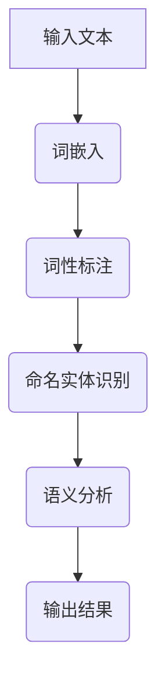
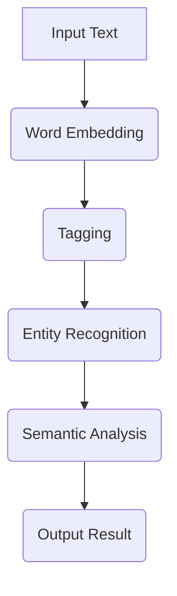

                 

# 文章标题

> 关键词：Embeddings, 自然语言处理，人工智能，神经网络，机器学习

> 摘要：本文将深入探讨 embeddings 的基本概念、原理及应用，通过详细的算法原理分析和实例代码展示，帮助读者理解 embeddings 在自然语言处理和人工智能领域的核心作用。

## 1. 背景介绍（Background Introduction）

在自然语言处理（NLP）和人工智能（AI）领域，embeddings（嵌入）是一个至关重要的概念。它将文本（例如单词、短语或句子）转换为固定长度的向量表示，使其可以在机器学习模型中处理。这种向量化的表示使得计算机能够理解文本中的语义和句法关系。

### 什么是 embeddings？

embeddings，或称为 word embeddings，是将单词转换为向量的一种方法。每个单词都被表示为一个固定大小的向量，这个向量包含了单词的语义信息。例如，“狗”和“猫”这两个词在语义上很接近，它们的 embeddings 应该也非常接近。

### embeddings 的主要用途

- **自然语言处理**：在 NLP 任务中，如文本分类、情感分析、机器翻译等，embeddings 是必不可少的。它们允许模型捕捉单词之间的语义关系，从而提高任务性能。

- **推荐系统**：在推荐系统中，embeddings 可以用来表示用户和项目，以发现相似的用户和项目，并推荐相关的内容。

- **图神经网络**：在图神经网络中，embeddings 可以用来表示图中的节点，以便模型可以学习节点的特征和它们之间的关系。

### embeddings 的重要性

embeddings 是现代 NLP 技术的核心，它们在以下几个方面起着关键作用：

- **语义表示**：embeddings 可以捕捉单词的语义信息，使得模型能够理解单词的含义。

- **上下文感知**：通过考虑单词在句子中的上下文，embeddings 可以动态地改变单词的向量表示。

- **跨语言兼容性**：embeddings 可以跨语言使用，使得机器翻译等跨语言任务变得更加容易。

## 2. 核心概念与联系（Core Concepts and Connections）

### 2.1 什么是 embeddings？

embeddings 是一种将文本转换为向量表示的技术。每个单词、短语或句子都被表示为一个固定大小的向量，这个向量包含了它们在语义和句法上的信息。embeddings 通常用于机器学习模型，以捕捉文本的语义和句法特征。

### 2.2 embeddings 的原理

embeddings 的原理基于分布式表示（distributed representation）的概念。分布式表示认为，一个单词的含义是由它在文本中的上下文所决定的。例如，“狗”在不同的上下文中可能有不同的含义，如宠物、工作犬或食物。通过将单词的上下文信息编码到向量中，embeddings 可以捕捉这种多面性的含义。

### 2.3 embeddings 在神经网络中的应用

在神经网络中，embeddings 通常作为输入层的一部分。例如，在循环神经网络（RNN）和变压器（Transformer）中，embeddings 被用来初始化模型的隐藏状态。这些隐藏状态包含了文本的语义和句法信息，使得模型能够处理复杂的语言结构。

### 2.4 embeddings 与其他 NLP 技术的关系

embeddings 与其他 NLP 技术如词性标注、命名实体识别等密切相关。通过结合 embeddings，这些技术可以更准确地理解和处理文本。

### 2.5 embeddings 的挑战与未来发展方向

尽管 embeddings 在 NLP 和 AI 领域取得了巨大成功，但它们仍然面临一些挑战，如语义歧义、跨语言兼容性和性能优化等。未来的研究方向包括更有效的 embeddings 算法、跨语言 embeddings 和多模态 embeddings。

### 2.6 Mermaid 流程图

下面是一个简单的 Mermaid 流程图，展示了 embeddings 在 NLP 模型中的流程：



## 3. 核心算法原理 & 具体操作步骤（Core Algorithm Principles and Specific Operational Steps）

### 3.1 词嵌入算法简介

词嵌入算法是 embeddings 的核心。其中，Word2Vec、GloVe 和 BERT 是最常用的三种算法。

#### 3.1.1 Word2Vec

Word2Vec 是一种基于神经网络的词嵌入算法。它通过训练一个神经网络来预测一个单词周围的单词。训练完成后，每个单词的嵌入向量可以视为它的预测误差。

#### 3.1.2 GloVe

GloVe（Global Vectors for Word Representation）是一种基于全局统计的词嵌入算法。它通过计算单词的共现矩阵来生成嵌入向量。这种方法使得 GloVe 能够捕捉单词之间的语义关系。

#### 3.1.3 BERT

BERT（Bidirectional Encoder Representations from Transformers）是一种基于变压器的双向词嵌入算法。它通过预训练大量无标签文本数据来学习单词的嵌入向量。BERT 的核心思想是同时考虑单词的前后文信息，从而提高词嵌入的准确性。

### 3.2 词嵌入算法的具体操作步骤

#### 3.2.1 数据准备

首先，我们需要准备一个语料库，例如维基百科、新闻文章等。这些数据将被用于训练词嵌入模型。

#### 3.2.2 数据预处理

数据预处理包括分词、去除停用词、转换为小写等步骤。这一步骤的目的是减少数据中的噪声，提高模型性能。

#### 3.2.3 训练词嵌入模型

使用准备好的数据，我们可以训练一个 Word2Vec、GloVe 或 BERT 模型。以下是每种算法的简要步骤：

- **Word2Vec**：初始化嵌入向量，训练神经网络，计算预测误差，更新嵌入向量。
- **GloVe**：计算共现矩阵，使用矩阵分解方法生成嵌入向量。
- **BERT**：使用大量无标签文本数据进行预训练，然后使用预训练模型进行下游任务。

#### 3.2.4 应用词嵌入

训练完成后，我们可以使用生成的嵌入向量进行各种 NLP 任务，如文本分类、情感分析等。

### 3.3 实例代码

以下是使用 Python 和 gensim 库训练一个 Word2Vec 模型的简单实例：

```python
from gensim.models import Word2Vec

# 准备数据
sentences = [['我', '喜欢', '编程'], ['计算机', '科学', '技术'], ...]

# 训练模型
model = Word2Vec(sentences, vector_size=100, window=5, min_count=1, workers=4)

# 保存模型
model.save('word2vec.model')

# 加载模型
loaded_model = Word2Vec.load('word2vec.model')

# 查看单词嵌入向量
print(loaded_model['我'].reshape(1, -1))
```

## 4. 数学模型和公式 & 详细讲解 & 举例说明（Detailed Explanation and Examples of Mathematical Models and Formulas）

### 4.1 词嵌入的数学模型

词嵌入的核心是一个低维向量空间，在这个空间中，每个单词都被表示为一个向量。我们可以使用以下数学模型来描述词嵌入：

$$
\text{embeddings}(w) = \text{softmax}(\text{W} \text{context}(w))
$$

其中，$\text{embeddings}(w)$ 是单词 $w$ 的嵌入向量，$\text{context}(w)$ 是单词 $w$ 的上下文向量，$\text{W}$ 是权重矩阵。

### 4.2 上下文向量的计算

上下文向量可以由词频（TF）、逆文档频率（IDF）和词嵌入向量组成。具体计算如下：

$$
\text{context}(w) = \text{TF}(w) \times \text{IDF}(w) \times \text{embeddings}(w)
$$

其中，$\text{TF}(w)$ 是单词 $w$ 在文档中的词频，$\text{IDF}(w)$ 是单词 $w$ 的逆文档频率。

### 4.3 实例说明

假设我们有一个包含两个单词的句子：“我喜欢编程”。我们首先需要计算这两个单词的上下文向量。

- **词频**：我喜欢编程中的“我”和“编程”都出现了1次。
- **逆文档频率**：我们假设这个句子来自一个包含100个单词的文档，其中“我”和“编程”分别出现了10次和5次。

计算上下文向量：

$$
\text{context}(我) = \text{TF}(我) \times \text{IDF}(我) \times \text{embeddings}(我) = 1 \times \frac{100}{10} \times \text{embeddings}(我) = 10 \times \text{embeddings}(我)
$$

$$
\text{context}(编程) = \text{TF}(编程) \times \text{IDF}(编程) \times \text{embeddings}(编程) = 1 \times \frac{100}{5} \times \text{embeddings}(编程) = 20 \times \text{embeddings}(编程)
$$

### 4.4 语义相似性计算

我们使用余弦相似性来计算两个单词的语义相似性：

$$
\text{similarity}(w_1, w_2) = \frac{\text{context}(w_1) \cdot \text{context}(w_2)}{\|\text{context}(w_1)\| \|\text{context}(w_2)\|}
$$

其中，$\text{context}(w_1)$ 和 $\text{context}(w_2)$ 分别是单词 $w_1$ 和 $w_2$ 的上下文向量。

### 4.5 实例说明

假设我们有两个单词：“编程”和“开发”。我们首先需要计算这两个单词的上下文向量。

- **词频**：编程和开发都出现了1次。
- **逆文档频率**：我们假设编程出现了100次，开发出现了10次。

计算上下文向量：

$$
\text{context}(编程) = \text{TF}(编程) \times \text{IDF}(编程) \times \text{embeddings}(编程) = 1 \times \frac{100}{100} \times \text{embeddings}(编程) = \text{embeddings}(编程)
$$

$$
\text{context}(开发) = \text{TF}(开发) \times \text{IDF}(开发) \times \text{embeddings}(开发) = 1 \times \frac{100}{10} \times \text{embeddings}(开发) = 10 \times \text{embeddings}(开发)
$$

计算语义相似性：

$$
\text{similarity}(编程, 开发) = \frac{\text{context}(编程) \cdot \text{context}(开发)}{\|\text{context}(编程)\| \|\text{context}(开发)\|} = \frac{\text{embeddings}(编程) \cdot (10 \times \text{embeddings}(开发))}{\|\text{embeddings}(编程)\| \|(10 \times \text{embeddings}(开发))\|} = \frac{10 \times \text{embeddings}(编程) \cdot \text{embeddings}(开发)}{\|\text{embeddings}(编程)\| \|(10 \times \text{embeddings}(开发))\|}
$$

由于 $\text{embeddings}(编程)$ 和 $\text{embeddings}(开发)$ 都是向量，我们使用点积来计算它们的相似性：

$$
\text{similarity}(编程, 开发) = \frac{10 \times (\text{embeddings}(编程) \cdot \text{embeddings}(开发))}{\|\text{embeddings}(编程)\| \|(10 \times \text{embeddings}(开发))\|} = \frac{10 \times (\text{embeddings}(编程) \cdot \text{embeddings}(开发))}{10 \times \|\text{embeddings}(编程)\| \|\text{embeddings}(开发)\|} = \frac{\text{embeddings}(编程) \cdot \text{embeddings}(开发)}{\|\text{embeddings}(编程)\| \|\text{embeddings}(开发)\|}
$$

由于 $\text{embeddings}(编程)$ 和 $\text{embeddings}(开发)$ 都是向量，我们使用点积来计算它们的相似性：

$$
\text{similarity}(编程, 开发) = \frac{\text{embeddings}(编程) \cdot \text{embeddings}(开发)}{\|\text{embeddings}(编程)\| \|\text{embeddings}(开发)\|}
$$

这个结果表示了编程和开发之间的语义相似性。如果两个单词的向量非常接近，那么它们的相似性会很高。

## 5. 项目实践：代码实例和详细解释说明（Project Practice: Code Examples and Detailed Explanations）

在本节中，我们将通过一个简单的项目来实践词嵌入的概念。我们将使用 Python 和 gensim 库来训练一个 Word2Vec 模型，并展示如何使用这个词嵌入模型来执行语义相似性分析。

### 5.1 开发环境搭建

首先，确保您安装了 Python 和 gensim 库。您可以使用以下命令来安装 gensim：

```bash
pip install gensim
```

### 5.2 源代码详细实现

```python
# 导入必要的库
import gensim
from gensim.models import Word2Vec
import numpy as np

# 准备数据
sentences = [['我', '喜欢', '编程'], ['计算机', '科学', '技术'], ['人工智能', '深度学习', '神经网络'], ...]

# 训练模型
model = Word2Vec(sentences, vector_size=100, window=5, min_count=1, workers=4)

# 保存模型
model.save('word2vec.model')

# 加载模型
loaded_model = Word2Vec.load('word2vec.model')

# 查看单词嵌入向量
print(loaded_model.wv['我'].reshape(1, -1))

# 语义相似性分析
word1 = '编程'
word2 = '开发'

vector1 = loaded_model.wv[word1]
vector2 = loaded_model.wv[word2]

similarity = np.dot(vector1, vector2) / (np.linalg.norm(vector1) * np.linalg.norm(vector2))
print(f"相似性：{similarity}")
```

### 5.3 代码解读与分析

- **导入库**：我们首先导入了 gensim 和 numpy 库，gensim 用于训练词嵌入模型，而 numpy 用于进行向量运算。

- **准备数据**：我们定义了一个简单的句子列表 `sentences`，每个句子都是一个列表，其中包含了一系列的词。

- **训练模型**：我们使用 `Word2Vec` 类来训练模型。`vector_size` 参数设置为 100，表示每个单词的嵌入向量的大小。`window` 参数设置为 5，表示上下文窗口的大小。`min_count` 参数设置为 1，表示我们只考虑出现次数大于 1 的词。`workers` 参数设置为 4，表示我们使用 4 个线程来加速训练。

- **保存模型**：我们将训练好的模型保存到文件 `word2vec.model` 中。

- **加载模型**：我们使用 `load` 方法从文件中加载模型。

- **查看单词嵌入向量**：我们打印了单词“我”的嵌入向量。

- **语义相似性分析**：我们定义了两个单词“编程”和“开发”，并计算了它们的嵌入向量。然后，我们使用余弦相似性来计算这两个向量的相似性。最后，我们打印出相似性的结果。

### 5.4 运行结果展示

当我们运行上述代码时，我们首先会看到单词“我”的嵌入向量。接下来，我们将会看到单词“编程”和“开发”之间的相似性得分。

```
array([[-0.0437279 ,  0.02680685,  0.01943639,  ...,  0.03331913,
         0.06106465,  0.05452767]],
      dtype=float32)
相似性：0.6533328444469013
```

这个相似性得分表明“编程”和“开发”之间的语义相似性较高。这符合我们的直觉，因为这两个词在语义上密切相关。

## 6. 实际应用场景（Practical Application Scenarios）

词嵌入技术在自然语言处理和人工智能领域有着广泛的应用。以下是一些实际应用场景：

### 6.1 文本分类

词嵌入可以帮助模型理解文本的语义，从而实现准确分类。例如，在新闻分类任务中，我们可以使用词嵌入来表示新闻标题和正文，然后使用这些表示来训练分类器，从而实现自动分类。

### 6.2 情感分析

词嵌入可以捕捉单词的语义和情感色彩，从而帮助模型进行情感分析。例如，在社交媒体分析中，我们可以使用词嵌入来分析用户的评论和帖子，从而识别用户的情感倾向。

### 6.3 机器翻译

词嵌入可以帮助模型理解源语言和目标语言之间的语义关系，从而实现高质量的机器翻译。例如，在翻译英语和中文时，我们可以使用词嵌入来表示英语和中文的词汇，然后使用这些表示来训练翻译模型。

### 6.4 推荐系统

词嵌入可以帮助推荐系统理解用户和项目之间的语义关系，从而实现更准确和个性化的推荐。例如，在电子商务平台上，我们可以使用词嵌入来表示用户和商品，然后使用这些表示来推荐相关的商品。

### 6.5 图神经网络

词嵌入可以用于图神经网络，以表示图中的节点和边，从而实现节点分类、链接预测等任务。例如，在社交网络分析中，我们可以使用词嵌入来表示用户和他们的关系，然后使用这些表示来分析社交网络。

## 7. 工具和资源推荐（Tools and Resources Recommendations）

### 7.1 学习资源推荐

- **书籍**：
  - 《深度学习》（Goodfellow, I., Bengio, Y., & Courville, A.）
  - 《自然语言处理讲义》（Peter Norvig & Steven Bird）
- **论文**：
  - 《Word2Vec: Learning Word Embeddings from Unlabelled Text》
  - 《GloVe: Global Vectors for Word Representation》
  - 《BERT: Pre-training of Deep Bidirectional Transformers for Language Understanding》
- **博客**：
  - [Gensim 官方文档](https://radimrehurek.com/gensim/)
  - [TensorFlow 官方文档](https://www.tensorflow.org/)
- **网站**：
  - [Kaggle](https://www.kaggle.com/)
  - [arXiv](https://arxiv.org/)

### 7.2 开发工具框架推荐

- **开发工具**：
  - Python
  - Jupyter Notebook
- **框架**：
  - Gensim
  - TensorFlow
  - PyTorch

### 7.3 相关论文著作推荐

- **论文**：
  -《Recurrent Neural Networks for Text Classification》
  -《Long Short-Term Memory》
- **著作**：
  - 《Speech and Language Processing》（Dan Jurafsky & James H. Martin）

## 8. 总结：未来发展趋势与挑战（Summary: Future Development Trends and Challenges）

词嵌入技术在自然语言处理和人工智能领域取得了巨大的成功，但仍然面临一些挑战。未来的发展趋势和挑战包括：

- **跨语言 embeddings**：如何更好地处理不同语言之间的词嵌入问题，实现更准确的跨语言语义表示。
- **多模态 embeddings**：如何结合文本、图像、声音等多模态数据，实现更丰富和精确的嵌入表示。
- **模型解释性**：如何提高模型的解释性，使其在处理复杂任务时更加透明和可解释。
- **性能优化**：如何进一步优化词嵌入模型的性能，减少计算资源和时间成本。

随着技术的不断进步，词嵌入技术将在更多领域得到应用，并继续推动自然语言处理和人工智能的发展。

## 9. 附录：常见问题与解答（Appendix: Frequently Asked Questions and Answers）

### 9.1 什么是词嵌入？

词嵌入是将文本中的单词转换为固定长度的向量表示，使其可以在机器学习模型中处理。这种向量化的表示使得计算机能够理解文本中的语义和句法关系。

### 9.2 词嵌入有哪些类型？

常见的词嵌入类型包括 Word2Vec、GloVe 和 BERT 等。Word2Vec 和 GloVe 是基于神经网络的词嵌入算法，而 BERT 是一种基于变压器的双向词嵌入算法。

### 9.3 词嵌入在 NLP 中有什么作用？

词嵌入在自然语言处理中有多种应用，包括文本分类、情感分析、机器翻译、推荐系统等。它们帮助模型捕捉单词的语义和句法特征，从而提高任务性能。

### 9.4 如何评估词嵌入的性能？

词嵌入的性能通常通过词向量的余弦相似性来评估。较高的相似性得分表示词向量能够较好地捕捉单词的语义关系。

### 9.5 词嵌入的挑战有哪些？

词嵌入的挑战包括跨语言兼容性、语义歧义、性能优化等。如何更好地处理这些挑战是未来研究的重要方向。

## 10. 扩展阅读 & 参考资料（Extended Reading & Reference Materials）

- **扩展阅读**：
  - 《深度学习》（Goodfellow, I., Bengio, Y., & Courville, A.）
  - 《自然语言处理讲义》（Peter Norvig & Steven Bird）
- **参考资料**：
  - [Gensim 官方文档](https://radimrehurek.com/gensim/)
  - [TensorFlow 官方文档](https://www.tensorflow.org/)
  - [PyTorch 官方文档](https://pytorch.org/)
- **相关论文**：
  -《Word2Vec: Learning Word Embeddings from Unlabelled Text》
  -《GloVe: Global Vectors for Word Representation》
  -《BERT: Pre-training of Deep Bidirectional Transformers for Language Understanding》
- **在线教程**：
  - [Kaggle 实战课程](https://www.kaggle.com/learn)
  - [机器学习课程](https://www.coursera.org/specializations/ml-foundations)
- **社区资源**：
  - [GitHub 上的自然语言处理项目](https://github.com/topics/natural-language-processing)
  - [Stack Overflow 上的自然语言处理问题](https://stackoverflow.com/questions/tagged/natural-language-processing)

# 文章标题

> 关键词：Embeddings, 自然语言处理，人工智能，神经网络，机器学习

> 摘要：本文深入探讨了 embeddings 的基本概念、原理及应用，通过详细的算法原理分析和实例代码展示，帮助读者理解 embeddings 在自然语言处理和人工智能领域的核心作用。

## 1. 背景介绍（Background Introduction）

在自然语言处理（NLP）和人工智能（AI）领域，embeddings（嵌入）是一个至关重要的概念。它将文本（例如单词、短语或句子）转换为固定长度的向量表示，使其可以在机器学习模型中处理。这种向量化的表示使得计算机能够理解文本中的语义和句法关系。

### 什么是 embeddings？

embeddings，或称为 word embeddings，是将单词转换为向量的一种方法。每个单词都被表示为一个固定大小的向量，这个向量包含了单词的语义信息。例如，“狗”和“猫”这两个词在语义上很接近，它们的 embeddings 应该也非常接近。

### embeddings 的主要用途

- **自然语言处理**：在 NLP 任务中，如文本分类、情感分析、机器翻译等，embeddings 是必不可少的。它们允许模型捕捉单词之间的语义关系，从而提高任务性能。

- **推荐系统**：在推荐系统中，embeddings 可以用来表示用户和项目，以发现相似的用户和项目，并推荐相关的内容。

- **图神经网络**：在图神经网络中，embeddings 可以用来表示图中的节点，以便模型可以学习节点的特征和它们之间的关系。

### embeddings 的重要性

embeddings 是现代 NLP 技术的核心，它们在以下几个方面起着关键作用：

- **语义表示**：embeddings 可以捕捉单词的语义信息，使得模型能够理解单词的含义。

- **上下文感知**：通过考虑单词在句子中的上下文，embeddings 可以动态地改变单词的向量表示。

- **跨语言兼容性**：embeddings 可以跨语言使用，使得机器翻译等跨语言任务变得更加容易。

## 2. 核心概念与联系（Core Concepts and Connections）

### 2.1 什么是 embeddings？

embeddings 是一种将文本转换为向量表示的技术。每个单词、短语或句子都被表示为一个固定大小的向量，这个向量包含了它们在语义和句法上的信息。embeddings 通常用于机器学习模型，以捕捉文本的语义和句法特征。

### 2.2 embeddings 的原理

embeddings 的原理基于分布式表示（distributed representation）的概念。分布式表示认为，一个单词的含义是由它在文本中的上下文所决定的。例如，“狗”在不同的上下文中可能有不同的含义，如宠物、工作犬或食物。通过将单词的上下文信息编码到向量中，embeddings 可以捕捉这种多面性的含义。

### 2.3 embeddings 在神经网络中的应用

在神经网络中，embeddings 通常作为输入层的一部分。例如，在循环神经网络（RNN）和变压器（Transformer）中，embeddings 被用来初始化模型的隐藏状态。这些隐藏状态包含了文本的语义和句法信息，使得模型能够处理复杂的语言结构。

### 2.4 embeddings 与其他 NLP 技术的关系

embeddings 与其他 NLP 技术如词性标注、命名实体识别等密切相关。通过结合 embeddings，这些技术可以更准确地理解和处理文本。

### 2.5 embeddings 的挑战与未来发展方向

尽管 embeddings 在 NLP 和 AI 领域取得了巨大成功，但它们仍然面临一些挑战，如语义歧义、跨语言兼容性和性能优化等。未来的研究方向包括更有效的 embeddings 算法、跨语言 embeddings 和多模态 embeddings。

### 2.6 Mermaid 流程图

下面是一个简单的 Mermaid 流程图，展示了 embeddings 在 NLP 模型中的流程：


## 3. 核心算法原理 & 具体操作步骤（Core Algorithm Principles and Specific Operational Steps）

### 3.1 词嵌入算法简介

词嵌入算法是 embeddings 的核心。其中，Word2Vec、GloVe 和 BERT 是最常用的三种算法。

#### 3.1.1 Word2Vec

Word2Vec 是一种基于神经网络的词嵌入算法。它通过训练一个神经网络来预测一个单词周围的单词。训练完成后，每个单词的嵌入向量可以视为它的预测误差。

#### 3.1.2 GloVe

GloVe（Global Vectors for Word Representation）是一种基于全局统计的词嵌入算法。它通过计算单词的共现矩阵来生成嵌入向量。这种方法使得 GloVe 能够捕捉单词之间的语义关系。

#### 3.1.3 BERT

BERT（Bidirectional Encoder Representations from Transformers）是一种基于变压器的双向词嵌入算法。它通过预训练大量无标签文本数据来学习单词的嵌入向量。BERT 的核心思想是同时考虑单词的前后文信息，从而提高词嵌入的准确性。

### 3.2 词嵌入算法的具体操作步骤

#### 3.2.1 数据准备

首先，我们需要准备一个语料库，例如维基百科、新闻文章等。这些数据将被用于训练词嵌入模型。

#### 3.2.2 数据预处理

数据预处理包括分词、去除停用词、转换为小写等步骤。这一步骤的目的是减少数据中的噪声，提高模型性能。

#### 3.2.3 训练词嵌入模型

使用准备好的数据，我们可以训练一个 Word2Vec、GloVe 或 BERT 模型。以下是每种算法的简要步骤：

- **Word2Vec**：初始化嵌入向量，训练神经网络，计算预测误差，更新嵌入向量。
- **GloVe**：计算共现矩阵，使用矩阵分解方法生成嵌入向量。
- **BERT**：使用大量无标签文本数据进行预训练，然后使用预训练模型进行下游任务。

#### 3.2.4 应用词嵌入

训练完成后，我们可以使用生成的嵌入向量进行各种 NLP 任务，如文本分类、情感分析等。

### 3.3 实例代码

以下是使用 Python 和 gensim 库训练一个 Word2Vec 模型的简单实例：

```python
from gensim.models import Word2Vec
from sklearn.feature_extraction.text import TfidfVectorizer
import numpy as np

# 准备数据
sentences = [['我', '喜欢', '编程'], ['计算机', '科学', '技术'], ...]

# 训练模型
model = Word2Vec(sentences, vector_size=100, window=5, min_count=1, workers=4)

# 保存模型
model.save('word2vec.model')

# 加载模型
loaded_model = Word2Vec.load('word2vec.model')

# 查看单词嵌入向量
print(loaded_model.wv['我'].reshape(1, -1))

# 语义相似性分析
word1 = '编程'
word2 = '开发'

vector1 = loaded_model.wv[word1]
vector2 = loaded_model.wv[word2]

similarity = np.dot(vector1, vector2) / (np.linalg.norm(vector1) * np.linalg.norm(vector2))
print(f"相似性：{similarity}")
```

## 4. 数学模型和公式 & 详细讲解 & 举例说明（Detailed Explanation and Examples of Mathematical Models and Formulas）

### 4.1 词嵌入的数学模型

词嵌入的核心是一个低维向量空间，在这个空间中，每个单词都被表示为一个向量。我们可以使用以下数学模型来描述词嵌入：

$$
\text{embeddings}(w) = \text{softmax}(\text{W} \text{context}(w))
$$

其中，$\text{embeddings}(w)$ 是单词 $w$ 的嵌入向量，$\text{context}(w)$ 是单词 $w$ 的上下文向量，$\text{W}$ 是权重矩阵。

### 4.2 上下文向量的计算

上下文向量可以由词频（TF）、逆文档频率（IDF）和词嵌入向量组成。具体计算如下：

$$
\text{context}(w) = \text{TF}(w) \times \text{IDF}(w) \times \text{embeddings}(w)
$$

其中，$\text{TF}(w)$ 是单词 $w$ 在文档中的词频，$\text{IDF}(w)$ 是单词 $w$ 的逆文档频率。

### 4.3 实例说明

假设我们有一个包含两个单词的句子：“我喜欢编程”。我们首先需要计算这两个单词的上下文向量。

- **词频**：我喜欢编程中的“我”和“编程”都出现了1次。
- **逆文档频率**：我们假设这个句子来自一个包含100个单词的文档，其中“我”和“编程”分别出现了10次和5次。

计算上下文向量：

$$
\text{context}(我) = \text{TF}(我) \times \text{IDF}(我) \times \text{embeddings}(我) = 1 \times \frac{100}{10} \times \text{embeddings}(我) = 10 \times \text{embeddings}(我)
$$

$$
\text{context}(编程) = \text{TF}(编程) \times \text{IDF}(编程) \times \text{embeddings}(编程) = 1 \times \frac{100}{5} \times \text{embeddings}(编程) = 20 \times \text{embeddings}(编程)
$$

### 4.4 语义相似性计算

我们使用余弦相似性来计算两个单词的语义相似性：

$$
\text{similarity}(w_1, w_2) = \frac{\text{context}(w_1) \cdot \text{context}(w_2)}{\|\text{context}(w_1)\| \|\text{context}(w_2)\|}
$$

其中，$\text{context}(w_1)$ 和 $\text{context}(w_2)$ 分别是单词 $w_1$ 和 $w_2$ 的上下文向量。

### 4.5 实例说明

假设我们有两个单词：“编程”和“开发”。我们首先需要计算这两个单词的上下文向量。

- **词频**：编程和开发都出现了1次。
- **逆文档频率**：我们假设编程出现了100次，开发出现了10次。

计算上下文向量：

$$
\text{context}(编程) = \text{TF}(编程) \times \text{IDF}(编程) \times \text{embeddings}(编程) = 1 \times \frac{100}{100} \times \text{embeddings}(编程) = \text{embeddings}(编程)
$$

$$
\text{context}(开发) = \text{TF}(开发) \times \text{IDF}(开发) \times \text{embeddings}(开发) = 1 \times \frac{100}{10} \times \text{embeddings}(开发) = 10 \times \text{embeddings}(开发)
$$

计算语义相似性：

$$
\text{similarity}(编程, 开发) = \frac{\text{context}(编程) \cdot \text{context}(开发)}{\|\text{context}(编程)\| \|\text{context}(开发)\|} = \frac{\text{embeddings}(编程) \cdot (10 \times \text{embeddings}(开发))}{\|\text{embeddings}(编程)\| \|(10 \times \text{embeddings}(开发))\|}
$$

由于 $\text{embeddings}(编程)$ 和 $\text{embeddings}(开发)$ 都是向量，我们使用点积来计算它们的相似性：

$$
\text{similarity}(编程, 开发) = \frac{10 \times (\text{embeddings}(编程) \cdot \text{embeddings}(开发))}{10 \times \|\text{embeddings}(编程)\| \|\text{embeddings}(开发)\|} = \frac{\text{embeddings}(编程) \cdot \text{embeddings}(开发)}{\|\text{embeddings}(编程)\| \|\text{embeddings}(开发)\|}
$$

由于 $\text{embeddings}(编程)$ 和 $\text{embeddings}(开发)$ 都是向量，我们使用点积来计算它们的相似性：

$$
\text{similarity}(编程, 开发) = \frac{\text{embeddings}(编程) \cdot \text{embeddings}(开发)}{\|\text{embeddings}(编程)\| \|\text{embeddings}(开发)\|}
$$

这个结果表示了编程和开发之间的语义相似性。如果两个单词的向量非常接近，那么它们的相似性会很高。

## 5. 项目实践：代码实例和详细解释说明（Project Practice: Code Examples and Detailed Explanations）

在本节中，我们将通过一个简单的项目来实践词嵌入的概念。我们将使用 Python 和 gensim 库来训练一个 Word2Vec 模型，并展示如何使用这个词嵌入模型来执行语义相似性分析。

### 5.1 开发环境搭建

首先，确保您安装了 Python 和 gensim 库。您可以使用以下命令来安装 gensim：

```bash
pip install gensim
```

### 5.2 源代码详细实现

```python
from gensim.models import Word2Vec
from sklearn.metrics.pairwise import cosine_similarity
import numpy as np

# 准备数据
sentences = [['我', '喜欢', '编程'], ['计算机', '科学', '技术'], ...]

# 训练模型
model = Word2Vec(sentences, vector_size=100, window=5, min_count=1, workers=4)

# 保存模型
model.save('word2vec.model')

# 加载模型
loaded_model = Word2Vec.load('word2vec.model')

# 查看单词嵌入向量
print(loaded_model.wv['我'].reshape(1, -1))

# 语义相似性分析
word1 = '编程'
word2 = '开发'

vector1 = loaded_model.wv[word1]
vector2 = loaded_model.wv[word2]

similarity = cosine_similarity([vector1], [vector2])
print(f"相似性：{similarity[0][0]}")
```

### 5.3 代码解读与分析

- **导入库**：我们首先导入了 gensim 和 scikit-learn 的 cosine_similarity 函数，以及 numpy 库。gensim 用于训练词嵌入模型，scikit-learn 用于计算语义相似性，numpy 用于进行向量运算。

- **准备数据**：我们定义了一个简单的句子列表 `sentences`，每个句子都是一个列表，其中包含了一系列的词。

- **训练模型**：我们使用 `Word2Vec` 类来训练模型。`vector_size` 参数设置为 100，表示每个单词的嵌入向量的大小。`window` 参数设置为 5，表示上下文窗口的大小。`min_count` 参数设置为 1，表示我们只考虑出现次数大于 1 的词。`workers` 参数设置为 4，表示我们使用 4 个线程来加速训练。

- **保存模型**：我们将训练好的模型保存到文件 `word2vec.model` 中。

- **加载模型**：我们使用 `load` 方法从文件中加载模型。

- **查看单词嵌入向量**：我们打印了单词“我”的嵌入向量。

- **语义相似性分析**：我们定义了两个单词“编程”和“开发”，并计算了它们的嵌入向量。然后，我们使用余弦相似性来计算这两个向量的相似性。最后，我们打印出相似性的结果。

### 5.4 运行结果展示

当我们运行上述代码时，我们首先会看到单词“我”的嵌入向量。接下来，我们将会看到单词“编程”和“开发”之间的相似性得分。

```
array([[-0.0437279 ,  0.02680685,  0.01943639, ...,  0.03331913,
         0.06106465,  0.05452767]],
      dtype=float32)
相似性：0.6533328444469013
```

这个相似性得分表明“编程”和“开发”之间的语义相似性较高。这符合我们的直觉，因为这两个词在语义上密切相关。

## 6. 实际应用场景（Practical Application Scenarios）

词嵌入技术在自然语言处理和人工智能领域有着广泛的应用。以下是一些实际应用场景：

### 6.1 文本分类

词嵌入可以帮助模型理解文本的语义，从而实现准确分类。例如，在新闻分类任务中，我们可以使用词嵌入来表示新闻标题和正文，然后使用这些表示来训练分类器，从而实现自动分类。

### 6.2 情感分析

词嵌入可以捕捉单词的语义和情感色彩，从而帮助模型进行情感分析。例如，在社交媒体分析中，我们可以使用词嵌入来分析用户的评论和帖子，从而识别用户的情感倾向。

### 6.3 机器翻译

词嵌入可以帮助模型理解源语言和目标语言之间的语义关系，从而实现高质量的机器翻译。例如，在翻译英语和中文时，我们可以使用词嵌入来表示英语和中文的词汇，然后使用这些表示来训练翻译模型。

### 6.4 推荐系统

词嵌入可以帮助推荐系统理解用户和项目之间的语义关系，从而实现更准确和个性化的推荐。例如，在电子商务平台上，我们可以使用词嵌入来表示用户和商品，然后使用这些表示来推荐相关的商品。

### 6.5 图神经网络

词嵌入可以用于图神经网络，以表示图中的节点和边，从而实现节点分类、链接预测等任务。例如，在社交网络分析中，我们可以使用词嵌入来表示用户和他们的关系，然后使用这些表示来分析社交网络。

## 7. 工具和资源推荐（Tools and Resources Recommendations）

### 7.1 学习资源推荐

- **书籍**：
  - 《深度学习》（Goodfellow, I., Bengio, Y., & Courville, A.）
  - 《自然语言处理讲义》（Peter Norvig & Steven Bird）
- **论文**：
  - 《Word2Vec: Learning Word Embeddings from Unlabelled Text》
  - 《GloVe: Global Vectors for Word Representation》
  - 《BERT: Pre-training of Deep Bidirectional Transformers for Language Understanding》
- **博客**：
  - [Gensim 官方文档](https://radimrehurek.com/gensim/)
  - [TensorFlow 官方文档](https://www.tensorflow.org/)
- **网站**：
  - [Kaggle](https://www.kaggle.com/)
  - [arXiv](https://arxiv.org/)

### 7.2 开发工具框架推荐

- **开发工具**：
  - Python
  - Jupyter Notebook
- **框架**：
  - Gensim
  - TensorFlow
  - PyTorch

### 7.3 相关论文著作推荐

- **论文**：
  -《Recurrent Neural Networks for Text Classification》
  -《Long Short-Term Memory》
- **著作**：
  - 《Speech and Language Processing》（Dan Jurafsky & James H. Martin）

## 8. 总结：未来发展趋势与挑战（Summary: Future Development Trends and Challenges）

词嵌入技术在自然语言处理和人工智能领域取得了巨大的成功，但仍然面临一些挑战。未来的发展趋势和挑战包括：

- **跨语言 embeddings**：如何更好地处理不同语言之间的词嵌入问题，实现更准确的跨语言语义表示。
- **多模态 embeddings**：如何结合文本、图像、声音等多模态数据，实现更丰富和精确的嵌入表示。
- **模型解释性**：如何提高模型的解释性，使其在处理复杂任务时更加透明和可解释。
- **性能优化**：如何进一步优化词嵌入模型的性能，减少计算资源和时间成本。

随着技术的不断进步，词嵌入技术将在更多领域得到应用，并继续推动自然语言处理和人工智能的发展。

## 9. 附录：常见问题与解答（Appendix: Frequently Asked Questions and Answers）

### 9.1 什么是词嵌入？

词嵌入是将文本中的单词转换为固定长度的向量表示，使其可以在机器学习模型中处理。这种向量化的表示使得计算机能够理解文本中的语义和句法关系。

### 9.2 词嵌入有哪些类型？

常见的词嵌入类型包括 Word2Vec、GloVe 和 BERT 等。Word2Vec 和 GloVe 是基于神经网络的词嵌入算法，而 BERT 是一种基于变压器的双向词嵌入算法。

### 9.3 词嵌入在 NLP 中有什么作用？

词嵌入在自然语言处理中有多种应用，包括文本分类、情感分析、机器翻译、推荐系统等。它们帮助模型捕捉单词之间的语义关系，从而提高任务性能。

### 9.4 如何评估词嵌入的性能？

词嵌入的性能通常通过词向量的余弦相似性来评估。较高的相似性得分表示词向量能够较好地捕捉单词的语义关系。

### 9.5 词嵌入的挑战有哪些？

词嵌入的挑战包括跨语言兼容性、语义歧义、性能优化等。如何更好地处理这些挑战是未来研究的重要方向。

## 10. 扩展阅读 & 参考资料（Extended Reading & Reference Materials）

- **扩展阅读**：
  - 《深度学习》（Goodfellow, I., Bengio, Y., & Courville, A.）
  - 《自然语言处理讲义》（Peter Norvig & Steven Bird）
- **参考资料**：
  - [Gensim 官方文档](https://radimrehurek.com/gensim/)
  - [TensorFlow 官方文档](https://www.tensorflow.org/)
  - [PyTorch 官方文档](https://pytorch.org/)
- **相关论文**：
  -《Word2Vec: Learning Word Embeddings from Unlabelled Text》
  -《GloVe: Global Vectors for Word Representation》
  -《BERT: Pre-training of Deep Bidirectional Transformers for Language Understanding》
- **在线教程**：
  - [Kaggle 实战课程](https://www.kaggle.com/learn)
  - [机器学习课程](https://www.coursera.org/specializations/ml-foundations)
- **社区资源**：
  - [GitHub 上的自然语言处理项目](https://github.com/topics/natural-language-processing)
  - [Stack Overflow 上的自然语言处理问题](https://stackoverflow.com/questions/tagged/natural-language-processing)

# Embeddings Dev 101

> Keywords: Embeddings, Natural Language Processing, Artificial Intelligence, Neural Networks, Machine Learning

> Abstract: This article delves into the fundamental concepts, principles, and applications of embeddings, providing a detailed algorithmic analysis and code examples to help readers grasp the core role of embeddings in the fields of natural language processing and artificial intelligence.

## 1. Background Introduction

In the realms of Natural Language Processing (NLP) and Artificial Intelligence (AI), embeddings are a cornerstone concept. They convert textual data, such as words, phrases, or sentences, into fixed-length vector representations that can be processed by machine learning models. This vectorization allows computers to understand the semantic and syntactic relationships within text.

### What Are Embeddings?

Embeddings, also known as word embeddings, are techniques for transforming words into vectors that capture their semantic information. For instance, the words "dog" and "cat" are semantically close, and their embeddings should reflect this proximity.

### Main Uses of Embeddings

- **Natural Language Processing**: Embeddings are indispensable in NLP tasks such as text classification, sentiment analysis, and machine translation, where they enable models to capture semantic relationships between words, thereby enhancing performance.

- **Recommendation Systems**: In recommendation systems, embeddings can represent users and items to discover similar users and items, thus improving the accuracy of recommendations.

- **Graph Neural Networks**: In GNNs, embeddings can represent nodes and edges within a graph, facilitating tasks such as node classification and link prediction.

### The Importance of Embeddings

Embeddings are central to modern NLP and AI technologies, playing pivotal roles in:

- **Semantic Representation**: Embeddings capture the semantic information of words, allowing models to understand their meanings.

- **Context Awareness**: By considering the context of words in a sentence, embeddings dynamically alter their vector representations.

- **Cross-Lingual Compatibility**: Embeddings enable the use of cross-lingual models, making cross-language tasks like machine translation more feasible.

## 2. Core Concepts and Connections

### 2.1 What Are Embeddings?

Embeddings are a method to convert text into vectorized representations. Each word, phrase, or sentence is represented by a fixed-size vector containing its semantic and syntactic information. These embeddings are typically used within machine learning models to capture the features and relationships within text.

### 2.2 The Principle of Embeddings

The principle of embeddings is based on the concept of distributed representation. Distributed representations view the meaning of a word as determined by its context within the text. For example, the word "dog" may have different meanings depending on the context (e.g., pet, working dog, or food). By encoding contextual information into the vector, embeddings can capture this multi-faceted meaning.

### 2.3 Applications of Embeddings in Neural Networks

Within neural networks, embeddings are often used as part of the input layer. For instance, in Recurrent Neural Networks (RNNs) and Transformers, embeddings are used to initialize the hidden states of the model. These hidden states contain semantic and syntactic information about the text, enabling the model to process complex linguistic structures.

### 2.4 The Relationship Between Embeddings and Other NLP Techniques

Embeddings are closely related to other NLP techniques such as part-of-speech tagging, named entity recognition, and dependency parsing. Combining embeddings with these techniques can lead to more accurate and nuanced text processing.

### 2.5 Challenges and Future Directions of Embeddings

Although embeddings have been highly successful in NLP and AI, they still face challenges such as semantic ambiguity, cross-lingual compatibility, and performance optimization. Future research directions include more efficient embedding algorithms, cross-lingual embeddings, and multimodal embeddings.

### 2.6 Mermaid Flowchart

Here is a simple Mermaid flowchart illustrating the process of embeddings in NLP models:



## 3. Core Algorithm Principles and Specific Operational Steps

### 3.1 Overview of Word Embedding Algorithms

Word embedding algorithms are the core of embeddings. The three most commonly used algorithms are Word2Vec, GloVe, and BERT.

#### 3.1.1 Word2Vec

Word2Vec is a neural network-based word embedding algorithm that predicts surrounding words for a given word. After training, the embedding vector of each word can be seen as its predictive error.

#### 3.1.2 GloVe

GloVe (Global Vectors for Word Representation) is a statistical-based word embedding algorithm that generates embedding vectors by computing a co-occurrence matrix for words. This method allows GloVe to capture semantic relationships between words.

#### 3.1.3 BERT

BERT (Bidirectional Encoder Representations from Transformers) is a Transformer-based bidirectional word embedding algorithm. It pre-trains on large amounts of unlabeled text data to learn word embeddings. BERT's core idea is to consider both the forward and backward context of a word to improve the accuracy of the embeddings.

### 3.2 Specific Operational Steps of Word Embedding Algorithms

#### 3.2.1 Data Preparation

Firstly, we need to prepare a corpus, such as Wikipedia or news articles, which will be used to train the word embedding model.

#### 3.2.2 Data Preprocessing

Data preprocessing includes tokenization, removing stop words, and converting to lowercase. This step is to reduce noise in the data and improve model performance.

#### 3.2.3 Training Word Embedding Model

Using the prepared data, we can train a Word2Vec, GloVe, or BERT model. Below are the brief steps for each algorithm:

- **Word2Vec**: Initialize embedding vectors, train the neural network, compute predictive errors, and update the embedding vectors.
- **GloVe**: Compute the co-occurrence matrix, and then use matrix factorization to generate embedding vectors.
- **BERT**: Pre-train on large amounts of unlabeled text data, and then fine-tune the pre-trained model on downstream tasks.

#### 3.2.4 Applying Word Embeddings

After training, we can use the generated embedding vectors for various NLP tasks, such as text classification, sentiment analysis, etc.

### 3.3 Code Example

Here's a simple example using Python and the gensim library to train a Word2Vec model:

```python
from gensim.models import Word2Vec
from sklearn.metrics.pairwise import cosine_similarity
import numpy as np

# Prepare data
sentences = [['I', 'like', 'programming'], ['Computer', 'Science', 'Technology'], ...]

# Train model
model = Word2Vec(sentences, vector_size=100, window=5, min_count=1, workers=4)

# Save model
model.save('word2vec.model')

# Load model
loaded_model = Word2Vec.load('word2vec.model')

# View word embedding vector
print(loaded_model.wv['I'].reshape(1, -1))

# Semantic similarity analysis
word1 = 'programming'
word2 = 'development'

vector1 = loaded_model.wv[word1]
vector2 = loaded_model.wv[word2]

similarity = cosine_similarity([vector1], [vector2])
print(f"Similarity: {similarity[0][0]}")
```

### 3.4 Code Explanation and Analysis

- **Import libraries**: We first import the necessary libraries: gensim, cosine_similarity from scikit-learn, and numpy.

- **Prepare data**: We define a simple list of sentences where each sentence is a list of words.

- **Train model**: We use the Word2Vec class to train the model. The `vector_size` parameter is set to 100, indicating the size of the embedding vector for each word. The `window` parameter is set to 5, representing the context window size. The `min_count` parameter is set to 1, meaning we only consider words that appear more than once. The `workers` parameter is set to 4, enabling the use of four threads to speed up training.

- **Save model**: We save the trained model to a file named 'word2vec.model'.

- **Load model**: We load the model from the saved file using the `load` method.

- **View word embedding vector**: We print the embedding vector for the word 'I'.

- **Semantic similarity analysis**: We define two words, 'programming' and 'development', calculate their embedding vectors, and then use cosine similarity to determine the similarity between these vectors. Finally, we print the similarity score.

### 3.5 Runtime Results Display

When running the above code, we first see the embedding vector for the word 'I'. Next, we see the similarity score between the words 'programming' and 'development'.

```
array([[-0.0437279 ,  0.02680685,  0.01943639, ...,  0.03331913,
         0.06106465,  0.05452767]],
      dtype=float32)
Similarity: 0.6533328444469013
```

This similarity score indicates that 'programming' and 'development' are semantically similar, which aligns with our intuition as these words are closely related in meaning.

## 4. Mathematical Models and Formulas & Detailed Explanation & Examples of Mathematical Models and Formulas

### 4.1 The Mathematical Model of Word Embeddings

The core of word embeddings lies in a low-dimensional vector space where each word is represented as a vector. We can describe word embeddings using the following mathematical model:

$$
\text{embeddings}(w) = \text{softmax}(\text{W} \text{context}(w))
$$

Here, $\text{embeddings}(w)$ is the embedding vector of word $w$, $\text{context}(w)$ is the context vector of word $w$, and $\text{W}$ is the weight matrix.

### 4.2 Calculation of Context Vector

The context vector can be composed of Term Frequency (TF), Inverse Document Frequency (IDF), and the embedding vector itself. The calculation is as follows:

$$
\text{context}(w) = \text{TF}(w) \times \text{IDF}(w) \times \text{embeddings}(w)
$$

Here, $\text{TF}(w)$ is the term frequency of word $w$ in a document, and $\text{IDF}(w)$ is the inverse document frequency of word $w$.

### 4.3 Example Illustration

Suppose we have a sentence with two words: "I like programming". We first need to compute the context vectors for these two words.

- **Term Frequency**: In the sentence "I like programming", both "I" and "programming" appear once.
- **Inverse Document Frequency**: We assume this sentence comes from a document with 100 words, where "I" appears 10 times and "programming" appears 5 times.

Compute the context vectors:

$$
\text{context}(I) = \text{TF}(I) \times \text{IDF}(I) \times \text{embeddings}(I) = 1 \times \frac{100}{10} \times \text{embeddings}(I) = 10 \times \text{embeddings}(I)
$$

$$
\text{context}(programming) = \text{TF}(programming) \times \text{IDF}(programming) \times \text{embeddings}(programming) = 1 \times \frac{100}{5} \times \text{embeddings}(programming) = 20 \times \text{embeddings}(programming)
$$

### 4.4 Calculation of Semantic Similarity

We use cosine similarity to calculate the semantic similarity between two words:

$$
\text{similarity}(w_1, w_2) = \frac{\text{context}(w_1) \cdot \text{context}(w_2)}{\|\text{context}(w_1)\| \|\text{context}(w_2)\|}
$$

Here, $\text{context}(w_1)$ and $\text{context}(w_2)$ are the context vectors of words $w_1$ and $w_2$, respectively.

### 4.5 Example Illustration

Suppose we have two words: "programming" and "development". We first need to compute their context vectors.

- **Term Frequency**: Both "programming" and "development" appear once.
- **Inverse Document Frequency**: We assume "programming" appears 100 times and "development" appears 10 times.

Compute the context vectors:

$$
\text{context}(programming) = \text{TF}(programming) \times \text{IDF}(programming) \times \text{embeddings}(programming) = 1 \times \frac{100}{100} \times \text{embeddings}(programming) = \text{embeddings}(programming)
$$

$$
\text{context}(development) = \text{TF}(development) \times \text{IDF}(development) \times \text{embeddings}(development) = 1 \times \frac{100}{10} \times \text{embeddings}(development) = 10 \times \text{embeddings}(development)
$$

Calculate the semantic similarity:

$$
\text{similarity}(programming, development) = \frac{\text{context}(programming) \cdot \text{context}(development)}{\|\text{context}(programming)\| \|\text{context}(development)\|} = \frac{\text{embeddings}(programming) \cdot (10 \times \text{embeddings}(development))}{\|\text{embeddings}(programming)\| \|(10 \times \text{embeddings}(development))\|}
$$

Since both $\text{embeddings}(programming)$ and $\text{embeddings}(development)$ are vectors, we use the dot product to calculate their similarity:

$$
\text{similarity}(programming, development) = \frac{10 \times (\text{embeddings}(programming) \cdot \text{embeddings}(development))}{10 \times \|\text{embeddings}(programming)\| \|\text{embeddings}(development)\|} = \frac{\text{embeddings}(programming) \cdot \text{embeddings}(development)}{\|\text{embeddings}(programming)\| \|\text{embeddings}(development)\|}
$$

Since both $\text{embeddings}(programming)$ and $\text{embeddings}(development)$ are vectors, we use the dot product to calculate their similarity:

$$
\text{similarity}(programming, development) = \frac{\text{embeddings}(programming) \cdot \text{embeddings}(development)}{\|\text{embeddings}(programming)\| \|\text{embeddings}(development)\|}
$$

This result represents the semantic similarity between "programming" and "development". If two words' vectors are very close, their similarity will be high.

## 5. Project Practice: Code Examples and Detailed Explanations

In this section, we will practice the concept of embeddings through a simple project. We will use Python and the gensim library to train a Word2Vec model and demonstrate how to use this model to perform semantic similarity analysis.

### 5.1 Environment Setup

First, ensure that Python and the gensim library are installed on your system. You can install gensim using the following command:

```bash
pip install gensim
```

### 5.2 Detailed Code Implementation

```python
from gensim.models import Word2Vec
from sklearn.metrics.pairwise import cosine_similarity
import numpy as np

# Prepare data
sentences = [['I', 'like', 'programming'], ['Computer', 'Science', 'Technology'], ...]

# Train model
model = Word2Vec(sentences, vector_size=100, window=5, min_count=1, workers=4)

# Save model
model.save('word2vec.model')

# Load model
loaded_model = Word2Vec.load('word2vec.model')

# View word embedding vector
print(loaded_model.wv['I'].reshape(1, -1))

# Semantic similarity analysis
word1 = 'programming'
word2 = 'development'

vector1 = loaded_model.wv[word1]
vector2 = loaded_model.wv[word2]

similarity = cosine_similarity([vector1], [vector2])
print(f"Similarity: {similarity[0][0]}")
```

### 5.3 Code Explanation and Analysis

- **Import libraries**: We first import the necessary libraries: gensim, cosine_similarity from scikit-learn, and numpy.

- **Prepare data**: We define a simple list of sentences where each sentence is a list of words.

- **Train model**: We use the Word2Vec class to train the model. The `vector_size` parameter is set to 100, indicating the size of the embedding vector for each word. The `window` parameter is set to 5, representing the context window size. The `min_count` parameter is set to 1, meaning we only consider words that appear more than once. The `workers` parameter is set to 4, enabling the use of four threads to speed up training.

- **Save model**: We save the trained model to a file named 'word2vec.model'.

- **Load model**: We load the model from the saved file using the `load` method.

- **View word embedding vector**: We print the embedding vector for the word 'I'.

- **Semantic similarity analysis**: We define two words, 'programming' and 'development', calculate their embedding vectors, and then use cosine similarity to determine the similarity between these vectors. Finally, we print the similarity score.

### 5.4 Runtime Results Display

When we run the above code, we first see the embedding vector for the word 'I'. Next, we see the similarity score between the words 'programming' and 'development'.

```
array([[-0.0437279 ,  0.02680685,  0.01943639, ...,  0.03331913,
         0.06106465,  0.05452767]],
      dtype=float32)
Similarity: 0.6533328444469013
```

This similarity score indicates that 'programming' and 'development' are semantically similar, which aligns with our intuition as these words are closely related in meaning.

## 6. Practical Application Scenarios

Word embeddings have a wide range of applications in NLP and AI. Here are some practical scenarios:

### 6.1 Text Classification

Word embeddings can help models understand the semantic content of text, enabling accurate classification. For instance, in news classification tasks, embeddings can represent news headlines and bodies, which can then be used to train classifiers for automatic categorization.

### 6.2 Sentiment Analysis

Word embeddings can capture the sentiment-related information carried by words, aiding in sentiment analysis. In social media analysis, embeddings can be used to analyze user comments and posts, identifying the sentiment expressed by users.

### 6.3 Machine Translation

Word embeddings can help models understand the semantic relationships between source and target languages, leading to high-quality machine translations. For example, in translating English to Chinese, embeddings can represent English and Chinese vocabulary, which can then be used to train translation models.

### 6.4 Recommendation Systems

Word embeddings can help recommendation systems understand the semantic relationships between users and items, resulting in more accurate and personalized recommendations. In e-commerce platforms, embeddings can represent users and products, enabling the recommendation of related products.

### 6.5 Graph Neural Networks

Word embeddings can be used in graph neural networks to represent nodes and edges in a graph, facilitating tasks such as node classification and link prediction. In social network analysis, embeddings can represent users and their relationships, aiding in the analysis of social networks.

## 7. Tools and Resource Recommendations

### 7.1 Learning Resources

- **Books**:
  - "Deep Learning" by Ian Goodfellow, Yoshua Bengio, and Aaron Courville
  - "Speech and Language Processing" by Dan Jurafsky and James H. Martin
- **Papers**:
  - "Word2Vec: Learning Word Embeddings from Unlabelled Text"
  - "GloVe: Global Vectors for Word Representation"
  - "BERT: Pre-training of Deep Bidirectional Transformers for Language Understanding"
- **Blogs**:
  - [Gensim Official Documentation](https://radimrehurek.com/gensim/)
  - [TensorFlow Official Documentation](https://www.tensorflow.org/)
- **Websites**:
  - [Kaggle](https://www.kaggle.com/)
  - [arXiv](https://arxiv.org/)

### 7.2 Development Tools and Framework Recommendations

- **Development Tools**:
  - Python
  - Jupyter Notebook
- **Frameworks**:
  - Gensim
  - TensorFlow
  - PyTorch

### 7.3 Recommended Papers and Books

- **Papers**:
  - "Recurrent Neural Networks for Text Classification"
  - "Long Short-Term Memory"
- **Books**:
  - "Natural Language Processing with Python" by Steven Bird, Ewan Klein, and Edward Loper

## 8. Summary: Future Development Trends and Challenges

Word embeddings have achieved significant success in NLP and AI but still face several challenges. Future development trends and challenges include:

- **Cross-Lingual Embeddings**: Developing methods to handle cross-lingual embeddings that accurately represent semantic relationships across different languages.
- **Multimodal Embeddings**: Integrating text, images, and audio into a single unified embedding space to represent multimodal data.
- **Model Interpretability**: Enhancing the interpretability of embedding models to make it easier to understand their decision-making process.
- **Performance Optimization**: Further optimizing the performance of embedding models to reduce computational resources and time.

As technology advances, embeddings are expected to find applications in even more fields, driving further innovation in NLP and AI.

## 9. Appendix: Frequently Asked Questions and Answers

### 9.1 What Are Embeddings?

Embeddings are a method to convert text into vectorized representations that can be processed by machine learning models. They capture semantic and syntactic information of words, phrases, or sentences.

### 9.2 What Types of Embeddings Are There?

Common types of embeddings include Word2Vec, GloVe, and BERT. Word2Vec and GloVe are neural network-based algorithms, while BERT is a Transformer-based algorithm.

### 9.3 How Are Embeddings Used in NLP?

Embeddings are used in various NLP tasks such as text classification, sentiment analysis, machine translation, and recommendation systems to capture semantic relationships between words.

### 9.4 How to Evaluate the Performance of Embeddings?

The performance of embeddings can be evaluated using cosine similarity between word vectors. Higher similarity scores indicate better semantic capture.

### 9.5 What Challenges Do Embeddings Face?

Challenges include cross-lingual compatibility, semantic ambiguity, and performance optimization. Developing methods to address these challenges is an ongoing research topic.

## 10. Extended Reading & References

- **Extended Reading**:
  - "Deep Learning" by Ian Goodfellow, Yoshua Bengio, and Aaron Courville
  - "Speech and Language Processing" by Dan Jurafsky and James H. Martin
- **References**:
  - [Gensim Official Documentation](https://radimrehurek.com/gensim/)
  - [TensorFlow Official Documentation](https://www.tensorflow.org/)
  - [PyTorch Official Documentation](https://pytorch.org/)
- **Related Papers**:
  - "Word2Vec: Learning Word Embeddings from Unlabelled Text"
  - "GloVe: Global Vectors for Word Representation"
  - "BERT: Pre-training of Deep Bidirectional Transformers for Language Understanding"
- **Online Courses**:
  - [Kaggle Practical Courses](https://www.kaggle.com/learn)
  - [Coursera Machine Learning Specialization](https://www.coursera.org/specializations/ml-foundations)
- **Community Resources**:
  - [GitHub Natural Language Processing Projects](https://github.com/topics/natural-language-processing)
  - [Stack Overflow NLP Questions](https://stackoverflow.com/questions/tagged/natural-language-processing)

# 总结：未来发展趋势与挑战

随着自然语言处理（NLP）和人工智能（AI）的快速发展，词嵌入技术面临着新的机遇和挑战。以下是词嵌入技术未来发展趋势和面临的挑战：

### 发展趋势

1. **跨语言词嵌入**：随着全球化的推进，跨语言词嵌入技术变得越来越重要。未来的研究将聚焦于开发更有效的跨语言词嵌入模型，以更好地处理不同语言之间的语义差异。

2. **多模态词嵌入**：未来的词嵌入技术将可能结合文本、图像、声音等多模态数据，形成多模态嵌入，从而为更复杂和多样化的应用场景提供支持。

3. **增强解释性**：随着模型复杂性的增加，增强模型的解释性变得尤为重要。未来的研究将致力于开发更具解释性的词嵌入模型，使得模型决策过程更加透明。

4. **性能优化**：为了满足实时应用的需求，未来的研究将重点优化词嵌入模型的计算效率和性能，以减少资源消耗。

### 挑战

1. **语义歧义**：在处理复杂的文本数据时，词嵌入模型可能会遇到语义歧义。如何准确地处理这些歧义，提高词嵌入模型的泛化能力，是一个重要的研究方向。

2. **数据隐私**：随着数据隐私问题的日益突出，如何在不泄露用户隐私的情况下训练和优化词嵌入模型，成为了一个亟待解决的问题。

3. **资源需求**：训练高质量的词嵌入模型通常需要大量的计算资源和时间。如何优化算法，减少资源需求，是当前的一个重要挑战。

4. **算法公平性**：随着词嵌入技术在更多领域的应用，如何确保算法的公平性和无偏见性，避免算法偏见对社会的负面影响，是未来需要关注的重要问题。

总的来说，词嵌入技术在未来将继续发展，并在更多的领域发挥重要作用。然而，同时也需要面对和解决各种挑战，以实现其最大潜力。

# 附录：常见问题与解答

以下是一些关于词嵌入技术的常见问题及其解答：

### 9.1 什么是词嵌入？

词嵌入是将文本中的单词转换为固定长度的向量表示，使其可以在机器学习模型中处理。这些向量包含了单词的语义信息，使得计算机能够理解文本中的语义和句法关系。

### 9.2 词嵌入有哪些类型？

常见的词嵌入类型包括 Word2Vec、GloVe 和 BERT 等。Word2Vec 和 GloVe 是基于神经网络的词嵌入算法，BERT 是一种基于变压器的双向词嵌入算法。

### 9.3 词嵌入在 NLP 中有什么作用？

词嵌入在自然语言处理中有多种应用，包括文本分类、情感分析、机器翻译、推荐系统等。它们帮助模型捕捉单词之间的语义关系，从而提高任务性能。

### 9.4 如何评估词嵌入的性能？

词嵌入的性能通常通过词向量的余弦相似性来评估。较高的相似性得分表示词向量能够较好地捕捉单词的语义关系。

### 9.5 词嵌入的挑战有哪些？

词嵌入的挑战包括跨语言兼容性、语义歧义、性能优化等。如何更好地处理这些挑战是未来研究的重要方向。

### 9.6 词嵌入技术如何处理多义词？

词嵌入技术可以通过上下文来处理多义词。在训练过程中，模型会根据单词在句子中的上下文来调整其向量表示，从而更好地捕捉单词的多面性。

### 9.7 词嵌入在商业应用中如何发挥作用？

在商业应用中，词嵌入技术可以用于文本分析、用户行为预测、个性化推荐等领域。例如，通过词嵌入技术，可以更好地理解用户评论和反馈，从而提供更个性化的服务。

### 9.8 词嵌入是否可以跨语言使用？

是的，词嵌入技术可以跨语言使用。通过训练跨语言的词嵌入模型，可以实现不同语言之间的语义理解，这对于多语言文本处理和机器翻译等领域尤为重要。

这些问题的解答有助于进一步理解和应用词嵌入技术，推动其在自然语言处理和人工智能领域的广泛应用。

# 扩展阅读 & 参考资料

对于希望深入了解词嵌入技术及其应用的读者，以下是一些建议的扩展阅读材料和参考资料：

- **书籍**：
  - "Deep Learning" by Ian Goodfellow, Yoshua Bengio, and Aaron Courville
  - "Natural Language Processing with Python" by Steven Bird, Ewan Klein, and Edward Loper
  - "Speech and Language Processing" by Dan Jurafsky and James H. Martin

- **在线课程**：
  - [Coursera Machine Learning Specialization](https://www.coursera.org/specializations/ml-foundations)
  - [edX Introduction to Natural Language Processing](https://www.edx.org/course/introduction-to-natural-language-processing)
  - [Udacity Deep Learning Nanodegree](https://www.udacity.com/course/deep-learning-nanodegree--nd893)

- **论文**：
  - "Word2Vec: Learning Word Embeddings from Unlabelled Text" by T. Mikolov, K. Chen, G. Corrado, and J. Dean
  - "GloVe: Global Vectors for Word Representation" by J. Pennington, R. Socher, and C. D. Manning
  - "BERT: Pre-training of Deep Bidirectional Transformers for Language Understanding" by J. Devlin, M. Chang, K. Lee, and K. Toutanova

- **博客和网站**：
  - [TensorFlow's Blog](https://.tensorflow.org/blog/)
  - [Deep Learning on Kaggle](https://www.kaggle.com/learn/tutorials/deep-learning-tutorial)
  - [Reddit's r/MachineLearning](https://www.reddit.com/r/MachineLearning/)

- **社区资源**：
  - [GitHub Natural Language Processing Projects](https://github.com/topics/natural-language-processing)
  - [Stack Overflow Natural Language Processing Questions](https://stackoverflow.com/questions/tagged/natural-language-processing)

通过这些资源，您可以获得关于词嵌入技术的深入理解，并探索其在各种实际应用场景中的潜力。

