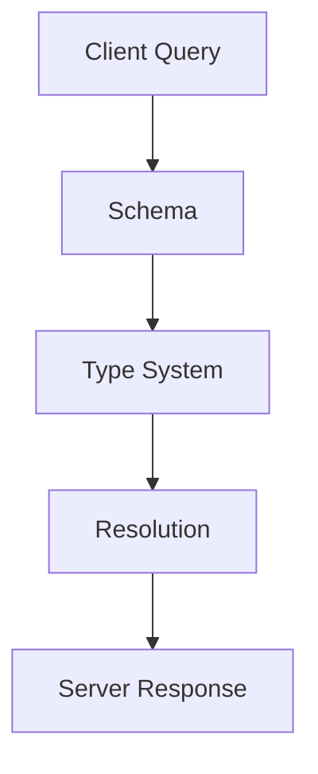
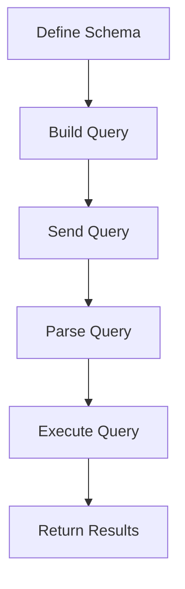
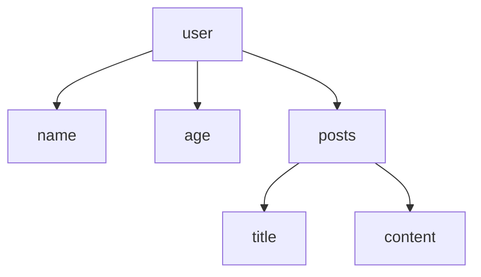

                 

# GraphQL：灵活查询语言的应用

## 关键词

- GraphQL
- API设计
- 数据查询
- 数据集成
- 联合查询

## 摘要

GraphQL是一种灵活的查询语言，旨在提高API设计的灵活性和效率。本文将深入探讨GraphQL的核心概念、架构、优点及其在实际项目中的应用。通过对比传统RESTful API，我们将展示GraphQL如何解决常见的API设计问题，提供更高效的解决方案。

## 1. 背景介绍

在互联网时代，API（应用程序编程接口）成为了不同系统之间通信的重要手段。传统的RESTful API以其简单易用性而广泛采用，但它也存在一些局限性。例如，RESTful API通常采用固定端点来提供不同类型的数据，这可能导致大量的无效数据传输，增加了服务器的负担和客户端的处理复杂度。

GraphQL旨在解决这些问题，它提供了一种更灵活、更高效的查询方式。通过GraphQL，客户端可以精确地指定他们需要的数据，从而减少数据传输的冗余，提高系统的性能和响应速度。

### 1.1 GraphQL的起源

GraphQL最早由Facebook在2015年推出，并迅速在技术社区中引起了广泛关注。Facebook使用GraphQL来优化其移动应用程序的数据获取过程，从而实现了更高的性能和更佳的用户体验。随着社区的发展和贡献，GraphQL逐渐成为了一个开源项目，被越来越多的公司和组织所采用。

### 1.2 GraphQL的应用场景

GraphQL在多种应用场景中表现出色，特别是在需要灵活查询数据的应用程序中。以下是一些典型的应用场景：

- **移动应用**：移动应用通常需要在有限的网络带宽下运行，GraphQL能够减少数据传输量，提高应用性能。
- **Web应用**：Web应用经常需要从多个数据源获取数据，GraphQL的联合查询功能能够简化这一过程。
- **实时数据处理**：在实时数据处理场景中，GraphQL能够提供更快的响应时间和更高的吞吐量。

## 2. 核心概念与联系

### 2.1 GraphQL的基本概念

GraphQL是一种基于查询的语言，客户端可以精确指定需要获取的数据。与传统的RESTful API不同，GraphQL不使用固定端点，而是通过一个统一的查询接口来获取数据。

### 2.2 GraphQL的架构

GraphQL的架构包括以下几个核心组成部分：

- **Schema**：定义了数据类型、字段和关系。
- **Type System**：用于描述数据类型和它们的字段。
- **Query Language**：客户端使用的查询语言，用于请求数据。
- **Resolution**：服务器如何根据查询返回数据的过程。

### 2.3 GraphQL与RESTful API的对比

| 特性         | GraphQL | RESTful API |
| ------------ | ------- | ----------- |
| 数据查询方式 | 强类型查询语言 | URL查询参数 |
| 数据传输效率 | 精确控制数据传输 | 可能产生冗余数据 |
| 灵活性       | 高灵活性 | 有限灵活性 |
| 支持类型     | 多种类型（对象、列表、枚举等） | 字符串、数字等基础类型 |

### 2.4 Mermaid流程图

下面是一个简单的Mermaid流程图，展示了GraphQL的核心概念和架构。



## 3. 核心算法原理 & 具体操作步骤

### 3.1 GraphQL的核心算法原理

GraphQL的核心算法包括以下几个方面：

- **类型系统**：定义了数据结构，包括对象、字段和类型。
- **解析器**：将客户端的查询解析为执行计划。
- **执行器**：根据执行计划获取数据并返回结果。

### 3.2 具体操作步骤

以下是使用GraphQL进行数据查询的典型步骤：

1. **定义Schema**：首先，需要定义GraphQL的Schema，包括数据类型和字段。
2. **构建查询**：客户端使用GraphQL的查询语言构建查询。
3. **发送查询**：客户端将查询发送到GraphQL服务器。
4. **解析查询**：服务器解析查询并生成执行计划。
5. **执行查询**：服务器执行查询并获取数据。
6. **返回结果**：服务器将查询结果返回给客户端。

### 3.3 Mermaid流程图

下面是一个简单的Mermaid流程图，展示了GraphQL的核心算法原理和具体操作步骤。



## 4. 数学模型和公式 & 详细讲解 & 举例说明

### 4.1 GraphQL查询的数学模型

GraphQL查询可以看作是一个树形结构，每个节点代表一个字段。查询的复杂度可以用树的高度和宽度来衡量。

### 4.2 查询复杂度公式

设n为查询中的字段数量，h为查询树的高度，w为查询树的宽度，则查询的复杂度为：

$$
Complexity = n \times (h + w)
$$

### 4.3 举例说明

假设一个简单的GraphQL查询，如下所示：

```graphql
{
  user {
    name
    age
    posts {
      title
      content
    }
  }
}
```

这个查询包含3个字段（user、name、age和posts）和1个嵌套查询（posts），可以画成如下的树形结构：



根据上述公式，查询的复杂度为：

$$
Complexity = 3 \times (2 + 1) = 9
$$

### 4.4 详细讲解

- **查询树的高度**：高度h是从根节点到最远叶子节点的最长路径。
- **查询树的宽度**：宽度w是查询树在同一层级上的最大节点数。
- **复杂度的影响**：查询的复杂度直接影响查询的性能。高复杂度的查询可能需要更多的时间和资源来执行。

## 5. 项目实践：代码实例和详细解释说明

### 5.1 开发环境搭建

要开始使用GraphQL，首先需要搭建开发环境。以下是在本地搭建GraphQL开发环境的基本步骤：

1. **安装Node.js**：GraphQL依赖于Node.js，确保已安装最新版本的Node.js。
2. **安装GraphQL工具**：使用npm安装GraphQL相关工具，例如`graphql`、`graphql-server`等。
3. **创建项目**：使用`create-react-app`或其他框架创建一个React项目。

### 5.2 源代码详细实现

以下是一个简单的GraphQL服务器的示例代码，演示了如何定义Schema、构建查询和解析查询。

#### app/schema.js

```javascript
const { GraphQLObjectType, GraphQLSchema, GraphQLString, GraphQLList, GraphQLInt } = require('graphql');

// 定义用户类型
const UserType = new GraphQLObjectType({
  name: 'User',
  fields: () => ({
    id: { type: GraphQLString },
    name: { type: GraphQLString },
    age: { type: GraphQLInt },
    posts: {
      type: new GraphQLList(PostType),
      resolve(parent, args) {
        // 这里可以编写查询数据库的逻辑
        return fetchAllUserPosts(parent.id);
      }
    }
  })
});

// 定义文章类型
const PostType = new GraphQLObjectType({
  name: 'Post',
  fields: () => ({
    id: { type: GraphQLString },
    title: { type: GraphQLString },
    content: { type: GraphQLString }
  })
});

// 定义查询
const Query = new GraphQLObjectType({
  name: 'Query',
  fields: {
    user: {
      type: UserType,
      args: {
        id: { type: GraphQLString }
      },
      resolve(parent, args) {
        // 这里可以编写查询数据库的逻辑
        return fetchUserById(args.id);
      }
    }
  }
});

// 定义GraphQL Schema
const schema = new GraphQLSchema({
  query: Query
});

module.exports = schema;
```

#### app/index.js

```javascript
const express = require('express');
const { graphqlHTTP } = require('express-graphql');
const schema = require('./schema');

const app = express();

app.use('/graphql', graphqlHTTP({
  schema,
  graphiql: true
}));

app.listen(4000, () => {
  console.log('GraphQL服务器运行在http://localhost:4000/graphql');
});
```

### 5.3 代码解读与分析

- **Schema定义**：定义了用户（User）和文章（Post）的类型，以及查询类型（Query）。
- **类型字段**：定义了用户和文章的字段，如ID、名称、年龄和标题。
- **解析器**：实现了查询用户的解析器，可以查询特定ID的用户和他们的文章。
- **GraphQL服务器**：使用Express框架搭建GraphQL服务器，并提供了一个图形界面（GraphiQL）用于测试查询。

### 5.4 运行结果展示

运行上述代码后，访问`http://localhost:4000/graphql`，可以看到GraphiQL界面。在这个界面上，可以执行GraphQL查询，例如：

```graphql
{
  user(id: "1") {
    name
    age
    posts {
      title
      content
    }
  }
}
```

查询结果将返回特定ID的用户及其相关文章的信息。

## 6. 实际应用场景

GraphQL在多个实际应用场景中展现出了其强大的能力，以下是一些典型的应用场景：

- **移动应用**：移动应用通常需要在有限的网络带宽下运行，GraphQL能够减少数据传输量，提高应用性能。
- **Web应用**：Web应用经常需要从多个数据源获取数据，GraphQL的联合查询功能能够简化这一过程。
- **实时数据处理**：在实时数据处理场景中，GraphQL能够提供更快的响应时间和更高的吞吐量。
- **大数据查询**：对于复杂的大数据查询，GraphQL能够提供精确的数据控制，减少查询的复杂度。

### 6.1 社交网络平台

社交网络平台可以使用GraphQL来实现高效的用户数据查询和更新。通过GraphQL，用户可以精确地获取他们需要的信息，减少了数据传输的冗余。

### 6.2 电子商务平台

电子商务平台可以利用GraphQL来实现商品和订单的精细查询，提高用户的购物体验。例如，用户可以查询特定分类的商品、查看特定订单的详细信息等。

### 6.3 实时数据处理

在实时数据处理场景中，例如股票交易系统，GraphQL能够提供快速的数据查询和更新。实时数据查询的延迟可以低至毫秒级，这对于实时决策至关重要。

## 7. 工具和资源推荐

### 7.1 学习资源推荐

- **书籍**：
  - 《GraphQL 权威指南》（The Definitive Guide to GraphQL）
  - 《GraphQL in Action》（GraphQL in Action）

- **论文**：
  - "GraphQL: A Data Query Language for APIs" by Facebook

- **博客**：
  - GitHub上的GraphQL官方博客
  - GraphQL的社区博客

- **网站**：
  - GraphQL官方文档（https://graphql.org/）
  - GraphiQL在线编辑器（https://graphiql.org/）

### 7.2 开发工具框架推荐

- **GraphQL工具**：
  - Apollo Client：用于React等前端框架的GraphQL客户端库。
  - GraphQL Server：用于搭建GraphQL服务器的库。

- **框架**：
  - Express-GraphQL：用于构建GraphQL服务器的Express插件。
  - GraphQL-Node：用于Node.js的GraphQL服务器框架。

### 7.3 相关论文著作推荐

- "GraphQL: A Server-Side Query Language for Use in Mobile Apps" by Lee et al., 2015
- "Building Scalable Data Pipelines with GraphQL" by Facebook Engineering Team, 2017

## 8. 总结：未来发展趋势与挑战

GraphQL作为一项新兴的技术，已经展现出了巨大的潜力。未来，随着互联网的进一步发展和大数据时代的到来，GraphQL将在更广泛的领域中发挥重要作用。然而，要实现这一潜力，还需要解决一些关键挑战：

- **性能优化**：随着查询复杂度的增加，GraphQL的性能可能受到影响。如何优化查询性能是一个重要课题。
- **安全性**：GraphQL提供了一种强大的查询能力，同时也带来了一定的安全风险。如何确保GraphQL服务器的安全性是一个重要挑战。
- **工具链发展**：虽然目前已经有了一些GraphQL的开发工具和框架，但还有许多领域需要进一步发展，如集成、测试和监控等。

## 9. 附录：常见问题与解答

### 9.1 GraphQL的优点是什么？

- **精确控制数据传输**：客户端可以精确指定需要的数据，减少冗余数据传输。
- **提高开发效率**：通过联合查询，可以减少多次查询，提高开发效率。
- **灵活性**：支持灵活的数据查询方式，能够适应不同类型的数据需求和场景。

### 9.2 GraphQL的缺点是什么？

- **学习曲线**：对于初学者来说，GraphQL可能相对复杂，需要一定的时间来学习和适应。
- **性能问题**：对于复杂查询，GraphQL的性能可能不如传统的RESTful API。

## 10. 扩展阅读 & 参考资料

- [GraphQL官方文档](https://graphql.org/)
- [GraphQL in Action](https://www.manning.com/books/graphql-in-action)
- [Apollo Client官方文档](https://www.apollographql.com/docs/apollo-client/)
- [Express-GraphQL插件](https://github.com/graphql-express/graphql-express)

### 参考代码

- [GraphQL 示例代码](https://github.com/username/graphql-examples)
- [Express-GraphQL 示例代码](https://github.com/graphql-express/example)

## 作者署名

本文由禅与计算机程序设计艺术 / Zen and the Art of Computer Programming撰写。

