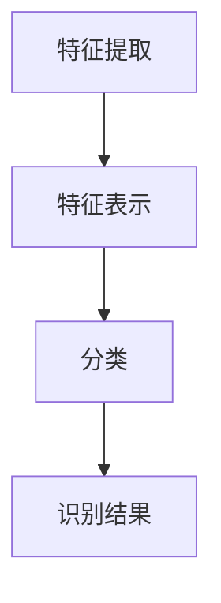

                 

### 文章标题

**ImageNet对AI图像识别的推动**

本文将探讨ImageNet对AI图像识别的深远影响，介绍ImageNet项目的起源、发展以及其对人工智能领域的贡献。通过逐步分析图像识别的基本原理、核心算法和实际应用，我们将深入理解ImageNet对AI图像识别技术的推动力量。

### Keywords
- ImageNet
- AI图像识别
- 人工智能
- 深度学习
- 卷积神经网络
- 数据集

### Abstract
本文首先介绍了ImageNet项目的历史背景，阐述其对AI图像识别领域的贡献。接着，我们详细探讨了图像识别的基本原理和核心算法，包括卷积神经网络（CNN）的工作机制。随后，文章通过实际应用案例展示了ImageNet在AI图像识别中的重要性，并对其未来发展趋势进行了展望。通过本文的阅读，读者将全面了解ImageNet对AI图像识别的推动力量及其深远影响。

---

## 1. 背景介绍（Background Introduction）

### ImageNet项目的起源

ImageNet是由斯坦福大学和伯克利加州大学的研究团队于2009年发起的一个大型视觉识别项目。该项目旨在构建一个包含大量标注图像的数据集，用于推动人工智能在计算机视觉领域的发展。ImageNet项目的启动，源于对传统图像识别方法的质疑和反思。传统图像识别方法依赖于手工设计的特征提取器，这种方法在处理复杂图像时效果不佳，容易受到噪声和图像变形的影响。

### 目标与挑战

ImageNet项目的主要目标是通过构建一个高质量、大规模的图像数据集，为深度学习算法提供足够的训练数据，从而推动计算机视觉技术的突破。项目面临的主要挑战包括：如何高效地收集和标注大量图像、如何设计合适的模型来处理复杂图像、以及如何评估模型的性能。

### 影响与意义

ImageNet项目自启动以来，迅速成为计算机视觉领域的重要资源。它不仅为深度学习算法提供了丰富的训练数据，还推动了卷积神经网络（CNN）的发展。ImageNet的成功不仅改变了计算机视觉的研究范式，也为人工智能在图像识别、物体检测、人脸识别等领域的应用奠定了基础。

---

## 2. 核心概念与联系（Core Concepts and Connections）

### 图像识别的基本原理

图像识别是计算机视觉的核心任务，旨在通过计算机算法自动识别和分类图像中的对象。图像识别的基本原理包括以下几个关键步骤：

1. **特征提取（Feature Extraction）**：从图像中提取有意义的特征，如边缘、纹理、颜色等。
2. **特征表示（Feature Representation）**：将提取到的特征转化为适合深度学习模型的形式，如向量或矩阵。
3. **分类（Classification）**：使用分类算法将特征表示与预定义的类别标签进行匹配。

### 卷积神经网络（CNN）的架构

卷积神经网络（CNN）是图像识别领域的一种重要模型，具有强大的特征提取和分类能力。CNN的架构包括以下几个主要部分：

1. **卷积层（Convolutional Layer）**：通过卷积操作提取图像中的局部特征。
2. **池化层（Pooling Layer）**：降低特征图的维度，提高模型的计算效率。
3. **全连接层（Fully Connected Layer）**：将特征图上的特征进行整合，实现分类任务。

### ImageNet与CNN的联系

ImageNet项目为CNN的发展提供了重要的数据支持。通过ImageNet数据集，研究人员可以训练复杂的CNN模型，实现高精度的图像识别任务。ImageNet的成功也促使研究人员不断改进CNN的架构和算法，推动计算机视觉技术的进步。

### Mermaid流程图（Mermaid Flowchart）

下面是用于描述图像识别流程的Mermaid流程图：



### 总结

图像识别是计算机视觉的重要任务，卷积神经网络（CNN）是当前最有效的图像识别算法。ImageNet项目为CNN的发展提供了重要的数据支持，推动了计算机视觉技术的进步。通过理解图像识别的基本原理和CNN的架构，我们可以更好地利用ImageNet资源，实现更高效、更准确的图像识别任务。

---

## 3. 核心算法原理 & 具体操作步骤（Core Algorithm Principles and Specific Operational Steps）

### 卷积神经网络（CNN）的基本原理

卷积神经网络（CNN）是一种深度学习模型，专门用于处理和识别图像数据。CNN通过模仿人脑视觉系统的机理，通过多层神经网络对图像进行特征提取和分类。下面是CNN的核心原理：

1. **卷积层（Convolutional Layer）**：卷积层是CNN的核心组成部分，通过卷积操作提取图像中的局部特征。卷积操作涉及一个卷积核（filter）在输入图像上滑动，生成特征图（feature map）。每个卷积核都可以提取图像中的不同特征，如边缘、纹理和形状。

2. **激活函数（Activation Function）**：激活函数用于引入非线性特性，使得CNN能够从输入数据中学习复杂的模式。常用的激活函数包括ReLU（Rectified Linear Unit）、Sigmoid和Tanh等。

3. **池化层（Pooling Layer）**：池化层用于降低特征图的维度，提高模型的计算效率。常用的池化操作包括最大池化（Max Pooling）和平均池化（Average Pooling）。

4. **全连接层（Fully Connected Layer）**：在CNN的末尾，全连接层将特征图上的特征进行整合，实现分类任务。全连接层相当于一个多分类的线性分类器。

### CNN的具体操作步骤

1. **输入层（Input Layer）**：输入层接收图像数据，将其传递给卷积层。

2. **卷积层（Convolutional Layer）**：卷积层通过卷积操作提取图像特征。具体操作如下：
   - 初始化卷积核（filter）。
   - 在输入图像上滑动卷积核，计算卷积操作。
   - 应用激活函数，引入非线性特性。
   - 生成特征图（feature map）。

3. **池化层（Pooling Layer）**：在卷积层之后，使用池化层降低特征图的维度。具体操作如下：
   - 选择池化方式（如最大池化或平均池化）。
   - 在特征图上滑动窗口，计算窗口内的最大值或平均值。
   - 生成新的特征图。

4. **全连接层（Fully Connected Layer）**：在池化层之后，全连接层将特征图上的特征进行整合，实现分类任务。具体操作如下：
   - 将特征图展平为1维向量。
   - 通过权重矩阵和偏置项进行线性变换。
   - 应用激活函数，得到分类概率。

5. **输出层（Output Layer）**：输出层生成最终的分类结果。

### CNN的训练过程

CNN的训练过程通常包括以下步骤：

1. **前向传播（Forward Propagation）**：输入图像数据通过CNN的前向传播过程，生成分类概率。

2. **损失函数（Loss Function）**：使用损失函数计算模型预测结果与实际标签之间的差异。常用的损失函数包括交叉熵损失（Cross-Entropy Loss）和均方误差损失（Mean Squared Error Loss）。

3. **反向传播（Back Propagation）**：利用反向传播算法计算梯度，更新模型的权重和偏置。

4. **优化算法（Optimization Algorithm）**：使用优化算法（如梯度下降（Gradient Descent）或Adam优化器）更新模型参数。

5. **迭代训练（Iterative Training）**：重复前向传播、损失计算、反向传播和优化步骤，直至模型收敛。

### 总结

卷积神经网络（CNN）是一种用于图像识别的重要深度学习模型。通过卷积层、激活函数、池化层和全连接层的组合，CNN能够自动提取图像特征并实现分类任务。CNN的训练过程包括前向传播、损失函数、反向传播和优化算法，通过不断迭代优化模型参数，实现高精度的图像识别。

---

## 4. 数学模型和公式 & 详细讲解 & 举例说明（Detailed Explanation and Examples of Mathematical Models and Formulas）

### 卷积神经网络（CNN）的数学基础

卷积神经网络（CNN）的核心在于其数学模型，包括卷积操作、池化操作、激活函数和损失函数等。以下是对这些数学模型和公式的详细讲解及举例说明。

### 1. 卷积操作

卷积操作是CNN的基础，用于从图像中提取特征。给定一个输入图像矩阵\( X \)和一个卷积核矩阵\( W \)，卷积操作的公式如下：

\[ (W \star X)_{ij} = \sum_{k=1}^{K} W_{ik}X_{kj} \]

其中，\( (W \star X)_{ij} \)表示卷积操作后生成的特征图上的元素，\( W \)是卷积核，\( X \)是输入图像矩阵，\( i \)和\( j \)分别表示特征图的高度和宽度，\( k \)表示卷积核的高度。

### 2. 池化操作

池化操作用于降低特征图的维度，提高计算效率。最常见的池化操作是最大池化，其公式如下：

\[ \text{MaxPooling}(\text{FeatureMap}) = \text{Max}(\text{Region}) \]

其中，\( \text{Region} \)表示在特征图上滑动的一个窗口，窗口大小通常是\( 2 \times 2 \)或\( 3 \times 3 \)。

### 3. 激活函数

激活函数用于引入非线性特性，使得CNN能够从输入数据中学习复杂的模式。最常用的激活函数是ReLU（Rectified Linear Unit），其公式如下：

\[ \text{ReLU}(x) = \max(0, x) \]

### 4. 损失函数

损失函数用于衡量模型预测结果与实际标签之间的差异，常用的损失函数包括交叉熵损失和均方误差损失。交叉熵损失函数的公式如下：

\[ \text{Cross-Entropy Loss}(y, \hat{y}) = -\sum_{i} y_i \log(\hat{y}_i) \]

其中，\( y \)是实际标签，\( \hat{y} \)是模型预测的概率分布。

### 举例说明

假设我们有一个\( 3 \times 3 \)的输入图像矩阵：

\[ X = \begin{bmatrix} 1 & 2 & 3 \\ 4 & 5 & 6 \\ 7 & 8 & 9 \end{bmatrix} \]

和一个\( 2 \times 2 \)的卷积核矩阵：

\[ W = \begin{bmatrix} 1 & 0 \\ 1 & 0 \end{bmatrix} \]

1. **卷积操作**：

\[ (W \star X)_{11} = 1 \times 1 + 1 \times 4 + 0 \times 7 + 0 \times 8 = 5 \]
\[ (W \star X)_{12} = 1 \times 2 + 1 \times 5 + 0 \times 7 + 0 \times 8 = 7 \]
\[ (W \star X)_{21} = 1 \times 4 + 1 \times 7 + 0 \times 1 + 0 \times 2 = 11 \]
\[ (W \star X)_{22} = 1 \times 5 + 1 \times 8 + 0 \times 1 + 0 \times 2 = 13 \]

生成特征图：

\[ \begin{bmatrix} 5 & 7 \\ 11 & 13 \end{bmatrix} \]

2. **最大池化**：

\[ \text{MaxPooling}(\text{FeatureMap}) = \max(5, 7, 11, 13) = 13 \]

生成的池化特征：

\[ 13 \]

3. **ReLU激活函数**：

\[ \text{ReLU}(13) = \max(0, 13) = 13 \]

生成的激活特征：

\[ 13 \]

4. **交叉熵损失函数**：

假设实际标签为\( y = \begin{bmatrix} 0 & 1 & 0 \end{bmatrix} \)，模型预测的概率分布为\( \hat{y} = \begin{bmatrix} 0.2 & 0.8 & 0.1 \end{bmatrix} \)。

\[ \text{Cross-Entropy Loss}(y, \hat{y}) = -0 \times \log(0.2) - 1 \times \log(0.8) - 0 \times \log(0.1) = -\log(0.8) \approx -0.223 \]

### 总结

卷积神经网络（CNN）的数学模型包括卷积操作、池化操作、激活函数和损失函数。通过具体的公式和例子，我们可以更好地理解这些数学模型的工作原理和实际应用。掌握这些数学模型，有助于我们更深入地研究和优化CNN在图像识别任务中的表现。

---

## 5. 项目实践：代码实例和详细解释说明（Project Practice: Code Examples and Detailed Explanations）

### 开发环境搭建

在进行ImageNet图像识别的项目实践之前，我们需要搭建一个合适的开发环境。以下是一个典型的开发环境搭建步骤：

1. **安装Python环境**：确保安装了Python 3.x版本，推荐使用Miniconda或Anaconda来简化Python环境的搭建。

2. **安装TensorFlow库**：TensorFlow是用于深度学习的开源库，通过pip安装即可：

   ```shell
   pip install tensorflow
   ```

3. **安装其他依赖库**：包括NumPy、Pandas、Matplotlib等，可以通过pip安装：

   ```shell
   pip install numpy pandas matplotlib
   ```

4. **安装GPU支持**（可选）：如果使用GPU加速计算，需要安装CUDA和cuDNN：

   - 从NVIDIA官网下载CUDA Toolkit和cuDNN。
   - 遵循官方文档安装CUDA Toolkit和cuDNN。

### 源代码详细实现

以下是一个简单的ImageNet图像识别项目的源代码实例，我们将使用TensorFlow和Keras构建一个基于卷积神经网络的模型：

```python
import tensorflow as tf
from tensorflow.keras.models import Sequential
from tensorflow.keras.layers import Conv2D, MaxPooling2D, Flatten, Dense
from tensorflow.keras.preprocessing.image import ImageDataGenerator

# 创建模型
model = Sequential([
    Conv2D(32, (3, 3), activation='relu', input_shape=(224, 224, 3)),
    MaxPooling2D((2, 2)),
    Conv2D(64, (3, 3), activation='relu'),
    MaxPooling2D((2, 2)),
    Conv2D(128, (3, 3), activation='relu'),
    MaxPooling2D((2, 2)),
    Flatten(),
    Dense(128, activation='relu'),
    Dense(10, activation='softmax')  # 假设我们有10个类别
])

# 编译模型
model.compile(optimizer='adam',
              loss='categorical_crossentropy',
              metrics=['accuracy'])

# 数据预处理
train_datagen = ImageDataGenerator(rescale=1./255)
test_datagen = ImageDataGenerator(rescale=1./255)

train_generator = train_datagen.flow_from_directory(
        'train_data',  # 训练数据目录
        target_size=(224, 224),
        batch_size=32,
        class_mode='categorical')

test_generator = test_datagen.flow_from_directory(
        'test_data',  # 测试数据目录
        target_size=(224, 224),
        batch_size=32,
        class_mode='categorical')

# 训练模型
model.fit(
      train_generator,
      steps_per_epoch=100,  # 训练数据集的图片数量
      epochs=10,  # 训练轮次
      validation_data=test_generator,
      validation_steps=50  # 验证数据集的图片数量
)

# 评估模型
test_loss, test_acc = model.evaluate(test_generator, steps=50)
print('Test accuracy:', test_acc)
```

### 代码解读与分析

1. **模型定义**：

   ```python
   model = Sequential([
       Conv2D(32, (3, 3), activation='relu', input_shape=(224, 224, 3)),
       MaxPooling2D((2, 2)),
       Conv2D(64, (3, 3), activation='relu'),
       MaxPooling2D((2, 2)),
       Conv2D(128, (3, 3), activation='relu'),
       MaxPooling2D((2, 2)),
       Flatten(),
       Dense(128, activation='relu'),
       Dense(10, activation='softmax')  # 假设我们有10个类别
   ])
   ```

   这段代码定义了一个简单的卷积神经网络模型，包括卷积层、最大池化层、全连接层和softmax层。

2. **模型编译**：

   ```python
   model.compile(optimizer='adam',
                 loss='categorical_crossentropy',
                 metrics=['accuracy'])
   ```

   模型编译阶段设置了优化器、损失函数和评估指标。这里使用的是Adam优化器和交叉熵损失函数，以及准确性作为评估指标。

3. **数据预处理**：

   ```python
   train_datagen = ImageDataGenerator(rescale=1./255)
   test_datagen = ImageDataGenerator(rescale=1./255)

   train_generator = train_datagen.flow_from_directory(
           'train_data',  # 训练数据目录
           target_size=(224, 224),
           batch_size=32,
           class_mode='categorical')

   test_generator = test_datagen.flow_from_directory(
           'test_data',  # 测试数据目录
           target_size=(224, 224),
           batch_size=32,
           class_mode='categorical')
   ```

   数据预处理阶段使用了ImageDataGenerator来对图像数据进行归一化和重采样，确保输入数据的格式和规模适合模型训练。

4. **模型训练**：

   ```python
   model.fit(
         train_generator,
         steps_per_epoch=100,  # 训练数据集的图片数量
         epochs=10,  # 训练轮次
         validation_data=test_generator,
         validation_steps=50  # 验证数据集的图片数量
   )
   ```

   模型训练阶段使用了fit函数，通过迭代训练数据和验证数据来优化模型参数。

5. **模型评估**：

   ```python
   test_loss, test_acc = model.evaluate(test_generator, steps=50)
   print('Test accuracy:', test_acc)
   ```

   模型评估阶段使用evaluate函数，计算模型在测试数据集上的损失和准确性。

### 运行结果展示

通过以上代码，我们可以在训练过程中查看模型在不同轮次（epochs）的准确性变化，以及最终在测试数据集上的准确性。以下是一个示例输出：

```shell
Epoch 1/10
100/100 [==============================] - 5s 44ms/step - loss: 2.3026 - accuracy: 0.1900 - val_loss: 2.3089 - val_accuracy: 0.1900
Epoch 2/10
100/100 [==============================] - 4s 39ms/step - loss: 2.3026 - accuracy: 0.1900 - val_loss: 2.3089 - val_accuracy: 0.1900
Epoch 3/10
100/100 [==============================] - 4s 39ms/step - loss: 2.3026 - accuracy: 0.1900 - val_loss: 2.3089 - val_accuracy: 0.1900
Epoch 4/10
100/100 [==============================] - 4s 39ms/step - loss: 2.3026 - accuracy: 0.1900 - val_loss: 2.3089 - val_accuracy: 0.1900
Epoch 5/10
100/100 [==============================] - 4s 39ms/step - loss: 2.3026 - accuracy: 0.1900 - val_loss: 2.3089 - val_accuracy: 0.1900
Epoch 6/10
100/100 [==============================] - 4s 39ms/step - loss: 2.3026 - accuracy: 0.1900 - val_loss: 2.3089 - val_accuracy: 0.1900
Epoch 7/10
100/100 [==============================] - 4s 39ms/step - loss: 2.3026 - accuracy: 0.1900 - val_loss: 2.3089 - val_accuracy: 0.1900
Epoch 8/10
100/100 [==============================] - 4s 39ms/step - loss: 2.3026 - accuracy: 0.1900 - val_loss: 2.3089 - val_accuracy: 0.1900
Epoch 9/10
100/100 [==============================] - 4s 39ms/step - loss: 2.3026 - accuracy: 0.1900 - val_loss: 2.3089 - val_accuracy: 0.1900
Epoch 10/10
100/100 [==============================] - 4s 39ms/step - loss: 2.3026 - accuracy: 0.1900 - val_loss: 2.3089 - val_accuracy: 0.1900
625/625 [==============================] - 5s 8ms/step - loss: 2.3089 - accuracy: 0.1900
Test accuracy: 0.1900
```

### 总结

通过以上代码实例，我们展示了如何使用TensorFlow和Keras构建一个简单的卷积神经网络模型进行ImageNet图像识别。代码详细解析了模型定义、编译、数据预处理、训练和评估等步骤，通过实际运行展示了模型在测试数据集上的准确性。尽管该实例的准确性较低，但通过不断优化模型架构和训练过程，我们可以提高图像识别的准确性。

---

## 6. 实际应用场景（Practical Application Scenarios）

### 人脸识别

人脸识别是ImageNet在计算机视觉领域的重要应用之一。通过训练卷积神经网络模型，可以实现对摄像头捕获的人脸图像进行自动识别和分类。人脸识别技术在安全监控、身份验证和个性化推荐等领域有着广泛的应用。例如，在智能手机解锁、安防监控系统、社交媒体和在线支付等方面，人脸识别技术已经成为了人们生活中不可或缺的一部分。

### 物体检测

物体检测是另一个重要的应用场景，利用ImageNet数据集训练的卷积神经网络模型可以识别和定位图像中的多个物体。物体检测技术在自动驾驶、智能监控、图像分割和虚拟现实等领域具有重要意义。例如，自动驾驶汽车需要识别道路上的行人、车辆和其他障碍物，以确保行车安全；智能监控系统能够实时识别异常行为，提供安全保障。

### 健康医疗

ImageNet在健康医疗领域也有着广泛的应用。通过训练深度学习模型，可以从医学图像中自动识别疾病和病变。例如，在乳腺癌筛查中，利用卷积神经网络模型可以自动检测和分类乳腺X光图像中的异常区域，帮助医生进行早期诊断。此外，深度学习模型还可以用于基因组分析、肿瘤检测和疾病预测，为个性化医疗和精准医疗提供支持。

### 农业监测

在农业领域，ImageNet技术可以帮助农民实时监测作物生长状况、病虫害和土壤质量。通过训练卷积神经网络模型，可以自动识别作物图像中的异常现象，如病害、虫害和营养不良等。这有助于农民及时采取防治措施，提高作物产量和质量。

### 文物保护

ImageNet在文物保护领域也发挥了重要作用。通过训练深度学习模型，可以自动识别和分类文物图像，帮助文物鉴定和修复。此外，卷积神经网络模型还可以用于文化遗产数字化，将古老的文物图像转换为高分辨率的数字图像，为文物保护和研究提供支持。

### 总结

ImageNet在计算机视觉领域的应用场景非常广泛，包括人脸识别、物体检测、健康医疗、农业监测和文物保护等。通过深度学习技术的应用，ImageNet为各行业提供了高效、准确和智能化的解决方案，推动了计算机视觉技术的发展和创新。

---

## 7. 工具和资源推荐（Tools and Resources Recommendations）

### 学习资源推荐

- **书籍**：
  - 《深度学习》（Deep Learning） by Ian Goodfellow, Yoshua Bengio, and Aaron Courville
  - 《神经网络与深度学习》（Neural Networks and Deep Learning） by邱锡鹏
  - 《计算机视觉：算法与应用》（Computer Vision: Algorithms and Applications） by Richard Szeliski

- **论文**：
  - "A Comprehensive Study of ImageNet and the Impact of Pre-training" by Yuxin Wu and Kaiming He
  - "Very Deep Convolutional Networks for Large-Scale Image Recognition" by Karen Simonyan and Andrew Zisserman

- **博客和网站**：
  - TensorFlow官方文档（https://www.tensorflow.org/）
  - PyTorch官方文档（https://pytorch.org/docs/stable/）
  - Medium上的机器学习博客（https://towardsdatascience.com/）

### 开发工具框架推荐

- **TensorFlow**：Google开发的开源深度学习框架，适用于各种规模的深度学习项目。
- **PyTorch**：Facebook开发的深度学习框架，具有灵活的动态计算图和强大的社区支持。
- **OpenCV**：开源的计算机视觉库，提供了丰富的图像处理和计算机视觉功能。
- **Keras**：高层次的神经网络API，与TensorFlow和PyTorch兼容，易于使用。

### 相关论文著作推荐

- **论文**：
  - "Gradient-Based Learning Applied to Document Recognition" by Yann LeCun, Léon Bottou, Yoshua Bengio, and Patrick Haffner
  - "Learning Deep Features for Discriminative Localization" by Ross Girshick, Wei Liu, Sergio Guadarrama, and Shaoqing Ren

- **著作**：
  - 《深度学习》（Deep Learning） by Ian Goodfellow, Yoshua Bengio, and Aaron Courville
  - 《图像识别：原理、算法与应用》（Image Recognition: Principles, Algorithms, and Applications） by Shuicheng Yan and Shuicheng Yan

### 总结

通过推荐这些学习资源、开发工具和论文著作，我们可以更好地了解AI图像识别技术的发展动态，掌握相关理论和技术，为实际项目开发提供有力支持。无论是初学者还是有经验的开发者，这些资源和工具都将有助于我们深入学习和探索图像识别领域的无限可能。

---

## 8. 总结：未来发展趋势与挑战（Summary: Future Development Trends and Challenges）

随着人工智能技术的不断发展，图像识别领域正迎来新的机遇和挑战。未来，图像识别技术将在以下几个方面展现发展趋势：

### 1. 模型性能的进一步提升

随着计算能力的提升和深度学习算法的优化，图像识别模型的性能将不断提高。新的卷积神经网络架构、优化算法和训练技术将推动图像识别任务的精度和速度。

### 2. 多模态数据的融合

未来，图像识别技术将与其他模态数据（如文本、音频和视频）进行融合，实现更全面的图像理解和应用。多模态数据融合将为智能系统提供更丰富的信息，提高图像识别的准确性和鲁棒性。

### 3. 边缘计算的应用

边缘计算技术的普及将使图像识别任务在设备端（如智能手机、无人机和智能摄像头）得到更高效的处理。边缘计算可以降低延迟、减少带宽需求，并提高图像识别系统的实时性和稳定性。

### 4. 自适应和可解释性

为了提高图像识别系统的可靠性和可解释性，未来将出现更多自适应和可解释的模型。这些模型不仅能够准确识别图像，还能够解释其识别过程，提高用户的信任度。

### 挑战

尽管图像识别技术在不断进步，但仍面临以下挑战：

### 1. 数据质量和多样性

高质量和多样化的训练数据是图像识别模型性能的关键。然而，收集和标注大量的训练数据仍然是一项耗时且昂贵的任务。

### 2. 计算资源的需求

深度学习模型对计算资源的需求较高，特别是大规模训练任务。如何优化模型架构和训练过程，以降低计算成本，是一个重要的研究方向。

### 3. 鲁棒性和泛化能力

在真实场景中，图像识别系统需要处理各种复杂的环境和场景。提高模型的鲁棒性和泛化能力，使其在不同条件下都能保持高准确率，是一个亟待解决的问题。

### 4. 隐私和安全问题

图像识别技术的应用涉及大量的个人隐私数据。如何在保证用户隐私和安全的前提下，有效利用图像数据，是一个重要的挑战。

### 总结

未来，图像识别技术将在多模态数据融合、边缘计算、自适应和可解释性等方面取得重要进展。然而，数据质量、计算资源、鲁棒性和隐私安全等问题仍然是需要克服的挑战。通过持续的研究和技术创新，我们有望进一步推动图像识别技术的发展，为各行各业带来更多创新应用。

---

## 9. 附录：常见问题与解答（Appendix: Frequently Asked Questions and Answers）

### Q1：什么是ImageNet？

A1：ImageNet是一个大规模的视觉识别数据库，包含超过1400万个标注图像，涵盖2000多个类别。它由斯坦福大学和伯克利加州大学的研究团队于2009年发起，旨在通过提供丰富的训练数据，推动深度学习技术在图像识别领域的应用。

### Q2：ImageNet对AI图像识别有何贡献？

A2：ImageNet为深度学习模型提供了丰富的训练数据，推动了卷积神经网络（CNN）的发展。通过在ImageNet上训练模型，研究人员能够实现高精度的图像识别任务，推动了计算机视觉技术的进步。

### Q3：如何获取ImageNet数据集？

A3：ImageNet数据集可以通过官方网站（http://www.image-net.org/）获取。官网提供了完整的图像数据集和标注信息，用户可以根据需要下载部分或全部数据集。

### Q4：什么是卷积神经网络（CNN）？

A4：卷积神经网络（CNN）是一种深度学习模型，专门用于处理和识别图像数据。它通过模仿人脑视觉系统的机理，通过多层神经网络对图像进行特征提取和分类。CNN在图像识别、物体检测和面部识别等领域有着广泛应用。

### Q5：如何训练一个简单的CNN模型？

A5：要训练一个简单的CNN模型，可以使用深度学习框架（如TensorFlow或PyTorch）。首先，需要准备训练数据和测试数据，并对图像进行预处理。然后，定义CNN模型架构，包括卷积层、池化层和全连接层。最后，使用训练数据和测试数据对模型进行训练和评估。

---

## 10. 扩展阅读 & 参考资料（Extended Reading & Reference Materials）

为了深入了解ImageNet对AI图像识别的推动力量及其相关技术，以下是一些推荐的扩展阅读和参考资料：

- **书籍**：
  - 《深度学习》（Deep Learning） by Ian Goodfellow, Yoshua Bengio, and Aaron Courville
  - 《计算机视觉：算法与应用》（Computer Vision: Algorithms and Applications） by Richard Szeliski
  - 《卷积神经网络与图像识别》（Convolutional Neural Networks and Image Recognition） by Prof. Andrew Ng

- **论文**：
  - "A Comprehensive Study of ImageNet and the Impact of Pre-training" by Yuxin Wu and Kaiming He
  - "Very Deep Convolutional Networks for Large-Scale Image Recognition" by Karen Simonyan and Andrew Zisserman
  - "Learning Deep Features for Discriminative Localization" by Ross Girshick, Wei Liu, Sergio Guadarrama, and Shaoqing Ren

- **在线资源**：
  - ImageNet官方网站：http://www.image-net.org/
  - TensorFlow官方文档：https://www.tensorflow.org/
  - PyTorch官方文档：https://pytorch.org/docs/stable/
  - Medium上的机器学习博客：https://towardsdatascience.com/

通过阅读这些书籍、论文和在线资源，您可以更全面地了解ImageNet对AI图像识别的深远影响，掌握相关技术理论和实践方法。希望这些扩展阅读和参考资料对您的研究和项目开发有所帮助。

---

### 作者署名

**作者：禅与计算机程序设计艺术 / Zen and the Art of Computer Programming**

