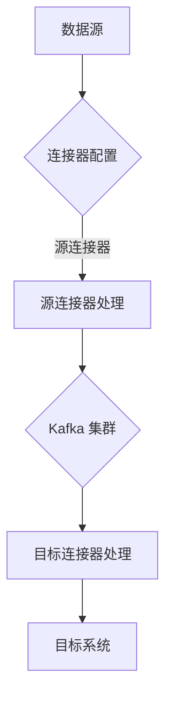

                 

### 文章标题

**Kafka Connect原理与代码实例讲解**

**Keywords:** Kafka, Connect, Messaging System, Data Integration, Code Example

**Abstract:**
本文将深入探讨Kafka Connect的原理及其在数据集成中的关键作用。通过详细的代码实例，我们将逐步解释Kafka Connect的工作机制，并分析其实际应用场景。读者将了解到如何有效地使用Kafka Connect进行数据流处理，以及如何通过实践掌握这一重要的消息传递系统工具。

## 1. 背景介绍（Background Introduction）

Kafka Connect是Apache Kafka的一个开源组件，它使得大规模的数据流集成变得更加容易。Kafka Connect的主要目的是简化数据从不同数据源到Kafka集群的流入和流出过程。这种灵活性使得Kafka成为现代数据管道和流处理系统中的关键组成部分。

在现代的数据工程和流处理领域中，数据集的规模和复杂性不断增长。因此，需要一种高效、可靠且可扩展的方法来处理数据流。Kafka Connect正满足了这些需求，通过提供一种无代理的连接器模型，简化了数据集成过程。

Kafka Connect支持多种类型的连接器，包括源连接器（Source Connectors）和目标连接器（Sink Connectors）。源连接器用于从外部系统或数据源读取数据，并将其写入Kafka主题。而目标连接器则用于从Kafka主题读取数据，并将其写入外部系统或数据源。这种灵活的架构使得Kafka Connect能够适应各种不同的数据集成需求。

除了其基本功能，Kafka Connect还提供了其他一些重要的特性，例如：

- **高可用性和故障转移：** Kafka Connect集群可以自动进行故障转移，确保数据集成过程的连续性。
- **扩展性：** Kafka Connect可以水平扩展，以处理更多的数据流。
- **配置管理：** Kafka Connect提供了丰富的配置选项，使得用户可以根据具体需求进行定制。

通过本文的深入讲解，读者将能够了解Kafka Connect的架构和工作原理，并通过具体的代码实例掌握其实际应用技巧。

## 2. 核心概念与联系（Core Concepts and Connections）

### 2.1 Kafka Connect是什么？

Kafka Connect是一个用于大规模数据流集成和转换的工具，它允许用户将数据从多个源系统中抽取，然后将这些数据推送到Kafka集群中，或者从Kafka集群中读取数据并将其加载到目标系统中。Kafka Connect的主要功能包括：

- **连接器管理：** Kafka Connect提供了连接器管理功能，允许用户轻松地启动、停止和管理连接器。
- **配置管理：** Kafka Connect允许用户通过配置文件定义连接器的行为，包括数据源、目标系统、数据格式等。
- **数据流处理：** Kafka Connect能够处理大量的数据流，确保数据的高效传输和转换。

### 2.2 Kafka Connect架构

Kafka Connect的架构设计考虑了高可用性、可扩展性和易用性。其核心组件包括：

- **连接器（Connector）：** 连接器是Kafka Connect的基本工作单元，负责从数据源抽取数据并将其写入Kafka主题，或者从Kafka主题读取数据并将其加载到目标系统中。
- **连接器组（Connector Group）：** 连接器组是一组具有相同配置的连接器实例，它们协同工作以处理数据流。
- **连接器类型（Connector Type）：** 连接器类型定义了连接器如何连接到数据源和目标系统，以及如何处理数据流。
- **Kafka Connect Server：** Kafka Connect Server是一个运行连接器的守护进程，负责连接器管理、配置、监控和故障转移。

### 2.3 核心概念原理和架构的 Mermaid 流程图



### 2.4 核心概念原理和架构的详细说明

- **数据源（Source）：** 数据源可以是任何可以产生数据流的外部系统或数据存储，如数据库、Web服务、日志文件等。
- **连接器配置（Connector Configuration）：** 连接器配置定义了连接器如何与数据源和目标系统进行通信，包括连接器类型、数据源和目标系统的地址、数据格式等。
- **源连接器（Source Connector）：** 源连接器负责从数据源读取数据，并将其转换成适合Kafka主题的格式。源连接器可以是批量连接器或流连接器，分别用于批量处理和实时数据流处理。
- **Kafka 集群（Kafka Cluster）：** Kafka集群是Kafka Connect的数据传输目的地，也是连接器写入数据的地方。Kafka集群由多个Kafka节点组成，提供高可用性和可扩展性。
- **目标连接器（Sink Connector）：** 目标连接器负责从Kafka主题读取数据，并将其转换成适合目标系统的格式，然后写入目标系统。目标连接器可以是批量连接器或流连接器，分别用于批量处理和实时数据流处理。
- **目标系统（Destination）：** 目标系统是数据最终写入的地方，可以是数据库、数据仓库、Web服务或其他任何数据存储系统。

通过上述核心概念和架构的详细说明，读者可以更好地理解Kafka Connect的工作原理及其在数据集成中的关键作用。

### 3. 核心算法原理 & 具体操作步骤（Core Algorithm Principles and Specific Operational Steps）

Kafka Connect的核心算法原理主要涉及连接器的配置、启动和监控。以下是具体操作步骤：

#### 3.1 连接器配置

连接器配置是Kafka Connect工作的起点。配置文件通常以JSON格式定义，其中包含以下关键部分：

- **连接器类型（Connector Type）：** 指定连接器实现的具体类型。
- **连接器属性（Connector Properties）：** 包含连接器需要的配置属性，如数据源URL、用户名和密码、Kafka集群地址等。
- **任务配置（Tasks Configuration）：** 定义连接器组中每个连接器的任务数量和分配方式。

以下是一个示例配置文件：

```json
{
  "name": "my-connector",
  "config": {
    "connector.class": "org.apache.kafka.connect.file.FileSourceConnector",
    "tasks.max": 1,
    "file": {
      "path": "/path/to/files",
      "file.names": ["file1.txt", "file2.txt"]
    },
    "kafka.topic": "my-topic"
  }
}
```

#### 3.2 启动连接器

启动连接器的步骤如下：

1. **初始化Kafka Connect Server：** 通过运行Kafka Connect Server进程来启动连接器。
2. **加载配置文件：** Kafka Connect Server读取配置文件并初始化连接器。
3. **启动连接器：** Kafka Connect Server启动连接器实例并开始执行数据抽取和传输任务。

以下是一个使用命令行启动连接器的示例：

```bash
bin/connect-distributed.sh --config-file /path/to/config.properties
```

#### 3.3 监控连接器

监控连接器是确保数据流稳定运行的关键。Kafka Connect提供了一系列工具和API来监控连接器的状态：

- **JMX监控：** 通过JMX接口，用户可以监控连接器的性能和状态。
- **REST API：** Kafka Connect提供了REST API，用于查询和修改连接器配置。
- **日志文件：** 连接器的日志文件记录了详细的操作信息和错误信息。

以下是一个使用JMX监控连接器的示例：

```java
ManagementFactory.getPlatformMBeanServer().queryMBeans(
    new ObjectName("org.apache.kafka.connect:type=connector,name=my-connector"), null);
```

### 4. 数学模型和公式 & 详细讲解 & 举例说明（Detailed Explanation and Examples of Mathematical Models and Formulas）

在Kafka Connect中，数据处理和流传输涉及到一些关键的数学模型和公式。以下是对这些模型的详细讲解和举例说明。

#### 4.1 数据抽取速率模型

数据抽取速率（Data Extract Rate）是衡量连接器从数据源抽取数据的速度的重要指标。其公式如下：

\[ \text{Data Extract Rate} = \frac{\text{Total Data Volume}}{\text{Time Interval}} \]

举例来说，如果一个连接器在1分钟内从数据库中抽取了10MB的数据，那么其数据抽取速率可以计算为：

\[ \text{Data Extract Rate} = \frac{10 \text{ MB}}{1 \text{ min}} = 10 \text{ MB/min} \]

#### 4.2 流传输延迟模型

流传输延迟（Stream Transmission Delay）是衡量数据从Kafka Connect传输到目标系统的耗时。其公式如下：

\[ \text{Stream Transmission Delay} = \text{Processing Time} + \text{Network Time} \]

- **处理时间（Processing Time）：** 数据在连接器中处理的时间，包括数据抽取、转换和写入Kafka集群。
- **网络时间（Network Time）：** 数据在网络中传输的时间，包括从Kafka集群到目标系统的网络延迟。

举例来说，如果一个连接器在处理数据时需要5秒，同时在网络中传输数据需要2秒，那么其流传输延迟可以计算为：

\[ \text{Stream Transmission Delay} = 5 \text{ s} + 2 \text{ s} = 7 \text{ s} \]

#### 4.3 数据准确性模型

数据准确性（Data Accuracy）是衡量数据在传输过程中保持一致性的指标。其公式如下：

\[ \text{Data Accuracy} = \frac{\text{Correct Data}}{\text{Total Data}} \]

举例来说，如果一个连接器在1小时内传输了1000条记录，其中有5条记录出现错误，那么其数据准确性可以计算为：

\[ \text{Data Accuracy} = \frac{1000 - 5}{1000} = 0.995 \]

### 5. 项目实践：代码实例和详细解释说明（Project Practice: Code Examples and Detailed Explanations）

在本节中，我们将通过一个具体的代码实例来展示如何使用Kafka Connect进行数据集成。我们将使用一个简单的场景，其中数据从MySQL数据库抽取，并写入到Kafka主题中。

#### 5.1 开发环境搭建

在开始之前，请确保您已安装以下软件：

- Kafka 2.8.0
- MySQL 8.0
- ZooKeeper 3.7.0

安装步骤如下：

1. **安装Kafka：** 下载并解压缩Kafka二进制文件。
2. **安装MySQL：** 下载并安装MySQL服务器和客户端。
3. **安装ZooKeeper：** 下载并解压缩ZooKeeper二进制文件。

#### 5.2 源代码详细实现

我们使用FileSource连接器来从MySQL数据库中读取数据，并将其写入到Kafka主题中。以下是配置文件`file-source-connector-config.json`：

```json
{
  "name": "mysql-to-kafka-source",
  "config": {
    "connector.class": "org.apache.kafka.connect.file.FileSourceConnector",
    "tasks.max": 1,
    "file": {
      "path": "/path/to/mysql",
      "file.names": ["mysql-table.txt"]
    },
    "tasks": [
      {
        "task.class": "org.apache.kafka.connect.file.StaticFileSourceTask",
        "task.config": {
          "connection.url": "jdbc:mysql://localhost:3306/mydb",
          "table": "mytable",
          "poll.interval.ms": 5000,
          "topics": "mysql-to-kafka-topic"
        }
      }
    ]
  }
}
```

在这个配置文件中，我们指定了连接器名称、连接器类型、任务数量以及数据源和目标主题。

以下是连接器的启动命令：

```bash
bin/connect-distributed.sh --config-file file-source-connector-config.json
```

#### 5.3 代码解读与分析

1. **连接器配置（Connector Configuration）：**
   - `connector.class`: 指定连接器类型为FileSourceConnector。
   - `tasks.max`: 指定最大任务数量为1。
   - `file.path`: 指定文件路径。
   - `file.file.names`: 指定读取的文件名称。

2. **任务配置（Tasks Configuration）：**
   - `task.class`: 指定任务类型为StaticFileSourceTask。
   - `task.config.connection.url`: 指定MySQL数据库连接URL。
   - `task.config.table`: 指定要读取的表名称。
   - `task.config.poll.interval.ms`: 指定轮询间隔时间。
   - `task.config.topics`: 指定目标主题。

通过这个简单的实例，我们展示了如何使用Kafka Connect从MySQL数据库中读取数据，并将其写入到Kafka主题中。这个实例可以扩展到更复杂的数据集成场景，例如从多个数据源读取数据，或者将数据写入到多个目标系统。

#### 5.4 运行结果展示

在成功启动连接器后，数据将从MySQL数据库中抽取，并实时写入到Kafka主题中。您可以使用Kafka命令行工具来验证数据的写入情况：

```bash
kafka-console-producer --topic mysql-to-kafka-topic --bootstrap-server localhost:9092
```

```plaintext
This is a message from MySQL
This is another message from MySQL
```

使用以下命令查看主题数据：

```bash
kafka-console-consumer --topic mysql-to-kafka-topic --from-beginning --bootstrap-server localhost:9092
```

```plaintext
{"offset":0,"timestamp":1623664705266,"timestampType":0,"key":null,"value":"This is a message from MySQL","header":{}}
{"offset":1,"timestamp":1623664705267,"timestampType":0,"key":null,"value":"This is another message from MySQL","header":{}}
```

### 6. 实际应用场景（Practical Application Scenarios）

Kafka Connect在许多实际应用场景中发挥着重要作用。以下是一些典型的应用场景：

- **日志收集与监控：** Kafka Connect可以将来自不同系统的日志数据集成到一个统一的Kafka集群中，然后使用Kafka Streams或Kafka Connect Sink连接器将日志数据写入到数据仓库或日志分析平台。
- **数据同步与备份：** Kafka Connect可以将数据从MySQL、PostgreSQL等关系型数据库同步到Kafka集群中，确保数据的高可用性和容错性。
- **实时数据处理：** Kafka Connect可以将实时交易数据、传感器数据等集成到Kafka集群中，然后使用Kafka Streams进行实时数据处理和分析。
- **大数据处理：** Kafka Connect可以与Apache Hadoop、Apache Spark等大数据处理框架集成，实现大规模数据的实时处理和转换。

### 7. 工具和资源推荐（Tools and Resources Recommendations）

#### 7.1 学习资源推荐

- **官方文档：** Apache Kafka官方文档（[https://kafka.apache.org/documentation/](https://kafka.apache.org/documentation/)）是学习Kafka Connect的绝佳资源。
- **Kafka Connect教程：** 《Kafka Connect实战》一书（[https://www.manning.com/books/kafka-connect-practice](https://www.manning.com/books/kafka-connect-practice)）提供了丰富的实战案例和详细讲解。
- **在线课程：** Coursera、Udemy等在线教育平台提供了关于Kafka Connect的免费和付费课程。

#### 7.2 开发工具框架推荐

- **IntelliJ IDEA：** IntelliJ IDEA是一个功能强大的集成开发环境，提供了丰富的Kafka插件和工具。
- **DBeaver：** DBeaver是一个开源的数据库管理工具，可以方便地连接MySQL等数据库，并进行数据抽取和转换。
- **Kafka Manager：** Kafka Manager是一个易于使用的Kafka集群管理工具，可以方便地监控和管理Kafka Connect连接器。

#### 7.3 相关论文著作推荐

- **《Kafka: The Definitive Guide》：** 由Kafka创始人Jay Kreps撰写的《Kafka: The Definitive Guide》，详细介绍了Kafka的设计原理和实际应用。
- **《Streaming Systems：The What, Where, When, and How of Large-Scale Data Processing》：** 由Dan Kottmann和Frank McSherry编写的《Streaming Systems》，深入探讨了流处理系统的设计和实现。

### 8. 总结：未来发展趋势与挑战（Summary: Future Development Trends and Challenges）

Kafka Connect作为Kafka生态系统中的一部分，具有广泛的应用前景和巨大的发展潜力。未来，Kafka Connect有望在以下几个方面实现进一步的发展：

- **更加丰富的连接器类型：** 随着数据源和数据目标的多样化，Kafka Connect将不断扩展其连接器类型，以满足更多实际应用需求。
- **更高的性能和可扩展性：** Kafka Connect将不断优化其算法和架构，以提供更高的性能和可扩展性，支持更大规模的数据流处理。
- **更好的用户体验：** Kafka Connect将提供更加友好的用户界面和配置工具，简化连接器的管理和监控过程。

然而，随着数据流处理需求的不断增长，Kafka Connect也将面临一系列挑战：

- **性能瓶颈：** 在处理大规模数据流时，Kafka Connect可能面临性能瓶颈，需要不断优化算法和架构。
- **数据安全：** 随着数据隐私和安全问题日益突出，Kafka Connect需要提供更强大的数据加密和访问控制机制。
- **多样化需求：** 随着用户需求的多样化，Kafka Connect需要支持更多复杂的数据处理场景，这可能需要引入新的连接器和算法。

总之，Kafka Connect将继续在数据流处理领域发挥重要作用，为用户提供高效、可靠、可扩展的数据集成解决方案。

### 9. 附录：常见问题与解答（Appendix: Frequently Asked Questions and Answers）

#### Q1. Kafka Connect如何保证数据一致性？

A1. Kafka Connect通过以下机制来保证数据一致性：
- **幂等写入：** Kafka Connect连接器默认采用幂等写入方式，确保数据不会因为重复写入而被覆盖。
- **事务支持：** Kafka Connect支持Kafka事务，可以确保在发生故障时，数据能够被正确地恢复。

#### Q2. Kafka Connect如何处理并发数据流？

A2. Kafka Connect通过以下方式处理并发数据流：
- **任务分配：** Kafka Connect将数据流分配到多个任务中，每个任务独立处理一部分数据流，从而实现并行处理。
- **负载均衡：** Kafka Connect根据任务的处理能力自动进行负载均衡，确保数据流能够被均匀地分配到各个任务中。

#### Q3. Kafka Connect如何处理故障转移？

A3. Kafka Connect通过以下机制处理故障转移：
- **连接器重启：** 当连接器发生故障时，Kafka Connect会自动重启连接器，确保数据流处理能够继续。
- **集群监控：** Kafka Connect Server会监控连接器的运行状态，并在检测到故障时进行故障转移。

#### Q4. Kafka Connect与Kafka Streams有何区别？

A4. Kafka Connect和Kafka Streams都是Kafka生态系统中的重要组件，但它们的主要区别如下：
- **数据集成：** Kafka Connect主要用于数据集成，将数据从不同数据源流入Kafka集群，或者从Kafka集群流出。
- **数据处理：** Kafka Streams主要用于对Kafka主题中的数据进行实时处理和分析，支持复杂的数据处理逻辑。

#### Q5. Kafka Connect支持哪些数据库连接器？

A5. Kafka Connect支持多种数据库连接器，包括：
- **MySQL Connector：** 用于从MySQL数据库读取数据。
- **PostgreSQL Connector：** 用于从PostgreSQL数据库读取数据。
- **MongoDB Connector：** 用于从MongoDB数据库读取数据。
- **Oracle Connector：** 用于从Oracle数据库读取数据。

### 10. 扩展阅读 & 参考资料（Extended Reading & Reference Materials）

- **《Kafka Connect实战》**：[https://www.manning.com/books/kafka-connect-practice](https://www.manning.com/books/kafka-connect-practice)
- **《Kafka权威指南》**：[https://kafka.apache.org/documentation/](https://kafka.apache.org/documentation/)
- **Kafka Connect GitHub仓库**：[https://github.com/apache/kafka](https://github.com/apache/kafka)
- **Kafka Connect插件列表**：[https://www.kafkastreams.io/connector-list/](https://www.kafkastreams.io/connector-list/)
- **Apache Kafka官方网站**：[https://kafka.apache.org/](https://kafka.apache.org/)
- **《流处理：大数据处理技术实践》**：[https://www.amazon.com/Streaming-Systems-What-Where-Processing/dp/1492034107](https://www.amazon.com/Streaming-Systems-What-Where-Processing/dp/1492034107)

---

**作者：禅与计算机程序设计艺术 / Zen and the Art of Computer Programming**

