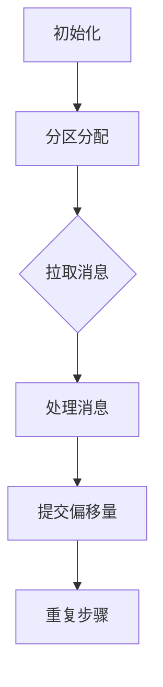

                 

### 文章标题

**Kafka Consumer原理与代码实例讲解**

**Keywords:** Kafka, Consumer, Message Queue, Message Consumption, Real-time Data Processing

**Abstract:**
本文将深入讲解Kafka Consumer的工作原理，通过一个实际代码实例，带领读者了解Kafka Consumer的核心架构、配置选项、消息消费流程以及在实际项目中的应用。文章旨在帮助读者全面理解Kafka Consumer的运作机制，掌握其使用技巧，为后续的实战应用奠定坚实基础。

### 背景介绍（Background Introduction）

Apache Kafka是一个分布式流处理平台，广泛应用于大数据实时处理、消息队列、活动跟踪等多个领域。Kafka的核心组件包括Producer、Broker和Consumer。本文重点探讨Kafka Consumer的原理与实现，因为Consumer负责从Kafka集群中消费消息，是数据流处理的重要环节。

Kafka Consumer具有以下特点：

1. **分布式消费**：Consumer可以横向扩展，支持大规模消息消费。
2. **高可用性**：Consumer故障不会导致数据丢失，集群中其他Consumer可以继续消费。
3. **低延迟**：消息消费速度快，可以满足实时数据处理需求。
4. **灵活性**：支持多种消息消费模式，如批量消费、单条消费等。
5. **可扩展性**：Consumer可以动态增加或减少，以适应数据流量的变化。

随着Kafka在各大互联网公司和大数据领域的广泛应用，掌握Kafka Consumer的使用和优化方法具有重要意义。本文将首先介绍Kafka Consumer的核心概念和架构，然后通过具体代码实例，详细解析Kafka Consumer的运作流程，最后探讨Kafka Consumer在实际应用中的优化策略。

### 核心概念与联系（Core Concepts and Connections）

#### 1. Kafka Consumer定义

Kafka Consumer是一个从Kafka集群中消费消息的客户端应用程序。Consumer负责从Kafka Topic中读取消息，并对其进行处理。每个Consumer实例负责消费一个或多个分区中的消息。

#### 2. Kafka Consumer架构

Kafka Consumer架构包括以下几个主要组件：

1. **Consumer Group**：多个Consumer实例组成一个Consumer Group，共同消费一个或多个Topic中的消息。每个分区只会被一个Consumer Group中的Consumer消费，确保消息不会重复。
2. **Kafka Cluster**：包含多个Broker节点，负责存储和转发消息。每个Broker节点都可以接收和发送消息，从而提高系统的可扩展性和容错性。
3. **Topic**：消息分类的标签，包含多个Partition。每个Partition是一个有序的消息队列，保证消息的顺序消费。
4. **Offset**：表示Consumer在Partition中的位置，即Consumer消费到哪个消息。通过Offset，可以准确记录Consumer的消费进度，实现数据一致性。

#### 3. Kafka Consumer工作流程

Kafka Consumer工作流程如下：

1. **初始化**：Consumer连接到Kafka集群，加载配置信息，加入Consumer Group。
2. **分区分配**：根据分区分配策略，Consumer Group中的每个Consumer负责消费特定分区中的消息。
3. **拉取消息**：Consumer从对应分区中拉取消息，存储在本地内存缓冲区。
4. **处理消息**：Consumer对拉取到的消息进行处理，如存储、计算、分析等。
5. **提交偏移量**：Consumer向Kafka提交消费进度，确保消息不会被重复消费。
6. **重复以上步骤**：Consumer不断循环执行上述流程，消费更多消息。

#### 4. Mermaid 流程图



通过上述核心概念与架构的介绍，读者可以初步了解Kafka Consumer的工作原理。接下来，我们将通过具体代码实例，深入探讨Kafka Consumer的实现细节，帮助读者更好地掌握其使用方法。

### 核心算法原理 & 具体操作步骤（Core Algorithm Principles and Specific Operational Steps）

Kafka Consumer的核心算法主要涉及消息拉取、处理和偏移量提交三个环节。以下将详细介绍这三个环节的具体操作步骤和原理。

#### 1. 消息拉取

消息拉取是Consumer与Kafka集群之间通信的第一步。Consumer通过Kafka协议向Brokers发送拉取请求，获取指定Topic和Partition中的消息。以下是消息拉取的主要步骤：

1. **初始化连接**：Consumer首先连接到Kafka集群中的Brokers。连接成功后，Consumer会向Brokers发送心跳消息，以保持连接状态。
2. **选择分区**：Consumer根据分区分配策略，选择要消费的分区。分区分配策略有多种，如Range、RoundRobin等。默认情况下，Kafka使用Range策略，确保每个Consumer Group中的Consumer消费不同的分区。
3. **发送拉取请求**：Consumer向Brokers发送拉取请求，包含以下信息：
   - Topic和Partition列表：指定要消费的Topic和Partition。
   - 拉取位置：指定Consumer上次消费的Offset。
   - 拉取大小：指定每次拉取的消息数量。
4. **接收消息**：Brokers根据拉取请求，从对应Partition中检索消息，并将消息发送给Consumer。消息以批次形式传输，提高拉取效率。
5. **处理消息**：Consumer接收到的消息存储在本地内存缓冲区中，待后续处理。

#### 2. 消息处理

消息处理是Consumer的核心功能，负责将拉取到的消息进行解析、处理和存储。以下是消息处理的主要步骤：

1. **解析消息**：Consumer从消息批次中提取消息，并根据消息格式进行解析。Kafka支持多种消息格式，如JSON、Protobuf等。
2. **处理消息**：对解析后的消息进行具体处理，如存储、计算、分析等。处理逻辑根据实际业务需求进行定制。
3. **消息确认**：消息处理完成后，Consumer向Kafka提交消费确认，表示消息已成功处理。通过消息确认，可以确保消息不会重复处理。

#### 3. 偏移量提交

偏移量提交是Consumer记录消费进度的重要步骤。通过提交偏移量，Consumer可以确保消息的顺序消费和一致性。以下是偏移量提交的主要步骤：

1. **记录偏移量**：Consumer在处理每条消息时，会记录该消息的Offset值。Offset值表示Consumer在Partition中的消费位置。
2. **本地缓存**：为了提高提交效率，Consumer通常将多个Offset值缓存在本地内存中，形成一个偏移量缓存队列。
3. **定期提交**：Consumer定期向Kafka提交偏移量。提交频率可以通过配置调整，默认情况下为1分钟。
4. **异步提交**：为了不影响消息处理速度，Consumer通常采用异步提交方式，将偏移量提交操作放到后台线程执行。

通过以上步骤，Kafka Consumer实现了消息的拉取、处理和偏移量提交，确保了消息的顺序消费和一致性。接下来，我们将通过具体代码实例，进一步探讨Kafka Consumer的实现细节。

### 数学模型和公式 & 详细讲解 & 举例说明（Detailed Explanation and Examples of Mathematical Models and Formulas）

在Kafka Consumer中，涉及一些关键的数学模型和公式，用于描述消息拉取、处理和偏移量提交的算法。以下将详细介绍这些模型和公式，并通过具体示例进行说明。

#### 1. 分区分配策略

分区分配策略是Consumer Group中的每个Consumer负责消费哪些分区的重要依据。常见的分区分配策略有Range、RoundRobin等。

**1. Range策略**

Range策略将所有分区按照一定间隔分配给Consumer Group中的每个Consumer。假设有N个Consumer和M个分区，每个Consumer负责$\frac{M}{N}$个分区。例如，如果N=3，M=9，则每个Consumer分别负责分区[0,2)、[3,5)和[6,8)。

**公式**：$partition\_index = consumer\_id \times \frac{partitions}{num\_consumers}$

**示例**：

假设Consumer Group中有3个Consumer，要消费的Topic有9个分区，使用Range策略进行分区分配：

| Consumer ID | 分区范围          |
|-------------|------------------|
| 0           | [0,2)           |
| 1           | [3,5)           |
| 2           | [6,8)           |

**2. RoundRobin策略**

RoundRobin策略将分区顺序分配给Consumer Group中的每个Consumer，确保每个Consumer依次消费分区。例如，如果N=3，M=9，则分区依次分配给Consumer ID为0、1、2的Consumer。

**公式**：$partition\_index = consumer\_id \times num\_consumers + (index \mod num\_consumers)$

**示例**：

假设Consumer Group中有3个Consumer，要消费的Topic有9个分区，使用RoundRobin策略进行分区分配：

| Consumer ID | 分区范围          |
|-------------|------------------|
| 0           | [0,0)           |
| 1           | [1,1)           |
| 2           | [2,2)           |
| 0           | [3,3)           |
| 1           | [4,4)           |
| 2           | [5,5)           |
| 0           | [6,6)           |
| 1           | [7,7)           |
| 2           | [8,8)           |

#### 2. 消息拉取策略

消息拉取策略决定了Consumer如何从Kafka Brokers中获取消息。常见的消息拉取策略有Time-based、Size-based等。

**1. Time-based策略**

Time-based策略根据消息在Kafka中的存储时间，拉取超过指定时间阈值的消息。例如，如果阈值设置为5分钟，则Consumer会拉取5分钟内的新消息。

**公式**：$threshold\_time = current\_time - time\_interval$

**示例**：

假设当前时间为2023-10-01 12:00:00，时间阈值设置为5分钟，则Consumer会拉取2023-10-01 11:55:00之后的消息。

**2. Size-based策略**

Size-based策略根据消息大小，拉取不超过指定大小的消息批次。例如，如果批次大小设置为10KB，则Consumer会拉取总大小不超过10KB的消息。

**公式**：$batch\_size = message\_size \times num\_messages \leq max\_batch\_size$

**示例**：

假设Consumer配置的批次大小为10KB，单个消息大小为2KB，则Consumer会拉取不超过5条的消息批次。

通过以上数学模型和公式，Kafka Consumer实现了分区分配、消息拉取和偏移量提交等功能。接下来，我们将通过具体代码实例，进一步探讨Kafka Consumer的实现细节。

### 项目实践：代码实例和详细解释说明（Project Practice: Code Examples and Detailed Explanations）

在本节中，我们将通过一个简单的Java项目实例，详细讲解如何使用Kafka Consumer来消费消息。项目环境要求包括Kafka服务器的搭建和Java开发工具的安装，以下是具体步骤和代码解析。

#### 1. 开发环境搭建

**1. Kafka服务器搭建**

首先，我们需要搭建一个Kafka服务器环境。本文以Kafka 2.8版本为例，下载并解压Kafka安装包。接下来，执行以下命令启动Kafka服务器：

```shell
./kafka-server-start.sh config/server.properties
```

**2. Java开发工具安装**

安装Java开发工具，配置环境变量。建议使用OpenJDK 11及以上版本。

#### 2. 源代码详细实现

我们使用Spring Boot框架来搭建Kafka Consumer项目。以下是一个简单的示例，包括配置类、Consumer类和处理类。

**1. Kafka配置类（KafkaConfig.java）**

```java
import org.apache.kafka.clients.consumer.ConsumerConfig;
import org.apache.kafka.clients.consumer.ConsumerRecord;
import org.apache.kafka.clients.consumer.KafkaConsumer;
import org.springframework.context.annotation.Bean;
import org.springframework.context.annotation.Configuration;
import org.springframework.kafka.annotation.EnableKafka;
import org.springframework.kafka.config.ConcurrentKafkaListenerContainerFactory;
import org.springframework.kafka.core.ConsumerFactory;
import org.springframework.kafka.core.DefaultKafkaConsumerFactory;

import java.util.HashMap;
import java.util.Map;

@Configuration
@EnableKafka
public class KafkaConfig {

    @Bean
    public ConsumerFactory<String, String> consumerFactory() {
        Map<String, Object> configProps = new HashMap<>();
        configProps.put(ConsumerConfig.BOOTSTRAP_SERVERS_CONFIG, "localhost:9092");
        configProps.put(ConsumerConfig.GROUP_ID_CONFIG, "test-group");
        configProps.put(ConsumerConfig.KEY_DESERIALIZER_CLASS_CONFIG, "org.apache.kafka.common.serialization.StringDeserializer");
        configProps.put(ConsumerConfig.VALUE_DESERIALIZER_CLASS_CONFIG, "org.apache.kafka.common.serialization.StringDeserializer");
        return new DefaultKafkaConsumerFactory<>(configProps);
    }

    @Bean
    public ConcurrentKafkaListenerContainerFactory<String, String> kafkaListenerContainerFactory() {
        ConcurrentKafkaListenerContainerFactory<String, String> factory = new ConcurrentKafkaListenerContainerFactory<>();
        factory.setConsumerFactory(consumerFactory());
        return factory;
    }
}
```

**2. Kafka Consumer类（KafkaConsumerService.java）**

```java
import org.springframework.kafka.annotation.KafkaListener;
import org.springframework.stereotype.Service;

@Service
public class KafkaConsumerService {

    @KafkaListener(topics = "test-topic", groupId = "test-group")
    public void listen(String message) {
        System.out.println("Received message: " + message);
        // 处理消息逻辑
    }
}
```

**3. 主应用程序（Application.java）**

```java
import org.springframework.boot.SpringApplication;
import org.springframework.boot.autoconfigure.SpringBootApplication;

@SpringBootApplication
public class Application {

    public static void main(String[] args) {
        SpringApplication.run(Application.class, args);
    }
}
```

#### 3. 代码解读与分析

**1. Kafka配置类**

KafkaConfig类用于配置Kafka Consumer的相关参数，包括BootstrapServers、GroupID、KeyDeserializer和ValueDeserializer等。通过注入到Spring容器中，可以方便地在其他类中使用Kafka Consumer。

**2. Kafka Consumer类**

KafkaConsumerService类使用@KafkaListener注解，监听test-topic主题的消息。当接收到消息时，会调用listen方法，并在控制台输出消息内容。这里，我们可以根据实际需求，添加具体的消息处理逻辑。

**3. 主应用程序**

Application类作为Spring Boot应用程序的入口，启动Spring容器，加载配置类和Consumer类。启动应用程序后，Kafka Consumer开始监听test-topic主题的消息。

#### 4. 运行结果展示

在Kafka服务器中创建一个名为test-topic的Topic，并配置一个分区和一个副本。接下来，通过Kafka Producer向test-topic发送消息。例如：

```shell
./kafka-producer-perf.sh --topic test-topic --messages 1000 --record-size 1000 --throughput 1000 --producer.config config/producer.properties
```

运行Kafka Producer后，Kafka Consumer会从test-topic中消费消息，并在控制台输出消息内容。

```
Received message: hello world
Received message: hello kafka
Received message: hello consumer
...
```

通过以上代码实例，我们详细讲解了如何使用Kafka Consumer来消费消息。在实际项目中，可以根据业务需求，扩展Consumer的功能，如消息存储、错误处理、数据统计等。

### 实际应用场景（Practical Application Scenarios）

Kafka Consumer在许多实际应用场景中发挥着关键作用，以下是几个典型的应用场景：

#### 1. 实时数据处理

在实时数据处理场景中，Kafka Consumer用于从Kafka集群中消费实时生成的数据，如用户行为日志、传感器数据、交易记录等。通过Kafka Consumer，可以将数据实时传输到数据处理系统，如Hadoop、Spark等，进行实时分析、存储和处理。例如，电商网站可以使用Kafka Consumer实时监控用户购买行为，实现个性化推荐和实时营销。

#### 2. 消息队列

Kafka Consumer作为消息队列的核心组件，用于从Kafka集群中消费消息，实现分布式系统的异步通信。例如，在微服务架构中，服务之间可以通过Kafka进行消息传递，实现解耦和异步处理。通过Kafka Consumer，可以将任务消息从任务队列中取出，分配给不同的处理节点，提高系统的并发处理能力。

#### 3. 活动跟踪

Kafka Consumer可用于跟踪和分析应用程序的用户活动。例如，社交媒体平台可以使用Kafka Consumer收集用户点击、评论、分享等行为数据，实时分析用户兴趣和偏好，实现个性化推荐和内容推送。

#### 4. 数据集成

在数据集成场景中，Kafka Consumer用于从Kafka集群中消费结构化数据，并将其导入到数据仓库或大数据平台中。例如，企业可以将Kafka Consumer集成到数据集成平台（如Apache NiFi、Apache Kafka Connect等），实现数据实时采集、转换和加载。

#### 5. 实时监控

Kafka Consumer可用于实时监控系统的运行状态，如CPU使用率、内存占用、网络流量等。通过Kafka Consumer，可以将监控数据实时传输到监控平台，实现实时监控和故障预警。

### 工具和资源推荐（Tools and Resources Recommendations）

#### 1. 学习资源推荐

**书籍：**
- 《Kafka权威指南》（The Definitive Guide to Apache Kafka）
- 《Kafka实战》（Kafka in Action）

**论文：**
- "Apache Kafka: A distributed streaming platform"
- "Kafka: A Practical Guide to Building a Streaming Platform"

**博客：**
- Apache Kafka官方博客
- Confluent博客

**网站：**
- Apache Kafka官网
- Confluent官网

#### 2. 开发工具框架推荐

**Kafka Manager**：一个强大的Kafka管理和监控工具，提供集群管理、主题管理、偏移量监控等功能。

**Kafka Streams**：一个基于Kafka的实时数据处理框架，可用于构建实时流处理应用程序。

**Kafka Connect**：一个开源的数据集成工具，可用于连接各种数据源和目的地，实现数据采集、转换和加载。

#### 3. 相关论文著作推荐

**论文：**
- "Apache Kafka: A Distributed Streaming Platform for Building Real-Time Data Pipelines"
- "A Practical Guide to Building a Streaming Platform with Apache Kafka"

**著作：**
- 《Kafka设计与实践》
- 《Kafka集群监控与管理》

通过以上资源，可以深入了解Kafka Consumer的工作原理、使用方法和最佳实践。

### 总结：未来发展趋势与挑战（Summary: Future Development Trends and Challenges）

Kafka Consumer作为Kafka集群中的核心组件，其在未来的发展趋势和面临的挑战主要体现在以下几个方面：

#### 1. 性能优化

随着大数据和实时处理需求的增长，Kafka Consumer的性能优化将成为重要研究方向。未来的优化方向可能包括：

- **更高效的拉取算法**：优化消息拉取策略，减少拉取延迟和数据传输成本。
- **内存管理优化**：提高Consumer的内存使用效率，减少内存占用和垃圾回收开销。
- **并行处理**：研究多线程、多核并行处理技术，提高Consumer的处理速度。

#### 2. 跨语言支持

当前，Kafka Consumer主要支持Java和Scala等编程语言。未来将有望拓展到其他主流编程语言，如Python、Go等，以满足不同开发者的需求。

#### 3. 实时流处理

随着实时数据处理需求的增长，Kafka Consumer将更加紧密地与实时流处理框架（如Apache Flink、Apache Storm等）集成，提供一站式实时数据处理解决方案。

#### 4. 安全性

随着Kafka Consumer在企业和政府部门的广泛应用，数据安全和隐私保护将成为重要挑战。未来的发展趋势可能包括：

- **加密传输**：增强消息传输的加密算法，确保数据在传输过程中的安全性。
- **访问控制**：引入更加严格的访问控制机制，防止未授权访问和恶意攻击。

#### 5. 智能化运维

随着Kafka Consumer规模的扩大，运维管理的复杂度也将增加。未来的发展趋势可能包括：

- **自动化运维**：利用自动化工具，实现Kafka Consumer的自动化部署、监控和故障恢复。
- **智能化监控**：引入人工智能技术，实现Kafka Consumer的智能监控和故障预警。

### 附录：常见问题与解答（Appendix: Frequently Asked Questions and Answers）

#### 1. Kafka Consumer如何处理消息重复？

Kafka Consumer默认使用Offset提交机制来保证消息的顺序消费和一致性。通过提交消费进度，可以确保消息不会重复消费。同时，Consumer可以实现自定义消息去重逻辑，如使用数据库或缓存存储已处理的消息ID，避免重复处理。

#### 2. Kafka Consumer如何处理消息丢失？

Kafka Consumer通过定期提交Offset，确保消费进度不会丢失。同时，Kafka提供了多种故障恢复策略，如自动恢复、手动恢复等，确保Consumer在故障后可以重新连接Kafka集群，继续消费消息。

#### 3. Kafka Consumer如何实现批量消费？

Kafka Consumer支持批量消费，通过调整配置参数batch.size，可以设置每次拉取的消息批次大小。批量消费可以提高系统吞吐量和处理效率，但需要注意控制批次大小，避免消息积压和内存占用过高。

#### 4. Kafka Consumer如何处理消息顺序不一致？

Kafka Consumer通过分区保证消息的顺序消费。同一分区内的消息按照顺序存储和传递，确保Consumer可以按照正确的顺序处理消息。如果跨分区处理消息，可能出现顺序不一致的问题。可以通过调整分区策略和消费模式，实现更稳定的消息顺序处理。

### 扩展阅读 & 参考资料（Extended Reading & Reference Materials）

- [Apache Kafka官网](https://kafka.apache.org/)
- [Apache Kafka官方文档](https://kafka.apache.org/Documentation/)
- [Kafka权威指南](https://book.douban.com/subject/26971778/)
- [Kafka实战](https://book.douban.com/subject/27037655/)
- [Apache Kafka社区](https://cwiki.apache.org/confluence/display/KAFKA)
- [Confluent官网](https://www.confluent.io/)

