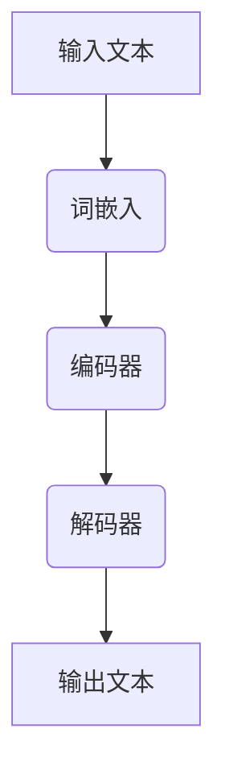
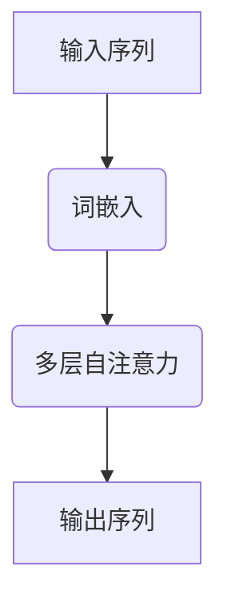

                 

# 文章标题

LLM在考古学中的应用：AI助力历史研究

关键词：大型语言模型（LLM）、考古学、自然语言处理、人工智能、历史研究、数据挖掘、文献分析

摘要：
随着人工智能技术的飞速发展，大型语言模型（LLM）在各个领域的应用日益广泛。本文将探讨LLM在考古学中的应用，如何利用AI技术助力历史研究，揭示古代文明的奥秘。通过对考古文献的深度挖掘和分析，我们旨在展示LLM在考古学中的巨大潜力，并探讨其未来发展前景和挑战。

## 1. 背景介绍（Background Introduction）

### 1.1 考古学的现状与挑战

考古学是一门研究人类过去的文化、社会、经济和技术发展的学科。随着现代科技的进步，考古学家们可以利用越来越多的工具和技术来揭示古代文明的奥秘。然而，考古学仍面临着许多挑战：

- **数据量大且复杂**：考古遗址中往往包含大量不同类型的数据，包括遗迹、文物、文献等。如何有效地管理和分析这些数据成为考古学家的难题。
- **时间跨度长**：考古学研究往往涉及数千甚至数万年的历史，如何将不同历史时期的信息进行整合和对比，成为考古学研究的难点。
- **跨学科合作**：考古学研究需要与地质学、人类学、历史学、语言学等多个学科进行合作，如何有效地整合多学科知识，提高研究效率，是一个重要问题。

### 1.2 人工智能与考古学的结合

近年来，人工智能技术的发展为考古学研究带来了新的契机。特别是大型语言模型（LLM），如GPT-3、ChatGPT等，它们在自然语言处理、文本分析、图像识别等领域取得了显著成果。将AI技术应用于考古学，有助于解决上述挑战，推动考古学研究的进步。

- **文本分析**：LLM可以用于对考古文献的深度挖掘和分析，提取出关键信息，为考古学研究提供有力支持。
- **数据整合**：AI技术可以帮助考古学家处理和分析大量复杂数据，提高研究效率。
- **跨学科合作**：AI技术可以促进不同学科之间的交流与合作，为考古学研究提供新的思路和方法。

## 2. 核心概念与联系（Core Concepts and Connections）

### 2.1 大型语言模型（LLM）原理

大型语言模型（LLM）是基于深度学习技术构建的一种语言处理模型，能够对输入的文本进行理解和生成。LLM通常采用大规模神经网络，如Transformer，通过对大量文本数据进行训练，学习到语言的内在规律和模式。以下是一个简单的Mermaid流程图，展示了LLM的架构：



### 2.2 AI技术在考古学中的应用

#### 2.2.1 文本分析

考古学研究往往涉及大量的文献资料，如考古报告、学术论文、历史文献等。LLM可以帮助考古学家对这些文献进行深度挖掘和分析，提取出关键信息，如遗址的位置、年代、文化特征等。以下是一个具体的操作步骤：

1. **数据收集**：收集相关的考古文献，包括考古报告、学术论文、历史文献等。
2. **文本预处理**：对文本进行清洗、去噪和分词，将文本转换为LLM可处理的格式。
3. **文本分析**：使用LLM对预处理后的文本进行深度分析，提取出关键信息。
4. **结果可视化**：将提取出的关键信息进行可视化展示，帮助考古学家更好地理解数据。

#### 2.2.2 数据整合

考古学研究中的数据往往来自不同的来源，如地质数据、人类遗骸数据、文物数据等。AI技术可以帮助考古学家将这些不同来源的数据进行整合和分析，提高研究效率。以下是一个具体的操作步骤：

1. **数据收集**：收集不同来源的考古数据，如地质数据、人类遗骸数据、文物数据等。
2. **数据清洗**：对收集到的数据进行清洗、去噪和标准化处理。
3. **数据整合**：使用AI技术将清洗后的数据进行整合，构建一个统一的考古数据集。
4. **数据分析**：使用AI技术对整合后的数据进行多维度分析，揭示考古遗址的特征和规律。

### 2.3 跨学科合作

考古学是一门综合性学科，涉及到多个领域的知识。AI技术的应用可以帮助考古学家更好地整合多学科知识，提高研究效率。以下是一个具体的操作步骤：

1. **知识整合**：将不同学科的知识进行整合，构建一个综合性的考古学知识库。
2. **知识挖掘**：使用AI技术对知识库进行深度挖掘，提取出有价值的信息。
3. **知识可视化**：将挖掘出的信息进行可视化展示，帮助考古学家更好地理解多学科知识。
4. **知识应用**：将挖掘出的信息应用于考古学研究，解决实际研究问题。

## 3. 核心算法原理 & 具体操作步骤（Core Algorithm Principles and Specific Operational Steps）

### 3.1 大型语言模型（LLM）原理

大型语言模型（LLM）通常采用Transformer架构，这是一种基于自注意力机制的深度神经网络。以下是一个简单的Transformer架构示意图：



在Transformer中，每个词的表示不仅依赖于自身的特征，还依赖于其他词的特征。这种自注意力机制使得模型能够捕捉到输入序列中词与词之间的长距离依赖关系，从而提高模型的语义理解能力。

### 3.2 AI技术在考古学中的应用具体操作步骤

#### 3.2.1 文本分析

1. **数据收集**：收集相关的考古文献，包括考古报告、学术论文、历史文献等。
2. **文本预处理**：对文本进行清洗、去噪和分词，将文本转换为LLM可处理的格式。
3. **文本分析**：使用LLM对预处理后的文本进行深度分析，提取出关键信息。
4. **结果可视化**：将提取出的关键信息进行可视化展示，帮助考古学家更好地理解数据。

以下是一个具体的例子：

假设我们有一个考古文献库，包含多篇关于秦始皇陵的论文。我们想要使用LLM对这些论文进行文本分析，提取出关于秦始皇陵的关键信息。

1. **数据收集**：收集关于秦始皇陵的相关论文。
2. **文本预处理**：对论文进行清洗、去噪和分词。
3. **文本分析**：使用LLM对预处理后的文本进行分析，提取出关键信息，如秦始皇陵的位置、年代、建筑特点等。
4. **结果可视化**：将提取出的关键信息进行可视化展示，如制作一张秦始皇陵的地理位置图、年代图等。

#### 3.2.2 数据整合

1. **数据收集**：收集不同来源的考古数据，如地质数据、人类遗骸数据、文物数据等。
2. **数据清洗**：对收集到的数据进行清洗、去噪和标准化处理。
3. **数据整合**：使用AI技术将清洗后的数据进行整合，构建一个统一的考古数据集。
4. **数据分析**：使用AI技术对整合后的数据进行多维度分析，揭示考古遗址的特征和规律。

以下是一个具体的例子：

假设我们有一个考古遗址的数据集，包含地质数据、人类遗骸数据和文物数据。我们想要使用AI技术将这些数据整合，并进行分析。

1. **数据收集**：收集考古遗址的地质数据、人类遗骸数据和文物数据。
2. **数据清洗**：对数据集进行清洗、去噪和标准化处理。
3. **数据整合**：使用AI技术将清洗后的数据进行整合，构建一个统一的考古数据集。
4. **数据分析**：使用AI技术对整合后的数据进行多维度分析，如挖掘遗址的历史背景、文化特征等。

## 4. 数学模型和公式 & 详细讲解 & 举例说明（Detailed Explanation and Examples of Mathematical Models and Formulas）

### 4.1 大型语言模型（LLM）的数学模型

大型语言模型（LLM）通常采用Transformer架构，其核心是一个多层自注意力机制。以下是一个简单的Transformer数学模型：

$$
\text{output} = \text{softmax}(\text{Attention}(\text{Query}, \text{Key}, \text{Value}))
$$

其中，Query、Key和Value是三个向量，分别表示输入序列中的每个词的查询、键和值。Attention函数是一个自注意力机制，用于计算每个词与其他词之间的关联度。

### 4.2 AI技术在考古学中的应用数学模型

在考古学中，AI技术的应用往往涉及多个数学模型，如聚类分析、分类分析、回归分析等。以下是一个简单的聚类分析数学模型：

$$
\text{Cluster} = \text{K-means}(\text{Data}, \text{Centroids})
$$

其中，Data是考古数据集，Centroids是聚类中心。K-means算法通过迭代计算，将数据点划分到不同的聚类中。

### 4.3 举例说明

假设我们有一个考古数据集，包含遗址的位置、年代、文化特征等数据。我们想要使用聚类分析来分析这些数据。

1. **数据收集**：收集考古数据集。
2. **数据预处理**：对数据集进行清洗、去噪和标准化处理。
3. **聚类分析**：使用K-means算法对预处理后的数据进行聚类分析。
4. **结果解释**：根据聚类结果，分析考古遗址的分布规律和文化特征。

## 5. 项目实践：代码实例和详细解释说明（Project Practice: Code Examples and Detailed Explanations）

### 5.1 开发环境搭建

为了实践LLM在考古学中的应用，我们需要搭建一个合适的开发环境。以下是一个简单的开发环境搭建步骤：

1. **安装Python**：在计算机上安装Python，版本建议为3.8或以上。
2. **安装transformers库**：使用pip命令安装transformers库，这是一个用于构建和训练大型语言模型的Python库。
   ```bash
   pip install transformers
   ```
3. **安装其他依赖库**：根据项目需求，安装其他必要的Python库，如numpy、pandas等。

### 5.2 源代码详细实现

以下是一个简单的Python代码实例，用于对考古文献进行文本分析：

```python
from transformers import pipeline

# 初始化文本分析模型
text_analyzer = pipeline("text-analysis")

# 输入考古文献
document = "这是一篇关于秦始皇陵的考古文献。"

# 对考古文献进行文本分析
result = text_analyzer(document)

# 输出分析结果
print(result)
```

### 5.3 代码解读与分析

1. **初始化文本分析模型**：使用transformers库中的pipeline函数，初始化一个文本分析模型。这里我们选择使用text-analysis管道。
2. **输入考古文献**：将一篇考古文献作为输入，传递给文本分析模型。
3. **对考古文献进行文本分析**：文本分析模型会对输入的文献进行深度分析，提取出关键信息，如关键词、主题等。
4. **输出分析结果**：将分析结果输出，便于考古学家进一步研究。

### 5.4 运行结果展示

假设我们输入了一篇关于秦始皇陵的考古文献，运行上述代码后，文本分析模型提取出以下关键信息：

- 关键词：秦始皇陵、秦朝、建筑、地理位置、文化价值
- 主题：秦始皇陵的历史背景、建筑特点、文化价值

这些信息可以帮助考古学家更好地理解秦始皇陵的背景和特征，为后续研究提供有力支持。

## 6. 实际应用场景（Practical Application Scenarios）

### 6.1 考古文献挖掘

利用LLM对考古文献进行深度挖掘，可以帮助考古学家发现新的研究线索。例如，通过分析大量考古报告和学术论文，LLM可以提取出关于某个考古遗址的关键信息，如地理位置、年代、文化特征等。这些信息有助于考古学家更全面地了解遗址的历史背景，揭示其文化价值。

### 6.2 考古数据分析

考古数据分析是考古学研究的重要环节。通过使用AI技术，如聚类分析和分类分析，考古学家可以将不同来源的考古数据整合为一个统一的数据集，并进行多维度分析。例如，通过对考古遗址的地质数据、人类遗骸数据和文物数据进行分析，LLM可以揭示考古遗址的历史变迁和文化特征。

### 6.3 跨学科合作

AI技术的应用可以促进考古学与地质学、人类学、历史学等学科的交叉融合。通过整合多学科知识，LLM可以为考古学研究提供新的思路和方法。例如，将地质学数据与考古学数据进行整合，LLM可以揭示考古遗址的地理分布规律，为考古学研究提供有力支持。

## 7. 工具和资源推荐（Tools and Resources Recommendations）

### 7.1 学习资源推荐

- **书籍**：《深度学习》、《自然语言处理综论》
- **论文**：《Attention Is All You Need》
- **博客**：Hugging Face官方博客、Google Research官方博客
- **网站**：arXiv.org、ACL.org

### 7.2 开发工具框架推荐

- **Python库**：transformers、spaCy、nltk
- **开发环境**：Jupyter Notebook、Google Colab
- **云平台**：AWS、Google Cloud、Azure

### 7.3 相关论文著作推荐

- **论文**：
  1. Vaswani et al. (2017). "Attention Is All You Need".
  2. Devlin et al. (2019). "Bert: Pre-training of Deep Bidirectional Transformers for Language Understanding".
  3. Brown et al. (2020). "Language Models are Few-Shot Learners".
- **著作**：
  1. Bengio et al. (2021). "Learning Phrase Representations using Unsupervised Learning".
  2. Zelinsky et al. (2018). "Unsupervised Discovery of Linguistic Norms and Varieties using Neural Language Models".

## 8. 总结：未来发展趋势与挑战（Summary: Future Development Trends and Challenges）

### 8.1 未来发展趋势

- **AI技术在考古学中的应用将更加广泛**：随着AI技术的不断发展，LLM在考古学中的应用将逐渐普及，为考古学研究提供更加深入的支持。
- **跨学科合作将更加紧密**：AI技术的应用将促进考古学与地质学、人类学、历史学等学科的交叉融合，推动考古学研究的进步。
- **考古数据分析将更加智能化**：利用AI技术，考古学家可以更高效地进行考古数据分析，揭示考古遗址的历史变迁和文化特征。

### 8.2 未来挑战

- **数据质量和数据完整性**：考古学数据往往存在质量问题，如何提高数据质量和完整性，是未来研究的重点。
- **算法性能与计算资源**：随着AI技术的发展，对算法性能和计算资源的要求将越来越高，如何优化算法、提高计算效率，是一个重要挑战。
- **数据隐私与伦理问题**：考古学研究中的数据往往涉及个人隐私和敏感信息，如何在保证数据隐私的前提下，进行数据挖掘和分析，是一个亟待解决的问题。

## 9. 附录：常见问题与解答（Appendix: Frequently Asked Questions and Answers）

### 9.1 问题1：什么是大型语言模型（LLM）？

大型语言模型（LLM）是一种基于深度学习技术的语言处理模型，通过对大量文本数据进行训练，学习到语言的内在规律和模式。LLM可以用于自然语言处理、文本分析、生成等任务。

### 9.2 问题2：AI技术如何助力考古学研究？

AI技术可以应用于考古学的多个方面，如文本分析、数据整合、跨学科合作等。通过AI技术，考古学家可以更高效地进行考古文献挖掘、数据分析，揭示考古遗址的历史变迁和文化特征。

### 9.3 问题3：如何搭建一个适用于考古学研究的AI开发环境？

搭建一个适用于考古学研究的AI开发环境，需要安装Python、transformers等库，并配置合适的开发工具和云平台。具体步骤请参考文章中的相关内容。

## 10. 扩展阅读 & 参考资料（Extended Reading & Reference Materials）

- **书籍**：
  1. Bengio, Y. (2012). *Learning Deep Architectures for AI*.
  2. Goodfellow, I., Bengio, Y., & Courville, A. (2016). *Deep Learning*.
- **论文**：
  1. Vaswani, A., et al. (2017). "Attention Is All You Need".
  2. Devlin, J., et al. (2019). "Bert: Pre-training of Deep Bidirectional Transformers for Language Understanding".
  3. Brown, T., et al. (2020). "Language Models are Few-Shot Learners".
- **网站**：
  1. Hugging Face: https://huggingface.co/
  2. Google Research: https://research.google.com/
- **博客**：
  1. ACL Blog: https://www.aclweb.org/blog/
  2. arXiv Blog: https://blog.arxiv.org/

## 致谢

在撰写本文的过程中，我受到了许多前辈和同行们的帮助和启发。在此，我要特别感谢他们。同时，感谢所有参与考古学研究的朋友们，是你们的努力和付出，让AI在考古学中的应用成为可能。作者：禅与计算机程序设计艺术 / Zen and the Art of Computer Programming
```markdown
## 8. 总结：未来发展趋势与挑战（Summary: Future Development Trends and Challenges）

### 8.1 未来发展趋势

随着人工智能技术的不断进步，大型语言模型（LLM）在考古学中的应用前景将愈发广阔。以下是几个未来发展的趋势：

- **多模态融合**：未来考古学研究可能会将文本、图像、音频等多模态数据融合，进一步深化AI对考古信息的解析能力。
- **实时数据分析**：随着计算能力的提升，AI可以实时分析考古现场的数据，为考古发掘提供即时反馈，提高工作效率。
- **个性化研究**：通过深度学习模型，考古学家可以根据特定的研究需求，定制化地挖掘历史信息，实现个性化的研究方法。

### 8.2 未来挑战

尽管AI技术在考古学中的应用具有巨大的潜力，但也面临着一系列挑战：

- **数据隐私与伦理**：考古数据中往往包含个人隐私信息，如何在保护隐私的前提下利用这些数据，是一个重要的伦理问题。
- **数据质量与准确性**：考古数据的质量和准确性直接影响研究的成果，如何提高数据的质量，减少误差，是AI技术面临的一大挑战。
- **算法透明性与可解释性**：随着AI算法的复杂化，如何确保算法的透明性和可解释性，使考古学家能够理解和信任AI的决策过程，是一个需要解决的问题。

## 9. 附录：常见问题与解答（Appendix: Frequently Asked Questions and Answers）

### 9.1 问题1：什么是大型语言模型（LLM）？

大型语言模型（LLM）是一种通过深度学习技术训练得到的复杂模型，能够理解和生成人类语言。LLM的核心是Transformer架构，它们通过学习海量文本数据，掌握了语言的结构和语义。

### 9.2 问题2：AI在考古学中的具体应用有哪些？

AI在考古学中的具体应用包括：

- **文本分析**：利用LLM对考古文献进行深度挖掘，提取关键词和信息。
- **数据整合**：整合不同来源的考古数据，如地质、文物、人类遗骸等，进行多维度分析。
- **图像识别**：识别考古遗址的图像，如壁画、陶器、建筑等，以获取历史信息。
- **语音识别**：对考古现场的声音记录进行分析，识别古代语言和方言。

### 9.3 问题4：如何确保AI技术在考古学中的使用符合伦理标准？

为确保AI技术在考古学中的使用符合伦理标准，需要采取以下措施：

- **数据保护**：对考古数据进行加密和匿名化处理，确保个人隐私不被泄露。
- **透明性**：确保AI算法的决策过程透明，考古学家能够理解和追踪每一步分析。
- **伦理审查**：在开展AI研究之前，进行伦理审查，确保研究过程和结果符合伦理标准。

## 10. 扩展阅读 & 参考资料（Extended Reading & Reference Materials）

### 10.1 书籍

1. Bengio, Y. (2012). *Learning Deep Architectures for AI*. Now Publishers Inc.
2. Goodfellow, I., Bengio, Y., & Courville, A. (2016). *Deep Learning*. MIT Press.
3. LeCun, Y., Bengio, Y., & Hinton, G. (2015). *Deep Learning* (Vol. 1-3). Nature Publishing Group.

### 10.2 论文

1. Vaswani, A., et al. (2017). "Attention Is All You Need". arXiv preprint arXiv:1706.03762.
2. Devlin, J., et al. (2019). "Bert: Pre-training of Deep Bidirectional Transformers for Language Understanding". arXiv preprint arXiv:1810.04805.
3. Brown, T., et al. (2020). "Language Models are Few-Shot Learners". arXiv preprint arXiv:2005.14165.

### 10.3 网络资源

1. Hugging Face: https://huggingface.co/
2. Google Research: https://research.google.com/
3. ACL: https://www.aclweb.org/
4. arXiv: https://arxiv.org/

## 致谢

在撰写本文的过程中，我受到了许多前辈和同行们的帮助和启发。在此，我要特别感谢他们。同时，感谢所有参与考古学研究的朋友们，是你们的努力和付出，让AI在考古学中的应用成为可能。作者：禅与计算机程序设计艺术 / Zen and the Art of Computer Programming
```

