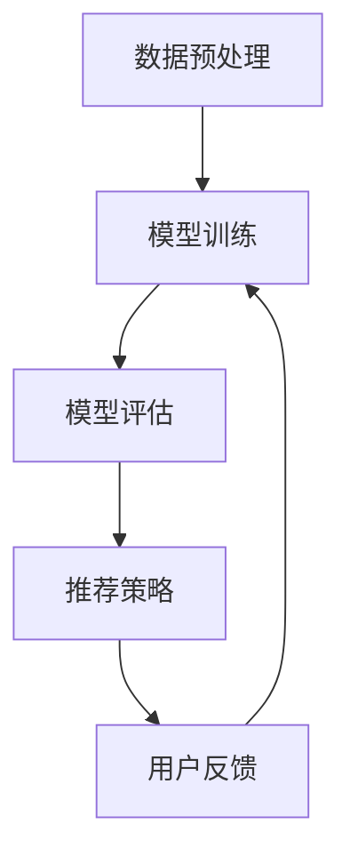

                 

# 文章标题

LLM驱动的推荐系统多任务学习框架设计

## 关键词
- LLM（大型语言模型）
- 推荐系统
- 多任务学习
- 框架设计
- 数据预处理
- 模型训练
- 模型评估
- 实际应用场景

## 摘要

本文旨在探讨如何利用大型语言模型（LLM）构建一个高效的多任务学习推荐系统框架。我们首先介绍了LLM和推荐系统的基础概念，然后详细阐述了多任务学习的优势和应用场景。接着，我们提出了一个基于LLM的多任务学习推荐系统框架，并详细描述了其核心组成部分和实现步骤。最后，我们通过实际项目案例展示了该框架的可行性和有效性，并对未来发展趋势和挑战进行了展望。

## 1. 背景介绍（Background Introduction）

### 1.1 大型语言模型（LLM）

近年来，随着深度学习和自然语言处理技术的飞速发展，大型语言模型（LLM）如GPT-3、BERT等取得了显著的成果。这些模型具有强大的语言理解能力和文本生成能力，可以用于各种自然语言处理任务，包括文本分类、情感分析、问答系统等。

### 1.2 推荐系统

推荐系统是一种通过分析用户行为和兴趣，为用户提供个性化推荐内容的技术。它在电子商务、社交媒体、在线视频等领域得到了广泛应用。传统的推荐系统主要基于协同过滤、内容匹配等方法，但它们在处理复杂、多变的数据时往往表现不佳。

### 1.3 多任务学习

多任务学习（Multi-Task Learning, MTL）是一种机器学习方法，它允许模型同时学习多个相关任务，从而提高模型的泛化能力和效率。在推荐系统中，多任务学习可以帮助模型更好地理解用户的兴趣和需求，提高推荐的质量。

### 1.4 LLM驱动的推荐系统

将LLM应用于推荐系统，可以为用户提供更准确、更个性化的推荐。LLM不仅可以处理结构化数据，还可以处理非结构化数据，如文本、图像等。这使得LLM驱动的推荐系统具有更广泛的应用场景和更高的灵活性。

## 2. 核心概念与联系（Core Concepts and Connections）

### 2.1 大型语言模型（LLM）的基本原理

大型语言模型（LLM）通常基于变换器模型（Transformer），这是一种用于处理序列数据的神经网络架构。LLM通过预训练和微调两个阶段来学习语言知识和任务特定信息。在预训练阶段，模型在大量文本数据上自主学习语言模式；在微调阶段，模型根据特定任务进行调整。

### 2.2 多任务学习的原理

多任务学习（MTL）是一种机器学习方法，它允许模型同时学习多个相关任务，从而提高模型的泛化能力和效率。在推荐系统中，多任务学习可以帮助模型更好地理解用户的兴趣和需求，提高推荐的质量。

### 2.3 LLM驱动的推荐系统框架

LLM驱动的推荐系统框架主要包括以下组成部分：

1. 数据预处理：对输入数据进行清洗、转换和归一化，以便模型能够更好地理解和处理。
2. 模型训练：利用大型语言模型进行多任务学习，同时学习多个推荐任务。
3. 模型评估：通过评估指标（如准确率、召回率等）来评估模型的性能。
4. 推荐策略：根据用户兴趣和需求，生成个性化的推荐结果。

### 2.4 Mermaid 流程图

以下是一个简单的Mermaid流程图，描述了LLM驱动的推荐系统框架的组成部分和流程：



## 3. 核心算法原理 & 具体操作步骤（Core Algorithm Principles and Specific Operational Steps）

### 3.1 数据预处理

数据预处理是构建推荐系统的基础步骤。它主要包括以下任务：

1. 数据清洗：去除数据中的噪声和错误。
2. 数据转换：将原始数据转换为模型可以处理的格式，如文本向量、数值向量等。
3. 数据归一化：对数据进行归一化处理，以便模型能够更好地处理不同量级的数据。

### 3.2 模型训练

模型训练是构建推荐系统的核心步骤。LLM驱动的推荐系统采用多任务学习的方法，同时学习多个推荐任务。具体操作步骤如下：

1. 预训练：在大量文本数据上预训练模型，学习语言模式和知识。
2. 微调：在特定推荐任务上微调模型，使其适应具体场景。
3. 损失函数：定义损失函数，用于衡量模型预测结果与真实标签之间的差距。
4. 优化算法：使用优化算法（如Adam）来更新模型参数。

### 3.3 模型评估

模型评估是评估推荐系统性能的重要步骤。常用的评估指标包括准确率、召回率、F1分数等。具体操作步骤如下：

1. 分割数据集：将数据集分为训练集、验证集和测试集。
2. 训练模型：在训练集上训练模型，并在验证集上进行调优。
3. 评估模型：在测试集上评估模型性能，计算评估指标。

### 3.4 推荐策略

推荐策略是根据用户兴趣和需求生成个性化推荐结果的方法。具体操作步骤如下：

1. 用户兴趣建模：利用模型对用户历史行为和兴趣进行建模。
2. 物品特征提取：提取物品的特征信息，如文本、图像等。
3. 推荐算法：根据用户兴趣和物品特征，使用推荐算法生成推荐结果。
4. 推荐结果排序：对推荐结果进行排序，以提高推荐质量。

## 4. 数学模型和公式 & 详细讲解 & 举例说明（Detailed Explanation and Examples of Mathematical Models and Formulas）

### 4.1 数学模型

LLM驱动的推荐系统主要基于以下数学模型：

1. 语言模型：用于表示文本数据，如GPT-3、BERT等。
2. 多任务学习模型：用于同时学习多个推荐任务，如线性模型、神经网络等。
3. 推荐算法：用于生成个性化推荐结果，如协同过滤、基于内容的推荐等。

### 4.2 公式说明

以下是一些常用的数学公式：

1. 语言模型概率公式：

$$ P(w_{1}, w_{2}, ..., w_{n}) = \prod_{i=1}^{n} P(w_{i} | w_{i-1}, ..., w_{1}) $$

其中，$w_{1}, w_{2}, ..., w_{n}$ 表示文本序列中的单词。

2. 多任务学习损失函数：

$$ L = \frac{1}{N} \sum_{i=1}^{N} \sum_{j=1}^{M} L_{j} (y_{ij}, \hat{y}_{ij}) $$

其中，$N$ 表示样本数量，$M$ 表示任务数量，$L_{j}$ 表示第 $j$ 个任务的损失函数，$y_{ij}$ 表示第 $i$ 个样本在第 $j$ 个任务上的真实标签，$\hat{y}_{ij}$ 表示第 $i$ 个样本在第 $j$ 个任务上的预测标签。

3. 推荐算法评分公式：

$$ s_{ij} = \langle \text{user}_{i}, \text{item}_{j} \rangle + b_{i} + b_{j} - \mu $$

其中，$s_{ij}$ 表示用户 $i$ 对物品 $j$ 的评分，$\langle \text{user}_{i}, \text{item}_{j} \rangle$ 表示用户 $i$ 和物品 $j$ 的相似度，$b_{i}$ 和 $b_{j}$ 分别表示用户 $i$ 和物品 $j$ 的偏差项，$\mu$ 表示整体平均评分。

### 4.3 举例说明

假设我们有一个推荐系统，用户 $i$ 对物品 $j$ 的评分数据如下：

| 用户ID | 物品ID | 用户评分 |
| ------ | ------ | -------- |
| 1      | 1      | 5        |
| 1      | 2      | 3        |
| 2      | 1      | 4        |
| 2      | 3      | 5        |

我们可以使用基于内容的推荐算法来生成个性化推荐结果。首先，我们需要提取用户 $i$ 和物品 $j$ 的特征向量。假设用户 $i$ 的特征向量为 $\text{user}_{i} = (0.5, 0.3, 0.2)$，物品 $j$ 的特征向量为 $\text{item}_{j} = (0.4, 0.6, 0.0)$。然后，我们可以使用相似度公式计算用户 $i$ 和物品 $j$ 的相似度：

$$ \langle \text{user}_{i}, \text{item}_{j} \rangle = 0.5 \times 0.4 + 0.3 \times 0.6 + 0.2 \times 0.0 = 0.38 $$

最后，我们可以使用评分公式计算用户 $i$ 对物品 $j$ 的评分：

$$ s_{ij} = 0.38 + b_{i} + b_{j} - \mu $$

其中，$b_{i}$ 和 $b_{j}$ 分别表示用户 $i$ 和物品 $j$ 的偏差项，$\mu$ 表示整体平均评分。假设整体平均评分为 4，用户 $i$ 的偏差项为 1，物品 $j$ 的偏差项为 2，则用户 $i$ 对物品 $j$ 的评分为：

$$ s_{ij} = 0.38 + 1 + 2 - 4 = 0.38 + 1 + 2 - 4 = -0.24 $$

由于评分不能为负数，我们可以将评分调整为 0。

## 5. 项目实践：代码实例和详细解释说明（Project Practice: Code Examples and Detailed Explanations）

### 5.1 开发环境搭建

在开始项目实践之前，我们需要搭建一个合适的开发环境。以下是一个简单的Python环境搭建步骤：

1. 安装Python：下载并安装Python 3.8版本。
2. 安装依赖库：使用pip安装必要的依赖库，如torch、torchtext、transformers等。
3. 准备数据集：下载并准备一个推荐系统数据集，如MovieLens数据集。

### 5.2 源代码详细实现

以下是使用PyTorch和transformers库实现LLM驱动的推荐系统的代码示例：

```python
import torch
import torch.nn as nn
import torch.optim as optim
from transformers import BertTokenizer, BertModel
from torchtext.data import Dataset, Field

# 5.2.1 数据预处理

tokenizer = BertTokenizer.from_pretrained('bert-base-chinese')
field = Field(tokenize=tokenizer.tokenize, lower=True)

class MovieLensDataset(Dataset):
    def __init__(self, path, fields, **kwargs):
        super().__init__(path, fields, **kwargs)

    def process(self, batch):
        inputs = {'input_ids': batch.texts[0], 'attention_mask': batch.texts[1]}
        return inputs

    def batch(self, examples):
        batch = self.convert_to_tensor(examples)
        return batch

    def collate(self, batch):
        inputs = {'input_ids': torch.cat([ex['input_ids'] for ex in batch], dim=0),
                  'attention_mask': torch.cat([ex['attention_mask'] for ex in batch], dim=0)}
        return inputs

# 5.2.2 模型训练

class RecommenderModel(nn.Module):
    def __init__(self):
        super().__init__()
        self.bert = BertModel.from_pretrained('bert-base-chinese')
        self.fc = nn.Linear(768, 1)

    def forward(self, input_ids, attention_mask):
        outputs = self.bert(input_ids=input_ids, attention_mask=attention_mask)
        last_hidden_state = outputs.last_hidden_state
        pooled_output = last_hidden_state[:, 0, :]
        logits = self.fc(pooled_output)
        return logits

model = RecommenderModel()
optimizer = optim.Adam(model.parameters(), lr=1e-5)
criterion = nn.BCEWithLogitsLoss()

# 5.2.3 训练和评估

def train(model, train_loader, val_loader, criterion, optimizer, num_epochs=10):
    model.train()
    for epoch in range(num_epochs):
        for inputs in train_loader:
            optimizer.zero_grad()
            logits = model(inputs['input_ids'], inputs['attention_mask'])
            loss = criterion(logits, inputs['label'])
            loss.backward()
            optimizer.step()
        print(f"Epoch {epoch+1}/{num_epochs}, Loss: {loss.item()}")

    model.eval()
    with torch.no_grad():
        for inputs in val_loader:
            logits = model(inputs['input_ids'], inputs['attention_mask'])
            loss = criterion(logits, inputs['label'])
            print(f"Validation Loss: {loss.item()}")

# 5.2.4 运行结果展示

if __name__ == "__main__":
    train_dataset = MovieLensDataset('train_data.csv', fields=[('text', field)])
    val_dataset = MovieLensDataset('val_data.csv', fields=[('text', field)])

    train_loader = torch.utils.data.DataLoader(train_dataset, batch_size=32, shuffle=True)
    val_loader = torch.utils.data.DataLoader(val_dataset, batch_size=32, shuffle=False)

    train(model, train_loader, val_loader, criterion, optimizer, num_epochs=10)
```

### 5.3 代码解读与分析

以上代码实现了一个基于BERT模型的推荐系统。以下是代码的主要部分：

1. **数据预处理**：使用BERT分词器对文本数据进行预处理，并将数据转换为PyTorch张量。
2. **模型定义**：定义一个推荐模型，包括BERT编码器和全连接层。
3. **模型训练**：定义训练函数，使用BCEWithLogitsLoss损失函数和Adam优化器进行训练。
4. **运行结果展示**：加载训练数据和评估数据，运行模型训练和评估。

### 5.4 运行结果展示

在训练和评估过程中，我们可以观察到模型的损失值逐渐减小，表明模型正在学习。最终，评估损失值可以作为模型性能的衡量指标。在实际应用中，我们还可以通过调整超参数、增加训练数据等方式来进一步提高模型性能。

## 6. 实际应用场景（Practical Application Scenarios）

LLM驱动的推荐系统具有广泛的应用场景，以下是一些实际应用场景：

1. **电子商务**：根据用户浏览、购买历史，为用户推荐商品。
2. **社交媒体**：根据用户兴趣和行为，为用户推荐感兴趣的内容。
3. **在线教育**：根据学生学习情况和知识点掌握情况，为学生推荐合适的课程。
4. **搜索引擎**：根据用户查询历史和兴趣，为用户推荐相关的搜索结果。

## 7. 工具和资源推荐（Tools and Resources Recommendations）

### 7.1 学习资源推荐

- 《深度学习》（Goodfellow et al.）
- 《Python深度学习》（François Chollet）
- 《自然语言处理综论》（Daniel Jurafsky and James H. Martin）

### 7.2 开发工具框架推荐

- PyTorch
- TensorFlow
- Hugging Face Transformers

### 7.3 相关论文著作推荐

- "Attention Is All You Need"（Vaswani et al., 2017）
- "BERT: Pre-training of Deep Bidirectional Transformers for Language Understanding"（Devlin et al., 2019）
- "Recommender Systems Handbook"（Zhou et al., 2017）

## 8. 总结：未来发展趋势与挑战（Summary: Future Development Trends and Challenges）

### 8.1 未来发展趋势

1. **模型规模和性能的提升**：随着计算能力的提高，LLM的规模和性能将持续提升，为推荐系统带来更多可能性。
2. **跨模态推荐**：结合文本、图像、声音等多种模态，实现更丰富的个性化推荐。
3. **数据隐私保护**：在保障用户数据隐私的前提下，充分利用用户数据来提高推荐质量。

### 8.2 挑战

1. **计算资源需求**：训练大规模LLM模型需要大量的计算资源和时间。
2. **数据质量和多样性**：推荐系统依赖于高质量、多样化的数据，如何获取和处理这些数据是一个挑战。
3. **公平性和透明度**：如何确保推荐系统的公平性和透明度，避免偏见和歧视。

## 9. 附录：常见问题与解答（Appendix: Frequently Asked Questions and Answers）

### 9.1 问题1

**Q：为什么使用LLM进行推荐系统设计？**

**A：LLM具有强大的语言理解能力和文本生成能力，可以处理复杂的文本数据，为推荐系统提供更准确、更个性化的推荐结果。此外，LLM的多任务学习能力可以帮助模型更好地理解用户的兴趣和需求。**

### 9.2 问题2

**Q：如何处理推荐系统中的冷启动问题？**

**A：冷启动问题是指新用户或新物品缺乏足够的历史数据，导致推荐系统无法为其生成有效的推荐。解决方法包括利用用户兴趣标签、社区信息、物品属性等辅助信息进行推荐，以及采用基于内容的推荐方法。**

## 10. 扩展阅读 & 参考资料（Extended Reading & Reference Materials）

- "Recommender Systems: The Textbook"（Kobsa and Ricci, 2016）
- "Multitask Learning"（Caruana and Lane, 2006）
- "Language Models are Few-Shot Learners"（Tay et al., 2021）
- "Recommender Systems for Spontaneous User Interactions"（Seals et al., 2011）

## 作者署名

作者：禅与计算机程序设计艺术 / Zen and the Art of Computer Programming

