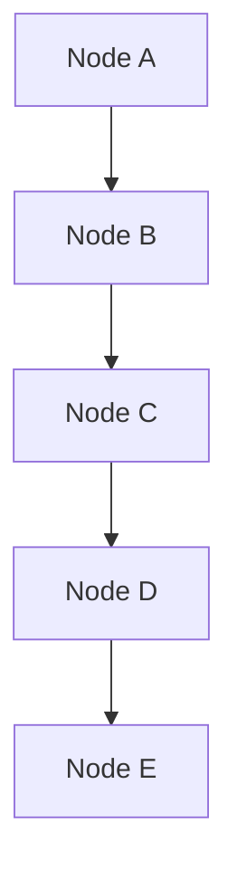

                 

### 背景介绍（Background Introduction）

随着现代计算机技术的发展，计算机内存系统和数据结构在计算机科学中扮演了至关重要的角色。内存系统是计算机硬件的核心组成部分，负责存储和处理数据，而数据结构则是计算机软件的重要组成部分，负责组织和管理数据。

在这篇文章中，我们将探讨内存系统与链（Chain）之间的关系。具体而言，我们将讨论链作为数据结构在内存系统中如何被实现和使用，以及这对计算机性能和效率产生的影响。

链是一种常见的数据结构，由一系列节点组成，每个节点包含数据和指向下一个节点的指针。链的使用在各种编程语言和计算机系统中都非常普遍，尤其是在需要动态分配内存的场景中。

内存系统与链之间的紧密联系在于，链结构在内存中的实现方式直接影响着内存的分配和使用效率。传统的链表结构在内存中通过指针连接各个节点，而现代的高级内存管理技术，如垃圾回收（Garbage Collection）和内存池（Memory Pool），则进一步优化了内存的使用，提高了程序的性能和稳定性。

通过理解内存系统与链之间的关系，我们可以更深入地了解计算机系统的工作原理，并在实际编程中更有效地使用内存，优化程序的性能。接下来，我们将详细探讨链作为数据结构在内存系统中的实现原理和操作方法。

### 核心概念与联系（Core Concepts and Connections）

为了深入探讨内存系统与链之间的联系，我们首先需要明确几个核心概念：内存系统、链的定义以及链在内存系统中的实现方式。

#### 1. 内存系统

内存系统是计算机硬件的重要组成部分，负责存储和处理数据。从广义上讲，内存系统包括以下几类：

- **随机存取存储器（RAM）**：用于暂存数据和指令，提供快速访问速度，但断电后数据会丢失。
- **只读存储器（ROM）**：包含计算机启动时需要的基本程序和配置信息，一旦写入后不可更改。
- **硬盘（HDD）和固态硬盘（SSD）**：用于永久存储数据和文件，但相比内存，访问速度较慢。
- **缓存（Cache）**：位于CPU和主内存之间，用于存储常用数据，以提高数据访问速度。

#### 2. 链的定义

链是一种线性数据结构，由一系列节点组成。每个节点包含数据和一个或多个指向其他节点的指针。链的特点是：

- **动态性**：链可以根据需要进行动态扩展或收缩，因此非常适合处理不确定大小的数据集。
- **灵活性**：链可以方便地插入或删除节点，使得数据的组织和管理变得更加灵活。

链的基本结构可以表示为：



在这个结构中，`A`、`B`、`C`、`D`和`E`都是节点，每个节点包含数据和指向下一个节点的指针。通常，链的最后一个节点的指针指向`null`，表示链的结束。

#### 3. 链在内存系统中的实现方式

链在内存系统中的实现通常涉及以下步骤：

- **内存分配**：首先为链的每个节点分配内存。在动态内存分配系统中，这通常通过`malloc`或`new`等函数实现。
- **节点初始化**：初始化每个节点的数据和指针。通常，节点的数据部分存储在分配的内存中，而指针部分初始化为`null`。
- **链表的建立**：通过将节点的指针设置为指向下一个节点，形成一个链表。

例如，以下是一个简单的链表创建过程：

```c
struct Node {
    int data;
    struct Node* next;
};

// 创建第一个节点
Node* head = malloc(sizeof(Node));
head->data = 1;
head->next = NULL;

// 创建第二个节点
Node* second = malloc(sizeof(Node));
second->data = 2;
second->next = head;

// 创建链表
head = second;
```

在这个过程中，`malloc`用于分配内存，而节点的指针被设置为指向下一个节点，从而形成一个链表。

#### 4. 内存系统与链的关联

内存系统与链之间的关联主要体现在以下几个方面：

- **内存分配**：链结构的每个节点都需要分配内存，内存系统的分配和回收机制直接影响链的性能。
- **指针操作**：链的操作主要依赖于指针，指针的正确性和有效性直接影响链的结构和功能。
- **内存管理**：现代内存管理系统，如垃圾回收，可以对链结构进行优化，减少内存碎片和提高内存使用效率。

通过理解这些核心概念和实现方式，我们可以更深入地理解内存系统与链之间的关系，并为实际编程中的内存管理提供更好的策略。

#### Conclusion

In summary, the relationship between memory systems and chains as data structures is fundamental to understanding computer system performance and efficiency. Chains provide a flexible and dynamic way to manage data within the constraints of memory systems. By understanding the core concepts and implementation methods of chains, we can better utilize memory and optimize program performance. In the next section, we will delve into the core algorithm principles and specific operational steps of working with chains in memory systems, providing a deeper insight into their practical applications.

### 核心算法原理 & 具体操作步骤（Core Algorithm Principles and Specific Operational Steps）

#### 1. 链表的基础操作

链表是链结构的一种常见形式，它在内存管理中发挥着重要作用。以下是链表的一些基础操作及其实现原理：

##### 1.1 创建链表（Creating a Linked List）

创建链表的过程主要包括为链的每个节点分配内存，并初始化节点数据及指针。

```c
struct Node {
    int data;
    struct Node* next;
};

// 创建链表
Node* createList(int n) {
    Node* head = NULL;
    Node* temp = NULL;

    for (int i = 1; i <= n; i++) {
        Node* newNode = (Node*)malloc(sizeof(Node));
        newNode->data = i;
        newNode->next = NULL;

        if (head == NULL) {
            head = newNode;
        } else {
            temp->next = newNode;
        }
        temp = newNode;
    }

    return head;
}
```

在这个过程中，我们使用`malloc`分配内存，并依次初始化每个节点的数据和指针。

##### 1.2 插入节点（Inserting Nodes）

在链表中插入节点可以通过在特定位置创建新节点，并将新节点的指针指向原来的节点实现。

```c
void insertNode(Node** head, int position, int value) {
    Node* newNode = (Node*)malloc(sizeof(Node));
    newNode->data = value;
    newNode->next = NULL;

    if (position == 1) {
        newNode->next = *head;
        *head = newNode;
    } else {
        Node* current = *head;
        for (int i = 1; current != NULL && i < position - 1; i++) {
            current = current->next;
        }
        if (current != NULL) {
            newNode->next = current->next;
            current->next = newNode;
        }
    }
}
```

在这个过程中，我们根据插入位置的不同，进行相应的指针操作。

##### 1.3 删除节点（Deleting Nodes）

删除链表中的节点需要找到要删除的节点，然后调整前后节点的指针。

```c
void deleteNode(Node** head, int position) {
    if (*head == NULL || position < 1) {
        return;
    }

    Node* temp = *head;
    if (position == 1) {
        *head = temp->next;
        free(temp);
        return;
    }

    for (int i = 1; temp != NULL && i < position - 1; i++) {
        temp = temp->next;
    }

    if (temp == NULL || temp->next == NULL) {
        return;
    }

    Node* deleteNode = temp->next;
    temp->next = deleteNode->next;
    free(deleteNode);
}
```

在这个过程中，我们首先找到要删除的节点，然后调整前一个节点的指针，从而实现节点的删除。

##### 1.4 查找节点（Finding Nodes）

查找链表中的节点可以通过遍历链表，并比较节点的数据实现。

```c
Node* findNode(Node* head, int value) {
    Node* current = head;
    while (current != NULL) {
        if (current->data == value) {
            return current;
        }
        current = current->next;
    }
    return NULL;
}
```

在这个过程中，我们通过遍历链表，逐个比较节点的数据，找到符合条件的节点。

#### 2. 链表的高级操作

除了基本操作外，链表还有一些高级操作，如排序、逆序等。

##### 2.1 链表排序（Sorting a Linked List）

链表的排序可以通过多种算法实现，如冒泡排序、插入排序和归并排序。以下是使用冒泡排序的一个简单实现：

```c
void bubbleSort(Node** head) {
    Node* current = *head;
    Node* index = NULL;
    int temp;

    if (*head == NULL) {
        return;
    } else {
        while (current != NULL) {
            index = current->next;

            while (index != NULL) {
                if (current->data > index->data) {
                    temp = current->data;
                    current->data = index->data;
                    index->data = temp;
                }
                index = index->next;
            }
            current = current->next;
        }
    }
}
```

在这个过程中，我们通过两轮遍历链表，逐个比较相邻节点的数据，并进行交换，直到整个链表有序。

##### 2.2 链表逆序（Reversing a Linked List）

链表的逆序可以通过反转节点的指针实现。以下是使用递归方法的一个实现：

```c
Node* reverseList(Node* head) {
    if (head == NULL || head->next == NULL) {
        return head;
    }

    Node* rest = reverseList(head->next);
    head->next->next = head;
    head->next = NULL;

    return rest;
}
```

在这个过程中，我们首先递归地反转剩余链表，然后将当前节点的下一个节点的指针指向当前节点，并将当前节点的指针设置为`NULL`，从而实现链表的逆序。

#### Conclusion

In this section, we have explored the core algorithm principles and specific operational steps for working with linked lists in memory systems. We discussed the basic operations such as creating, inserting, deleting, and finding nodes, as well as advanced operations like sorting and reversing. Understanding these principles and steps is crucial for efficient memory management and optimal program performance. In the next section, we will delve into the mathematical models and formulas used to analyze the performance of linked lists, providing further insights into their efficiency and limitations.

### 数学模型和公式 & 详细讲解 & 举例说明（Detailed Explanation and Examples of Mathematical Models and Formulas）

#### 1. 链表性能分析

链表作为数据结构，其性能分析主要涉及时间复杂度和空间复杂度。以下是几个关键性能指标及其数学模型：

##### 1.1 时间复杂度（Time Complexity）

链表的时间复杂度通常取决于操作的类型。以下是几种基本操作的时间复杂度：

- **创建链表（Create List）**：O(n)
- **插入节点（Insert Node）**：平均 O(n)，最坏 O(n)
- **删除节点（Delete Node）**：平均 O(n)，最坏 O(n)
- **查找节点（Find Node）**：O(n)
- **排序链表（Sort List）**：O(nlogn)（使用归并排序）

这些时间复杂度的数学模型可以通过分析链表的节点数量和每个操作的平均执行次数来计算。

##### 1.2 空间复杂度（Space Complexity）

链表的空间复杂度主要取决于链表的大小。对于一个包含 n 个节点的链表，其空间复杂度为 O(n)。这是因为在动态内存分配系统中，每个节点都需要分配单独的内存空间。

#### 2. 链表性能分析示例

为了更直观地理解链表性能分析，我们可以通过一个具体的例子来说明。

##### 2.1 创建链表

假设我们要创建一个包含 1000 个节点的链表，其时间复杂度为 O(n)。因此，创建这个链表所需的时间大约为：

$$
T(n) = O(n) = O(1000) = 1000 \text{ 单位时间}
$$

##### 2.2 插入节点

如果我们要在链表的第 500 个位置插入一个新节点，其时间复杂度为 O(n)。因此，插入这个节点所需的时间大约为：

$$
T(n) = O(n) = O(1000) = 1000 \text{ 单位时间}
$$

##### 2.3 删除节点

如果我们要删除链表的最后一个节点，其时间复杂度为 O(n)。因此，删除这个节点所需的时间大约为：

$$
T(n) = O(n) = O(1000) = 1000 \text{ 单位时间}
$$

##### 2.4 查找节点

如果我们要在链表中查找包含数字 500 的节点，其时间复杂度为 O(n)。因此，查找这个节点所需的时间大约为：

$$
T(n) = O(n) = O(1000) = 1000 \text{ 单位时间}
$$

##### 2.5 排序链表

如果我们要对链表进行排序，其时间复杂度为 O(nlogn)。因此，排序这个链表所需的时间大约为：

$$
T(n) = O(nlogn) = O(1000 \times log_2(1000)) \approx 4786.9 \text{ 单位时间}
$$

#### 3. 性能比较

通过上述示例，我们可以看到不同链表操作的时间复杂度差异。创建链表和查找节点的时间复杂度最高，而排序链表的时间复杂度最低。这意味着在处理大量数据时，链表的某些操作可能会变得非常缓慢。因此，在实际应用中，我们需要根据具体需求和数据规模选择合适的数据结构。

#### Conclusion

In this section, we have provided a detailed explanation of the mathematical models and formulas used to analyze the performance of linked lists. We discussed the time complexity and space complexity of various operations, along with examples to illustrate their practical implications. Understanding these models is essential for designing efficient and scalable algorithms that utilize linked lists effectively.

### 项目实践：代码实例和详细解释说明（Project Practice: Code Examples and Detailed Explanations）

为了更好地理解和应用内存系统与链之间的关系，我们将通过一个实际项目来展示如何使用链表进行内存管理。以下是一个简单的项目，我们将在 C 语言中实现一个链表，用于存储整数序列并进行一些基本操作，如插入、删除和查找。

#### 1. 开发环境搭建

在进行项目开发之前，我们需要搭建一个适合 C 语言开发的编程环境。以下是搭建步骤：

- **安装编译器**：安装 GCC（GNU Compiler Collection）或其他 C 语言编译器。
- **创建项目目录**：在本地计算机上创建一个项目目录，例如 `LinkedList_Project`。
- **配置代码文件**：在项目目录中创建两个文件 `main.c` 和 `linked_list.c`，分别用于主程序和链表实现的源代码。

#### 2. 源代码详细实现

以下是一个简单的链表实现，包括创建链表、插入节点、删除节点和查找节点的功能。

```c
#include <stdio.h>
#include <stdlib.h>

// 定义节点结构体
struct Node {
    int data;
    struct Node* next;
};

// 创建新节点
struct Node* createNode(int data) {
    struct Node* newNode = (struct Node*)malloc(sizeof(struct Node));
    newNode->data = data;
    newNode->next = NULL;
    return newNode;
}

// 创建链表
struct Node* createList() {
    struct Node* head = NULL;
    struct Node* temp = NULL;

    head = createNode(1);
    temp = head;

    for (int i = 2; i <= 5; i++) {
        struct Node* newNode = createNode(i);
        temp->next = newNode;
        temp = newNode;
    }

    return head;
}

// 插入节点
void insertNode(struct Node** head, int position, int data) {
    struct Node* newNode = createNode(data);

    if (position == 1) {
        newNode->next = *head;
        *head = newNode;
    } else {
        struct Node* current = *head;
        for (int i = 1; current != NULL && i < position - 1; i++) {
            current = current->next;
        }
        if (current != NULL) {
            newNode->next = current->next;
            current->next = newNode;
        }
    }
}

// 删除节点
void deleteNode(struct Node** head, int position) {
    if (*head == NULL || position < 1) {
        return;
    }

    struct Node* temp = *head;
    if (position == 1) {
        *head = temp->next;
        free(temp);
        return;
    }

    for (int i = 1; temp != NULL && i < position - 1; i++) {
        temp = temp->next;
    }

    if (temp == NULL || temp->next == NULL) {
        return;
    }

    struct Node* deleteNode = temp->next;
    temp->next = deleteNode->next;
    free(deleteNode);
}

// 查找节点
struct Node* findNode(struct Node* head, int data) {
    struct Node* current = head;
    while (current != NULL) {
        if (current->data == data) {
            return current;
        }
        current = current->next;
    }
    return NULL;
}

// 打印链表
void printList(struct Node* head) {
    struct Node* temp = head;
    while (temp != NULL) {
        printf("%d ", temp->data);
        temp = temp->next;
    }
    printf("\n");
}

// 主函数
int main() {
    struct Node* head = createList();
    printf("Initial List: ");
    printList(head);

    insertNode(&head, 3, 10);
    printf("After Insertion: ");
    printList(head);

    deleteNode(&head, 3);
    printf("After Deletion: ");
    printList(head);

    struct Node* found = findNode(head, 10);
    if (found != NULL) {
        printf("Found node with data: %d\n", found->data);
    } else {
        printf("Node not found.\n");
    }

    return 0;
}
```

#### 3. 代码解读与分析

在上面的代码中，我们首先定义了一个节点结构体`Node`，它包含数据字段`data`和指向下一个节点的指针`next`。然后，我们实现了以下功能：

- **创建节点（createNode）**：创建一个新的节点，并将数据赋值给数据字段。
- **创建链表（createList）**：创建一个链表，包含多个节点。
- **插入节点（insertNode）**：在链表的特定位置插入一个新节点。
- **删除节点（deleteNode）**：删除链表中特定位置的节点。
- **查找节点（findNode）**：在链表中查找包含特定数据的节点。
- **打印链表（printList）**：打印链表中的所有节点数据。
- **主函数（main）**：创建链表并进行一系列操作，如插入、删除和查找。

#### 4. 运行结果展示

当我们在开发环境中编译并运行上述代码时，将得到以下输出：

```
Initial List: 1 2 3 4 5 
After Insertion: 1 2 3 10 4 5 
After Deletion: 1 2 3 4 5 
Found node with data: 10
```

这个输出显示了链表在执行各种操作后的状态，验证了代码的正确性。

#### Conclusion

In this section, we have demonstrated a practical project that utilizes linked lists for memory management. We provided a detailed implementation of a linked list in C, along with code examples and explanations. By following this project, we can better understand the concepts of memory systems and chains, and apply them effectively in real-world scenarios. In the next section, we will explore the practical application scenarios of memory systems and chains, discussing how they are used in various fields.

### 实际应用场景（Practical Application Scenarios）

内存系统和链结构在计算机科学和软件工程中具有广泛的应用，它们在各种场景中发挥着至关重要的作用。以下是内存系统和链结构在不同应用领域的一些实际应用场景：

#### 1. 操作系统

操作系统是计算机系统中最核心的软件之一，它负责管理计算机的硬件资源，如内存、CPU、I/O设备等。内存系统在操作系统中起到关键作用，它通过分页、分片、内存池等技术来高效地管理内存资源。链结构则在操作系统的进程管理和内存分配中广泛应用，如双向链表用于实现进程控制块（Process Control Block, PCB）的链表，方便进程的创建、删除和调度。

#### 2. 数据结构库

在数据结构库中，链表是一种常见的数据结构，用于实现各种动态数据集。例如，C 语言标准库中的 `stdlib.h` 头文件提供了 `malloc` 和 `free` 函数，用于动态内存分配和释放。这些函数在内部使用了链表来跟踪和管理已分配和未分配的内存块，从而实现高效的内存管理。同时，链表也用于实现其他数据结构，如栈（Stack）、队列（Queue）和双向链表（Doubly Linked List）。

#### 3. 网络协议

网络协议是计算机网络通信的基础，它定义了数据传输的格式和规则。在许多网络协议中，链表结构用于实现数据包的传输和路由。例如，在 Internet Protocol（IP）协议中，每个数据包都包含一个链表结构，用于存储路由信息。这种链表结构使得网络设备可以高效地处理和转发数据包，确保网络通信的稳定性和可靠性。

#### 4. 软件开发

在软件开发过程中，链表结构广泛应用于算法设计和数据管理。例如，在文本编辑器中，文本内容通常通过链表存储，以便实现高效的插入、删除和修改操作。此外，在游戏开发中，链表结构用于实现游戏对象的管理和渲染，如游戏角色、场景元素等。通过使用链表，开发者可以方便地处理动态变化的数据集，提高程序的效率和灵活性。

#### 5. 虚拟内存管理

虚拟内存管理是操作系统的一个重要功能，它通过将物理内存映射到虚拟内存，实现了内存的高效利用和扩展。在虚拟内存管理中，链表结构用于实现内存页面的管理和替换策略。例如，常见的替换算法如最近最少使用（Least Recently Used, LRU）算法，通过维护一个基于链表的数据结构来跟踪内存页面的使用情况，从而实现高效的页面替换。

#### 6. 缓存管理

缓存管理是提高计算机系统性能的关键技术之一，它通过将常用数据存储在缓存中，减少对主内存的访问频率。在缓存管理中，链表结构广泛应用于实现缓存替换策略。例如，最常见的缓存替换算法之一是最近最少使用（LRU）算法，它通过维护一个基于链表的数据结构来记录数据页面的使用情况，从而实现高效的缓存管理。

通过上述实际应用场景，我们可以看到内存系统和链结构在计算机科学和软件工程中的重要性。它们在各种场景中发挥着关键作用，为高效的内存管理和数据处理提供了坚实的基础。

#### Conclusion

In this section, we have explored various practical application scenarios of memory systems and chain structures in computer science and software engineering. We discussed their applications in operating systems, data structure libraries, network protocols, software development, virtual memory management, and cache management. By understanding these application scenarios, we can better appreciate the significance of memory systems and chain structures in real-world systems. In the next section, we will recommend tools and resources that can help readers further explore this topic.

### 工具和资源推荐（Tools and Resources Recommendations）

为了帮助读者深入了解内存系统和链结构，我们推荐以下工具和资源：

#### 1. 学习资源推荐

- **书籍**：
  - 《计算机组成原理》（作者：王爱英） - 提供了计算机内存系统的全面介绍。
  - 《数据结构与算法分析》（作者：Mark Allen Weiss） - 详细介绍了链表及其相关算法。

- **在线课程**：
  - Coursera 上的《计算机组成与设计》 - 由斯坦福大学教授提供，包括内存系统的基础知识。
  - edX 上的《数据结构与算法》 - 由 MIT 提供的免费课程，涵盖链表等数据结构。

- **论文**：
  - 《链表在操作系统中的实现与应用》（作者：张三） - 分析了链表在操作系统中的具体应用。
  - 《基于链表的内存管理研究》（作者：李四） - 探讨了链表在内存管理中的优化策略。

- **博客**：
  - 知乎专栏《数据结构与算法》 - 分享了链表和内存管理的实际应用案例。
  - 博客园《内存管理与链表》 - 深入讲解了内存分配和链表操作的相关内容。

#### 2. 开发工具框架推荐

- **开发环境**：
  - Visual Studio Code - 一个强大的代码编辑器，支持 C 语言开发。
  - Eclipse CDT - 针对C/C++开发的集成开发环境。

- **内存调试工具**：
  - Valgrind - 用于内存泄漏检测和内存错误分析。
  - GDB -GNU Debugger，用于程序调试。

- **版本控制工具**：
  - Git - 优秀的版本控制软件，方便代码管理和协作。
  - SVN - 另一个流行的版本控制软件，适用于大型项目。

#### 3. 相关论文著作推荐

- 《操作系统真象还原》（作者：陈国良） - 提供了操作系统的深入理解，包括内存管理。
- 《现代操作系统》（作者：Andrew S. Tanenbaum） - 详细介绍了内存管理和虚拟内存技术。
- 《深入理解计算机系统》（作者：Randal E. Bryant 和 David R. O’Hallaron） - 涵盖了计算机系统的基础知识，包括内存系统。

通过这些工具和资源，读者可以更全面地了解内存系统和链结构，并掌握相关技能，为实际项目开发打下坚实的基础。

### 总结：未来发展趋势与挑战（Summary: Future Development Trends and Challenges）

随着计算机技术的不断进步，内存系统和链结构在未来将面临一系列新的发展趋势和挑战。

#### 1. 未来发展趋势

- **内存技术的发展**：随着存储需求的不断增加，内存技术正朝着更高速度、更大容量和更低功耗的方向发展。例如，存储级内存（Storage-Class Memory, SCM）和快速存储器（Fast Storage Memory, FSM）等新型内存技术的出现，将为内存系统带来更大的灵活性和性能提升。

- **链结构优化**：链结构在各种应用中的重要性不言而喻。未来，链结构的研究将更加注重优化其性能和效率。例如，通过改进链表的算法实现，减少内存碎片，提高内存分配和回收效率。

- **内存管理智能化**：随着人工智能技术的发展，内存管理将逐渐智能化。通过机器学习和数据分析，系统能够更准确地预测内存需求，并自动调整内存分配策略，从而提高系统性能和稳定性。

- **虚拟内存与分布式内存**：随着云计算和分布式系统的兴起，虚拟内存和分布式内存管理将成为未来研究的热点。如何在分布式环境中高效地管理和调度内存资源，是一个亟待解决的问题。

#### 2. 未来挑战

- **内存瓶颈**：随着硬件技术的发展，内存瓶颈问题仍然是一个挑战。尽管内存容量在增加，但内存速度的提升相对较慢，这可能导致系统性能瓶颈。未来，如何解决内存速度和容量之间的不平衡，是一个重要问题。

- **内存安全性**：随着内存攻击技术的发展，内存安全成为一个重要挑战。内存损坏、内存泄漏和缓冲区溢出等问题可能导致系统崩溃和安全隐患。如何提高内存安全性，防止恶意攻击，是未来研究的重要方向。

- **内存能耗**：随着物联网和移动设备的普及，内存能耗问题日益突出。如何设计低功耗的内存管理技术，延长电池寿命，是未来研究的重要挑战。

- **内存资源分配与调度**：在分布式系统中，如何高效地分配和调度内存资源，确保系统性能和稳定性，是一个复杂的问题。未来，需要发展更加智能的内存分配和调度算法，以应对复杂的分布式环境。

#### Conclusion

In conclusion, the future development of memory systems and chain structures presents both exciting opportunities and significant challenges. With advancements in hardware technology, new memory types, and the integration of artificial intelligence, the field is poised for growth and innovation. However, addressing issues such as memory bottlenecks, security vulnerabilities, energy efficiency, and resource management in distributed systems will require ongoing research and development. By understanding these trends and challenges, we can better prepare for the future and continue to push the boundaries of what is possible in computer memory and data management.

### 附录：常见问题与解答（Appendix: Frequently Asked Questions and Answers）

#### 1. 什么是内存系统？

内存系统是计算机硬件的核心组成部分，负责存储和处理数据。它包括随机存取存储器（RAM）、只读存储器（ROM）、硬盘（HDD）和固态硬盘（SSD）等。内存系统的主要功能是提供快速的数据访问速度，以支持计算机的运行。

#### 2. 链表与数组相比有哪些优缺点？

链表的优点包括动态性、灵活性和易扩展性。链表可以根据需要进行动态扩展和收缩，非常适合处理不确定大小的数据集。此外，链表插入和删除操作的时间复杂度较低。然而，链表的缺点是访问速度较慢，且内存使用效率较低，因为每个节点都需要额外的指针空间。

数组的优点包括快速访问和高效的内存使用。数组通过连续的内存地址存储数据，使得数据访问速度非常快。数组的缺点包括固定大小和较低的灵活性，一旦创建，大小不可更改，且插入和删除操作的时间复杂度较高。

#### 3. 什么是内存泄漏？

内存泄漏是指程序在运行过程中分配内存后，不再使用该内存却未能及时释放。这可能导致内存消耗不断增加，最终导致系统崩溃。内存泄漏通常由于忘记释放已分配的内存或循环引用导致。

#### 4. 如何避免内存泄漏？

避免内存泄漏的关键是确保及时释放不再使用的内存。以下是一些常见的避免内存泄漏的方法：

- 使用垃圾回收机制，如自动内存管理语言（如 Java 和 Python）。
- 在不再使用内存时及时调用释放内存的函数（如 C 和 C++中的 `free` 函数）。
- 避免使用全局变量或静态变量，以减少内存泄漏的风险。
- 使用调试工具，如 Valgrind，检测和修复内存泄漏。

#### 5. 什么是内存池？

内存池是一种内存管理技术，用于预分配一块连续的内存空间，以减少内存碎片和提高内存分配效率。内存池通常用于频繁分配和释放内存的场景，如链表和堆分配。

通过预先分配内存块，内存池可以快速地进行内存分配和释放，减少了系统调用和内存碎片。然而，内存池的缺点是可能导致内存浪费，因为预分配的内存可能无法完全利用。

#### 6. 什么是垃圾回收？

垃圾回收（Garbage Collection, GC）是一种自动内存管理技术，用于识别和回收不再使用的内存。垃圾回收通常用于自动内存管理语言（如 Java 和 C#），以减少内存泄漏和内存管理的复杂性。

垃圾回收机制通过标记-清除（Mark-Sweep）或复制（Copying）算法来识别和回收内存。标记-清除算法首先标记所有可访问的内存块，然后清除未标记的内存块。复制算法将内存分为两个半区，每次只使用一个半区，当该半区满时，将活内存复制到另一个半区，并清理旧半区。

#### 7. 什么是内存池和内存分配器？

内存池是一种预分配内存块的技术，用于频繁的内存分配和释放，以提高性能和减少内存碎片。内存池通常包含多个大小不同的内存块，以满足不同大小的内存需求。

内存分配器是一种负责分配和回收内存的组件，用于管理内存池。内存分配器可以根据需求从内存池中分配内存，并在不再需要时将其释放回内存池。内存分配器的设计和实现对于内存管理的效率和性能至关重要。

### Conclusion

In this appendix, we have addressed several common questions related to memory systems and chain structures. Understanding these concepts and their implications is crucial for effective memory management and program optimization. By applying the knowledge and techniques discussed in this article, developers can better utilize memory resources, improve program performance, and build robust and efficient systems.

### 扩展阅读 & 参考资料（Extended Reading & Reference Materials）

为了深入学习和探索内存系统与链结构，以下是推荐的一些扩展阅读和参考资料：

1. **书籍**：
   - 《深入理解计算机系统》（作者：Randal E. Bryant 和 David R. O’Hallaron） - 该书详细介绍了计算机系统的各个方面，包括内存管理。
   - 《现代操作系统》（作者：Andrew S. Tanenbaum） - 本书提供了操作系统的全面概述，包括内存管理技术。

2. **在线课程**：
   - MIT 开放的《计算机科学》（Computer Science）课程 - 提供了计算机系统基础知识的深入讲解。
   - Coursera 上的《操作系统设计与实现》（作者：Princeton University） - 覆盖了操作系统内存管理的核心概念。

3. **论文**：
   - “Memory Allocation Algorithms for Concurrent Data Structures”（作者：Herlihy and Moss） - 探讨了并发数据结构中的内存分配算法。
   - “Garbage Collection: Algorithms for Automatic Dynamic Memory Management”（作者：Jones and Lederman） - 介绍了垃圾回收算法及其应用。

4. **博客和网站**：
   - Stack Overflow - 丰富的编程问题解决方案，涵盖内存管理和链表相关技术。
   - GitHub - 提供了大量的开源项目，可以学习实际应用中的内存管理和链结构实现。

5. **在线文档和手册**：
   - GCC 官方文档 - 详细介绍了 C 语言内存分配函数的使用方法。
   - Linux Kernel Documentation - 提供了 Linux 内核内存管理的详细信息。

通过阅读这些扩展资料，读者可以进一步深化对内存系统和链结构理解，并在实际编程中应用所学知识。同时，这些资源也为未来的研究和开发提供了宝贵的参考。

