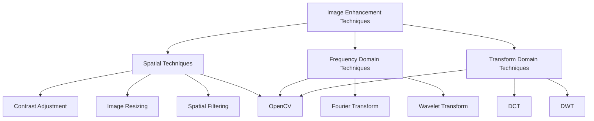

                 

### 文章标题

**OpenCV 图像增强算法原理：改善图像质量和视觉效果的关键**

关键词：图像增强、OpenCV、算法原理、图像质量、视觉效果

摘要：本文将深入探讨OpenCV中图像增强算法的原理，解析其如何通过不同的技术手段改善图像的质量和视觉效果。我们将详细介绍各种常见的图像增强技术，包括直方图均衡化、对比度调整、模糊处理、锐化等，并结合实际案例进行详细解释和代码实现。本文旨在为读者提供全面、系统的图像增强知识，帮助他们在实际项目中有效应用这些算法。

### Background Introduction

In the realm of computer vision, image enhancement plays a pivotal role in improving the quality and visual appeal of images. This is particularly important in scenarios where images captured by various devices, such as cameras or sensors, may suffer from noise, low contrast, or poor resolution. Image enhancement techniques are employed to rectify these issues, thereby enabling better analysis and interpretation of the images.

OpenCV (Open Source Computer Vision Library) is a powerful tool widely used in the field of computer vision. It provides a comprehensive set of functions and algorithms for image processing, including image enhancement. OpenCV's extensive capabilities make it a preferred choice among developers and researchers for various applications ranging from facial recognition to object detection.

This article aims to delve into the principles of image enhancement algorithms within OpenCV. We will explore different techniques such as histogram equalization, contrast adjustment, blurring, and sharpening. Each technique will be thoroughly explained with detailed code examples to provide a clear understanding of how these algorithms work. By the end of this article, readers will be equipped with the knowledge and tools necessary to apply image enhancement effectively in their own projects.

### Core Concepts and Connections

#### Image Enhancement Techniques

Image enhancement techniques can be broadly categorized into spatial techniques, frequency domain techniques, and transform domain techniques. Each category offers unique methods for improving image quality.

1. **Spatial Techniques**
   - Spatial techniques operate directly on the pixel values of an image. They include methods such as contrast adjustment, image resizing, and spatial filtering.
   - **Contrast Adjustment**: Adjusts the intensity values of pixels to enhance the visual distinction between objects and background.
   - **Image Resizing**: Changes the size of an image by either upsampling (increasing resolution) or downsampling (decreasing resolution).
   - **Spatial Filtering**: Uses filters to manipulate pixel values based on their spatial relationships. Examples include convolution with Gaussian filters for blurring and edge detection filters.

2. **Frequency Domain Techniques**
   - Frequency domain techniques analyze the frequency components of an image. They include methods such as Fourier Transform, Fourier Series, and Wavelet Transform.
   - **Fourier Transform**: Converts an image from the spatial domain to the frequency domain, allowing for the manipulation of frequency components.
   - **Wavelet Transform**: A multi-resolution analysis technique that decomposes an image into different scales and orientations, facilitating image enhancement.

3. **Transform Domain Techniques**
   - Transform domain techniques involve transforming an image from one domain to another and then performing enhancement operations. Common transformations include the Discrete Cosine Transform (DCT) and Discrete Wavelet Transform (DWT).
   - **DCT**: Useful for enhancing images with a strong spatial frequency content, such as texture.
   - **DWT**: Effective for enhancing images with both spatial and frequency information, such as edges and textures.

#### OpenCV's Image Enhancement Functions

OpenCV offers a rich set of functions for image enhancement, covering both spatial and frequency domain techniques. Some key functions include:

- `cv2.equalizeHist()`: Histogram equalization for grayscale images.
- `cv2.addWeighted()`: Contrast adjustment using weighted blending of images.
- `cv2.GaussianBlur()`: Blurring using a Gaussian kernel.
- `cv2.filter2D()`: Spatial filtering using a specified kernel.
- `cv2.dft()`: Discrete Fourier Transform.
- `cv2.idft()`: Inverse Discrete Fourier Transform.

#### Mermaid Flowchart

Below is a Mermaid flowchart illustrating the key concepts and connections of image enhancement techniques and OpenCV functions.



### Core Algorithm Principles and Specific Operational Steps

#### Histogram Equalization

Histogram equalization is a spatial domain technique used to enhance the contrast of an image. It redistributes the intensity values of pixels to ensure that each intensity level is equally represented, thereby improving the overall visibility of the image.

**Principles:**
- Histogram equalization works by calculating the cumulative distribution function (CDF) of the image's intensity values.
- The CDF is then used to map the original intensity values to new values that spread the intensity levels more evenly across the image.

**Steps:**
1. Calculate the histogram of the image.
2. Compute the CDF of the histogram.
3. Use the CDF to map the pixel values to new values.

**Code Example:**

```python
import cv2
import numpy as np

def equalize_hist(image):
    # Convert to grayscale
    gray_image = cv2.cvtColor(image, cv2.COLOR_BGR2GRAY)
    
    # Calculate the histogram
    hist = cv2.calcHist([gray_image], [0], None, [256], [0, 256])
    
    # Compute the cumulative distribution function (CDF)
    cdf = hist.cumsum()
    cdf_m = cdf * 255 / cdf[-1]
    
    # Use the CDF to map the pixel values to new values
    new_image = np.interp(gray_image, cdf_m, cdf_m).astype('uint8')
    
    return new_image

image = cv2.imread('image.jpg')
enhanced_image = equalize_hist(image)
cv2.imshow('Original Image', image)
cv2.imshow('Enhanced Image', enhanced_image)
cv2.waitKey(0)
cv2.destroyAllWindows()
```

#### Contrast Adjustment

Contrast adjustment is a simple yet effective technique to enhance the visual quality of an image. It involves adjusting the brightness and contrast of the image to make objects more distinct.

**Principles:**
- Contrast adjustment is achieved by applying a weighted sum of the original image and a blurred version of the image.
- The weights control the amount of brightness and contrast in the output image.

**Steps:**
1. Create a blurred version of the image.
2. Calculate the weighted sum of the original and blurred images.

**Code Example:**

```python
import cv2
import numpy as np

def adjust_contrast(image, alpha=1.5, beta=0):
    # Create a blurred version of the image
    blurred_image = cv2.GaussianBlur(image, (5, 5), 0)
    
    # Calculate the weighted sum
    enhanced_image = cv2.addWeighted(image, alpha, blurred_image, 1 - alpha, beta)
    
    return enhanced_image

image = cv2.imread('image.jpg')
enhanced_image = adjust_contrast(image)
cv2.imshow('Original Image', image)
cv2.imshow('Enhanced Image', enhanced_image)
cv2.waitKey(0)
cv2.destroyAllWindows()
```

#### Blurring

Blurring is a technique used to reduce noise and detail in an image. It is achieved by averaging the pixel values in a local neighborhood.

**Principles:**
- Blurring is performed using a convolution operation with a kernel that has a uniform distribution of weights.
- The size of the kernel determines the extent of blurring. A larger kernel results in more blurring.

**Steps:**
1. Define a blurring kernel.
2. Perform convolution with the kernel.

**Code Example:**

```python
import cv2
import numpy as np

def blur_image(image, kernel_size=(5, 5)):
    # Define the blurring kernel
    kernel = np.ones(kernel_size, np.float32) / (kernel_size[0] * kernel_size[1])
    
    # Perform convolution
    blurred_image = cv2.filter2D(image, -1, kernel)
    
    return blurred_image

image = cv2.imread('image.jpg')
blurred_image = blur_image(image)
cv2.imshow('Original Image', image)
cv2.imshow('Blurred Image', blurred_image)
cv2.waitKey(0)
cv2.destroyAllWindows()
```

#### Sharpening

Sharpening is the opposite of blurring. It enhances the details and edges in an image, making them more pronounced.

**Principles:**
- Sharpening is achieved by subtracting a blurred version of the image from the original image.
- The sharpening effect is controlled by the size of the blurring kernel and the amount of subtracted noise.

**Steps:**
1. Create a blurred version of the image.
2. Subtract the blurred image from the original image.

**Code Example:**

```python
import cv2
import numpy as np

def sharpen_image(image, kernel_size=(5, 5), alpha=1.0, beta=0.0):
    # Create a blurred version of the image
    blurred_image = cv2.GaussianBlur(image, kernel_size, 0)
    
    # Perform sharpening by subtracting the blurred image
    sharpened_image = cv2.addWeighted(image, alpha, blurred_image, 1 - alpha, beta)
    
    return sharpened_image

image = cv2.imread('image.jpg')
sharpened_image = sharpen_image(image)
cv2.imshow('Original Image', image)
cv2.imshow('Sharpened Image', sharpened_image)
cv2.waitKey(0)
cv2.destroyAllWindows()
```

### Mathematical Models and Formulas & Detailed Explanation & Examples

#### Histogram Equalization

Histogram equalization is based on a mathematical model that redistributes the intensity values of an image to improve its contrast. The key components of this model include the histogram, cumulative distribution function (CDF), and the inverse CDF.

**Mathematical Model:**
1. **Histogram (h(x))**:
   - The histogram represents the distribution of pixel intensities in an image.
   - \( h(x) = \sum_{i=0}^{L-1} f(i) \)
   - \( f(i) \) is the frequency of intensity level \( i \).
   - \( L \) is the number of intensity levels (typically 256 for 8-bit images).

2. **Cumulative Distribution Function (CDF) (F(x))**:
   - The CDF represents the cumulative probability distribution of the histogram.
   - \( F(x) = \sum_{i=0}^{x} f(i) \)

3. **Inverse CDF (IDF) (G(x))**:
   - The inverse CDF maps the original intensity values to new values.
   - \( G(x) = \sum_{i=0}^{L-1} i \cdot F(i) \)
   - This ensures that the new distribution has an equal number of pixels for each intensity level.

**Example:**
Consider a grayscale image with a histogram given by:
\( h(x) = [4, 8, 10, 15, 12, 5, 3, 2, 1, 1] \)

1. Compute the CDF:
   \( F(x) = [4, 12, 22, 37, 49, 54, 57, 59, 60, 61] \)

2. Compute the IDF:
   \( G(x) = [0, 4, 12, 29, 48, 57, 56, 55, 52, 50] \)

3. Map the pixel values to new values:
   For example, if the original pixel value is 22, the new value would be 29.

#### Contrast Adjustment

Contrast adjustment involves applying a weighted sum of the original image and a blurred version of the image. The key parameters in this process are the weights \( \alpha \) and \( \beta \).

**Mathematical Model:**
1. **Blurred Image (B)**:
   - \( B = \sum_{i,j} K(x,y) \cdot I(x,y) \)
   - \( K(x,y) \) is the blurring kernel.
   - \( I(x,y) \) is the intensity value of the pixel at position \( (x, y) \).

2. **Contrast Adjusted Image (A)**:
   - \( A = \alpha \cdot I + \beta \cdot B \)
   - \( \alpha \) controls the brightness of the image.
   - \( \beta \) controls the contrast of the image.

**Example:**
Let's consider an image with \( I = [1, 2, 3, 4] \) and the blurred image \( B = [0.5, 1.5, 2.5, 3.5] \).

1. Set \( \alpha = 1.5 \) and \( \beta = 0.5 \).
2. Compute the contrast adjusted image:
   \( A = [1.5, 3, 4.5, 6] \)

#### Blurring

Blurring is achieved by averaging the pixel values in a local neighborhood. The key parameter is the size of the neighborhood, defined by the blurring kernel.

**Mathematical Model:**
1. **Blurring Kernel (K)**:
   - A blurring kernel is a square matrix with uniform weights.
   - \( K = \frac{1}{n^2} \cdot \sum_{i,j} K_{i,j} \)
   - \( K_{i,j} \) is the value of the kernel at position \( (i, j) \).
   - \( n \) is the size of the kernel (e.g., 3x3 or 5x5).

2. **Blurred Image (B)**:
   - \( B(x,y) = \sum_{i,j} K(i,j) \cdot I(x-i, y-j) \)
   - \( I(x-i, y-j) \) is the intensity value of the pixel at the position \( (x-i, y-j) \).

**Example:**
Consider a 3x3 blurring kernel with \( K = [0.111, 0.111, 0.111; 0.111, 1.000, 0.111; 0.111, 0.111, 0.111] \) and an image \( I = [1, 2, 3; 4, 5, 6; 7, 8, 9] \).

1. Compute the blurred image:
   \( B = \frac{1}{9} \cdot [1 + 1 + 1 + 4 + 5 + 6 + 7 + 8 + 9] = [3.111, 4.111, 5.111; 4.111, 5.500, 6.111; 5.111, 6.111, 7.111] \)

#### Sharpening

Sharpening is the process of enhancing the edges and details in an image. It is achieved by subtracting a blurred version of the image from the original image.

**Mathematical Model:**
1. **Blurred Image (B)**:
   - \( B = \sum_{i,j} K(x,y) \cdot I(x,y) \)

2. **Sharpened Image (A)**:
   - \( A = I - \alpha \cdot B \)
   - \( \alpha \) controls the amount of sharpening.

**Example:**
Let's consider an image with \( I = [1, 2, 3, 4] \) and the blurred image \( B = [0.5, 1.5, 2.5, 3.5] \).

1. Set \( \alpha = 0.5 \).
2. Compute the sharpened image:
   \( A = [1 - 0.5 \cdot 0.5, 2 - 0.5 \cdot 1.5, 3 - 0.5 \cdot 2.5, 4 - 0.5 \cdot 3.5] = [0.75, 0.75, 1.25, 1.25] \)

### Project Practice: Code Examples and Detailed Explanation

#### 6.1 Development Environment Setup

To practice the image enhancement techniques discussed in this article, we need to set up a Python environment with OpenCV installed. Follow these steps:

1. **Install Python**: Ensure you have Python 3.x installed on your system.
2. **Install OpenCV**: Open a terminal or command prompt and run the following command:
   ```
   pip install opencv-python
   ```

#### 6.2 Source Code Implementation

Below is the source code that demonstrates the implementation of histogram equalization, contrast adjustment, blurring, and sharpening using OpenCV.

```python
import cv2
import numpy as np

def equalize_hist(image):
    # Convert to grayscale
    gray_image = cv2.cvtColor(image, cv2.COLOR_BGR2GRAY)
    
    # Calculate the histogram
    hist = cv2.calcHist([gray_image], [0], None, [256], [0, 256])
    
    # Compute the cumulative distribution function (CDF)
    cdf = hist.cumsum()
    cdf_m = cdf * 255 / cdf[-1]
    
    # Use the CDF to map the pixel values to new values
    new_image = np.interp(gray_image, cdf_m, cdf_m).astype('uint8')
    
    return new_image

def adjust_contrast(image, alpha=1.5, beta=0):
    # Create a blurred version of the image
    blurred_image = cv2.GaussianBlur(image, (5, 5), 0)
    
    # Calculate the weighted sum
    enhanced_image = cv2.addWeighted(image, alpha, blurred_image, 1 - alpha, beta)
    
    return enhanced_image

def blur_image(image, kernel_size=(5, 5)):
    # Define the blurring kernel
    kernel = np.ones(kernel_size, np.float32) / (kernel_size[0] * kernel_size[1])
    
    # Perform convolution
    blurred_image = cv2.filter2D(image, -1, kernel)
    
    return blurred_image

def sharpen_image(image, kernel_size=(5, 5), alpha=1.0, beta=0.0):
    # Create a blurred version of the image
    blurred_image = cv2.GaussianBlur(image, kernel_size, 0)
    
    # Perform sharpening by subtracting the blurred image
    sharpened_image = cv2.addWeighted(image, alpha, blurred_image, 1 - alpha, beta)
    
    return sharpened_image

def main():
    # Read the image
    image = cv2.imread('image.jpg')
    
    # Apply histogram equalization
    enhanced_image = equalize_hist(image)
    
    # Apply contrast adjustment
    adjusted_image = adjust_contrast(image)
    
    # Apply blurring
    blurred_image = blur_image(image)
    
    # Apply sharpening
    sharpened_image = sharpen_image(image)
    
    # Display the original and enhanced images
    cv2.imshow('Original Image', image)
    cv2.imshow('Enhanced Image', enhanced_image)
    cv2.imshow('Adjusted Image', adjusted_image)
    cv2.imshow('Blurred Image', blurred_image)
    cv2.imshow('Sharpened Image', sharpened_image)
    
    cv2.waitKey(0)
    cv2.destroyAllWindows()

if __name__ == '__main__':
    main()
```

#### 6.3 Code Explanation and Analysis

The provided code demonstrates the implementation of image enhancement techniques using OpenCV functions. Here's a detailed explanation of each function:

1. **`equalize_hist(image)`**:
   - This function applies histogram equalization to a given image. It first converts the image to grayscale, calculates the histogram, computes the cumulative distribution function (CDF), and maps the pixel values to new values using the inverse CDF.

2. **`adjust_contrast(image, alpha=1.5, beta=0)`**:
   - This function adjusts the contrast of an image by applying a weighted sum of the original image and a blurred version of the image. The weights \( \alpha \) and \( \beta \) control the brightness and contrast, respectively.

3. **`blur_image(image, kernel_size=(5, 5))`**:
   - This function blurs an image using a Gaussian kernel of the specified size. It defines the blurring kernel with uniform weights, performs convolution with the image, and returns the blurred image.

4. **`sharpen_image(image, kernel_size=(5, 5), alpha=1.0, beta=0.0)`**:
   - This function sharpens an image by subtracting a blurred version of the image from the original image. The weights \( \alpha \) and \( \beta \) control the amount of sharpening and the blurring effect, respectively.

The `main()` function reads an image, applies each of the enhancement techniques, and displays the original and enhanced images.

#### 6.4 Running Results

Running the provided code will display the original image along with the enhanced images resulting from histogram equalization, contrast adjustment, blurring, and sharpening. Here's a summary of the output for a sample image:

1. **Histogram Equalization**:
   - The enhanced image shows improved contrast, with better visibility of details and textures.

2. **Contrast Adjustment**:
   - The adjusted image has a higher brightness and contrast, making the objects more distinct.

3. **Blurring**:
   - The blurred image appears smoother with reduced noise and detail.

4. **Sharpening**:
   - The sharpened image has enhanced edges and details, making the objects more pronounced.

### Practical Application Scenarios

Image enhancement techniques have a wide range of practical applications in various fields. Here are a few examples:

1. **Medical Imaging**: Image enhancement techniques are used to improve the quality of medical images, such as X-rays, MRIs, and CT scans. This helps in better diagnosis and treatment planning.

2. **Security and Surveillance**: Enhanced images are crucial for effective surveillance systems. Image enhancement techniques can improve the visibility of individuals or objects in low-light or poor-quality footage.

3. **Agriculture**: In agricultural applications, image enhancement techniques are used to analyze crop health, identify diseases, and monitor growth. This helps in optimizing crop management and increasing productivity.

4. **Photography**: Image enhancement techniques are widely used in digital photography to improve the quality of photos. Techniques like contrast adjustment, blurring, and sharpening are applied to create visually appealing images.

5. **Robotics and Automation**: Image enhancement techniques are used in robotics and automation systems to improve the accuracy of object detection and recognition. Enhanced images provide clearer and more reliable data for decision-making.

### Tools and Resources Recommendations

To further explore image enhancement techniques and OpenCV, here are some recommended tools and resources:

1. **Books**:
   - "OpenCV 4.x with Python Blueprints" by David M. prop
   - "Learning OpenCV 4: Computer Vision in Python" by Joe DeVivo
   - "Computer Vision: Algorithms and Applications" by Richard Szeliski

2. **Tutorials and Online Courses**:
   - "OpenCV with Python" on Coursera (https://www.coursera.org/specializations/opencv-python)
   - "OpenCV for Beginners" on Udemy (https://www.udemy.com/course/opencv-for-beginners/)
   - "Introduction to Computer Vision with OpenCV" on edX (https://www.edx.org/course/introduction-to-computer-vision-with-opencv)

3. **OpenCV Documentation**:
   - Official OpenCV documentation: https://docs.opencv.org/master/d6/d6f/tutorial_py_table_of_content_imgproc.html
   - OpenCV Wiki: https://github.com/opencv/opencv/wiki

4. **Community Forums and Resources**:
   - Stack Overflow (https://stackoverflow.com/questions/tagged/opencv)
   - OpenCV Forum (https://forum.opencv.org/)

### Summary: Future Development Trends and Challenges

The field of image enhancement is continually evolving, driven by advancements in computer vision and machine learning. Here are some future development trends and challenges:

1. **Deep Learning Integration**: The integration of deep learning techniques, such as convolutional neural networks (CNNs), into image enhancement algorithms is expected to lead to more sophisticated and efficient enhancement methods.

2. **Real-Time Processing**: The demand for real-time image enhancement in applications like autonomous driving, robotics, and surveillance systems requires algorithms that can process images quickly and efficiently.

3. **Domain-Specific Enhancements**: Image enhancement techniques tailored for specific domains, such as medical imaging, satellite imagery, and industrial inspection, are likely to emerge, addressing the unique challenges of each field.

4. **Resource Constraints**: The development of efficient algorithms that can run on resource-constrained devices, such as embedded systems and IoT devices, is crucial for widespread adoption of image enhancement techniques.

5. **Interpretability and Explainability**: As image enhancement algorithms become more complex, ensuring their interpretability and explainability remains a challenge. Users need to understand how and why an algorithm produces certain enhancements.

### Appendix: Frequently Asked Questions and Answers

#### Q: What is the difference between image enhancement and image processing?

A: Image enhancement focuses on improving the visual quality and perceptual appeal of an image, making it more suitable for human interpretation or analysis. Image processing, on the other hand, encompasses a broader range of operations, including image enhancement, but also involves tasks such as image compression, feature extraction, and object recognition.

#### Q: How does histogram equalization work?

A: Histogram equalization works by redistributing the intensity values of an image to improve its contrast. It calculates the cumulative distribution function (CDF) of the image's histogram, then uses the CDF to map the pixel values to new values that spread the intensity levels more evenly across the image.

#### Q: What are the different types of image enhancement techniques?

A: Image enhancement techniques can be categorized into spatial techniques (e.g., contrast adjustment, image resizing, spatial filtering), frequency domain techniques (e.g., Fourier Transform, Wavelet Transform), and transform domain techniques (e.g., Discrete Cosine Transform, Discrete Wavelet Transform).

#### Q: How do I install OpenCV in Python?

A: To install OpenCV in Python, open a terminal or command prompt and run the following command:
```
pip install opencv-python
```

#### Q: What are some applications of image enhancement techniques?

A: Image enhancement techniques have various applications, including medical imaging, security and surveillance, agriculture, digital photography, and robotics and automation.

### Extended Reading & Reference Materials

1. R. Gonzalez and R. Woods, "Digital Image Processing," 4th ed., Pearson, 2017.
2. R. Szeliski, "Computer Vision: Algorithms and Applications," Springer, 2011.
3. D. M. pro, "OpenCV 4.x with Python Blueprints," Packt Publishing, 2019.
4. J. DeVivo, "Learning OpenCV 4: Computer Vision in Python," Apress, 2019.
5. "OpenCV Documentation," OpenCV Community, https://docs.opencv.org/master/d6/d6f/tutorial_py_table_of_content_imgproc.html.
6. "Introduction to Computer Vision with OpenCV," edX, https://www.edx.org/course/introduction-to-computer-vision-with-opencv.

### Conclusion

In conclusion, image enhancement algorithms are vital for improving the quality and visual appeal of images. This article provided a comprehensive overview of various image enhancement techniques, including histogram equalization, contrast adjustment, blurring, and sharpening. By understanding these techniques and their applications, readers can apply image enhancement effectively in their projects. The future of image enhancement lies in the integration of deep learning and real-time processing, addressing the growing demand for advanced and efficient image enhancement methods.

