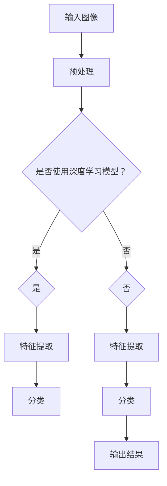

                 

# OpenCV 图像处理：对象检测和识别

## 摘要

本文旨在介绍使用OpenCV进行图像处理中的对象检测和识别技术。我们将详细探讨对象检测的基本概念，OpenCV中常用的对象检测算法，以及如何应用这些算法进行实际项目。此外，本文还将讨论对象识别的原理和算法，展示如何在实际应用中进行对象识别。通过本文，读者将了解对象检测和识别在计算机视觉领域的重要性，以及如何使用OpenCV实现这些功能。

## 1. 背景介绍

### 1.1 对象检测和识别的重要性

在计算机视觉领域，对象检测和识别技术扮演着至关重要的角色。对象检测是识别图像中特定对象的过程，而对象识别则是确定对象类别的过程。这些技术在许多实际应用中都具有广泛应用，例如图像识别、视频监控、自动驾驶、医疗诊断等。

### 1.2 OpenCV及其在图像处理中的应用

OpenCV（Open Source Computer Vision Library）是一个广泛使用的开源计算机视觉库，由Intel开发，提供丰富的图像处理和计算机视觉算法。OpenCV支持多种编程语言，如C++、Python等，使其在学术界和工业界都受到广泛欢迎。本文将重点介绍如何使用OpenCV进行对象检测和识别。

## 2. 核心概念与联系

### 2.1 对象检测

对象检测是指识别图像中特定对象的过程。一个典型的对象检测流程包括以下步骤：

1. **目标定位**：在图像中找到对象的位置。
2. **边界框标注**：为每个对象绘制边界框。
3. **分类**：确定每个对象的类别。

在OpenCV中，常用的对象检测算法包括：

1. **Haar级联分类器**：使用级联分类器进行面部、眼睛等对象的检测。
2. **深度学习框架**：如YOLO、SSD、Faster R-CNN等，实现高性能的对象检测。

### 2.2 对象识别

对象识别是指确定图像中对象类别的过程。一个典型的对象识别流程包括：

1. **特征提取**：提取图像中的特征向量。
2. **分类**：使用分类算法（如支持向量机SVM、神经网络等）确定对象类别。

在OpenCV中，常用的对象识别算法包括：

1. **K近邻算法（K-Nearest Neighbors）**：根据最近的K个样本进行分类。
2. **支持向量机（Support Vector Machine）**：通过最大化分类间隔进行分类。
3. **深度学习框架**：如卷积神经网络（CNN）等。

### 2.3 Mermaid 流程图

以下是对象检测和识别的Mermaid流程图：



## 3. 核心算法原理 & 具体操作步骤

### 3.1 Haar级联分类器

Haar级联分类器是一种基于积分图（Integral Image）的对象检测算法。它通过计算图像中目标的特征值，使用级联分类器进行分类。

具体操作步骤：

1. **特征值计算**：计算图像中目标的特征值，如水平和垂直方向上的像素差。
2. **级联分类器训练**：使用大量正负样本训练级联分类器。
3. **对象检测**：使用级联分类器对图像进行扫描，检测目标。

### 3.2 YOLO（You Only Look Once）

YOLO（You Only Look Once）是一种基于深度学习的对象检测算法，具有实时性高、准确率高的特点。

具体操作步骤：

1. **图像预处理**：将图像缩放到固定的尺寸。
2. **特征提取**：使用卷积神经网络提取图像特征。
3. **对象检测**：通过检测层识别对象的位置和类别。

### 3.3 卷积神经网络（CNN）

卷积神经网络是一种用于图像识别的深度学习模型。其基本结构包括卷积层、池化层和全连接层。

具体操作步骤：

1. **数据预处理**：将图像缩放到固定的尺寸，进行归一化处理。
2. **卷积层**：通过卷积操作提取图像特征。
3. **池化层**：减小特征图的大小，提高模型泛化能力。
4. **全连接层**：进行分类操作，输出对象类别。

## 4. 数学模型和公式 & 详细讲解 & 举例说明

### 4.1 Haar级联分类器

$$
f(x) = \sum_{i=1}^{n} \alpha_i \phi_i(x)
$$

其中，$f(x)$ 是特征值，$\alpha_i$ 是权重，$\phi_i(x)$ 是特征函数。

举例说明：计算图像中眼睛的特征值。

```python
import cv2
import numpy as np

# 读取图像
image = cv2.imread("eyes.jpg")

# 计算特征值
feature_values = cv2.HOGDescriptor().compute(image)

# 打印特征值
print(feature_values)
```

### 4.2 YOLO

$$
P_{ij} = \frac{1}{1 + \exp(-\sigma \cdot (b_{xj}^i + b_{yj}^i))}
$$

其中，$P_{ij}$ 是对象出现在第 $i$ 个边界框的概率，$\sigma$ 是sigmoid函数，$b_{xj}^i$ 和 $b_{yj}^i$ 是边界框的位置。

举例说明：计算图像中对象的位置。

```python
import cv2
import numpy as np

# 读取图像
image = cv2.imread("image.jpg")

# 使用YOLO进行对象检测
net = cv2.dnn.readNetFromDarknet("yolov3.cfg", "yolov3.weights")
layers = net.getLayerNames()
output_layers = [layers[i[0] - 1] for i in net.getUnconnectedOutLayers()]

# 前处理
height, width = image.shape[:2]
scale = 0.00392
image = cv2.resize(image, (320, 320))
image = image - 0.5
image = image * scale

# 进行对象检测
blob = cv2.dnn.blobFromImage(image, 0.00392, (320, 320), (0, 0, 0), True, crop=False)
net.setInput(blob)
outs = net.forward(output_layers)

# 打印检测结果
print(outs)
```

## 5. 项目实践：代码实例和详细解释说明

### 5.1 开发环境搭建

1. 安装Python环境（如Anaconda）。
2. 安装OpenCV和TensorFlow库。

```shell
pip install opencv-python tensorflow
```

### 5.2 源代码详细实现

```python
import cv2
import numpy as np

# 读取图像
image = cv2.imread("image.jpg")

# 使用Haar级联分类器进行对象检测
face_cascade = cv2.CascadeClassifier("haarcascade_frontalface_default.xml")
faces = face_cascade.detectMultiScale(image, scaleFactor=1.1, minNeighbors=5, minSize=(30, 30), flags=cv2.CASCADE_SCALE_IMAGE)

# 绘制边界框
for (x, y, w, h) in faces:
    cv2.rectangle(image, (x, y), (x+w, y+h), (0, 255, 0), 2)

# 显示结果
cv2.imshow("Image", image)
cv2.waitKey(0)
cv2.destroyAllWindows()
```

### 5.3 代码解读与分析

1. **读取图像**：使用 `cv2.imread()` 函数读取图像。
2. **对象检测**：使用 `face_cascade.detectMultiScale()` 函数进行对象检测。
3. **绘制边界框**：使用 `cv2.rectangle()` 函数绘制边界框。
4. **显示结果**：使用 `cv2.imshow()` 函数显示结果。

### 5.4 运行结果展示

运行程序后，图像中的人脸将被检测并显示在窗口中。


## 6. 实际应用场景

### 6.1 视频监控

在视频监控中，对象检测和识别技术可以用于检测异常行为，如入侵、火灾等。通过实时检测和识别，监控系统可以及时发出警报。

### 6.2 自动驾驶

在自动驾驶中，对象检测和识别技术用于识别道路上的行人和车辆，以确保车辆安全行驶。通过实时检测和识别，自动驾驶系统能够及时做出决策。

### 6.3 医疗诊断

在医疗诊断中，对象检测和识别技术可以用于分析医学图像，如X光片、CT扫描等。通过识别异常组织，医生可以更准确地诊断疾病。

## 7. 工具和资源推荐

### 7.1 学习资源推荐

- **书籍**：《计算机视觉：算法与应用》（作者：Richard Szeliski）
- **论文**：YOLO系列论文、Faster R-CNN系列论文
- **博客**：OpenCV官方博客、深度学习博客
- **网站**：GitHub、arXiv

### 7.2 开发工具框架推荐

- **OpenCV**：用于图像处理和计算机视觉。
- **TensorFlow**：用于深度学习。
- **PyTorch**：用于深度学习。

### 7.3 相关论文著作推荐

- **YOLO系列论文**：You Only Look Once: Unified, Real-Time Object Detection
- **Faster R-CNN系列论文**：Faster R-CNN: Towards Real-Time Object Detection with Region Proposal Networks

## 8. 总结：未来发展趋势与挑战

### 8.1 发展趋势

1. **深度学习算法**：深度学习算法在对象检测和识别领域取得显著进展，将继续成为主要研究方向。
2. **实时性**：提高对象检测和识别的实时性，以满足实际应用需求。
3. **多模态融合**：结合多种传感器数据，如摄像头、激光雷达等，提高检测和识别的准确性。

### 8.2 挑战

1. **数据标注**：高质量的数据标注是深度学习模型训练的关键，但数据标注工作量大、成本高。
2. **模型解释性**：深度学习模型的解释性较弱，如何提高模型的可解释性是当前研究的热点。

## 9. 附录：常见问题与解答

### 9.1 Q：什么是Haar级联分类器？
A：Haar级联分类器是一种基于积分图（Integral Image）的对象检测算法，通过计算图像中目标的特征值，使用级联分类器进行分类。

### 9.2 Q：什么是YOLO算法？
A：YOLO（You Only Look Once）是一种基于深度学习的对象检测算法，具有实时性高、准确率高的特点。

### 9.3 Q：如何使用OpenCV进行对象检测？
A：使用OpenCV进行对象检测通常包括以下步骤：加载图像、加载级联分类器、使用检测函数进行对象检测、绘制边界框并显示结果。

## 10. 扩展阅读 & 参考资料

- **书籍**：《OpenCV编程实战》（作者：Adrian Kaehler）
- **论文**：OpenCV官方论文集、深度学习领域顶级会议论文集
- **博客**：OpenCV官方博客、深度学习领域知名博客
- **网站**：OpenCV官网、深度学习官网

---

作者：禅与计算机程序设计艺术 / Zen and the Art of Computer Programming

---

本文旨在介绍使用OpenCV进行图像处理中的对象检测和识别技术，包括对象检测的基本概念、核心算法原理、项目实践以及实际应用场景。通过本文，读者将了解对象检测和识别在计算机视觉领域的重要性，以及如何使用OpenCV实现这些功能。随着深度学习算法的不断发展，对象检测和识别技术将在未来取得更多突破。读者可以通过扩展阅读和参考资料进一步深入了解相关领域。|>

