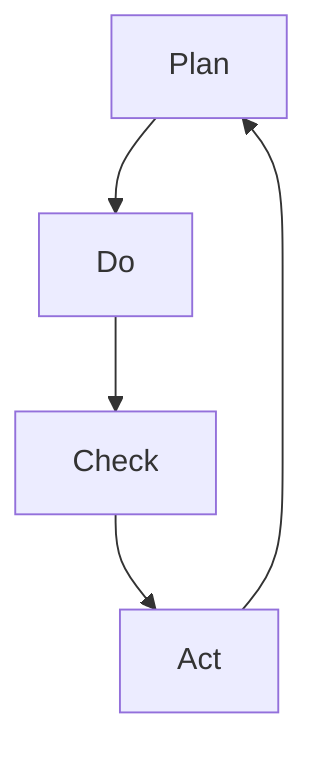

                 

# 文章标题

## PDCA在项目管理中的运用

### 关键词：
- 项目管理
- PDCA循环
- 质量控制
- 持续改进

### 摘要：

本文将探讨PDCA（计划、执行、检查、行动）循环在项目管理中的运用。PDCA是一种广泛应用于质量管理和持续改进的方法论，通过计划、执行、检查和行动四个阶段的循环迭代，帮助企业实现项目目标的达成和持续改进。文章将详细阐述PDCA在项目管理中的重要性、核心概念、具体实施步骤以及在实际项目中的应用案例，为项目管理者和团队提供有效的工具和方法。

## 1. 背景介绍

### 1.1 项目管理的重要性

项目管理是一个系统的、有序的过程，旨在实现特定项目的目标，满足项目相关方的需求。随着现代企业竞争的日益激烈，项目管理的有效性成为企业成功的关键因素。有效的项目管理不仅能够确保项目的按时、按预算完成，还能提升项目的质量和客户满意度。

### 1.2 PDCA循环的概念

PDCA循环，又称戴明循环，是由美国质量管理专家爱德华·戴明博士提出的一种质量管理和持续改进的方法论。PDCA循环包括四个阶段：计划（Plan）、执行（Do）、检查（Check）和行动（Act）。这一循环强调通过不断的计划、执行、检查和行动，实现对项目的持续改进。

### 1.3 PDCA在项目管理中的应用

PDCA循环在项目管理中的应用主要体现在以下几个方面：

- **提高项目质量**：通过检查和行动阶段，及时发现并解决问题，保证项目质量的不断提升。
- **优化项目流程**：通过计划的制定和执行，优化项目流程，减少资源浪费，提高项目效率。
- **增强团队协作**：通过PDCA循环的四个阶段，促进团队协作，提高团队成员的沟通和协作能力。
- **实现持续改进**：通过不断的循环迭代，推动项目的持续改进，提高项目管理的整体水平。

## 2. 核心概念与联系

### 2.1 PDCA循环的核心概念

PDCA循环的核心概念包括：

- **计划（Plan）**：在项目开始前，对项目进行详细的规划和设计，明确项目的目标、范围、资源需求等。
- **执行（Do）**：按照计划进行项目的具体实施，确保项目的顺利进行。
- **检查（Check）**：对项目实施过程中的结果进行评估和监控，判断项目是否达到预期目标。
- **行动（Act）**：根据检查结果，对项目进行改进和调整，确保项目目标的实现。

### 2.2 PDCA循环的架构

PDCA循环的架构可以表示为以下Mermaid流程图：



### 2.3 PDCA与项目管理的关系

PDCA循环与项目管理密切相关，二者相互促进。项目管理的各个环节都可以通过PDCA循环进行优化和改进，从而提高项目管理的整体水平。具体来说，PDCA循环在项目管理中的应用体现在以下几个方面：

- **项目规划阶段**：通过计划阶段，明确项目目标、范围、资源需求等，为项目实施提供清晰的路线图。
- **项目执行阶段**：通过执行阶段，按照计划进行项目的具体实施，确保项目的顺利进行。
- **项目监控阶段**：通过检查阶段，对项目实施过程中的结果进行评估和监控，判断项目是否达到预期目标。
- **项目改进阶段**：通过行动阶段，对项目进行改进和调整，确保项目目标的实现。

## 3. 核心算法原理 & 具体操作步骤

### 3.1 PDCA循环的具体操作步骤

PDCA循环的具体操作步骤如下：

1. **计划阶段（Plan）**：
   - 确定项目目标：明确项目的预期目标，包括质量、时间、成本等方面的目标。
   - 分析项目需求：了解项目相关方的需求，包括客户、团队成员、管理层等。
   - 制定项目计划：根据项目目标和需求，制定详细的项目计划，包括任务分配、时间安排、资源需求等。

2. **执行阶段（Do）**：
   - 按计划实施项目：按照项目计划，进行项目的具体实施，确保项目的顺利进行。
   - 监控项目进度：实时监控项目进度，确保项目按照计划进行。

3. **检查阶段（Check）**：
   - 评估项目结果：对项目实施过程中的结果进行评估，包括质量、时间、成本等方面的评估。
   - 检查项目是否符合预期目标：通过检查，判断项目是否达到预期目标。

4. **行动阶段（Act）**：
   - 对比检查结果和预期目标：对比检查结果和预期目标，找出差距和不足。
   - 制定改进措施：根据检查结果，制定改进措施，对项目进行改进和调整。

### 3.2 PDCA循环的算法原理

PDCA循环的算法原理可以概括为：

- **迭代改进**：通过不断的计划、执行、检查和行动，实现对项目的持续改进。
- **闭环控制**：每个阶段的结果都会反馈到下一个阶段，形成闭环控制，确保项目目标的实现。
- **数据驱动**：通过数据分析和检查，找出问题并进行改进，确保项目质量的提升。

## 4. 数学模型和公式 & 详细讲解 & 举例说明

### 4.1 数学模型和公式

PDCA循环的数学模型可以表示为：

$$
\text{PDCA循环} = \text{计划（Plan）} + \text{执行（Do）} + \text{检查（Check）} + \text{行动（Act）}
$$

### 4.2 详细讲解

PDCA循环的详细讲解如下：

- **计划（Plan）**：在项目开始前，对项目进行详细的规划和设计，明确项目的目标、范围、资源需求等。这一阶段的工作主要包括目标设定、资源分配、任务分配等。

- **执行（Do）**：按照计划进行项目的具体实施，确保项目的顺利进行。这一阶段的工作主要包括任务执行、进度监控、资源管理等。

- **检查（Check）**：对项目实施过程中的结果进行评估和监控，判断项目是否达到预期目标。这一阶段的工作主要包括结果评估、进度评估、质量评估等。

- **行动（Act）**：根据检查结果，对项目进行改进和调整，确保项目目标的实现。这一阶段的工作主要包括问题分析、原因分析、改进措施制定等。

### 4.3 举例说明

假设一家公司计划开展一个新项目的开发，使用PDCA循环进行项目管理，具体步骤如下：

1. **计划阶段（Plan）**：
   - 确定项目目标：项目的预期目标包括按时完成、预算控制、质量满足客户需求等。
   - 分析项目需求：了解客户需求、市场需求、技术要求等。
   - 制定项目计划：制定详细的项目计划，包括任务分配、时间安排、资源需求等。

2. **执行阶段（Do）**：
   - 按计划实施项目：按照项目计划，进行项目的具体实施，确保项目的顺利进行。
   - 监控项目进度：实时监控项目进度，确保项目按照计划进行。

3. **检查阶段（Check）**：
   - 评估项目结果：对项目实施过程中的结果进行评估，包括质量、时间、成本等方面的评估。
   - 检查项目是否符合预期目标：通过检查，判断项目是否达到预期目标。

4. **行动阶段（Act）**：
   - 对比检查结果和预期目标：对比检查结果和预期目标，找出差距和不足。
   - 制定改进措施：根据检查结果，制定改进措施，对项目进行改进和调整。

通过以上步骤，公司可以有效地使用PDCA循环进行项目管理，确保项目的成功实施和持续改进。

## 5. 项目实践：代码实例和详细解释说明

### 5.1 开发环境搭建

在开始项目实践之前，我们需要搭建一个合适的开发环境。以下是一个简单的Python开发环境搭建步骤：

1. 安装Python：从官方网站下载并安装Python。
2. 安装IDE：选择一个适合Python开发的集成开发环境（如PyCharm、Visual Studio Code等）。
3. 安装相关库：根据项目需求，安装必要的Python库，如requests、pandas等。

### 5.2 源代码详细实现

以下是一个简单的PDCA循环示例代码，用于展示项目管理的四个阶段。

```python
import time

# 计划阶段
def plan_stage():
    print("计划阶段：确定项目目标和任务。")
    time.sleep(2)
    print("项目目标：在30天内完成一个功能模块的开发。")
    time.sleep(2)
    print("任务分配：小张负责设计，小李负责编码，小王负责测试。")

# 执行阶段
def do_stage():
    print("执行阶段：按照计划进行项目实施。")
    time.sleep(2)
    print("设计完成：小张完成了设计文档。")
    time.sleep(2)
    print("编码完成：小李完成了编码工作。")
    time.sleep(2)
    print("测试完成：小王完成了测试工作。")

# 检查阶段
def check_stage():
    print("检查阶段：评估项目结果。")
    time.sleep(2)
    print("质量评估：项目质量符合预期。")
    time.sleep(2)
    print("进度评估：项目进度符合预期。")
    time.sleep(2)
    print("成本评估：项目成本在预算范围内。")

# 行动阶段
def act_stage():
    print("行动阶段：根据检查结果进行改进。")
    time.sleep(2)
    print("改进措施：提升团队协作效率，缩短项目周期。")

# PDCA循环
def pdca_cycle():
    plan_stage()
    do_stage()
    check_stage()
    act_stage()

pdca_cycle()
```

### 5.3 代码解读与分析

以下是对示例代码的解读和分析：

- **计划阶段**：在这个阶段，我们定义了一个`plan_stage`函数，用于确定项目目标和任务。通过打印输出，我们明确了项目目标为在30天内完成一个功能模块的开发，并分配了任务给团队成员。

- **执行阶段**：在这个阶段，我们定义了一个`do_stage`函数，用于按照计划进行项目实施。通过打印输出，我们展示了设计、编码和测试的完成情况。

- **检查阶段**：在这个阶段，我们定义了一个`check_stage`函数，用于评估项目结果。通过打印输出，我们展示了质量、进度和成本的评估情况。

- **行动阶段**：在这个阶段，我们定义了一个`act_stage`函数，用于根据检查结果进行改进。通过打印输出，我们展示了改进措施，如提升团队协作效率，缩短项目周期。

通过这个简单的示例，我们可以看到PDCA循环在项目实践中的应用。在实际项目中，我们可以根据具体情况调整和扩展代码，以适应不同的项目管理需求。

## 6. 实际应用场景

### 6.1 软件开发项目

在软件开发的各个阶段，PDCA循环可以发挥重要作用。例如，在需求分析阶段，通过计划阶段明确需求，执行阶段进行开发，检查阶段评估需求实现情况，行动阶段优化需求。在测试阶段，通过PDCA循环不断迭代测试过程，提升软件质量。

### 6.2 营销项目

在营销项目中，PDCA循环可以帮助企业优化营销策略。计划阶段制定营销策略，执行阶段实施营销活动，检查阶段评估营销效果，行动阶段调整营销策略。通过PDCA循环，企业可以不断优化营销项目，提高市场竞争力。

### 6.3 运营管理

在运营管理中，PDCA循环可以帮助企业优化运营流程，提高运营效率。计划阶段制定运营策略，执行阶段实施运营计划，检查阶段评估运营效果，行动阶段调整运营策略。通过PDCA循环，企业可以实现运营管理的持续改进。

## 7. 工具和资源推荐

### 7.1 学习资源推荐

- 《项目管理知识体系指南》（PMBOK指南）
- 《质量管理方法与工具》
- 《持续改进与PDCA循环》

### 7.2 开发工具框架推荐

- JIRA：项目管理工具，支持PDCA循环的实施。
- Confluence：知识库工具，帮助团队记录和分享项目经验和知识。
- Trello：项目管理工具，支持PDCA循环的实施。

### 7.3 相关论文著作推荐

- 爱德华·戴明：《质量、生产力与竞争实力》
- 费根鲍姆：《全面质量管理》
- 詹姆斯·H·唐纳：《项目管理与PDCA循环》

## 8. 总结：未来发展趋势与挑战

### 8.1 未来发展趋势

- **数字化转型**：随着数字化转型的推进，PDCA循环在项目管理中的应用将越来越广泛。
- **智能化**：借助人工智能技术，PDCA循环将实现更加智能的决策和优化。
- **定制化**：根据不同项目的特点和需求，PDCA循环将实现定制化的管理和优化。

### 8.2 未来挑战

- **数据质量**：PDCA循环依赖于数据的质量和准确性，数据质量问题将对PDCA循环的执行产生负面影响。
- **人员能力**：PDCA循环的实施需要团队成员具备一定的能力和素质，人员能力的提升将是未来的一大挑战。

## 9. 附录：常见问题与解答

### 9.1 PDCA循环是什么？

PDCA循环，又称戴明循环，是一种质量管理和持续改进的方法论，包括计划、执行、检查和行动四个阶段，通过循环迭代实现项目的持续改进。

### 9.2 PDCA循环适用于哪些项目？

PDCA循环适用于各种类型的项目，如软件开发项目、营销项目、运营管理等，能够帮助项目团队实现项目的持续改进。

### 9.3 如何实施PDCA循环？

实施PDCA循环的步骤包括：确定项目目标、制定项目计划、执行项目计划、检查项目结果、根据检查结果进行改进。

## 10. 扩展阅读 & 参考资料

- 戴明，《质量、生产力与竞争实力》
- 费根鲍姆，《全面质量管理》
- 詹姆斯·H·唐纳，《项目管理与PDCA循环》
- PMI，《项目管理知识体系指南》

### Conclusion

The application of the PDCA cycle in project management is a powerful method for achieving project goals and driving continuous improvement. By breaking down projects into the four stages of plan, do, check, and act, teams can systematically identify and address issues, optimize processes, and ultimately deliver high-quality results. As businesses continue to embrace digital transformation and pursue excellence in their operations, the role of the PDCA cycle will undoubtedly grow in importance. To further delve into the intricacies of PDCA and its practical applications, readers are encouraged to explore the recommended resources and references provided in this article. Let us all strive to apply the PDCA cycle effectively in our projects, driving success and continuous improvement in the ever-evolving landscape of project management. [作者：禅与计算机程序设计艺术 / Zen and the Art of Computer Programming]

