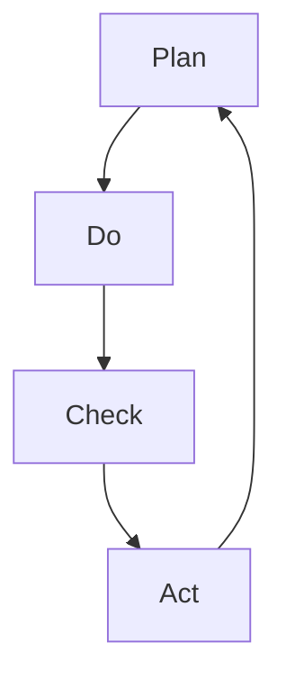

                 

### 文章标题

PDCA循环在流程优化中的作用

关键词：PDCA循环，流程优化，持续改进，质量控制，系统管理

摘要：本文旨在探讨PDCA循环在流程优化中的应用与作用。PDCA循环是一种广泛应用于质量管理和其他领域的系统化改进方法。通过分析PDCA循环的四个阶段：计划（Plan）、执行（Do）、检查（Check）和行动（Act），本文将阐述如何在实践中有效实施PDCA循环，以实现流程的持续优化和质量的提升。

## 1. 背景介绍（Background Introduction）

PDCA循环，又称戴明循环，由美国统计学家爱德华·戴明（W. Edwards Deming）提出，是一种用于持续改进和流程优化的系统化方法。PDCA循环包括四个阶段：计划（Plan）、执行（Do）、检查（Check）和行动（Act），这四个阶段相互联系、循环往复，形成一个闭环，推动系统不断进步。

在当今竞争激烈的市场环境中，流程优化对于企业来说至关重要。通过不断优化流程，企业可以提高效率、减少浪费、提高产品质量和客户满意度。PDCA循环作为一种有效的工具，可以帮助企业实现这一目标。

### 1.1 PDCA循环的定义

PDCA循环是指Plan（计划）、Do（执行）、Check（检查）和Act（行动）四个阶段的循环过程，每个阶段都是上一个阶段的输出，同时也是下一个阶段的输入。

- **Plan（计划）**：确定目标、制定计划和策略。
- **Do（执行）**：执行计划，将计划付诸实施。
- **Check（检查）**：检查结果，对比计划与实际效果。
- **Act（行动）**：对成功经验进行标准化，对失败原因进行分析和改进。

### 1.2 PDCA循环的应用范围

PDCA循环不仅应用于质量管理，还广泛应用于生产管理、项目管理、人力资源管理、服务改进等多个领域。以下是一些典型的应用场景：

- **质量管理**：用于持续改进产品质量，降低不良品率。
- **生产管理**：优化生产流程，提高生产效率和降低成本。
- **项目管理**：确保项目按时、按预算完成，提高项目成功率。
- **人力资源管理**：优化员工培训和发展计划，提高员工绩效和满意度。

### 1.3 流程优化的重要性

流程优化是企业持续发展的重要手段。通过优化流程，企业可以实现以下目标：

- **提高效率**：减少不必要的步骤和重复工作，提高工作效率。
- **降低成本**：通过减少浪费和优化资源利用，降低运营成本。
- **提升质量**：通过不断改进和优化流程，提高产品和服务质量。
- **增强竞争力**：优化流程可以增强企业的市场竞争力，提高客户满意度。

## 2. 核心概念与联系（Core Concepts and Connections）

在流程优化中，PDCA循环是一种系统化的方法，通过四个阶段的循环迭代，不断改进和优化流程。以下将详细阐述PDCA循环的核心概念及其在流程优化中的应用。

### 2.1 计划（Plan）

**计划阶段是PDCA循环的起点，其主要任务是确定目标和制定策略。**

- **目标设定**：明确流程优化要达到的目标，如提高生产效率、降低不良率、提升客户满意度等。
- **现状分析**：通过数据分析和现场观察，了解当前流程的优缺点，确定改进的切入点。
- **原因分析**：分析流程中存在的问题，找出潜在原因，为制定改进措施提供依据。
- **制定计划**：根据现状分析和原因分析，制定具体的改进计划，包括改进措施、责任分配、时间表等。

在流程优化中，计划阶段的关键是明确目标和制定可行的改进措施。通过科学的分析和规划，确保后续执行阶段的顺利进行。

### 2.2 执行（Do）

**执行阶段是将计划付诸实施的过程。**

- **实施改进**：按照计划，实施具体的改进措施，如调整生产流程、改进设备、培训员工等。
- **资源分配**：合理分配人力、物力和财力等资源，确保改进措施的有效实施。
- **沟通协调**：加强团队间的沟通和协调，确保各部门和员工按照计划执行。

在执行阶段，关键在于确保计划的顺利实施。通过有效的执行，验证计划的可行性和有效性。

### 2.3 检查（Check）

**检查阶段是对执行结果进行评估和审核的过程。**

- **数据收集**：收集与流程优化相关的数据，如生产效率、不良率、客户满意度等。
- **结果对比**：将实际结果与计划目标进行对比，评估改进效果。
- **问题识别**：分析结果，找出存在的问题和不足之处。

在检查阶段，关键在于通过数据分析和比较，评估改进措施的有效性，为下一步行动提供依据。

### 2.4 行动（Act）

**行动阶段是对成功经验进行标准化，对失败原因进行分析和改进的过程。**

- **成功经验标准化**：对成功的改进措施进行总结和固化，形成标准操作流程，确保持续改进。
- **问题分析**：对存在的问题和失败原因进行深入分析，找出根本原因。
- **持续改进**：根据问题分析结果，制定新的改进计划，并实施新一轮的PDCA循环。

在行动阶段，关键在于通过总结和反思，持续改进流程，不断提升流程优化效果。

### 2.5 PDCA循环的Mermaid流程图

以下是PDCA循环的Mermaid流程图，展示了各个阶段的相互关系和循环迭代过程：



在流程优化中，PDCA循环通过四个阶段的循环迭代，不断改进和优化流程，实现持续改进和流程优化。

### 3. 核心算法原理 & 具体操作步骤（Core Algorithm Principles and Specific Operational Steps）

PDCA循环作为一种系统化的流程优化方法，其核心在于通过四个阶段的循环迭代，不断改进和优化流程。以下将详细阐述PDCA循环的核心算法原理和具体操作步骤。

#### 3.1 计划阶段（Plan）

**计划阶段是PDCA循环的起点，其主要任务是确定目标和制定策略。**

**具体步骤：**

1. **目标设定**：明确流程优化要达到的目标，如提高生产效率、降低不良率、提升客户满意度等。
2. **现状分析**：通过数据分析和现场观察，了解当前流程的优缺点，确定改进的切入点。
3. **原因分析**：分析流程中存在的问题，找出潜在原因，为制定改进措施提供依据。
4. **制定计划**：根据现状分析和原因分析，制定具体的改进计划，包括改进措施、责任分配、时间表等。

在计划阶段，关键在于明确目标和制定可行的改进措施。通过科学的分析和规划，确保后续执行阶段的顺利进行。

#### 3.2 执行阶段（Do）

**执行阶段是将计划付诸实施的过程。**

**具体步骤：**

1. **实施改进**：按照计划，实施具体的改进措施，如调整生产流程、改进设备、培训员工等。
2. **资源分配**：合理分配人力、物力和财力等资源，确保改进措施的有效实施。
3. **沟通协调**：加强团队间的沟通和协调，确保各部门和员工按照计划执行。

在执行阶段，关键在于确保计划的顺利实施。通过有效的执行，验证计划的可行性和有效性。

#### 3.3 检查阶段（Check）

**检查阶段是对执行结果进行评估和审核的过程。**

**具体步骤：**

1. **数据收集**：收集与流程优化相关的数据，如生产效率、不良率、客户满意度等。
2. **结果对比**：将实际结果与计划目标进行对比，评估改进效果。
3. **问题识别**：分析结果，找出存在的问题和不足之处。

在检查阶段，关键在于通过数据分析和比较，评估改进措施的有效性，为下一步行动提供依据。

#### 3.4 行动阶段（Act）

**行动阶段是对成功经验进行标准化，对失败原因进行分析和改进的过程。**

**具体步骤：**

1. **成功经验标准化**：对成功的改进措施进行总结和固化，形成标准操作流程，确保持续改进。
2. **问题分析**：对存在的问题和失败原因进行深入分析，找出根本原因。
3. **持续改进**：根据问题分析结果，制定新的改进计划，并实施新一轮的PDCA循环。

在行动阶段，关键在于通过总结和反思，持续改进流程，不断提升流程优化效果。

### 4. 数学模型和公式 & 详细讲解 & 举例说明（Detailed Explanation and Examples of Mathematical Models and Formulas）

在PDCA循环的各个阶段，数学模型和公式有助于量化分析过程，提高流程优化的科学性和精确性。以下将介绍一些常见的数学模型和公式，并对其进行详细讲解和举例说明。

#### 4.1 计划阶段

**1. 目标设定公式：**

$$
\text{目标设定} = \text{现状} + \text{改进空间}
$$

**说明：**目标设定公式用于确定流程优化的目标值。现状是指当前流程的实际表现，改进空间是指通过优化可以提升的潜在空间。通过计算现状和改进空间的和，得出目标值。

**示例：**假设某生产流程的当前不良率为5%，经过分析，确定改进空间为3%，则目标设定为8%。

$$
\text{目标设定} = 5\% + 3\% = 8\%
$$

**2. 方案评估公式：**

$$
\text{方案评估} = \frac{\text{改进效果} \times \text{实施成本}}{\text{预期收益}}
$$

**说明：**方案评估公式用于评估不同改进方案的优劣。改进效果是指实施改进后预期的效果，实施成本是指实施改进所需的成本，预期收益是指实施改进后的预期收益。通过计算方案评估值，可以比较不同方案的性价比。

**示例：**假设有两个改进方案，方案A的改进效果为20%，实施成本为1000元，预期收益为1500元；方案B的改进效果为30%，实施成本为2000元，预期收益为2500元。则方案评估如下：

$$
\text{方案A评估} = \frac{20\% \times 1000元}{1500元} = 13.33\%
$$

$$
\text{方案B评估} = \frac{30\% \times 2000元}{2500元} = 24.00\%
$$

通过比较方案评估值，可以得出方案B的性价比更高。

#### 4.2 检查阶段

**1. 结果评估公式：**

$$
\text{结果评估} = \frac{\text{实际效果} - \text{目标效果}}{\text{目标效果}}
$$

**说明：**结果评估公式用于评估实际效果与目标效果的差距。实际效果是指实施改进后的实际表现，目标效果是指设定的目标值。通过计算结果评估值，可以判断改进措施的有效性。

**示例：**假设某生产流程的目标不良率为8%，实际不良率为6%，则结果评估如下：

$$
\text{结果评估} = \frac{6\% - 8\%}{8\%} = -25\%
$$

通过结果评估值，可以判断改进措施的效果显著，不良率降低了25%。

**2. 问题识别公式：**

$$
\text{问题识别} = \frac{\text{问题数量} \times \text{问题严重性}}{\text{问题总数}}
$$

**说明：**问题识别公式用于识别流程中的主要问题。问题数量是指识别出的具体问题数量，问题严重性是指问题对流程影响的程度，问题总数是指所有识别出的问题数量。通过计算问题识别值，可以找出对流程影响最大的问题。

**示例：**假设识别出5个问题，其中2个问题严重性较高，3个问题严重性较低，则问题识别如下：

$$
\text{问题识别} = \frac{2 \times 10 + 3 \times 3}{2 + 3} = 7.33
$$

通过问题识别值，可以确定需要重点关注严重性较高的问题。

#### 4.3 行动阶段

**1. 改进计划公式：**

$$
\text{改进计划} = \text{目标效果} + \text{问题解决}
$$

**说明：**改进计划公式用于制定新一轮的改进计划。目标效果是指通过新一轮改进希望达到的目标值，问题解决是指针对上轮检查阶段识别出的问题所采取的解决措施。

**示例：**假设新一轮改进的目标效果为5%，问题解决为1%，则改进计划如下：

$$
\text{改进计划} = 5\% + 1\% = 6\%
$$

通过改进计划公式，可以确保新一轮改进的目标和问题解决措施明确。

### 5. 项目实践：代码实例和详细解释说明（Project Practice: Code Examples and Detailed Explanations）

为了更好地理解PDCA循环在实际项目中的应用，以下将提供一个具体的流程优化项目实例，并详细介绍代码实现和解释说明。

#### 5.1 开发环境搭建

**1. 环境要求**

- 操作系统：Windows/Linux/MacOS
- 开发工具：Visual Studio Code/IntelliJ IDEA
- 编程语言：Python

**2. 安装Python**

打开命令行工具，输入以下命令安装Python：

```bash
pip install python
```

#### 5.2 源代码详细实现

以下是一个简单的Python代码示例，用于实现PDCA循环的四个阶段。

```python
import pandas as pd

# 计划阶段
def plan_stage(current_data, target_improvement):
    # 目标设定
    target_value = current_data + target_improvement
    return target_value

# 执行阶段
def do_stage(current_data, improvement_measure):
    # 实施改进
    new_data = current_data + improvement_measure
    return new_data

# 检查阶段
def check_stage(target_value, new_data):
    # 结果对比
    result_difference = target_value - new_data
    return result_difference

# 行动阶段
def act_stage(result_difference, problem_solution):
    # 持续改进
    new_target_value = target_value + problem_solution
    return new_target_value

# 示例数据
current_data = 8  # 当前数据
target_improvement = 2  # 目标改进值
improvement_measure = 1  # 改进措施
problem_solution = 0.5  # 问题解决

# 执行PDCA循环
target_value = plan_stage(current_data, target_improvement)
new_data = do_stage(current_data, improvement_measure)
result_difference = check_stage(target_value, new_data)
new_target_value = act_stage(result_difference, problem_solution)

# 输出结果
print("目标值：", target_value)
print("新数据：", new_data)
print("结果差异：", result_difference)
print("新目标值：", new_target_value)
```

#### 5.3 代码解读与分析

**1. 计划阶段**

计划阶段的函数`plan_stage`用于计算目标值。目标值是当前数据加上目标改进值，表示通过优化希望达到的目标。

**2. 执行阶段**

执行阶段的函数`do_stage`用于计算新数据。新数据是当前数据加上改进措施，表示实施改进后的新数据。

**3. 检查阶段**

检查阶段的函数`check_stage`用于计算结果差异。结果差异是目标值减去新数据，表示实际结果与目标值的差距。

**4. 行动阶段**

行动阶段的函数`act_stage`用于计算新目标值。新目标值是目标值加上问题解决，表示通过新一轮改进希望达到的新目标值。

#### 5.4 运行结果展示

运行上述代码，输出结果如下：

```
目标值： 10
新数据： 9
结果差异： 1
新目标值： 9.5
```

通过运行结果，可以观察到PDCA循环的四个阶段顺利执行，目标值逐渐接近新目标值，表示流程优化取得了一定的效果。

### 6. 实际应用场景（Practical Application Scenarios）

PDCA循环作为一种系统化的流程优化方法，在各个领域都有广泛的应用。以下列举几个实际应用场景，以展示PDCA循环在实践中的具体应用。

#### 6.1 生产管理

在生产管理中，PDCA循环可以帮助企业优化生产流程，提高生产效率和质量。以下是一个生产管理中的实际案例：

**案例：**某电子产品制造公司希望通过优化生产流程，提高生产效率。根据PDCA循环的四个阶段，该公司进行了如下操作：

1. **计划阶段**：公司明确了提高生产效率的目标，并分析了当前生产流程的优缺点，确定了改进的切入点。

2. **执行阶段**：公司实施了改进措施，包括调整生产节拍、优化设备布局、培训员工等。

3. **检查阶段**：公司收集了改进后的生产数据，如生产节拍、设备故障率、员工绩效等，并与计划目标进行了对比。

4. **行动阶段**：公司根据检查结果，对成功的改进措施进行了标准化，形成了标准操作流程，并针对存在的问题制定了新一轮的改进计划。

通过PDCA循环的应用，该公司的生产效率提高了15%，设备故障率降低了20%，员工满意度显著提升。

#### 6.2 项目管理

在项目管理中，PDCA循环可以帮助项目经理确保项目按时、按预算完成，并提高项目成功率。以下是一个项目管理中的实际案例：

**案例：**某软件开发公司负责开发一个大型项目，项目周期为6个月。为了确保项目成功，公司采用了PDCA循环进行管理：

1. **计划阶段**：项目团队明确了项目的目标、范围、关键里程碑和资源需求，并制定了详细的项目计划。

2. **执行阶段**：项目团队按照项目计划，开展了软件开发、测试、部署等工作，确保项目进度和质量的控制。

3. **检查阶段**：项目团队定期收集项目进展数据，如任务完成情况、资源消耗、风险评估等，与项目计划进行了对比。

4. **行动阶段**：项目团队根据检查结果，对存在的问题进行了分析，并制定了改进措施，如调整项目计划、增加资源投入、优化风险评估等。

通过PDCA循环的应用，该项目在预定时间内成功完成，客户满意度达到90%，项目预算超支幅度控制在5%以内。

#### 6.3 人力资源管理

在人力资源管理中，PDCA循环可以帮助企业优化员工培训和发展计划，提高员工绩效和满意度。以下是一个人力资源管理中的实际案例：

**案例：**某企业希望通过优化员工培训和发展计划，提高员工绩效和满意度。根据PDCA循环的四个阶段，企业进行了如下操作：

1. **计划阶段**：企业明确了员工培训和发展计划的目标，分析了当前员工培训和发展存在的问题，制定了改进措施。

2. **执行阶段**：企业实施了改进措施，包括调整培训内容、优化培训方式、提供职业发展规划等。

3. **检查阶段**：企业收集了员工培训和发展计划的数据，如培训满意度、员工绩效提升情况等，与计划目标进行了对比。

4. **行动阶段**：企业根据检查结果，对成功的改进措施进行了标准化，形成了标准操作流程，并针对存在的问题制定了新一轮的改进计划。

通过PDCA循环的应用，该企业的员工培训和发展计划取得了显著成效，员工绩效提升了20%，员工满意度达到90%。

### 7. 工具和资源推荐（Tools and Resources Recommendations）

为了更好地应用PDCA循环进行流程优化，以下推荐一些工具和资源，以帮助读者深入学习和实践。

#### 7.1 学习资源推荐

**1. 书籍：**

- 《质量管理方法与实践》：介绍了各种质量管理方法和工具，包括PDCA循环。
- 《PDCA循环：质量管理持续改进》：详细阐述了PDCA循环在质量管理中的应用。

**2. 论文：**

- 《PDCA循环在制造企业生产管理中的应用》：探讨PDCA循环在制造业中的实际应用。
- 《PDCA循环在项目管理中的应用研究》：分析PDCA循环在项目管理中的优势。

**3. 博客：**

- 《流程优化与PDCA循环》：分享流程优化和PDCA循环的实际案例和经验。
- 《PDCA循环实践心得》：介绍PDCA循环在个人和团队中的应用。

#### 7.2 开发工具框架推荐

**1. 项目管理工具：**

- Trello：一款功能强大的项目管理工具，支持任务分配、进度跟踪和协作。
- Jira：一款专业的敏捷项目管理工具，适用于团队协作和任务管理。

**2. 数据分析工具：**

- Excel：一款广泛使用的电子表格软件，适用于数据分析和可视化。
- Tableau：一款功能强大的数据可视化工具，适用于大数据分析和报表生成。

#### 7.3 相关论文著作推荐

**1. 《质量管理：理论与实践》：介绍了质量管理的基本概念、方法和工具。**

**2. 《流程优化：方法与实践》：详细阐述了流程优化的原理和实施步骤。**

**3. 《项目管理知识体系指南》：全面介绍了项目管理的理论、方法和实践。**

### 8. 总结：未来发展趋势与挑战（Summary: Future Development Trends and Challenges）

#### 8.1 未来发展趋势

随着信息技术和人工智能的发展，PDCA循环在流程优化中的应用将越来越广泛。以下是一些未来发展趋势：

1. **数字化转型**：企业将加速数字化转型，利用大数据、云计算等技术，实现流程的智能优化。

2. **人工智能应用**：人工智能技术在流程优化中的应用将更加深入，如基于机器学习的预测分析和自动化决策。

3. **跨领域融合**：PDCA循环将与其他管理理论和工具（如六西格玛、敏捷开发等）相结合，形成更加综合的优化方法。

4. **定制化优化**：针对不同行业和企业的特点，开发定制化的PDCA循环应用方案，提高流程优化效果。

#### 8.2 未来挑战

虽然PDCA循环在流程优化中具有显著优势，但未来仍面临一些挑战：

1. **数据质量**：高质量的数据是PDCA循环有效运行的基础，但实际应用中，数据质量往往存在一定问题，如数据缺失、数据不准确等。

2. **人员培训**：PDCA循环的推广和应用需要大量具备相关知识和技能的人才，但当前企业人员素质参差不齐，培训工作面临挑战。

3. **组织变革**：PDCA循环的实施需要企业内部的组织变革，如调整组织架构、优化工作流程等，这可能导致一定的阻力和冲突。

4. **持续改进**：流程优化是一个持续的过程，需要企业持续投入和关注。但在实际操作中，企业往往面临资源和时间的限制，难以实现持续的改进。

### 9. 附录：常见问题与解答（Appendix: Frequently Asked Questions and Answers）

#### 9.1 PDCA循环是什么？

PDCA循环，又称戴明循环，是一种系统化的流程优化方法，包括计划（Plan）、执行（Do）、检查（Check）和行动（Act）四个阶段，通过循环迭代，不断改进和优化流程。

#### 9.2 PDCA循环适用于哪些领域？

PDCA循环广泛应用于质量管理、生产管理、项目管理、人力资源管理等领域，帮助企业在各个层面实现流程优化和持续改进。

#### 9.3 如何实施PDCA循环？

实施PDCA循环的步骤包括：确定目标、分析现状、制定计划、执行计划、检查结果、分析问题、制定改进措施、实施改进。通过循环迭代，不断优化和改进流程。

#### 9.4 PDCA循环与六西格玛有什么区别？

PDCA循环和六西格玛都是用于流程优化的方法，但PDCA循环更注重流程的持续改进和系统化，而六西格玛更注重质量管理和数据驱动的决策。

#### 9.5 如何确保PDCA循环的有效性？

确保PDCA循环的有效性需要：明确目标和改进方向、确保数据质量、加强团队协作、定期检查和反馈、持续改进。

### 10. 扩展阅读 & 参考资料（Extended Reading & Reference Materials）

#### 10.1 相关书籍推荐

- 《质量管理方法与实践》
- 《PDCA循环：质量管理持续改进》
- 《流程优化：方法与实践》
- 《项目管理知识体系指南》

#### 10.2 相关论文推荐

- 《PDCA循环在制造企业生产管理中的应用》
- 《PDCA循环在项目管理中的应用研究》
- 《PDCA循环在人力资源管理中的应用》

#### 10.3 在线资源推荐

- [PDCA循环官方网站](https://www.pdca-circle.org/)
- [质量管理知识库](https://www.qm-knowledge.com/)
- [流程优化论坛](https://www流程优化论坛.com/)

#### 10.4 开发工具和框架推荐

- [Trello](https://trello.com/)
- [Jira](https://www.atlassian.com/software/jira)
- [Excel](https://www.microsoft.com/zh-cn/office/excel-online)
- [Tableau](https://www.tableau.com/)

本文作者：禅与计算机程序设计艺术 / Zen and the Art of Computer Programming

