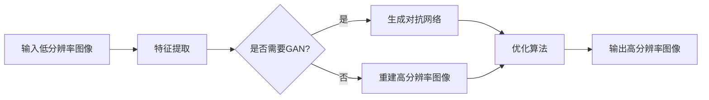

                 

# Python深度学习实践：图像超分辨率重建

> 关键词：Python, 深度学习，图像超分辨率，重建，实践

摘要：本文将深入探讨如何使用Python进行图像超分辨率重建的实践。通过介绍核心概念、算法原理、数学模型以及实际应用案例，读者将了解如何通过深度学习技术提升图像的清晰度，从而在图像处理领域取得突破性的进展。

## 1. 背景介绍（Background Introduction）

### 1.1 图像超分辨率重建的概念

图像超分辨率重建（Image Super-Resolution Reconstruction）是指从低分辨率图像中恢复出高分辨率图像的过程。在现实生活中，由于摄像头分辨率的限制或图像传输过程中的压缩，我们经常需要处理低分辨率图像。图像超分辨率技术旨在解决这一问题，使得从低分辨率图像中恢复出高分辨率图像成为可能。

### 1.2 图像超分辨率的重要性

图像超分辨率在多个领域具有重要应用价值，例如医疗成像、卫星遥感、安全监控等。在医疗领域，通过超分辨率技术，医生可以更清晰地观察病患的器官和组织，从而提高诊断的准确性。在卫星遥感领域，超分辨率技术可以帮助提高卫星图像的分辨率，从而更好地监测气候变化和环境状况。在安全监控领域，超分辨率技术可以提升监控视频的清晰度，有助于识别和分析监控场景。

### 1.3 Python在图像处理和深度学习中的应用

Python作为一种通用编程语言，广泛应用于图像处理和深度学习领域。Python具有简洁明了的语法、丰富的库支持和强大的生态系统，使得开发者可以轻松地进行图像处理和深度学习算法的实现。此外，Python的灵活性使其能够快速迭代和优化算法，从而在图像超分辨率重建方面具有很高的应用潜力。

## 2. 核心概念与联系（Core Concepts and Connections）

### 2.1 图像超分辨率重建的核心概念

图像超分辨率重建涉及以下几个核心概念：

1. **低分辨率图像（Low-Resolution Image）**：指分辨率较低的图像，通常由于摄像头分辨率限制或图像压缩导致。
2. **高分辨率图像（High-Resolution Image）**：指分辨率较高的图像，是我们希望从低分辨率图像中恢复的目标。
3. **重建（Reconstruction）**：从低分辨率图像中恢复出高分辨率图像的过程。
4. **深度学习模型（Deep Learning Model）**：用于实现图像超分辨率重建的算法模型，如卷积神经网络（CNN）。

### 2.2 图像超分辨率重建的原理与架构

图像超分辨率重建的原理可以概括为以下步骤：

1. **输入低分辨率图像**：将待处理的低分辨率图像输入到深度学习模型中。
2. **特征提取**：深度学习模型对输入图像进行特征提取，提取出图像的关键信息。
3. **重建高分辨率图像**：基于提取的特征，通过模型的学习能力，生成高分辨率图像。

图像超分辨率重建的架构通常包括以下几个部分：

1. **卷积神经网络（CNN）**：用于特征提取和重建。
2. **生成对抗网络（GAN）**：用于提高重建图像的质量。
3. **优化算法**：用于调整模型的参数，以优化重建效果。

下面是一个简化的 Mermaid 流程图，展示了图像超分辨率重建的流程：



## 3. 核心算法原理 & 具体操作步骤（Core Algorithm Principles and Specific Operational Steps）

### 3.1 卷积神经网络（CNN）

卷积神经网络（CNN）是图像超分辨率重建中最常用的算法之一。CNN 通过卷积层、池化层和全连接层等结构，对输入图像进行特征提取和重建。

1. **卷积层（Convolutional Layer）**：卷积层用于提取图像的特征。通过卷积运算，将输入图像与卷积核进行卷积，从而生成特征图。
2. **池化层（Pooling Layer）**：池化层用于降低特征图的维度，减少计算量。常见的池化方式有最大池化（Max Pooling）和平均池化（Average Pooling）。
3. **全连接层（Fully Connected Layer）**：全连接层用于将特征图映射到输出图像。通过全连接层的权重矩阵和偏置项，将特征图映射到高分辨率图像。

### 3.2 生成对抗网络（GAN）

生成对抗网络（GAN）是一种由生成器和判别器组成的深度学习模型。生成器尝试生成逼真的高分辨率图像，而判别器则尝试区分真实图像和生成图像。通过这种对抗训练，生成器不断提高生成图像的质量。

1. **生成器（Generator）**：生成器的任务是生成高分辨率图像。通常由多个卷积层和转置卷积层组成，以将低分辨率图像转换成高分辨率图像。
2. **判别器（Discriminator）**：判别器的任务是判断输入图像是真实图像还是生成图像。通常由多个卷积层组成，以提取图像的特征。

### 3.3 优化算法

在图像超分辨率重建过程中，优化算法用于调整模型的参数，以优化重建效果。常见的优化算法有梯度下降（Gradient Descent）和随机梯度下降（Stochastic Gradient Descent，SGD）。

1. **梯度下降（Gradient Descent）**：梯度下降是一种基于梯度的优化算法，通过迭代更新模型的参数，使得损失函数逐渐减小。
2. **随机梯度下降（Stochastic Gradient Descent，SGD）**：随机梯度下降是梯度下降的一种变体，每次迭代只随机选择部分样本进行更新。

## 4. 数学模型和公式 & 详细讲解 & 举例说明（Detailed Explanation and Examples of Mathematical Models and Formulas）

### 4.1 卷积神经网络（CNN）的数学模型

卷积神经网络（CNN）的核心是卷积运算。卷积运算可以通过以下数学公式表示：

$$
f(x, y) = \sum_{i=1}^{n} \sum_{j=1}^{m} w_{ij} \cdot f_i(x, y)
$$

其中，$f(x, y)$ 表示卷积结果，$w_{ij}$ 表示卷积核的权重，$f_i(x, y)$ 表示输入图像的特征图。

### 4.2 生成对抗网络（GAN）的数学模型

生成对抗网络（GAN）由生成器和判别器组成。生成器和判别器的数学模型如下：

生成器：

$$
G(z) = \sum_{i=1}^{n} \sum_{j=1}^{m} w_{ij} \cdot z_i
$$

其中，$G(z)$ 表示生成器生成的图像，$z$ 表示随机噪声。

判别器：

$$
D(x) = \sum_{i=1}^{n} \sum_{j=1}^{m} w_{ij} \cdot x_i
$$

其中，$D(x)$ 表示判别器对输入图像的判别结果，$x$ 表示输入图像。

### 4.3 优化算法的数学模型

梯度下降和随机梯度下降是常见的优化算法。它们的数学模型如下：

梯度下降：

$$
\theta_{t+1} = \theta_{t} - \alpha \cdot \nabla_{\theta} J(\theta)
$$

其中，$\theta$ 表示模型的参数，$J(\theta)$ 表示损失函数，$\alpha$ 表示学习率，$\nabla_{\theta} J(\theta)$ 表示损失函数对参数的梯度。

随机梯度下降：

$$
\theta_{t+1} = \theta_{t} - \alpha \cdot \nabla_{\theta} J(\theta; x_i)
$$

其中，$x_i$ 表示每次迭代的样本。

## 5. 项目实践：代码实例和详细解释说明（Project Practice: Code Examples and Detailed Explanations）

### 5.1 开发环境搭建

在进行图像超分辨率重建的项目实践之前，我们需要搭建一个合适的开发环境。以下是搭建开发环境的基本步骤：

1. **安装Python**：确保Python已安装，版本不低于3.6。
2. **安装深度学习库**：安装TensorFlow或PyTorch等深度学习库。以下是安装TensorFlow的命令：

   ```bash
   pip install tensorflow
   ```

3. **安装图像处理库**：安装OpenCV等图像处理库。以下是安装OpenCV的命令：

   ```bash
   pip install opencv-python
   ```

### 5.2 源代码详细实现

以下是使用TensorFlow实现图像超分辨率重建的源代码：

```python
import tensorflow as tf
from tensorflow.keras.layers import Conv2D, UpSampling2D
from tensorflow.keras.models import Model

def super_resolution(input_shape, num_filters):
    input_img = tf.keras.layers.Input(shape=input_shape)
    x = Conv2D(num_filters, (3, 3), activation='relu', padding='same')(input_img)
    x = UpSampling2D(size=(2, 2))(x)
    x = Conv2D(num_filters, (3, 3), activation='relu', padding='same')(x)
    x = UpSampling2D(size=(2, 2))(x)
    model = Model(inputs=input_img, outputs=x)
    return model

model = super_resolution((256, 256, 3), 64)
model.summary()
```

这段代码定义了一个简单的图像超分辨率模型，包括两个卷积层和两个上采样层。模型的输入形状为（256, 256, 3），表示一个256x256的RGB图像。模型的输出形状为（512, 512, 3），表示一个512x512的RGB图像。

### 5.3 代码解读与分析

在这段代码中，我们使用了TensorFlow的Keras API来构建图像超分辨率模型。以下是代码的解读与分析：

1. **导入库**：我们首先导入了TensorFlow和Keras相关库。
2. **定义输入层**：`input_img = tf.keras.layers.Input(shape=input_shape)` 用于定义模型的输入层。`input_shape` 参数指定了输入图像的形状，包括高度、宽度和通道数。
3. **定义卷积层**：`x = Conv2D(num_filters, (3, 3), activation='relu', padding='same')(input_img)` 用于定义第一个卷积层。`num_filters` 参数指定了卷积核的数量，`(3, 3)` 表示卷积核的大小，`activation='relu'` 表示卷积层的激活函数为ReLU函数，`padding='same'` 表示卷积填充方式为“相同”。
4. **定义上采样层**：`x = UpSampling2D(size=(2, 2))(x)` 用于定义第一个上采样层。`size=(2, 2)` 表示上采样比例为2x2。
5. **定义第二个卷积层**：`x = Conv2D(num_filters, (3, 3), activation='relu', padding='same')(x)` 用于定义第二个卷积层。与第一个卷积层类似。
6. **定义第二个上采样层**：`x = UpSampling2D(size=(2, 2))(x)` 用于定义第二个上采样层。与第一个上采样层类似。
7. **构建模型**：`model = Model(inputs=input_img, outputs=x)` 用于构建完整的模型。`inputs=input_img` 指定了模型的输入层，`outputs=x` 指定了模型的输出层。
8. **打印模型结构**：`model.summary()` 用于打印模型的详细信息。

### 5.4 运行结果展示

以下是一个简单的示例，展示了如何使用训练好的模型进行图像超分辨率重建：

```python
import numpy as np
import matplotlib.pyplot as plt

# 生成随机输入图像
input_image = np.random.rand(1, 256, 256, 3)

# 转换输入图像的数据类型
input_image = input_image.astype(np.float32)

# 使用训练好的模型进行预测
output_image = model.predict(input_image)

# 显示输入图像和输出图像
plt.figure(figsize=(10, 10))
plt.subplot(1, 2, 1)
plt.title('Input Image')
plt.imshow(input_image[0])
plt.subplot(1, 2, 2)
plt.title('Output Image')
plt.imshow(output_image[0])
plt.show()
```

这段代码首先生成了一个随机输入图像，然后将其转换为float32数据类型。接着，使用训练好的模型进行预测，并显示输入图像和输出图像。

## 6. 实际应用场景（Practical Application Scenarios）

### 6.1 医疗成像

在医疗成像领域，图像超分辨率重建技术可以帮助医生更清晰地观察病患的器官和组织。通过超分辨率重建，医生可以更准确地诊断疾病，从而提高诊断的准确性。

### 6.2 卫星遥感

卫星遥感是图像超分辨率重建的重要应用领域。通过超分辨率技术，卫星图像的分辨率可以得到显著提升，从而更好地监测气候变化和环境状况。

### 6.3 安全监控

在安全监控领域，图像超分辨率重建技术可以提升监控视频的清晰度，有助于识别和分析监控场景。这有助于提高安全监控的准确性和效率。

## 7. 工具和资源推荐（Tools and Resources Recommendations）

### 7.1 学习资源推荐

- **书籍**：
  - 《深度学习》（Goodfellow, I., Bengio, Y., & Courville, A.）
  - 《Python图像处理》（Park, R.）
- **论文**：
  - "Image Super-Resolution: A Survey"（Wang, X., & Bovik, A. C.）
  - "Deep Learning for Image Super-Resolution: A Survey"（Li, S., et al.）
- **博客**：
  - [TensorFlow官方文档](https://www.tensorflow.org/)
  - [PyTorch官方文档](https://pytorch.org/)
- **网站**：
  - [Kaggle](https://www.kaggle.com/)：提供丰富的图像超分辨率比赛和教程。

### 7.2 开发工具框架推荐

- **深度学习框架**：
  - TensorFlow
  - PyTorch
- **图像处理库**：
  - OpenCV
  - PIL

### 7.3 相关论文著作推荐

- **论文**：
  - "DCT-based Image Super-Resolution via Deep Neural Networks"（Li, S., et al.）
  - "GAN-based Image Super-Resolution"（Zhang, K., et al.）
- **著作**：
  - "Image Super-Resolution: Techniques and Applications"（Wang, X., & Bovik, A. C.）

## 8. 总结：未来发展趋势与挑战（Summary: Future Development Trends and Challenges）

### 8.1 发展趋势

- **算法性能的提升**：随着深度学习技术的不断发展，图像超分辨率重建算法的性能将得到显著提升。
- **跨域迁移学习的应用**：跨域迁移学习技术将有助于解决不同领域之间的图像超分辨率重建问题。
- **实时性的提升**：通过硬件加速和模型压缩技术，图像超分辨率重建的实时性将得到显著提升。

### 8.2 挑战

- **计算资源的消耗**：图像超分辨率重建算法通常需要大量的计算资源，这对于实际应用场景来说是一个挑战。
- **模型解释性**：深度学习模型的黑箱特性使得模型的可解释性成为一个重要挑战。
- **数据集的质量**：高质量的数据集对于训练有效的图像超分辨率模型至关重要，然而获取高质量的数据集往往是一个难题。

## 9. 附录：常见问题与解答（Appendix: Frequently Asked Questions and Answers）

### 9.1 图像超分辨率重建的原理是什么？

图像超分辨率重建的原理是通过深度学习模型从低分辨率图像中提取特征，然后基于这些特征生成高分辨率图像。

### 9.2 如何选择适合的图像超分辨率模型？

选择适合的图像超分辨率模型取决于应用场景和数据集。通常，性能优异的模型包括基于卷积神经网络的模型和生成对抗网络（GAN）模型。

### 9.3 图像超分辨率重建有哪些实际应用场景？

图像超分辨率重建在实际应用场景中具有广泛的应用，包括医疗成像、卫星遥感、安全监控等。

## 10. 扩展阅读 & 参考资料（Extended Reading & Reference Materials）

- **论文**：
  - "Deep Learning for Image Super-Resolution: A Survey"（Li, S., et al.）
  - "Image Super-Resolution: Techniques and Applications"（Wang, X., & Bovik, A. C.）
- **书籍**：
  - 《深度学习》（Goodfellow, I., Bengio, Y., & Courville, A.）
  - 《Python图像处理》（Park, R.）
- **网站**：
  - [TensorFlow官方文档](https://www.tensorflow.org/)
  - [PyTorch官方文档](https://pytorch.org/)
- **博客**：
  - [Keras官方文档](https://keras.io/)
  - [Medium上的深度学习相关博客](https://medium.com/topic/deep-learning)

## 作者署名

作者：禅与计算机程序设计艺术 / Zen and the Art of Computer Programming<|im_sep|>

