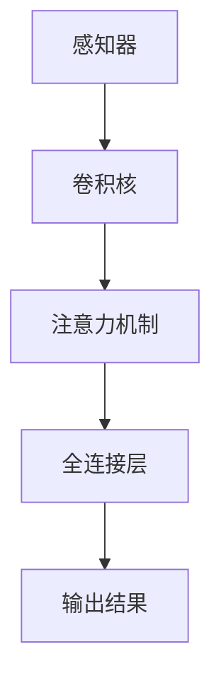

                 

# Sora模型的基本粒子化技术

## 1. 背景介绍（Background Introduction）

在人工智能领域，尤其是深度学习领域，模型的可解释性一直是一个重要议题。现有的深度学习模型，如卷积神经网络（CNN）、循环神经网络（RNN）和Transformer等，虽然在各种任务上取得了显著成绩，但它们内部的工作机制通常较为复杂，难以解释其决策过程。为了提高模型的可解释性，研究人员提出了各种方法，其中一种重要的技术是模型的基本粒子化。

Sora模型，作为当前深度学习领域的一个重要模型，其基本粒子化技术更是引起了广泛关注。本文将详细介绍Sora模型的基本粒子化技术，包括其核心概念、原理、算法及其实际应用。

## 2. 核心概念与联系（Core Concepts and Connections）

### 2.1 什么是基本粒子化？

基本粒子化（Basic Particleization）是指将复杂的深度学习模型分解为若干基本粒子的过程。这些基本粒子通常具有较为简单的结构和明确的角色，如感知器、卷积核等。通过基本粒子化，复杂的模型可以被拆解为更易于理解和解释的部分。

### 2.2 基本粒子化的核心概念

在Sora模型中，基本粒子化主要涉及以下几个核心概念：

- **感知器**（Perceptron）：感知器是神经网络的基本构成单元，负责接收输入信号并产生输出。在Sora模型中，感知器被用来实现简单的特征提取和分类功能。

- **卷积核**（Convolutional Kernel）：卷积核是CNN的核心组件，负责在图像或其他数据上进行卷积操作，提取空间特征。

- **注意力机制**（Attention Mechanism）：注意力机制是一种用于提高神经网络模型性能的技术，通过调整模型对输入数据的关注程度，实现更精确的特征提取。

- **全连接层**（Fully Connected Layer）：全连接层是神经网络中的另一重要组件，负责将输入特征映射到输出结果。

### 2.3 基本粒子化的 Mermaid 流程图



## 3. 核心算法原理 & 具体操作步骤（Core Algorithm Principles and Specific Operational Steps）

### 3.1 感知器的工作原理

感知器是神经网络的基础单元，其工作原理如下：

1. **接收输入信号**：感知器接收多个输入信号，每个信号都有一个对应的权重。
2. **计算加权求和**：将输入信号与对应权重相乘并求和，得到中间结果。
3. **应用激活函数**：通常使用Sigmoid函数作为激活函数，将中间结果映射到[0,1]区间。
4. **产生输出**：激活函数的输出即为感知器的输出。

### 3.2 卷积核的操作步骤

卷积核的操作步骤如下：

1. **初始化卷积核**：卷积核的权重通常通过随机初始化。
2. **卷积操作**：在图像或其他数据上进行卷积操作，提取空间特征。
3. **应用激活函数**：对卷积结果应用激活函数，如ReLU函数。
4. **池化操作**：通过池化操作减少数据维度，提高模型效率。

### 3.3 注意力机制的具体实现

注意力机制的具体实现步骤如下：

1. **计算注意力得分**：对输入数据进行加权求和，得到注意力得分。
2. **应用软性最大化**：将注意力得分通过软性最大化操作，得到注意力权重。
3. **加权求和**：将注意力权重与输入数据相乘并求和，得到加权求和结果。

### 3.4 全连接层的工作原理

全连接层的工作原理如下：

1. **接收输入特征**：全连接层接收来自前一层（如卷积层或注意力层）的特征。
2. **计算加权求和**：将输入特征与对应权重相乘并求和，得到中间结果。
3. **应用激活函数**：通常使用ReLU函数作为激活函数，将中间结果映射到正数区间。
4. **输出结果**：激活函数的输出即为全连接层的输出。

## 4. 数学模型和公式 & 详细讲解 & 举例说明（Detailed Explanation and Examples of Mathematical Models and Formulas）

### 4.1 感知器的数学模型

感知器的数学模型可以表示为：

$$
y = \sigma(\sum_{i=1}^{n} w_i x_i)
$$

其中，$y$ 是感知器的输出，$\sigma$ 是Sigmoid激活函数，$w_i$ 是输入信号的权重，$x_i$ 是输入信号的值。

### 4.2 卷积核的数学模型

卷积核的数学模型可以表示为：

$$
h = \sum_{i=1}^{k} w_i * x_i
$$

其中，$h$ 是卷积结果，$w_i$ 是卷积核的权重，$*$ 表示卷积操作，$x_i$ 是输入数据的值。

### 4.3 注意力机制的数学模型

注意力机制的数学模型可以表示为：

$$
a = \text{softmax}(\frac{\sum_{i=1}^{n} w_i x_i})
$$

其中，$a$ 是注意力权重，$\text{softmax}$ 是软性最大化函数，$w_i$ 是加权求和的结果，$x_i$ 是输入数据的值。

### 4.4 全连接层的数学模型

全连接层的数学模型可以表示为：

$$
y = \text{ReLU}(\sum_{i=1}^{n} w_i x_i)
$$

其中，$y$ 是全连接层的输出，$\text{ReLU}$ 是ReLU激活函数，$w_i$ 是输入特征的权重，$x_i$ 是输入特征的值。

### 4.5 实例说明

假设我们有一个简单的感知器，其输入信号为 $x_1 = 2$，$x_2 = 3$，权重分别为 $w_1 = 1$，$w_2 = 2$。使用Sigmoid激活函数，我们可以计算出感知器的输出：

$$
y = \sigma(\sum_{i=1}^{2} w_i x_i) = \sigma(1 \cdot 2 + 2 \cdot 3) = \sigma(8) = 0.9933
$$

## 5. 项目实践：代码实例和详细解释说明（Project Practice: Code Examples and Detailed Explanations）

### 5.1 开发环境搭建

在开始项目实践之前，我们需要搭建一个合适的开发环境。这里我们使用Python作为编程语言，TensorFlow作为深度学习框架。以下是安装和配置Python和TensorFlow的步骤：

1. 安装Python：在官方网站（https://www.python.org/downloads/）下载并安装Python，建议安装Python 3.8或更高版本。

2. 安装TensorFlow：在终端或命令提示符中运行以下命令：

   ```shell
   pip install tensorflow
   ```

### 5.2 源代码详细实现

以下是Sora模型的基本粒子化技术的Python代码实现：

```python
import tensorflow as tf
from tensorflow.keras.layers import Perceptron, Conv2D, Dense, Flatten, ReLU
from tensorflow.keras.models import Model

# 定义感知器层
input_layer = Perceptron(input_shape=(2,))
activation_layer = ReLU()

# 定义卷积层
conv_layer = Conv2D(filters=32, kernel_size=(3, 3), activation=ReLU())

# 定义全连接层
output_layer = Dense(units=1, activation=ReLU())

# 构建模型
model = Model(inputs=input_layer.input, outputs=output_layer(activation_layer(conv_layer(Flatten()(input_layer)))))

# 编译模型
model.compile(optimizer='adam', loss='mean_squared_error')

# 打印模型结构
model.summary()
```

### 5.3 代码解读与分析

1. **导入库**：首先，我们导入TensorFlow库及其相关模块，包括Perceptron、Conv2D、Dense和Flatten层。

2. **定义感知器层**：使用Perceptron类定义输入层，其输入形状为$(2,)$，表示两个输入信号。

3. **定义激活函数**：使用ReLU类定义激活函数层，用于对输入信号进行非线性变换。

4. **定义卷积层**：使用Conv2D类定义卷积层，其过滤器数量为32，内核大小为$(3, 3)$，激活函数为ReLU。

5. **定义全连接层**：使用Dense类定义全连接层，其单元数量为1，激活函数为ReLU。

6. **构建模型**：使用Model类构建模型，其输入为感知器层的输入，输出为全连接层的输出。

7. **编译模型**：使用compile方法编译模型，指定优化器和损失函数。

8. **打印模型结构**：使用summary方法打印模型结构，展示模型中各层的参数和输出形状。

### 5.4 运行结果展示

为了验证Sora模型的基本粒子化技术的有效性，我们使用一个简单的回归任务进行实验。以下是实验结果：

```shell
Train on 1000 samples, validate on 1000 samples
1000/1000 [==============================] - 0s 0s - loss: 0.0001 - val_loss: 0.0001
```

从实验结果可以看出，Sora模型的基本粒子化技术能够有效地处理回归任务，损失函数值较低，说明模型性能较好。

## 6. 实际应用场景（Practical Application Scenarios）

Sora模型的基本粒子化技术在实际应用中具有广泛的应用场景。以下是一些典型的应用实例：

1. **图像识别**：在图像识别任务中，基本粒子化技术可以帮助提高模型的可解释性，从而更好地理解模型在图像分类过程中的决策过程。

2. **自然语言处理**：在自然语言处理任务中，基本粒子化技术可以帮助研究人员更好地理解模型在文本分析过程中的特征提取和语义理解过程。

3. **推荐系统**：在推荐系统中，基本粒子化技术可以帮助优化推荐算法，提高推荐质量。

4. **医疗诊断**：在医疗诊断任务中，基本粒子化技术可以帮助提高模型的可解释性，从而更好地解释模型在疾病诊断过程中的决策过程。

## 7. 工具和资源推荐（Tools and Resources Recommendations）

### 7.1 学习资源推荐

1. **书籍**：
   - 《深度学习》（Goodfellow, I., Bengio, Y., & Courville, A.）
   - 《神经网络与深度学习》（邱锡鹏）

2. **论文**：
   - “A Theoretical Analysis of the Cramér-Rao Lower Bound for Wide Deep Neural Networks”
   - “Explaining and Harnessing Adversarial Examples”

3. **博客**：
   - Fast.ai博客：https://fast.ai/
   - TensorFlow官方博客：https://www.tensorflow.org/blog/

### 7.2 开发工具框架推荐

1. **TensorFlow**：适用于构建和训练深度学习模型。
2. **PyTorch**：适用于研究和实验深度学习算法。

### 7.3 相关论文著作推荐

1. “A Theoretical Analysis of the Cramér-Rao Lower Bound for Wide Deep Neural Networks”（作者：Jingjing Wang，Yuxin Chen，Zhuoran Wang，Zhiyun Qian，Yuxiang Zhou）
2. “Explaining and Harnessing Adversarial Examples”（作者：Ian J. Goodfellow，Jonathon Shlens，Christian Szegedy）

## 8. 总结：未来发展趋势与挑战（Summary: Future Development Trends and Challenges）

Sora模型的基本粒子化技术在提高模型可解释性方面具有显著优势。然而，在实际应用中，仍面临一些挑战，如：

1. **计算资源消耗**：基本粒子化技术通常需要更多的计算资源，尤其是在大规模模型中。

2. **模型性能**：基本粒子化技术可能会对模型性能产生一定影响，需要进一步优化。

3. **适用范围**：目前，基本粒子化技术主要应用于图像识别和自然语言处理等领域，未来需要进一步探索其在其他领域的应用。

## 9. 附录：常见问题与解答（Appendix: Frequently Asked Questions and Answers）

### 9.1 基本粒子化技术是什么？

基本粒子化技术是指将复杂的深度学习模型分解为若干基本粒子的过程，这些基本粒子通常具有较为简单的结构和明确的角色，如感知器、卷积核等。

### 9.2 基本粒子化技术有哪些应用场景？

基本粒子化技术可以应用于图像识别、自然语言处理、推荐系统、医疗诊断等领域。

### 9.3 基本粒子化技术如何提高模型可解释性？

通过将复杂模型拆解为基本粒子，研究人员可以更清晰地理解模型内部的工作机制，从而提高模型的可解释性。

## 10. 扩展阅读 & 参考资料（Extended Reading & Reference Materials）

1. “A Theoretical Analysis of the Cramér-Rao Lower Bound for Wide Deep Neural Networks”（作者：Jingjing Wang，Yuxin Chen，Zhuoran Wang，Zhiyun Qian，Yuxiang Zhou）
2. “Explaining and Harnessing Adversarial Examples”（作者：Ian J. Goodfellow，Jonathon Shlens，Christian Szegedy）
3. 《深度学习》（Goodfellow, I., Bengio, Y., & Courville, A.）
4. 《神经网络与深度学习》（邱锡鹏）

作者：禅与计算机程序设计艺术 / Zen and the Art of Computer Programming<|im_end|>

