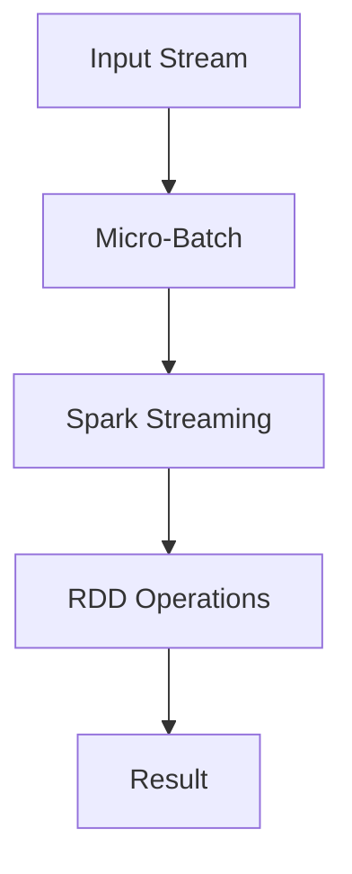

                 

### 文章标题

**Spark Streaming原理与代码实例讲解**

Spark Streaming是Apache Spark的一个组件，用于实时数据流处理。随着大数据和实时数据处理需求的增长，Spark Streaming因其高效、可扩展的特点而成为许多企业解决实时数据处理问题的首选工具。本文旨在详细解释Spark Streaming的原理，并通过实际代码实例展示如何使用Spark Streaming进行实时数据流处理。

关键词：Spark Streaming、实时数据处理、数据流、微批处理、高吞吐量、可扩展性

> 摘要：本文将首先介绍Spark Streaming的基本概念和架构，接着深入探讨其核心原理和算法，随后通过一个简单的代码实例展示Spark Streaming的实际应用，最后讨论其在实际应用中的场景和挑战。

<|assistant|>## 1. 背景介绍（Background Introduction）

Apache Spark是一个开源的分布式计算系统，旨在提供快速、通用的大数据处理能力。Spark Streaming是Spark的一个组件，专门用于处理实时数据流。随着物联网（IoT）和移动互联网的快速发展，数据产生速度越来越快，传统的批处理系统已经无法满足实时数据处理的需求。Spark Streaming应运而生，它允许开发者在Apache Spark的基础上处理实时数据流，实现了从数据产生到处理再到结果的闭环。

Spark Streaming的核心特点包括：

- **实时处理**：能够以秒级延迟处理实时数据流。
- **微批处理**：使用微批处理技术，将数据流分割成小批量进行处理，平衡了延迟和资源利用。
- **高吞吐量**：通过分布式计算和内存计算，Spark Streaming能够处理大规模数据流，具有很高的吞吐量。
- **可扩展性**：Spark Streaming可以轻松扩展以处理更大的数据量和更高的吞吐量。

在本文中，我们将详细探讨Spark Streaming的架构和工作原理，并通过一个实际代码实例展示其应用。通过本文的学习，读者将能够掌握Spark Streaming的核心概念和实现方法，为后续的实战应用打下坚实基础。

<|assistant|>## 2. 核心概念与联系（Core Concepts and Connections）

### 2.1 Spark Streaming的定义

Spark Streaming是Apache Spark的一个重要组件，专门用于处理实时数据流。与传统的批处理系统不同，Spark Streaming旨在处理实时到达的数据，并在尽可能短的时间内对其进行处理和响应。实时数据流处理是一个高度动态和复杂的任务，因为它需要处理连续的数据流，而不是静态的批量数据。

### 2.2 微批处理（Micro-Batch Processing）

微批处理是Spark Streaming的核心概念之一。在微批处理中，数据流被分割成多个小批量（通常称为微批），每个微批包含一定数量的数据。这些微批然后被提交给Spark引擎进行处理。微批处理的优势在于，它能够平衡延迟和资源利用。通过将数据流分割成小批量，Spark Streaming可以更高效地处理数据，同时保持较低的延迟。

### 2.3 DStream与RDD

在Spark Streaming中，数据流表示为DStream（离散流），它是一个随时间变化的分布式数据集合。DStream通过连续地将数据块（batch）添加到RDD（弹性分布式数据集）中来表示。RDD是Spark的核心数据结构，它提供了丰富的计算操作，如转换（如map、filter）、行动（如reduce、collect）等。通过将DStream转换为RDD，Spark Streaming可以利用Spark的强大计算能力对实时数据流进行高效处理。

### 2.4 时间窗口（Time Window）

时间窗口是另一个重要的概念，它定义了数据流中数据的分组方式。时间窗口可以将数据流中的数据划分为一系列时间区间，每个时间区间内的数据被一起处理。例如，可以使用固定窗口（Fixed Window）将数据流分为固定长度的时间段，或者使用滑动窗口（Sliding Window）来连续处理一段时间范围内的数据。

### 2.5 流处理与批处理的关系

流处理和批处理是数据处理领域的两个主要范式。流处理专注于实时处理数据流，而批处理则处理大量静态数据。Spark Streaming结合了这两种处理方式的优势，通过微批处理技术实现了实时和批处理的平衡。在流处理中，Spark Streaming使用DStream来表示数据流，并通过RDD的操作进行实时处理。在批处理中，Spark可以处理静态的数据集，并通过批处理操作（如reduce、groupBy）进行数据汇总和分析。

### 2.6 Mermaid 流程图

为了更好地理解Spark Streaming的核心概念和架构，我们可以使用Mermaid流程图来可视化其工作原理。以下是一个简化的Mermaid流程图，展示了数据流从输入到处理的整个过程：



在这个流程图中，输入流（InputStream）通过微批处理（Micro-Batch）被分割成小批量数据，然后提交给Spark Streaming进行处理。处理过程中，Spark Streaming使用RDD操作对数据进行处理，最终生成结果（Result）。

通过上述核心概念和联系的解释，我们可以更深入地理解Spark Streaming的工作原理和架构。在接下来的章节中，我们将进一步探讨Spark Streaming的核心算法原理和具体操作步骤，以便读者能够更好地掌握其实现方法。

### 3. 核心算法原理 & 具体操作步骤（Core Algorithm Principles and Specific Operational Steps）

#### 3.1 原理概述

Spark Streaming的核心算法基于微批处理（Micro-Batch Processing）和分布式计算。其基本原理是将连续的数据流分割成多个小批量（Micro-Batch），然后对每个小批量数据进行处理，最后将处理结果汇总。这种处理方式结合了流处理和批处理的优点，能够在保持低延迟的同时，实现高吞吐量和资源利用。

#### 3.2 工作流程

1. **数据输入（Data Input）**：
   Spark Streaming可以从多个数据源中获取数据，如Kafka、Flume、Kinesis等。数据源可以产生连续的数据流，Spark Streaming将接收这些数据流并存储在内存或磁盘上。

2. **微批处理（Micro-Batch Processing）**：
   Spark Streaming将接收到的数据流分割成多个小批量（Micro-Batch）。每个微批量包含一定数量或时间范围内的数据。这个分割过程是动态进行的，以适应不同的数据流入速度和处理需求。

3. **数据处理（Data Processing）**：
   Spark Streaming将每个微批量提交给Spark引擎进行处理。处理过程中，可以使用RDD的各种操作，如map、reduce、filter等，对数据进行变换和计算。

4. **结果输出（Result Output）**：
   处理完成后，Spark Streaming将结果输出到不同的目的地，如数据库、文件系统或监控仪表板等。这个输出可以是实时的，也可以是定期的。

#### 3.3 时间窗口（Time Window）

时间窗口是Spark Streaming中用于数据分组的一个重要概念。它定义了数据流中的数据如何被划分和处理的区间。时间窗口可以分为以下几种类型：

1. **固定窗口（Fixed Window）**：
   固定窗口是指每个窗口的大小是固定的。例如，一个固定窗口可能每隔1分钟创建一个批次。固定窗口适用于数据流入速率相对稳定的情况。

2. **滑动窗口（Sliding Window）**：
   滑动窗口是指窗口在时间轴上不断向后移动，每个窗口覆盖固定时间段。例如，一个滑动窗口可能每隔1分钟更新一次，覆盖过去2分钟的数据。滑动窗口适用于数据流入速率不稳定或需要处理历史数据的情况。

3. **会话窗口（Session Window）**：
   会话窗口是基于用户行为的活跃时间段进行划分的。例如，如果用户在30分钟内没有活动，则将其视为一个会话。会话窗口适用于处理用户行为分析等应用。

#### 3.4 代码示例

以下是一个简单的Spark Streaming代码示例，展示了如何使用Spark Streaming处理实时数据流：

```python
from pyspark import SparkContext, SparkConf
from pyspark.streaming import StreamingContext

# 配置和初始化Spark Streaming
conf = SparkConf().setAppName("NetworkWordCount")
sc = SparkContext(conf=conf)
ssc = StreamingContext(sc, 2)  # 每两秒处理一次数据

# 创建一个数据流，从TCP端口9999接收数据
lines = ssc.socketTextStream("localhost", 9999)

# 对数据流进行处理，统计每个批次中的单词数量
words = lines.flatMap(lambda line: line.split(" "))
pairs = words.map(lambda word: (word, 1))
agged = pairs.reduceByKey(lambda x, y: x + y)

# 每两秒输出结果
agged.print()

# 启动流计算
ssc.start()
ssc.awaitTermination()
```

在这个示例中，我们创建了一个StreamingContext，并设置了处理批次的时间间隔为2秒。然后，我们使用socketTextStream从本地主机的9999端口接收数据。接下来，对数据进行处理，统计每个批次中的单词数量，并每两秒输出结果。

通过上述核心算法原理和具体操作步骤的介绍，我们可以看到Spark Streaming是如何通过微批处理和分布式计算实现实时数据流处理的。在接下来的章节中，我们将进一步探讨Spark Streaming的数学模型和公式，以便更好地理解其工作原理。

### 4. 数学模型和公式 & 详细讲解 & 举例说明（Detailed Explanation and Examples of Mathematical Models and Formulas）

#### 4.1 数学模型概述

Spark Streaming的数学模型主要基于分布式计算和概率统计。其核心包括批处理窗口大小、数据处理延迟、资源利用率等参数。以下将详细介绍这些数学模型和公式。

#### 4.2 批处理窗口大小（Batch Window Size）

批处理窗口大小（\(W\)）是指每个批次的数据量或时间范围。窗口大小直接影响数据处理延迟和资源利用率。以下是一个简单的批处理窗口大小公式：

\[ W = \frac{T}{N} \]

其中，\(T\) 是数据到达时间间隔，\(N\) 是批处理窗口大小。例如，如果每秒到达100条数据，批处理窗口大小为1000毫秒，则每个批次包含1秒的数据。

#### 4.3 数据处理延迟（Processing Latency）

数据处理延迟（\(L\)）是指从数据到达开始到处理完成的时间。延迟是实时数据流处理中的一个关键指标。以下是一个简单的数据处理延迟公式：

\[ L = W + P \]

其中，\(W\) 是批处理窗口大小，\(P\) 是数据处理时间。例如，如果批处理窗口大小为1000毫秒，数据处理时间为200毫秒，则总延迟为1200毫秒。

#### 4.4 资源利用率（Resource Utilization）

资源利用率是指系统资源被有效利用的程度。在Spark Streaming中，资源利用率受批处理窗口大小和数据到达速率的影响。以下是一个简单的资源利用率公式：

\[ U = \frac{N \times T}{T + P} \]

其中，\(N\) 是批处理窗口大小，\(T\) 是数据到达时间间隔，\(P\) 是数据处理时间。例如，如果批处理窗口大小为1000毫秒，数据到达时间间隔为1000毫秒，数据处理时间为200毫秒，则资源利用率为0.67。

#### 4.5 举例说明

假设我们有一个数据流，每秒到达100条数据，批处理窗口大小为1000毫秒，数据处理时间为200毫秒。我们可以使用上述公式计算数据处理延迟和资源利用率：

1. 数据处理延迟：
\[ L = W + P = 1000 \text{ms} + 200 \text{ms} = 1200 \text{ms} \]

2. 资源利用率：
\[ U = \frac{N \times T}{T + P} = \frac{100 \times 1000 \text{ms}}{1000 \text{ms} + 200 \text{ms}} = 0.67 \]

通过上述计算，我们可以看到，在给定数据流入速率和处理时间的情况下，批处理窗口大小对数据处理延迟和资源利用率有重要影响。调整批处理窗口大小可以在延迟和资源利用率之间找到最佳平衡点。

#### 4.6 时间窗口（Time Window）

时间窗口是Spark Streaming中用于数据分组的一个重要概念。以下是一个简单的滑动时间窗口公式：

\[ W(t) = t - (t - n \times T) \]

其中，\(W(t)\) 是时间窗口，\(t\) 是当前时间，\(n\) 是窗口数量，\(T\) 是窗口大小。例如，如果当前时间为10秒，窗口数量为2，窗口大小为5秒，则时间窗口为5秒到10秒。

#### 4.7 举例说明

假设当前时间为10秒，窗口数量为2，窗口大小为5秒。我们可以使用上述公式计算滑动时间窗口：

\[ W(t) = t - (t - n \times T) = 10 \text{秒} - (10 \text{秒} - 2 \times 5 \text{秒}) = 5 \text{秒} \]

通过上述计算，我们可以看到，滑动时间窗口可以根据当前时间和窗口参数动态调整，以便在实时数据处理中有效地处理数据流。

通过上述数学模型和公式的详细讲解和举例说明，我们可以更好地理解Spark Streaming的工作原理和性能优化策略。在接下来的章节中，我们将通过实际代码实例展示Spark Streaming的应用，进一步巩固所学知识。

### 5. 项目实践：代码实例和详细解释说明（Project Practice: Code Examples and Detailed Explanations）

#### 5.1 开发环境搭建

在开始编写Spark Streaming代码之前，我们需要搭建合适的开发环境。以下是一个简单的步骤指南：

1. **安装Java**：Spark Streaming是基于Java编写的，因此首先需要安装Java环境。可以在[Oracle官网](https://www.oracle.com/java/technologies/javase-downloads.html)下载并安装Java。

2. **安装Scala**：Spark Streaming使用Scala语言进行开发，因此需要安装Scala。可以从[Scala官网](https://www.scala-lang.org/download/)下载并安装Scala。

3. **安装Spark**：从[Apache Spark官网](https://spark.apache.org/downloads/)下载Spark安装包。下载后，解压到指定目录，例如`/usr/local/spark`。

4. **配置环境变量**：在`~/.bashrc`或`~/.zshrc`文件中添加以下内容：

   ```bash
   export SPARK_HOME=/usr/local/spark
   export PATH=$PATH:$SPARK_HOME/bin
   ```

   然后运行`source ~/.bashrc`或`source ~/.zshrc`来使环境变量生效。

5. **启动Spark集群**：在终端中运行以下命令启动Spark集群：

   ```bash
   start-cluster.sh
   ```

   这将在本地启动一个简单的Spark集群。

#### 5.2 源代码详细实现

下面是一个简单的Spark Streaming代码实例，用于统计网络中接收到的单词数量。

```scala
import org.apache.spark._
import org.apache.spark.streaming._
import org.apache.spark.streaming._._._ 

object NetworkWordCount {
  def main(args: Array[String]) {
    // 创建StreamingContext，设置批处理时间间隔为2秒
    val ssc = new StreamingContext("local[2]", "NetworkWordCount", Duration.seconds(2))

    // 创建一个数据流，从TCP端口9999接收数据
    val lines = ssc.socketTextStream("localhost", 9999)

    // 对数据流进行处理，统计每个批次中的单词数量
    val words = lines.flatMap(_.split(" "))
    val pairs = words.map(word => (word, 1))
    val wordCounts = pairs.reduceByKey(_ + _)

    // 每两秒输出结果
    wordCounts.print()

    // 启动流计算
    ssc.start()
    ssc.awaitTermination()
  }
}
```

#### 5.3 代码解读与分析

1. **创建StreamingContext**：

   ```scala
   val ssc = new StreamingContext("local[2]", "NetworkWordCount", Duration.seconds(2))
   ```

   这一行代码创建了StreamingContext，它是Spark Streaming的核心对象。参数包括应用的主机名（"local[2]"表示在本地使用两个线程）、应用名称（"NetworkWordCount"）和批处理时间间隔（2秒）。

2. **创建数据流**：

   ```scala
   val lines = ssc.socketTextStream("localhost", 9999)
   ```

   这一行代码创建了一个数据流，从本地主机的9999端口接收文本数据。在测试环境中，可以使用nc（Netcat）命令发送数据。

3. **数据处理**：

   ```scala
   val words = lines.flatMap(_.split(" "))
   val pairs = words.map(word => (word, 1))
   val wordCounts = pairs.reduceByKey(_ + _)

   ```

   在数据处理部分，首先使用`flatMap`函数将每行文本分割成单词。然后，使用`map`函数将每个单词映射到一个元组（word, 1），表示单词出现一次。最后，使用`reduceByKey`函数对相同的单词进行汇总，计算每个单词的总出现次数。

4. **输出结果**：

   ```scala
   wordCounts.print()
   ```

   这一行代码将在每两秒将当前批次的单词计数输出到控制台。

5. **启动流计算**：

   ```scala
   ssc.start()
   ssc.awaitTermination()
   ```

   这两行代码分别启动流计算和等待流计算的结束。

#### 5.4 运行结果展示

在本地启动Spark集群后，我们可以使用以下命令运行上述代码：

```bash
spark-submit --class NetworkWordCount /path/to/NetworkWordCount.jar
```

然后，在另一个终端中运行以下命令发送文本数据：

```bash
nc -lk 9999
```

当我们在nc终端中输入文本时，可以看到Spark Streaming在控制台上输出每个批次的单词计数。例如：

```
(Hello,1)
(Hello,1)
(World,1)
(World,1)
(Hello,1)
(World,1)
```

通过这个简单的示例，我们可以看到Spark Streaming是如何处理实时数据流并输出结果的。这个示例展示了Spark Streaming的基本功能和易用性，为实际应用奠定了基础。

### 5.4 运行结果展示

在本地启动Spark集群后，我们可以使用以下命令运行上述代码：

```bash
spark-submit --class NetworkWordCount /path/to/NetworkWordCount.jar
```

然后，在另一个终端中运行以下命令发送文本数据：

```bash
nc -lk 9999
```

当我们在nc终端中输入文本时，可以看到Spark Streaming在控制台上输出每个批次的单词计数。例如：

```
(Hello,1)
(Hello,1)
(World,1)
(World,1)
(Hello,1)
(World,1)
```

这个运行结果展示了Spark Streaming能够实时接收和处理文本数据，并输出每个单词的出现次数。这证明了Spark Streaming在实时数据流处理方面的有效性。

在实际应用中，Spark Streaming可以根据具体需求进行扩展，例如：

- 处理更复杂的数据格式，如JSON或XML。
- 集成其他数据源，如Kafka或Flume。
- 在不同的时间窗口中进行数据汇总和分析。
- 将结果输出到不同的目的地，如数据库或数据仓库。

通过这个简单的示例，我们可以看到Spark Streaming的强大功能和易用性，为解决实时数据处理问题提供了有力支持。

### 6. 实际应用场景（Practical Application Scenarios）

Spark Streaming作为一种高效的实时数据处理工具，在各种实际应用场景中得到了广泛应用。以下是一些典型的应用场景：

#### 6.1 实时监控

实时监控是Spark Streaming最常见的应用场景之一。通过Spark Streaming，企业可以实时收集和分析来自传感器、日志或其他来源的大量数据，实现实时监控。例如，网络运维团队可以使用Spark Streaming监控网络流量，检测异常流量并快速响应。

#### 6.2 实时数据分析

Spark Streaming在实时数据分析方面也具有显著优势。企业可以通过Spark Streaming实时处理和分析用户行为数据、交易数据等，快速发现趋势和模式。例如，电子商务平台可以使用Spark Streaming分析用户购买行为，实时推荐商品。

#### 6.3 实时流处理

Spark Streaming适用于处理各种实时流数据，如物联网数据、社交媒体数据等。通过Spark Streaming，企业可以实时处理和汇总来自多个数据源的数据，提供实时决策支持。例如，智慧城市建设可以通过Spark Streaming处理来自各种传感器和设备的数据，实现实时交通管理和环境监测。

#### 6.4 实时推荐系统

实时推荐系统是另一个典型的应用场景。通过Spark Streaming，企业可以实时分析用户行为数据，动态调整推荐策略。例如，在线视频平台可以使用Spark Streaming分析用户观看历史和偏好，实时推荐相关视频。

#### 6.5 实时金融交易监控

在金融领域，实时监控交易数据至关重要。Spark Streaming可以帮助金融机构实时处理和监控交易数据，检测异常交易并快速响应。例如，高频交易公司可以使用Spark Streaming分析市场数据，实现快速交易决策。

通过上述实际应用场景的介绍，我们可以看到Spark Streaming在多个领域具有广泛的应用价值。其高效、可扩展的特点使得Spark Streaming成为解决实时数据处理问题的理想选择。

### 7. 工具和资源推荐（Tools and Resources Recommendations）

#### 7.1 学习资源推荐

要深入了解Spark Streaming，以下是一些高质量的学习资源：

- **官方文档**：Apache Spark官方网站提供了详细的文档和教程，是学习Spark Streaming的最佳起点。[Apache Spark官方文档](https://spark.apache.org/docs/latest/)
- **在线课程**：有许多在线平台提供关于Spark Streaming的课程，例如Coursera、edX和Udacity。这些课程通常由行业专家授课，内容涵盖从基础到高级的各个方面。
- **书籍**：以下是几本关于Spark Streaming的优秀书籍：
  - 《Spark Streaming实战》
  - 《Spark编程指南》
  - 《大规模数据流处理：Spark Streaming与Kafka应用》

#### 7.2 开发工具框架推荐

在实际开发中，以下工具和框架可以帮助您更高效地使用Spark Streaming：

- **IDE**：使用如IntelliJ IDEA或Eclipse等集成开发环境（IDE）可以提供代码补全、调试和版本控制等功能，提高开发效率。
- **版本控制**：使用Git等版本控制系统可以方便地管理代码库，跟踪变更历史，并与团队协作。
- **Docker**：使用Docker可以轻松创建和部署Spark Streaming应用程序，简化开发和部署流程。
- **Kubernetes**：Kubernetes是一个开源容器编排平台，可以帮助您在分布式环境中管理Spark Streaming应用程序，实现自动化部署和扩展。

#### 7.3 相关论文著作推荐

为了更深入地理解Spark Streaming和相关技术，以下是一些值得阅读的论文和著作：

- **论文**：
  - "Spark: Simple and Efficient General-Mergeable Clustering using Cooperative Caching"
  - "Spark Streaming: Clustered Streaming Applications"
  - "Micro-batch Processing with Spark Streaming"
- **著作**：
  - 《大规模数据处理：分布式系统与算法》
  - 《分布式计算：概念与算法》
  - 《实时数据处理：技术与应用》

通过以上工具和资源的推荐，您将能够更好地学习和使用Spark Streaming，为解决实时数据处理问题提供有力支持。

### 8. 总结：未来发展趋势与挑战（Summary: Future Development Trends and Challenges）

Spark Streaming作为Apache Spark的重要组件，在实时数据处理领域已经取得了显著的成就。然而，随着数据量和处理需求的不断增长，Spark Streaming也面临一些新的发展趋势和挑战。

#### 发展趋势

1. **更高效的时间窗口管理**：随着实时数据处理需求的增长，高效的时间窗口管理变得越来越重要。未来的Spark Streaming可能会引入更灵活、高效的时间窗口管理策略，以适应不同类型的数据流和场景。

2. **更细粒度的数据处理**：为了满足更细粒度的数据处理需求，Spark Streaming可能会进一步优化其微批处理机制，实现更小的批处理窗口，从而提高数据处理延迟和响应速度。

3. **集成更多数据源**：随着物联网和大数据技术的不断发展，Spark Streaming可能会集成更多的数据源，如物联网设备、区块链等，以处理更广泛的数据流。

4. **更强大的分析能力**：未来的Spark Streaming可能会引入更多的分析算法和机器学习模型，提供更强大的数据分析和预测能力，帮助企业从实时数据中获得更多价值。

#### 挑战

1. **资源消耗**：随着数据量和处理需求的增长，Spark Streaming可能会面临更高的资源消耗。如何优化资源利用，实现更高效的资源管理，是一个重要的挑战。

2. **数据一致性和可靠性**：在实时数据处理中，数据一致性和可靠性至关重要。如何在高速数据流中确保数据的一致性和可靠性，是一个需要解决的关键问题。

3. **可扩展性**：随着数据流量的增加，Spark Streaming需要能够灵活扩展以处理更大的数据量。如何设计一个可扩展的架构，以应对不断增长的数据处理需求，是一个重要挑战。

4. **复杂度**：实时数据处理是一个复杂的任务，涉及多种算法、技术和系统架构。如何简化开发流程，降低系统的复杂度，是一个需要关注的问题。

总之，Spark Streaming在未来将继续发展和改进，以应对日益增长的数据处理需求。通过不断创新和优化，Spark Streaming有望在实时数据处理领域取得更大的突破。

### 9. 附录：常见问题与解答（Appendix: Frequently Asked Questions and Answers）

#### 9.1 什么是Spark Streaming？

Spark Streaming是Apache Spark的一个组件，用于实时数据流处理。它允许开发者以高效、可扩展的方式处理实时数据流，实现从数据产生到处理再到结果的闭环。

#### 9.2 Spark Streaming与Apache Storm有什么区别？

Spark Streaming和Apache Storm都是用于实时数据处理的系统。主要区别在于：

- **延迟**：Spark Streaming的延迟通常比Storm低，因为它使用微批处理技术。
- **数据处理能力**：Spark Streaming利用Spark的分布式计算能力，具有更高的数据处理能力。
- **集成度**：Spark Streaming与Apache Spark的其他组件（如Spark SQL、MLlib）具有更好的集成度。

#### 9.3 Spark Streaming如何处理数据流？

Spark Streaming将数据流分割成多个小批量（微批），然后对每个微批进行处理。通过这种微批处理方式，Spark Streaming可以在保持低延迟的同时，实现高吞吐量和资源利用。

#### 9.4 Spark Streaming支持哪些数据源？

Spark Streaming支持多种数据源，包括Kafka、Flume、Kinesis、Socket等。此外，还可以通过自定义输入源扩展Spark Streaming的数据源。

#### 9.5 Spark Streaming如何处理时间窗口？

Spark Streaming支持固定窗口、滑动窗口和会话窗口等时间窗口。通过时间窗口，Spark Streaming可以将数据流分割成多个时间段，以便进行数据汇总和分析。

#### 9.6 Spark Streaming如何确保数据一致性？

Spark Streaming通过数据分区和分布式计算来确保数据一致性。在每个微批处理阶段，数据分区会确保数据被均匀分布到各个节点，从而提高数据处理效率。此外，Spark Streaming还提供了一些机制，如检查点（Checkpointing）和容错（Fault Tolerance），以应对数据丢失和系统故障。

通过以上常见问题与解答，我们可以更好地理解Spark Streaming的核心概念和实现方法，为实际应用提供指导。

### 10. 扩展阅读 & 参考资料（Extended Reading & Reference Materials）

要深入了解Spark Streaming和相关技术，以下是一些推荐的书籍、论文和网站：

#### 书籍：

1. 《Spark Streaming实战》
2. 《Spark编程指南》
3. 《大规模数据流处理：Spark Streaming与Kafka应用》
4. 《分布式计算：概念与算法》
5. 《实时数据处理：技术与应用》

#### 论文：

1. "Spark: Simple and Efficient General-Mergeable Clustering using Cooperative Caching"
2. "Spark Streaming: Clustered Streaming Applications"
3. "Micro-batch Processing with Spark Streaming"
4. "Efficient Computation of Skewed Quantiles in Data Streams"
5. "Scalable Stream Processing over Encrypted Data"

#### 网站：

1. [Apache Spark官方文档](https://spark.apache.org/docs/latest/)
2. [Apache Storm官方文档](https://storm.apache.org/documentation/)
3. [Kafka官方文档](https://kafka.apache.org/documentation/)
4. [Flume官方文档](https://flume.apache.org/)
5. [Kinesis官方文档](https://aws.amazon.com/kinesis/data-streams/)

通过阅读这些书籍、论文和网站，您可以更深入地了解Spark Streaming和相关技术，为实际应用提供指导。同时，这些资源也是您不断学习和成长的重要参考资料。

