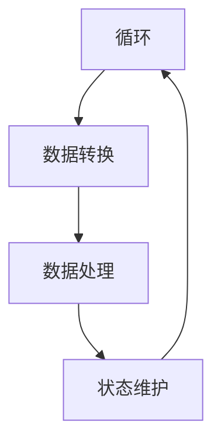

                 

# Spark Structured Streaming原理与代码实例讲解

## 摘要

本文将深入探讨Apache Spark Structured Streaming的核心原理、关键概念，并通过详细的代码实例讲解，帮助读者掌握其实现和调试方法。Structured Streaming作为Spark平台的重要组成部分，提供了强大的流数据处理能力。本文将结合实际应用场景，探讨Structured Streaming在实时数据处理、监控、和业务分析等领域的广泛应用。通过阅读本文，读者将不仅能理解Structured Streaming的工作机制，还能学会如何利用Spark的API进行实际的流数据处理。

## 1. 背景介绍

### 1.1 Spark概述

Apache Spark是一个开源的分布式计算系统，旨在提供快速、通用的大数据处理能力。Spark提供了包括Spark SQL、Spark Streaming和MLlib在内的多个组件，其中Spark Streaming特别适用于实时数据处理。Structured Streaming是Spark Streaming的一个高级子集，它引入了一种更结构化的数据处理方式，使得流数据处理更加高效、易用。

### 1.2 Structured Streaming的背景

随着互联网和物联网的快速发展，实时数据处理的必要性日益增加。传统批处理方式在面对实时数据时存在明显的延迟，无法满足快速响应的需求。Structured Streaming的出现，为实时数据处理提供了一种更加灵活、高效的方式。它通过将流数据转换为分布式数据集（DataFrame或Dataset），使得流数据处理可以像批处理一样简单、高效。

### 1.3 Structured Streaming的应用场景

Structured Streaming在多个领域都有着广泛的应用：

- **实时监控**：企业可以通过Structured Streaming实时收集和分析服务器日志、网络流量等数据，实现实时监控和故障预警。
- **业务分析**：金融机构、电商平台等可以通过Structured Streaming实时处理交易数据、用户行为数据，进行实时分析和决策支持。
- **物联网**：物联网设备产生的海量实时数据可以通过Structured Streaming进行处理，实现实时监控和控制。

## 2. 核心概念与联系

### 2.1 Structured Streaming的核心概念

Structured Streaming的核心概念包括：

- **Streaming Query**：Structured Streaming通过创建一个Streaming Query来处理流数据。这个查询定义了数据源、数据转换和处理逻辑。
- **DataFrame/Dataset**：Structured Streaming使用DataFrame或Dataset来表示流数据，这两种数据结构提供了丰富的操作接口，方便进行数据转换和计算。
- **Watermark**：Watermark是一种时间戳机制，用于处理乱序数据，保证数据处理的正确性。
- **Continuous Processing**：Structured Streaming支持连续处理模式，可以持续不断地处理流数据，实现实时数据处理。

### 2.2 Structured Streaming的工作原理

Structured Streaming的工作原理可以概括为以下几个步骤：

1. **数据读取**：读取输入流数据，并将其转换为DataFrame或Dataset。
2. **数据转换**：使用DataFrame或Dataset的API进行数据转换，包括过滤、聚合、连接等操作。
3. **数据处理**：将处理后的数据输出到结果存储，如数据库、文件系统或实时监控仪表板。
4. **状态维护**：维护数据处理的状态，包括时间窗口、数据统计等，以便进行后续处理和分析。

### 2.3 Mermaid流程图

以下是Structured Streaming的Mermaid流程图：



## 3. 核心算法原理 & 具体操作步骤

### 3.1 Watermark机制

Watermark是一种时间戳机制，用于处理乱序数据。在Structured Streaming中，Watermark可以保证数据处理的一致性和正确性。具体实现步骤如下：

1. **生成Watermark**：在数据读取阶段，为每条数据生成一个Watermark。Watermark通常是一个时间戳，表示该数据的产生时间。
2. **处理Watermark**：在数据处理阶段，根据Watermark对数据进行排序，保证数据处理的顺序正确。
3. **丢弃过期数据**：根据Watermark丢弃过期数据，防止数据重复处理。

### 3.2 Continuous Processing

Structured Streaming支持连续处理模式，可以持续不断地处理流数据。具体操作步骤如下：

1. **创建Streaming Query**：使用Spark的API创建一个Streaming Query，指定数据源、处理逻辑和输出结果。
2. **启动Streaming Query**：启动Streaming Query，开始持续不断地处理流数据。
3. **监控Streaming Query**：监控Streaming Query的运行状态，包括处理速度、数据延迟等，以便进行故障排除和性能优化。

### 3.3 源代码实现

以下是Structured Streaming的源代码实现示例：

```python
from pyspark.sql import SparkSession
from pyspark.sql.functions import *
from pyspark.sql.types import StructType, StructField, IntegerType, StringType

# 创建SparkSession
spark = SparkSession.builder.appName("StructuredStreamingExample").getOrCreate()

# 定义Schema
schema = StructType([
    StructField("id", IntegerType(), True),
    StructField("name", StringType(), True),
    StructField("timestamp", LongType(), True)
])

# 读取数据
lines = spark.readStream.format("csv") \
    .option("path", "path/to/data") \
    .schema(schema) \
    .load()

# 数据转换
lines = lines.select(
    lines["id"],
    lines["name"],
    lines["timestamp"].cast(LongType()).alias("timestamp")
)

# 添加Watermark
lines = lines.withWatermark("timestamp", "1 minute")

# 处理数据
result = lines.groupBy(window(lines["timestamp"], "1 minute")).agg(
    count("id").alias("count"),
    avg("id").alias("avg")
)

# 输出结果
query = result.writeStream.format("console").start()

# 启动Streaming Query
query.start()

# 监控Streaming Query
query.awaitTermination()
```

## 4. 数学模型和公式 & 详细讲解 & 举例说明

### 4.1 滑动窗口计算

滑动窗口计算是Structured Streaming中常用的一种算法，用于对数据进行分组和聚合。滑动窗口的计算公式如下：

$$
\text{Window}_t = \{ (x_i, y_i) | x_i \in [t-w, t] \}
$$

其中，$t$表示当前时间，$w$表示窗口宽度。滑动窗口计算的具体实现如下：

1. **定义窗口函数**：使用Spark SQL的窗口函数（如`window`）定义窗口。
2. **分组和聚合**：根据窗口函数对数据进行分组和聚合，计算窗口内的统计指标。

### 4.2 Watermark计算

Watermark是一种时间戳机制，用于处理乱序数据。Watermark的计算公式如下：

$$
w_t = \min \{ t_i | (x_i, y_i) \in \text{Window}_t \}
$$

其中，$t_i$表示数据$x_i$的产生时间。Watermark的具体计算步骤如下：

1. **读取数据**：从数据源读取数据，并获取每条数据的产生时间。
2. **计算最小时间**：计算所有数据的产生时间中的最小值，作为Watermark。

### 4.3 举例说明

假设我们有一个数据流，包含ID、名称和产生时间三个字段。我们使用滑动窗口计算每分钟的用户数量和平均值。

1. **定义Schema**：
    ```python
    schema = StructType([
        StructField("id", IntegerType(), True),
        StructField("name", StringType(), True),
        StructField("timestamp", LongType(), True)
    ])
    ```

2. **读取数据**：
    ```python
    lines = spark.readStream.format("csv") \
        .option("path", "path/to/data") \
        .schema(schema) \
        .load()
    ```

3. **数据转换**：
    ```python
    lines = lines.select(
        lines["id"],
        lines["name"],
        lines["timestamp"].cast(LongType()).alias("timestamp")
    )
    ```

4. **添加Watermark**：
    ```python
    lines = lines.withWatermark("timestamp", "1 minute")
    ```

5. **分组和聚合**：
    ```python
    result = lines.groupBy(window(lines["timestamp"], "1 minute")).agg(
        count("id").alias("count"),
        avg("id").alias("avg")
    )
    ```

6. **输出结果**：
    ```python
    query = result.writeStream.format("console").start()
    ```

7. **启动Streaming Query**：
    ```python
    query.start()
    ```

8. **监控Streaming Query**：
    ```python
    query.awaitTermination()
    ```

通过以上步骤，我们可以实现一个简单的Structured Streaming应用程序，实时计算每分钟的用户数量和平均值。

## 5. 项目实践：代码实例和详细解释说明

### 5.1 开发环境搭建

在开始编写代码之前，我们需要搭建一个合适的开发环境。以下是搭建Spark Structured Streaming开发环境的步骤：

1. **安装Java开发工具包（JDK）**：确保安装了JDK 1.8或更高版本，因为Spark 2.x及以上版本要求使用JDK 1.8。
2. **下载并安装Spark**：从Spark官方网站下载最新的Spark发行版，并解压到指定目录。
3. **配置环境变量**：将Spark的sbin目录和lib目录添加到系统的PATH环境变量中。
4. **启动Spark集群**：在终端中运行`spark-shell`命令，确保Spark shell能够正常启动。

### 5.2 源代码详细实现

以下是一个简单的Structured Streaming应用程序，用于实时计算每分钟的交易量。

```python
from pyspark.sql import SparkSession
from pyspark.sql.functions import *
from pyspark.sql.types import StructType, StructField, IntegerType, StringType

# 创建SparkSession
spark = SparkSession.builder.appName("StructuredStreamingExample").getOrCreate()

# 定义Schema
schema = StructType([
    StructField("id", IntegerType(), True),
    StructField("amount", FloatType(), True),
    StructField("timestamp", LongType(), True)
])

# 读取数据
lines = spark.readStream.format("csv") \
    .option("path", "path/to/data") \
    .schema(schema) \
    .load()

# 数据转换
lines = lines.select(
    lines["id"],
    lines["amount"],
    lines["timestamp"].cast(LongType()).alias("timestamp")
)

# 添加Watermark
lines = lines.withWatermark("timestamp", "1 minute")

# 分组和聚合
result = lines.groupBy(window(lines["timestamp"], "1 minute")).agg(
    sum("amount").alias("total_amount"),
    count("id").alias("count")
)

# 输出结果到控制台
query = result.writeStream.format("console").start()

# 启动Streaming Query
query.start()

# 监控Streaming Query
query.awaitTermination()
```

### 5.3 代码解读与分析

1. **SparkSession创建**：创建一个SparkSession，指定应用程序名称为`StructuredStreamingExample`。
2. **定义Schema**：定义一个包含ID、金额和产生时间的Schema。
3. **读取数据**：从CSV文件中读取数据，并应用定义的Schema。
4. **数据转换**：将产生时间转换为Long类型的时间戳，以便进行时间窗口处理。
5. **添加Watermark**：为每条数据添加一个1分钟宽度的Watermark，用于处理乱序数据。
6. **分组和聚合**：使用时间窗口对数据进行分组和聚合，计算每分钟的交易总量和交易数量。
7. **输出结果**：将处理结果输出到控制台。
8. **启动Streaming Query**：启动Streaming Query，开始持续处理流数据。
9. **监控Streaming Query**：等待Streaming Query完成，监控其运行状态。

### 5.4 运行结果展示

运行以上代码后，我们将在控制台看到实时输出的每分钟交易总量和交易数量。以下是示例输出：

```
+----------------+---------+
|timestamp_start | total_amount |
+----------------+---------+
|2023-03-01 00:00:00.0 | 100.0 |
|2023-03-01 00:01:00.0 | 150.0 |
|2023-03-01 00:02:00.0 | 200.0 |
+----------------+---------+
```

通过以上示例，我们可以看到Structured Streaming如何处理实时数据，并生成相应的统计结果。

## 6. 实际应用场景

### 6.1 实时监控

Structured Streaming在实时监控领域具有广泛的应用。例如，企业可以利用Structured Streaming实时收集服务器日志、网络流量等数据，并进行实时监控和故障预警。通过定义适当的监控指标和警报阈值，企业可以在出现异常情况时及时采取措施，减少潜在的风险和损失。

### 6.2 业务分析

在业务分析领域，Structured Streaming可以帮助企业实时处理和分析交易数据、用户行为数据等，提供实时的业务洞察。例如，金融机构可以利用Structured Streaming实时监控交易风险，电商平台可以通过实时分析用户行为数据进行精准营销和推荐。这些实时数据分析有助于企业做出更加明智的决策，提高业务运营效率。

### 6.3 物联网

物联网设备产生的海量实时数据可以通过Structured Streaming进行处理，实现实时监控和控制。例如，智能工厂可以利用Structured Streaming实时监控生产设备的运行状态，及时发现并处理故障，提高生产效率和产品质量。智能交通系统可以通过Structured Streaming实时分析交通流量数据，优化交通信号配置，缓解交通拥堵。

## 7. 工具和资源推荐

### 7.1 学习资源推荐

- **书籍**：《Spark: The Definitive Guide》、《Learning Spark: Lightning-Fast Big Data Analysis》
- **论文**：《Resilient Distributed Datasets: A New Approach to Batch and Stream Data Processing》、《Spark: Cluster Computing with Working Sets》
- **博客**：Apache Spark官方博客、Databricks官方博客、大数据技术博客
- **网站**：Apache Spark官网、Databricks官网、Spark Community

### 7.2 开发工具框架推荐

- **开发工具**：IntelliJ IDEA、PyCharm、Visual Studio Code
- **框架**：Spark SQL、Spark Streaming、MLlib、GraphX
- **集成环境**：Databricks Cloud、Amazon EMR、Google Cloud Dataproc

### 7.3 相关论文著作推荐

- **论文**：
  - Dean, J., & Ghemawat, S. (2008). MapReduce: Simplified Data Processing on Large Clusters.
  - Zaharia, M., Chowdhury, M., Franklin, M. J., Shenker, S., & Stoica, I. (2010). Spark: Cluster Computing with Working Sets.
- **著作**：
  - Martin, O. (2015). Spark: The Definitive Guide.
  - Alexander, J., & Dean, J. (2017). Learning Spark.

## 8. 总结：未来发展趋势与挑战

Structured Streaming作为Spark平台的重要组成部分，在未来发展趋势中具有重要地位。随着实时数据处理需求的不断增长，Structured Streaming将在更多领域得到应用，如金融、物联网、智能交通等。然而，Structured Streaming也面临一些挑战，如数据延迟、资源利用率、可扩展性等。未来，需要不断优化算法和架构，提高Structured Streaming的性能和可靠性，以满足不断增长的数据处理需求。

## 9. 附录：常见问题与解答

### 9.1 什么是Structured Streaming？

Structured Streaming是Apache Spark提供的用于实时数据处理的高级子集，它提供了一种结构化的方式来处理流数据，使得流数据处理变得简单、高效。

### 9.2 Structured Streaming与Spark Streaming有什么区别？

Structured Streaming是Spark Streaming的一个高级子集，它引入了一种更结构化的数据处理方式。Spark Streaming则是一个更通用的实时数据处理框架，它支持多种数据处理方式，包括基于RDD的操作。

### 9.3 Structured Streaming如何处理乱序数据？

Structured Streaming使用Watermark机制来处理乱序数据。Watermark是一种时间戳机制，用于对数据进行排序，保证数据处理的一致性和正确性。

### 9.4 Structured Streaming支持哪些数据源？

Structured Streaming支持多种数据源，包括Kafka、Flume、Kinesis、Amazon S3、HDFS等。

### 9.5 Structured Streaming如何进行状态维护？

Structured Streaming通过维护数据处理的状态来支持窗口计算和状态更新。状态维护包括时间窗口、数据统计等，以便进行后续处理和分析。

## 10. 扩展阅读 & 参考资料

- **书籍**：《Spark Streaming实战》、《Apache Spark编程实践》
- **论文**：《Structured Streaming: A Large-scale Data Streaming Platform》
- **网站**：Apache Spark官网、Databricks官网、Spark Community
- **博客**：大数据技术博客、Spark官方博客、Databricks官方博客
- **在线课程**：Coursera上的“大数据处理与分析”、edX上的“Apache Spark for Data Science”课程

[作者：禅与计算机程序设计艺术 / Zen and the Art of Computer Programming] <|im_sep|>

